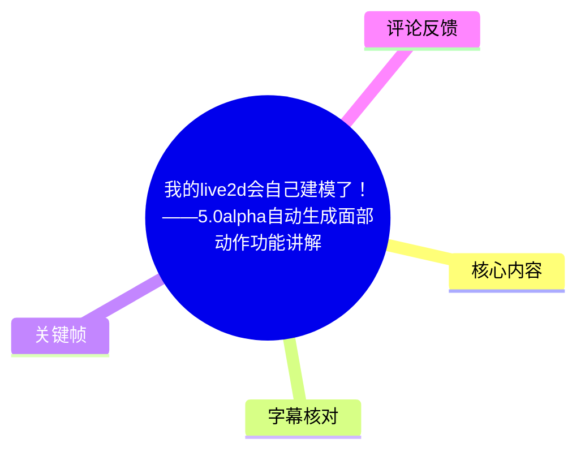
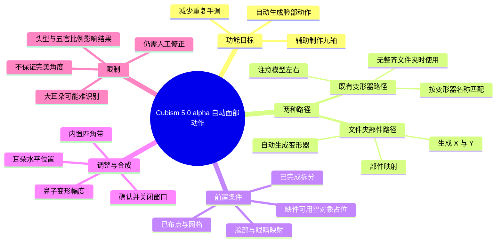
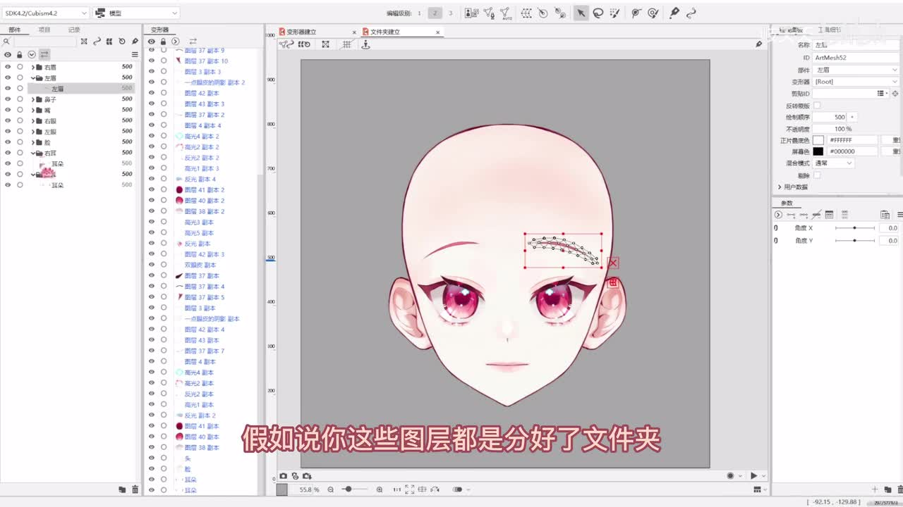
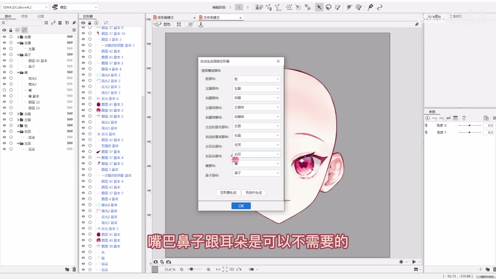
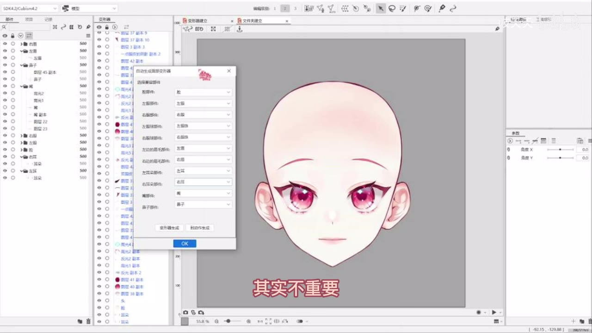
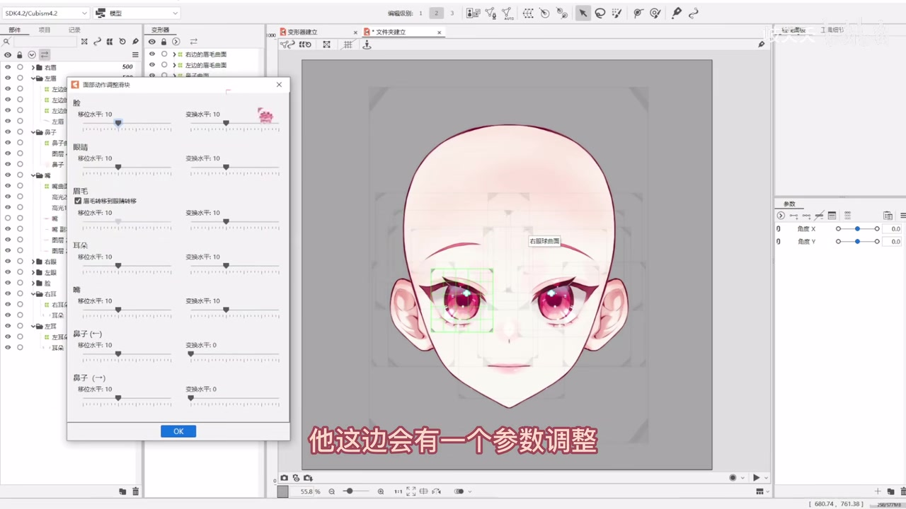

# 我的live2d会自己建模了！——5.0alpha自动生成面部动作功能讲解

> 来源：[Bilibili 视频](https://www.bilibili.com/video/BV1RT411q7ej) 
> UP 主：岐夭夭｜发布时间：2023-03-30｜视频时长：10:05｜合集：AIcode  
> 主题：Live2D Cubism 5.0 alpha 的「自动生成面部动作」功能，重点演示九轴脸部动作的两种生成路径。

## 小结

视频介绍了 Live2D Cubism 5.0 alpha 新增的自动面部动作生成功能。它面向已经完成基础拆分、布点和网格准备的模型，通过自动创建或利用已有变形器，辅助生成脸部 X、Y 方向及组合后的九轴动作。UP 主的实际体验是：生成结果总体优于其手动制作的效果，尤其能减少九轴制作中的重复性工作。

功能有两条工作路径。第一条是**文件夹部件路径**：当脸部图层已按脸、眼、眉、耳等部位归入对应文件夹时，在功能窗口中为各部件指定文件夹，先自动生成变形器，再生成 X、Y 动作。第二条是**既有变形器路径**：若项目没有整齐的文件夹结构、图层拆分顺序不适合按文件夹匹配，则直接选择已经套好的变形器生成动作。

关键经验是，部件映射不能只看画面左右，而要按**模型自身的左右**理解；这会与观看者视角左右相反。若映射错误，左眼、右眼、眉毛、耳朵等会被选反。对于缺少鼻子、嘴巴、眉毛、耳朵等图层的模型，视频给出的兼容办法是建立空曲面或空变形器占位，完成自动生成后可删除占位对象。

自动生成并非“一键完美”。耳朵位移、鼻子形变、非标准头型、大耳朵、方脸 Q 版等都可能出现识别或变形偏差；拆分质量、网格布点、头部轮廓和五官比例都会影响结果。视频建议将自动结果视为较好的初稿，再进行局部手调，而不是直接替代人工建模。

操作顺序上，UP 主特别建议使用工具自带的“四角带”流程完成组合，而不要在 X、Y 都确认后再进行普通“四角合成”。其观察是前者包含一定透视关系，九轴观感更好；普通四角合成则较为单纯，效果不如内置流程。

本视频发布于 2023 年、功能名称明确带有 **5.0 alpha**。alpha 版本的界面、部件要求、自动生成结果和功能入口均可能随正式版或后续更新改变。视频简介也提示应参照当时最新的官方版本说明，因此本文记录的是视频所示工作流，不应视为当前版本的固定规范。

## 思维导图

## 目录

- [背景、版本与适用范围](#背景版本与适用范围)
- [两种自动生成路径](#两种自动生成路径)
  - [文件夹部件路径：映射与占位](#文件夹部件路径映射与占位)
  - [文件夹部件路径：生成 X、Y 与九轴](#文件夹部件路径生成-xy-与九轴)
  - [既有变形器路径：适合图层结构较乱的项目](#既有变形器路径适合图层结构较乱的项目)
- [自动结果的调整、差异与限制](#自动结果的调整差异与限制)
- [可复用操作清单](#可复用操作清单)
- [结论与时效性](#结论与时效性)
- [字幕比对](#字幕比对)
- [评论分析](#评论分析)
- [处理记录](#处理记录)

## [背景、版本与适用范围](https://www.bilibili.com/video/BV1RT411q7ej?t=1)

视频开头说明，讲解对象是 Live2D 5.0 更新中的「自动面部动作」用法。这里的“自动”并不表示从一张原画直接生成完整 Live2D 模型，而是建立在已有模型素材与基础制作之上：图层需要已经拆分，相关对象需要已经完成布点、网格等准备；之后由功能自动辅助生成面部变形与 X、Y 方向的动作。

视频聚焦的是常被称为“九轴”的脸部转向效果：先制作或生成横向的 X 与纵向的 Y，再通过四角相关步骤组合出多方向转动的观感。UP 主将它定位为提高效率的工具，并没有宣称它能无条件代替人工建模。

从视频说明可归纳的适用对象：

- 已完成脸部部件拆分、且希望降低九轴制作门槛的新手；
- 需要快速获得可用脸部转向基础效果的模型师；
- 图层已经按部位归类，或已有合理变形器结构的项目；
- 能够接受生成后检查、调整耳朵、鼻子等局部形变的工作流。

不适用或需谨慎评估的情况包括：未完成网格与布点、脸部关键部件无法映射、追求完全可控的高精度商用成品，或角色头型、五官比例非常规且不愿进行人工修正的项目。

## [两种自动生成路径](https://www.bilibili.com/video/BV1RT411q7ej?t=8)

视频明确给出两种方式：

| 路径 | 输入基础 | 适合情况 | 视频所示核心动作 |
| --- | --- | --- | --- |
| 文件夹部件路径 | 图层已放入对应部位文件夹 | 项目层级清晰、部件归类完整 | 指定文件夹部件 → 自动生成变形器 → 生成 X/Y |
| 既有变形器路径 | 已有套好的变形器 | 文件夹结构混乱、拆分习惯不一致、没有文件夹 | 按名称选择变形器 → 映射左右部件 → 生成 X/Y |

两条路径的目标相同：为脸部动作建立可调的自动生成结果；区别主要在于功能从哪里读取部件结构。前者从文件夹识别兼容部件，后者直接使用既有变形器。

### [文件夹部件路径：映射与占位](https://www.bilibili.com/video/BV1RT411q7ej?t=25)

当每个图层已放在对应文件夹中，可从右侧的自动生成功能选择文件夹。视频将此处的“部件”解释为文件夹：需要为脸、左右眼、左右眼球、左右眉、左右耳等项目进行对应选择。

> 图：画面左侧展示按脸、眉、耳等部件组织的层级，中央为已具备基础网格的脸部。它说明文件夹路径依赖清楚的部件归类与网格准备，而非直接处理未经整理的原始图层。

视频对部件要求有两层表述：

1. 在初始说明中，**脸和眼睛**是必须存在的部件；眉毛、嘴巴、鼻子、耳朵可以留空。
2. 随后的实操提醒中，UP 主又指出若眼睛、眉毛、鼻子、嘴巴、脸等基础项目没有填入，自动面部动作可能无法执行，因而建议尽可能让对应栏位“有东西可以填”。

这两段说法存在一定张力。按视频的保守实践，应优先把界面中可映射的关键栏位尽量补齐，而不能仅依据“可选”字样完全留空。

> 图：窗口中可见脸、左右眼、左右眼球、眉、耳、嘴、鼻等下拉映射项目。该画面直接说明“部件”需要由用户手动指定，并非功能自行无误识别所有图层。

#### 缺少部件时的占位策略

如果模型只存在眼睛，耳朵、鼻子、嘴巴、眉毛等部件缺失，视频建议：

1. 建立若干**空曲面**或**空变形器**；
2. 让空对象分别代替缺失部件，填入对应选择栏；
3. 执行自动面部动作生成；
4. 若这些占位对象不再需要，可在生成完成后删除。

UP 主强调，曲面下面实际放了什么图层并不重要；可以拿其他图层暂代，也可以完全使用空对象。这个方法的目的不是伪造实际绘制部件，而是满足自动功能对输入映射的要求。

> 图：部件映射窗口覆盖在脸部画布上，画面字幕强调“其实不重要”。其价值在于佐证视频的占位原则：自动生成阶段更关注可被填入的映射对象，而非该对象下方是否一定含有对应的实际绘制内容。

### [文件夹部件路径：生成 X、Y 与九轴](https://www.bilibili.com/video/BV1RT411q7ej?t=122)

完成部件选择后，文件夹路径的前提是：相关对象已经布点、铺好网格。随后点击变形器生成，功能会为所选部件自动生成相应曲面／变形器。

视频展示的工作顺序为：

1. 选择兼容部件，即相应文件夹；
2. 确认已完成网格准备；
3. 点击生成变形器；
4. 基于自动生成的曲面，先生成脸部 **X** 动作；
5. 在参数窗口中检查并调整局部效果；
6. 确认 X 后，继续生成 **Y** 动作；
7. 使用功能自带的“四角带”完成组合流程；
8. 点击 `OK` 确认。

在 X 方向生成时，视频展示了参数调整界面。UP 主举例称耳朵位置可能不对，可调节其水平位置；鼻子若变形不足，可进一步提高鼻子的变形程度。此处调整针对的是自动生成的曲面形变幅度与位置，而不是重新从零制作全部参数。

> 图：参数窗口中可分别调整脸、眼睛、眉毛、耳朵、嘴、鼻子等项目的“移位水平”和“变形水平”。该画面说明自动生成提供的是可编辑结果，局部修正是流程的一部分。

#### 为什么建议使用内置“四角带”

视频建议不要在 X、Y 都确认后再单独进行普通“四角合成”，而应使用工具自带的“四角带”流程。UP 主基于演示结果的判断是：

- 内置“四角带”包含一定透视关系；
- 生成出的九轴观感优于其手动制作结果；
- 普通“四角合成”是较单纯的合成，不会像前者一样产生自动生成曲面的动作效果；
- 两种方式的最终视觉效果存在可见差别。

这是视频作者基于所示模型的经验判断，未提供功能算法或量化对比数据。因此可将其作为优先尝试的操作建议，而非适用于所有模型的严格结论。

### [既有变形器路径：适合图层结构较乱的项目](https://www.bilibili.com/video/BV1RT411q7ej?t=278)

第二种方式面向没有合适文件夹结构的模型。视频举例：眼睛眨眼、嘴巴张闭等已做完后，相关内容可以合到一个变形器中；此时对象外部本身已有变形器，即可直接利用这些变形器生成面部动作。

这条路径适合以下情形：

- 项目中没有文件夹；
- 图层太乱，未放进对应部件文件夹；
- 拆分人员和建模人员的工作顺序、命名和层级习惯不一致；
- 文件夹顺序不利于按第一种方式操作。

操作要点：

1. 记住或整理各部位对应的变形器名称；
2. 进入面部动作生成，而不是依赖文件夹部件；
3. 按名称为脸、眼、眉、耳、嘴、鼻等指定相应变形器；
4. 生成 X，再根据需要调整；
5. 生成 Y；
6. 依旧按内置“四角带”流程完成，并在结束后点击 `OK` 关闭窗口。

#### 左右映射：按模型左右，不按观众左右

视频在这一部分特别强调，自动面部生成功能的左右对应遵循**模型的左右**。也就是说，画面中观看者看到的“右边眼睛”，可能是角色／模型自身的“左眼”。

因此，若项目中的变形器命名是以画面观察方向建立的，就会出现需要反向选择的情况。UP 主在示例中明确指出：

- 模型左眼在观看者视角可能位于右侧；
- 映射时可能需要“左眼对右眼、右眼对左眼”；
- 左右眉、左右耳也同样需要核对；
- 不要仅根据画面位置下结论，应以模型定义和变形器命名为准。

这是直接影响生成正确性的关键检查项。左右选反可能不会阻止功能运行，但会导致运动方向、局部位移与预期不符。

## [自动结果的调整、差异与限制](https://www.bilibili.com/video/BV1RT411q7ej?t=406)

视频并未将生成结果描述为完美成品，而是持续展示“生成—检查—手调”的过程。

### 常见可调问题

| 问题 | 视频归因或表现 | 视频给出的处理方向 |
| --- | --- | --- |
| 耳朵位置不对 | 耳朵水平位移不自然 | 调整耳朵的水平位置 |
| 鼻子变形不够或过大 | 鼻部形变幅度与画风不匹配 | 调节鼻子变形度／手动修正 |
| 耳部仍有偏差 | 可能与个人拆分方式有关 | 手动调整，并检查布点 |
| 九轴幅度有限 | 自动结果幅度不是很大 | UP 主认为多数情况下已够用 |
| 大耳朵难识别 | 特殊大耳朵造型可能无法正确识别 | 预期需要额外人工处理 |
| 头型不一致 | 自动效果与原模型头型存在偏差 | 在可调范围内自行修正 |

视频还提到，若使用文件夹部件自动生成曲面，生成结构中会套入三个变形器；UP 主表示不清楚具体原理，但其主观观察是：相较直接用既有变形器控制，文件夹方式的九轴弧度更好看、更贴近自己偏好的效果。该“套三个变形器”是作者对所示结果的观察，不应延伸为未验证的内部实现机制。

### 脸型、五官与网格决定上限

自动面部动作无法完全符合所有角色设计。视频明确指出，下列因素会影响九轴与面部动作生成：

- 脸型是否标准；
- 五官绘制与比例；
- 头部轮廓形状；
- 部件拆分质量；
- 网格自动生成与手动布点情况。

UP 主展示了一个此前未手工制作九轴、网格也自动生成的头部案例，并认为眉毛的自动布点效果较好；但该头型与其模型本身不完全一致，因此九轴仍出现轻微偏差。视频还展示方脸 Q 版案例，说明此类脸型也能生成动作，但鼻子变形可能偏大，需要自行修正。

结论是：自动功能可以生成可用基础，但不同脸型最终的动作幅度和视觉效果不同。它降低的是制作难度和重复劳动，不会消除美术设计、拆分与人工调优对质量的影响。

## [可复用操作清单](https://www.bilibili.com/video/BV1RT411q7ej?t=98)

以下清单依照视频实际顺序整理，适用于将自动生成结果作为九轴初稿的工作流。

### 路径 A：按文件夹部件生成

1. **整理层级**：把脸部相关图层放入对应文件夹。
2. **准备网格**：确保将参与生成的对象已完成布点与网格。
3. **打开自动面部动作功能**：在界面中选择文件夹作为兼容部件。
4. **映射部件**：至少核对脸、眼睛；尽量按界面要求补齐左右眼球、眉、耳、嘴、鼻等项目。
5. **处理缺件**：没有实际部件时，建立空曲面或空变形器作为临时占位。
6. **生成变形器**：让功能为已选部件建立相应曲面／变形器。
7. **生成 X**：观察横向转动效果，调整耳朵水平位置、鼻子变形幅度等。
8. **确认 X**：满意后点击确认。
9. **生成 Y**：检查纵向转动效果，必要时调整。
10. **执行“四角带”**：优先使用内置四角流程，而非事后普通四角合成。
11. **确认并关闭**：四角流程完成后点击 `OK`，关闭窗口。
12. **删除占位对象（如有）**：确认自动生成已完成且不再依赖后，才清理临时空对象。

### 路径 B：按既有变形器生成

1. **确认已有变形器结构**：例如眼睛眨眼、嘴巴张闭等已被合理归入外层变形器。
2. **整理或记录名称**：避免在映射窗口中选错对象。
3. **进入动作生成**：不依赖文件夹部件，直接选择变形器。
4. **核对模型左右**：以角色／模型自身左右为准，而非观众视角。
5. **逐项映射**：眼、眉、耳等左右对象尤其要检查是否反选。
6. **生成并调整 X**：重点观察耳朵、鼻子和脸部局部位移。
7. **生成并确认 Y**：保留认为合适的结果。
8. **使用内置“四角带”并点击 `OK`**：完成组合与窗口确认。
9. **整体复查**：检查九轴各方向是否有异常偏移、穿帮或不符合设计的形变。

## [结论与时效性](https://www.bilibili.com/video/BV1RT411q7ej?t=577)

视频的核心结论是：Cubism 5.0 alpha 的自动面部动作生成，对九轴脸部动作具有实际辅助价值，特别适合用来快速生成基础结果，再由模型师根据角色设计进行调整。UP 主的主观体验是它能解决许多九轴制作上的不便，且在演示案例中整体效果优于其手动制作的版本。

可迁移的经验包括：

- 先把结构、网格和部件映射准备好，自动化才能有效工作；
- 缺失部件时，空曲面／空变形器是可行的兼容占位方案；
- 左右映射必须以模型左右为准；
- 自动结果需要查看耳朵、鼻子及特殊部位；
- 内置“四角带”在视频案例中优于事后普通四角合成；
- 标准脸型、合理比例和较好的拆分／布点通常更有利于生成质量。

限制同样明确：

- 无法保证“完美角度”；
- 大耳朵、方脸、特殊轮廓等可能出现识别或幅度偏差；
- 自动结果仍受美术拆分、网格质量与角色造型约束；
- 对高质量商用模型而言，人工检查和手动精修仍不可省略；
- 视频所述版本为 5.0 alpha，后续版本可能调整功能入口、映射规则、参数和输出效果。

因此，本文不将视频中的界面与行为视为 2026 年仍然不变的产品规格；实际使用前应以当前 Live2D 官方版本说明和软件内帮助为准。

## [字幕比对](https://www.bilibili.com/video/BV1RT411q7ej?t=1)

| 字幕来源 | 完整性 | 专有名词与术语 | 时间轴 | 主要问题 |
| --- | --- | --- | --- | --- |
| Bilibili 站内字幕 | 覆盖 00:00:01.500 至 00:10:03.680，分段细，内容完整 | “变形器”“文件夹”“九轴”等多数术语较稳定 | 可直接用于章节定位，且分段更细 | 个别口语转写不顺，如“四角带”等术语缺少软件原文佐证 |
| 本次 ASR（medium） | 覆盖 00:00:01.230 至 00:10:03.620；诊断语音覆盖率 92.84%，无大间隙 | 多处术语误识别，如“变形器”被识别为“叶形器／变型器”，“文件夹”出现“文件家／文件箱”，“布点”被识别为“不点” | 有真实时间戳，时间覆盖与站内字幕基本一致 | 长句合并严重，存在错别字、漏词与同音误识别，不适合直接作为技术术语依据 |

本次 ASR 已实际检查：识别语言为中文，置信度为 `0.99853515625`，音频时长约 `604.578` 秒，诊断中**未标记** `noAudioStream=true`，且存在连续语音识别结果，说明素材有音轨可供识别。

最终采用策略为：

- **以站内字幕作为正文时间轴与主要文字依据**：其分段更细，术语整体更可读；
- **以本次 ASR 校验字幕覆盖与语义连续性**：ASR 起止约为 1.23 秒至 603.62 秒，与站内字幕覆盖范围相近；
- **结合关键帧修正术语语境**：画面中的部件映射窗口、参数调整窗口支持“文件夹部件”“变形器生成”“水平位移／变形程度”等操作语境；
- 对“四角带”等无法由画面文字完全核实的软件术语，保留视频字幕原貌，不擅自改写为其他功能名称。

## [评论分析](https://www.bilibili.com/video/BV1RT411q7ej?t=577)

以下仅分析可获取的热评前三条；评论反映的是用户观点，不作为功能性能或行业影响的已验证事实。

1. **豹炸就是藝術｜123 赞**  
   > “用來糊弄幾十塊的驚喜包還過得去，正經的商單還是要乖乖搓九軸”

   观点是自动生成更适合低预算、低要求的快速产出，正式商业订单仍应手工制作九轴。该评论与视频中“功能暂时不能完美取代手搓”的表述方向一致，但“适合什么价格订单”属于评论者的主观商业判断，视频未提供质量标准或商业项目对比，不能据此推导该工具不适用于所有商单。

2. **咕隔壁｜135 赞**  
   > “大概节省了不到百分之3的时间”

   该评论质疑效率提升幅度，认为自动功能节省的时间有限。视频没有统计从拆分、布点到最终修正的完整耗时，也没有与手工流程进行量化对照，因此无法验证“不到 3%”这一数字。它提示了一个实际问题：若模型前期整理、映射和后期修正成本较高，自动化带来的净节省时间可能因项目而异。

3. **猫必猫｜58 赞**  
   > “如果真的能变成生产力，各位不会觉得自己还能接到单吧”

   评论关注自动化对模型师接单与就业的潜在影响。视频作者对此的态度较为谨慎：功能只覆盖脸部若干重要部位的自动匹配，暂时不完美取代手工制作，模型师仍需要处理拆分、网格、审美控制和修正。评论提出的是行业焦虑与假设性问题，不能从本视频演示直接证明自动化会替代人工岗位。

## [处理记录](https://www.bilibili.com/video/BV1RT411q7ej?t=1)

- Worker ID：`worker-mrj0wjed-b0c290ad`
- 生成模型：`gpt-5.6-terra`
- 素材与工具结果：使用任务提供的 Bilibili 元数据、站内 SRT、ASR 结果 JSON／SRT、关键帧素材与热评 JSON；ASR 模型标记为 `medium`，运行设备为 CUDA，计算类型为 float16。
- 字幕选择：站内字幕作为正文主时间轴和主文本；本次 ASR 用于覆盖诊断与交叉核对。ASR 存在较多技术术语误识别，未直接采用其错词表述。
- 时间轴依据：章节链接优先按站内 SRT 的真实起止时间换算秒数；例如文件夹实操从 00:00:25.320 对应约 25 秒，既有变形器路径从 00:04:38.040 对应约 278 秒。
- 关键帧选择依据：`frame-001` 用于说明文件夹层级与网格前置条件；`frame-002`、`frame-003` 用于说明部件映射与占位逻辑；`frame-004` 用于说明自动生成后的可调参数。未使用其余帧，是因为所提供的可见关键帧已覆盖本视频最关键的四类界面信息。
- 热评范围：仅处理可获取热评前三条，未延伸分析其他评论。
- 缓存清理：任务素材中未提供缓存清理的执行记录；本文不虚构已清理的缓存或文件。
- 未解决问题：视频未解释自动生成内部算法；“四角带”对应的官方功能名称未能仅凭现有文字与画面完全核实；5.0 alpha 后续版本的功能变化不在本素材覆盖范围内。

## 评论分析

- 热评 1：用來糊弄幾十塊的驚喜包還過得去 正經的商單還是要乖乖搓九軸
- 热评 2：大概节省了不到百分之3的时间
- 热评 3：如果真的能变成生产力，各位不会觉得自己还能接到单吧

以上内容是观众反馈摘录，只用于补充理解视频反响，不作为正文事实依据。
