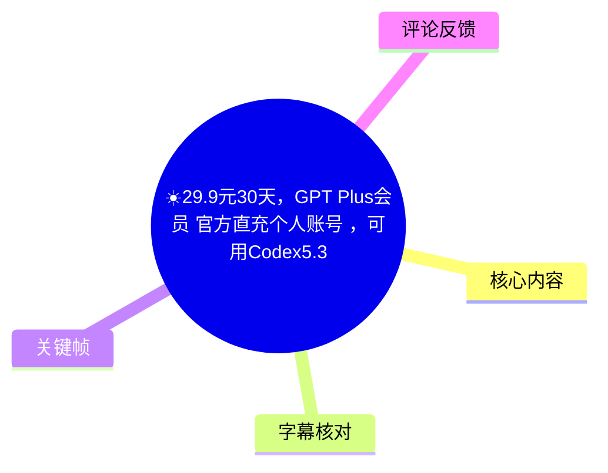
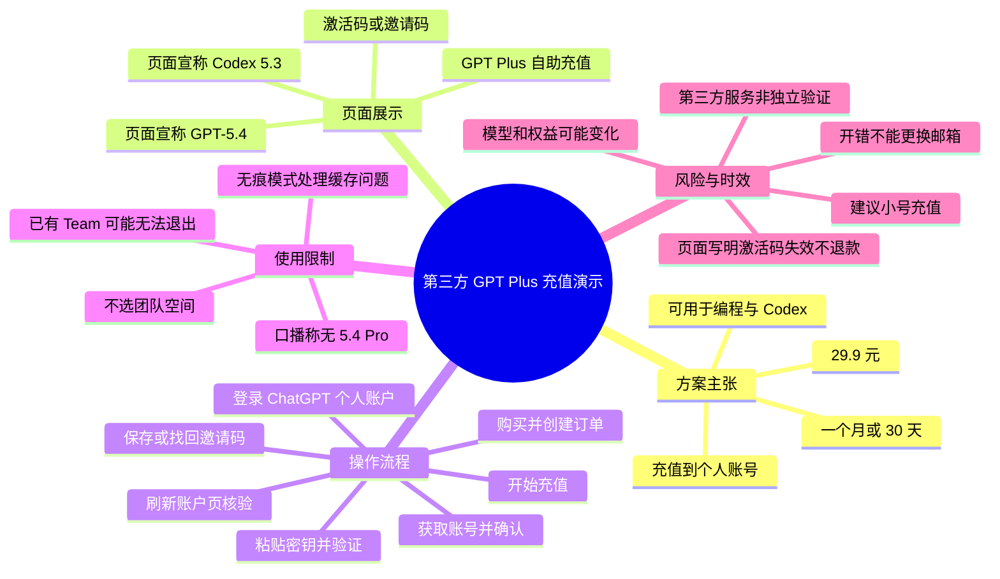
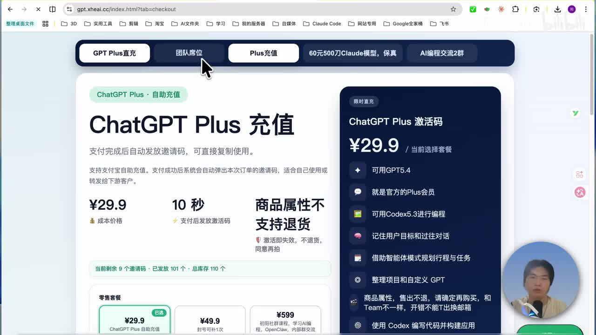
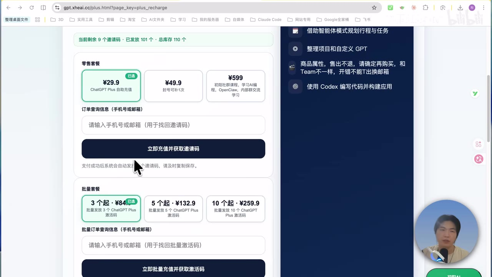

# ☀️29.9元30天，GPT Plus会员 官方直充个人账号 ，可用Codex5.3编程，5.4编程

> 来源：[Bilibili 视频](https://www.bilibili.com/video/BV1VSXjBBEXy)  
> UP 主：初阳AIAgent｜时长：2 分 53 秒｜合集：AIcode  
> 视频简介提供的链接：`gpt.xheai.cc`、`learn.xheai.cc`  
> **重要提示：**视频展示的是第三方网站的“充值/激活码”流程。视频标题、口播及页面中“官方”“直充”“可用模型”等均属于发布者或页面的主张，不构成对 OpenAI 官方渠道、订阅有效性、账号安全性或模型权限的独立验证。

## 小结

视频演示了一种面向个人 ChatGPT 账户的第三方“GPT Plus 自助充值”流程：购买后取得邀请码/密钥，在已登录 ChatGPT 的个人账户状态下进入所谓“充值站”，提交密钥、复制账户信息、确认账号并发起充值，最后刷新账户页检查订阅状态。

发布者口播称，该方案价格为 **29.9 元、有效期一个月（标题称 30 天）**，可以用于编程和 Codex；并称网页端可保留个人记录。画面中的销售页进一步宣称可用 GPT-5.4、Codex 5.3、记住目标与过往对话、使用智能体规划任务、整理项目和自定义 GPT，但这些能力、版本可用性及地区差异均未在视频内独立验证。

视频给出的关键限制也很明确：发布者称该方案不是 Team 团队席位；口播称“没有 5.4 Pro 可使用”，同时认为 Team 的 5.4 Pro 也较少。销售页还显示“商品属性不支持退货”“激活码失效，不退货，同意再拍”，并提示开错不能更换邮箱。因此，购买前应特别审查服务提供方身份、退款规则、账户条款和账号风险。

操作层面最重要的经验是：**登录时选择个人账户而非团队空间**；若既有 Team 空间导致无法退出，发布者建议使用浏览器无痕模式处理，并将问题归因于浏览器缓存或页面状态。发布者另建议使用“小号”充值，这反映其自身也意识到存在账户层面的不确定性；这不是官方安全建议。

本视频适合需要了解“视频中所示第三方激活码操作路径”的读者，不适合作为确认 OpenAI 产品定价、模型权限、官方订阅资格或账号安全性的权威依据。订阅价格、功能名称、可用模型、风控与服务条款都可能随时间变化。

## 思维导图

## 目录

- [方案定位、价格与页面声明](#方案定位价格与页面声明-0000)
- [视频所述权益与限制](#视频所述权益与限制-0010)
- [操作步骤：从下单到验证](#操作步骤从下单到验证-0044)
- [操作步骤：复制账户信息并发起充值](#操作步骤复制账户信息并发起充值-0137)
- [结果检查与 Team 空间问题](#结果检查与-team-空间问题-0224)
- [风险、限制与时效性](#风险限制与时效性)
- [字幕比对](#字幕比对)
- [评论分析](#评论分析)
- [处理记录](#处理记录)

## 方案定位、价格与页面声明 [00:00](https://www.bilibili.com/video/BV1VSXjBBEXy?t=0)

视频开场称要教学如何以“29.9”开通 GPT Plus 会员。发布者表示此前的 Team 团队席位“没有了”，目前展示的是另一种可直接使用的方案；其后演示的是第三方域名 `gpt.xheai.cc` 上的“ChatGPT Plus 充值”页面，而非视频中可见的 OpenAI 官方订阅结算界面。

画面中可见页面标签包括“GPT Plus直充”“团队席位”“Plus充值”，主区域标题为“ChatGPT Plus 充值”，右栏为“ChatGPT Plus 激活码”。该页展示的销售参数如下：

| 项目 | 页面或口播内容 | 证据性质 |
| --- | --- | --- |
| 单价 | ¥29.9 | 第三方页面展示 |
| 时长 | 标题称“30天”；口播称“一个月” | 发布者陈述，未见独立条款验证 |
| 发码速度 | 页面写“支付后发放激活码”，并显示“10秒” | 第三方页面展示 |
| 目标对象 | 发布者称直充到自己的个人账号 | 发布者陈述 |
| 模型/功能 | 页面声称可用 GPT-5.4、Codex 5.3 等 | 第三方页面营销文案 |
| 退款 | 页面写明商品属性不支持退货；激活码失效不退货 | 第三方页面展示 |

> 图：画面直接展示 `gpt.xheai.cc` 的充值页面、29.9 元价格、激活码说明及功能宣传。其价值在于区分“视频发布者/第三方页面的销售主张”与 OpenAI 官方产品信息，不能据此推定该渠道已获官方授权。

## 视频所述权益与限制 [00:10](https://www.bilibili.com/video/BV1VSXjBBEXy?t=10)

发布者在 [00:10](https://www.bilibili.com/video/BV1VSXjBBEXy?t=10) 至 [00:42](https://www.bilibili.com/video/BV1VSXjBBEXy?t=42) 说明其理解的权益差异：

1. **个人记录：**发布者称，在网页版中可以保留个人记录。
2. **编程与 Codex：**其称该方案可进行编程，Codex 等也可使用；但口播未具体展示 Codex 页面、调用次数、额度、模型选择器或实际编程结果。
3. **与 Team 的关系：**发布者称除个别差异外，“其他的话就是跟那个是一样的”；这只是发布者判断，视频没有给出可逐项核对的功能对照表。
4. **5.4 Pro 限制：**发布者明确称该方案“没有那个 5.4 Pro 可以使用”，并补充称 Team 团队的 5.4 Pro 也很少。这里应注意：页面右栏写的是“可用 GPT5.4”，与“5.4 Pro”并非完全相同的表述，视频未解释二者的正式产品定义、可用范围和差异。
5. **账号建议：**发布者建议用“小号”充值。该建议表明流程存在需自行评估的风险，但不能替代平台规则、服务商协议或官方客服确认。

> 图：页面右侧可见“可用GPT5.4”“可用Codex5.3进行编程”等文字，同时写有“商品属性，售出不退”“开错不能更换邮箱”。这张画面将功能宣传与交易限制并列呈现，是判断交易风险的关键依据。

## 操作步骤：从下单到验证 [00:44](https://www.bilibili.com/video/BV1VSXjBBEXy?t=44)

以下仅整理视频中展示的界面流程，**不代表推荐执行，也不证明该流程合规、稳定或安全**。

### 1. 购买后创建订单并保存邀请码

在 [00:44](https://www.bilibili.com/video/BV1VSXjBBEXy?t=44)，发布者称购买后创建订单，并复制邀请码。若邀请码被误关/误删，按其说法可在页面中通过订单查询入口找回；销售页画面中的查询字段为手机号或邮箱。

页面还显示批量套餐信息，例如“3个起：¥84”“5个起：¥132.9”“10个起：¥259.9”，但视频的实际演示重点是单个 ¥29.9 套餐，不应将批量套餐视为本次操作的必要条件。

### 2. 登录 ChatGPT，选择个人账户

在 [01:14](https://www.bilibili.com/video/BV1VSXjBBEXy?t=74)，发布者要求先登录“GPT 官网”，并特别强调选择**个人账户**，不要选择团队空间。视频中发布者已经处于登录状态，未展示登录凭据输入、地区可用性或账号资格检查过程。

### 3. 进入“充值站”，粘贴密钥并验证

在 [01:28](https://www.bilibili.com/video/BV1VSXjBBEXy?t=88)，发布者点击其称为“直达充值站”的入口，将前一步获得的密钥粘贴进去，然后点击“开始验证”。

这一环节涉及将邀请码/密钥提交至第三方页面。视频未展示密钥的生成机制、是否一次性、服务端如何处理账户信息、充值的实际支付主体，也未提供可复核的服务条款。因此，不能从演示本身推断账号信息、Cookie、授权令牌或支付关系的安全性。

## 操作步骤：复制账户信息并发起充值 [01:37](https://www.bilibili.com/video/BV1VSXjBBEXy?t=97)

### 4. 验证后点击“获取账号”

在 [01:37](https://www.bilibili.com/video/BV1VSXjBBEXy?t=97)，发布者称验证成功后点击“获取账号”，页面将跳转至新页面。随后他要求在新页面的空白处全选并复制内容。

### 5. 按操作系统全选、复制

视频口播给出的快捷键参数如下：

| 操作 | Windows | macOS |
| --- | --- | --- |
| 全选 | `Ctrl + A` | `Command + A` |
| 复制 | `Ctrl + C` | `Command + C` |

发布者特别提到 Windows 用户应先在下方空白处点击一下，再执行 `Ctrl + A`；其目的似乎是确保选中页面中的账户相关文本。视频没有说明所复制内容的字段构成，也没有展示是否包含邮箱、账户 ID、令牌或其他敏感数据。处理此类内容时不应向不可信页面提交登录凭据、会话 Cookie、双因素验证码或 API 密钥。

### 6. 粘贴识别结果、确认并继续

在 [02:08](https://www.bilibili.com/video/BV1VSXjBBEXy?t=128)，发布者将已复制内容粘贴回页面，称页面已识别到账号，随后点击“确认并继续”。

### 7. 点击“开始充值”并等待状态返回

在 [02:16](https://www.bilibili.com/video/BV1VSXjBBEXy?t=136)，发布者点击“开始充值”，等待页面运行，并在约 [02:24](https://www.bilibili.com/video/BV1VSXjBBEXy?t=144) 宣称充值成功。视频未展示交易流水、OpenAI 的付款记录、订阅管理页的完整细节或可验证的长期订阅状态，因此这里的“成功”仅是视频中当时页面/发布者的陈述。

## 结果检查与 Team 空间问题 [02:24](https://www.bilibili.com/video/BV1VSXjBBEXy?t=144)

充值后，发布者关闭当前页面并回到 ChatGPT 页面刷新，在 [02:49](https://www.bilibili.com/video/BV1VSXjBBEXy?t=169) 表示账户已开通，且为一个月。

同时，他补充了一种与既有 Team 空间有关的问题：若此前存在 Team 空间、无法退出团队空间，可尝试在**浏览器无痕模式**中退出。发布者将原因称为“你们的 bug 或浏览器缓存”。

这一建议的适用边界是：

- 视频没有给出具体报错信息、浏览器版本、操作系统、空间管理权限或复现条件。
- 无痕模式通常能隔离部分本地 Cookie、缓存和扩展影响，但不能保证解决团队权限、组织策略、服务端会话或订阅归属问题。
- 若涉及真实组织/团队账户，应优先通过该组织管理员和官方支持渠道确认，不宜在不明第三方充值流程中处理团队身份、账户归属或退出操作。

## 风险、限制与时效性

### 交易与账号风险

1. **渠道性质未获独立验证：**视频展示的域名是第三方站点。标题中的“官方直充”、页面中的“官方Plus会员”都是销售方或发布者的表述；素材中没有 OpenAI 授权证明、官方订单记录或服务协议证据。
2. **退款限制醒目：**页面明确写有“商品属性不支持退货”“激活码失效，不退货，同意再拍”。在付款前应完整保存商品页、订单、服务条款及售后承诺，并理解数字激活码的争议处理难度。
3. **邮箱与账户不可逆风险：**页面写有“开错不能更换邮箱”。应避免将重要主账号、工作账号或包含敏感资料的账户用于未经验证的第三方流程。
4. **敏感信息处理：**视频的“获取账号—全选—复制—粘贴”步骤没有公开解释数据类型和传输范围。若页面要求复制账户数据，更应确认是否会暴露会话、身份或访问凭据。
5. **账号条款与风控：**第三方代充、激活码、账户信息提交等方式可能与平台条款、区域限制或风险控制发生冲突。视频未提供对此的官方确认，后果应由使用者自行核验和承担。

### 功能与模型限制

- “GPT-5.4”“5.4 Pro”“Codex 5.3”等名称及可用性以视频当时口播和第三方页面为准；视频没有展示完整模型列表、额度、上下文、限流、地区限制或编程实测。
- 页面写“可用 GPT5.4”，但发布者口播称不能使用“5.4 Pro”。二者可能是不同产品标签，也可能是页面文案与实际权益不一致；在未看到官方账户页和产品文档前，不能把它们等同。
- 发布者称权益与 Team 大致相同，但 Team 与个人订阅在工作区、管理、共享、数据控制、模型及限额方面可能存在实际差异；本视频不足以完成比较。

### 时效性

视频元数据显示发布时间为 **2026-03-28**，素材抓取时间为 **2026-07-16**。价格、库存、邀请码规则、模型名称、发码速度、退款条款和订阅资格都具有高度时效性。本文只记录素材抓取时可见的内容，不对当前仍可购买、仍可用或仍具相同权益作保证。

## 字幕比对

| 字幕来源 | 完整性 | 专有名词 | 时间轴 | 主要问题 |
| --- | --- | --- | --- | --- |
| Bilibili 站内字幕 `p01-ai-zh.srt` | 高，覆盖 00:00:00.060–00:02:52.680，逐句分段 | 较好，能识别 GPT Plus、Team、Codex、Windows、Command 等；“5.4 Pro”表述可用 | 高，逐句起止时间可直接定位 | 存在口语重复、个别词句不够通顺，如“大家不需要懂了”可能是口误或转写误差 |
| 本次 ASR（medium） | 内容大体覆盖主要口播，但仅 8 个长段；诊断语音覆盖率为 75.89% | 较弱，`Ctrl` 被识别为“Country/County”，Team 被识别为“Tim”，复制/粘贴等有误字 | 较弱，首段从 00:00:33.160 才开始，和实际开场明显错位，且每段过长 | 首段将大量开场内容压缩至 0.48 秒；多处时间与站内字幕不一致，不宜用于章节精确定位 |

### 最终字幕选择

正文以**站内字幕**为主，因为其从 00:00 起连续覆盖，且具备可直接用于时间轴链接的短分段时间；本次 ASR 已按要求检查，但其时间定位和专有名词识别明显较差，仅用于交叉确认整体语义。

本次 ASR 诊断中**未标记 `noAudioStream=true`**，且素材清单包含 `audio/audio.wav`；因此不能将问题归于“源视频无音轨”。ASR 的主要问题是分段与对齐质量，而不是音轨缺失。

结合画面和上下文对关键术语作如下校正：

- ASR 的“Country/County 加 A/C”校正为 `Ctrl + A`、`Ctrl + C`。
- ASR 的“Tim”校正为 `Team`。
- 站内字幕中的“和DEX”依据上下文校正理解为 **Codex**。
- 页面文字显示“GPT5.4”“Codex5.3进行编程”；但这仅是页面可见文案，不作为真实权益的独立证明。

## 评论分析

本次素材中可获取热评共 **2 条**，未达到前三条；以下仅分析实际可取得的两条，不补写不存在的第三条。

1. **m1stake7（87 赞）**  
   评论者称自己购买 Plus 后，账户显示更新到 GPT-5.4，但仍只能使用 5.3；其猜测是否与 Outlook 邮箱有关，并担心向客服询问会被封号。  
   - **补充价值：**反映用户对“订阅状态已更新”与“特定模型实际可用”之间不一致的困惑，也显示用户担忧第三方购买渠道可能带来的客服或账号风险。  
   - **可信度边界：**这是个人描述，未附模型选择器、地区、账户类型、订阅状态或官方回复截图，无法确认模型不可用的真实原因，更不能据此推断 Outlook 邮箱导致限制。

2. **正在学习前端中（57 赞）**  
   评论者建议预算有限者不要购买 AI 公司订阅 token，转而使用 Trae CN、Qoder、CodeBuddy 等替代工具。  
   - **补充价值：**提出成本敏感用户可评估替代工具的观点，提醒订阅决策应考虑预算和使用频率。  
   - **可信度边界：**评论没有比较这些工具的功能、隐私、地域、额度、许可证或长期成本；它是消费建议，不是对本视频渠道或产品权益的事实验证。

## 处理记录

- **Worker ID：**`worker-mrj0wjed-b0c290ad`
- **整理模型：**`gpt-5.6-terra`
- **ASR 模型：**`medium`（语言识别：zh；languageProbability：0.99755859375；CUDA / float16）
- **使用的素材与工具产物：**视频元数据、站内字幕 `p01-ai-zh.srt`、本次 ASR 结果 `asr/asr-result.json` 与 `asr/transcript.srt`、12 张抽取关键帧、热评数据 `comments/comments.json`。
- **字幕选择：**采用站内字幕作为时间轴和逐步流程的主依据；已检查本次 ASR。ASR 未标记 `noAudioStream=true`，且音频文件存在，但因首段错位、长段压缩及专名误识别，不作为精确时间轴依据。
- **关键帧选择依据：**选用 `frames/frame-001.jpg` 呈现第三方充值页、29.9 元定价和激活码定位；选用 `frames/frame-004.jpg` 呈现套餐、功能宣称与“售出不退/不能更换邮箱”等限制。图片均用于核对页面可见文字，不将页面营销文案提升为已验证事实。
- **评论处理范围：**请求热评前三条，但实际仅获取 2 条；仅分析这 2 条。
- **缓存清理：**提供的素材与执行记录中没有缓存清理日志；无法确认是否执行过缓存清理，本文不虚构清理结果。
- **未解决问题：**无法从现有素材验证服务商与 OpenAI 的授权关系、实际扣款路径、邀请码机制、账户信息复制内容、订阅长期有效性、模型/额度可用性、退款执行情况及是否符合相关平台条款。
