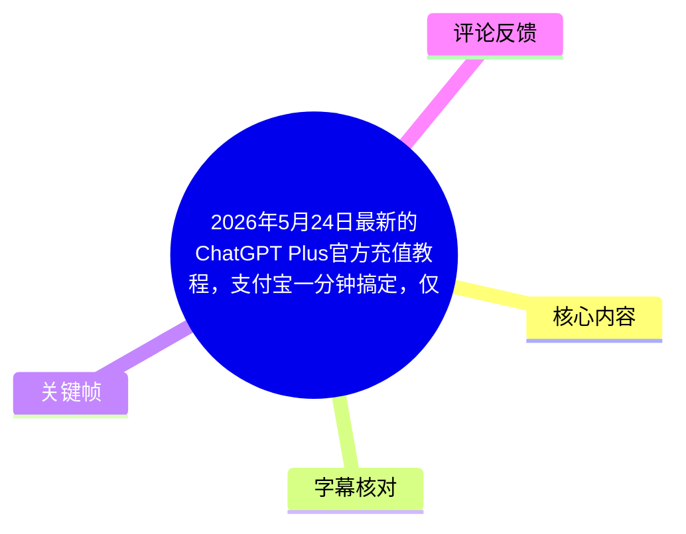
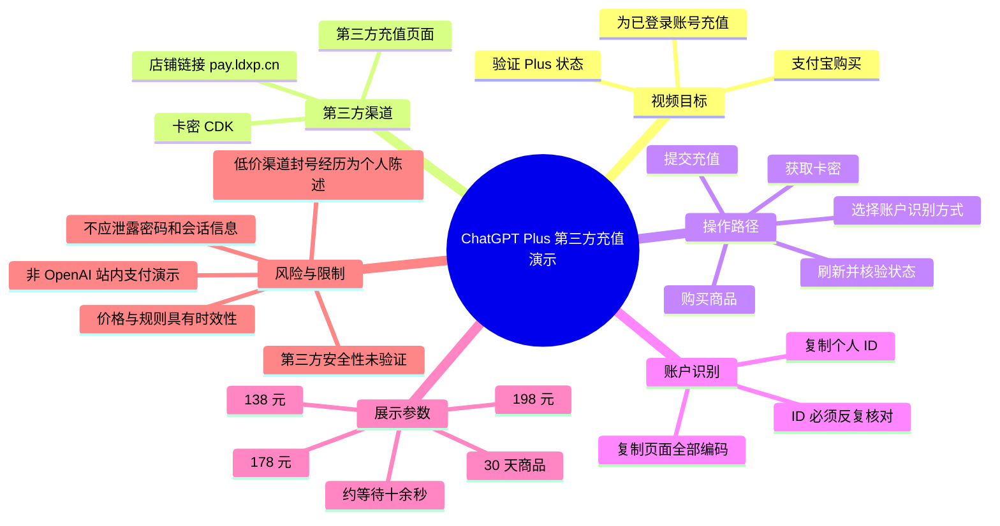
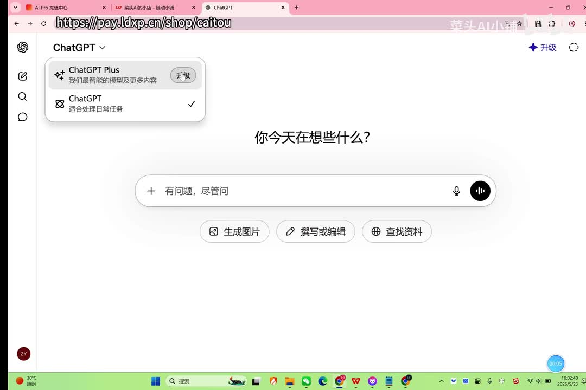
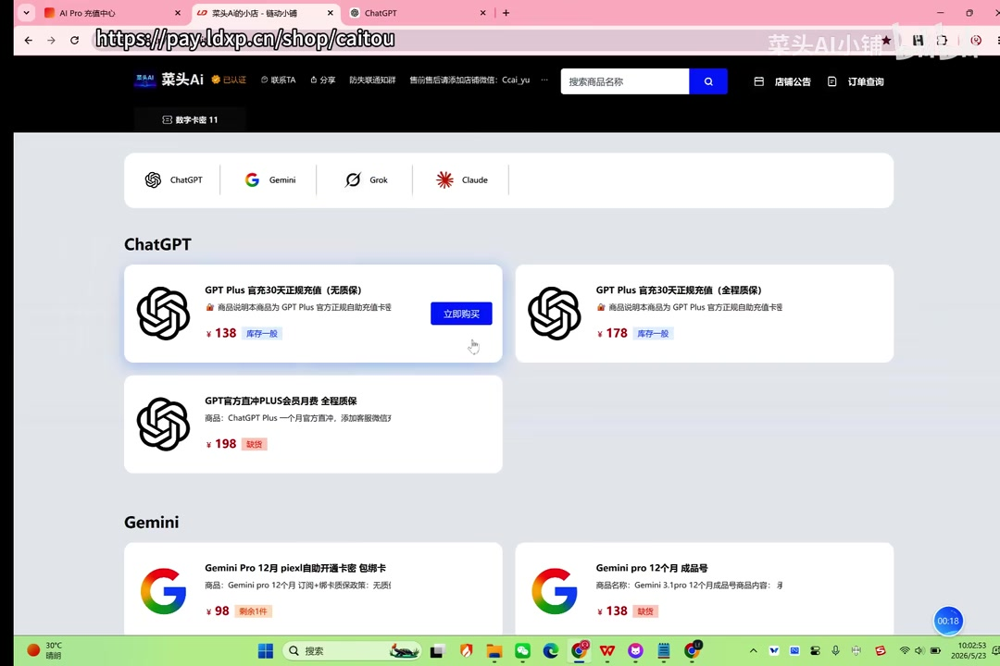
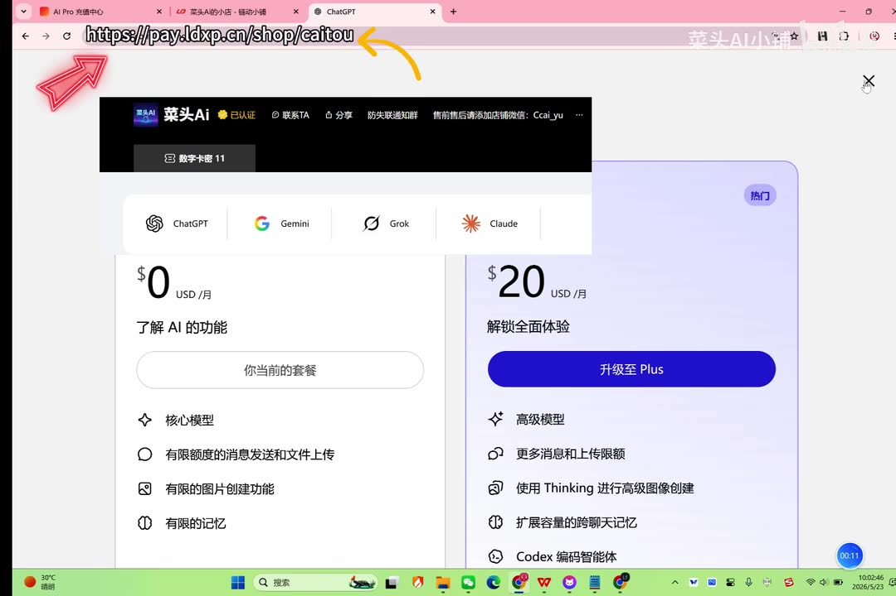
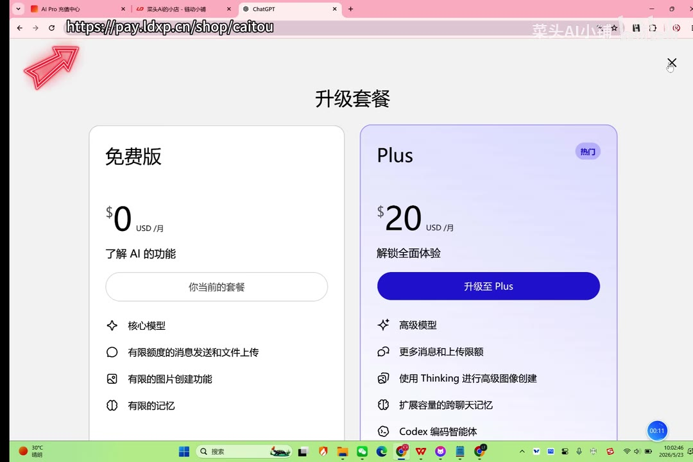

# 2026年5月24日最新的ChatGPT Plus官方充值教程，支付宝一分钟搞定，仅需个人账户id，安全高效，爽用codex和image2

> 来源：[Bilibili 视频](https://www.bilibili.com/video/BV197G66KEwk) 
> UP 主：菜头AI小铺｜时长：2 分 25 秒｜合集：AIcode  
> 视频简介提供的链接为：`https://pay.ldxp.cn/shop/caitou`

## 小结

视频演示的是通过一个第三方店铺购买卡密（CDK），再跳转至其充值页面，为已登录的 ChatGPT 账号开通或续费 Plus 的流程。UP 主称可使用支付宝付款，并表示该方式面向新手、操作难度较低。

视频中展示的店铺页面将商品标为“GPT Plus 官方 30 天正规充值”，可见价格包括 **138 元、178 元与 198 元**；但这些均为第三方页面的商品文案和报价，**不能据此证明其为 OpenAI 官方支付渠道、官方授权渠道或具有长期安全性**。视频标题中的“官方充值”与画面中的第三方域名之间存在需要读者自行审慎判断的差异。

实操上，视频给出两种识别账户的方式：一是从一个页面复制“所有编码”并粘贴到充值页；二是复制页面显示的 ID 并在充值页“应用”。UP 主特别提示，ID 方式不会展示账号供再次确认，因此提交前必须反复核对 ID 是否对应自己的账号。

UP 主以自身经历说明，曾因选择低价渠道导致旧账号被封，聊天记录和训练数据无法迁移、申诉也未成功；因此建议长期使用者不要贪图低价。此为视频发布者的个人陈述，未提供可独立核验的账号状态、交易凭证或平台支持记录。

完成提交后，视频称等待约十余秒会收到到账提示；返回 ChatGPT 首页刷新后可见 Plus 状态，并可在设置的账户区域查看 Plus 有效期。视频画面示例显示为一个月 Plus，但这不构成对所有订单都能成功到账或持续一个月的保证。

本视频发布于 2026 年 5 月，素材抓取于 2026 年 7 月。第三方价格、域名、商品库存、支付方式、ChatGPT 套餐界面、账号风控策略和地区可用性均可能随时变化；尤其不要向不明站点提供密码、验证码、Cookie、会话令牌或全量账户授权信息。

## 思维导图

## 目录

- [背景、范围与时效性](#背景范围与时效性-0026)
- [第三方店铺与商品展示](#第三方店铺与商品展示-0027)
- [购买卡密与进入兑换页](#购买卡密与进入兑换页-0051)
- [账户识别与提交充值](#账户识别与提交充值-0106)
- [到账后的 Plus 状态验证](#到账后的-plus-状态验证-0154)
- [完整操作清单与安全边界](#完整操作清单与安全边界-0027)
- [结论与限制](#结论与限制-0219)
- [字幕比对](#字幕比对)
- [评论分析](#评论分析)
- [处理记录](#处理记录)

## 背景、范围与时效性 [00:26](https://www.bilibili.com/video/BV197G66KEwk?t=26)

ASR 在 00:26.780 开始捕捉到口播。UP 主介绍的主题是“用支付宝开通 ChatGPT Plus”，并称流程适合新手。其实际展示并非在 OpenAI/ChatGPT 的标准订阅支付页面内直接使用支付宝，而是：

1. 访问视频简介中给出的第三方店铺；
2. 在店铺下单并支付；
3. 获得卡密与一个充值网址；
4. 在充值页面识别 ChatGPT 账户并提交充值。

因此，准确地说，这是一份**第三方代充/卡密兑换服务的使用演示**，而不是对 OpenAI 官方支付流程的说明。

UP 主称其在闲鱼找到该商家，并已连续充值一年多，评价为“稳定安全”。这属于个人经验，素材中未展示商家资质、OpenAI 授权材料、退款条款、订单保障机制或独立安全审计，不能将其外推为普遍事实。

> 图：画面展示 ChatGPT 首页左上方的套餐切换区域，其中可见“ChatGPT Plus”与“升级”入口。它用于说明视频最终要验证的是 ChatGPT 账户的 Plus 套餐状态，而不是第三方店铺自身的订单状态。

## 第三方店铺与商品展示 [00:27](https://www.bilibili.com/video/BV197G66KEwk?t=27)

UP 主先提醒自己曾因选择低价渠道而遇到旧账号被封的问题，称聊天记录与训练数据无法转出，申诉也未能找回。随后给出的经验判断是：若长期使用，应避免只按最低价选择渠道。这一提醒具有一定的风险意识，但不能反向证明视频展示渠道的安全性。

视频接着进入第三方店铺。画面中可读到该店铺提供 ChatGPT、Gemini、Grok、Claude 等多个品类，ChatGPT 区域至少出现以下商品与价格：

| 画面可见商品文案 | 画面价格 | 备注 |
| --- | ---: | --- |
| GPT Plus 官方 30 天正规充值（无质保） | 138 元 | 视频口播称点击“138”的商品 |
| GPT Plus 官方 30 天正规充值（全程质保） | 178 元 | 商品卡片可见 |
| GPT 官方直冲 PLUS 会员月费（全程质保） | 198 元 | 商品卡片可见“缺货”标记 |

以上文字、价格和“质保”描述来自录屏画面，仅代表录制时页面显示，不能验证服务交付能力、所谓“官方”的真实性，亦不代表当前仍可购买。

> 图：该关键帧直接显示第三方店铺的多项 ChatGPT 商品、价格与库存状态，是判断本视频实际采用第三方销售渠道而非 ChatGPT 站内支付页的关键画面依据。

## 购买卡密与进入兑换页 [00:51](https://www.bilibili.com/video/BV197G66KEwk?t=51)

按照口播，购买流程为：

1. 进入“菜头 AI 小铺”；
2. 点击价格为 **138** 的商品；
3. 输入联系方式和密码；
4. 点击“立即支付”；
5. 获得卡密和兑换网址；
6. 复制卡密；
7. 打开兑换网址，在“CDK 兑换码”位置粘贴卡密。

这里的“密码”在 ASR 中没有明确是店铺登录密码、下单密码还是其他内容，视频素材也未提供足以确认的文字细节。因此不应据此向任何第三方页面提交 ChatGPT 密码、邮箱验证码、双因素认证码、浏览器 Cookie 或 API 密钥。

在卡密兑换完成后，UP 主说需要让 GPT 账号处于登录状态，并进入一个用于账户识别的页面。ASR 将该名称识别为“**三选/三逊/三逐**”，前后不一致，无法从现有字幕可靠还原其准确名称或网址。能确认的操作意图是：在账号登录状态下打开相关页面，并复制页面提供的账户识别编码。

> 图：画面显示免费版与 Plus 的套餐对比，Plus 标为 20 USD/月，并列出高级模型、更多消息与上传限额、Thinking 图像创建、跨聊天记忆、Codex 等文案。它说明视频将 Plus 作为目标套餐，但不证明第三方购买与该官方套餐之间的资金或授权关系。

## 账户识别与提交充值 [01:06](https://www.bilibili.com/video/BV197G66KEwk?t=66)

视频展示两类账户识别路径。

### 路径一：复制页面编码

UP 主的口播步骤为：

1. 在已登录 GPT 的状态下，打开前述账户识别页面；
2. “全选复制本页的所有编码”；
3. 返回充值页面，把编码粘贴到对应框中；
4. 等待页面识别账号；
5. 识别后点击“开始充值”。

由于 ASR 对页面名称、字段名的识别明显失真，素材没有提供可可靠复核的准确字段文本，因此这里仅保留操作逻辑，不补写未出现的网页地址、脚本、接口或参数。

此路径可能涉及从已登录浏览器页面提取一段账户相关数据。视频没有解释其数据内容、传输范围、保存时间和处理方式。若页面要求复制包含会话凭据、访问令牌或完整登录数据的内容，风险会显著上升；用户应避免将可直接接管账户的敏感凭据粘贴至非官方站点。

### 路径二：仅使用 ID

UP 主提出若认为前一种方式“不安全”，可改用 ID 充值。其展示逻辑是：

1. 打开同一类账户信息页面；
2. 点击一个 ASR 识别不清的导出/输出入口；
3. 找到页面显示的“ID”；
4. 只复制该 ID；
5. 回到充值界面粘贴 ID；
6. 点击“应用”，等待页面识别；
7. 确认后提交充值。

UP 主特别警告：ID 路径中，页面不会给出账号供确认，因此必须再三确认 ID 属于自己的账号，再提交充值。该限制非常关键：一旦复制了错误 ID，视频所示流程本身无法依赖显示账号来发现错误，可能导致充值落入错误账户，且素材未说明如何撤销或找回。

> 图：此帧更清晰地显示 ChatGPT 的“升级套餐”页面：免费版为 0 USD/月，Plus 为 20 USD/月。它可用于核对视频口中的目标服务是 Plus 月度套餐，也提示第三方页面的人民币报价并非 ChatGPT 官方页面直接显示的价格。

## 到账后的 Plus 状态验证 [01:54](https://www.bilibili.com/video/BV197G66KEwk?t=114)

提交充值后，UP 主称等待“十几秒钟左右”即可看到到账提示，并展示以下验证动作：

1. 充值页显示 GPT 已“成功激活”；
2. 返回 GPT 首页；
3. 刷新页面；
4. 刷新后查看套餐是否显示为 Plus；
5. 进入设置中的账户区域，查看 Plus 有效期限。

口播称示例账户显示“一个整月的 Plus”。这里的“十几秒”和“一个整月”均为该次录制中的演示结果，而非服务等级协议：网络状态、订单人工审核、风控、地区限制、套餐政策变化等都可能影响实际到账时间与有效期。

视频标题提到“Codex 和 image2”，但在可用 ASR 与关键帧中，未展示 Codex 或名为“image2”的独立操作流程、版本号、调用方式、具体额度或可用性验证。套餐页中可见“Codex 编码智能体”文案，但这仅说明画面列出了相关能力，不能据此推导实际账号必然可用。

## 完整操作清单与安全边界 [00:27](https://www.bilibili.com/video/BV197G66KEwk?t=27)

以下为对视频实际流程的结构化整理，同时标出素材已经明确的限制。

| 阶段 | 视频中的动作 | 已知参数/结果 | 必须注意的边界 |
| --- | --- | --- | --- |
| 选择商品 | 进入视频简介所列第三方店铺，选择 138 元商品 | 画面另有 178 元、198 元商品 | 商品名称中的“官方”“质保”未经独立验证 |
| 下单支付 | 填写联系方式及页面要求的信息，点击立即支付 | 标题与口播称可用支付宝 | 不要在第三方页面输入 ChatGPT 密码、验证码或恢复码 |
| 获取兑换信息 | 取得卡密和兑换网址 | 卡密在兑换页的 CDK 字段粘贴 | 核对域名；不要向不明页面提供高敏感账户信息 |
| 账户识别 | 粘贴页面“所有编码”，或只粘贴 ID | 两种方式均由第三方页面识别账户 | ASR 未能可靠识别页面名称与字段，不应猜测或寻找仿冒页面 |
| 提交充值 | 识别后开始/提交充值 | UP 主称约十余秒到账 | 需确认 ID 无误；素材未展示异常订单处理机制 |
| 验证结果 | 刷新 ChatGPT 首页、设置中检查期限 | 示例为 Plus、约一个月 | 应以 ChatGPT 账户内实际套餐与到期日为准，不以第三方提示为准 |

### 更稳妥的核验原则

- 优先使用 ChatGPT/OpenAI 账户内的套餐状态和到期日作为最终交付依据。
- 不因第三方页面的“识别成功”“激活成功”即视为完成；应回到 ChatGPT 页面刷新并检查。
- 若必须使用 ID 路径，先在本地逐字符核对 ID 来源，避免复制错误内容。
- 不要把“商家使用多年”“连续充值一年多”等个人陈述等同于安全保证。
- 对价格显著低于常规渠道、要求复制大段账号数据、要求关闭安全功能或要求提供验证码的情形保持警惕。
- 视频未展示退款、售后、拒付、封号、失效、地区不可用与账号被风控时的处理步骤；这些属于未覆盖场景。

## 结论与限制 [02:19](https://www.bilibili.com/video/BV197G66KEwk?t=139)

视频的核心价值在于记录一条第三方卡密代充的演示链路：购买商品、取得 CDK、通过编码或 ID 识别账户、提交充值、回 ChatGPT 检查 Plus 状态。对于想理解视频“是怎样操作”的读者，上述时间轴和操作表已经覆盖其可见步骤。

但视频并没有提供证明第三方店铺与 OpenAI 存在官方合作、证明全部订单安全到账、证明账户不会被风控、证明个人信息不会留存的材料。因此，“安全高效”“官方充值”等应视为视频标题或商家页面的宣传性表述，不应作为已验证事实。

还需注意以下时效与信息缺口：

- 视频发布时间为 2026 年 5 月，抓取时间为 2026 年 7 月；价格、库存、链接、商品文案与平台政策均可能已变化。
- Bilibili 站内字幕未能获取，部分专有名词只能保持 ASR 的不确定状态。
- ASR 从 00:26.780 才开始出现语音文本，前约 26 秒无可用口播转写；关键帧可见的是 ChatGPT/店铺页面，但无法用文字顺序推断更精确的前段操作时间。
- 素材未展示购买支付的最终页、订单编号、支付凭证、退款机制或客服处置过程。
- 没有实际展示 Codex 或“image2”的功能使用结果、权限验证或配额信息。

## 字幕比对

| 字幕来源 | 完整性 | 专有名词 | 时间轴 | 主要问题 |
| --- | --- | --- | --- | --- |
| Bilibili 站内字幕 | 不可用 | 无法评估 | 无法评估 | 字幕工具返回 `Invalid URL`，素材中未提供可用站内 SRT |
| 本次 ASR 字幕 | 覆盖 00:26.780—02:23.360，语音覆盖率约 79.6% | 存在较多误识别 | 有真实 SRT 分段时间 | “Chatch GPT”“充直”“三选/三逊/三逐”“GBT”等词识别不稳；首段文本异常密集 |

本次 ASR 使用 `medium` 模型，识别语言为中文，语言概率为 0.9921875，带有真实时间戳。诊断信息未标记 `noAudioStream=true`；同时素材提供了 `audio/audio.wav` 且成功生成 ASR，说明本源视频存在可供识别的音轨，不能将站内字幕获取失败误判为视频无音轨。

最终正文采用**本次 ASR 的真实时间段作为时间轴依据**，并以关键帧校正可确认的内容：

- 将 ASR 中的“Chatch GPT”“GBT”统一按上下文表述为“ChatGPT”，但不改写原始字幕文件。
- 将“充直”等明显语音识别错误在正文中校正为“充值”。
- “三选/三逊/三逐”在各段文字中互相矛盾，且没有可确认的站内字幕或清晰字段支撑，正文不臆测其页面名称、网址或技术含义。
- “138”“178”“198”、ChatGPT Plus“20 USD/月”、以及“Codex 编码智能体”等信息由画面关键帧辅助确认。

## 评论分析

未获取到可分析的热评。评论素材中的 `items` 为空，虽然元数据显示视频共有 1 条回复，但当前可获取结果中没有任何热评内容。

因此，无法对“热评前三条”进行观点、补充信息或争议分析；也不会以视频播放、点赞、收藏或回复统计替代评论观点。

## 处理记录

- Worker ID：`worker-mrj0wbly-5dc4e50c`
- 模型：`gpt-5.6-terra`
- ASR 模型：`medium`，语言自动识别为中文，CUDA / `float16`
- 使用的素材与工具结果：视频元数据、ASR SRT、ASR 分段诊断、12 个关键帧路径、评论抓取结果；站内字幕抓取尝试失败，报错为 `Invalid URL`。
- 字幕选择：站内字幕不可用，采用本次 ASR 的 SRT 时间戳作为章节跳转依据；对显而易见的通用词误识别作上下文校正，对无法确认的页面名称保留不确定性。
- 关键帧选择依据：`frame-001` 用于确认 ChatGPT 首页与升级入口；`frame-002`、`frame-003` 用于确认免费版/Plus 套餐页面及 20 USD/月、功能列表；`frame-004` 用于确认第三方店铺、商品文案、价格与库存画面。
- 缓存清理：未提供缓存清理执行日志，无法确认是否已清理；本记录不将其表述为已完成。
- 未解决问题：第三方服务与 OpenAI 的关系、订单交付与售后机制、账户数据处理方式、ASR 中“账户识别页面”的准确名称、以及 Codex 与“image2”的实际可用性，均无法仅凭现有素材验证。
