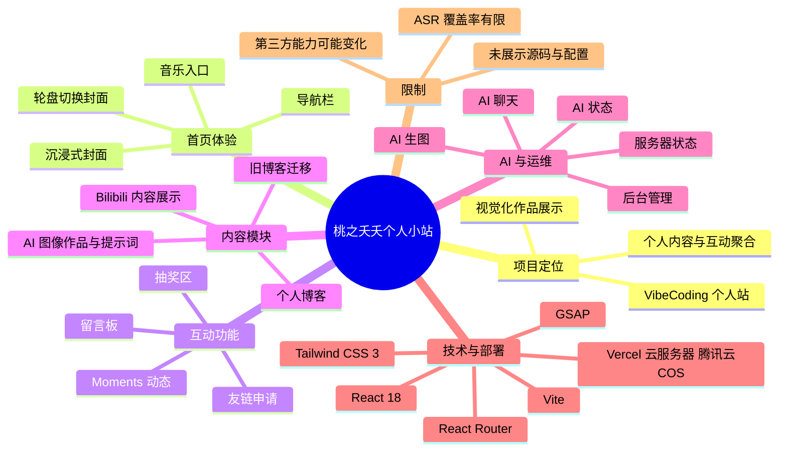
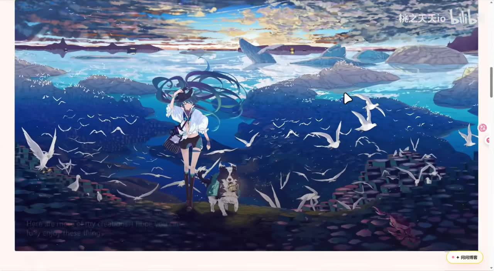
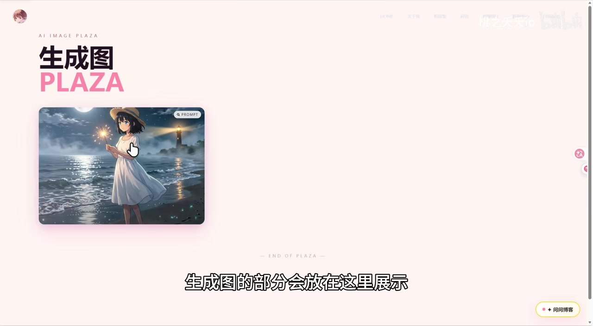

# ✨ 我用 VibeCoding 制作了一个属于自己的个人小站！跟我一起欣赏吧!

> 来源：[Bilibili 视频](https://www.bilibili.com/video/BV1jK7W6MEAj) 
> UP 主：桃之夭夭io｜发布时间：2026-06-28｜视频时长：04:36｜合集：AIcode

## 小结

这是一期对个人网站「桃之夭夭」进行界面导览的展示视频。创作者称该站由其以 VibeCoding 方式完成，并从首页、封面切换、音乐、留言与抽奖，到博客、Bilibili 内容展示、AI 助手、AI 图像作品页和后台管理等模块，快速演示了网站的功能轮廓。

视频中最明确的产品设计是：将个人内容、互动功能和 AI 能力聚合在同一站点。首页采用沉浸式大幅视觉封面，且可通过“轮盘”切换封面；站内还有音乐、留言、抽奖、友链、动态与博客等偏个人表达和社区互动的功能。截图可见整体视觉风格高度依赖插画、动效与大字号排版。

技术栈以视频简介为准：前端使用 **React 18 + Vite**，路由为 **React Router**，样式为 **Tailwind CSS 3**，动画使用 **GSAP**；部署组合为 **Vercel + 云服务器 + 腾讯云 COS**。这些是项目元数据中的作者声明，视频本身没有展示代码、构建命令、环境变量或部署配置，因此不能据此复刻完整实现。

站点还整合了 Bilibili 接口展示、服务器与 AI 状态、AI 聊天与生图能力。视频中提到“调用 Bilibili 的接口”及 AI 聊天/生图，但未说明接口类型、鉴权方式、模型供应商、费用、限流、数据处理与异常策略；上述部分应视为功能展示而非可直接迁移的工程方案。

适合希望获得个人站信息架构、视觉呈现与功能组合灵感的前端开发者、独立开发者阅读。若目标是学习 React、GSAP、Vercel、COS 或 AI 接口的具体落地，需要进一步查看项目仓库及实际文档。

信息具有时效性：视频元数据显示发布于 2026-06-28，素材抓取于 2026-07-22；网站在线状态、第三方接口可用性、部署服务与 AI 能力均可能在之后变化。项目地址为 [taozhiyy.top](https://www.taozhiyy.top)，源码地址为 [GitHub：bistutzyy/taozhiyy](https://github.com/bistutzyy/taozhiyy)。

## 思维导图

## 目录

- [项目背景与资料边界](#项目背景与资料边界-000002)
- [首页、封面与互动入口](#首页封面与互动入口-000002)
- [内容聚合、AI 与状态页](#内容聚合ai-与状态页-000146)
- [博客、作品页与后台能力](#博客作品页与后台能力-000241)
- [可复用的规划步骤与限制](#可复用的规划步骤与限制-000002)
- [关键帧索引](#关键帧索引-000002)
- [字幕比对](#字幕比对)
- [评论分析](#评论分析)
- [处理记录](#处理记录)

## [项目背景与资料边界](https://www.bilibili.com/video/BV1jK7W6MEAj?t=2)

### 项目背景

创作者在视频简介中说明，自己利用业余时间从零搭建了个人网站「桃之夭夭」，覆盖页面设计、功能开发与部署上线。视频主体并非编程教程，而是以页面滚动与操作演示的方式介绍完成后的站点。

标题中的 “VibeCoding” 是创作者对开发方式的表述；视频没有对该词给出定义，也没有展示其使用的具体 AI 编程工具、提示词、代码生成过程或人工修改比例。因此，不能将本视频解读为某个特定 VibeCoding 工具的教程或性能评测。

### 已知技术与功能范围

以下信息来自视频简介，属于创作者声明：

| 类别 | 技术/能力 | 素材中的明确表述 |
| --- | --- | --- |
| 前端 | React 18 + Vite | 技术栈 |
| 路由 | React Router | 技术栈 |
| 样式 | Tailwind CSS 3 | 技术栈 |
| 动画 | GSAP | 技术栈 |
| 部署 | Vercel + 云服务器 + 腾讯云 COS | 技术栈 |
| 内容体验 | 沉浸式首页动画、相册/画廊、Moments、B 站主页内容聚合 | 主要功能 |
| 互动 | AI 智能助手、友链申请、留言板、抽奖展示 | 视频/简介所示 |
| 状态与安装 | 服务器状态监控、PWA 支持 | 主要功能 |

需要注意，简介提及 **PWA 可安装到桌面/手机**，但本次视频画面与 ASR 未提供安装步骤、manifest、Service Worker、离线缓存范围或浏览器兼容性，不能据此判断 PWA 的具体实现和离线能力。

## [首页、封面与互动入口](https://www.bilibili.com/video/BV1jK7W6MEAj?t=2)

### [首页总体布局](https://www.bilibili.com/video/BV1jK7W6MEAj?t=2)

ASR 在 `00:00:02,500—00:00:10,590` 识别到创作者介绍“个人小站”及“主页面，大概布局”。画面可见首页使用大面积插画背景、醒目的 `WELCOME` 标题、`EXPLORE` 按钮、顶部导航以及右下角“向同博客”类入口；页面品牌文字为 “taozhiyo/桃之夭夭”。

> 图：关键帧展示首页的深蓝夜景插画、大标题、探索按钮和顶部导航。它能够说明本项目首先强调的是首屏氛围与品牌识别，而非传统博客式的信息密度。

### [封面切换与音乐入口](https://www.bilibili.com/video/BV1jK7W6MEAj?t=11)

在 `00:00:11,990—00:00:24,030`，创作者说明可“通过转动这个轮盘”切换不同封面，并现场切换到另一张封面。随后在 `00:00:26,320—00:00:27,100` 提到“放音乐的”，即页面有音乐相关入口或播放功能。

这里可以确认的交互链路是：

1. 用户位于首页；
2. 通过一个被创作者称作“轮盘”的控件发起切换；
3. 页面更换为不同视觉封面；
4. 页面还提供音乐功能入口。

视频未交代封面资源数量、切换规则、随机机制、资源版权、音频来源、自动播放限制或移动端适配策略。尤其浏览器通常对自动播放音频设有限制，实际行为应以站点运行时表现为准。

> 图：关键帧呈现切换后的海洋与飞鸟插画封面，说明“换封面”并非仅改变色彩，而是会替换主要视觉场景，是首页沉浸感的重要组成部分。

### [留言与抽奖区](https://www.bilibili.com/video/BV1jK7W6MEAj?t=40)

ASR 在 `00:00:40,420—00:00:42,540` 识别到“留言区，这是抽奖区”；`00:00:43,910—00:00:48,230` 说明会展示抽奖规则；`00:00:51,820—00:00:53,820` 则称“大概第三次就会出壁纸”。

据此，视频明确展示了：

- 留言区：作为访客交流入口；
- 抽奖区：有可查看的规则；
- 抽奖结果示例：创作者演示中约第三次获得壁纸。

“第三次就会出壁纸”仅是本次演示的口头描述，无法据此推导抽奖概率、保底次数、奖池构成、账户条件、反作弊机制、数据持久化方式或实际发奖规则。若该功能涉及权益或付费，应以站内最新规则为准。

> 图：关键帧展示抽奖界面的结果弹窗及壁纸内容，与字幕中“第三次就会出壁纸”对应；它的价值在于确认视频确实演示了结果展示，而不只是在口头提及抽奖功能。

## [内容聚合、AI 与状态页](https://www.bilibili.com/video/BV1jK7W6MEAj?t=88)

### [其他博客与 Bilibili 内容页](https://www.bilibili.com/video/BV1jK7W6MEAj?t=88)

在 `00:01:28,130—00:01:32,330`，创作者提及“之前部署的一些其他的个人博客”。这表明当前站点不是唯一内容载体，页面中还存在指向或承载旧博客内容的部分。

随后在 `00:01:46,420—00:01:50,600`，ASR 识别到“调用的 Bilibili 的接口，做的一个追番页面展示”。由于 ASR 对“追番”上下文存在识别误差的可能，结合视频简介里的“B 站主页内容聚合”，可稳妥确认的是：站点存在一个调用 Bilibili 接口的内容展示页面；但无法仅凭素材确定它究竟展示追番、投稿、主页动态，还是多类内容的混合数据。

对这类第三方平台聚合功能，视频未说明：

- 使用公开接口、官方 API 还是其他数据获取方式；
- 登录态与授权要求；
- 请求频率限制、缓存策略与失败降级；
- Bilibili 页面结构或接口变化后的维护方案。

因此，它是一个值得参考的信息架构方向，但不是可直接复制的接口实现说明。

### [服务器、AI 状态与 AI 助手](https://www.bilibili.com/video/BV1jK7W6MEAj?t=117)

在 `00:01:57,300—00:01:59,620`，创作者称页面“展示服务器和 AI 的一个状态栏”；`00:02:01,310—00:02:05,870` 则说明 AI 可以“聊天和生图”。

这些功能可以按三层理解：

| 层次 | 视频确认内容 | 未披露内容 |
| --- | --- | --- |
| 可观测性 | 有服务器状态栏、AI 状态栏 | 指标来源、刷新频率、告警、权限控制 |
| AI 对话 | 可聊天 | 所用模型、上下文长度、知识库、内容安全、费用 |
| AI 生图 | 可生成图片 | 图像模型、提示词策略、排队、存储、版权与审核 |

将服务状态直接呈现在个人站内，能让访客理解服务是否可用；但状态页本身可能暴露基础设施信息。视频没有说明哪些数据公开、是否脱敏，生产环境应谨慎确定展示粒度。

### [留言带来的社交连接](https://www.bilibili.com/video/BV1jK7W6MEAj?t=142)

`00:02:22,310—00:02:30,200` 的 ASR 内容显示，创作者提到有许多“大佬以及朋友”留言，并表示看到后会直接添加。这体现了留言区不仅用于评论，也承担了建立联系的作用。

这是创作者个人的互动习惯，不代表所有留言都会自动被添加，也不构成平台规则。若自行实现同类功能，至少需要考虑垃圾留言防护、审核、隐私信息展示及联系渠道的边界。

## [博客、作品页与后台能力](https://www.bilibili.com/video/BV1jK7W6MEAj?t=161)

### [个人博客与迁移内容](https://www.bilibili.com/video/BV1jK7W6MEAj?t=161)

在 `00:02:41,720—00:02:47,840`，创作者称其中一个博客用于记录日常，并说“这个博客是由 butterfly 魔改的”。`00:02:51,580—00:02:54,190` 还提到有一个搭建的博客“直接迁移过来的”；`00:03:03,350—00:03:05,890` 则将其描述为记录过程的博客。

可确认的信息包括：

- 站内或关联内容中有用于记录日常的博客；
- 至少有一部分博客基于 Butterfly 进行修改；
- 存在从既有博客迁移内容的情况；
- 有记录项目过程的内容定位。

“Butterfly”在这里是创作者原话中的专有名词；视频没有说明对应版本、修改范围、原主题许可、数据迁移工具、链接重定向、图片迁移或 SEO 处理方式。对于内容迁移来说，这些正是决定可维护性的关键细节，但素材未提供。

### [AI 图像作品的结构化展示](https://www.bilibili.com/video/BV1jK7W6MEAj?t=202)

`00:03:22,220—00:03:28,240` 中，创作者说明 AI 相关作品会在此展示，并列出“提示词、创建日期、合作者”等信息；`00:03:30,260—00:03:32,680` 提到“用生成图生成的页面”。

这说明该站并未只展示最终图片，而是尝试保留生成作品的上下文元数据。对 AI 作品归档而言，至少记录提示词、创建时间与协作信息，有助于回溯创作来源和组织作品。

不过，视频没有展示完整字段模型。诸如模型名称与版本、种子值、采样参数、尺寸、后期编辑记录、授权状态等是否保存，均无法确定。

> 图：关键帧显示一个名为 “QuizCard” 的项目展示页，画面含“把题目交给 AI 再交回给你”的文案、网页与小程序入口等内容。它说明个人站还承担作品集/项目陈列职责，但不能据此推断该项目的完整技术实现。

### [后台与文档](https://www.bilibili.com/video/BV1jK7W6MEAj?t=222)

在 `00:03:42,250—00:03:55,370`，ASR 断续识别到后台可用于发文章、上传、加友链，以及查看来访邮箱和 AI 状态。虽然部分词语受识别质量影响，结合上下文可归纳为一个内容与站务管理入口，包含以下已提及能力：

1. 发布文章；
2. 上传内容；
3. 添加友链；
4. 查看来访相关邮箱信息；
5. 查看 AI 状态。

在 `00:04:21,210—00:04:25,610`，创作者提及 `README` 以及“中英两文说明”。这与简介给出的 GitHub 开源地址相互对应，表明项目文档至少包含 README，且有中英文说明的表述。

视频没有展示后台登录、角色权限、数据备份、审核流、上传限制、邮件服务、访问日志保留策略或 README 的具体内容。后台能力的存在不能等同于其已经满足多用户、公开部署或生产级安全要求。

## [可复用的规划步骤与限制](https://www.bilibili.com/video/BV1jK7W6MEAj?t=2)

本视频没有给出从零开发的逐步教程、命令或代码。以下是依据视频实际展示顺序整理出的**产品规划清单**，不是对作者具体开发流程的还原：

1. **确定首页体验**：用一个可切换的主视觉封面承载个人品牌，并配置清晰的导航和探索入口。
2. **划分内容层**：区分日常博客、过程记录、历史博客迁移内容、项目展示与 AI 作品归档。
3. **增加互动层**：在留言、抽奖、友链申请和动态发布之间明确各自的使用目的与规则。
4. **接入外部信息**：如要聚合 Bilibili 内容，应先确认接口来源、授权条件、缓存、限流和失效预案。
5. **处理 AI 功能边界**：聊天、生图、作品元数据展示可构成闭环，但需额外设计成本控制、隐私、审核与错误反馈。
6. **补足运维入口**：将文章、上传、友链和状态查看集中到管理端，同时避免把敏感服务器信息直接暴露给访客。
7. **完善发布材料**：代码仓库应说明本地启动、构建、部署、环境变量、第三方密钥配置、许可证及中英文文档范围。

### 素材未提供、不可补写的实现参数

| 事项 | 本视频可确认程度 | 缺失信息 |
| --- | --- | --- |
| React/Vite 项目结构 | 仅确认使用 | 目录结构、依赖版本、构建脚本 |
| Tailwind CSS 3 | 仅确认使用 | 主题 token、响应式规则、插件 |
| GSAP 动画 | 仅确认使用 | 时间线、触发器、性能优化 |
| Vercel/云服务器/COS 部署 | 仅确认组合 | 域名、DNS、CI/CD、存储桶策略、成本 |
| AI 聊天与生图 | 确认功能存在 | 模型、API、密钥管理、计费、内容审核 |
| Bilibili 展示 | 确认有接口调用表述 | 接口地址、授权与合规方式 |
| PWA | 简介声明支持 | 安装指引、离线缓存与兼容性 |

## [关键帧索引](https://www.bilibili.com/video/BV1jK7W6MEAj?t=2)

| 关键帧 | 对应内容 | 选择价值 |
| --- | --- | --- |
| [frame-001.jpg](frames/frame-001.jpg) | 首页主视觉与导航 | 直接呈现首屏排版、品牌文字和沉浸式视觉路线。 |
| [frame-002.jpg](frames/frame-002.jpg) | 切换后的封面 | 与 `00:00:11—00:00:24` 的封面切换说明对应，证明主视觉可变化。 |
| [frame-003.jpg](frames/frame-003.jpg) | 抽奖结果弹窗 | 对应“第三次就会出壁纸”的演示，补足字幕未描述的结果界面。 |
| [frame-010.jpg](frames/frame-010.jpg) | QuizCard 项目页 | 展示网站除博客外还包含项目/作品陈列页面，能帮助理解其作品集定位。 |

## 字幕比对

| 字幕来源 | 完整性 | 专有名词 | 时间轴 | 主要问题 |
| --- | --- | --- | --- | --- |
| Bilibili 站内字幕 | 无可用字幕 | 无法核验 | 无法使用 | 素材明确标注“未提供可用站内字幕”；字幕获取过程还出现 `Invalid URL` 警告。 |
| 本次 ASR 字幕 | 有效语音段约 80.25 秒，占视频约 29.17% | 较多误识别 | 有效，31 段均有 SRT 起止时间 | 存在长静音/未识别区间，术语与断句错误较多，如 “bybcoding”“雕用”“抽奎区”等。 |

### 最终字幕选择与校正原则

本次没有可用站内 SRT，故正文以**本次 ASR 的带时间戳分段**作为时间轴依据，并使用视频简介和关键帧进行有限校正。

已检查 ASR 诊断信息：诊断中**未标记** `noAudioStream=true`，且音频识别产生了 31 个有效分段，因此不能将站内字幕缺失归因于“视频没有音轨”。站内字幕不可用的已知处理警告为 `Invalid URL`；本次 ASR 本身正常完成。

重要校正如下：

| ASR 原文 | 正文处理 | 依据与置信边界 |
| --- | --- | --- |
| `bybcoding` | VibeCoding | 与视频标题一致；正文只将其作为创作者表述，不扩展定义。 |
| `切损不同的封片` | 切换不同封面 | 上下文为“转动轮盘”，关键帧显示不同首页画面。 |
| `抽奎区` | 抽奖区 | 同段语义和后续“第三次就会出壁纸”共同支持。 |
| `雕用的bilibili的接口` | 调用 Bilibili 接口 | 依据语境校正“雕用”为“调用”；具体接口不作推断。 |
| `butterfly魔改` | 基于 Butterfly 魔改 | 保留创作者原意；不补充主题版本和代码细节。 |
| `reddemy` | README | 与后续“中英两文说明”及简介中的 GitHub 项目相互印证。 |

由于 ASR 语音覆盖率不足三成，未被识别到的画面内容不能仅按页面滚动顺序补写为事实；本文只记录 ASR、视频简介、元数据和关键帧能够支持的内容。

## 评论分析

以下仅处理本次可获取的热评前三条；评论属于观众主观评价，不能作为项目技术质量或功能可靠性的验证。

| 热评 | 点赞 | 观点概括 | 可提供的补充信息与可信度 |
| --- | ---: | --- | --- |
| 一目生：“审美很好呀” | 3 | 认可页面审美。 | 与视频中插画、大字排版、封面切换等视觉展示相符，但属于主观感受，未涉及功能细节。 |
| 笔尖代码：“大佬厉害啊[打call]” | 2 | 对创作者完成项目表示赞赏。 | 体现正向反馈，不包含可验证的技术补充或使用体验。 |
| AAA秋水鱼：“设计真好” | 2 | 认可设计效果。 | 与前两条共同显示评论区对视觉设计的正面反馈；样本仅三条，不能推断整体用户口碑。 |

评论中没有出现对源码、部署稳定性、AI 服务质量、接口合规性、移动端适配或功能故障的具体补充，也没有形成争议议题。

## 处理记录

- Worker ID：`worker-mrj0wjed-b0c290ad`
- 模型：`gpt-5.6-terra`
- 调用工具与素材：视频元数据读取、音频 ASR、关键帧提取、站内字幕获取尝试、热评获取；本次 ASR 模型为 `medium`，语言识别为中文（概率 `0.98779296875`），使用 CUDA / float16。
- 字幕选择：站内字幕未提供可用结果，且字幕工具记录有 `Invalid URL` 警告；已检查本次 ASR，确认未标记 `noAudioStream=true`。采用带时间戳的 ASR SRT 作为章节时间轴，并以视频简介与关键帧有限校正术语。
- 关键帧选择依据：选择 `frame-001`、`frame-002`、`frame-003`、`frame-010`，分别覆盖首页布局、封面切换、抽奖结果、项目展示四类高信息量画面；图片均以相对路径嵌入正文。
- 缓存清理：提供的素材中未包含缓存清理执行记录；为避免编造，不宣称已执行清理。
- 未解决问题：
  - 未获得站内人工字幕，无法逐句交叉验证 ASR；
  - ASR 语音覆盖率约 29.17%，部分页面展示仅能依据关键帧和简介确认；
  - 未提供源码、README 全文、部署配置、AI 模型与接口文档，无法验证实现细节、安全性、成本和长期可用性；
  - 站点、Bilibili 聚合接口、AI 服务及部署状态均可能在素材抓取后变化。
