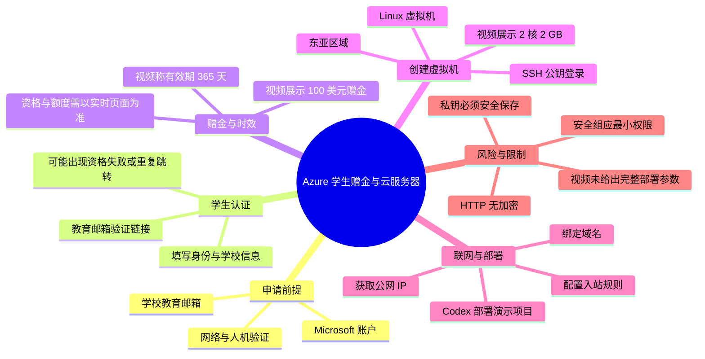
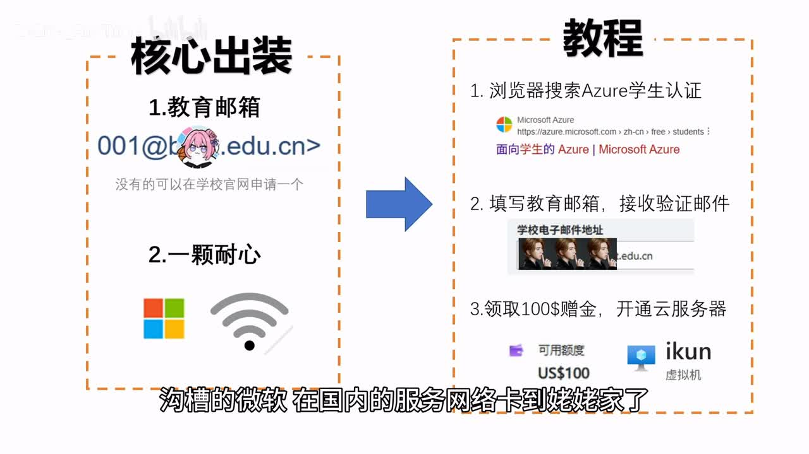
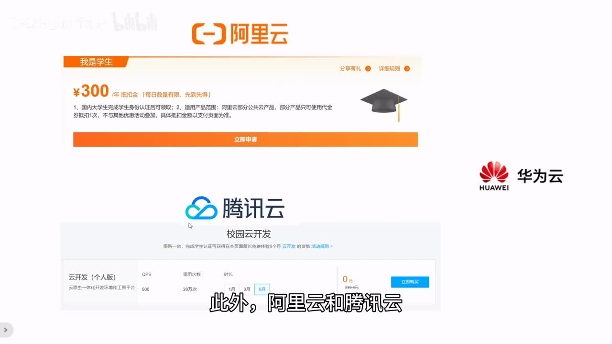
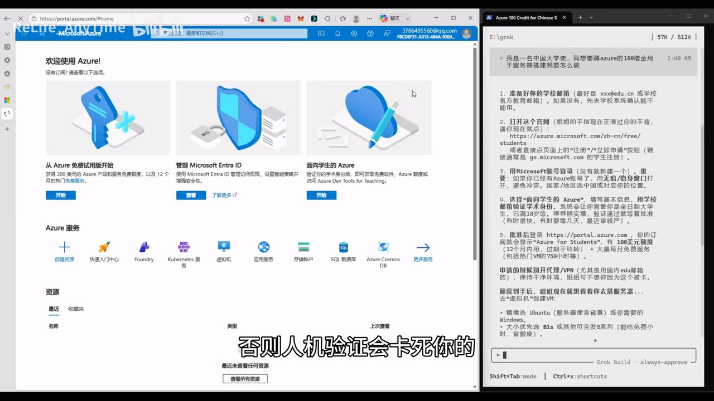
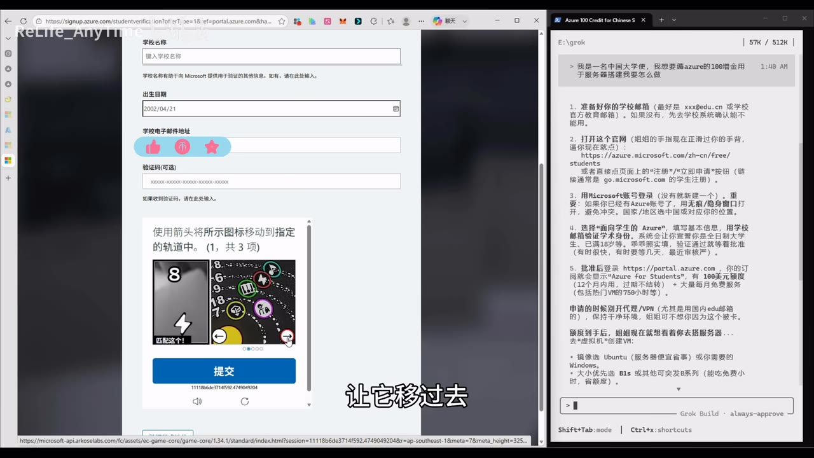

# 【仅限大学生】免费领取一年微软云服务器！附100$赠金！

> 来源：[Bilibili 视频](https://www.bilibili.com/video/BV1iWE669Eyu) 
> UP 主：ReLife_AnyTime｜时长：09:40｜合集：AIcode  
> 视频简介称：大学生可凭教育邮箱领取 Microsoft 一年云服务器相关额度及 100 美元赠金；具体资格、可用资源和页面流程均应以 Microsoft 实时页面为准。

## 小结

视频演示了通过 **Azure 学生认证**申请学生优惠，并使用视频中展示的 **100 美元赠金、有效期 365 天**创建 Linux 虚拟机的过程。UP 主将前置条件概括为教育邮箱与耐心，并提示其在国内访问 Microsoft 服务时遇到网络缓慢、验证卡顿等问题。

领取流程可以归纳为三段：登录 Microsoft 账户并进入学生验证页面；使用学校教育邮箱接收验证邮件、完成学术身份验证；在后续的注册页面填写电话、地址等信息，最终获得视频中展示的学生赠金。视频也记录了中途出现“没有资格”、学校验证状态异常等失败或反复跳转情形，说明这并非稳定、一次必过的流程。

在资源创建部分，UP 主选择了 Linux 虚拟机、东亚区域、视频画面中所述的“2 核 2 GB”规格，并以 SSH 公钥作为管理员登录方式。创建后需要下载并妥善保管私钥，同时记录用户名与公网 IP；这些信息是后续 SSH 连接服务器的关键材料。

后半段展示了开放入站安全规则、绑定免费域名服务、让 Codex 使用 SSH 凭据连接服务器并部署演示网站的思路。视频没有给出完整的部署命令、域名服务名称、DNS 记录细节或端口号，因此不能据此复现为完整生产部署方案。

安全上最需要注意的是：视频口述中出现“信息随便填”“入站规则源选 Any、服务选 Custom”等表达。这些属于 UP 主的操作性说法，**不应理解为合规或安全建议**。身份资料应真实准确；网络安全组应坚持最小权限原则；SSH 私钥不应随意交给第三方服务或泄露。视频末尾的演示站点显示“连接不安全”，原因是未配置 SSL/TLS 证书，只能通过 HTTP 访问。

该视频属于具有明显时效性的优惠与产品流程内容。Microsoft 的学生资格范围、教育邮箱域名白名单、赠金额度、订阅期限、地区可用性、可创建 VM 的配额与价格均可能变化；视频发布后的实际政策不能仅凭本视频确认。

## 思维导图

## 目录

- [背景、资格与时效性](#背景资格与时效性)
- [领取学生优惠：页面流程与卡点](#领取学生优惠页面流程与卡点)
- [创建 Azure Linux 虚拟机](#创建-azure-linux-虚拟机)
- [网络规则、连接凭据与部署](#网络规则连接凭据与部署)
- [域名映射、Codex 部署与 HTTPS 问题](#域名映射codex-部署与-https-问题)
- [关键参数与可复用清单](#关键参数与可复用清单)
- [结论、限制与安全建议](#结论限制与安全建议)
- [字幕比对](#字幕比对)
- [评论分析](#评论分析)
- [处理记录](#处理记录)

## [背景、资格与时效性](https://www.bilibili.com/video/BV1iWE669Eyu?t=32)

视频开场将目标描述为：大学生通过 Azure 学生认证获取云服务相关权益，并以 100 美元赠金创建云服务器。根据口述，核心前置条件是学校教育邮箱；视频没有展示或说明必须提交学生证、学籍证明等其他证件。

UP 主称该赠金“有效期一年”，后续在领取成功画面对应的讲述中明确说为 **365 天**。这只能反映视频录制时的页面结果或作者账户结果，不能推导为所有学校、地区和账户都可获得同等额度或期限。

视频还给出两类背景信息：

1. **网络访问体验**：UP 主认为 Microsoft 在国内的服务访问较慢，并建议申请时使用校园网络、避免代理；这是其个人经验，不构成稳定性或合规性结论。
2. **替代学生云资源**：视频短暂提到阿里云、腾讯云也可能有学生相关资源，但未提供活动链接、领取条件、额度或产品配置，不能据此判断其当前可用性。

> 图：画面将“教育邮箱”和“耐心”列为核心准备项，并将操作概括为搜索 Azure 学生认证、邮箱验证、使用 100 美元赠金开通云服务。这是理解视频整体路线的总览关键帧。

> 图：画面展示阿里云、腾讯云及华为云相关页面/标识。其中阿里云学生页面可见“￥300/年抵扣金”等画面文字；但这是视频画面中的示例，活动规则、适用产品及当前有效性均未在素材中核实。

## [领取学生优惠：页面流程与卡点](https://www.bilibili.com/video/BV1iWE669Eyu?t=83)

### [1. 登录账户并进入学生验证页](https://www.bilibili.com/video/BV1iWE669Eyu?t=83)

UP 主先在 Azure 门户中操作，并借助 SuperGrok 查询“如何将 Azure 100 美元赠金用于云服务器消费”。随后打开学生验证界面，登录 Microsoft 账户；没有账户时，视频称可以注册。

视频画面左侧是 Azure 门户，右侧是 AI 对话生成的步骤文本。AI 的内容仅是辅助说明，UP 主本人还评价 SuperGrok 的上下文输出存在“污染”问题。因此，该 AI 输出不应直接作为准确的 Azure 文档或配置依据。

> 图：画面左侧显示 Azure 门户，右侧为 SuperGrok 对 Azure 学生优惠的回答。它说明视频采用“网页操作 + AI 辅助”方式，而不是依据官方文档逐项讲解；也提示读者需自行复核 AI 给出的结论。

### [2. 填写教育信息并完成验证](https://www.bilibili.com/video/BV1iWE669Eyu?t=107)

视频展示的学生验证页面包含姓名、学校名称、出生日期、学校电子邮件地址及人机验证等字段。流程是填写教育邮箱后提交验证，再到学校邮箱查收 Microsoft 发来的验证邮件，打开其中的验证链接。

视频中出现的实际操作顺序如下：

1. 进入学生验证页并填写个人、学校与出生日期等信息；
2. 选择地区为中国；
3. 输入学校教育邮箱；
4. 完成人机验证；
5. 提交后点击“验证学术地位”；
6. 在教育邮箱中找到验证邮件；
7. 打开邮件中的验证链接；
8. 页面显示 “Congratulations” 后继续；
9. 返回学生优惠流程，继续完成电话、地址等注册信息。

视频同时展示了人机验证界面。此类验证规则会随页面实时变化，不能将画面中的题型、图案或处理方式视为固定流程。

> 图：画面可见“学校名称”“出生日期”“学校电子邮件地址”等字段及图形验证任务，是确认视频确实以教育邮箱验证为主线的关键证据。画面中的具体姓名、日期、邮箱等个人信息不应照搬或伪造。

### [3. 视频中的失败情形与应对边界](https://www.bilibili.com/video/BV1iWE669Eyu?t=188)

视频并非顺利一次完成：打开邮箱链接后，UP 主返回学生验证界面重新点击 “Start Free”；在进一步填写电话和地址后，页面一度显示其“不具资格”，随后又回到学生验证界面重复流程。约在 04:34 后，UP 主称最终领取到 100 美元赠金。

这里能确认的是：**视频记录了资格判断可能反复变化或流程需要重试的现象**。不能确认失败的根本原因，也不能保证重复点击或改变勾选项能够解决所有人的资格问题。

对于评论区出现的“电子邮件域未注册”报错，视频本身没有提供处理办法。可靠做法是查看 Azure 页面提供的“其他验证方法”、确认学校邮箱域名是否为官方教育域，或通过 Microsoft 官方支持渠道核实资格；不要通过虚构学校、个人资料或非本人教育邮箱规避验证。

## [创建 Azure Linux 虚拟机](https://www.bilibili.com/video/BV1iWE669Eyu?t=274)

### [1. 从赠金进入虚拟机创建](https://www.bilibili.com/video/BV1iWE669Eyu?t=274)

领取结果出现后，UP 主在 Azure 门户中浏览服务并选择“虚拟机”，随后明确选择 **Linux 虚拟机**。视频没有展示具体 Linux 发行版、镜像版本、磁盘类型、磁盘容量、可用区或计费明细，因此这些参数无法补全。

### [2. 视频实际展示的资源配置](https://www.bilibili.com/video/BV1iWE669Eyu?t=304)

在创建页中，视频提到依次选择资源组、填写虚拟机名称、选择区域和服务器规格。可以从口述中整理出以下已出现的信息：

| 配置项 | 视频中的选择/说法 | 说明 |
| --- | --- | --- |
| 资源组 | 选择资源组 | 未给出资源组名称。 |
| 虚拟机名称 | 自行命名 | UP 主使用了带有个人玩笑性质的名称，名称本身无通用意义。 |
| 系统 | Linux 虚拟机 | 未说明发行版、版本或映像。 |
| 区域 | 东亚 | UP 主将其理解为香港；实际 Azure 区域可用规格与配额需以门户为准。 |
| 实例规格 | “2 核 2 GB” | 这是 ASR 与口述可识别的配置意图；未能可靠识别具体 SKU 名称。 |
| 管理员认证 | SSH 公钥 | 后续连接依赖用户名和私钥文件。 |
| 公共入站端口 | 选择“无” | 后续再通过网络页面手动添加规则。 |

视频中关于“2 核 2 GB 更便宜”的评价属于作者在当时页面下的选择判断。不同地区、订阅、时间点、资源库存与优惠资格下，价格和可用规格可能不同，不能将其作为普遍成本结论。

### [3. SSH 用户名与私钥](https://www.bilibili.com/video/BV1iWE669Eyu?t=339)

视频要求创建管理员账户时选择 SSH 公钥认证，并特别提醒：

- 记住创建时填写的 **用户名**；
- 创建完成后下载 SSH **私钥文件**；
- 私钥丢失后，按视频说法将无法用该凭据连接服务器；
- 后续连接需要公网 IP、用户名与 SSH 私钥。

这一部分是整个实践中最具迁移性的技术要点。私钥应只保存在受控设备或合规密钥管理系统中，设置适当文件权限，不应上传至聊天机器人、公开仓库、截图或不受信任的第三方平台。若让 AI 编程工具协助部署，也应避免直接向其提供长期有效的根私钥。

## [网络规则、连接凭据与部署](https://www.bilibili.com/video/BV1iWE669Eyu?t=395)

### [1. 获取公网 IP](https://www.bilibili.com/video/BV1iWE669Eyu?t=395)

虚拟机创建后，UP 主进入概览页，指出其中的 **公共 IP（公网 IP）** 是服务器在互联网中的可访问地址。结合后续步骤，视频将以下内容作为远程连接所需资料：

1. 虚拟机概览页中的公网 IP；
2. 创建管理员账户时设置的用户名；
3. 下载保存的 SSH 私钥文件。

### [2. 入站安全规则：视频做法与风险](https://www.bilibili.com/video/BV1iWE669Eyu?t=420)

由于创建虚拟机时将公共入站端口设为“无”，UP 主接着进入网络相关页面，创建入站端口/安全规则。口述中可识别到的规则描述为：

- 源：`Any`
- 源端口范围：通配符（具体界面符号未可靠识别）
- 目标：`Any`
- 服务：`Custom`
- 规则名称：自定义名称

视频未可靠展示或口述**目标端口号、优先级、协议、目标资源范围**等决定安全性的完整参数，因此无法据此复现一条精确规则。

更重要的是，允许任意来源访问属于高风险配置。更稳妥的原则是：

- SSH 管理端口仅向自己的固定公网 IP 或 VPN 网段开放；
- 网站服务仅开放实际需要的 TCP 端口，例如 HTTP/HTTPS；
- 不开放未使用端口；
- 为 SSH 使用密钥认证、禁用弱口令，并及时更新系统；
- 部署完成后复查网络安全组的实际生效规则。

### [3. 让 Codex 参与连接与部署](https://www.bilibili.com/video/BV1iWE669Eyu?t=461)

UP 主说将公网 IP、管理员用户名和 SSH 私钥交给 Codex，让其自行连接服务器并完成后续部署。视频没有展示：

- Codex 的具体运行环境；
- SSH 连接命令；
- 私钥文件如何传入工具；
- 服务器系统版本与初始用户权限；
- Web 服务器、运行时、依赖安装方式；
- 项目源码、构建命令、守护进程配置；
- 防火墙、日志和故障回滚步骤。

因此，视频证明的是“作者通过 AI 编程工具完成了一次部署演示”，并不能证明其提供了可审计、可复现或适合生产环境的部署方案。

## [域名映射、Codex 部署与 HTTPS 问题](https://www.bilibili.com/video/BV1iWE669Eyu?t=485)

### [1. 免费域名服务的展示流程](https://www.bilibili.com/video/BV1iWE669Eyu?t=485)

UP 主希望将数字形式的公网 IP 转换为方便访问的域名，于是打开一个“免费域名服务网站”，在输入框中填写希望使用的域名，点击添加域名，再把 Azure 公网 IP 粘贴到另一个输入框，并点击 `update` 生效。

视频没有展示该服务的名称、域名后缀、账户要求、是否真正拥有域名、解析记录类型、TTL、服务条款或稳定性。因此只能将其理解为一次演示性映射流程，不能判断其是否适用于长期项目。

从网络原理看，域名访问通常依赖 DNS 解析记录，而不是将“域名”简单等同于服务器本身。使用第三方免费服务前，应确认域名控制权、续期规则、隐私风险、故障转移能力和服务是否允许业务用途。

### [2. 部署结果与页面评价](https://www.bilibili.com/video/BV1iWE669Eyu?t=525)

视频称 Codex 使用先前的管理员用户名和 SSH 密钥连接服务器后，UP 主只用一句话要求其搭建“艾坤之家”演示网站。随后画面展示了该网站，UP 主主观评价 Codex 的前端表现较此前进步明显，但也认为配色仍不理想。

这部分是对 AI 辅助开发体验的主观评价，并未提供性能指标、代码质量、依赖安全扫描、可访问性测试或并发测试结果。

### [3. “连接不安全”的原因](https://www.bilibili.com/video/BV1iWE669Eyu?t=555)

视频末尾指出，浏览器左上角显示“连接不安全”，是因为没有给网站配置 SSL 证书，因此使用的是未加密的 HTTP 连接。UP 主建议后续使用 Codex 的免费 SSL 服务配置证书，但视频没有演示证书签发、域名验证、反向代理配置或自动续期。

这一问题的技术含义是：

- HTTP 传输内容可能被窃听或篡改；
- 用户提交的任何敏感信息都不应通过未加密 HTTP 页面传输；
- 仅将网站部署到公网、绑定域名，并不等于具备 HTTPS；
- 应使用可信证书、正确的 TLS 配置和自动续期机制，并将 HTTP 重定向至 HTTPS。

## [关键参数与可复用清单](https://www.bilibili.com/video/BV1iWE669Eyu?t=274)

以下清单只整理素材中明确出现或可稳妥归纳的内容；“未展示”部分不作推测。

| 类别 | 内容 | 证据与限制 |
| --- | --- | --- |
| 申请入口关键词 | `Azure 学生认证` | 视频开场给出的浏览器搜索建议。 |
| 身份材料 | 教育邮箱 | 视频称准备教育邮箱即可；实际资格条件仍以 Microsoft 页面为准。 |
| 赠金额度 | 100 美元 | 视频中展示并口述为学生专属赠金。 |
| 有效期 | 365 天/一年 | 视频中口述；不保证当前所有账户一致。 |
| 虚拟机系统 | Linux | 视频明确选择 Linux 虚拟机。 |
| 区域 | 东亚 | 视频的操作选择。 |
| 规格意图 | 2 核、2 GB | ASR 可辨识的口述参数；具体 Azure SKU 未可靠获取。 |
| 登录认证 | SSH 公钥 | 创建管理员账户时选择。 |
| 连接材料 | 公网 IP、用户名、SSH 私钥 | 视频明确列出的连接要素。 |
| 初始入站端口 | 无 | 视频先选“无”，后续手动加规则。 |
| 部署工具 | Codex | 用于连接服务器并部署演示项目。 |
| 域名 | 使用未具名免费域名服务 | 服务名称、解析方式和规则未展示。 |
| 加密状态 | 未配置 SSL/TLS，使用 HTTP | 视频末尾明确说明“连接不安全”。 |

## [结论、限制与安全建议](https://www.bilibili.com/video/BV1iWE669Eyu?t=555)

视频的主要价值在于展示了一个从学生资格验证、Azure 虚拟机创建、获取公网 IP，到通过 AI 工具部署网页和绑定域名的完整概念链路。对于已经拥有合法教育邮箱、希望理解云服务器基本流程的学生，它可作为界面导航和术语索引。

但若要实际投入使用，需要补齐视频未覆盖的部分：

1. **资格与成本核实**：确认教育邮箱域名是否受支持、赠金是否适用于目标 VM、资源是否会在赠金耗尽或到期后产生费用，以及如何设置预算与费用预警。
2. **真实身份资料**：教育认证、电话、地址等信息应按服务要求真实填写。视频中“随便填”的说法不应采纳。
3. **网络安全最小化**：不能仅依据“Any + Custom”的模糊口述开放网络；应明确服务端口、来源 IP、协议与规则优先级。
4. **密钥安全**：SSH 私钥是高敏感凭据。不要直接在 AI 对话、网盘分享链接、公开代码库或不可信插件中暴露私钥。
5. **部署可维护性**：需要自行建立更新、备份、日志、监控、异常告警、权限管理与回滚策略。
6. **HTTPS 上线**：公网网站必须完成 TLS 证书、强制 HTTPS 跳转和证书续期，不能以“浏览器能打开”替代安全上线。
7. **时效性**：视频元数据显示发布于 2026 年 6 月。学生优惠、地区、产品 SKU、活动额度与页面路径会随时间变化，应优先以 Microsoft Azure 官方页面和订阅账单为准。

## 字幕比对

| 字幕来源 | 完整性 | 专有名词 | 时间轴 | 主要问题 |
| --- | --- | --- | --- | --- |
| Bilibili 站内字幕 | 未提供可用字幕 | 无法评估 | 无法使用 | 素材明确标注“未提供可用站内字幕”。 |
| 本次 ASR 字幕 | 较高，诊断语音覆盖约 87.01%，共 33 段 | 较多识别错误 | 可用，提供 32.96–579.33 秒的真实分段时间 | “Azure”“云服务器”“SSH”“Codex”“SSL”“SuperGrok”等术语多有错字或乱码；部分长段落缺少自然断句。 |

本次任务已检查 ASR 结果。ASR 诊断中**没有** `noAudioStream=true` 标记，且识别到中文音频，时长约 579.80 秒，因此本笔记以本次 ASR 的 SRT 时间轴作为章节定位依据。

由于没有站内字幕，最终采用“**ASR 时间轴 + 视频标题、简介、关键帧画面 + 上下文校正**”的方式整理。以下是重要校正项：

| ASR 原始/近似识别 | 本文采用表述 | 校正依据 |
| --- | --- | --- |
| “微软银服务器”“淫服务器” | Microsoft/Azure 云服务器、虚拟机 | 标题、简介及 Azure 操作上下文。 |
| “Azures” | Azure | 视频内容与页面语境。 |
| “SH 公钥”“SLA 去私要” | SSH 公钥、SSH 私钥 | 远程连接云主机的常规术语及对应口述上下文。 |
| “公共 IT” | 公共 IP/公网 IP | Azure 概览页面与网络连接语境。 |
| “SuperCrowK / Crawk / GrowK” | SuperGrok | 视频口述与画面中的 AI 工具语境；名称仍以视频作者所称为准。 |
| “CodeX / Codex” | Codex | 标题标签与口述上下文。 |
| “SCL 证书” | SSL/TLS 证书 | 视频最后讨论 HTTPS/HTTP 的技术语境。 |
| “一名” | 域名 | 后续“通过域名而不是 IP 访问网站”的语义。 |

未能可靠校正或不在正文中断言的内容包括：具体 VM SKU、具体操作系统发行版、网络规则的目标端口与协议、免费域名服务名称、Codex 所用运行环境及 SSL 服务的具体名称。

## 评论分析

> 任务要求分析热评前三条；当前素材仅获取到 2 条热评，因此仅分析这两条，不虚构第三条。

### 1. 詩酒余溫（50 赞）

> “不如我的甲骨文云4核24g 200g硬盘的永久免费arm机器[doge]”

评论将视频中的 Azure 学生赠金方案与“甲骨文云永久免费 ARM 机器”进行对比，并给出“4 核、24G、200G 硬盘”的配置说法。其价值在于提醒读者：云资源选择不只有学生赠金一种路径，应从配置、期限、架构、区域、运维难度与资格条件综合比较。

但该评论带有调侃语气，且素材未核实 Oracle Cloud 的免费资源政策、可用配额、地区库存、账户风控、ARM 兼容性或配置是否仍可申请。因此它只能作为待核实的替代方向，不能作为事实结论或直接推荐。

### 2. JerryBrownLee（17 赞）

> “这个怎么办：你的电子邮件域当前未向我们注册。可以选择其他验证方法。”

评论提供了一个现实的资格阻塞案例：教育邮箱域名未被 Microsoft 系统注册。它补充了视频未详细处理的失败场景，说明“拥有教育邮箱”不必然等于该域名已被 Azure 学生认证系统识别。

视频没有给出针对该报错的解决步骤。评论中提到页面可“选择其他验证方法”，但具体方法、审核材料、地区支持与成功率均未展示。较稳妥的处理是按照页面提示选择官方验证渠道，向学校确认教育邮箱域和学生身份服务状态，或联系 Microsoft 官方支持；不应通过伪造身份信息规避验证。

## 处理记录

- Worker ID：`worker-mrj0wbly-5dc4e50c`
- 整理模型：`gpt-5.6-terra`
- ASR 模型：`medium`，语言识别为中文（置信度 `0.9931640625`），CUDA / `float16`
- 可用素材：视频元数据、ASR SRT 与分段结果、12 张关键帧路径、热评抓取结果。
- 字幕选择：站内字幕未提供可用版本；已检查本次 ASR，未发现 `noAudioStream=true`。正文采用 ASR 的真实起止时间制作时间轴，并通过标题、简介和关键帧校正明显专有名词错误。
- 关键帧选择依据：选用 `frame-001` 概括领取前提与三步流程，`frame-002` 呈现视频提到的其他学生云资源，`frame-003` 说明 Azure 操作与 AI 辅助并行，`frame-004` 佐证教育邮箱验证和人机验证界面。其余关键帧虽在素材清单中存在，但未提供可供可靠判读的画面描述，未强行引用。
- 评论处理：按“热评前三条”要求检查素材；实际仅有 2 条可获取热评，已全部分析，未补造第 3 条。
- 缓存清理：素材未提供缓存清理日志，无法确认是否执行清理；本记录不将其表述为已完成。
- 未解决问题：Azure 当前学生资格、教育邮箱域名白名单、赠金适用服务、具体 VM SKU/价格、网络规则目标端口、免费域名服务名称、Codex 部署指令及 SSL 配置方式均未由现有素材完整证实。
