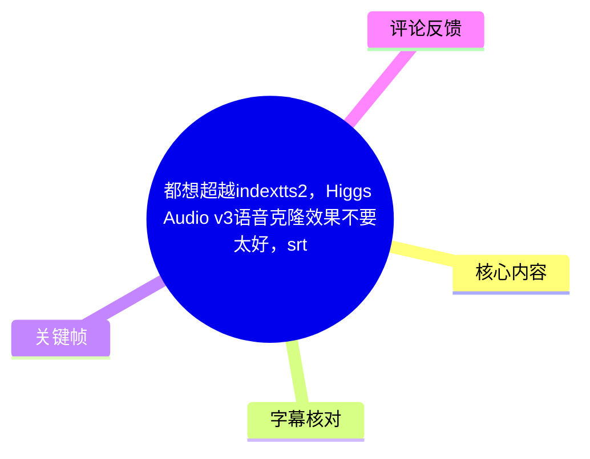
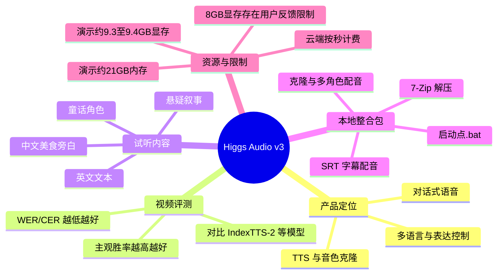
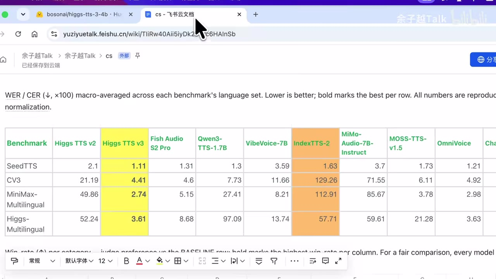
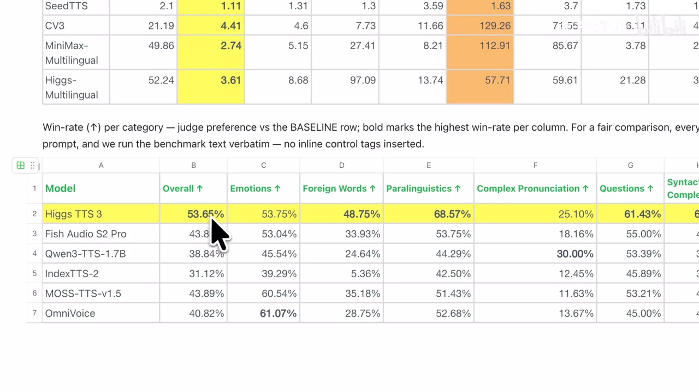
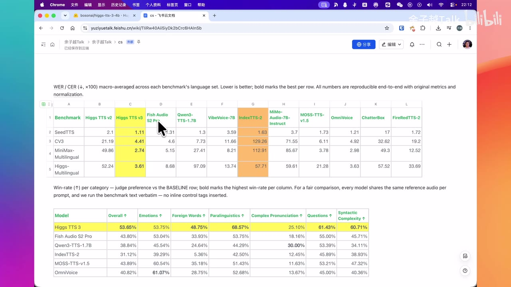
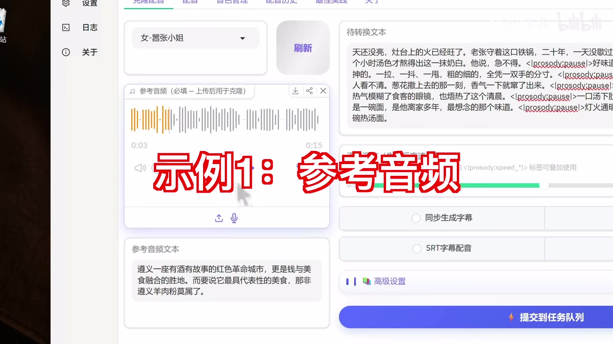

# 都想超越indextts2，Higgs Audio v3语音克隆效果不要太好，srt字幕配音，文字转语音，多角色配音，50系显卡，TTS音色克隆！余子越Talk

> 来源：[Bilibili 视频](https://www.bilibili.com/video/BV1CtTv6xEuh) 
> UP 主：余子越Talk｜视频时长：09:17｜合集：AIcode  
> 本文将 ASR 中反复识别为 “Hicks” 的产品名，依据视频标题、画面表格和简介统一校正为 **Higgs Audio / Higgs TTS v3**。

## 小结

视频介绍了 **Higgs Audio v3（画面中写作 Higgs TTS v3）** 的能力、基准对比、试听效果，以及 UP 主制作的本地整合包与云端镜像操作方式。视频将其定位为支持少样本/零样本音色克隆、文本转语音、情感与风格控制、多角色配音、SRT 字幕配音的工具，并称覆盖 100 多种语言；简介另列出了 83 种语言，并宣称 WER/CER 低于 5。两处统计口径并不完全一致，应保留这一差异，不宜直接等同。

评测展示的表格中，Higgs TTS v3 在四项 WER/CER 基准的可见数值分别为 **1.11、4.41、2.74、3.61**，低于同表展示的 Higgs TTS v2、Fish Audio S2 Pro、Qwen3-TTS-1.7B、VibeVoice-7B、IndexTTS-2 等模型。另一张主观胜率表中，其 Overall 为 **53.65%**。这些是视频展示/转录的基准结果，不能直接推出所有真实项目、所有语言和所有硬件上的稳定优势。

实际演示依次覆盖中文美食旁白、悬疑叙事、童话角色语音和英文文本。试听显示模型可用于不同文体和语种，但视频未提供对应原始参考音频、生成参数、完整测试集或可下载音频，因此“自然”“像人说话”等体验判断仍需由使用者用自己的文本、音色与硬件复测。

本地使用上，视频明确要求压缩包通过 **7-Zip** 解压，随后运行 `启动点.bat`。界面提供克隆配音、多角色配音、同步生成字幕、SRT 字幕配音、术语读音、自选或随机音色、音色管理、配音历史和最佳实践文档等入口。多角色模式需要预先定义角色并给每个角色匹配音频。

硬件方面，UP 主在生成过程中观察到约 **9.3–9.4 GB 显存**、约 **21 GB 内存**占用，所用显卡显存容量为 12 GB。此为单次演示环境的观测值；热评则有人反馈 8 GB 显存无法使用，说明显存余量、模型版本、文本长度和并发配置都可能影响可用性。标题虽提及“50 系显卡”，但正片素材没有展示具体 50 系型号或其专项测试数据。

视频提供云端镜像部署思路：进入镜像详情、点击部署、选择 GPU、确认部署；按实际使用时长计费且精确到秒，不再使用时要销毁实例。由于 ASR 未能识别出视频下方链接、注册等具体平台名称与字段，本文不补写未出现的操作细节。

## 思维导图

## 目录

- [产品发布、能力与评测口径](#产品发布能力与评测口径)
- [基准表中的 Higgs TTS v3 与 IndexTTS-2](#基准表中的-higgs-tts-v3-与-indextts-2)
- [四类试听：叙事、角色与英文](#四类试听叙事角色与英文)
- [本地整合包：解压与启动](#本地整合包解压与启动)
- [界面功能与多角色配音步骤](#界面功能与多角色配音步骤)
- [显存、内存与云端部署](#显存内存与云端部署)
- [结论、限制与时效性](#结论限制与时效性)
- [字幕比对](#字幕比对)
- [评论分析](#评论分析)
- [关键帧索引](#关键帧索引)
- [处理记录](#处理记录)

## [产品发布、能力与评测口径](https://www.bilibili.com/video/BV1CtTv6xEuh?t=0)

### [能力定位与视频中的主张（00:00）](https://www.bilibili.com/video/BV1CtTv6xEuh?t=0)

视频开场称 Higgs Audio v3 已发布，并概括其能力为：

- 支持 **100 多种语言**；
- 支持少样本语音克隆；视频简介进一步称为“零镜头语音克隆”；
- 提供情绪、风格、韵律、停顿、音效等控制；
- 产品目标不是机械“朗读”，而是更接近人类对话式表达；
- 后续会提供整合包和云端体验。

需要区分视频口播、简介与画面可验证信息：

| 信息 | 来源 | 应如何理解 |
| --- | --- | --- |
| 支持 100 多种语言 | 视频口播 | 视频的产品能力主张。 |
| 共 83 种语言 | 视频简介 | 简介列出了包含中文、英语、日语、韩语等在内的语言清单；与“100 多种”存在口径差异。 |
| WER/CER 低于 5 | 视频简介 | 未说明是全部语言、全部场景还是某类测试的总体指标，不应泛化为每次生成的实际错误率。 |
| 零镜头克隆、内联控制 | 视频简介 | 属于产品能力描述；视频未给出 API、标签语法或可复现实验配置。 |
| “像人一样说话” | 视频口播 | 是体验层面的宣传性表述，需结合下方试听与独立测试判断。 |

## [基准表中的 Higgs TTS v3 与 IndexTTS-2](https://www.bilibili.com/video/BV1CtTv6xEuh?t=24)

### [WER/CER：错误率越低越好（00:24）](https://www.bilibili.com/video/BV1CtTv6xEuh?t=24)

UP 主展示的表格标题说明：WER/CER 按各 benchmark 语言集合做宏平均，数值越低越好；粗体标记各行最佳结果。画面中 Higgs TTS v3 用黄色标出，IndexTTS-2 用橙色标出。

| Benchmark | Higgs TTS v3 | IndexTTS-2 | 视频画面中的含义 |
| --- | ---: | ---: | --- |
| SeedTTS | 1.11 | 1.63 | Higgs TTS v3 数值更低。 |
| CV3 | 4.41 | 129.26 | Higgs TTS v3 数值更低。 |
| MiniMax-Multilingual | 2.74 | 112.91 | Higgs TTS v3 数值更低。 |
| Higgs-Multilingual | 3.61 | 57.71 | Higgs TTS v3 数值更低。 |

> 图：该关键帧直接展示四项 WER/CER 数字及“Lower is better”的表头说明，是理解视频“超越 IndexTTS-2”说法所依据数据的核心证据。它只能证明该画面所示基准下的相对结果，不能替代不同任务上的实际复测。

视频同时提及表中还包含 Fish Audio S2 Pro 等常见 TTS。画面可见比较对象还包括 Higgs TTS v2、Qwen3-TTS-1.7B、VibeVoice-7B、MiMo-Audio-7B-Instruct、MOSS-TTS-v1.5、OmniVoice、ChatterBox、FireRedTTS-2 等。视频未讲解这些模型的版本配置、推理参数、参考音频时长或测试文本，因此不宜把表中差异归因于某一个单独模型设计。

### [Win Rate：主观偏好结果（00:48）](https://www.bilibili.com/video/BV1CtTv6xEuh?t=48)

视频随后切换到 Win Rate（胜率）表，并说明该指标“越高越好”。表格脚注说明这是相对基线行的评审偏好，所有模型共享同一参考音频和相同提示词，且 benchmark 文本未插入内联控制标签。

画面可读的 Higgs TTS 3 结果如下：

| 类别 | Higgs TTS 3 胜率 |
| --- | ---: |
| Overall | 53.65% |
| Emotions | 53.75% |
| Foreign Words | 48.75% |
| Paralinguistics | 68.57% |
| Complex Pronunciation | 25.10% |
| Questions | 61.43% |
| Syntactic Complexity | 60.71% |

> 图：该帧放大了 Win Rate 表的主要列，能确认视频所说的 53.65% Overall 及各类别结果；尤其可见复杂发音项为 25.10%，因此不能把“总体最高”简单理解为每一类别均最高。

同一表中可见部分对比模型在个别维度上更高，例如 OmniVoice 的 Emotions 为 61.07%，Qwen3-TTS-1.7B 的 Complex Pronunciation 为 30.00%。因此，更严谨的结论是：**在视频所展示的总体胜率与若干类别中，Higgs TTS 3 具有较强表现；但不同能力维度存在其他模型得分更高的情况。**

> 图：该帧同时呈现两种指标体系。它提示评估时应将客观错误率与主观偏好分开看：前者并不自动等价于后者。

## [四类试听：叙事、角色与英文](https://www.bilibili.com/video/BV1CtTv6xEuh?t=89)

### [中文美食旁白（01:29）](https://www.bilibili.com/video/BV1CtTv6xEuh?t=89)

首段试听以“遵义”及羊肉粉为主题。随后较长文本描述清晨灶台、牛骨炖煮六小时、手擀面、葱花、辣油、香菜和萝卜等细节，属于偏纪录片/美食旁白的连续文本。

这一样例的价值在于观察模型面对长句、画面化描写、节奏停顿和多种食物词汇时的表现。视频仅播放音频，未提供参考音频时长、采样设置、说话人身份、温度/速度参数或原始导出文件，故无法据此精确复现。

### [悬疑叙事与童话角色（02:50）](https://www.bilibili.com/video/BV1CtTv6xEuh?t=170)

第二段以“假如你亲眼目睹了一起谋杀”为开头，使用夜色、旧照片、钥匙、警探与邻居等元素构成悬疑文案。该样例更适合观察提问句、悬念铺陈和较紧凑的叙事节奏。

第三段是“小怪兽咕噜”和小女孩围绕“饼干森林”的童话对话。台词包含小怪兽的强势叫喊、饥饿后的转折、小女孩发问与安慰，意在展示角色化表达以及情绪变化。

ASR 在 03:40 附近识别出一段不完整、语义不清的文本“会有很多法术我知道七天的不”。该段缺乏站内字幕和可用画面文字佐证，本文不对其进行补写或语义推断。

### [英文短句与英文故事（04:28）](https://www.bilibili.com/video/BV1CtTv6xEuh?t=268)

英文样例包括：

- “Are you still looking for the right voice?”
- “Look no further. Let's make some content together. I'm ready to help.”
- 一段关于猫 Coco 的日常故事：Coco 会坐在主人脸上叫醒主人、盯着主人要食物，并偷走桌上的鱼。

此处只能确认视频确实播放了英文生成文本；不能基于单个样例判断其英语口音、跨语言克隆效果或长文本一致性。

## [本地整合包：解压与启动](https://www.bilibili.com/video/BV1CtTv6xEuh?t=312)

### [准备与启动步骤（05:12）](https://www.bilibili.com/video/BV1CtTv6xEuh?t=312)

视频给出的本地整合包操作顺序如下：

1. 获取压缩包后选中该压缩包。
2. 右键打开“显示更多选项”。
3. 使用 **7-Zip** 执行“解压到当前位置”。
4. 解压完成后进入目录。
5. 双击 `启动点.bat`。
6. 等待应用打开。

视频特别强调必须使用 7-Zip：若改用其他解压软件出错，UP 主表示无法排查。该要求是这套整合包的使用前提，而不是 Windows 上所有 TTS 项目的通用要求。

> 注意：视频没有展示压缩包版本号、校验值、依赖许可证、支持的操作系统版本、是否需要联网下载模型，也未给出 `启动点.bat` 的具体命令内容。下载和运行第三方整合包前，应自行核验来源与脚本内容。

## [界面功能与多角色配音步骤](https://www.bilibili.com/video/BV1CtTv6xEuh?t=337)

### [克隆配音与主题设置（05:37）](https://www.bilibili.com/video/BV1CtTv6xEuh?t=337)

启动后，UP 主先展示界面主题，支持：

- 暗色；
- 亮色；
- 跟随系统。

“克隆配音”页面的基本逻辑是：传入参考音频后，系统会自动解析其对应的参考文本；如果解析存在错误，用户可手动修正；再输入待转换文本并提交到任务队列。

> 图：该帧展示了克隆配音最关键的输入关系：参考音频与参考文本共同构成克隆条件，右侧输入待转换文本后再提交任务。画面中的 `<prosody:pause>`、`<prosody:speed_*>` 还表明界面提示可使用韵律停顿、语速类标签，但视频未展示完整可用标签表及其精确语法。

### [多角色配音的实际流程（06:01）](https://www.bilibili.com/video/BV1CtTv6xEuh?t=361)

视频中的多角色配音操作可以整理为：

1. 在输出/功能区域选择“多角色配音”。
2. 点击“提交到队列”进入多角色配置。
3. 在下方添加或选择角色；视频示例中设置了 3 个角色。
4. 为每个角色定义角色名称。
5. 为每个角色选择对应音频。
6. 示例中将角色名简单改为 `1`、`2`、`3`。
7. 再次提交到队列，任务进入“生成中”状态。
8. 生成结束后可在配音历史中查看结果。

视频在 07:18 播放了一个生成后的简短对话：“你好，很高兴认识你，欢迎来到我们的节目……那我们就别浪费时间，赶紧开始吧。”这证明演示中任务能够输出双人/多轮对话式音频，但未展示角色脚本标记格式、每个角色的原始参考音频或生成耗时。

### [SRT、术语、随机音色与历史（06:34）](https://www.bilibili.com/video/BV1CtTv6xEuh?t=394)

视频列举的附加能力包括：

| 功能 | 视频展示的用法或限制 |
| --- | --- |
| 同步生成字幕 | 界面提供开关/入口，未展示导出格式细节。 |
| SRT 字幕配音 | 界面提供“一键配音”能力；未展示 SRT 示例、时长对齐策略或失败处理。 |
| 专业术语 | 开启后，在下方填写词语及其读法。 |
| 配音列表 | 不需要参考音频，会随机选择音色生成。 |
| 音色管理 | 可上传自己的音色。 |
| 上传后未出现在下拉框 | 视频建议重启应用。 |
| 配音历史 | 用于查看已经生成的结果。 |
| 最佳实践与官网内容 | 页面提供文档/官网入口，视频未展开内容。 |

经验上，SRT 配音的关键不只是“能读字幕”，还包括每段是否符合原时间窗、长短句的压缩或延展策略、静音与音效是否保留等；这些机制在本视频中未被讲解，因此不能假定已解决。

## [显存、内存与云端部署](https://www.bilibili.com/video/BV1CtTv6xEuh?t=464)

### [本地资源观测（07:44）](https://www.bilibili.com/video/BV1CtTv6xEuh?t=464)

UP 主在生成一段文本时查看资源占用，口播和页面信息为：

- 显存：约 **9.4 GB**，随后页面读数为 **9.3 GB**；
- 内存：约 **21 GB**；
- 所使用显卡：**12 GB 显存**。

这表明在该演示条件下，12 GB 显存设备可完成一次生成。不过，这不是官方最低配置说明，也不是对 8 GB、16 GB 或 50 系显卡的兼容性承诺。实际占用可能受模型精度、加载方式、参考音频长度、文本长度、队列并发、其他应用和 CUDA/驱动环境影响。

### [云端部署与文件下载（08:14）](https://www.bilibili.com/video/BV1CtTv6xEuh?t=494)

云端操作在视频中呈现的流程为：

1. 使用视频下方提供的入口并完成注册；入口名称及具体字段在 ASR 中不清晰，本文不补充。
2. 打开镜像详情页。
3. 点击“立即部署”。
4. 进入部署页后，默认选中该镜像。
5. 选择 GPU 型号。
6. 确认部署。
7. 等待状态从“正在部署”变为“运行中”。
8. 点击右侧的 **YZY 启动器**，进入与本地整合包模式相同的页面。
9. 如需批量下载生成音频，进入相关页面，打开项目目录中的输出目录，下载其中的文件至本地。
10. 停止使用后销毁实例。

视频称云端按实际使用时长计费，精确到秒。它没有展示 GPU 价格、可选显卡型号、镜像地区、排队时间、存储费用、实例销毁后文件保留政策或账号权限要求，实际费用与可用资源应以部署页面实时信息为准。

## [结论、限制与时效性](https://www.bilibili.com/video/BV1CtTv6xEuh?t=543)

### 可迁移的实践结论

- **先以任务选择工具，而不是只看总榜。** 视频显示 Higgs TTS v3 的错误率和总体主观胜率表现突出，但复杂发音等单项并非全表最佳；应使用自己的语种、专业词和目标音色测试。
- **克隆质量依赖参考条件。** 界面同时涉及参考音频与参考文本，自动解析文本后还可能需要人工校正。参考文本错误会成为可控变量，不宜忽略。
- **多角色项目需先规范角色资产。** 为每个角色定义名称并匹配音频，是视频展示的必要步骤。角色数量增加时，应额外关注角色混淆、音量一致性和台词归属。
- **SRT 配音适合纳入工作流，但必须验收时间对齐。** 视频只展示入口，没有证明每个字幕段都能严格贴合原视频长度。
- **本地运行应为显存预留余量。** 演示占用已接近 12 GB 显存的约 9.3–9.4 GB；8 GB 设备存在热评无法使用的反馈。

### 限制与未验证项

1. 视频中的性能表来自展示页面，未给出完整实验设置、数据集来源链接、采样参数与复现脚本。
2. “支持 100 多种语言”与简介所列“83 种语言”存在统计口径不一致，需以项目官方最新版文档核实。
3. 视频标题提及“50 系显卡”，但正片没有展示具体 50 系 GPU、显存规格、驱动版本或速度对比。
4. 本地整合包依赖 7-Zip 解压及批处理脚本启动；视频未披露其内部依赖、版本和安全审计情况。
5. 云端部署平台的入口、GPU 单价、镜像版本和可用性均可能变化。
6. 视频时长为 09:17，试听样本有限，不足以验证长篇小说、高并发、长音频稳定性、复杂中日混读或 ASMR 保真效果。
7. 视频元数据抓取时间为 2026-08-04，且发布信息对应 2026 年；模型、整合包和云端镜像具有明显时效性，使用前应确认当前版本与价格。

## [字幕比对](https://www.bilibili.com/video/BV1CtTv6xEuh?t=0)

| 字幕来源 | 完整性 | 专有名词 | 时间轴 | 主要问题 |
| --- | --- | --- | --- | --- |
| Bilibili 站内字幕 | 未提供可用站内字幕 | 无法核对 | 无法使用 | 素材明确标注“未提供可用站内字幕”。 |
| 本次 ASR 字幕 | 较完整，33 段，语音覆盖约 512.6 秒/556.4 秒（92.13%） | 存在多处误识别 | 可用，含毫秒级 SRT 起止时间 | 产品名、人名式音译、技术术语与少量句子有错误或截断。 |

本次 ASR 使用 `large-v3-turbo`，语言识别为中文，语言置信度为 0.99755859375，采用 CUDA 与 `int8_float16` 推理；ASR 诊断未标记 `noAudioStream=true`，说明源视频存在音轨，且 ASR 成功获得带时间戳的语音分段。

由于没有站内字幕，正文时间轴以本次 ASR SRT 的真实起止时间为准。产品与术语依据视频标题、简介和关键帧进行了有限校正：

| ASR 原识别 | 正文采用 | 校正依据 |
| --- | --- | --- |
| Hicks Audio V3 / Hicks TTS V3 | Higgs Audio v3 / Higgs TTS v3 | 视频标题、简介及关键帧表头均为 Higgs。 |
| Index TS2 | IndexTTS-2 | 视频标题、标签和关键帧表头。 |
| 林样本语音客龙 | 少样本语音克隆 | 上下文与简介中的“零镜头语音克隆”；“林样本/客龙”明显为 ASR 同音误识别。 |
| 错诺率、字错诺率 | 错误率、字错误率（WER/CER） | 视频画面表头显示 WER/CER。 |
| 写存、显身 | 显存 | 资源监控语境与前后数值。 |
| 解厂软件、解厄 | 解压软件、解压 | 7-Zip 解压操作语境。 |
| 输入目彻 | 输出目录 | 视频口播前文说明下载生成音频，且指向项目目录内保存生成文件的目录。 |

对于 03:40–03:44 的不完整片段，以及 08:14 段开头未被清楚识别的平台/注册链接，缺乏站内字幕和可核验画面文字，本文保留不确定性，未据上下文编造。

## [评论分析](https://www.bilibili.com/video/BV1CtTv6xEuh?t=464)

以下仅分析可获取的热评前三条；评论为用户经验与观点，不等同于已验证事实。

1. **六月の语言（3 赞）**  
   评论称：3246 个字转语音用了 28 分钟，因此认为“不适合转小说”。这补充了视频未展示的长文本生成耗时问题，提示小说场景需测试吞吐量、分段策略与队列性能。但评论没有说明使用的 GPU、模型精度、云端或本地环境、并发任务和文本格式，不能据此得出普遍速度结论。

2. **地狱霹雳火（3 赞）**  
   评论称“8g 显存用不了”。该反馈与视频中 12 GB 显存运行时约占用 9.3–9.4 GB 的演示相互印证：8 GB 显存确有不足风险。但“用不了”可能指加载失败、生成失败或配置不足，评论未提供报错日志和环境信息，仍需谨慎理解。

3. **晓路路（2 赞）**  
   评论分享了将日语 ASMR 转为中文 ASMR 的尝试：先以 Whisper 提取日语文本和时间戳，经 DeepSeek 翻译，再按时间戳切音频，以 IndexTTS 生成中文片段并回填原时段，最后又尝试接 SeedVC 恢复语调。评论者认为结果在情绪、喊声、自然度与口音方面不理想。  
   这指出跨语种“保留原情绪 + 翻译 + 音色/语调迁移”是链式任务，错误会在 ASR、翻译、TTS、变声和强制时长对齐之间累积。它并非对本视频 Higgs TTS v3 的直接测试，不能用于判断 Higgs 的实际效果；但对 SRT 配音、跨语种改配和 ASMR 等高情绪保真任务具有现实的风险提示价值。

## [关键帧索引](https://www.bilibili.com/video/BV1CtTv6xEuh?t=24)

| 关键帧 | 正文用途 | 价值 |
| --- | --- | --- |
| `frames/frame-001.jpg` | WER/CER 基准对比 | 可直接核验 Higgs TTS v3 与 IndexTTS-2 的四行可见数字。 |
| `frames/frame-002.jpg` | 两类评测表全景 | 说明视频同时使用客观错误率与主观胜率两种口径。 |
| `frames/frame-003.jpg` | Win Rate 局部 | 可读出 Overall 53.65% 与各类别胜率，避免只转述口播。 |
| `frames/frame-004.jpg` | 克隆配音界面 | 展示参考音频、参考文本、待转换文本和任务提交的实际界面关系。 |

## [处理记录](https://www.bilibili.com/video/BV1CtTv6xEuh?t=0)

- Worker ID：`worker-mrj0wjed-b0c290ad`
- 模型：`gpt-5.6-terra`
- 调用工具与素材：视频元数据、关键帧素材、ASR 结果 JSON、ASR SRT 时间轴字幕、热评 JSON。
- 本次 ASR：`large-v3-turbo`；中文识别；CUDA；`int8_float16`；带时间戳；诊断未出现 `noAudioStream=true`。
- 站内字幕检查：未提供可用 Bilibili 站内字幕。
- 字幕选择：采用本次 ASR SRT 的真实起止时间制作章节时间轴；对 `Hicks`、`Index TS2` 等明显专名误识别，依据标题、简介与关键帧校正；无法核验处保留不确定性。
- 关键帧选择依据：优先使用能直接显示评测数值、评测口径与操作界面结构的帧，避免以装饰性画面替代证据。
- 评论范围：仅使用可获取热评前三条，未扩展至其他评论或将评论内容作为事实结论。
- 缓存清理：提供的素材中没有缓存清理执行日志，无法确认是否已清理；本文不将其表述为已完成。
- 未解决问题：整合包版本、下载入口、完整标签语法、官方复现配置、云端平台名称与价格、不同 GPU 的速度/兼容性，以及长文本与跨语种场景的稳定性，均未在现有素材中得到充分验证。

## 评论分析

- 热评 1：3246个字, 转成语音用了28分钟 这个不适合转小说 实测 !!!!!!!!!!!!!!!!!!!!!!!!!
- 热评 2：8g显存用不了
- 热评 3：我前几天尝试做了个日语asmr转中文asmr，思路是使用whisper从原日语音频提取日语文本和起止时间戳，然后让DeepSeek进行翻译，然后根据时间戳切割原音频，用indextts将原音频片段与对应的中文翻译结合，输出中文音频片段，最后将中文音频片段替换进原音频对应时间范围里。 只能说想法很丰满，现实太骨感，生成的音频一言难尽，仿佛是听一个女精神病在自言自语，一会轻声细语，一会高昂大叫。还有那些非常重要的，原版里嗯嗯啊啊的呐喊声，都没了。原版我听着邦硬，经过我处理的中文翻译版我听着拳头梆硬。 我不信邪，试着在indextts后面再接一层seedvc，尝试让中文音频的语调还原日文原版。最终输出的效果就是一口纯正的大佐口音的汉语。雫露露早期，真白花音，那种。[捂脸]

以上内容是观众反馈摘录，只用于补充理解视频反响，不作为正文事实依据。
