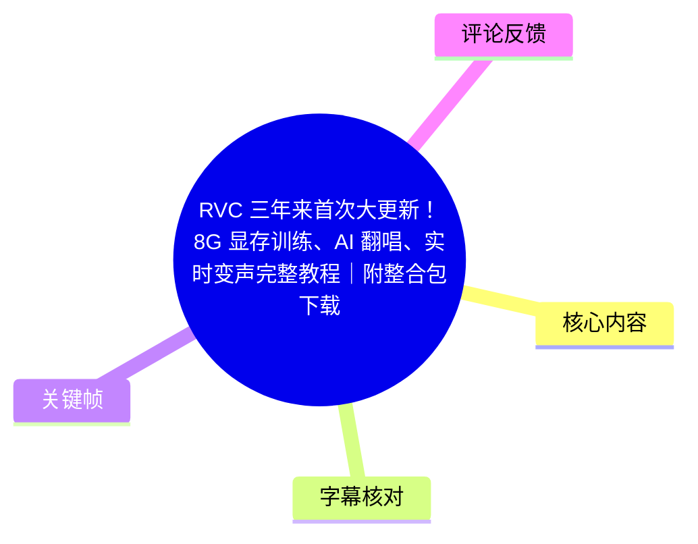
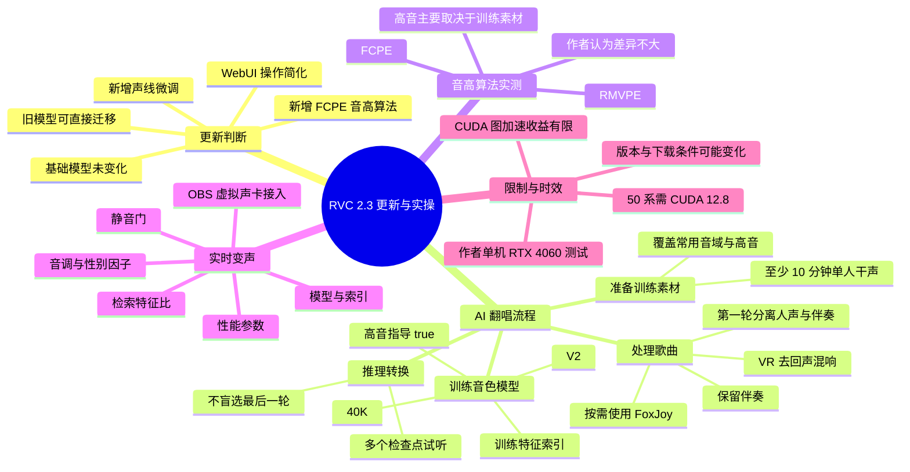
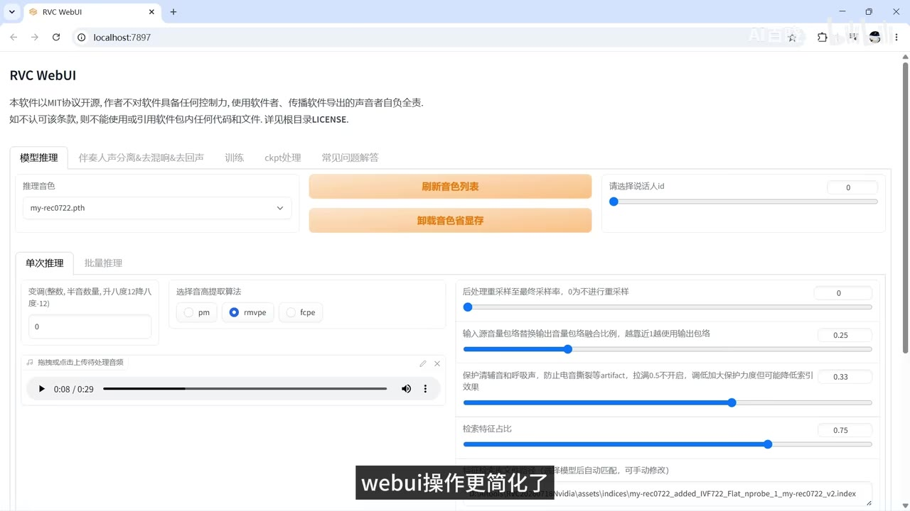
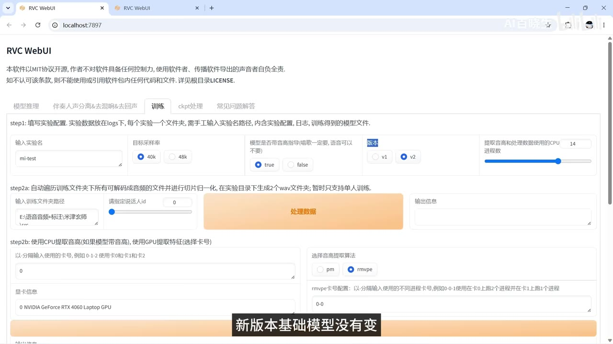
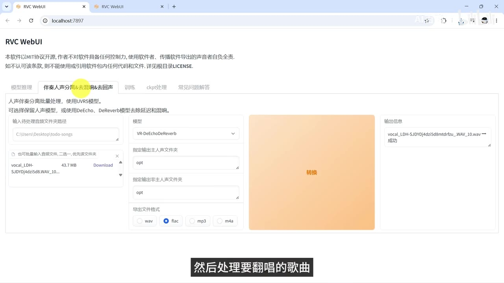

# RVC 三年来首次大更新！8G 显存训练、AI 翻唱、实时变声完整教程｜附整合包下载

> 来源：[Bilibili 视频](https://www.bilibili.com/video/BV1xM3M6FEfj)<br>
> UP 主：AI百晓生｜合集：AIcode｜发布时间：2026-07-24｜视频时长：09:04<br>
> 视频说明中提供笔记链接：<https://aixplore.cc/posts/rvc-2-3-realtime-voice-ai-cover>

## 小结

视频围绕 **RVC 2.3.260718** 的一次正式更新，演示了从音色模型训练、歌曲人声处理、AI 翻唱转换到实时变声与 OBS 接入的完整流程。作者的核心判断是：新版基础模型没有变化，旧版训练得到的模型可以直接迁移使用，但 WebUI 操作、拖拽转换、索引关联、显卡精度适配和部分音频处理能力有所改进。

对于 AI 翻唱，效果的决定因素并不只是模型版本或音高算法，更关键的是训练素材质量、是否覆盖歌唱音域及高音，以及对待翻唱歌曲的人声分离是否“适度”。作者明确提醒：分离模型并非跑得越多越好；每多一次处理，都可能损失声音细节。

训练方面，视频给出了一套面向普通显卡的实测配置：约 12 分钟素材、220 轮、每 20 轮保存、`batch size=4`，作者在其设备上训练一轮接近 1 分钟、总耗时约 3.5 小时。视频标题提及“8G 显存训练”，但正文中没有给出显存占用、显卡型号以外的显存实测数据，因此不能据此推导所有 8GB 显卡均可稳定复现相同配置。

新版提供 FCPE 音高算法，视频以同一段歌曲比较 RMVPE 与 FCPE；作者主观试听结论是两者区别不大，高音表现更受训练集声线与音域覆盖影响。若出现高音撕裂或哑音，可将界面中相关保护/参数下调至 `0.3` 或 `0.25` 再试。

实时变声方面，作者在 RTX 4060 上测试 CUDA 图加速，认为收益不明显：开启后单次推理仅快约 `0.03 秒`，约三分之一。作者因此建议：以翻唱为主要用途可考虑升级；若主要为了实时变声，则不必急于更新，因为旧版实时变声速度已足够。该结论是作者在单一设备与版本环境下的经验，不应外推为所有显卡、驱动、模型和音频配置的普遍结果。

## 思维导图





## 目录

- [更新内容、兼容性与适用判断](#更新内容兼容性与适用判断)
- [AI 翻唱完整流程](#ai-翻唱完整流程)
  - [训练素材与训练配置](#训练素材与训练配置)
  - [歌曲分离与人声清理](#歌曲分离与人声清理)
  - [推理转换、检查点选择与音高算法](#推理转换检查点选择与音高算法)
- [实时变声配置与性能取舍](#实时变声配置与性能取舍)
- [OBS 接入、下载与升级建议](#obs-接入下载与升级建议)
- [参数速查表](#参数速查表)
- [结论、限制与时效性](#结论限制与时效性)
- [字幕比对](#字幕比对)
- [评论分析](#评论分析)
- [处理记录](#处理记录)

## 更新内容、兼容性与适用判断 [00:00:17](https://www.bilibili.com/video/BV1xM3M6FEfj?t=17)

视频先播放原唱与新版 RVC 翻唱效果作为听感示例，随后说明 RVC 在 2023 年以后迎来一次较大的正式更新。作者在视频中列出的更新点包括：

1. **WebUI 操作简化**：音频可直接拖入界面，选择模型后点击转换即可进行翻唱。
2. **推理界面增加声线调整**：后文称为“性别因子”，用于微调声音明亮或粗厚的倾向。
3. **底层计算优化**：实时变声部分实测了 CUDA 图加速开关，但作者在 RTX 4060 上没有观察到显著收益。
4. **新增音高算法**：后文对 RMVPE 与 FCPE 进行同曲段对比。
5. **人声分离新增模型**：但作者强调应按素材效果选择，不宜机械地多轮处理。
6. **旧模型兼容**：新版基础模型没有变化，以前在旧版本训练的模型可以直接复制到新版使用；选择模型后，对应特征索引还能自动关联。



> 图：该关键帧展示 RVC WebUI 的“模型推理”页面，包括模型下拉选择、RMVPE/FCPE 选项、音频拖入区和检索特征比等控制项。它对应“界面简化、模型与索引关联、可直接转换”的更新说明，有助于定位后文参数所在区域。

作者将完整翻唱流程概括为三步：

1. 训练自己的音色模型；
2. 处理待翻唱歌曲；
3. 选择训练好的模型进行转换。

这套流程适合初次使用 RVC、且希望从零建立个人音色模型的用户。已有模型的用户可跳过训练，直接使用新版推理页面进行转换。

## AI 翻唱完整流程 [00:01:03](https://www.bilibili.com/video/BV1xM3M6FEfj?t=63)

### 训练素材与训练配置 [00:01:22](https://www.bilibili.com/video/BV1xM3M6FEfj?t=82)

#### 1. 准备训练素材

作者建议至少准备 **10 分钟干净的单人录音**。若模型主要用于 AI 翻唱，则训练集不应只包含说话录音，还应加入：

- 干净的歌唱干声；
- 常用音域中的演唱片段；
- 高音片段。

作者的经验是：只使用说话录音也可以完成训练，但训练出的模型在高音上可能表现不佳。这个判断也与后文 RMVPE/FCPE 对比的结论一致：高音质量更大程度受训练素材的声线和音域覆盖影响。

操作上，先建立一个单独目录，将全部训练音频放入其中，再进入 RVC 的训练页面。



> 图：该关键帧展示训练页的实验配置区域，可见实验名称、目标采样率、是否带音高指导、版本选择、训练文件夹路径、数据处理及音高提取设置。这是训练步骤中需要先确认的核心界面。

#### 2. 填写实验基础配置

作者给出的设置如下：

| 配置项 | 视频建议/实测值 | 说明 |
| --- | ---: | --- |
| 实验名称 | 自定义 | 为本次训练命名。 |
| 目标采样率 | `40K` | 作者建议使用默认值。 |
| 高音指导 | `true` | 做歌曲翻唱时建议开启。 |
| 版本 | `V2` | 作者建议不改动。 |
| 训练素材目录 | 填入准备好的目录 | 目录内放置训练音频。 |
| 数据处理 | 点击“处理数据” | 对训练数据进行预处理。 |
| 音高提取算法 | 默认 | 作者未在训练部分建议改动。 |
| 特征提取 | 点击“特征提取” | 在数据处理后执行。 |

#### 3. 设置训练参数并开始训练 [00:02:05](https://www.bilibili.com/video/BV1xM3M6FEfj?t=125)

作者说明，数据越长，通常所需总轮数越少；视频中以约 12 分钟素材为例，使用以下参数：

| 参数 | 作者本次设置 | 视频中的作用说明 |
| --- | ---: | --- |
| 训练素材长度 | 约 12 分钟 | 作为轮数设置的参考条件。 |
| 总轮数 | `220` | 作者本次训练使用。 |
| 保存频率 | 每 `20` 轮 | 便于导出多个阶段的小模型测试。 |
| Batch Size | `4` | 作者本次训练使用。 |
| 仅保存最新检查点 | 是 | 完整 G、D 检查点仅保留最新一份。 |
| 所有训练数据加载到缓存 | 否 | 作者的选择。 |
| 每次保存时导出小模型 | 是 | 每 20 轮得到一个可用于推理测试的小模型。 |

设置完成后点击“模型训练”。作者设备上的经验数据是：

- 每轮训练接近 **1 分钟**；
- 220 轮总计约 **3.5 小时**；
- 新版本支持训练中断，后续可从中断点继续训练；
- 模型训练结束后，需再点击“训练特征索引”；
- 也可以在一开始使用“一键训练”；
- 特征索引完成后，训练流程才算结束；
- 回到推理页并刷新，即可看见保存的模型。

> 训练耗时、可用 batch size 与显存压力会随显卡型号、显存容量、CUDA/驱动版本、素材长度、后台负载和软件环境变化。视频没有展示“8GB 显存”下的显存占用曲线或 OOM 边界，不能将这组参数视为对所有 8GB 显卡的保证。

### 歌曲分离与人声清理 [00:03:00](https://www.bilibili.com/video/BV1xM3M6FEfj?t=180)

歌曲预处理会直接影响最终翻唱质量。作者建议将歌曲拖入“伴奏人声分离&去混响&去回声”页面，按以下顺序处理。



> 图：该关键帧展示人声伴奏分离页面，包括待处理音频、模型选择、输出目录、导出格式及“转换”按钮。其价值在于说明歌曲预处理与最终模型推理是两个不同的操作页。

#### 1. 第一轮：分离人声与伴奏

- 将待翻唱歌曲拖入界面。
- 作者口述第一轮使用“HP5”，但同时标注为“口误”；站内字幕亦写作“HP5(口误)”。
- 由于视频画面及字幕均未明确给出经更正后的准确模型名，本文保留原视频表述，不擅自修正。
- 作者称也可以使用这次新增加的分离模型。
- **必须保留第一轮得到的伴奏**，因为最终混音仍需要使用。

#### 2. 第二轮：去回声与混响

- 将第一轮得到的人声文件再次拖入。
- 使用 **VR** 模型清除回声与混响。
- 处理后先试听结果。

#### 3. 视情况追加处理

若仍有明显混响，可使用 **FoxJoy** 模型进一步分离；但如果人声听起来已经干净，则不需要把所有模型都跑一遍。

作者强调的经验原则是：

> 每多处理一次，都可能损失一部分声音细节；应根据素材问题选择模型，而非追求处理次数。

这意味着预处理目标不是“模型链越长越好”，而是取得人声纯净度与细节保留之间的平衡。对人声本来就较干净的歌曲，过度分离可能反而损伤咬字、呼吸、动态或高频细节。

### 推理转换、检查点选择与音高算法 [00:03:44](https://www.bilibili.com/video/BV1xM3M6FEfj?t=224)

#### 1. 用训练模型转换人声

完成人声处理后，切换回推理界面：

1. 选择刚才训练的模型；
2. 作者通常从最后保存的几次模型中挑选候选；
3. 将分离好的人声拖入；
4. 其他参数先保持默认；
5. 点击“转换”并试听。

作者不建议默认选用最后一轮模型。若后期模型出现以下问题：

- 发音不清；
- 高音破裂；

则应尝试较早保存的版本。由于设置为每 20 轮导出一次小模型，用户可以在多个检查点间横向试听，选取综合效果最好的模型，而不是将“训练轮数最大”直接等同于“效果最好”。

#### 2. RMVPE 与 FCPE 音高算法对比 [00:04:21](https://www.bilibili.com/video/BV1xM3M6FEfj?t=261)

视频先播放使用 **RMVPE** 的转换效果，随后在“同一段歌曲、其他参数完全不动”的条件下，改为 **FCPE** 再播放。

作者的主观试听结论是：

- 两种算法的差别并不大；
- 高音效果主要由训练素材中的声线与音域覆盖决定，而非仅由音高算法决定。

当高音转换后出现撕裂或哑音时，作者建议把界面中的相关参数向下调，例如：

```text
0.3
0.25
```

视频未在口述中明确该参数的完整 UI 名称；从推理页面关键帧可见，界面存在“保护清辅音和呼吸声，防止电音撕裂等 artifact”的控制项，画面值为 `0.33`，因此上述建议应理解为对该类保护相关滑块进行试听式下调，而不是对任意参数盲目修改。

## 实时变声配置与性能取舍 [00:05:20](https://www.bilibili.com/video/BV1xM3M6FEfj?t=320)

作者表示，新版实时变声的界面与旧版几乎相同，额外增加了**性别因子调节**；主要更新则在底层计算。

### CUDA 图加速测试 [00:05:28](https://www.bilibili.com/video/BV1xM3M6FEfj?t=328)

作者分别测试 CUDA 图加速开启和关闭状态。在其 **RTX 4060** 环境中：

- 底层加速优化“不明显”；
- 开启时每次推理仅快约 **0.03 秒**；
- 作者估计约为 **三分之一** 的改善。

这是作者的单机测试结果，不代表所有 GPU 的性能表现。实际延迟还会受到输入/输出设备、采样长度、额外推理时长、降噪、模型、检索设置、驱动、CUDA 版本与系统负载共同影响。

### 变声前的模型、索引与设备设置 [00:05:39](https://www.bilibili.com/video/BV1xM3M6FEfj?t=339)

使用实时变声前，按视频顺序完成以下设置：

1. **选择模型**：可以选择自己训练的模型。
2. **选择对应索引文件**：可选，但要注意索引是否真正启用。
3. **索引并非必需**：即使没有特征索引也能运行。
4. **检索特征比默认关闭时索引不生效**：只有开启检索特征比后，上方选择的索引文件才产生作用。
5. **音频设备类型**：作者建议一般优先选择第三个选项；视频未口述该选项的准确名称，因此不补写。
6. **独占设备**：作者建议不要勾选。
7. **输入设备**：选择物理麦克风。

### 常规声音参数 [00:06:03](https://www.bilibili.com/video/BV1xM3M6FEfj?t=363)

| 参数 | 作者建议 | 作用与调整方向 |
| --- | --- | --- |
| 响应阈值 | 从约 `-50` 开始 | 这是输入端静音门。若小声说话被截断，向 `-60` 方向调整。 |
| 音调 | 男转女通常为正；女转男通常为负；同性别为 `0` | 作者示例：`+12` 表示升一个八度。 |
| 性别因子 | 正数更亮、更细；负数更粗 | 仅用于微调，主要音域仍由音调控制。 |
| 检索特征比 | 可从 `0.5` 开始试听 | 若为 `0`，即使已指定索引文件也不会生效；提高后可让输出更贴近训练音色。 |
| 响度因子 | 一般 `0.2–0.5` | 控制输出音量是否跟随麦克风音量。 |
| 常规参数调整方式 | 可边转换边听边调 | 作者认为大部分常规参数允许实时试听调整。 |

### 性能设置与延迟/质量平衡 [00:06:54](https://www.bilibili.com/video/BV1xM3M6FEfj?t=414)

作者说明，右侧性能设置通常**不支持热调整**：修改后需要重新开始转换才能生效。

| 性能项 | 视频建议 | 取舍 |
| --- | --- | --- |
| 采样长度 | 普通显卡先从 `0.25–0.3` 开始 | 越小响应越快，但显卡压力越大。 |
| 淡入淡出长度 | `0.03–0.05` | 用于片段衔接。 |
| 额外推理时长 | `1.5–2.5 秒` | 数值越大，变声连续性更好，但计算量更高。 |
| 输入降噪 | 不建议开启 | 会明显增加计算负担。 |
| 输出降噪 | 不建议开启 | 同样会明显增加计算负担。 |

视频随后以一段“青藏高原—雪豹”旁白进行实时变声播放，用于示范运行效果。该示例展示的是作者当前模型、设备及参数组合下的听感，不能独立用于证明实时延迟或音质的通用水平。

## OBS 接入、下载与升级建议 [00:07:51](https://www.bilibili.com/video/BV1xM3M6FEfj?t=471)

### 使用虚拟声卡将变声结果送入 OBS

若要把 RVC 的实时变声结果送入 OBS，作者建议安装虚拟声卡，例如 **VB-Cable**。连接逻辑如下：

```text
物理麦克风
  ↓
RVC 输入设备
  ↓
RVC 输出设备：Cable Input
  ↓
OBS 音频输入采集：Cable Output
```

具体步骤：

1. 安装虚拟声卡，例如 VB-Cable；
2. 将物理麦克风设为 RVC 的输入设备；
3. 将 RVC 的输出设备选择为 `Cable Input`；
4. 在 OBS 中添加“音频输入采集”；
5. 在 OBS 的该音频输入设备中选择 `Cable Output`；
6. **不要在 OBS 中同时采集物理麦克风**，否则原始声音和变声后声音会叠加。

这是一项容易忽略的路由限制：RVC 输出已是由物理麦克风驱动的处理结果，OBS 再单独采集同一物理麦克风，便会形成原声与变声音并存的结果。

### 整合包下载条件 [00:08:13](https://www.bilibili.com/video/BV1xM3M6FEfj?t=493)

作者称整合包下载笔记链接位于评论区置顶，并按显卡类别给出建议：

| 硬件类别 | 视频中的下载/安装说明 |
| --- | --- |
| 英伟达 50 系以下显卡 | 下载对应的整合包。 |
| 英伟达 50 系显卡 | 使用单独版本，且需先安装 `CUDA 12.8`，整合包才能使用。 |
| AMD、Intel 显卡 | 选择最后的链接下载。 |
| 国内用户 | 可使用笔记中的备用下载链接。 |

> 下载链接、整合包维护状态、驱动兼容性及 CUDA 依赖均有时效性。上述条件仅记录视频发布时的作者说明；实际安装前应以笔记页、项目发布页及对应整合包说明为准。

### 作者的升级建议 [00:08:33](https://www.bilibili.com/video/BV1xM3M6FEfj?t=513)

作者的最终建议按使用场景区分：

- **主要用于 AI 翻唱**：建议更新至最新版本。虽然基础模型没有变化，但作者个人感觉新版翻唱效果更好；新版还会自动检测显卡并加载不同模型精度，对普通显卡更友好。
- **主要用于实时变声**：不用急于升级。作者认为旧版实时变声的速度已经足够，新版在其 RTX 4060 上的底层加速收益也不明显。

这里“翻唱效果更好”属于作者的主观听感判断；“自动检测显卡、加载不同模型精度”是视频陈述。不同模型、素材和硬件下的结果仍需本地复测。

## 参数速查表 [00:01:48](https://www.bilibili.com/video/BV1xM3M6FEfj?t=108)

### 训练与翻唱

| 环节 | 参数/动作 | 视频建议或实例 |
| --- | --- | ---|
| 训练素材 | 时长 | 至少 10 分钟干净单人录音。 |
| 训练素材 | 内容 | 翻唱用途应加入歌唱干声，覆盖常用音域和高音。 |
| 训练 | 目标采样率 | `40K`。 |
| 训练 | 高音指导 | `true`。 |
| 训练 | 版本 | `V2`。 |
| 训练 | 示例数据量 | 约 12 分钟。 |
| 训练 | 总轮数 | `220`。 |
| 训练 | 保存间隔 | 每 `20` 轮。 |
| 训练 | Batch Size | `4`。 |
| 训练 | 仅保存最新检查点 | 是。 |
| 训练 | 数据加载到缓存 | 否。 |
| 训练 | 每次保存导出小模型 | 是。 |
| 后处理 | 第一轮分离 | 视频口述“HP5（口误）”，准确更正名未给出。 |
| 后处理 | 第二轮清理 | `VR` 去回声、混响。 |
| 后处理 | 按需追加 | `FoxJoy`，仅在人声仍有混响等问题时考虑。 |
| 推理 | 音高算法 | RMVPE 与 FCPE 均可；作者认为差别不大。 |
| 推理 | 高音撕裂/哑音 | 尝试将相关保护参数降至 `0.3` 或 `0.25`。 |
| 模型选择 | 检查点 | 不默认选最后一轮；对比多个保存版本。 |

### 实时变声

| 参数 | 建议值/方向 | 注意事项 |
| --- | --- | --- |
| 响应阈值 | 从约 `-50` 开始 | 声音被截断时向 `-60` 调。 |
| 男转女音调 | 正数，如 `+12` | 作者称 `+12` 为升一个八度。 |
| 女转男音调 | 负数 | 同性别模型一般设 `0`。 |
| 性别因子 | 正亮细、负粗厚 | 仅做微调，不主导音域。 |
| 检索特征比 | 从 `0.5` 开始试听 | 为 `0` 时索引文件不生效。 |
| 响度因子 | `0.2–0.5` | 输出对麦克风音量的跟随程度。 |
| 采样长度 | `0.25–0.3` 起步 | 越小延迟越低，GPU 压力越大。 |
| 淡入淡出长度 | `0.03–0.05` | 用于改善衔接。 |
| 额外推理时长 | `1.5–2.5 秒` | 越大连续性越好、计算量越高。 |
| 输入/输出降噪 | 不建议开启 | 会大幅增加计算负担。 |

## 结论、限制与时效性 [00:08:33](https://www.bilibili.com/video/BV1xM3M6FEfj?t=513)

本视频最可迁移的经验并非单一参数，而是以下几项工作原则：

1. **训练集质量优先于算法噱头**：想获得更稳定的歌唱和高音表现，应优先补足干净歌声、常用音域和高音素材。
2. **歌曲预处理要克制**：保留第一轮伴奏；人声去混响、去回声应以试听为准，避免所有模型串行处理导致细节损失。
3. **检查点需要试听筛选**：最后一轮不一定最佳。发音不清或高音破裂时，较早阶段的小模型可能更合适。
4. **实时变声需在连续性、延迟与算力间权衡**：采样长度、额外推理时长和降噪都会改变资源压力与表现。
5. **索引配置必须检查检索特征比**：索引文件已选中不等于索引正在生效；特征比为 `0` 时索引无效。
6. **OBS 路由要避免双收音**：使用虚拟声卡时，只在 OBS 采集 `Cable Output`，避免另加物理麦克风。

### 局限

- 视频中的训练速度、CUDA 图加速效果来自作者的 RTX 4060 单机环境，未展示完整硬件、驱动、显存与延迟测量条件。
- “新版翻唱更好”的结论是作者的个人听感，不是带有客观评分或盲测的结论。
- 首轮人声伴奏分离模型名称在视频字幕中标记为“HP5（口误）”，但没有给出明确更正，不能据此确认准确模型名。
- 标题中的“8G 显存训练”没有在字幕中提供独立、可核验的显存占用数据或稳定性边界。
- 关于 CUDA 12.8、英伟达 50 系显卡及整合包的兼容说明具有版本时效性，后续项目更新可能改变安装要求。
- 使用他人声线训练、翻唱受版权保护的歌曲、传播合成声音时，应自行确认素材授权、平台规则、隐私及当地法律责任。视频页面也提示软件采用 MIT 协议且使用者应对导出声音负责。

## 字幕比对

本次素材存在音轨：ASR 任务读取了 `audio/audio.wav`，识别诊断显示总时长约 `543.02 秒`、语音覆盖约 `83.86%`，**未标记 `noAudioStream=true`**。因此不存在“源视频没有音轨”的情况。

| 字幕来源 | 完整性 | 专有名词 | 时间轴 | 主要问题 |
| --- | --- | --- | --- | --- |
| Bilibili 站内字幕 | 覆盖开场、讲解、示例音频与结尾，分段细，内容完整 | 整体较好；含 `RVC`、`RMVPE`、`FCPE`、`VR`、`FoxJoy`、`VB-Cable`、`CUDA12.8` 等 | 244 个细粒度分段，可直接对应具体操作 | 首轮分离模型写作“HP5（口误）”，但未给出更正名称；少量 UI 参数未逐字说明。 |
| 本次 ASR 字幕 | 28 个长分段，语音覆盖约 83.86%，与视频时长匹配 | 误识别较多，如“变声”识别为“变身”、“人声分离”为“人生分离”、`CUDA 图加速`为“扩大图加速”、`VB-Cable`为“VB Carbo” | 有时间戳，起止点与站内字幕整体接近，但分段较粗 | 专有名词和汉字错误较多；部分语句截断或混入示例音频文本；“true/否/是”等设置被错误转写。 |

### 最终字幕选择与校正原则

正文以**站内字幕 p01-zh.srt**作为主要事实与时间轴依据，原因是其分段更细、术语准确度明显高于本次 ASR；同时已完成对本次 ASR 的检查与比较。

以下内容经站内字幕、ASR 上下文和关键帧画面交叉校正：

| ASR 错误/不稳定表述 | 正文采用表述 | 校正依据 |
| --- | --- | --- |
| “RV C”“Web UI”混写 | RVC、WebUI | 站内字幕与画面标题。 |
| “变身界面” | 变声界面 | 站内字幕语义。 |
| “人生分离” | 人声分离 | 站内字幕与功能页面画面。 |
| “分禁模型” | 分离模型 | 站内字幕上下文。 |
| “FH5” | 保留“HP5（口误）” | 站内字幕明确标注“HP5（口误）”；原视频未提供可证实的更正名。 |
| “FocusJoy” | FoxJoy | 站内字幕。 |
| “扩大图加速” | CUDA 图加速 | 站内字幕。 |
| “VB Carbo / Carbo Input” | VB-Cable / Cable Input / Cable Output | 站内字幕及 OBS 接线语境。 |
| “响应阈值是输出端的静音门” | 输入端静音门 | 站内字幕。 |
| `Q`、`4`、`5` 等 | `true`、是、否 | 站内字幕中的明确参数表述。 |

## 评论分析

以下仅分析本次可获取的热评前三条；评论反映的是用户体验或提问，并非已验证事实。

1. **鱼板yoyo（6 赞）**  
   评论认为新版“不如旧版”，并称游戏时开启变声延迟更大、效果也更差。该反馈与视频作者在 RTX 4060 上观察到 CUDA 图加速收益不明显形成一定呼应：新版未必会在实时场景中带来明显速度提升。  
   但评论没有提供显卡、模型、采样长度、音频设备、驱动、CUDA 版本或延迟测量方法，因此不能直接得出“新版实时变声普遍更差”的结论。

2. **半躺的卡修（0 赞）**  
   评论询问新版 RVC 翻唱与 SoulX 相比哪个更好。这是一个产品/方案横评需求，但视频没有比较 SoulX，也没有提供相同素材、模型、参数下的对照测试，因此无法从本视频得出答案。  
   合理的比较至少需要统一训练素材、目标声线、歌曲、人声分离方案、音高算法和后期混音条件。

3. **lmdying（0 赞）**  
   评论询问 CUDA `12.9` 是否会受影响。视频只明确说明英伟达 50 系版本需先安装 `CUDA 12.8`，未讨论 CUDA 12.9 的兼容性。  
   因而不能将视频中的 CUDA 12.8 前置要求延伸解释为“12.9 一定可用”或“一定不可用”；应查看对应整合包的运行时依赖、发布说明及实际启动日志。

## 处理记录

- Worker ID：`worker-mrj0www4-e8d79408`
- 模型：`gpt-5.6-terra`
- ASR 模型：`large-v3-turbo`（语言：`zh`；设备：`cuda`；计算类型：`int8_float16`）
- 使用的素材与工具产物：
  - 视频元数据与页面信息；
  - 站内字幕：`subtitles/p01-zh.srt`；
  - 本次 ASR：`asr/transcript.srt`、`asr/asr-result.json`；
  - 音频：`audio/audio.wav`；
  - 关键帧目录：`frames/`；
  - 热评数据：`comments/comments.json`。
- 字幕选择：以站内 SRT 为正文主字幕和章节时间轴依据；已对比本次 ASR。ASR 具有真实时间戳但分段较粗、专有名词误识别较多，仅用于覆盖诊断与交叉核对。
- 关键帧选择依据：
  - `frames/frame-001.jpg`：推理页，展示模型选择、音高算法、检索与音频转换区域；
  - `frames/frame-002.jpg`：训练页，展示 40K、高音指导、V2、数据处理和特征提取等训练配置；
  - `frames/frame-003.jpg`：人声伴奏分离与去混响页面，支持歌曲预处理流程说明。
- 时间轴依据：优先采用站内 SRT 的真实起止时间换算秒数；章节链接均使用 `https://www.bilibili.com/video/BV1xM3M6FEfj?t=<秒数>`。
- 缓存清理：未提供可执行的缓存清理日志或结果；本文不虚构清理状态。
- 未解决问题：
  - “HP5（口误）”对应的准确分离模型名称未在现有素材中明确更正；
  - CUDA 12.9 与该整合包的兼容性未在视频中说明；
  - 8GB 显存训练的具体显存占用、可复现硬件边界及各显卡表现未提供。
