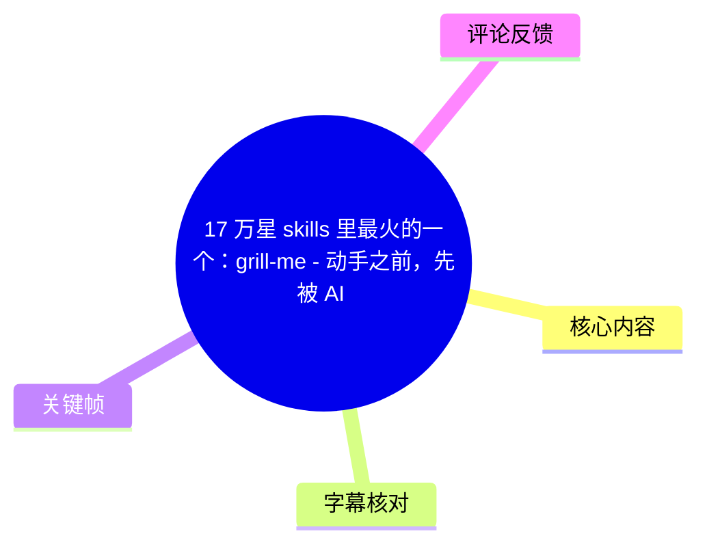
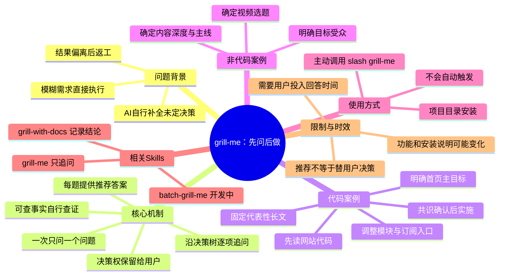
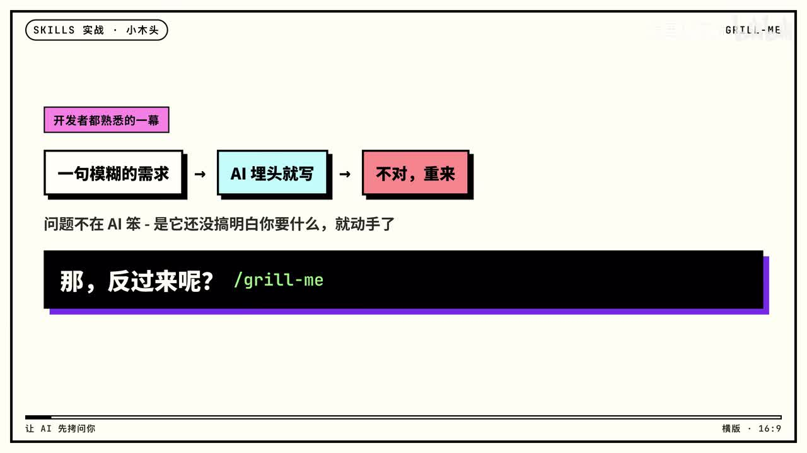
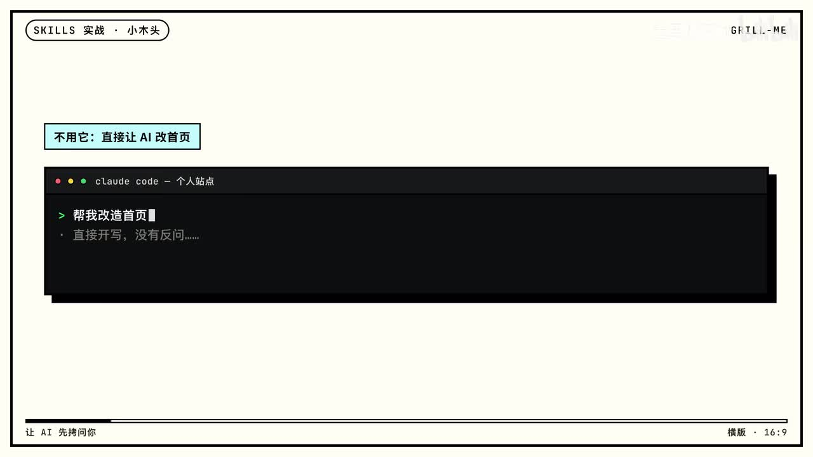
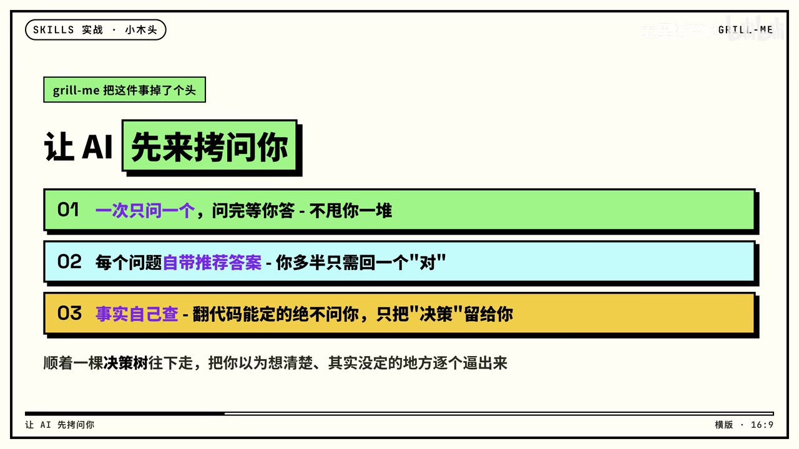

# 17 万星 skills 里最火的一个：grill-me - 动手之前，先被 AI 问明白

> 来源：[Bilibili 视频](https://www.bilibili.com/video/BV18pKy6oESJ)<br>
> UP 主：五里墩茶社｜时长：08:31｜合集：AIcode<br>
> 视频提及仓库：[mattpocock/skills](https://github.com/mattpocock/skills)

## 小结

视频介绍了 `grill-me`：一个用于让 AI **先澄清决策、后执行任务**的 Skill。它针对的并不是“AI 写得不够快”，而是用户以一句模糊需求直接要求 AI 改代码、写内容或做方案时，许多关键取舍尚未明确，AI 只能自行补全；等结果出来，返工已经发生。

`grill-me` 的做法是沿着决策树逐项提问，把“事实核查”与“需要人拍板的决策”分开：能通过项目代码、内容或既有资料查到的事，AI 自己先查；只有目标、取舍、受众、深度等需要用户授权的选择，才会暂停询问。视频强调其交互原则为：**一次只问一个问题、每题附带推荐答案、主意仍由用户决定**。

作者用两个案例展示用途。代码案例中，AI 先阅读个人网站代码，再围绕首页目标、模块取舍、订阅入口位置、主视觉内容等问题逐步收敛，最后先给出共识清单，得到确认后才开始改首页。非代码案例中，`grill-me` 被用于决定下一期视频选题与讲解深度，说明这种“追问式澄清”也可用于内容策划。

使用上，视频称可在项目目录通过 `npx skills add` 添加 Matt Pocock 仓库中的 `grill-me`，随后在对话中用 `/grill-me` 主动调用；它**不会自动触发**。视频没有给出完整、可复制的仓库参数组合，因此应以仓库当前说明为准。视频还区分了 `grill-me`、`grill-with-docs` 和开发中的 `batch-grill-me`：前者只问不记录，后者会边问边留下词汇表和决策档案，后者则面向希望一次获得一批问题的用户。

“17 万星”“最受欢迎”“约 45 分钟完成一次对话”均为视频中的陈述，具有发布时点和个人使用场景属性；仓库热度、Skill 名称、安装方式、插件市场状态及开发中功能均可能随版本变化。

## 思维导图





## 目录

- [问题：模糊需求为何导致返工](#问题模糊需求为何导致返工)
- [核心机制：让 AI 先问清楚](#核心机制让-ai-先问清楚)
- [原理与安装调用](#原理与安装调用)
- [实战一：个人网站首页改造](#实战一个人网站首页改造)
- [实战二：不用写代码也能做选题决策](#实战二不用写代码也能做选题决策)
- [相关 Skills、限制与时效性](#相关-skills限制与时效性)
- [字幕比对](#字幕比对)
- [评论分析](#评论分析)
- [处理记录](#处理记录)

## [问题：模糊需求为何导致返工](https://www.bilibili.com/video/BV18pKy6oESJ?t=2)

视频开头将常见的人机协作过程概括为：用户给出一句模糊需求，AI 立即埋头执行；结果出来后发现并非所需，只能重新开始。视频的判断是，问题不必然在于 AI“笨”，而在于它尚未理解用户真正想要什么，就开始行动。



> 图：画面用“一句模糊的需求 → AI 埋头就写 → 不对，重来”概括传统流程，并直接引出 `/grill-me`。这张图是理解工具动机的关键：减少返工的重点是前置澄清，而非单纯要求 AI 生成更多内容。

### [直接改首页时遗漏了什么](https://www.bilibili.com/video/BV18pKy6oESJ?t=50)

UP 主以个人站点首页翻新为例：自己基本只更新博客，于是向 **Claude Code** 输入“帮我改造首页”。这里的“Claude Code”可由关键帧中的终端标题校正；ASR 在该处存在“Cloud Code”“首顶”等识别偏差。

直接执行后，AI 按自己的理解决定了：

- 首页应主推什么；
- 哪些模块应保留、哪些应删减；
- 订阅框应放在哪里。

而“首页真正要主推的内容是什么”“最关心的订阅问题如何处理”等关键信息，用户一开始没有明确说明，AI 也没有反问。因此，产出虽完成了页面修改，却未必满足真正的目标，后续仍要重新沟通、重新改造。



> 图：画面展示“**不用它：直接让 AI 改首页**”以及终端中的“帮我改造首页”输入，说明案例的初始条件。其价值在于区分“执行任务”与“澄清任务”两个阶段。

## [核心机制：让 AI 先问清楚](https://www.bilibili.com/video/BV18pKy6oESJ?t=99)

`grill-me` 将流程反转：在开工之前，AI 围绕计划逐项追问，并沿决策树推进，目的是把用户以为已想清楚、实际上尚未确定的事项暴露出来。


> 图：画面以“让 AI 先来拷问你”定义 `grill-me`。这里“拷问”指结构化追问，而不是让 AI 替代用户作出最终选择。

### [三条交互设计原则](https://www.bilibili.com/video/BV18pKy6oESJ?t=99)

视频明确给出三条设计原则：

1. **一次只问一个问题，等待回答后再继续。**  
   不把十个问题一次性抛给用户，以避免信息压力过大，也让后续问题能够依据前一个答案动态调整。

2. **每个问题附带推荐答案。**  
   用户很多时候只需回复“对”，即可继续对话；如果推荐不符合需求，再补充自己的选择。这降低了用户每轮都要长篇解释背景的成本。

3. **能自行查到的事实不问用户，只保留决策问题。**  
   例如项目里某个组件如何实现、现有内容如何组织，AI 应先翻看代码或资料；只有真正需要用户拍板的目标与取舍，才停下来提问。



> 图：画面完整列出“一次只问一个”“每题自带推荐答案”“事实自己查、只把决策留给你”。这是视频方法论最集中的信息，适合作为实际配置或评估同类 Agent 的检查清单。

### [推荐答案不等于代替用户决策](https://www.bilibili.com/video/BV18pKy6oESJ?t=123)

视频称，Matt Pocock 曾在文章中展示过该 Skill 的完整源代码，其核心意思是：持续追问计划的每一个方面，直到双方达成共识。后续加入“每个问题给出推荐答案”这一句后，对话显著加速。

这里应注意边界：

- 推荐答案用于降低回答成本、推动对话，而不是绕开用户授权；
- AI 可以通过代码、文档等材料自行核实事实，但不应擅自定义业务目标；
- 达成“共识”后再执行，是视频描述的理想流程；实际效果仍取决于模型是否真的遵守该 Skill，以及用户是否认真校验总结。

## [原理与安装调用](https://www.bilibili.com/video/BV18pKy6oESJ?t=171)

视频认为，Skill 是否有效与文本长度不必然相关：`grill-me` 本体较小，但可通过明确的行为约束改变对话时序。

### [安装信息](https://www.bilibili.com/video/BV18pKy6oESJ?t=171)

视频给出的操作信息如下：

| 项目 | 视频中的信息 | 使用时的注意点 |
| --- | --- | --- |
| 安装位置 | 在项目目录中运行 | 应确保命令作用于目标项目，而不是任意目录。 |
| 命令前缀 | `npx skills add` | 视频未在 ASR 文本中完整展示后续仓库参数与 Skill 参数，不应据此拼接为未经验证的完整命令。 |
| 来源 | Matt Pocock 的 skills 仓库 | 视频简介给出链接：`https://github.com/mattpocock/skills`。 |
| 目标 Skill | `grill-me` | 名称由视频标题、简介、关键帧和上下文共同确认。 |
| 另一种入口 | Claude Code 插件市场可订阅整套 Skill | 此为视频陈述；市场可用性与订阅机制应以当前客户端为准。 |

```bash
npx skills add
```

> 上方仅保留视频明确说出的命令前缀，并非完整可执行安装命令。应打开仓库当前文档，确认仓库地址、目标 Skill 名称和适配客户端的准确参数后再执行。

### [调用方式与触发限制](https://www.bilibili.com/video/BV18pKy6oESJ?t=195)

安装后，视频称可以在对话中输入：

```text
/grill-me
```

该 Skill **不会自动触发**，需要用户主动调用。视频将此描述为有意设计：只有当用户希望被追问、愿意投入时间澄清问题时，才将它叫出来。由此也意味着，它不适合每一次低风险、边界已足够明确的小改动。

视频还提到，Matt Pocock 称 `grill-me` 是其用户中最受欢迎的一个 Skill，并曾为此写帖讨论。此为转述的作者观点，不构成对实时使用数据的独立验证。

### [适用于代码之外的原因](https://www.bilibili.com/video/BV18pKy6oESJ?t=219)

视频举例称，Matt Pocock 也用它决定一门课程要做什么。一次这类对话大约可持续 **45 分钟**；结束后会得到一段包含上下文、个人想法和难题答案的对话记录。

UP 主将其类比为程序员“对着小黄鸭自言自语”以整理思路的方法，但这里由 AI 以一问一答方式持续追问，带有一定“对抗性”。其可迁移价值在于：

- 先允许用户抛出零散、未结构化的想法；
- 再把问题拆成可选择、可确认的决策节点；
- 通过逐步回答形成可回看的决策脉络。

“约 45 分钟”不是固定参数；所需时间会随问题复杂度、资料规模、参与者回答质量和模型行为而变化。

## [实战一：个人网站首页改造](https://www.bilibili.com/video/BV18pKy6oESJ?t=243)

### [步骤 1：以同一需求启动，但先读取代码](https://www.bilibili.com/video/BV18pKy6oESJ?t=243)

UP 主重新使用“帮我改造首页”这一需求，但先调用 `/grill-me`，不允许 AI 立即修改页面。视频称 AI 的第一步不是发问，而是先翻看代码；在获得项目上下文后，才开始提出关键问题。

这一行为对应前述原则：项目中可以确认的事实应由 AI 自行检索，而不是让用户重复描述。

### [步骤 2：确认首页的单一主目标](https://www.bilibili.com/video/BV18pKy6oESJ?t=268)

AI 提出的第一个问题是：这次改造最希望访客完成的那一件事是什么？

视频列出的候选方向包括：

- 阅读最新写作；
- 认识站长；
- 了解课程和咨询。

AI 的推荐是：既然该网站主要更新博客，就让博客成为首页主角。UP 主确认了该建议，并补充“还想提高订阅率”。随后对话继续进入模块保留、删减等问题。

这里体现的不是“AI 自动找到唯一正确答案”，而是先把“首页优化”这个笼统说法转为可判断优先级的目标问题。

### [步骤 3：把订阅组件问题放回真实页面上下文](https://www.bilibili.com/video/BV18pKy6oESJ?t=292)

在询问订阅框应放几处、放在哪里时，AI 通过代码发现：订阅组件的文案本身写得不错，但它孤零零地位于页面底部，许多访客可能不会滚动到那里。

视频据此得到的并不是“重写文案”，而是“重新安排入口位置”的决策方向。这说明在已有项目中，先检查现状可以避免用户把问题错误归因于文案、样式或功能本身。

### [步骤 4：发现主视觉默认规则的隐患](https://www.bilibili.com/video/BV18pKy6oESJ?t=316)

AI 继续翻看文章，发现最近 10 篇博客都是每日一篇的 AI 早读日报；而首页大图位的默认逻辑是展示最新文章。它提醒：若维持该规则，首页最显眼的位置会展示一篇日报，而不一定是最能代表网站的文章。

UP 主此前没有意识到这一点，最终确定：大图固定选择最新的一篇长文，而非机械取最新发布内容。

这一环节是案例中最有价值的一处：AI 并非只针对用户说出的字段提问，还通过检查内容更新规律和页面默认逻辑，发现了用户未显式提出的产品风险。

### [步骤 5：汇总共识，确认后才动手](https://www.bilibili.com/video/BV18pKy6oESJ?t=340)

在关键问题确定后，AI 将双方共识整理为小结：

1. 博客作为首页主角；
2. 订阅入口放在两处；
3. 首页大图锁定长文；
4. 其余板块降级处理。

随后 AI 询问“这样对吗”，得到确认后才表示可以开始动手。UP 主回顾称，整个过程大约问了五六个问题，没有无关问题；它们都是原始需求“帮我改造首页”中未写出来、但实施时无法绕开的事项。

**可复用的执行流程：**

1. 提供任务的初始描述；
2. 主动调用 `/grill-me`；
3. 允许 AI 先读取项目代码、配置和相关内容；
4. 每轮只回答当前一个决策问题，接受或修正推荐；
5. 检查 AI 输出的共识小结是否覆盖目标、取舍与约束；
6. 明确确认后，再授权实施改动；
7. 对实施结果仍进行常规代码审查、测试和验收。

## [实战二：不用写代码也能做选题决策](https://www.bilibili.com/video/BV18pKy6oESJ?t=364)

视频的第二个案例证明，`grill-me` 不限于编程任务。UP 主希望决定 Skills 系列下一期做什么，提供了包括 Hyperframes 的若干 Skill 和其他方向在内的候选话题。

### [从选题到叙事主线的三层决策](https://www.bilibili.com/video/BV18pKy6oESJ?t=388)

AI 没有直接替用户选题，而是依次推进：

| 决策层 | AI 的提问或建议 | 用户的作用 |
| --- | --- | --- |
| 主题 | 下一期做哪个主题 | AI 推荐从介绍其他人的 Skill，转回自己日常使用的工具；用户可接受或调整。 |
| 受众与深度 | 做给谁看、讲多深 | AI 推荐轻量级、面向想上手的观众；UP 主明确要求面向开发者做专业介绍。 |
| 叙事主线 | 这期专业介绍的主线是什么 | 在用户确认硬核方向后，继续将内容结构具体化。 |

视频强调：AI 给的是推荐而不是替用户拍板。即使 AI 推荐“轻一点”，用户选择“硬核”，系统也应记录该决定并据此继续追问。最终经过三个问题，选题、内容深度、主线以及开头切入点均得到梳理。

### [这个案例的经验边界](https://www.bilibili.com/video/BV18pKy6oESJ?t=437)

视频认为，该过程将原本可能让人纠结半天的选题会，转为连续的一问一答，并留下可直接使用的记录。可迁移到课程设计、产品方案、写作大纲、会议决策等需要明确取舍的任务。

但这并不表示问答本身自动产生好判断。其质量仍依赖于：

- 是否有足够的背景材料供 AI 参考；
- 用户是否愿意明确表达优先级和反对意见；
- AI 的推荐是否被用户审查，而非被默认接受；
- 最终记录是否被用于后续执行与复盘。

## [相关 Skills、限制与时效性](https://www.bilibili.com/video/BV18pKy6oESJ?t=437)

### [不要混淆几个相近 Skill](https://www.bilibili.com/video/BV18pKy6oESJ?t=437)

视频提醒 `grill-me` 有几个“兄弟”，功能边界不同：

| 名称 | 视频中的定位 | 输出与适用情形 |
| --- | --- | --- |
| `grill-me` | 只负责提问 | 问完后不额外留下文档；适合只想快速完成澄清的人。 |
| `grill-with-docs` | 追问同时沉淀结论 | 会把项目术语写入词汇表，并将难以回头的决定记录为决策档案；适合需要形成可追溯文档的项目。 |
| `Grilling` | 共用的追问引擎 | 视频称上述相关 Skill 底层共用该引擎。 |
| `batch-grill-me` | 开发中 | 一次提出当前可问的一整批问题，适合更看重速度的场景。 |

### [收益、成本与适用范围](https://www.bilibili.com/video/BV18pKy6oESJ?t=461)

视频的结论是：让 AI 执行任务前，先花几分钟用追问把问题梳理清楚，通常比后续返工更划算。

适合使用的情况：

- 需求看似简单，但涉及多个产品、内容或技术取舍；
- 项目中已有代码、文档或内容可供 AI 查阅；
- 改动成本高，或存在难以回滚的决定；
- 用户需要形成可复用的决策记录。

不一定需要使用的情况：

- 目标、输入、验收标准已经足够明确；
- 任务极小、可快速验证且返工成本低；
- 用户无法投入时间回答澄清问题；
- 任务涉及敏感项目资料，但尚未确认模型、插件和数据权限边界。

### [时效性说明](https://www.bilibili.com/video/BV18pKy6oESJ?t=485)

本视频发布于元数据所示的 2026-07-20 附近，以下信息应视为**视频发布时的陈述**，使用前须核查最新仓库或客户端文档：

- “17 万星”仓库热度；
- `grill-me` 是否仍为最受欢迎的 Skill；
- `npx skills add` 的完整安装语法；
- Claude Code 插件市场中订阅整套 Skill 的可用性；
- `grill-with-docs`、`batch-grill-me` 的名称、功能和开发状态；
- 一次对话“约 45 分钟”的经验时长。

## 字幕比对

| 字幕来源 | 完整性 | 专有名词 | 时间轴 | 主要问题 |
| --- | --- | --- | --- | --- |
| Bilibili 站内字幕 | 未提供可用字幕 | 无法评估 | 无法评估 | 素材处理记录显示字幕工具报错 `Invalid URL`，未取得可用站内 SRT。 |
| 本次 ASR 字幕 | 较完整：21 段，覆盖约 503 秒 / 510.528 秒（98.53%） | 存在少量同音与断词误识别 | 完整提供分段起止时间 | 如 `Grealme`、`Matt Polcock`、`Cloud Code`、`首顶/手页`、`订月` 等需结合上下文校正。 |

**最终字幕选择：** 采用本次 ASR 的带时间戳结果作为时间轴依据。ASR 诊断显示语言为中文、置信度约 `0.9976`，未标记 `noAudioStream=true`，且不存在较大无语音间隔；因此源视频有可识别音轨，并非无音轨视频。

**重要校正：**

- `Grealme` / `Greal me` → `grill-me`：由视频标题、简介中的 GitHub 链接、关键帧文字与上下文确认。
- `Matt Polcock` → `Matt Pocock`：由视频简介中仓库地址 `github.com/mattpocock/skills` 校正。
- `Cloud Code` → `Claude Code`：关键帧终端标题清晰显示 “Claude code”。
- `首顶` / `手页` → “首页”：结合案例语义及关键帧中的“帮我改造首页”校正。
- `订月` → “订阅”：上下文持续讨论订阅框、订阅组件与订阅率。

## 评论分析

仅分析本次可获取的热评前三条；评论反映的是观众观点或转述，不能直接视作已验证事实。

1. **我可是森森呢（72 赞）**  
   评论称“作者已经升级成了 `grill with docs`，搭配另外 2 个 skill，三管齐下”。这与视频后段提到 `grill-with-docs` 及其他相关 Skill 的内容相呼应，补充了观众对组合使用方式的关注。但评论未提供版本、仓库提交记录或具体配置，不能据此确认“已经升级”的实时状态。

2. **闪耀金金（24 赞）**  
   评论质疑“ 一下子问了 5 个问题，这是在调教我吧”。这反映出观众对追问成本与交互压力的担忧。视频所述设计原则是“一次只问一个问题”，而非一次抛出五个问题；案例中“问了五六个问题”指整段流程的总量。该评论也提示实践中应控制每轮问题数量，避免违背工具的设计初衷。

3. **波风小蒙（2 赞）**  
   评论请求“总结后以 md 格式发我邮箱”。该评论没有提供关于工具效果或技术细节的补充，主要体现观众希望将视频内容沉淀为 Markdown 文档的需求。由于评论中未提供邮箱地址，也不应推断存在后续发送行为。

## 处理记录

- **Worker ID**：`worker-mrj0www4-e8d79408`
- **模型**：`gpt-5.6-terra`
- **工具与素材**：使用任务提供的视频元数据、ASR 诊断、`asr/transcript.srt`、ASR 分段结果、12 张关键帧路径及热评 JSON；未额外联网验证仓库当前状态。
- **字幕选择**：未获取到可用站内字幕；已检查本次 ASR，采用其 SRT 时间戳作为章节链接依据。ASR 有音轨、时间轴完整，但针对专有名词和个别中文词语进行了基于标题、简介与画面的审慎校正。
- **关键帧选择依据**：选取 `frame-001.jpg` 展示问题—返工链路、`frame-002.jpg` 展示直接执行首页改造的对照场景、`frame-003.jpg` 展示“先来拷问你”的核心定位、`frame-004.jpg` 展示三条设计原则；均直接服务于正文的概念解释，而非仅作装饰。
- **缓存清理**：未提供可执行的缓存清理工具或清理回执；未声称已完成文件删除。
- **未解决问题**：未能获得站内字幕；无法从现有素材确认完整安装命令参数，也未独立验证 GitHub 仓库星数、插件市场状态、相关 Skill 的实时版本及 `batch-grill-me` 开发进度。
