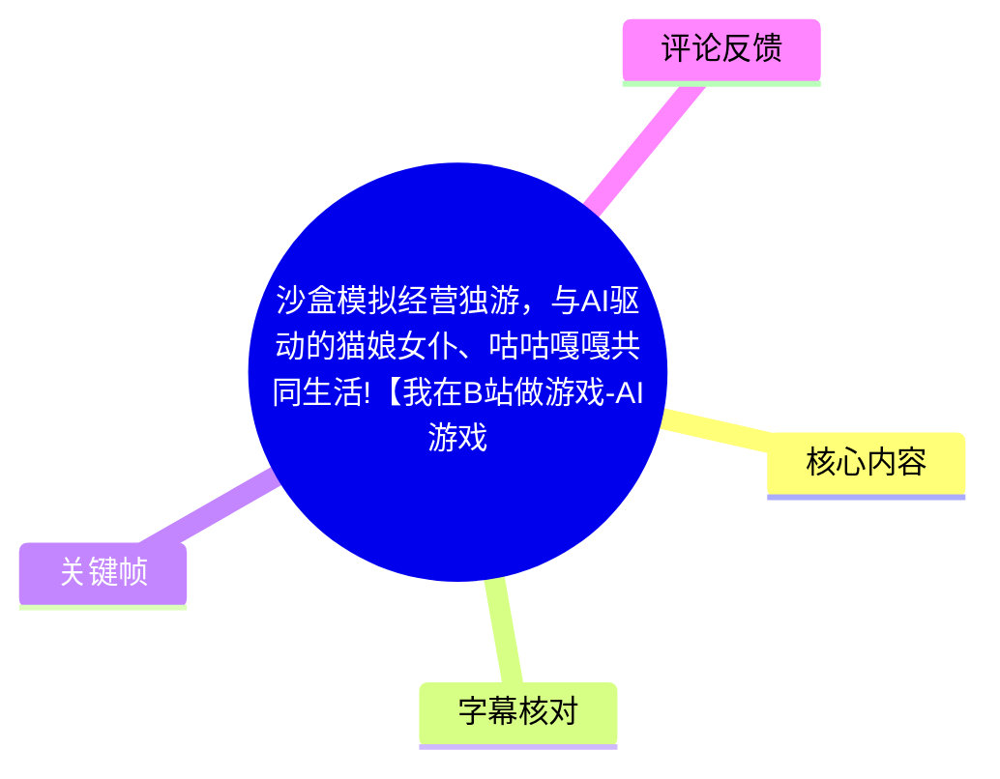
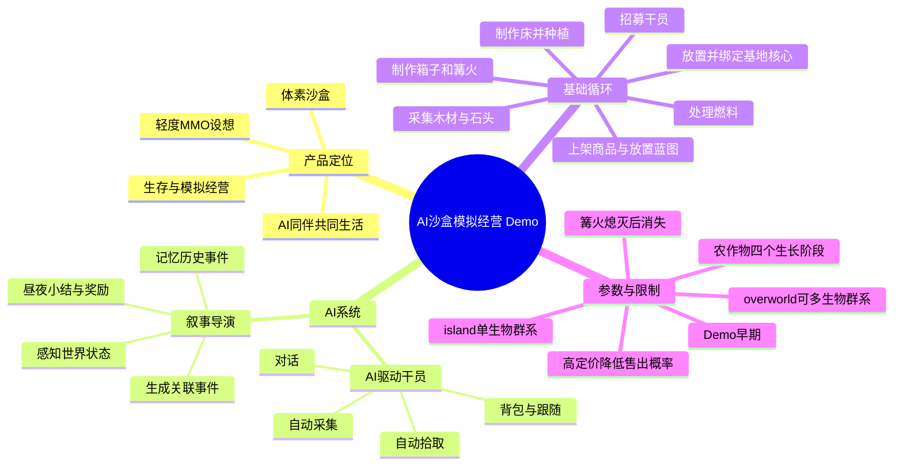
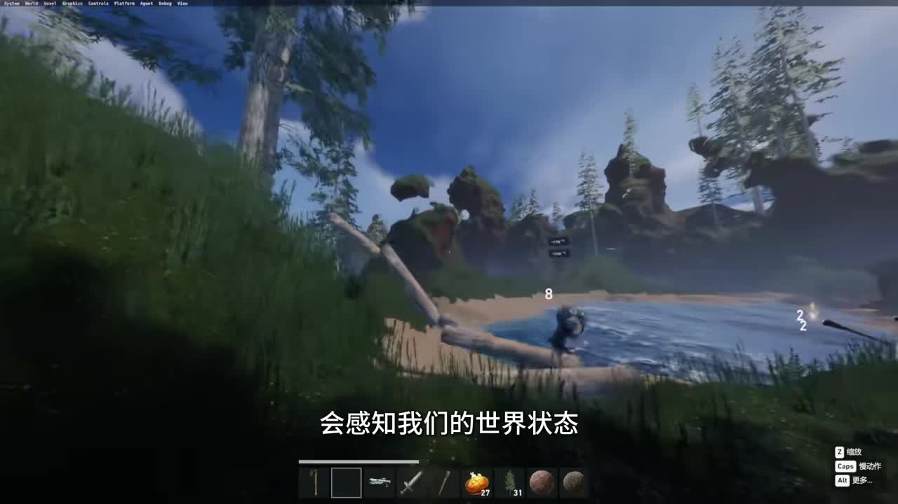
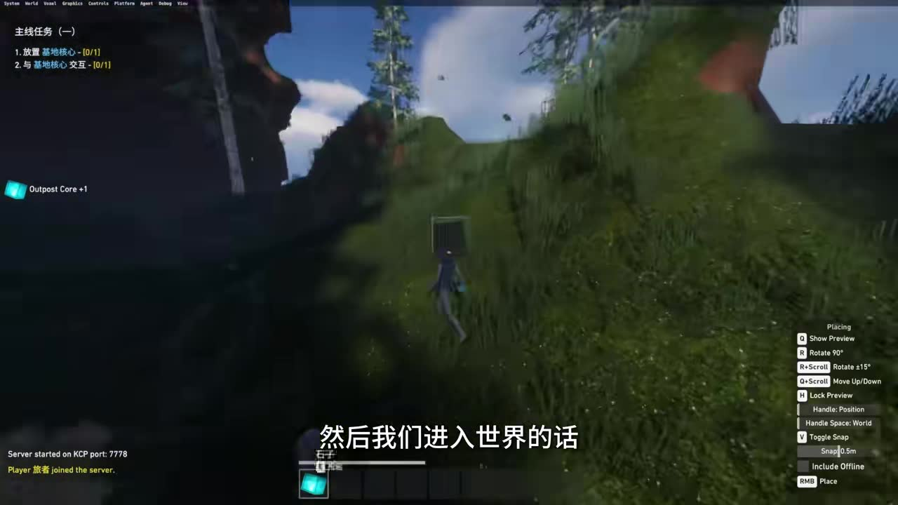
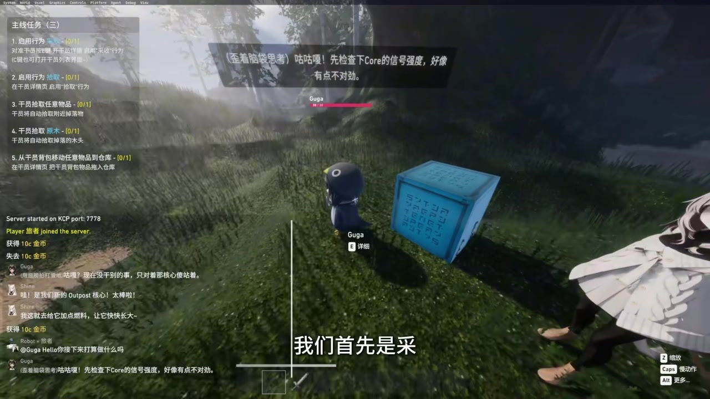
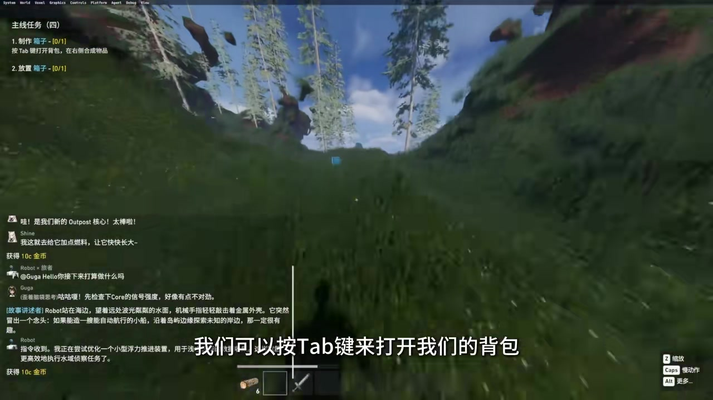

# 沙盒模拟经营独游，与AI驱动的猫娘女仆、咕咕嘎嘎共同生活!【我在B站做游戏-AI游戏赛道】

> 来源：[Bilibili 视频](https://www.bilibili.com/video/BV1qN5z6VEmp) 
> UP 主：Dreamtowards｜合集：AIcode｜元数据总时长：28:39（含 2 个分 P） 
> 本次可用 ASR 对应时长：15:08（908.85 秒）；正文中的时间轴均依据该 ASR 的真实时间戳。

## 小结

这是一段早期 AI+沙盒模拟经营游戏 Demo 的功能演示。视频前段以玩家与 AI 同伴“咕咕嘎嘎”等角色共同砍树、种土豆、烤制食物为例，说明其核心设想：AI 不只是对话 NPC，而是能够感知世界状态、记忆历史事件，并通过“叙事导演”生成具有连续性和关联性的后续事件。

视频随后以 **V0.3.3“叙事导演”更新** 为主线，从创建世界开始，完整演示了基地核心、干员招募、自然语言对话、干员自动采集/拾取、仓储、制作、篝火燃料、种植、商品上架、切换操控角色、蓝图建房与创造模式等流程。整体玩法方向是“体素沙盒 + 生存 + 模拟经营 + 轻度 MMO”，但本视频实际验证的是单个早期 Demo 世界内的基础循环。

最重要的设计信息是：游戏把 AI 的作用放在两层。一层是角色层，干员能够对玩家物品、环境和任务作出一定回应；另一层是世界层，“叙事导演”会读取世界状态及事件历史，产生昼夜小结、奖励、干员目标、干员联动和世界事件。视频将其描述为让世界“有记忆”的机制，但未展示底层模型、记忆容量、推理成本、联网架构或事件生成质量评测，因此不能据此推断系统已具备稳定、通用的自主叙事能力。

适合希望了解 AI 游戏设计、沙盒经营原型、NPC 自动化工作流和早期独立游戏 Demo 的读者。若想复现视频操作，可重点参考基地核心—干员—资源—制作—种植—贸易—蓝图的推进顺序。

时效上，视频明确介绍的是 **V0.3.3**，且 UP 主在简介中称 Demo “还很早期”。功能、按键、物品配方、经济参数及下载方式都可能在后续版本调整；视频简介只称“下载链接见评论区”，当前提供的评论素材中未包含下载链接，不能据此确认现时可下载状态。

## 思维导图

## 目录

- [产品定位与 AI 叙事设想（00:00）](#产品定位与-ai-叙事设想0000)
- [V0.3.3：创建世界与建立基地（03:01）](#v033创建世界与建立基地0301)
- [招募干员与自然语言对话（03:59）](#招募干员与自然语言对话0359)
- [自动采集、拾取与资源归库（05:24）](#自动采集拾取与资源归库0524)
- [制作、燃料与基地经济（07:36）](#制作燃料与基地经济0736)
- [种植、定价、事件与切换操控（10:57）](#种植定价事件与切换操控1057)
- [蓝图建房、创造模式与移动能力（13:08）](#蓝图建房创造模式与移动能力1308)
- [可复用的游戏流程与操作表](#可复用的游戏流程与操作表)
- [限制、时效性与待验证问题](#限制时效性与待验证问题)
- [字幕比对](#字幕比对)
- [评论分析](#评论分析)
- [处理记录](#处理记录)

## 产品定位与 AI 叙事设想（[00:00](https://www.bilibili.com/video/BV1qN5z6VEmp?t=0)）

视频开场将作品定义为一款“沙盒模拟经营游戏”：玩家能够与 AI 驱动的 NPC 同伴共同生活、建造和发展。简介补充了更完整的定位：底层采用体素沙盒，计划通过程序化生成无限地形，玩法融合沙盒生存、模拟经营与轻度 MMO；玩家可与 AI 同伴生活、建镇、经营店铺、生产商品，并计划支持前往其他玩家城市进行贸易、跑商和社交。

需要区分的是：

- **视频中直接演示的内容**：单人（或本地世界）场景的探索、干员工作、制作、种植、交易 UI、蓝图与事件提示。
- **简介中描述的目标能力**：无限程序化地形、其他玩家城市贸易、跑商与社交。
- **未在素材中得到技术验证的内容**：多人同步方式、服务器规模、程序化地形边界、AI 调用频率、上下文记忆持久化与内容安全策略。

### AI 叙事导演：从状态感知到连续事件（[01:09](https://www.bilibili.com/video/BV1qN5z6VEmp?t=69)）

UP 主称“AI 叙事导演”会感知世界状态并产生相关指令，从而改变世界；其关键特征是“有记忆和关联性”。演示逻辑是：玩家种下土豆后，系统可以察觉这一状态；后续烤土豆等行为也能进入最近事件记录，并对同伴反应或世界进程造成关联。

视频列举的事件来源和类型包括：

| 分类 | 视频说明 |
| --- | --- |
| 玩家产生的事件 | 由玩家行动触发或记录 |
| 干员产生的事件 | 由 AI 同伴的行为形成 |
| 叙事导演产生的事件 | 导演根据状态/历史生成 |
| 日间、夜间小结 | 世界阶段性总结 |
| 奖励事件 | 给予奖励的事件 |
| 干员目标事件 | 指向干员任务或目标 |
| 干员联动事件 | 例如干员之间打闹 |
| 世界事件 | 根据此前历史出现下一步特殊情况 |

这套设计的价值不在于单次 NPC 对话，而在于尝试把“种植—烹饪—同伴反应—后续世界变化”连接为可追溯的状态链。视频没有展示事件数据结构、触发优先级或失败回退方案，故其“连续性”目前应理解为创作者的功能目标及 Demo 展示，而非已量化的稳定能力。

> 图：画面显示森林、水岸与同伴活动场景，屏幕字幕为“会感知我们的世界状态”。它直观对应视频对 AI 叙事导演“读取世界状态”的说明，也说明系统落在可交互的沙盒环境中，而非单独的聊天界面。

## V0.3.3：创建世界与建立基地（[03:01](https://www.bilibili.com/video/BV1qN5z6VEmp?t=181)）

视频在 03:01 开始明确介绍 **V0.3.3 叙事导演更新**。创建世界时出现两种世界类型：

| 世界类型 | 视频描述 |
| --- | --- |
| `island` | 默认选项；具有一个“生活群系”（ASR 对该词识别不稳定，保留视频口述含义） |
| `overworld` | 可拥有多个生活群系 |

演示中实际选择 `island`。进入世界后，UP 主说明可按 **`Z` 键**切换地形操作/地形状态，但 ASR 把具体功能识别为“切换地整成”，无法仅凭音频准确确认其正式 UI 名称，因此不扩展解释。

主线任务显示在左上角，起步流程是：

1. 找到合适地点，放置**基地核心（Outpost Core）**。
2. 对准核心按 **`E` 键**进行绑定。
3. 在基地相关界面购买物品。
4. 货币显示在右上角；视频中完成任务后获得 **10 金币**。

> 图：画面左上显示“主线任务（一）”，含“放置基地核心”“与基地核心交互”；玩家正在坡地放置蓝色核心。右侧还能看到放置模式提示，如预览、旋转、上下移动、切换吸附和放置，证明基地建立采用可摆放物体的沙盒交互方式。

## 招募干员与自然语言对话（[03:59](https://www.bilibili.com/video/BV1qN5z6VEmp?t=239)）

第二项任务是招收干员。视频说明通过**右键**即可召唤角色。出现的伙伴包括咕咕嘎嘎（画面/UI 中显示为 `Guga`）以及另一位同伴；角色会围绕基地核心和燃料作出语音/文字反应。

与干员对话的操作是：

1. 准星对准干员；
2. 出现“详情”提示；
3. 按 **`Enter` 键**进入或触发对话；
4. 视频还演示按 **`Windows + H`** 调用系统语音输入；
5. 示例输入为“Hello，你接下来打算做什么吗”。

这里应注意，`Windows + H` 是 Windows 的语音输入快捷键，而不是视频明确展示的游戏内置语音识别按键。视频展示的是可将语音输入用于对话文本的工作方式，但没有说明游戏是否直接接入 Windows 语音识别、是否依赖系统语言包，也未给出离线/在线识别条件。

> 图：画面中可见名为 `Guga` 的干员、蓝色基地核心、右侧猫娘角色局部，以及左上“主线任务（三）”。该帧同时呈现 AI 同伴、任务系统和世界内聊天/事件日志，是理解“AI 同伴参与基地循环”的关键视觉证据。

## 自动采集、拾取与资源归库（[05:24](https://www.bilibili.com/video/BV1qN5z6VEmp?t=324)）

第三阶段任务围绕让干员协助砍树展开，任务项目较多，但视频给出的操作链条明确：

1. 对准干员按 **`E` 键**进入交互。
2. 启用干员的**采集**行为（ASR 多次误识别为“采收/采购”）。
3. 干员会寻找附近可采集对象，例如树木，并执行砍伐。
4. 仅开启采集时，干员会砍树，但**不会自动捡起**掉落物。
5. 再开启**拾取**行为（ASR 误识别为“识取”），干员才会拾取掉落的木材。
6. 按 **`C` 键**打开干员列表，查看干员背包。
7. 可为另一位干员同样启用采集和拾取，从而并行砍树。
8. 将干员背包中的圆木转移至仓库，完成资源归库目标。

视频中还出现“为什么它不砍这个树”的现场疑问，说明干员自动化并非对任意目标都绝对有效；其可能受目标可达性、范围或行为状态影响，但素材没有给出确切判定规则。

> 图：左上任务文字包含“启用行为 采集”“启用行为 拾取”“干员拾取 原木”“从干员背包移入仓库”等要求。它可用于校正 ASR 中“采收”“识取”等明显误识别，并说明采集、拾取、仓储是拆分的行为步骤。

## 制作、燃料与基地经济（[07:36](https://www.bilibili.com/video/BV1qN5z6VEmp?t=456)）

### 箱子：制作、旋转与存储（[07:36](https://www.bilibili.com/video/BV1qN5z6VEmp?t=456)）

完成资源归库后，下一任务是制作箱子：

1. 按 **`Tab` 键**打开背包；
2. 在制作项中选择箱子；
3. 使用此前获得的木材完成制作；
4. 放置时按 **`R` 键**旋转；
5. 视频说明通过旋转可使箱盖处于可开启方向；
6. 通过交互将物品存入箱子。

> 图：画面左上显示“主线任务（四）”，要求“制作箱子”“放置箱子”，底部字幕明确提示按 `Tab` 打开背包。该帧将任务要求、资源快捷栏和实际沙盒地形放在同一画面中，适合作为制作流程的定位图。

### 篝火与燃料约束（[08:06](https://www.bilibili.com/video/BV1qN5z6VEmp?t=486)）

篝火任务要求制作并放置篝火。视频中的材料缺口为：

- 木棍；
- 石头。

玩家可从干员列表/干员背包调取干员拾取到的木棍和石头，再进行合成。篝火放置后还需要燃料；演示说明可将木头烧成木炭，木炭能够“更经烧”，即支持燃烧更多物品或维持更久的燃料效果。

明确限制是：**如果火熄灭，篝火会消失。** 因而燃料不是纯装饰资源，而是与设施存续直接相关的维护成本。视频未提供木头、木炭的精确燃烧时长或转换比例。

### 购买、金币与床（[09:12](https://www.bilibili.com/video/BV1qN5z6VEmp?t=552)）

完成多个任务后，玩家获得金币，可在基地/相关界面购买任意物品。视频示例浏览了一把斧子，但选择暂不购买，转而购买木头并继续制作。这里能观察到两条资源路径：

- **采集—制作路径**：自己或干员砍树，获得木材并加工；
- **金币—购买路径**：以任务获得的金币补齐资源或直接购入物品。

床的制作需要木棍，而木棍由木头合成；当木材不足时，玩家可要求干员砍树或自行砍伐。视频还说明可以“隔空拿”干员背包中的物品，但距离太远时干员会向玩家跑来。该机制意味着背包访问具有距离或角色跟随条件，但具体距离阈值未披露。

## 种植、定价、事件与切换操控（[10:57](https://www.bilibili.com/video/BV1qN5z6VEmp?t=657)）

### 农作物生长（[10:57](https://www.bilibili.com/video/BV1qN5z6VEmp?t=657)）

制作床后，任务奖励提供农作物。视频展示了可种植：

- 土豆；
- 西瓜；
- 小麦。

作物需要时间成长，共有 **4 个阶段**。后续演示中，小麦到达第 3 阶段，土豆成熟后被系统自动收起。视频没有说明不同作物的生长时长、收成数量、浇水/光照等条件，因此不能推断其完整农业模拟深度。

### 商品上架与市场价（[11:34](https://www.bilibili.com/video/BV1qN5z6VEmp?t=694)）

玩家可以将任意物品上架，并输入单价。系统提供默认价格，视频将其称为该物品的市场价值；定价越高，商品上架后被购买的概率越低。

这构成一个简化但明确的经营约束：

> 提高单件售价，不等于提高成交机会；价格越高，售出概率越低。

视频未给出需求曲线、买家来源、成交结算周期、市场价格动态规则或与其他玩家贸易的实际连接，因此只能确认存在单价与售出概率的负相关设计，不能确认其经济系统是否由真实玩家市场驱动。

### 切换操控与叙事事件（[11:56](https://www.bilibili.com/video/BV1qN5z6VEmp?t=716)）

视频表示可打开“概念”的详情页并切换控制对象：此前控制的是机器，之后可以切换控制干员。ASR 对“概念”相关词汇有不稳定识别，视频意图可确定为“在可操作对象之间切换控制”，但该分类在正式产品中的命名、可控制对象范围和限制均未进一步展示。

紧接着出现事件内容：角色提到“小地震”，随后出现“午后的阳光”“旅者与干员们正开垦新的田地”等文本。结合前段“叙事导演”描述，这些画面提供了系统生成或展示世界事件文本的示例；但视频没有逐条标明哪些文本由 AI 实时生成、哪些为预设脚本，不能将所有事件文本直接等同于大模型自由生成结果。

## 蓝图建房、创造模式与移动能力（[13:08](https://www.bilibili.com/video/BV1qN5z6VEmp?t=788)）

完成此前任务后，系统奖励一个蓝图。视频说明蓝图可用于选择一块区域作为蓝图区域；本次演示直接将房屋蓝图放置在地面上，房屋内包含一张床。

主线任务在约 13:56 宣布完成。此后视频展示：

- 可在“创造”中召唤物品；
- 可选择当前操作/控制的对象；
- 画面中出现“Minecraft 之剑”“附魔剑”等物品；
- 小麦已进入第 3 生长阶段；
- 土豆成熟并自动收取；
- 干员试图砍伐高处树木时会出现多次摔伤；
- 双击 **空格键**可以飞行。

其中，“飞行”“创造召唤物品”明显降低了资源获取与移动约束，更适合测试、展示或创造性建造场景。视频未说明该能力是否属于所有正式模式、是否需要管理员权限，也未说明摔伤对干员生命值、效率或任务完成的具体影响。

## 可复用的游戏流程与操作表

### 从零开始的演示推进顺序

| 阶段 | 操作目标 | 关键动作 | 产出/作用 |
| --- | --- | --- | --- |
| 1 | 建立基地 | 放置基地核心，`E` 绑定 | 解锁基地交互、任务和购买 |
| 2 | 获取同伴 | 右键召唤干员 | 获得可对话、可自动工作的伙伴 |
| 3 | 配置劳动 | 对准干员按 `E`，开启采集与拾取 | 自动砍树并回收掉落物 |
| 4 | 管理资源 | `C` 查看干员列表和背包 | 将圆木等物资转入仓库 |
| 5 | 完成基础制作 | `Tab` 打开背包，制作并放置箱子 | 获得储物设施 |
| 6 | 建立火源 | 收集木棍、石头，制作篝火并添加燃料 | 提供燃烧/加工能力；需避免熄灭 |
| 7 | 补齐居住条件 | 制作并放置床 | 获得农作物等任务奖励 |
| 8 | 进入生产经营 | 种植作物、设置上架单价 | 形成生长与销售循环 |
| 9 | 扩展建筑 | 放置房屋蓝图 | 建成含床的基础房屋 |
| 10 | 测试和探索 | 创造召唤、切换控制、双击空格飞行 | 用于展示、建造或调试 |

### 视频明确出现的按键

| 按键/操作 | 视频中的用途 | 时间证据 |
| --- | --- | --- |
| `Z` | 切换地形相关操作/状态；正式名称 ASR 不清 | [03:16](https://www.bilibili.com/video/BV1qN5z6VEmp?t=196) |
| `E` | 绑定基地核心；与干员交互并调整行为 | [03:35](https://www.bilibili.com/video/BV1qN5z6VEmp?t=215)、[05:24](https://www.bilibili.com/video/BV1qN5z6VEmp?t=324) |
| 右键 | 召唤干员 | [04:06](https://www.bilibili.com/video/BV1qN5z6VEmp?t=246) |
| `Enter` | 对准干员出现详情提示后用于对话 | [04:48](https://www.bilibili.com/video/BV1qN5z6VEmp?t=288) |
| `Windows + H` | 调用语音输入进行对话示例 | [05:02](https://www.bilibili.com/video/BV1qN5z6VEmp?t=302) |
| `C` | 打开干员列表，查看干员背包 | [06:59](https://www.bilibili.com/video/BV1qN5z6VEmp?t=419) |
| `Tab` | 打开背包；视频后段也称可用于基地相关界面 | [07:39](https://www.bilibili.com/video/BV1qN5z6VEmp?t=459)、[09:12](https://www.bilibili.com/video/BV1qN5z6VEmp?t=552) |
| `R` | 放置箱子时旋转 | [07:53](https://www.bilibili.com/video/BV1qN5z6VEmp?t=473) |
| 双击空格 | 飞行 | [15:05](https://www.bilibili.com/video/BV1qN5z6VEmp?t=905) |

> 注：`Tab` 在 ASR 中一度被识别为“type”，但关键帧字幕及上下文均显示为 `Tab`，已据此校正。

## 限制、时效性与待验证问题

### 已知限制

1. **版本早期**：视频明确为 V0.3.3 更新演示，简介也表示 Demo 仍很早期。
2. **ASR 覆盖并非整条投稿**：元数据显示投稿有两个分 P、总长 1719 秒，而本次 ASR 音频仅覆盖 908.85 秒。本文不将未覆盖的第二分 P 内容纳入事实结论。
3. **自动化并非无条件成功**：演示中出现干员不砍某棵树、砍高处树时多次摔伤的情况。
4. **篝火有存续成本**：火熄灭后会消失，需要燃料维持。
5. **种植有时间门槛**：作物分四阶段成长，视频没有给出精确时长。
6. **交易有价格权衡**：商品价格越高，被购买的概率越低。
7. **多人和经济系统未被实证展示**：轻度 MMO、跨城贸易和跑商是简介中的规划/定位，不能与本次单世界 Demo 演示等同。

### 技术与产品待验证点

- 叙事导演是否基于大语言模型、规则系统或二者混合，视频未说明。
- 事件记忆可保留多久、是否跨存档/跨服务器、能否被玩家查看或编辑，未说明。
- AI 同伴行动的寻路、范围、工具需求、受伤恢复和失败处理规则，未说明。
- 市场价格是静态参考、NPC 模拟需求还是玩家驱动市场，未说明。
- “无限地形”与多人城市间贸易在当前版本是否实际可用，未展示。
- 视频简介称下载链接在评论区，但所给可获取热评中未见链接，下载可用性无法确认。

## 字幕比对

| 字幕来源 | 完整性 | 专有名词与按键 | 时间轴 | 主要问题 |
| --- | --- | --- | --- | --- |
| Bilibili 站内字幕 | 未提供可用站内字幕 | 无法核验 | 无 | 素材明确标注“未提供可用站内字幕” |
| 本次 ASR 字幕 | 覆盖 0:00–15:08，语音覆盖约 580.66 秒；与元数据 28:39 总时长不一致 | 有较多误识别，如“采收/采购”“识取”“干燃”“type” | 有效，提供 84 个带起止时间的 SRT 分段 | 存在 8 段较大无语音间隔，最大为 01:48–03:01，且部分 UI/术语识别不稳定 |

最终采用**本次 ASR 的时间戳**作为所有章节链接依据，并以关键帧中的 UI 文本、视频上下文对以下重点词进行审慎校正：

| ASR 原文倾向 | 采用表述 | 校正依据 |
| --- | --- | --- |
| “采收”“采购” | 采集 | 任务目标为砍树；关键帧任务文字显示“启用行为 采集” |
| “识取” | 拾取 | 关键帧任务文字显示“启用行为 拾取”；上下文为捡掉落原木 |
| “干燃” | 干员 | 视频全程语义为可招募、可配置行为的同伴 |
| “type 键” | `Tab` 键 | 关键帧大字幕显示“按Tab键来打开我们的背包” |
| “基地合心” | 基地核心 | 关键帧与 UI 中可见 `Outpost Core`，且上下文为基地放置/绑定 |
| “叙世导演” | 叙事导演 | 视频在 03:01 明确口述“V0.3.3 叙事导演更新” |

ASR 诊断未标记 `noAudioStream=true`，且识别结果显示音频语言为中文、置信度约 0.9966。因此本视频不是无音轨素材；未采用站内字幕的原因是站内字幕未提供，而非工具失败。

## 评论分析

> 可获取热评素材共 2 条，少于“热评前三条”的上限；以下仅分析这 2 条，不补写不存在的第 3 条评论。

### 1. UP 主：比赛冲刺与开发节奏补充

- 点赞数：24
- 评论核心：UP 主称自己在比赛截止前 3 天才得知比赛，随后用 2 天高强度冲刺完成 **130+ 个改进/修复/提交（commits）**，并在截止前 2 分钟提交 Demo 与视频。
- 补充价值：该评论解释了为何 Demo 仍存在大量需要打磨之处，也为视频中较明显的早期原型特征提供了开发背景。
- 可信度与边界：评论来自 UP 主本人，可视为其开发经历陈述；但“130+”的具体改动内容、提交仓库和各项完成质量没有在素材中公开，不能据此独立验证。

### 2. 观众：与《翼星求生》的类比及潜力判断

- 点赞数：5
- 评论核心：评论者联想到《翼星求生》，并认为该项目潜力可能更大、更强。
- 补充价值：反映部分观众将本作放在生存、建造和开放世界的同类游戏语境中理解。
- 可信度与边界：这是主观期待，不是性能、玩法深度或商业前景的客观比较。视频也没有展示与《翼星求生》相同规模的内容量、多人系统或长期运营能力，不能将其作为已验证结论。

## 处理记录

- Worker ID：`worker-mrj0wjed-b0c290ad`
- 模型：`gpt-5.6-terra`
- 调用工具与素材：任务提供的元数据、关键帧清单、ASR 诊断、ASR SRT、热评 JSON 与关键帧画面理解；未提供可用站内字幕。
- 字幕选择：以本次 ASR SRT 为主，使用其真实起止时间生成时间轴链接；对 UI 可核验的术语和按键以关键帧进行校正。未将 ASR 未覆盖的第二分 P 内容写入正文。
- 关键帧选择依据：
  - `frames/frame-001.jpg`：展示世界环境与“感知我们的世界状态”字幕，支撑 AI 叙事导演章节；
  - `frames/frame-002.jpg`：展示基地核心放置与任务 UI，支撑起步流程；
  - `frames/frame-003.jpg`：展示 Guga、基地核心及采集/拾取任务文本，支撑干员自动化机制及 ASR 术语校正；
  - `frames/frame-004.jpg`：展示箱子制作任务与 `Tab` 键提示，支撑制作流程及按键校正。
- 缓存清理：未执行缓存清理操作；本次仅基于已提供的离线素材进行整理，未产生可报告的额外缓存目录。
- 未解决问题：第二分 P 未获得对应 ASR/字幕；游戏正式名称、可用下载链接、当前版本、多人联机实现、AI 模型与服务端架构均无法由现有素材确认。
