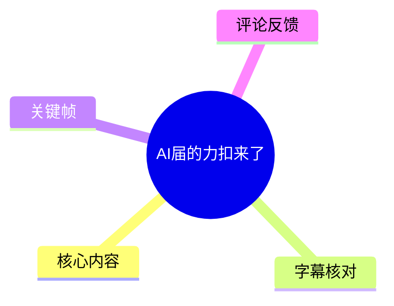
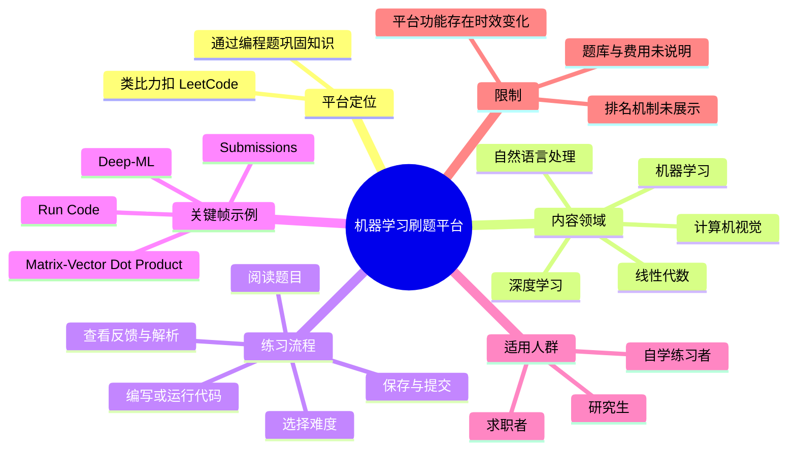
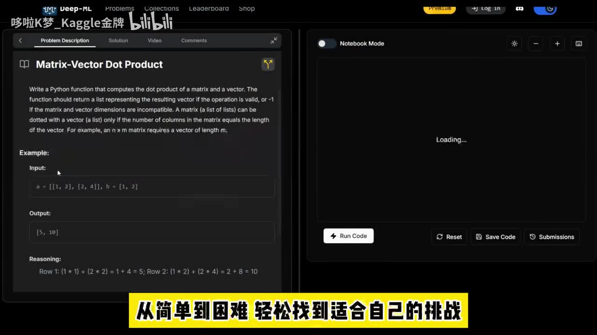

# AI届的力扣来了

> 来源：[Bilibili 视频](https://www.bilibili.com/video/BV1EpLy6cEjE)  
> UP 主：哆啦K梦_Kaggle金牌｜时长：45 秒｜标签：人工智能、AI、深度学习、leetcode  
> 抓取时元数据：3,231 播放、185 收藏、54 点赞、17 硬币、17 分享、2 条回复。

## 小结

视频介绍了一个被 UP 主类比为“机器学习自己的力扣（LeetCode）”的在线练习平台。其核心定位是把机器学习相关知识拆分为可完成的编程题，学习者可以按难度练习，并在题目页中编写、运行、保存及提交代码。

按视频口述，平台覆盖自然语言处理、计算机视觉、线性代数、机器学习、深度学习五个领域；学习者可依据自身水平选择题目难度。视频还宣称平台支持“边学边练”、提交后反馈结果、题目存在排名，并提供视频解析。上述覆盖范围和服务能力应视为视频介绍内容，而非本文独立验证的平台承诺。

关键帧展示的平台顶部标识为 **Deep-ML**，页面采用左题目、右代码区的布局。示例题为“Matrix-Vector Dot Product（矩阵—向量点积）”：要求实现 Python 函数，计算矩阵与向量的点积；当矩阵列数与向量长度不兼容时返回 `-1`。这说明视频所说的练习不仅涉及模型应用，也包含线性代数与基础编程实现。

该内容适合希望以代码题巩固机器学习基础的求职者、研究生及自学者。但视频未展示题库规模、账号与收费要求、支持的编程语言、具体判题规则、排名口径、视频解析覆盖率及平台当前可用状态。唯一可获取热评给出 `https://www.deep-ml.com/`，其名称与关键帧中的 “Deep-ML” 一致，但仍应在实际访问时自行核验网址、安全性与最新功能。

## 思维导图





## 目录

- [背景与平台定位](#背景与平台定位)
- [覆盖领域与难度选择](#覆盖领域与难度选择)
- [界面、操作流程与示例题](#界面操作流程与示例题)
- [适用对象、限制与时效性](#适用对象限制与时效性)
- [关键帧说明](#关键帧说明)
- [字幕比对](#字幕比对)
- [评论分析](#评论分析)
- [处理记录](#处理记录)

## [背景与平台定位](https://www.bilibili.com/video/BV1EpLy6cEjE?t=0)

视频开场称“我们机器学习也有自己的力扣了”，将该平台定位为机器学习领域的刷题工具。“力扣”在这里是对 LeetCode 式学习路径的类比：把知识拆为独立题目，通过阅读题意、实现代码、执行或提交、获取反馈的方式进行练习。

从关键帧可见，页面顶部显示 **Deep-ML** 标识，并有 `Problems`、`Collections`、`Leaderboard`、`Shop` 等导航入口。这可以确认展示版本至少存在题目、题目集合、排行榜和商店相关入口；但视频没有展开这些页面，不能据此推断题目数量、排行榜算法、商店内容或付费机制。

视频时长仅 45 秒，属于工具推荐式介绍而非官方产品文档。因此，本文将“覆盖五大领域”“每道题都排名”“有详细视频解析”等明确标为视频口述，不将其扩展为未经素材验证的事实。

## [覆盖领域与难度选择](https://www.bilibili.com/video/BV1EpLy6cEjE?t=4)

UP 主称该平台覆盖以下五类学习方向：

1. **自然语言处理（NLP）**
2. **计算机视觉（CV）**
3. **线性代数**
4. **机器学习**
5. **深度学习**

这一分类将数学基础、机器学习方法和深度学习应用方向放在同一练习体系中。关键帧展示的矩阵—向量点积题，可以直接对应“线性代数”这一类别；但视频未展示 NLP、CV 或深度学习题目，无法确认各领域的题量、难度分布和更新频率。

视频还称用户可“根据自己的水平，选择不同难度的题目”，关键帧底部的画面字幕为“从简单到困难，轻松找到适合自己的挑战”。这说明视频强调循序渐进的练习体验，但未给出以下关键参数：

- 难度等级的具体数量与命名；
- 是否可按领域、难度或标签筛选；
- 各难度的题目数量；
- 是否提供个性化推荐；
- 难度是否与面试或实际工程能力对应。

因此，“可选择不同难度”可作为视频中的功能描述记录，但不宜进一步推断其评价标准。

## [界面、操作流程与示例题](https://www.bilibili.com/video/BV1EpLy6cEjE?t=14)

视频口述将页面结构概括为“左侧是题目，右侧的是检查区”。关键帧提供了更具体的界面证据：左侧为题目说明区域，右侧为代码执行或编辑区域，整体使用深色主题。

### 视频呈现的练习步骤

1. **选择适合自身水平的题目**  
   视频称可按难度选择题目，但未展示具体筛选按钮或选题页操作。

2. **阅读题目描述**  
   左侧标签可见 `Problem Description`、`Solution`、`Video`、`Comments`。其中当前打开的是题目描述页；其他标签虽可见，但视频未展开其内容。

3. **理解输入、输出和推理示例**  
   题目页展示输入样例、输出结果与 `Reasoning` 推理说明，帮助学习者理解预期行为。

4. **在右侧区域运行或编辑代码**  
   右侧区域可见 `Notebook Mode` 开关、`Run Code` 按钮及加载状态 `Loading...`。该帧只能证明页面存在运行入口与当时的加载状态，不能据此推断实际执行速度。

5. **重置、保存或查看提交记录**  
   页面底部可见 `Reset`、`Save Code`、`Submissions` 按钮，说明展示版本提供重置代码、保存代码和查看提交相关入口。

6. **提交并获得系统反馈**  
   视频称“提交代码后，系统会立即在线排名结果”。这里的“在线排名结果”表述存在歧义：可能指提交后的即时评测，也可能指某种排名反馈。画面未显示提交结果页，无法确认其具体含义。

7. **结合解答或视频继续学习**  
   视频称平台“支持边学边练”，且“有详细的视频解析”。关键帧中确有 `Solution` 与 `Video` 标签，但没有展示具体解答和视频内容，无法确认是否每题均有对应视频解析。

### 示例题：矩阵—向量点积

关键帧中的题目标题为 **Matrix-Vector Dot Product**。题目要求实现一个 Python 函数，用于计算矩阵与向量的点积。

画面给出的示例输入为：

```text
a = [[1, 2], [2, 4]]
b = [1, 2]
```

示例输出为：

```text
[5, 10]
```

对应的逐行计算为：

```text
第 1 行：[1, 2] · [1, 2] = 1 × 1 + 2 × 2 = 5
第 2 行：[2, 4] · [1, 2] = 2 × 1 + 4 × 2 = 10
```

题面可见的关键约束是：

- 设矩阵维度为 \(n \times m\)；
- 向量长度必须为 \(m\)，即矩阵列数与向量长度必须一致；
- 若维度不兼容，函数应返回 `-1`。

该约束是当前示例题的判定要求，不能泛化为平台所有题目的通用返回值或错误处理规范。

## [适用对象、限制与时效性](https://www.bilibili.com/video/BV1EpLy6cEjE?t=32)

视频将平台推荐给求职者和研究生，用途是巩固学习、提升技能。按照画面中“题目—代码区—运行/提交—解答/视频”的组织方式，它尤其适合以下使用场景：

- 具备 Python 与基础数学知识，希望通过编码练习复习线性代数、机器学习概念的学习者；
- 准备算法、机器学习、数据科学或 AI 工程岗位面试的人；
- 希望从基础数学题逐步过渡到机器学习、NLP、CV、深度学习主题的人；
- 研究生阶段需要补强实现能力、将理论概念落实为代码的人。

### 素材未覆盖的限制

视频没有提供以下重要信息：

| 项目 | 素材可确认情况 |
| --- | --- |
| 平台名称 | 关键帧显示为 Deep-ML；视频口述未明确念出名称 |
| 网址 | 视频口述未展示；唯一热评提供 `deep-ml.com` |
| 账号要求 | 未展示 |
| 收费或免费范围 | 未说明；画面仅可见 `Premium` 入口 |
| 支持语言 | 示例题提到 Python，但不能确认平台是否支持其他语言 |
| 题库规模 | 未说明 |
| 判题环境 | 未说明超时、内存、依赖库、隐藏测试等规则 |
| 排名机制 | 视频称有排名，但未展示排行页、指标或更新规则 |
| 视频解析覆盖率 | 视频称有详细视频解析，但未展示覆盖率与内容质量 |

### 时效性说明

元数据中的发布时间可换算为 2026-05-20，素材抓取时间为 2026-07-13。在线平台的题目、价格、登录策略、UI、排行榜和视频内容可能随时间调整。

因此，本文可确认的是视频在该时段展示和口述的内容；对于当前的网站可访问性、题库状态、收费方案和功能边界，应以访问时平台的公开页面与条款为准。

## [关键帧说明](https://www.bilibili.com/video/BV1EpLy6cEjE?t=18)



> 图：该帧展示了 Deep-ML 标识、题目页导航、`Matrix-Vector Dot Product` 示例、输入输出与推理过程，以及右侧的 `Notebook Mode`、`Run Code`、`Reset`、`Save Code`、`Submissions` 等操作入口。它直接支撑了正文关于“左侧题目、右侧代码区”和“存在运行、保存、提交入口”的描述；同时，顶部 `Leaderboard` 仅能证明存在导航入口，不能证明具体排名机制。

该帧是素材中唯一提供的关键帧，且信息密度最高：它同时呈现了平台名称线索、具体题型、输入输出参数、维度不兼容时的返回约束，以及代码练习操作区。因此被用于验证视频最核心的界面与示例题描述。

## [字幕比对](https://www.bilibili.com/video/BV1EpLy6cEjE?t=0)

| 字幕来源 | 完整性 | 专有名词 | 时间轴 | 主要问题 |
| --- | --- | --- | --- | --- |
| Bilibili 站内字幕 | 不可用 | 无法评估 | 无可用时间轴 | 素材未提供可用站内字幕；工具记录报错：`Missing JSON resource URL`。 |
| 本次 ASR 字幕 | 覆盖全段口述的主要信息 | 识别出“利扣”、NLP/CV 类别描述，但未明确识别平台名 | 未提供逐句时间戳，本文仅按内容顺序标注章节秒数 | 繁简混用；“立即在线排名结果”含义不清；“检查区”可能是对编辑/运行区的概括。 |

本次 **ASR 已执行**。由于没有可用的 Bilibili 站内字幕，正文以本次 ASR 为主要口述依据，并结合关键帧作最小限度校正：

- ASR 中的“利扣”统一写作“力扣（LeetCode）”，保留其作为类比而非平台名称的含义；
- 平台名 **Deep-ML** 来自关键帧顶部可见标识，而不是 ASR 的明确口述；
- “提交代码后，系统会立即在线排名结果”不改写为“即时判题通过/失败”或“全站名次”，以避免扩大原句含义；
- “五大领域”“每道题都排名”“详细视频解析”保留为 UP 主陈述，未被独立验证为平台当前保证。

## [评论分析](https://www.bilibili.com/video/BV1EpLy6cEjE?t=41)

按“仅处理可获取的热评前三条”执行：素材实际只返回 1 条热评，因此仅分析该条，不补造第 2、3 条评论。

1. **Tensofermi（1 赞）**  
   评论内容：`https://www.deep-ml.com/`

   - **补充信息**：评论直接提供了一个疑似平台官网的网址。
   - **与视频的对应**：关键帧顶部显示 “Deep-ML”，与评论中域名 `deep-ml.com` 在名称上相符，具有明确的上下文关联。
   - **可信度与边界**：评论未说明链接来源、使用体验、收费情况或功能验证过程。该链接不能单独证明网站安全性、平台当前可用性，也不能验证视频关于题库、排名、解析等全部说法。
   - **使用建议**：如需访问，应自行核验域名、登录方式、隐私政策、收费条款与当前功能状态。

第 2、3 条热评未在提供素材中返回，无法分析。

## [处理记录](https://www.bilibili.com/video/BV1EpLy6cEjE?t=0)

- **Worker ID**：`worker-mrj0www4-e8d79408`
- **模型**：`gpt-5.6-terra`
- **调用工具与素材**：依据任务提供的视频元数据、素材清单、ASR 文本、热评 JSON、关键帧 `frames/frame-001.jpg` 整理；未进行外部网站访问或额外事实核验。
- **字幕选择**：本次 ASR 已执行，并因站内字幕不可用而作为主字幕来源。站内字幕抓取报错为 `Missing JSON resource URL`，未进行字幕合并。
- **关键帧选择依据**：仅提供 `frame-001.jpg`；该帧同时包含 Deep-ML 标识、矩阵—向量点积题面、输入输出示例、维度限制、代码区和运行/保存/提交按钮，最能支撑正文事实。
- **评论处理范围**：按可获取热评前三条处理；实际获得 1 条，仅分析该条。
- **缓存清理**：素材未提供缓存清理命令、日志或结果，无法确认是否执行；本文不声称已完成缓存清理。
- **未解决问题**：平台的官方名称与网址未由视频口述明确给出；收费模式、账号门槛、支持语言、题库规模、判题规则、排名口径、解析覆盖率及当前网站状态均未在素材中得到验证。

## 评论分析

本次流程未获取到可用热评，因此不推断观众态度或额外结论。
