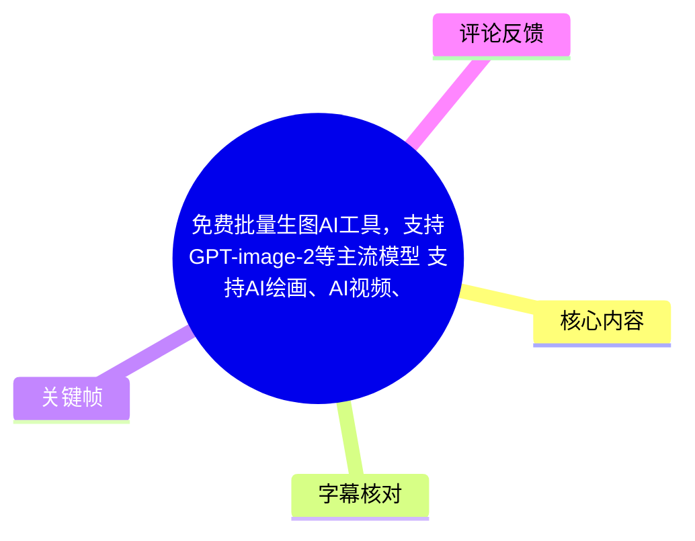
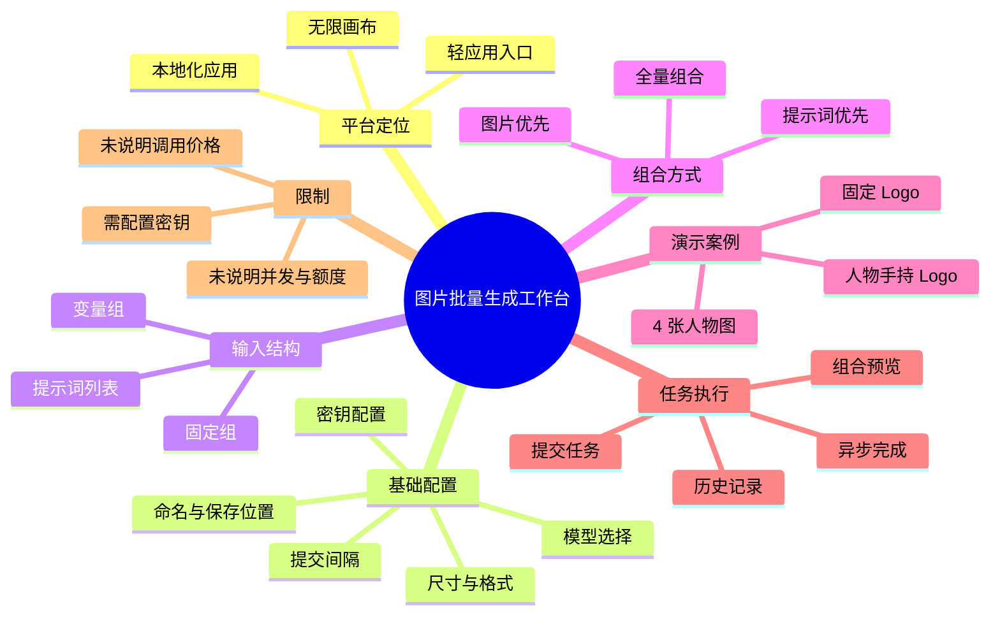
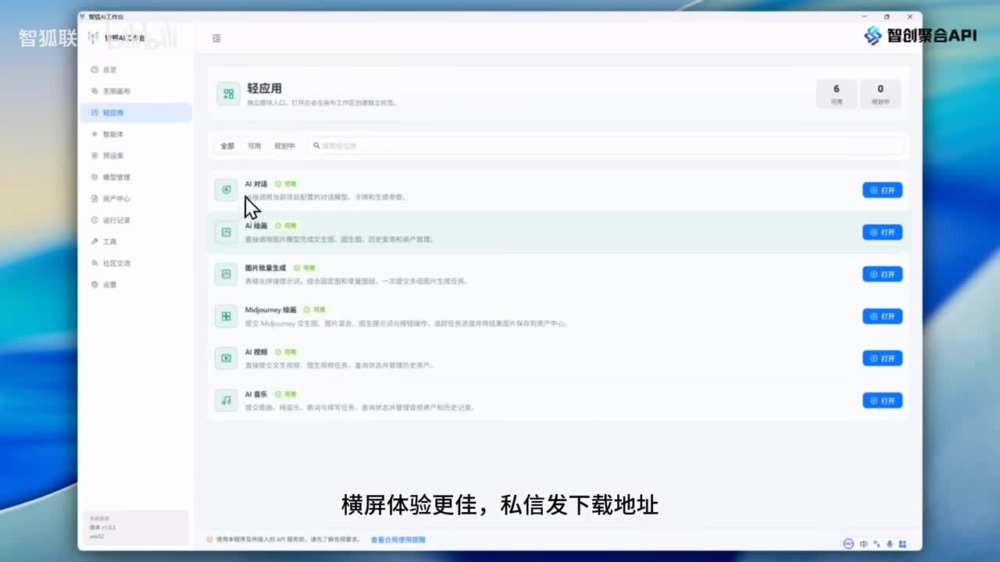
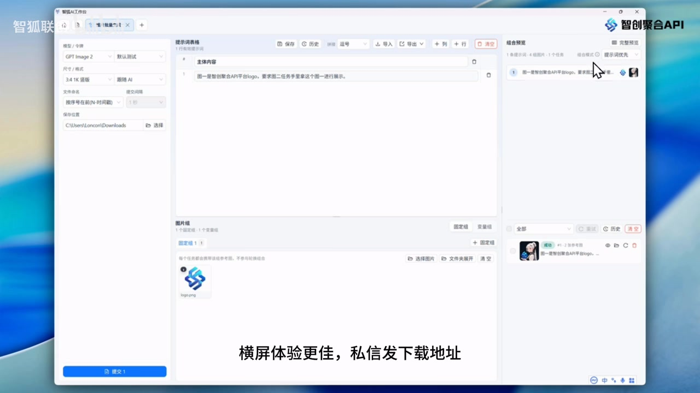

# 免费批量生图 AI 工具：多提示词、多图组的组合任务演示

> 来源：[Bilibili 视频](https://www.bilibili.com/video/BV1TjJp68Efr)<br>
> UP 主：智狐联创｜视频时长：09:44｜合集：AIcode  
> 注：视频标题称“免费批量生图 AI 工具”，但演示界面明确包含模型选择与密钥（API Key）配置；“免费”不能直接推导为底层模型调用免费。

## 小结

视频演示的是“智狐 AI 工作台”中的**图片批量生成**轻应用。UP 主将其描述为本地化应用，并称其已提供无限画布及多个轻应用入口；从画面可见，轻应用列表包含 AI 对话、AI 绘画、图片批量生成、Midjourney 绘画、AI 视频、AI 音乐等模块。

本视频最核心的知识不是单次文生图，而是如何把**提示词列表**与**图片组**批量组合为生成任务。图片组分为固定组和变量组：固定组中的图片会参与每一个任务，变量组中的图片则会依照组合策略轮换。演示以“平台 Logo”为固定组、四张人物漫画图为变量组，生成“人物手持 Logo 展示”的多张结果。

工具提供三种组合策略：**图片优先、提示词优先、全量组合**。在“1 条提示词 + 4 张变量图”的示例中，图片优先会得到 4 个任务；在“2 条提示词 + 4 张变量图”的示例中，全量组合会得到 8 个任务。任务数因此不是固定参数，而取决于提示词数量、变量图数量、图片包方式及组合策略。

操作层面，视频展示了模型与密钥选择、尺寸、输出格式、文件命名、批量提交间隔、保存目录、任务预览、提交、任务状态与历史记录。任务可异步返回；虽然不同任务完成先后不一，界面按序号排序，因此结果展示顺序不会随返回顺序变化。

适合需要批量制作电商素材、品牌 Logo 植入图、漫画/角色变体图等内容的用户。需要注意，视频没有披露具体模型单价、密钥来源、并发上限、失败重试机制、版权政策或实际“免费”额度；涉及 GPT Image 2 等第三方模型时，仍应逐项确认密钥所属账户的计费与数据政策。

## 思维导图





## 目录

- [工具定位与功能范围](#工具定位与功能范围-0000)
- [批量生成界面与基础参数](#批量生成界面与基础参数-0047)
- [固定组、变量组与适用场景](#固定组变量组与适用场景-0133)
- [三种组合策略与任务数计算](#三种组合策略与任务数计算-0356)
- [提交、异步完成与历史记录](#提交异步完成与历史记录-0808)
- [可复用操作步骤](#可复用操作步骤)
- [限制、成本与时效性](#限制成本与时效性)
- [字幕比对](#字幕比对)
- [评论分析](#评论分析)
- [处理记录](#处理记录)

## [工具定位与功能范围](https://www.bilibili.com/video/BV1TjJp68Efr?t=0) `00:00`

UP 主介绍“智狐 AI 工作台”，并称其为“完全本地化”的应用；这里的“本地化”是视频中的产品表述，视频未进一步说明其本地运行范围，例如模型推理是否本地执行、是否必须联网、数据是否离开设备等，不能据此扩展解读。

视频称工作台已经加入**无限画布**与多个轻应用。结合旁白及应用列表画面，可确认轻应用入口包括：

- AI 对话；
- AI 绘画；
- 图片批量生成；
- Midjourney 绘画；
- AI 视频；
- AI 音乐。

本期重点是新增的“图片批量生成”能力，而不是逐一教学上述全部模块。



> 图：画面展示“轻应用”页及各模块的“打开”按钮，是确认本期工具并非仅含生图单模块、而是工作台式集成入口的直接依据。画面底部还有“横屏体验更佳，私信发下载地址”的文字，说明下载获取方式由 UP 主引导，但视频中没有公开下载地址或版本号。

## [批量生成界面与基础参数](https://www.bilibili.com/video/BV1TjJp68Efr?t=47) `00:47`

进入图片批量生成页面后，UP 主说明左侧任务区可选择模型，支持“国内外的主流模型”，并在其后配置所使用的密钥。画面中的模型下拉框可见 **GPT Image 2**，但这只是演示时选中的项目；视频未给出完整模型清单，也未证明所有模型都可用或都具备相同能力。

可配置项包括：

| 配置项 | 视频说明 | 实践含义 |
| --- | --- | --- |
| 模型 | 可选择国内外主流模型 | 需按目标模型的能力、价格、输入限制选择。 |
| 密钥 | 模型配置后使用对应密钥 | 调用可能依赖用户或平台提供的 API Key。 |
| 图片尺寸 | 可选尺寸 | 会影响输出构图、清晰度、耗时及潜在计费。视频未完整说明全部尺寸。 |
| 输出图片格式 | 可设置格式 | 应结合后续发布、透明背景或压缩需求选择；未展示格式列表。 |
| 文件命名 | 可设置命名规则 | 有利于批量结果追踪。 |
| 提交间隔 | 多任务提交时可设提交时间 | 可用于控制批量请求的提交节奏；视频未说明限流阈值。 |
| 保存位置 | 可自定义 | 需要确认本地磁盘空间与目录权限。 |


> 图：画面同时呈现模型/密钥、尺寸、保存位置、提示词表格、图片组和右侧“组合预览”。这是理解“配置—组合—提交”整体工作流的关键帧。左侧模型栏可见 GPT Image 2，底部保存位置显示为本机目录，佐证了视频对可自定义保存位置的说明。

## [固定组、变量组与适用场景](https://www.bilibili.com/video/BV1TjJp68Efr?t=93) `01:33`

UP 主说明，图片批量生成支持用**多提示词**与**多图片组**进行组合，适用于电商、漫画等需要大量提示词和多组图片一起生成的场景。

图片组有两种角色：

1. **固定组**  
   固定组图片会在每一组任务、每一个任务中作为参考图参与生成。视频举例为“智创聚合 API 平台的 Logo”。这类输入适合产品图、品牌 Logo 或其他每张结果都必须保留的固定信息。

2. **变量组**  
   变量组会按照所选组合策略参与轮换。视频将四张人物漫画图作为变量组，用于让不同人物分别执行同一类提示词任务。

演示提示词的语义是：图 1 为平台 Logo，要求图 2 中的人物手持图 1 展示。按 UP 主的解释，可将该任务理解为“变量组里的人物拿着固定组中的 Logo 进行展示”。


> 图：图片组区域中可见 Logo 输入，右侧为组合预览条目；它对应“固定组提供品牌元素、变量组提供人物素材”的案例结构。该图的价值在于将抽象的固定/变量概念对应到实际界面输入位置。

### 图像包方式

视频特别提到变量组使用了“单图包”：选择后，每张图片会作为独立图片包参与轮换。此设置是后续按四张变量图生成四个任务的前提之一。

因此，不能只看上传了多少张图就推断任务数，还要看该组的打包方式以及组合策略。

## [三种组合策略与任务数计算](https://www.bilibili.com/video/BV1TjJp68Efr?t=160) `02:40`

界面右上提供三种组合方式：**提示词优先、图片优先、全量组合**。视频通过“1 个固定 Logo + 4 张变量人物图”的案例说明其差异。

### [图片优先：以变量图数量为准](https://www.bilibili.com/video/BV1TjJp68Efr?t=236) `03:56`

初始条件是：

- 固定组：1 张 Logo；
- 变量组：4 张人物图，采用单图包；
- 提示词：1 条；
- 组合策略：图片优先。

UP 主选择“图片优先”后，系统识别变量组的 4 张图；每张人物图均匹配同一固定 Logo 和同一条提示词，因此生成 **4 个任务**。完整预览中，每个人物都匹配固定图片并结合提示词执行生成。

可将本例理解为：

```text
任务数 = 变量组独立图片数 = 4
每项任务 = 1 张人物图 + 1 张固定 Logo + 1 条相同提示词
```

这适合“为一批不同主体套用同一设计要求”的场景，例如为四个角色统一生成手持同一品牌标识的图片。

### [提示词优先：以提示词条数为准](https://www.bilibili.com/video/BV1TjJp68Efr?t=374) `06:14`

随后，UP 主增加了第 2 条提示词。若仍选择“图片优先”，视频称最终仍生成 4 张图，因为该策略以变量组单图包中的图像数量为准。

而选择“提示词优先”时，UP 主说明会以不同提示词为准，并“忽略变量组图的固定数量”。视频未展示一个完整的最终数量结果来进一步拆解其内部匹配规则，因此可确认的范围是：

- 该模式的主导计数维度是提示词数量；
- 当提示词条数与变量图数量不一致时，结果与图片优先不同；
- 视频没有提供足以建立通用数学公式的所有边界案例。

### [全量组合：提示词与变量图两两组合](https://www.bilibili.com/video/BV1TjJp68Efr?t=407) `06:47`

若希望“每一组提示词匹配每一个固定组和变量组图片”，应选择**全量组合**。视频给出的明确案例是：

- 提示词：2 条；
- 变量组图片：4 张；
- 固定组：1 张 Logo，参与每个任务；
- 结果：`2 × 4 = 8` 个任务，界面预览与左下角提交区均显示 8 条任务。

```text
全量组合示例

提示词 P1 × 人物图 V1、V2、V3、V4 = 4 个任务
提示词 P2 × 人物图 V1、V2、V3、V4 = 4 个任务
总计 = 8 个任务
```



> 图：右侧“组合预览”区域用于在实际提交前核对任务排列，左侧保留模型与图片组配置。它的价值在于提醒使用者：批量任务数应以预览和提交区显示为准，尤其是在多提示词、多变量图时，避免误提交超出预期数量的任务。

### 提示词表格的辅助功能

在 `05:11` 至 `05:27` 的说明中，UP 主还提到提示词表格可：

- 添加列；
- 添加行；
- 识别粘贴内容中的列；
- 导出；
- 导入。

这些能力有利于把已有表格型文案或任务清单导入工具。不过，视频没有给出支持的文件格式、表头规范、编码要求或导入失败时的处理方式。

## [提交、异步完成与历史记录](https://www.bilibili.com/video/BV1TjJp68Efr?t=488) `08:08`

在回到“1 条提示词 + 4 张变量图”的示例后，UP 主指出：只有一条提示词时，“变量组”和“图片优先”在该案例中的效果没有区别。随后提交任务，界面显示 4 个人物任务处于生成中。

执行过程的关键信息：

1. 提交区会显示待提交任务条数；例如全量组合示例中显示 8 条，当前演示则实际提交 4 条。
2. 多个任务是异步返回的，部分任务会先完成。
3. 返回先后不影响最终陈列顺序：UP 主称左上角按照序号排序。
4. 任务完成后可进入历史记录查看。
5. 最终结果符合演示目标：固定 Logo 与变量组四个人物共同参与生成。


> 图：该类结果页用于验证任务是否按预期完成，并与历史生成内容区分。视频强调即便任务返回速度不同，列表仍会按序号排列，因此适合批量任务后按原始顺序检查结果。

在最后总结中，UP 主补充：变量组可以增加多个，固定组也可以增加多个，因此可组合出的任务形态很多。这里也意味着任务数量可能快速增长；应先通过组合预览确认数量，再执行提交。

## 可复用操作步骤

以下流程按视频实际演示顺序整理，未补充视频中未展示的设置细节。

1. 打开工作台的“图片批量生成”轻应用。  
   参考：[00:38](https://www.bilibili.com/video/BV1TjJp68Efr?t=38)。

2. 在左侧任务区选择模型，并填写或选择对应密钥。  
   演示画面可见 GPT Image 2；是否可用取决于当前版本、密钥权限及服务端配置。  
   参考：[00:47](https://www.bilibili.com/video/BV1TjJp68Efr?t=47)。

3. 设置图片尺寸、输出格式、命名规则、批量提交间隔与保存位置。  
   对批量提交，间隔设置可能有助于控制请求节奏，但视频未给出推荐数值。  
   参考：[01:07](https://www.bilibili.com/video/BV1TjJp68Efr?t=67)。

4. 在提示词列表填写一条或多条提示词；如有表格数据，可使用视频提到的粘贴列识别、导入/导出能力。  
   参考：[05:11](https://www.bilibili.com/video/BV1TjJp68Efr?t=311)。

5. 创建固定组，放入每个任务都要引用的内容，例如产品图或品牌 Logo。  
   参考：[02:15](https://www.bilibili.com/video/BV1TjJp68Efr?t=135)。

6. 创建变量组，放入会轮换的角色图、商品图或其他主体图；若要每张图各自单独形成任务，应使用演示中的“单图包”方式。  
   参考：[03:56](https://www.bilibili.com/video/BV1TjJp68Efr?t=236)。

7. 按目标选择组合策略：
   - 同一提示词套用每张变量图：选择**图片优先**；
   - 以不同提示词为主要任务维度：选择**提示词优先**；
   - 每条提示词都匹配每张变量图：选择**全量组合**。  
   参考：[06:47](https://www.bilibili.com/video/BV1TjJp68Efr?t=407)。

8. 在组合预览中核对任务数量和输入关系。  
   例如 2 条提示词与 4 张变量图全量组合时，应预期为 8 条任务。  
   参考：[07:11](https://www.bilibili.com/video/BV1TjJp68Efr?t=431)。

9. 确认左下角提交区的任务数后再提交。任务可能先后返回，但结果按序号整理。  
   参考：[07:32](https://www.bilibili.com/video/BV1TjJp68Efr?t=452)、[08:30](https://www.bilibili.com/video/BV1TjJp68Efr?t=510)。

10. 在历史记录中检查最近一批任务及最终图片。  
    参考：[08:45](https://www.bilibili.com/video/BV1TjJp68Efr?t=525)。

## 限制、成本与时效性

### 视频能够确认的限制

- **密钥是必要配置项。** 演示界面与旁白均提及密钥，但未说明密钥由谁提供、是否需要付费购买、是否允许共享。
- **未披露完整模型支持范围。** 视频仅笼统称支持国内外主流模型，画面可见 GPT Image 2；未列出完整版本、区域可用性、输入限制或各模型差异。
- **未说明价格和免费额度。** 虽然标题包含“免费”，视频正文没有说明免费的是客户端、下载、功能入口还是模型调用。
- **未说明并发、限流和失败恢复。** 尽管存在提交间隔设置，视频没有提供最大任务数、速率限制、超时重试、失败扣费等规则。
- **未说明多组叠加时的精确计算规则。** 视频证明固定组和变量组都可以增加多个，但没有展示多个固定组、多个变量组共同存在时的完整组合公式。
- **输出质量不可保证。** 示例展示了生成结果，但不同模型、提示词、参考图和服务状态都会影响一致性；视频没有提供成功率或质量评测。

### 成本风险

热评中“免费说是，烧的 token 谁出”直接提出调用成本疑问。该评论并非已验证事实，但与视频画面中的“密钥”配置相互呼应：即使工具本体或下载免费，第三方模型 API 的调用也可能由密钥所属账户计费。实际使用前应：

1. 确认密钥的所属服务商与计费账户；
2. 查阅所选模型的图像计费单位与尺寸/质量对费用的影响；
3. 先以少量任务验证，再运行全量组合；
4. 在批量提交前核对任务预览数量，防止 `提示词数 × 变量图数` 扩大调用量。

### 时效性

本笔记基于视频元数据抓取时间 `2026-07-15` 和视频所展示的界面状态。AI 模型名称、服务供应、接口权限、价格、下载方式与产品功能都可能随后变化。尤其“GPT Image 2”作为画面中可见模型项，其当下是否仍在列表、是否可用及调用条件，均应以实际客户端和服务商官方说明为准。

## 字幕比对

| 字幕来源 | 完整性 | 专有名词 | 时间轴 | 主要问题 |
| --- | --- | --- | --- | --- |
| Bilibili 站内字幕 | 很低；仅覆盖约 `00:00–02:45`，且内容与画面主题无关 | 不可靠 | 有真实 SRT 时间轴，但与本视频内容不匹配 | 内容为武打/剧情式对白，如“他们全部都是敌人”“龙爪手”，不是本视频的工作台教程 |
| 本次 ASR 字幕 | 较高；39 段，语音覆盖约 483.54 秒，占视频约 82.87% | 部分需校正 | 有真实 SRT 时间轴；首段 `00:00:00.270`，末段 `00:09:39.930` | 存在同音/识别错误，如“无线画布”“皮料生成”“变样组”等；`08:56–09:15` 有约 19.2 秒语音空档 |

### 最终字幕选择与校正

本笔记以**本次 ASR 时间轴**作为章节定位的主要依据，因为它与视频主题、界面演示顺序一致；站内字幕虽具备时间码，但内容明显错配，未作为事实依据。

ASR 结果未标记 `noAudioStream=true`，且诊断显示识别到中文音轨、语言概率为 `0.9990234375`，因此本视频属于**有音轨**素材，并非无音轨导致的字幕缺失。

结合标题、界面画面和上下文，对 ASR 中的重要词语作如下审慎校正：

| ASR 原文或近似识别 | 本笔记采用写法 | 校正依据 |
| --- | --- | --- |
| “智慧 AI 工作台” | 智狐 AI 工作台 | 视频标题/UP 主名称为“智狐联创”；但界面右上亦可见“智创聚合 API”，两者为不同显示名称，未强行合并为同一品牌。 |
| “无线画布” | 无限画布 | 视频标题和标签均写“无限画布”。 |
| “AI 退化” | AI 对话 | 轻应用画面可见“AI 对话”。 |
| “图片、皮料生成” | 图片批量生成 | 视频标题和界面应用名均指向“图片批量生成”。 |
| “固点组 / 变样组” | 固定组 / 变量组 | 与旁白定义、组合逻辑及界面结构一致。 |
| “图面优先” | 图片优先 | 画面/语义所指为图片维度优先。 |
| “提示辞” | 提示词 | 常规术语及上下文一致。 |

## 评论分析

可获取热评少于三条，本次仅分析获得的前两条；不存在可供处理的第 3 条热评。

1. **Kerne1_：**“免费说是，烧的 token 谁出”  
   - 观点：质疑“免费”宣传与模型调用成本之间的关系。  
   - 补充价值：提醒观众区分工具客户端是否免费与模型/API 调用是否收费。  
   - 可信度与边界：评论未提供账单、规则或官方说明，不能据此断定该工具收费方式；但视频确实展示了密钥配置，因此成本问题值得在使用前自行核实。

2. **GeminPro一年现货13简介：**“感谢分享，正好想试试AI绘画，这个工具看起来功能很全面”  
   - 观点：对工具功能覆盖面的正向初步印象。  
   - 补充价值：反映该视频对 AI 绘画入门用户具有吸引力。  
   - 可信度与边界：这是观看后的主观感受，不构成对功能完整度、稳定性、生成质量或免费额度的验证。

3. **第 3 条热评：**未获取。  
   - 素材中的热评数据仅含两项，因此不扩展、推测或编造第三条评论。

## 处理记录

- **Worker ID：**`worker-mrj0wbly-5dc4e50c`
- **模型：**`gpt-5.6-terra`
- **调用工具与素材：**视频元数据、关键帧图像、Bilibili 站内 SRT、`asr/transcript.srt`、`asr/asr-result.json`、热评数据 `comments/comments.json`。
- **ASR 检查结果：**ASR 模型为 `medium`，使用 CUDA / float16；识别语言为中文，音频时长约 `583.471` 秒，未出现 `noAudioStream=true` 标记。
- **字幕选择：**站内字幕已检查，但其文本与本视频教程内容明显不符；最终采用带时间轴的本次 ASR 为主，并依据标题、界面关键帧和上下文校正“无限画布”“图片批量生成”“固定组/变量组”等术语。
- **关键帧选择依据：**`frame-001` 用于确认轻应用范围；`frame-002` 用于说明任务配置、模型/密钥与保存位置；`frame-003` 用于说明 Logo 固定组和组合预览；`frame-004` 用于说明预览核对；`frame-005` 用于说明任务完成与历史检查。图片均以界面结构或操作结果为正文事实提供视觉佐证。
- **缓存清理：**未提供缓存清理执行日志或结果；为避免虚构，不声明已完成清理。
- **未解决问题：**无法从素材确认下载地址、软件版本、完整模型列表、密钥发行与计费主体、免费额度、并发限制、导入导出格式、隐私政策及多固定组/多变量组的完整组合公式。
