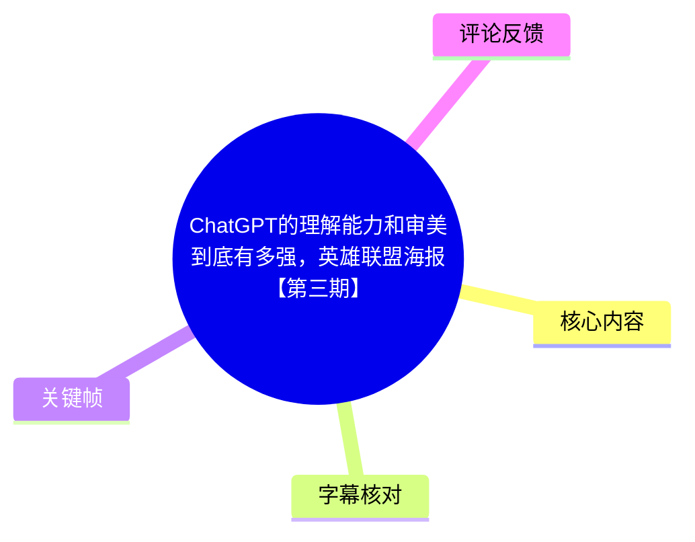
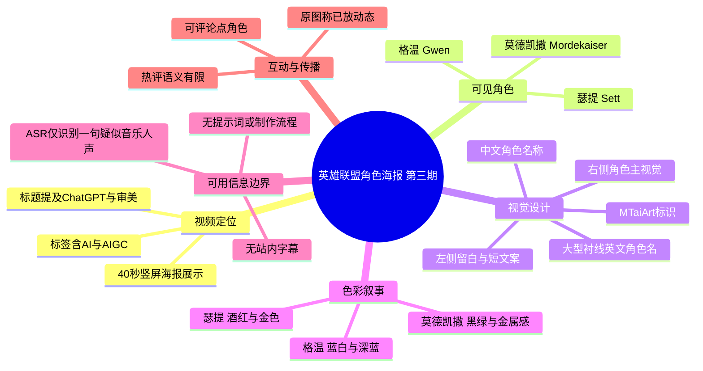
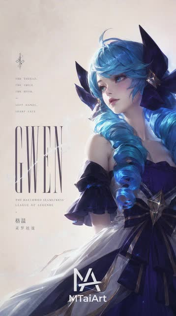
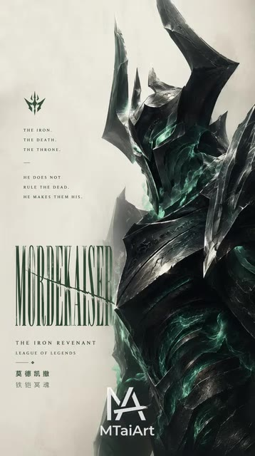
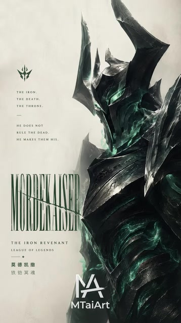
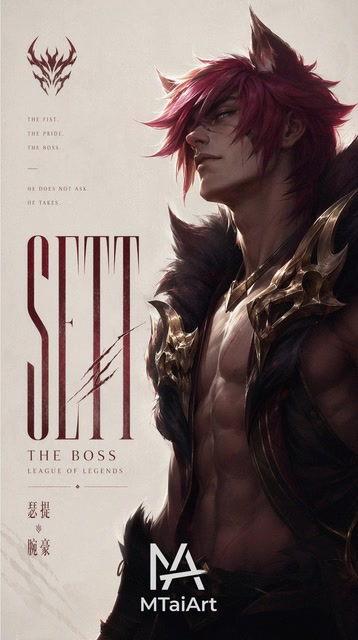

# ChatGPT的理解能力和审美到底有多强，英雄联盟海报【第三期】

> 来源：[Bilibili 视频](https://www.bilibili.com/video/BV19z596jE9y)  
> UP 主：MTaiArt｜时长：40 秒｜画面规格：1080 × 1928 竖屏  
> 视频简介：原图已发布至 UP 主动态；UP 主请求观众三连，并邀请在评论区留言想看的角色。

## 小结

这是一期以《英雄联盟》角色为主题的竖版海报展示短片。依据可见关键帧，视频至少呈现了 **格温（Gwen）**、**莫德凯撒（Mordekaiser）** 与 **瑟提（Sett）** 三张角色概念海报；每张均采用“角色半身主视觉 + 左侧窄栏文案 + 大字号英文角色名 + 中文名称 + MTaiArt 标识”的统一版式。

作品的主要信息不在口播教学，而在视觉结果本身：以浅米白留白背景承托人物，分别用蓝、幽绿、酒红等角色色彩建立辨识度；人物占据画面右侧，左侧以细小装饰图标、短句和高对比衬线字体组织信息。这种布局使海报在手机竖屏中仍保有清晰的阅读层级。

标题将内容表述为对“ChatGPT 的理解能力和审美”的观察，但现有可用素材**没有展示提示词、ChatGPT 对话、图像生成工作流、模型版本、后期处理步骤或作者对生成过程的解释**。因此，不能将成片直接归因为某一特定模型独立生成，也不能据此评估其技术能力；能够确认的是视频展示了带有 AI/AIGC 标签的英雄联盟角色海报成品。

视频几乎没有可转写的口语信息。本次 ASR 仅在 00:11.340—00:12.720 识别到一句英文 “Once you play, yeah”，覆盖时长仅 1.38 秒、约占音频 3.53%。该句更可能是背景音乐中的人声片段，不能作为海报文案或制作说明的可靠依据。正文以可见画面、元数据和视频简介为主。

适合希望参考游戏角色海报构图、角色配色和竖屏视觉包装的人阅读；不适合作为 ChatGPT、文生图模型或 AIGC 工作流的操作教程。视频发布后的平台互动数据、动态原图可用性、所涉 AI 工具能力都可能变化。

## 思维导图

## 目录

- [视频定位与信息边界](#视频定位与信息边界-0011)
- [海报展示：格温](#海报展示格温-0011)
- [海报展示：莫德凯撒](#海报展示莫德凯撒-0011)
- [海报展示：瑟提](#海报展示瑟提-0011)
- [可迁移的视觉设计经验](#可迁移的视觉设计经验-0011)
- [参数、步骤与缺失信息](#参数步骤与缺失信息-0011)
- [结论、限制与时效性](#结论限制与时效性-0011)
- [字幕比对](#字幕比对)
- [评论分析](#评论分析)
- [处理记录](#处理记录)

## 视频定位与信息边界 [00:11](https://www.bilibili.com/video/BV19z596jE9y?t=11)

视频标题为“ChatGPT的理解能力和审美到底有多强，英雄联盟海报【第三期】”，UP 主为 MTaiArt，标签包括“英雄联盟”“AI”“金克斯”“腕豪”“ChatGPT”“海克斯大乱斗”“蔚”“格温”“AIGC”。其中，标签可以说明发布者对主题的分类，但**不能单独证明每个标签角色都在本段 40 秒画面中清晰出现**；从提供的关键帧可直接确认的角色为格温、莫德凯撒和瑟提。

视频采用 1080 × 1928 的竖向画幅，适合移动端单张海报的连续展示。已提供的关键帧未附逐帧时间戳；因此，除 ASR 已给出的 00:11.340—00:12.720 外，不能为各张海报虚构精确出场秒数。本节及后续海报章节统一链接到唯一可直接验证的 ASR 时间锚点 00:11。

从内容类型看，这是“成品展示”而非“过程讲解”：

- 有角色海报的最终画面；
- 有作者水印/标识“MTaiArt”；
- 有视频简介中的原图发布与评论征集说明；
- 没有可用的站内字幕；
- 没有可验证的提示词、对话上下文、选图标准、重绘参数、分辨率放大、修图软件或导出设置；
- ASR 未转写出说明性旁白。

因此，对“ChatGPT 理解能力”的判断只能停留在标题的创作命题层面，不能把视觉成品等同于可复现的模型能力测试。

## 海报展示：格温 [00:11](https://www.bilibili.com/video/BV19z596jE9y?t=11)

> 图：关键帧呈现格温的蓝发、深蓝礼服和右侧人物主视觉。它直接说明了作品的版式骨架：左侧低信息密度留白，右侧高细节人物，底部固定放置作者标识，便于观察系列海报的一致性。

画面中的角色中文名为“格温”，英文大标题为“GWEN”。人物以侧偏正面的半身肖像出现，蓝色发辫和白皙肤色构成高明度焦点，深蓝近黑的头部装饰、肩部结构和服装形成轮廓对比。

海报的主要视觉组织如下：

1. **主体位置**：角色集中在画面右半部，脸部位于上方视觉中心；这使人物目光、发丝和服装细节成为第一阅读层。
2. **留白策略**：左半部使用暖白/米白背景，避免与蓝色角色抢夺注意力，并为标题和短句提供可读空间。
3. **文字层级**：左侧最大字号为“GWEN”，采用细长、高对比的衬线字体；上方有小型图标、短英文句与中文角色名，底部为“MTaiArt”标识。
4. **配色关系**：蓝发与深蓝服装是主色，浅背景提供明度反差；局部高光令角色具备类似时尚摄影或角色设定集的质感。
5. **叙事功能**：画面没有展示游戏实战或技能信息，而是通过服装、发型和表情将角色处理为时装海报式肖像。

关键帧中左侧可见英文装饰文案，但分辨率与画面缩放不足以保证所有小字逐字无误，故不将其转录为角色设定事实。能够明确读取并可靠使用的是角色名“GWEN / 格温”。

## 海报展示：莫德凯撒 [00:11](https://www.bilibili.com/video/BV19z596jE9y?t=11)

> 图：关键帧展示莫德凯撒的黑色盔甲、尖锐头盔与幽绿色内部光效。它有助于理解该系列如何从角色视觉符号出发，改用黑、绿、灰的低明度对比传达压迫感与金属感。

> 图：第二张同角色关键帧保留了相同的角色、文字与版式，说明视频存在对单张作品的停留或连续展示；它不应被误解为新增角色或不同版本的制作参数。

画面中央偏右为“莫德凯撒 / MORDEKAISER”。角色身穿厚重、尖锐的深色铠甲，头盔的角状结构向上延伸；黑灰金属表面与内部幽绿色光效共同建立“死亡、铁甲、威权”式的冷硬氛围。

左侧文字栏的可辨识信息包括：

- “THE IRON.”
- “THE DEATH.”
- “THE THRONE.”
- “HE DOES NOT RULE THE DEAD HE MAKES THEM HIS.”
- “MORDEKAISER”
- “THE IRON REVENANT”
- “LEAGUE OF LEGENDS”
- “莫德凯撒”

这些文字在画面中承担的作用是“角色标签化叙述”，即以短句强化角色印象，而非教学说明。特别是“THE IRON REVENANT”与角色英文名称共同帮助观众建立识别；但视频没有说明这些文字由何种工具生成、是否经人工校对或是否引用官方资料。

相对于格温海报，本张的设计变化集中在：

| 对比维度 | 格温 | 莫德凯撒 |
| --- | --- | --- |
| 主色 | 蓝、白、深蓝 | 黑、灰、幽绿 |
| 人物气质 | 轻盈、精致、时装感 | 厚重、威慑、金属感 |
| 轮廓语言 | 发辫与礼服的柔性曲线 | 头盔、肩甲与尖角的硬性折线 |
| 背景关系 | 暖白留白衬托高明度肤色 | 米白留白衬托低明度铠甲 |
| 情绪重点 | 优雅与人物肖像 | 压迫感与亡灵统治意象 |

这类“同版式、换角色语义”的设计方法，是该短片中最明确可观察到的系列化经验。

## 海报展示：瑟提 [00:11](https://www.bilibili.com/video/BV19z596jE9y?t=11)

> 图：关键帧中的瑟提以红发、裸露上身、毛领与金属肩部饰件构成主视觉。它展示了系列在不改变大体排版的前提下，以酒红与金色替代蓝绿冷色，转向更外放的力量感表达。

画面可确认角色为“瑟提 / SETT”。人物位于右侧，红色头发和偏暖肤色构成画面最鲜明的暖色区域；肩部金色金属装饰与黑色毛领为角色增加了竞技、力量和“Boss”式形象。

左侧可辨识文案包括：

- “THE FIST.”
- “THE PRIDE.”
- “THE BOSS.”
- “HE DOES NOT ASK HE TAKES.”
- “SETT”
- “THE BOSS”
- “LEAGUE OF LEGENDS”
- “瑟提”

本张海报进一步验证了系列的固定排版规则：

- 顶部：角色相关小图标及分行短句；
- 中部：超大英文角色名；
- 下部：角色称号、作品名与中文名称；
- 最底部：MTaiArt 标识；
- 右侧：占主导面积的角色肖像；
- 左侧：文字和留白共同构成呼吸区。

与莫德凯撒相比，瑟提的视觉重点从盔甲材质转到身体、毛领和金色装饰，色彩由幽绿冷光切换为红金暖调。由此可见，系列并非仅替换角色图片，而是同时依据不同角色的可识别元素调整色彩、服装质感和情绪基调。

## 可迁移的视觉设计经验 [00:11](https://www.bilibili.com/video/BV19z596jE9y?t=11)

从可见成品可归纳出以下海报设计经验。这些是对画面组织的分析，不是视频中由作者口述的制作步骤。

### 1. 先固定“系列模板”，再让角色差异进入模板

三张海报共享接近一致的结构：左文右图、米白背景、大号英文名、中文名与底部作者标识。模板先建立系列辨识度，角色差异主要通过人物姿态、主色、材质和文案替换体现。

对于需要连续发布角色卡、皮肤概念图或游戏同人海报的创作，这种方法可以降低版式设计成本，并让不同主题保持统一。

### 2. 用“单一主色 + 中性留白”控制信息密度

- 格温：以蓝色为主；
- 莫德凯撒：以黑灰与幽绿为主；
- 瑟提：以酒红、黑色和金色为主；
- 背景：均倾向低饱和浅米白。

浅背景不只是装饰，也提供了文字可读性和人物轮廓对比。角色本身色彩已经复杂时，背景保持克制能够避免竖屏画面显得拥挤。

### 3. 让人物脸部或头部成为首个注意点

三张海报都将人物头部置于画面上半部偏右位置，并用发色、头盔形状、阴影或高光建立视觉焦点。标题虽大，但其细长衬线字体占用面积较小，阅读顺序通常仍是：

1. 人物脸部/头盔；
2. 人物服装与轮廓；
3. 大号英文角色名；
4. 小字称号与中文名；
5. 作者标识。

### 4. 小文案应服务氛围，而不是承担关键信息

莫德凯撒与瑟提海报中可见的短句增强了角色性格，但小字号英文在手机端不一定便于逐字阅读。该视频的做法是将真正可快速识别的信息压缩为角色脸、英文大名和中文名，短句则作为近看时的“二次信息”。

若用于商业信息传播，应避免把活动日期、价格、规则等关键内容放到这类小字号装饰文案中。

## 参数、步骤与缺失信息 [00:11](https://www.bilibili.com/video/BV19z596jE9y?t=11)

### 可确认参数

| 项目 | 可确认内容 |
| --- | --- |
| 视频时长 | 40 秒（元数据）；ASR 音频分析时长为 39.1024375 秒 |
| 画面方向 | 竖屏 |
| 视频分辨率 | 1080 × 1928 |
| 视频主题 | 英雄联盟角色海报展示第三期 |
| 可确认角色 | 格温、莫德凯撒、瑟提 |
| 系列标识 | MTaiArt |
| 原图获取线索 | UP 主称“原图已经放到动态” |
| 互动方式 | 评论区留言想看的角色；请求三连支持 |
| ASR 模型 | medium |
| ASR 语言判定 | 英语，概率 0.5791015625 |
| ASR 语音覆盖 | 1.38 秒，3.53% |

### 不能从素材确认的制作步骤

以下常见 AIGC 环节在本视频材料中均未展示，不能补写为事实：

1. 使用的是 ChatGPT 的哪一项能力或哪个具体版本；
2. 是否使用 ChatGPT 生成提示词、翻译文案、设计方案或图片；
3. 是否搭配其他文生图模型、绘图软件或修图软件；
4. 提示词全文、负面提示词、随机种子、采样器、CFG、步数、模型文件与 LoRA；
5. 是否使用图生图、局部重绘、ControlNet、高清修复或人工绘制；
6. 海报字体名称、授权状态、文字是否人工排版；
7. 原图的实际尺寸、下载方式和动态链接；
8. 各张海报在视频中对应的精确出现时间。

### 如需复刻，应自行补足的决策项

以下是由画面反推的设计准备清单，不代表原作者真实工作流：

- 选择角色及其高辨识度元素，例如发色、头盔、盔甲、毛领、武器或饰品；
- 为每个角色确定一个主色倾向；
- 预设固定竖版网格：左侧文字栏、右侧人物区、底部署名区；
- 选择具备高竖向延展感的标题字体，并检查移动端可读性；
- 保持背景低饱和，避免与人物主色竞争；
- 对英文、中文角色名和称号进行事实与拼写校对；
- 在发布前明确图片来源、游戏 IP 使用边界和字体/素材授权情况。

## 结论、限制与时效性 [00:11](https://www.bilibili.com/video/BV19z596jE9y?t=11)

视频最有价值的部分，是展示了将不同《英雄联盟》角色统一包装为竖版概念海报的成品策略：稳定的左文右图结构、克制的浅色背景、角色主色驱动的氛围、以及大标题与小文案的分层。

但它不是可复现的 AI 制图教程。标题和标签提到 ChatGPT、AI、AIGC，却未提供任何足以验证工具链或生成过程的证据。尤其不能由“画面效果好”直接推导出“ChatGPT 独立完成海报”或“模型具备同等稳定审美能力”。

时效性方面：

- 视频元数据显示发布时间为 2026-05-14 09:40（按时间戳换算，时区未注明），互动数据抓取于 2026-07-16；
- 截至抓取时，视频播放量为 1,085,086、点赞 115,818、收藏 39,428、投币 4,407、分享 6,021、评论 3,909；这些数字会持续变化；
- UP 主所称的“动态原图”是否仍可访问、原图是否更新，需以平台当前页面为准；
- AI 产品名称、能力范围、授权和内容政策可能在视频发布后发生变化。

## 字幕比对

| 字幕来源 | 完整性 | 专有名词 | 时间轴 | 主要问题 |
| --- | --- | --- | --- | --- |
| Bilibili 站内字幕 | 不可用：未提供可用站内字幕 | 无法核验 | 无可用时间轴 | 无法作为正文依据 |
| 本次 ASR 字幕 | 很低：仅 1 条、1.38 秒，覆盖约 3.53% 音频 | 未识别出角色名、工具名或制作术语 | 有效：00:11.340—00:12.720 | 仅识别为英文“Once you play, yeah”，缺乏上下文，疑似背景音乐人声 |

本次 ASR 已被检查。ASR 结果**未标记** `noAudioStream=true`，因此不能说源视频没有音轨；相反，材料表明音频存在，但可识别语言内容极少。ASR 语言自动判定为英语，置信概率为 0.5791015625，识别结果如下：

> 00:11.340—00:12.720：`Once you play, yeah`

该句没有与关键帧中的角色名、海报文案或制作流程建立可靠对应关系，故不用于解释内容。最终字幕策略为：

1. 不采用站内字幕，因为未提供可用版本；
2. 保留 ASR 的唯一时间锚点与原文，但不将其扩展为创作结论；
3. 角色名、英文大标题与海报可见文案以关键帧画面为准；
4. 对低清或无法稳定辨认的小字不强行转录；
5. 不根据文字顺序臆测每张海报的精确时间位置。

## 评论分析

仅分析已获取的热评前三条；评论表达的是用户反应，不构成对视频内容、海报来源或制作方式的验证。

| 热评 | 点赞数 | 概括与可信度判断 |
| --- | ---: | --- |
| 哦是鱼呢：“这张” | 2,059 | 语义依赖评论区上下文，可能是在指向某张图片、角色或先前讨论对象。由于缺少被回复内容和楼中上下文，无法确定其具体诉求或观点。 |
| 孤独的guy：“[doge_金箍]” | 2,016 | 仅包含表情，属于情绪化互动，没有提供可核验的制作信息、角色信息或争议观点。 |
| SoRita-：“之前评论区的” | 2,536 | 可能暗示本期内容与此前评论区的建议、点单或讨论有关，但句子不完整，不能据此断言某角色确实由评论区投票决定。 |

三条热评的共同特点是互动热度高、文本信息量低。它们至多可以说明观众围绕画面或既往评论区存在接续式互动，不能补充视频未呈现的 AI 工作流、角色出处或版权信息。

## 处理记录

- Worker ID：`worker-mrj0www4-e8d79408`
- 模型：`gpt-5.6-terra`
- ASR 模型与参数：`medium`，CUDA，`float16`，自动语言检测；语言结果为英语，概率 `0.5791015625`。
- 可用素材与工具结果：已核对视频元数据、视频简介、12 个关键帧路径清单、站内字幕状态、ASR 诊断与 SRT、热评前三条；未提供可用站内字幕。
- 字幕选择：站内字幕不可用；检查并保留本次 ASR 的唯一有效时间段 `00:11.340—00:12.720`。由于其覆盖率仅 3.53%且内容疑似音乐人声，正文主要依据关键帧、多模态画面与元数据。
- 关键帧选择依据：`frames/frame-001.jpg` 用于格温的蓝白人物与版式分析；`frames/frame-002.jpg`、`frames/frame-003.jpg` 用于莫德凯撒黑绿盔甲及连续展示说明；`frames/frame-004.jpg` 用于瑟提红金人物海报分析。选择标准为角色身份、标题文字、色彩和排版均清晰可见。
- 时间轴依据：所有正文时间轴链接优先采用 ASR SRT 中唯一的真实时间段起点 11 秒；由于关键帧没有附带各自时间戳，未为各张海报编造独立出场秒数。
- 缓存清理：提供的素材中未包含缓存清理执行日志，无法确认是否已清理；不将其表述为已完成。
- 未解决问题：无法确认标题中“ChatGPT”在实际创作链路中的具体作用；无法确认生成模型、提示词、后期工具、原图链接、授权状态，以及各海报的精确出场区间。
