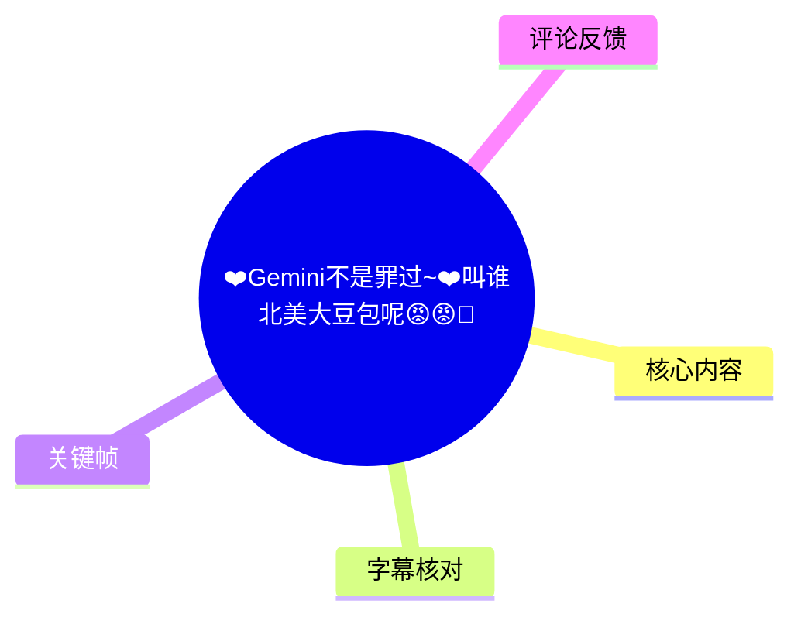
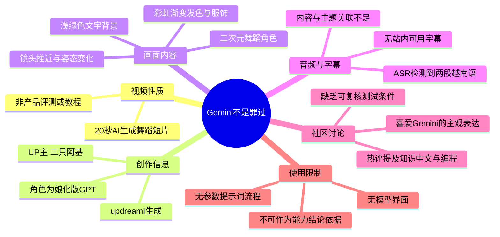
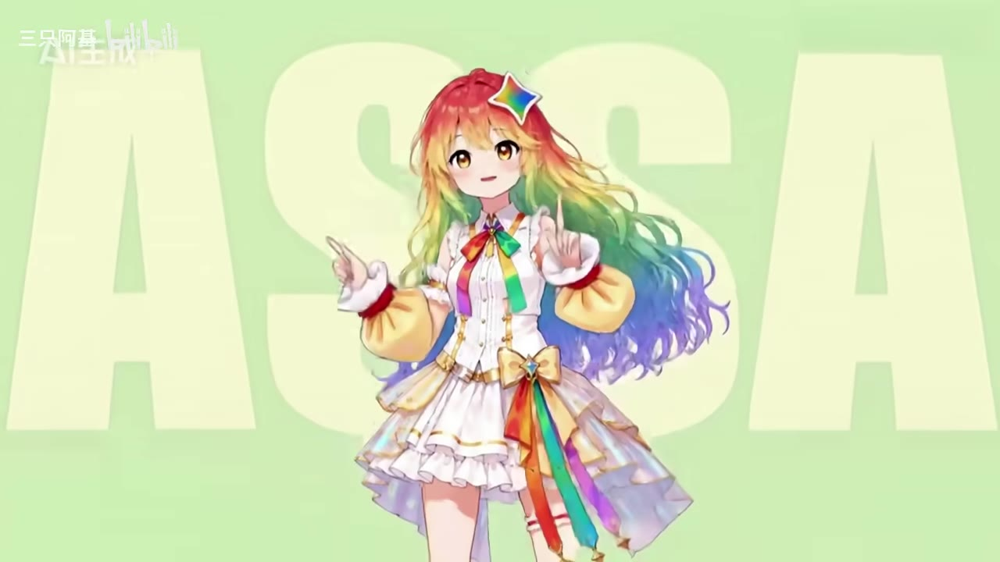
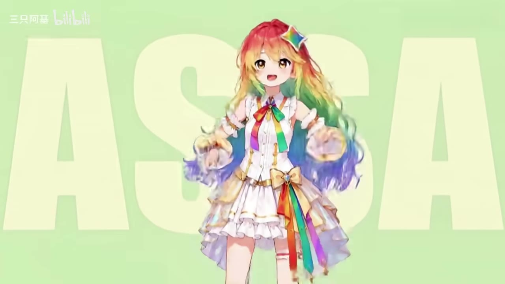

# ❤️Gemini不是罪过~❤️叫谁北美大豆包呢😡😡🥵

> 来源：[Bilibili 视频](https://www.bilibili.com/video/BV1HWKm69E4Q) 
> UP 主：三只阿基｜发布时间：2026-07-20｜视频时长：20 秒｜分辨率：3840×2160  
> 视频简介称：Gemini 是作者“白月光”；视频由 updreamI 生成；角色为“娘化版 GPT”，人物设计来源于互联网。

## 小结

这是一支时长约 20 秒的 AI 生成舞蹈短片，而非 Gemini 的功能评测、新闻解读或操作教程。视频的核心表达来自标题、简介与画面：作者以轻松、玩梗的方式表达对 Gemini 的喜爱，并借“北美大豆包”这一标签引发模型偏好讨论。

画面主体是一位被简介标注为“娘化版 GPT”的二次元角色。角色拥有红、黄、绿、蓝渐变长发，穿着带彩虹蝴蝶结和飘带的白色舞台服，在浅绿色文字背景前做连续舞蹈动作；画面左上有“ 三只阿基 / bilibili ”水印。视觉素材主要展示角色设计、镜头推近和舞蹈姿态，未呈现 Gemini 或 GPT 的产品界面、模型参数、提示词、工作流或测评数据。

本次 ASR 实际检测到音轨，并识别出两段越南语文本，合计语音覆盖约 1.64 秒、占整段视频约 8.22%。识别内容是“订阅 La La School 频道，不错过精彩视频”一类的导流语，与视频标题、简介和画面主题没有直接对应关系。因此，不能把 ASR 文本视为作者对 Gemini 或 GPT 的观点陈述。

对希望了解模型能力的读者而言，本视频只可作为 AI 二创表达和社区梗文化的素材，不足以支持“Gemini 知识储备更强”“中文理解更强”等性能结论。评论中虽有用户给出相关评价，但这属于个人体验，未附测试条件或可复核证据。

时效上，视频元数据抓取时间为 2026-08-04，站内统计当时为 6,001 播放、601 点赞、595 收藏、31 回复；这些互动数据会随时间变化。Gemini、GPT 及相关产品能力也会不断迭代，不能以本短片或评论替代当前版本的正式评测。

## 思维导图

## 目录

- [背景、创作信息与时效性](#背景创作信息与时效性)
- [画面与叙事内容](#画面与叙事内容)
  - [角色设计与舞蹈呈现](#角色设计与舞蹈呈现)
  - [镜头语言与视觉重点](#镜头语言与视觉重点)
- [音频、字幕与可确认信息](#音频字幕与可确认信息)
- [技术信息、可复用经验与限制](#技术信息可复用经验与限制)
- [结论与限制](#结论与限制)
- [字幕比对](#字幕比对)
- [评论分析](#评论分析)
- [处理记录](#处理记录)

## 背景、创作信息与时效性 [00:00](https://www.bilibili.com/video/BV1HWKm69E4Q?t=0)

视频标题将“Gemini 不是罪过”与“北美大豆包”并置，语气带有反驳和玩笑意味；标签还包括“跳舞不是罪过”“低皮质醇”“B站AI创造公开赛”“北美大豆包”“Gemini”。从这些元数据可以确认，创作围绕 Gemini 及 AI 模型社群中的称呼、偏好展开，但视频本体并未给出术语定义或争论背景。

简介提供了如下可直接确认的信息：

1. 作者称 Gemini 一直是自己的“白月光”，这是情感化、主观化的偏好表达。
2. 视频由 **updreamI** 生成；简介没有给出其版本、生成参数、模型名称、提示词、生成时长或后期流程。
3. 视频角色被明确称为“娘化版 GPT”。
4. 人物设计“来源与互联网”，但未进一步标明原始作者、授权状态或具体参考链接。
5. 作者另给出一个“视频制作参考”BV 号：`BV1LQ7j6WEyD`。当前素材没有提供该参考视频内容，不能据此推断具体制作方法。

元数据记录该视频为单 P，时长 20 秒，分辨率为 3840×2160、横屏 16:9。当前抓取时互动数据为 6,001 播放、106 弹幕、31 回复、595 收藏、6 投币、14 分享和 601 点赞。这些是抓取时快照，并非固定数值。

## 画面与叙事内容 [00:00](https://www.bilibili.com/video/BV1HWKm69E4Q?t=0)

### 角色设计与舞蹈呈现 [00:00](https://www.bilibili.com/video/BV1HWKm69E4Q?t=0)

关键帧显示，视频以一位居中的二次元少女角色为主体。她的长发具有由红、黄、绿至蓝紫的渐变效果；服装以白色为底，搭配金色装饰、泡袖、彩虹色领结、腰部蝴蝶结和长飘带。头部也带有彩虹色星形装饰。

角色在浅绿色背景前进行动作表演。背景可见大号浅色英文字母，但从给定关键帧中无法可靠辨认完整词语；因此不将其扩展解释为模型名称、口号或明确观点。左上角可见 UP 主和 Bilibili 水印，表明画面为站内视频成片的一部分。

> 图：该帧展示角色的全身构图、彩虹发色和服装主体。它有助于确认视频重点是角色舞蹈与视觉形象，而不是软件操作界面或模型功能演示。

从简介的“角色：娘化版 GPT”可知，画面角色的设定指向 GPT；但这不意味着视频在技术层面对 GPT 与 Gemini 作了比较。标题提到 Gemini、角色设定提到 GPT，构成的是拟人化模型梗的组合表达。

> 图：角色双手向前伸展，体现该短片的核心运动内容为舞蹈动作展示。该帧可辅助区分“动态角色表演”与“静态插画展示”。

### 镜头语言与视觉重点 [00:00](https://www.bilibili.com/video/BV1HWKm69E4Q?t=0)

从关键帧序列可见，画面有由全身或半身构图转向面部近景的变化。近景强化了角色的表情、彩虹发饰和领结，画面叙事更接近短视频舞蹈模板中的“角色展示—动作推进—表情特写”节奏。

不过，关键帧仅能证明存在不同景别，无法替代逐帧动作分析；同时，所提供的画面素材没有附带逐帧时间戳。故不能为每一个镜头切换编造精确发生秒数，只能将它们归入已知视频起点至结尾之间的视觉段落。

> 图：该帧突出面部表情、发色分层和胸前彩虹领结，说明镜头会通过拉近景别强化角色辨识度。

> 图：该帧呈现更近的面部和双手姿势，体现舞蹈短片常用的表情与手势特写。它对于理解视频的情绪风格比理解模型技术更有价值。

## 音频、字幕与可确认信息 [00:00:01](https://www.bilibili.com/video/BV1HWKm69E4Q?t=1)

本次 ASR 使用 `large-v3-turbo` 自动识别，自动检测语言为越南语（`vi`），语言概率为 0.8916。诊断表明：

- 视频音频总时长：19.9459375 秒；
- 检测到语音片段：2 段；
- 语音合计时长：约 1.64 秒；
- 语音覆盖率：约 8.22%；
- 首段语音开始于 1.97 秒，末段语音结束于 7.10 秒；
- 诊断中**没有** `noAudioStream=true` 标记，因此不能称视频“没有音轨”。

可直接使用的 ASR 时间轴如下：

| 时间 | ASR 原文 | 可作何种判断 |
| --- | --- | --- |
| [00:00:01.970–00:00:02.250](https://www.bilibili.com/video/BV1HWKm69E4Q?t=1) | `Hãy` | 越南语词语，单独出现且语义不完整。 |
| [00:00:05.740–00:00:07.100](https://www.bilibili.com/video/BV1HWKm69E4Q?t=5) | `subscribe cho kênh La La School Để không bỏ lỡ những video hấp dẫn` | 大意为“订阅 La La School 频道，以免错过精彩视频”。它看似片源或背景音频中的订阅提示，与当前 B 站视频的 Gemini/GPT 主题无直接证据关联。 |

鉴于没有站内字幕，且 ASR 的语言和内容与视频元数据不匹配，正文关于主题、角色和创作来源主要依据标题、简介、标签、关键帧及视频元数据；不会将上述越南语识别结果改写成作者的中文发言，也不会据其推断作者对 Gemini 的技术判断。

## 技术信息、可复用经验与限制 [00:00](https://www.bilibili.com/video/BV1HWKm69E4Q?t=0)

### 已披露的制作信息

视频可确认的技术与制作信息十分有限：

| 项目 | 可确认内容 | 未披露内容 |
| --- | --- | --- |
| 生成工具 | 简介称“视频由 updreamI 生成” | 工具版本、访问方式、模型底座、许可与费用 |
| 角色来源 | 角色为“娘化版 GPT”，人物设计来源于互联网 | 原作者、具体来源、授权许可、修改范围 |
| 制作参考 | 提供 BV1LQ7j6WEyD | 参考的是动作、分镜、提示词还是后期流程 |
| 视频规格 | 单 P，约 20 秒，3840×2160 | 帧率、码率、编码格式、原始素材规格 |
| 音频 | 有音轨，ASR 检出少量越南语 | 音乐名称、音源出处、授权信息、混音方式 |

### 对 AI 短片创作可提炼的经验

在不补充原视频未给出参数的前提下，这支作品可提供以下有限的视觉表达经验：

1. **用统一的视觉符号建立主题识别。** 彩虹渐变的头发、领结、飘带和头饰形成一致色彩语言，角色即便处于不同动作和景别，仍保持较强辨识度。
2. **以全身到近景的景别变化避免单调。** 全身画面适合展示服装和动作，半身与面部近景则突出表情与手势。关键帧证明该片采用了这类变化，但未披露具体剪辑软件或镜头参数。
3. **标题、角色设定与标签共同构成传播语境。** 标题以 Gemini 引发话题，简介设定为娘化 GPT，标签补充“北美大豆包”等社区语汇；这种组合让作品具备可讨论性，但不会自动形成对模型能力的有效比较。
4. **生成视频的来源标注不可省略。** 作者在简介中明确标注 updreamI，并说明人物设计来自互联网。这是有用的溯源线索，但若用于商业传播或二次发布，仍需进一步核验人物设计、音乐与素材的授权情况。

### 不能从本视频推出的步骤或参数

素材未包含以下内容，因此不能编造为“教程步骤”：

- 没有提示词（Prompt）或负面提示词；
- 没有角色参考图、控制图、姿态控制或种子值；
- 没有生成轮次、时长、分辨率设置、帧率或插帧方案；
- 没有配乐来源、音画同步方案或剪辑工程；
- 没有 Gemini 与 GPT 的基准测试、题目、版本号、模型设置或结果表；
- 没有对“北美大豆包”称呼的定义、来源或论证。

## 结论与限制 [00:00:07](https://www.bilibili.com/video/BV1HWKm69E4Q?t=7)

本视频最可靠的知识点是其创作属性：这是一支以 Gemini/GPT 社群梗为语境、由 AI 工具生成的拟人化角色舞蹈短片。作者通过标题表达了对 Gemini 的偏好，并在简介中披露了生成工具、角色设定和设计来源的大致信息。

它不提供任何可复现的生成流程，也没有 Gemini、GPT 或其他大语言模型的技术指标。若读者想据此判断“知识储备”“中文理解”“编程能力”“角色扮演能力”等，必须另行查阅标明模型版本、测试集、提示词、采样设置和评分方法的资料。

此外，音轨中识别到的越南语订阅提示，与视频主题存在明显不一致。它可能是背景素材、原始音源残留或 ASR 对有限语音的结果；现有材料无法判定具体来源。处理时应保留这一不确定性，不将其误归因于 UP 主或 Gemini/GPT。

## 字幕比对 [00:00:01](https://www.bilibili.com/video/BV1HWKm69E4Q?t=1)

| 字幕来源 | 完整性 | 专有名词 | 时间轴 | 主要问题 |
| --- | --- | --- | --- | --- |
| Bilibili 站内字幕 | 未提供可用字幕，无法覆盖视频内容 | 无法核验 | 无可用时间轴 | 当前素材明确标注“未提供可用站内字幕”。 |
| 本次 ASR 字幕 | 很低：仅 2 段、约 1.64 秒语音，覆盖约 8.22% | 未识别 Gemini、GPT、updreamI 等视频主题词 | 可用：1.970–2.250 秒、5.740–7.100 秒 | 自动识别为越南语，内容为“订阅 La La School”类提示，与标题、简介和画面主题不一致。 |

最终字幕策略为：**不采用 ASR 文本作为主题叙述字幕，也不存在可替代的站内字幕**。ASR 已完成检查，且诊断未报告无音轨；因此应如实记录为“存在音轨但主题语音覆盖极低且内容不匹配”。

通过元数据和多模态画面确认、而非由 ASR 校正的信息包括：

- **Gemini**：来自视频标题、简介和标签；
- **GPT**：来自简介中“角色：娘化版GPT”；
- **updreamI**：来自简介中“视频由updreamI生成”；
- **角色舞蹈、彩虹造型、浅绿色文字背景**：来自关键帧；
- **越南语订阅语音**：仅来自本次 ASR，不能视为上述专有名词的替代或翻译。

## 评论分析 [00:00](https://www.bilibili.com/video/BV1HWKm69E4Q?t=0)

当前仅获取到 2 条热评，少于请求上限“前三条”；第 3 条热评未在给定素材中提供，故不补写。

1. **维兹wizzz｜3 赞**  
   评论称 Gemini 是其“最喜欢的 LLM”，并认为其“知识储备多，中文理解力强，coding 和 roleplay 两不误”。这为视频的“Gemini 偏好”主题提供了用户侧的正面体验补充。  
   但评论没有给出 Gemini 的具体版本、对比对象、任务样本、提示词、时间范围、失败案例或评价标准，因此只能作为个人感受，不能当作模型能力已被证实的结论。

2. **无字山大王｜50 赞**  
   评论内容为 `[doge]`，属于表情化互动。较高点赞数可说明这类玩梗表达获得一定共鸣，但没有提供技术信息、事实补充或可验证观点，也不存在可供分析的明确争议。

3. **第 3 条热评**  
   给定数据中未提供第 3 条热评，无法分析。为避免编造，本文不以普通评论、弹幕或推测内容补足。

## 评论分析

- 热评 1：最喜欢的llm，知识储备多，中文理解力强，coding和roleplay两不误
- 热评 2：[doge]

以上内容是观众反馈摘录，只用于补充理解视频反响，不作为正文事实依据。

## 处理记录

- **Worker ID**：worker-mrj0wjed-b0c290ad
- **模型**：gpt-5.6-terra
- **调用工具与模型**：素材编排环境提供的视频元数据、关键帧、ASR 结果、ASR SRT 与热评 JSON；ASR 模型为 `large-v3-turbo`，运行设备为 CUDA，计算类型为 `int8_float16`。
- **使用的应用工具**：视频素材解析（`merged.mp4`、`audio/audio.wav`）、关键帧提取（`frames/`）、自动语音识别（`asr/asr-result.json`、`asr/transcript.srt`）、评论抓取（`comments/comments.json`）。
- **字幕选择**：站内无可用字幕；已检查本次 ASR。ASR 有真实时间轴，但识别为与主题不匹配的越南语订阅提示，因此不作为视频主题的正文证据；主题信息以标题、简介、标签和画面为准。
- **关键帧选择依据**：选用 `frame-001.jpg`、`frame-002.jpg`、`frame-003.jpg`、`frame-004.jpg`，分别覆盖全身构图、正面舞蹈动作、半身近景与手势特写，能够证明角色形象、动作展示和景别变化；未据此虚构未提供的精确镜头时间。
- **缓存清理**：素材清单未提供缓存清理执行日志；无法确认是否已清理，故不虚报清理完成。
- **未解决问题**：无法确认 updreamI 的具体版本和参数；无法确认人物设计、音频与参考素材的授权；无法确定越南语订阅音频的具体来源；无站内字幕，且 ASR 无法还原完整音频内容。
