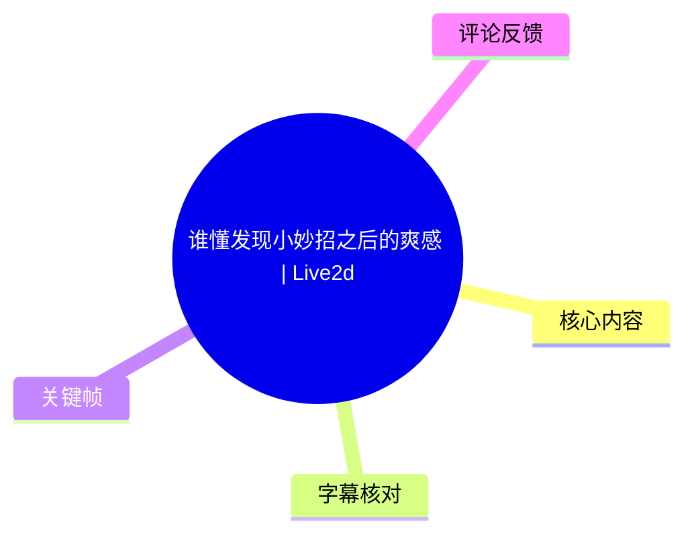
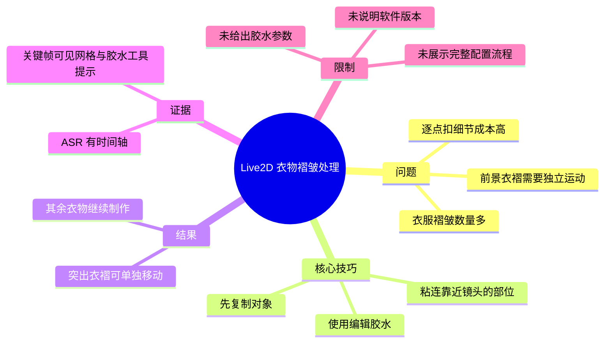
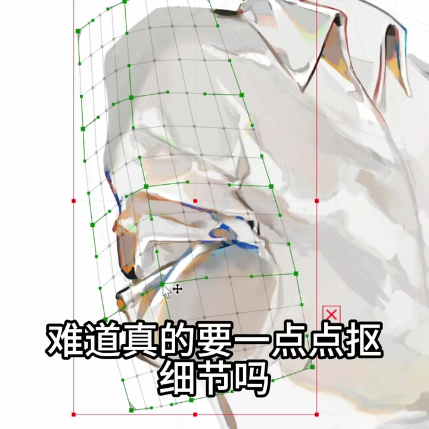
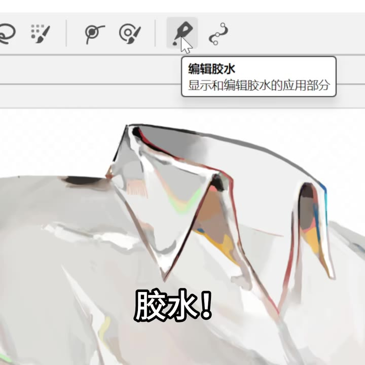
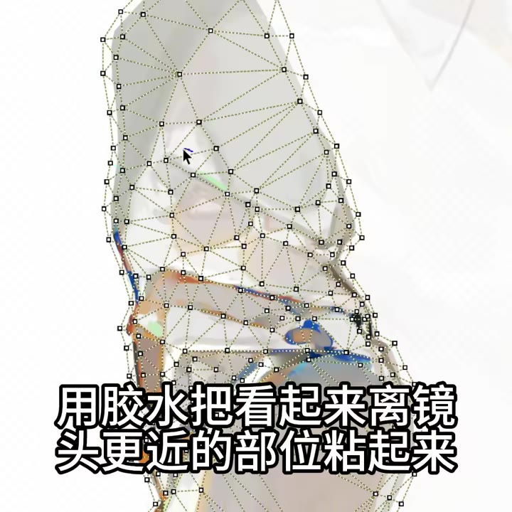

# 谁懂发现小妙招之后的爽感 | Live2d

> 来源：[Bilibili 视频](https://www.bilibili.com/video/BV1AkgX6DEdk) 
> UP 主：石心心Sxx｜时长：47 秒｜分辨率：1080×1080｜标签：绘画、原创、制作、虚拟、Live2D、虚拟主播  
> 视频简介仅注明：`绘制/建模：@石心心Sxx`。

## 小结

视频展示了一个用于处理 Live2D 衣物褶皱的小技巧：面对褶皱较多、且靠近镜头的衣料区域，作者不必完全依赖逐点细调网格，而是先复制对应对象，再利用软件中的“胶水”功能，把视觉上更靠前的衣物部位与原对象建立粘连关系。

关键价值在于分层控制。画面中的衣物已被划分并建立网格；经“胶水”处理后，前景中突出的衣褶可被单独移动。作者随后以加速画面展示继续处理其他衣物部位，并展示完成后的动态效果，但未交代完整参数、导出设置或具体软件版本。

对正在进行 Live2D 建模、尤其需处理服装层叠关系与前后景衣褶运动的人而言，这是一则简短但明确的工作流提示：先保留可编辑副本，再只对需要随动的前景局部施加粘连，而非把所有褶皱都用高密度网格硬调出来。

需要注意，视频时长仅 47 秒，属于技巧演示而不是完整教程。它没有说明胶水的强度、作用范围、是否影响物理运算、不同对象层级的设置方式，以及错误粘连后的撤销或修正方法；这些均不能由本视频推断。UP 主的“胶水”界面提示可见为“编辑胶水”，但具体软件名称未在给定素材中明确出现。

本条内容的时效性主要受 Live2D 软件功能与界面版本影响。视频元数据记录发布时间为 2026-07-27；后续版本若调整“胶水”工具的位置、名称或行为，应以当前软件文档和实际界面为准。

## 思维导图

## 目录

- [问题：逐点处理衣褶的成本](#问题逐点处理衣褶的成本)
- [发现工具：复制对象并使用胶水](#发现工具复制对象并使用胶水)
- [核心步骤：粘连前景衣物部位](#核心步骤粘连前景衣物部位)
- [结果：让突出衣褶独立移动](#结果让突出衣褶独立移动)
- [方法与实践：可复用的操作流程](#方法与实践可复用的操作流程)
- [结论与限制](#结论与限制)
- [字幕比对](#字幕比对)
- [评论分析](#评论分析)
- [处理记录](#处理记录)

## [问题：逐点处理衣褶的成本](https://www.bilibili.com/video/BV1AkgX6DEdk?t=0)

视频开头提出的问题是：“衣服怎么这么多褶皱，难道真的要一点点扣细节吗？”（ASR 0:00.000–0:04.640）

画面显示一块白色服装区域已经布置了形变网格：网格由多个顶点和四边/曲线结构构成，局部衣褶密集。这里的“扣细节”可以理解为逐个调整网格点或网格区域以模拟衣料褶皱的变化；这是视频提出、但未进一步量化工作量的痛点。

> 图：关键帧直接呈现衣物局部的网格控制点与多层衣褶，是理解“为什么逐点调整会繁琐”的核心画面证据。画面仅证明该区域网格较密，并不证明网格密度或点数为某个固定参数。

## [发现工具：复制对象并使用胶水](https://www.bilibili.com/video/BV1AkgX6DEdk?t=6)

ASR 在 0:06.410–0:12.480 的识别文本为：“此时一个做LDD的小伙注意到，胶水，先复制一份。”

结合视频标题中的 “Live2d”、标签“Live2D”，以及画面中的工具提示，可将 ASR 的“LDD”校正为 **Live2D**。画面中鼠标指向铅笔状工具图标，悬浮提示清晰写有“编辑胶水”“显示和编辑胶水的应用部分”；因此，此处“胶水”不是现实中的胶水，而是软件内的编辑工具或功能。

作者给出的第一项明确操作是“先复制一份”。素材没有说明复制的是完整衣物 ArtMesh、局部网格、绘制图层还是其他对象，因此整理时只能保留为“复制待处理对象/部位”，不能补写具体菜单路径或快捷键。

> 图：这是识别“胶水”具体含义的最强视觉依据。工具提示表明该功能名称为“编辑胶水”，并说明其用于显示和编辑胶水的应用部分，从而修正了 ASR 中可能含混的词义。

## [核心步骤：粘连前景衣物部位](https://www.bilibili.com/video/BV1AkgX6DEdk?t=13)

在 0:13.840–0:16.760，ASR 识别为：“用胶液把看起来离镜头更近的部位粘起来。”结合前后文工具名称，应将“胶液”理解为“胶水”功能，而不是独立的液体或参数名称。

此步骤的判断标准是视觉层次：作者选择“看起来离镜头更近”的部位，也就是处于前景、相对突出的衣物褶皱或衣料层。画面显示服装局部网格中存在一块突出区域，字幕同步表达“用胶水把看起来离镜头更近的部位粘起来”。

> 图：关键帧将衣物网格、突出褶皱与操作意图放在同一画面中，说明作者不是笼统地处理整件衣服，而是选择视觉上更靠前的局部进行粘连。

随后在 0:18.720–0:19.400，作者说“加速一下”。这表示后续部分的制作过程被快放，给定素材未提供快放倍率、操作次数、胶水覆盖区域或每一步时长，不能据此还原精确设置。

## [结果：让突出衣褶独立移动](https://www.bilibili.com/video/BV1AkgX6DEdk?t=24)

ASR 在 0:24.360–0:28.110 识别为：“粘上之后，突出的一褥就可以单独移动了。”其中“一褥”在语义上不通，结合衣物主题、画面文字和前文“褶皱”，应校正为 **“突出的衣褶”**。该句表达的结果是：完成胶水粘连后，突出衣褶能够作为相对独立的部分移动。

这里的“单独移动”是作者在视频中的效果陈述。素材没有展示其底层绑定关系、参数控制器名称、可移动方向范围或运动是否受物理系统影响，因此不应延伸为“自动解决所有衣物穿模、层级或物理问题”。

在 0:32.290–0:36.870，作者继续说：“接下来就很简单了，把剩下的衣物做好，就可以得到。”这句话在给定 ASR 中没有说完最终得到的具体名称；结合视频主题与快放制作片段，只能确认作者将同类处理扩展到剩余衣物，并展示了完成结果，不能补充未说出的成品细节。

## [方法与实践：可复用的操作流程](https://www.bilibili.com/video/BV1AkgX6DEdk?t=6)

以下流程严格按视频可确认的顺序整理。带有“建议”的内容是基于视频步骤提出的操作边界，不是原视频明示的参数或功能。

1. **定位需要处理的衣物褶皱区域**  
   从衣物中识别视觉上更靠近镜头、较为突出的褶皱或衣料层。视频以局部服装网格作为示例。

2. **复制一份待处理对象**  
   作者明确说“先复制一份”。复制对象的具体类型、复制后的层级放置方式及命名规则未展示。  
   - 建议：实际操作中先确认副本与原对象的可见性及层级关系，避免后续将胶水施加到错误对象；这属于通用操作建议，非视频给出的固定步骤。

3. **打开“编辑胶水”工具**  
   画面工具提示为“编辑胶水”，描述是“显示和编辑胶水的应用部分”。视频证据表明作者在此使用该工具。

4. **对前景衣物部位施加胶水粘连**  
   作者的原话是把“看起来离镜头更近的部位粘起来”。操作目标不是整个衣服，而是前景突出区域。

5. **加速完成其余制作**  
   视频在此处明确提示“加速一下”。可以确认作者继续处理剩余衣物，但具体的网格编辑、胶水绘制轨迹、参数调节过程均未被字幕和关键帧完整记录。

6. **检查突出衣褶是否可以独立移动**  
   作者将“突出衣褶可以单独移动”作为该技巧产生的直接效果。实际项目中应自行检验边缘衔接、运动幅度、与其他衣物层的关系；视频未提供验收阈值。

### 已知参数与未公开参数

| 项目 | 素材可确认信息 | 素材未提供的信息 |
| --- | --- | --- |
| 视频时长 | 47 秒；ASR 音频时长约 46.486 秒 | 快放倍率 |
| 画面规格 | 1080×1080 | 录屏软件、帧率 |
| 工具名称 | 编辑胶水 | 软件版本、工具快捷键 |
| 操作对象 | 前景、突出的衣物/衣褶局部 | ArtMesh 名称、对象层级、复制方式 |
| 操作结果 | 突出衣褶可单独移动 | 移动范围、胶水强度、物理参数、导出设置 |

## [结论与限制](https://www.bilibili.com/video/BV1AkgX6DEdk?t=32)

视频的核心经验是：面对服装复杂褶皱，不必只把精力放在逐点扣网格细节上；对于画面中需要体现前后层次的突出衣褶，可以通过“复制一份 + 编辑胶水粘连前景局部”的方式，让该局部获得独立运动空间。

这一方法适合从视频中已展示的使用场景迁移：衣物存在明显层叠关系，并且希望突出部分相对其他衣料产生独立位移。它是否适用于头发、饰品、袖口、裙摆大幅摆动、复杂物理模型或多层遮挡，需要另行验证，视频没有覆盖。

主要限制如下：

- **软件信息不完整**：仅可从工具提示确认“编辑胶水”，未提供软件版本、项目配置或功能文档链接。
- **无参数演示**：没有胶水强度、应用范围、权重、层级绑定、形变器或物理参数。
- **结果展示有限**：视频说明并展示了独立移动的思路，但没有给出前后对照、异常案例、穿模检查或性能影响。
- **ASR 末句不完整**：0:32.290–0:36.870 的“就可以得到”未包含宾语，不能据此编造最终效果的具体术语。
- **时效性**：元数据记录视频发布于 2026-07-27。软件界面、工具入口及功能行为可能在未来更新中改变，应以当前使用版本为准。

## 字幕比对

| 字幕来源 | 完整性 | 专有名词 | 时间轴 | 主要问题 |
| --- | --- | --- | --- | --- |
| Bilibili 站内字幕 | 不可用 | 无法核验 | 无法核验 | 素材明确说明“未提供可用站内字幕”；获取过程还记录了 `Invalid URL` 警告。 |
| 本次 ASR 字幕 | 覆盖 6 段语音，诊断语音覆盖率为 48.7% | 存在误识别 | 有，SRT 提供毫秒级起止时间 | 将 Live2D 识别为“LDD”、将“胶水”相关词识别为“胶液”、将“衣褶”识别为“一褥”；末句语义未完。 |

最终采用本次 ASR 的时间轴作为章节定位依据，并以关键帧和画面文字进行必要校正。ASR 诊断信息显示：

- 识别语言为中文，语言置信度约 `0.9985`；
- 模型为 `large-v3-turbo`，音频时长约 `46.486` 秒；
- 有 6 个带时间戳的识别片段，首段从 0 秒开始，末段结束于 36.870 秒；
- 未标记 `noAudioStream=true`，因此本视频存在可供识别的音轨；站内字幕缺失不是“无音轨”的证据。

重要校正如下：

| ASR 原文 | 校正结果 | 校正依据 |
| --- | --- | --- |
| 做LDD | 做 Live2D | 视频标题含“Live2d”，标签含“Live2D”。 |
| 胶液 | 胶水功能 | 关键帧工具提示为“编辑胶水”。 |
| 突出的一褥 | 突出的衣褶 | 视频主题为衣服褶皱，原识别词在语义上不成立。 |

## 评论分析

以下仅分析可获取的热评前三条。评论表达的是观众反馈，不应视为对技术机制的独立验证。

1. **Boalin_鸨霖球｜690 赞**  
   原评：“我去 一个视频学会胶水用法，老大我爱你[喜欢]”  
   该评论认为视频简短且具备较强的即时教学性，特别认可“胶水”工具用法的启发价值。这与视频实际集中介绍单一技巧的内容相符，但“学会”属于评论者的主观感受，不代表教程已覆盖完整操作条件。

2. **白卜墨｜335 赞**  
   原评：“笑死我了由于不让抽烟，所以随时随地拿着打火机好像要表演喷火的当家”  
   该评论关注的是视频角色或画面中手持打火机形成的喜剧联想，而非胶水技巧本身。给定字幕与关键帧不足以核验评论涉及的“抽烟限制”背景，因此只能将其视作观众的玩笑式解读，不能纳入技术结论。

3. **12dora｜165 赞**  
   原评：“做得好阿！”  
   这是对作品完成度的正向评价，没有提供额外教程信息、技术参数或可验证的补充事实。

## 处理记录

- **Worker ID**：worker-mrj0wjed-b0c290ad
- **整理模型**：gpt-5.6-terra
- **ASR 模型**：large-v3-turbo（`cuda`，`int8_float16`）
- **可用素材与工具产物**：视频合成文件 `merged.mp4`、音频 `audio/audio.wav`、ASR SRT `asr/transcript.srt`、ASR 结构化结果 `asr/asr-result.json`、关键帧目录 `frames/`、评论文件 `comments/comments.json`。
- **字幕选择**：未提供可用 Bilibili 站内字幕；已检查本次 ASR，采用其带毫秒时间轴的 SRT 作为时间定位来源，并通过标题、标签、工具提示和画面语义校正“LDD / 胶液 / 一褥”等识别问题。
- **关键帧选择依据**：  
  - `frames/frame-001.jpg`：呈现高密度衣物网格，支撑开场“褶皱是否需逐点处理”的问题；  
  - `frames/frame-003.jpg`：可见“编辑胶水”工具提示，是确认工具名称与用途的直接证据；  
  - `frames/frame-004.jpg`：可见衣物局部网格及“离镜头更近部位粘起来”的画面文字，支撑核心操作步骤。  
- **评论范围**：严格限定为接口返回的热评前三条。
- **缓存清理**：给定素材未提供缓存清理日志或清理结果；为避免虚构，不宣称已执行缓存清理。
- **未解决问题**：具体软件版本、胶水参数、复制对象类型、完整工程层级、快放部分的细节操作、最终成品的完整效果均未在给定素材中披露。
