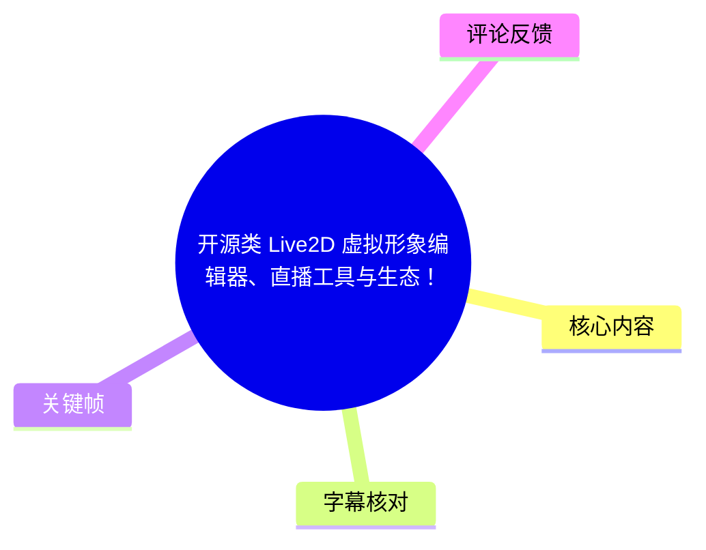
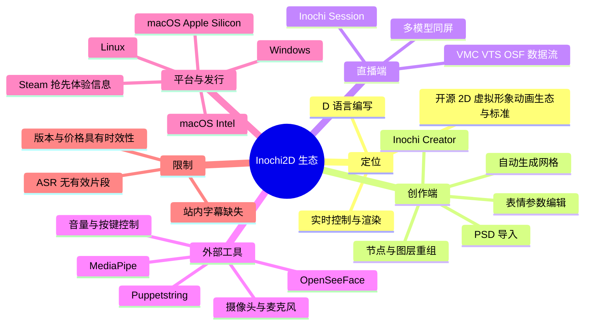
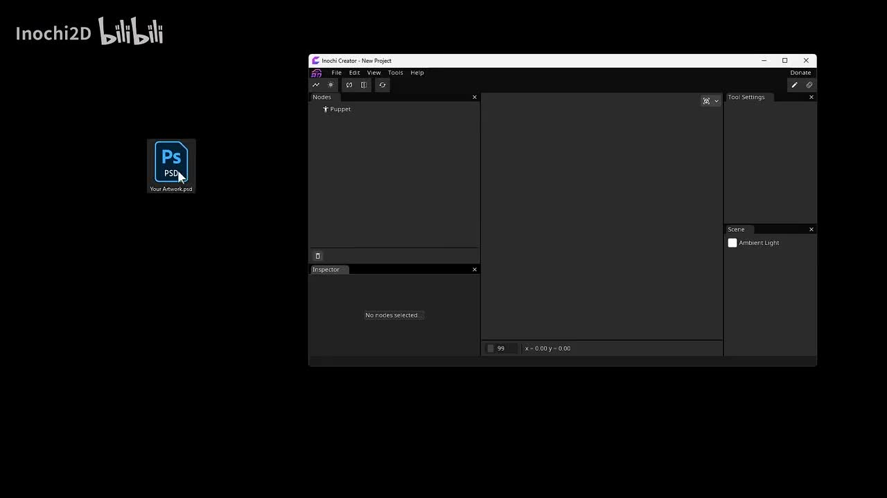
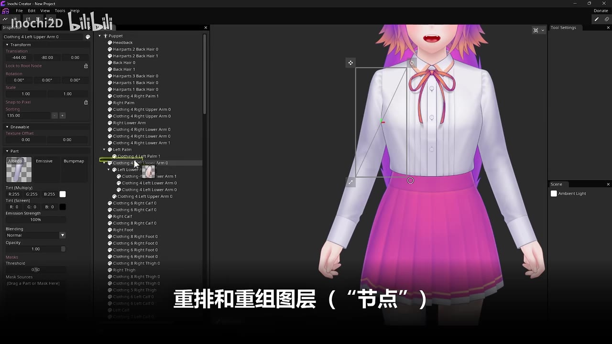
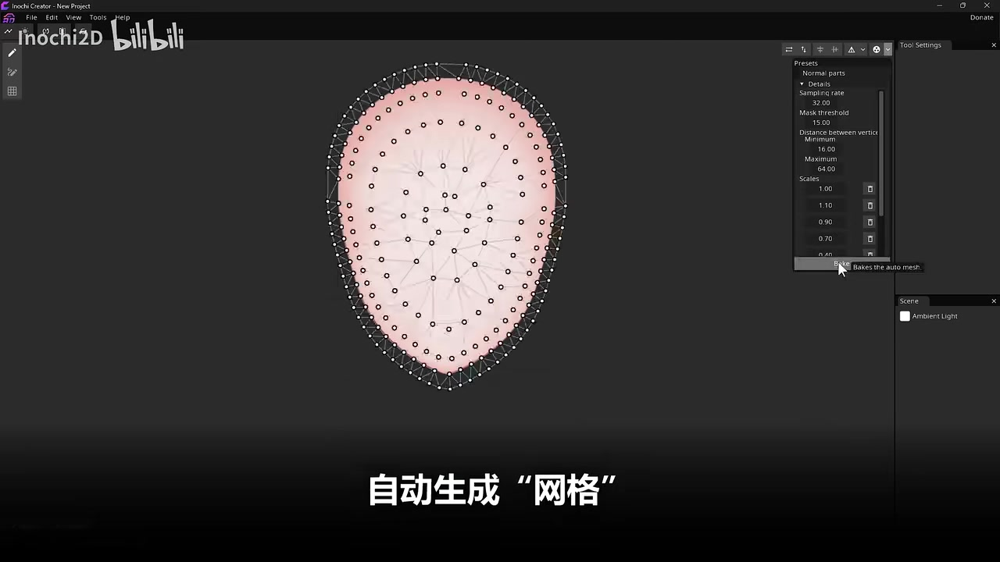
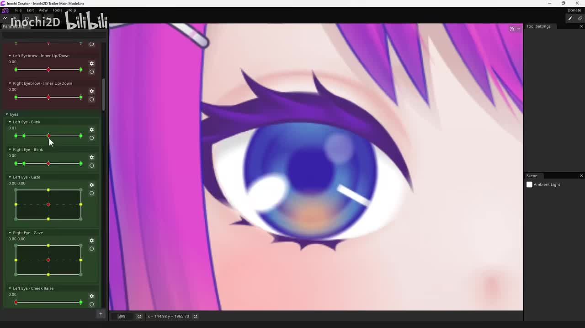

# 开源类 Live2D 虚拟形象编辑器、直播工具与生态！

> 来源：[Bilibili 视频](https://www.bilibili.com/video/BV1QnbceJE7s)  
> UP 主：Inochi2D｜发布时间：2024-09-20｜视频时长：01:51  
> 标签：软件、模型展示、虚拟偶像、开源、Linux、Live2D、VTUBER、VUP

## 小结

这是一支用于展示 **Inochi2D 生态**的短片。根据视频简介，Inochi2D 是一个仍在开发中的开源 2D 虚拟形象动画生态与标准：用户可制作 2D 虚拟形象，并通过包括面部捕捉在内的多种输入手段实时控制、渲染模型。该项目以 D 语言编写。

视频画面集中展示了 Inochi Creator 的编辑器界面与若干关键工作环节：从导入 PSD 图稿开始，组织模型“节点”与图层；对角色部件进行层级重排、变换和材质属性调整；为图像自动生成网格；以及通过参数面板编辑眉毛、眼睛、眨眼、视线等表情控制项。画面中可直接读到“重排和重组图层（‘节点’）”与“自动生成‘网格’”等说明。

从生态分工看，简介将 **Inochi Creator**定位为创作/编辑工具，将 **Inochi Session**定位为官方直播工具；后者被描述为可支持任意数量模型同屏，并接收来自任意数量、包括 VMC、VTS、OSF 等类型控制器的数据流。简介还推荐非官方工具 **Puppetstring**，用于较便捷地接入摄像头、麦克风、OpenSeeFace/MediaPipe 面部捕捉、麦克风音量和按键控制，再把数据流用于实时控制 Inochi2D 模型。

适合希望寻找开放式 2D 虚拟形象制作方案、需要 Windows/Linux/macOS 多平台工作流、或希望探索非 Live2D Cubism 路线的模型师、虚拟主播与工具开发者。需要注意：本片发布于 2024 年 9 月；简介中“10 月 1 日 Steam 抢先体验”、价格、下载页、兼容性与功能承诺都具有时效性，应以项目当前官方页面和发行版本为准。

由于没有提供可用的站内字幕，而本次 ASR 也未识别出任何有效语音片段，本文不能把画面顺序擅自还原为精确讲解时间线。正文中的技术信息以视频简介和可见关键帧为依据，并明确区分其来源。

## 思维导图

## 目录

- [项目定位与时效背景](#项目定位与时效背景)
- [Inochi Creator：从素材到可控模型](#inochi-creator从素材到可控模型)
  - [导入图稿与节点结构](#导入图稿与节点结构)
  - [图层重组、材质与变换](#图层重组材质与变换)
  - [自动生成网格](#自动生成网格)
  - [参数化表情控制](#参数化表情控制)
- [直播工具与控制器生态](#直播工具与控制器生态)
- [实践路径、参数与适用边界](#实践路径参数与适用边界)
- [结论与限制](#结论与限制)
- [字幕比对](#字幕比对)
- [评论分析](#评论分析)
- [处理记录](#处理记录)

## [项目定位与时效背景](https://www.bilibili.com/video/BV1QnbceJE7s?t=0)

### 项目是什么

视频简介将 Inochi2D 描述为“开发中的开源 2D 虚拟形象动画生态与标准”。其目标不是单一的模型编辑器，而是一套覆盖模型创作、实时驱动和直播展示的工具与格式生态。

简介中可以确认的项目特征包括：

- **实现语言**：D 语言。
- **核心能力**：创建 2D 虚拟形象；利用包括面部捕捉在内的多种输入方式进行实时控制和渲染。
- **社区属性**：由来自丹麦的开发者 Luna 领导，并有来自不同地区的创作者与开发者参与贡献；这是 UP 主在简介中的项目自述。
- **使用情况**：简介称已有数十位虚拟主播在日常工作中采用相关技术，另有大量个人模型和动画项目从编辑器中产出；该数量级为项目方陈述，本文未独立核验。
- **平台范围**：Windows、Linux、Intel Mac、Apple Silicon Mac。简介另称社区曾把相关技术移植至游戏机、单片机等嵌入式平台，但未给出具体设备、版本或维护状态。

### 发布与获取信息

视频简介称 Inochi Creator 将于 **2024 年 10 月 1 日**在 Steam 开放抢先体验，并给出当时国区定价为 **108 元**。同时，简介列出了 itch.io 和 GitHub Releases 的免费获取渠道，并说明免费版功能与付费版一致，但启动时会出现约 10 秒的支持提示弹窗。

这些内容应理解为视频发布期的发行策略，而非当前保证：

| 项目 | 视频简介中的信息 | 使用时应确认的事项 |
| --- | --- | --- |
| Steam 版 Inochi Creator | 计划于 2024-10-01 开放抢先体验；国区标价 108 元 | 当前是否已正式发布、区域价格、版本状态与许可 |
| itch.io / GitHub Releases | 可获取永久免费的适用版；简介称功能完全一致 | 当前下载文件、签名/校验、支持策略、功能差异 |
| 跨平台支持 | Windows、Linux、Intel Mac、Apple Silicon Mac | 具体版本的系统要求、图形驱动与输入设备兼容性 |
| 嵌入式移植 | 社区有游戏机、单片机等移植 | 是否为主线支持、是否仍维护、实际性能与安装方式 |

## [Inochi Creator：从素材到可控模型](https://www.bilibili.com/video/BV1QnbceJE7s?t=0)

> 本节的时间链接统一落在视频起点，因为当前素材没有可用站内 SRT，ASR 亦没有产出带时间戳的语音段落。以下按关键帧中可见的工作界面归纳，不将其伪装成精确的逐秒口述转写。

### [导入图稿与节点结构](https://www.bilibili.com/video/BV1QnbceJE7s?t=0)

关键帧显示 Inochi Creator 的新建项目界面：画面左侧出现名为 `Your Artwork.psd` 的 PSD 文件图标，编辑器中存在 `Nodes` 面板和默认 `Puppet` 节点。这表明其工作流至少包含将分层图稿引入项目、再在“Puppet（木偶/模型）”层级下组织对象两个环节。

> 图：画面中央是 Inochi Creator 的空白项目界面，左侧出现 PSD 图稿文件，节点面板中可见 `Puppet`。该帧的价值在于直观说明视频展示的是基于图稿构建 2D 模型的桌面编辑流程，而不是单纯播放成品模型。

结合画面，可以将基础制作过程谨慎整理为：

1. 准备分层图稿，例如 PSD。
2. 在 Inochi Creator 中建立项目并导入素材。
3. 以 `Puppet` 为顶层容器组织模型对象。
4. 将角色部件转化为可被编辑、排序、变形和绑定的节点。
5. 为部件创建网格并配置控制参数。
6. 在支持实时输入的运行/直播工具中驱动模型。

视频未提供可复制的菜单路径、导入选项、文件格式版本或完整操作演示，因此不能据此断言 PSD 自动导入后的具体节点规则。

### [图层重组、材质与变换](https://www.bilibili.com/video/BV1QnbceJE7s?t=0)

角色编辑画面中，左侧是大量可展开的节点树，中央显示角色躯干与手臂，底部画面字幕明确写着“**重排和重组图层（‘节点’）**”。被选中的项目似为衣物/手部相关节点；左侧检查器还可见 `Transform`、`Translation`、`Rotation`、`Scale`、`Sorting` 等字段。

> 图：该帧同时展示了角色身体、层级节点树和检查器。它直接支持“模型部件可作为节点重排/重组”的结论；左侧材质区还可见 Albedo、Emissive、Bumpmap 等纹理槽位，说明编辑界面包含材质相关配置入口。

从该帧可读出的编辑维度有：

- **层级组织**：节点树包含头部、头发、手臂、衣物、腿部、脚部等多个部件名称；节点之间可形成父子关系。
- **变换**：检查器出现平移、旋转、缩放字段，说明节点可进行空间调整。
- **绘制排序**：存在 `Sorting` 字段，适用于安排前后遮挡关系。
- **纹理/材质槽位**：画面可见 `Albedo`、`Emissive`、`Bumpmap` 标签，以及颜色、透明度、混合方式等控制项。
- **局部编辑**：中央画布中出现部件选择框与控制线，反映用户可对单个节点或局部区域进行处理。

画面显示的 `Bumpmap`、`Emissive` 等术语表明软件界面提供相应入口，但不应仅凭本片认定所有效果已在示例角色上完整启用，也不能据此推导其渲染算法、贴图格式限制或性能成本。

### [自动生成网格](https://www.bilibili.com/video/BV1QnbceJE7s?t=0)

网格编辑帧底部的画面文字为“**自动生成‘网格’**”。一个近似椭圆的脸部区域上分布了大量顶点，顶点之间形成三角形连接；右侧工具设置区域可见与网格生成相关的选项。

> 图：该帧清晰显示了面部图像上的顶点与三角形网格，并显示“自动生成‘网格’”文字。它是理解 2D 图像如何进入变形流程的关键证据：图层/图像需要被离散化为可形变的几何结构。

从截图可辨认的工具设置包括：

| 可见字段 | 可见值/状态 | 可作出的谨慎解读 |
| --- | ---: | --- |
| `Normal parts rate` | 32.00 | 自动网格生成的一项密度或采样相关设置；仅凭截图无法确认单位与精确定义 |
| `Mask threshold` | 15.00 | 与遮罩/区域判定相关的阈值项；具体算法未展示 |
| `Distance between vertices` | Minimum 16.00；Maximum 64.00 | 顶点间距约束的最小值与最大值 |
| `Scales` | 1.00、1.10、0.90、0.70 等可见项 | 可能影响不同层级或阶段的网格生成尺度；视频未解释其确切含义 |
| `Bake` 按钮提示 | “Bake the auto mesh.” | 自动生成的网格存在需要烘焙/确认写入的步骤 |

可迁移的制作经验是：自动网格能降低初始布点成本，但并不等于无需人工检查。对于脸部轮廓、眼睑、嘴部、头发边缘、衣物褶皱等高形变区域，应特别关注顶点密度、边界形状和局部拉伸结果。这里的“应关注”是基于网格变形的一般制作原则，不是视频明确给出的调参教程。

### [参数化表情控制](https://www.bilibili.com/video/BV1QnbceJE7s?t=0)

另一帧展示了角色眼部的放大视图。左侧参数区可见眉毛、眨眼、视线等项目，包含类似 `Left Eyebrow - Inner Up/Down`、`Right Eyebrow - Inner Up/Down`、`Left Eye - Blink`、`Right Eye - Blink`、`Left Eye - Gaze`、`Right Eye - Gaze`、`Left Eye - Cheek Raise` 的名称。

> 图：该帧把角色眼睛放大，同时显示多个左右分离的表情参数及其曲线/控制点。它说明模型控制不是只对整张立绘做整体位移，而是可将眉、眼、视线等表情拆分为独立参数进行调校。

画面中能确认的参数组织方式包括：

- **左右独立控制**：左、右眉毛与左、右眼睛分别列出，利于实现不对称表情。
- **眉毛内侧上下运动**：`Inner Up/Down` 指向眉头区域的上下变化。
- **眨眼参数**：`Blink` 对应眼部闭合或开合状态。
- **视线参数**：`Gaze` 显示二维控制框和多个控制点，适合将水平/垂直视线映射到眼球、瞳孔或相关图层变化。
- **面颊抬升参数**：`Cheek Raise` 可能用于笑眼等面部联动效果；具体绑定关系未在素材中展开。
- **关键点编辑**：每个参数行中可见绿色端点、红色中点及曲线/滑杆式可视元素，说明参数的不同数值位置可对应不同模型状态。

该帧只证明存在这些参数名称和可视化编辑器，不能确认其数值范围、插值方式、是否直接兼容某一特定面捕协议，或角色最终实际动作质量。

## [直播工具与控制器生态](https://www.bilibili.com/video/BV1QnbceJE7s?t=0)

### Inochi Session：官方直播工具

根据视频简介，官方直播工具是 **Inochi Session**。简介列出的能力为：

- 支持任意数量的模型同屏；
- 接收任意数量的控制器数据流；
- 控制器数据类型可包括 **VMC、VTS、OSF** 等；
- 用于实时展示和驱动 Inochi2D 模型。

这里的“任意数量”是项目方在简介中的功能描述。实际可同时加载的模型数、控制器数和画面帧率仍会受机器性能、模型复杂度、输入设备与软件版本影响；素材没有提供性能测试、硬件规格或资源上限。

### Puppetstring：推荐的非官方工具

简介还推荐了非官方工具 **Puppetstring**，并给出其 itch.io 与 Steam 页面。项目方描述的工作流是：

1. 连接摄像头和麦克风；
2. 启用 OpenSeeFace 或 MediaPipe 面部捕捉算法；
3. 使用麦克风音量控制与按键控制等输入；
4. 将形成的数据流用于实时控制 Inochi2D 模型。

可以据此把生态角色概括为：

| 环节 | 工具/能力 | 素材能确认的作用 |
| --- | --- | --- |
| 建模与编辑 | Inochi Creator | 导入图稿、组织节点、生成网格、编辑参数 |
| 官方直播呈现 | Inochi Session | 多模型同屏、接收多种控制器数据流 |
| 非官方输入/直播辅助 | Puppetstring | 摄像头、麦克风、面捕、音量、按键到模型控制数据流 |
| 输入算法 | OpenSeeFace、MediaPipe | 作为 Puppetstring 可启用的面部捕捉方案 |
| 数据流类别 | VMC、VTS、OSF 等 | 简介列为 Inochi Session 可接收的控制器类型示例 |

“VMC”“VTS”“OSF”在简介中以缩写形式出现，视频素材未展开其协议细节、版本兼容矩阵及配置方法。因此，实际搭建前应查阅相应工具最新文档，确认数据格式、端口/网络设置、面捕数据维度与模型参数映射。

## [实践路径、参数与适用边界](https://www.bilibili.com/video/BV1QnbceJE7s?t=0)

### 基于素材可整理的工作步骤

以下是由视频简介与关键帧共同支持的高层流程，不包含素材未给出的菜单名称、文件转换命令或配置参数：

1. **准备角色图稿**  
   使用带图层的图稿文件；画面以 PSD 作为示例输入。

2. **在 Inochi Creator 中建立模型工程**  
   创建 `Puppet` 模型容器，导入图稿并形成可编辑对象。

3. **整理部件与遮挡关系**  
   通过节点树重排、重组角色的头发、肢体、衣物等部件；必要时调整平移、旋转、缩放和绘制排序。

4. **配置图像材质属性**  
   根据需求检查 Albedo、Emissive、Bumpmap 等可见材质槽位，以及颜色、透明度、混合方式等属性。素材未给出推荐参数，因此应以实际渲染结果为准。

5. **生成并检查网格**  
   使用自动网格生成功能，观察顶点密度与轮廓贴合情况；在截图可见设置中，顶点间距最小值为 16、最大值为 64。完成后使用 `Bake` 将自动网格写入/固化。

6. **建立与校准表情参数**  
   对眉毛、眨眼、视线、面颊抬升等参数分别设置模型状态；特别注意左右眼、左右眉可独立调节。

7. **选择实时驱动方案**  
   如需官方直播呈现，使用 Inochi Session 接收控制器数据；如需快速接摄像头、麦克风及面捕，可评估 Puppetstring 所描述的工作流。

8. **进行实际输入与画面验证**  
   在摄像头面捕、麦克风音量、按键或其他控制器输入下测试模型。素材没有提供校准阈值、延迟、帧率或故障排查步骤，不能替代官方文档与实测。

### 截图中可见、但不宜过度外推的参数

| 参数/项目 | 画面状态 | 使用注意 |
| --- | --- | --- |
| Translation | 可见 | 用于节点位置调整；截图未给出完整坐标语义 |
| Rotation | 可见 | 用于节点旋转；不能据此推断旋转轴或插值规则 |
| Scale | 可见 | 用于节点缩放；应防止局部部件比例失真 |
| Sorting | 可见数值字段 | 与前后遮挡相关；数值范围与排序规则未展示 |
| Opacity | 可见为 1.00 | 表示存在不透明度控制；不代表所有节点必须保持该值 |
| Normal parts rate | 32.00 | 自动网格工具的可见设置，含义未由视频解释 |
| Mask threshold | 15.00 | 自动网格工具的可见设置，具体判定逻辑未知 |
| Vertex distance | 最小 16.00，最大 64.00 | 影响网格顶点分布；实际应随图像尺寸和形变需求调整 |
| Eye Gaze | 二维控制框 | 可用于视线方向相关映射；输入范围和输出关系未提供 |

### 适用范围与限制

- **适用**：希望在开放生态中制作和驱动 2D 虚拟形象的用户；需要跨 Windows、Linux、macOS 平台尝试工具链的创作者；愿意理解节点、网格与参数绑定概念的模型制作者。
- **不宜仅凭本片判断的内容**：新手学习成本、复杂模型的制作效率、导入兼容率、实时帧率、面捕稳定性、插件生态成熟度、与具体商业软件的功能对等性。
- **需要自行验证的内容**：Steam 发行状态、国区价格、免费版本提示策略、各平台安装包、第三方面捕工具维护状态、控制器协议兼容性。
- **美术层面的开放性**：UP 主在置顶热评中说明，项目不对社区模型美术进行筛选，宣传片中的模型也未必代表单一审美或最高技术表现。这意味着评估工具时，应将“示例模型审美”与“编辑器能力”分开看待。

## [结论与限制](https://www.bilibili.com/video/BV1QnbceJE7s?t=0)

这支视频展示的核心不是单个角色成品，而是 Inochi2D 的一条完整生态路线：**分层图稿 → 节点化组织 → 网格变形 → 参数控制 → 外部输入驱动 → 直播呈现**。关键帧特别证明了编辑器对节点层级、部件变换、材质槽位、自动网格和眼部/眉部参数的可视化支持。

对创作者而言，最值得借鉴的是把模型拆成可独立编辑的部件，并在网格与参数阶段为后续实时控制留出空间；对直播使用者而言，Inochi Session 与 Puppetstring 的分工提示了“模型编辑”和“输入接入/舞台呈现”可分离的工具链设计。

但本片只有 111 秒，且当前提供的字幕信息不足：它不构成安装教程、建模教程、协议配置文档或性能评测。关于版本、价格、发行、下载地址和兼容性的信息均应视为 2024 年 9 月发布时的说明；使用前需回到项目的 Steam、itch.io、GitHub Releases 与官方文档核验。

## [字幕比对](https://www.bilibili.com/video/BV1QnbceJE7s?t=0)

| 字幕来源 | 完整性 | 专有名词 | 时间轴 | 主要问题 |
| --- | --- | --- | --- | --- |
| Bilibili 站内字幕 | 未提供可用字幕 | 无法评估 | 无可用分段 | 素材明确标注“未提供可用站内字幕” |
| 本次 ASR 字幕 | 无有效文本 | 未能识别 | 无有效语音分段 | ASR 语言判断为日语，置信度 0.29296875；`segments` 为空，语音覆盖率为 0 |

本次 ASR 已实际检查：使用 `medium` 模型，音频时长约 **110.229 秒**，但识别结果没有任何语音片段。诊断信息提示“未识别到语音片段，应验证源文件是否包含可听语音并使用正确音轨重试”。

诊断数据**没有**标记 `noAudioStream=true`，因此不能断言源视频没有音轨，也不能将其表述为工具故障；准确结论是：当前 ASR 未从提供的音频中识别出可用语音内容。本文最终未采用 ASR 文本，而是采用以下证据来源：

1. 视频元数据与 UP 主视频简介；
2. 可见关键帧中的软件界面文字；
3. 关键帧中清晰可读的中文画面字幕，包括“重排和重组图层（‘节点’）”与“自动生成‘网格’”。

因没有可靠的字幕分段，除视频起点外，本文不伪造精确时间戳。

## [评论分析](https://www.bilibili.com/video/BV1QnbceJE7s?t=0)

当前素材仅获取到 **2 条热评**，不足三条；以下只分析实际可获取内容，不补造第三条。

### 1. UP 主关于模型审美与社区开放性的说明（68 赞）

UP 主回应了有人认为片头模型“不好看”“九轴很差”的潜在批评。其核心观点是：

- 项目是社区推动的项目，较低门槛允许个人创作者制作表达自身的模型；
- 用户并不都以职业虚拟主播或迎合大众审美为目标；
- 社区来自不同文化背景，审美可能不同；
- 因而项目方不对美术进行筛选，全球宣传片使用统一内容；
- 片头模型是社区贡献者 helloar14（Puppetstring 作者）绘制的个人模型；
- 更符合不同审美或技术要求的展示，项目方建议在视频结尾查看。

这条评论补充了视频简介中未展开的社区价值取向：生态强调创作自由和对个人创作者的尊重。它是项目方立场，不应被当作对模型质量或技术能力的独立客观评测；但对理解为什么宣传片包含不同风格模型具有直接参考价值。

### 2. 观众对材质与插件生态的期待（15 赞）

观众提到“漫反射”“法线纹理”等概念，并表示自己可能没有自定义软件的能力，但期待未来可以使用其他开发者制作的插件，同时认为市场有竞品是好事。

这条评论反映两点：

- 普通用户会关注材质能力、扩展性与使用门槛；
- 用户对插件生态存在需求和期待。

不过，该评论是个人期待，并不能证明 Inochi2D 当前已有何种插件机制、插件数量或成熟度。视频画面确实出现了 `Albedo`、`Emissive`、`Bumpmap` 槽位，说明材质相关设置在界面中可见；但“未来可使用插件”的部分仍需以项目实际文档和发行版本为准。

## [处理记录](https://www.bilibili.com/video/BV1QnbceJE7s?t=0)

- **Worker ID**：`worker-mrj0wjed-b0c290ad`
- **模型**：`gpt-5.6-terra`
- **素材与工具结果**：
  - 已提供合并视频 `merged.mp4`、音频 `audio/audio.wav`、关键帧目录、ASR 结果、评论 JSON、视频元数据。
  - ASR 模型为 `medium`，运行设备为 CUDA，计算类型为 `float16`，自动语言识别结果为日语、置信度约 0.293。
  - 关键帧提取结果共 12 张；本文只引用可实际核对内容的 `frame-001.jpg` 至 `frame-004.jpg`。
- **字幕选择**：
  - 站内字幕：未提供可用字幕。
  - 本次 ASR：已检查，结果为空，`segments` 为空，不可用。
  - 最终策略：不使用虚构字幕；以视频简介、关键帧界面文字和画面内容整理。
- **关键帧选择依据**：
  - `frame-002.jpg`：展示 PSD 图稿与新建项目/`Puppet` 节点，支持“导入图稿与模型容器”的描述。
  - `frame-003.jpg`：展示节点树、角色部件、变换/材质区域及“重排和重组图层（节点）”字幕。
  - `frame-004.jpg`：展示自动生成网格、顶点三角网与可见网格工具参数。
  - `frame-001.jpg`：展示眉毛、眨眼、视线等参数面板和眼部放大效果。
- **评论处理范围**：仅处理素材中可获取的热评前 2 条；未获取到第三条，因此未补充或推测。
- **缓存清理**：素材中未提供缓存清理日志，无法确认是否执行过缓存清理。
- **未解决问题**：
  - 无站内字幕，且 ASR 无有效文本，无法建立可靠的逐句时间轴。
  - 未提供具体软件版本号、安装步骤、系统需求、性能实测、协议配置样例或当前发行页面快照。
  - 价格、发行状态、下载可用性和第三方工具兼容性均需以当前官方渠道核验。

## 评论分析

- 热评 1：数小时前有一位感兴趣的观众留下了评论，说视频开头的模型“不好看”，“九轴很差”，但是 ta 最后决定删评了。我们相信还会有一些观众有一样的想法，所以在此粘贴我们的回复： 我们预计到了会收到这样的评论，没有关系，但是希望请您了解这一点：我们是一个社区推动的项目，极度低的入门门槛使得无数个人用户能够去创造自己想要的，能代表自己的模型。远非所有我们的用户都是职业的、需要迎合大众需求的虚拟主播。无数人有对“自身形象”完全不一样的认识，和作为个体用户的不同的建模水平。同时，我们的社区来自全世界，大家的审美也确实不一定和这边东亚地区的相同。 因此，我们决定不对美术进行任何形式的筛选，全球的宣传片也是统一的。视频前半出镜的模型，只不过是社区的重要贡献者 helloar14 (Puppetstring的作者) 自己绘制的模型而已。 而我们希望通过这样的对一个一个真实的人类和创作者的尊重，说服大家，我们的产品是一个真正自由的、可以实现一切创作者想法的软件。 额外地，符合您的审美和技术要求的模型展示，您也许可以在视频结尾处找到。
- 热评 2：漫反射…？法线纹理…？不太懂…自定义软件的话…貌似我没那个能力，但是也许后面能嫖大佬们的插件…！加油加油！任何市场有竞品都是好事[星星眼]

以上内容是观众反馈摘录，只用于补充理解视频反响，不作为正文事实依据。
