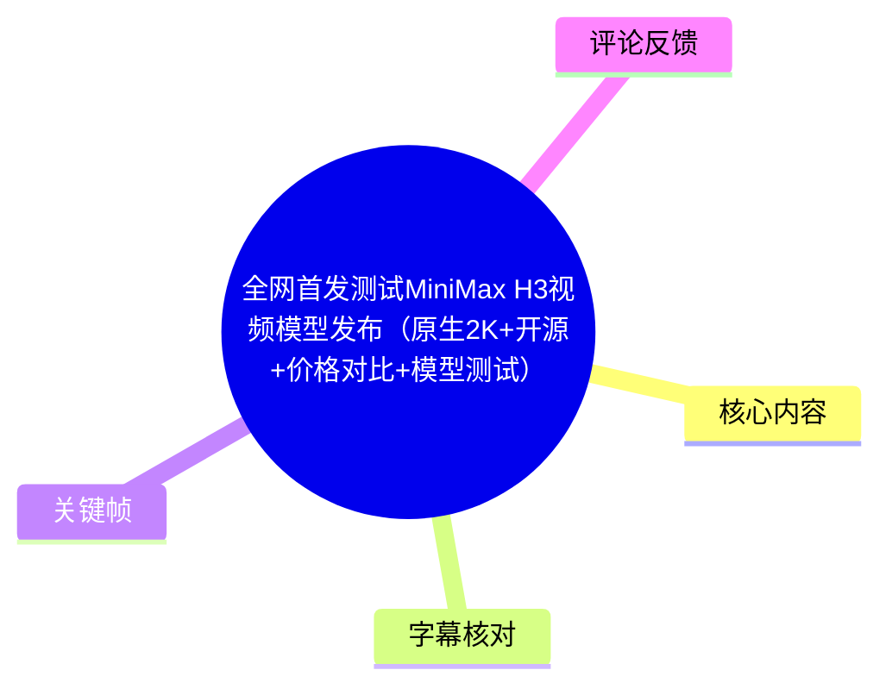
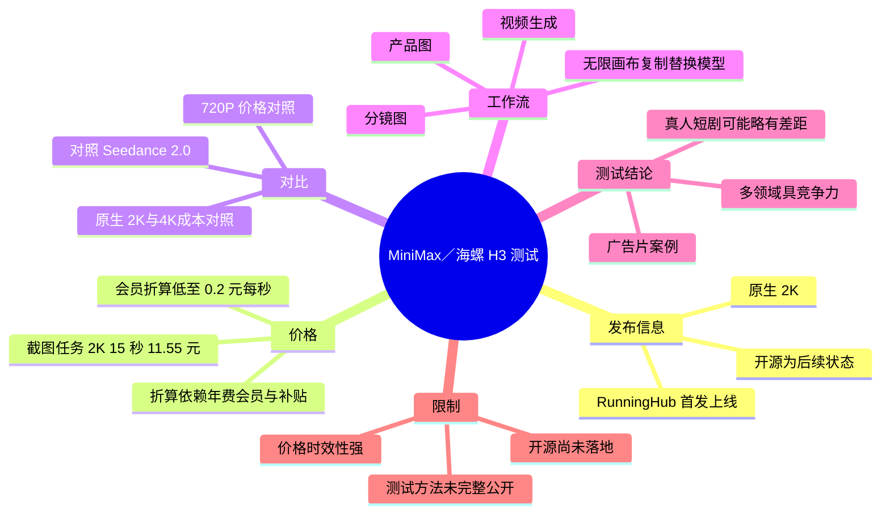

# 全网首发测试 MiniMax H3 视频模型发布（原生 2K、开源、价格对比与模型测试）

> 来源：[Bilibili 视频](https://www.bilibili.com/video/BV1LkGF6ZE5J)  
> UP 主：Ai_随风｜视频时长：4 分 59 秒｜分辨率：2560 × 1440  
> 说明：视频围绕 MiniMax／海螺 H3 在 RunningHub 的上线、价格折算、与 Seedance 2.0 的对比，以及广告片、视频延长、真人克隆等测试方向展开。涉及价格、上线状态和开源进度的信息均具有时效性。

## 小结

视频的核心新闻是：UP 主称 MiniMax H3（画面与口播中也称“海螺 H3”）已发布，RunningHub 在其上线节点提供了使用入口；视频将其卖点归纳为**原生 2K、低至 0.2 元/秒的折算价格、计划开源**。其中，“0.2 元/秒”并非截图中展示的直接单次生成标价，而是基于 RunningHub 最高档年费会员及补贴机制计算出的折算价。

从生成界面截图可见，Hailuo H3 的一次任务设置为 **2K、15 秒、9:16**，页面显示价格为 **11.55 元**。按这一可见任务计算，直接标价约为 **0.77 元/秒**；因此，观看时必须区分“原价/直接生成价”和“会员折算后的最低成本”，不能将两者混为一谈。

UP 主以 Seedance 2.0 为主要对照对象，称 H3 的原生 2K 输出在成本上更具吸引力，并主观判断其在不少领域已具备竞争力；但他也保留了限制：在真人短剧等场景，H3 可能仍与对方存在“少许差距”。视频没有给出可复现的统一提示词、样本量、失败率或盲测方法，因此这些结论应视为创作者测试经验，而非严格基准评测。

工作流层面，视频展示了“产品图 → 分镜图 → 视频”的制作路径，以及在无限画布中复制既有节点/流程后替换模型以进行测试的思路。UP 主计划在模型真正开源后将其接入自动化工作流；但视频明确表示，**当时模型尚未开源**，“开源”应理解为官方后续承诺或预期，而非已可本地部署的既成事实。

本视频适合正在比较 AI 视频生成成本、尝试电商广告片或动漫短剧工作流、并关注 RunningHub 使用入口的创作者。实际选型前，应以当日官方页面、账户等级、地区、接口与平台报价为准，并独立验证“2K”“开源”和 API 可用性。

## 思维导图





## 目录

- [发布背景与信息边界](#发布背景与信息边界)
- [H3 上线、2K 与价格口径](#h3-上线2k-与价格口径)
- [与 Seedance 2.0 的价格及能力对比](#与-seedance-20-的价格及能力对比)
- [开源预期与自动化工作流](#开源预期与自动化工作流)
- [测试案例：广告片与能力观察](#测试案例广告片与能力观察)
- [实操路径与复用建议](#实操路径与复用建议)
- [结论、限制与时效性](#结论限制与时效性)
- [关键帧索引](#关键帧索引)
- [字幕比对](#字幕比对)
- [评论分析](#评论分析)
- [处理记录](#处理记录)

## 发布背景与信息边界 [00:43](https://www.bilibili.com/video/BV1LkGF6ZE5J?t=43)

视频在约 00:43 开始进入主体。UP 主称 H3“就在刚刚”发布，并表示 RunningHub 已在第一时间上线相关入口。画面内的教程文档写有“2026 年 7 月 31 日，海螺 H3 发布并开源”，但同期口播又明确说“目前还没有开源”“下一步说的开源”。

因此，针对“开源”的严谨解读应为：

1. 视频制作时，创作者将开源作为核心宣传点和预期；
2. 口播所述的实际状态是**尚未开源**；
3. 画面文档中的“发布并开源”与口播存在时间状态冲突，不能仅凭该画面证明开源代码、权重或本地部署能力已经可用；
4. 视频之后的真实状态不在素材覆盖范围内，需到 MiniMax 官方仓库、模型页或公告另行核验。


> 图：画面展示《MiniMax H3 使用教程》文档、RunningHub 首发宣传以及“原生 2k、0.2 元/秒、开源”等卖点。这张图的价值在于保留了视频所依据的宣传口径，同时也提示读者需与口播中的“尚未开源”状态交叉核对。

## H3 上线、2K 与价格口径 [01:07](https://www.bilibili.com/video/BV1LkGF6ZE5J?t=67)

### 可见任务参数与直接标价

视频在 RunningHub 的 RHTV/画布界面中展示 Hailuo H3。可从界面读取到的关键任务参数为：

| 项目 | 画面可见信息 |
| --- | --- |
| 模型 | Hailuo H3 |
| 输出分辨率 | 2K |
| 时长 | 15 秒 |
| 画幅 | 9:16 竖屏 |
| 页面显示单次价格 | ¥11.55 |

按画面中 **¥11.55 / 15 秒** 计算，直接单次生成价格约为：

```text
11.55 ÷ 15 = 0.77 元/秒
```

该数值仅是对截图内任务的算术换算，不代表 API、其他套餐、其他时长或其他时间点的统一价格。


> 图：界面底部可见“Hailuo H3”“2k”“15s”“9:16”和“¥11.55”。它是区分“页面原价”和“会员折算价”的关键依据，也展示了视频案例使用的是竖屏 15 秒任务。

### “0.2 元/秒”的形成条件

UP 主在约 01:07—01:55 说明，RunningHub 正在提供“一元补贴”类会员方案：用户支付年费后，平台按月向账户钱包发放相应额度；将年度可得额度与支付金额合并折算后，称价格可落在约 **2.9 折至 4 折**区间。

在其所述的最高等级会员条件下，H3 的折算成本可达到 **0.2 元/秒**。这一主张的成立依赖下列前提：

- 用户购买的是视频所指的最高等级年费会员；
- 补贴、钱包额度、有效期与使用规则与视频录制时一致；
- 用户能够实际消耗获得的额度；
- 计算口径把会员支付与年度返还额度一起纳入折算。

因此，“0.2 元/秒起”更适合作为**特定会员条件下的最低折算口径**，而不是所有用户的即时结算价格。

## 与 Seedance 2.0 的价格及能力对比 [01:31](https://www.bilibili.com/video/BV1LkGF6ZE5J?t=91)

UP 主以 Seedance 2.0 作为主要参照，画面文档列出了按 RunningHub“最高等级年费会员”口径折算的对比价格：

| 模型/规格 | 视频画面给出的价格 | 口径说明 |
| --- | ---: | --- |
| Hailuo H3，2K | 0.2 元/秒 | 会员折算后的最低价 |
| Seedance 2.0，720P | 0.31 元/秒 | 画面标注为对比价 |
| Seedance 2.0，放大至 2K | 0.5 元/秒 | 画面文字如此显示 |
| Seedance 2.0，原生 1080P | 1 元/秒 | 画面文字如此显示 |
| Seedance 2.0，原生 4K | 3 元/秒 | 画面文字如此显示 |

> 注：本次 ASR 在这段将部分单位误识别为“元每分”，但关键帧中的文档文字清楚标为“元/秒”；正文以画面文字为准。

UP 主的成本观点是：Seedance 2.0 日常往往使用 720P 或 1080P，原生 2K/4K 的使用成本较高；而 H3 可直接产出 2K，在其会员折算口径下更有价格优势。这个判断的前提是不同模型的实际质量、成功率、生成耗时、可控性与返工成本相近；视频未提供这些维度的量化数据。


> 图：文档下方以红字列出了 H3 与 sd2.0 各分辨率的“元/秒”价格对照。该图用于校正 ASR 中的单位误识别，并表明这些比较是基于 RunningHub 最高等级年费会员的特定口径。

## 开源预期与自动化工作流 [01:55](https://www.bilibili.com/video/BV1LkGF6ZE5J?t=115)

### 视频对开源状态的陈述

UP 主在此处明确说：

- H3 当时“目前还没有开源”；
- 官方下一步“说的开源”；
- 若未来开放，用户可望在 ComfyUI 中更早使用；
- 社区后续可能继续完善和更新；
- 创作者计划将模型接入自己的自动化工作流。

这段内容重点不是已经完成的部署教程，而是对未来生态的预期。视频没有展示 GitHub 地址、模型权重、许可证、ComfyUI 节点名称、安装命令、显存需求或本地推理参数，因此无法据此复现本地部署。

### 无限画布中的替换模型思路

UP 主提供的可迁移经验是：若此前已在无限画布中搭建好流程，例如使用 SD 2.0 的流程，可以：

1. 复制现有工作流；
2. 在副本中替换视频生成模型；
3. 保持其他结构尽量不变；
4. 直接发起生成；
5. 将不同模型结果并排比较。

这个方法适合减少从零搭建流程的重复工作，但比较时应尽量锁定提示词、参考图、时长、画幅、种子、后处理与生成次数。视频只展示了“复制并改模型”的概念，没有给出完整节点图或参数表。

## 测试案例：广告片与能力观察 [02:47](https://www.bilibili.com/video/BV1LkGF6ZE5J?t=167)

UP 主表示自己准备了多组对比测试及完整案例，并将案例、文案和提示词整理到外部文档中。视频内可确认的测试方向包括：

- 视频延长；
- 真人克隆；
- 广告片/影片感镜头；
- 文生视频提示词；
- 图生视频提示词；
- 动漫短剧或 AI 视频工作流。

其主观结论为：H3 在“很多领域”已经能够与竞品打平，且价格更低；但在一些真人短剧场景中，可能仍有轻微差距。ASR 将竞品版本多处错误转写为“圣战/圣诞社 3.0/3.2.0”，而可见画面与评论均指向 **Seedance 2.0**；素材不足以证明口播此处是否另行比较了 3.x 版本，故不将 ASR 的版本号作为确定事实。

### 广告片制作链路 [03:53](https://www.bilibili.com/video/BV1LkGF6ZE5J?t=233)

视频展示的广告片制作流程可整理为：

```text
产品图
  ↓
根据产品图生成分镜图
  ↓
使用分镜图生成视频
  ↓
检查成片效果并与其他模型结果对比
```

该流程的优势在于先通过分镜图确定产品、人物、镜头与叙事结构，再进入视频生成，通常比只输入一段长文本更便于控制镜头连续性。视频并未提供每一步的提示词全文、图像模型、迭代轮数或具体失败样本，因此不能推导出稳定复现率。


> 图：画面呈现人物站在未来感空间中央、前方为大型屏幕的镜头，体现视频中用于展示模型视觉表现的生成内容。它有助于理解创作者为何关注 2K 输出和影片感画面，但单帧不能证明时序稳定性、人物一致性或运动质量。

## 实操路径与复用建议 [04:13](https://www.bilibili.com/video/BV1LkGF6ZE5J?t=253)

基于视频明确展示的信息，初次测试可按以下顺序进行：

1. **进入 RunningHub。** 视频简介提供了 RunningHub 链接及邀请码 `rh-v1083`，并称填写邀请码可获得 1000 RH 币和 3 元画布体验额度。这是 UP 主在简介中的推广信息，实际有效性与规则须以平台当日页面为准。
2. **在 RHTV/画布中选择 Hailuo H3。** 画面可见的案例配置为 2K、15 秒、9:16。
3. **确定输入方式。** 视频提及文生视频和图生视频；如制作产品广告片，可优先准备产品图。
4. **先制作分镜图。** 将产品图转换为包含镜头意图的分镜参考，降低直接生成长视频的不可控性。
5. **生成视频并保存参数。** 至少记录模型、分辨率、时长、画幅、输入图、提示词和实际扣费。
6. **复制工作流做横向对比。** 将同一套输入条件用于不同模型，避免因提示词或素材不同造成误判。
7. **同时核算两种成本。** 分开记录界面直接扣费与会员/补贴后的摊销成本；若不能稳定用完权益，不宜只按最低折算价决策。
8. **查看 UP 主附带文档。** UP 主称完整案例、文案以及文生视频/图生视频提示词均放在文档中，视频本身未逐条展开。

## 结论、限制与时效性 [04:37](https://www.bilibili.com/video/BV1LkGF6ZE5J?t=277)

UP 主最终将 H3 概括为一个可与 Seedance 2.0 竞争的模型，并强调“原生 2K、价格便宜、计划开源”三个方向。对实际使用者而言，最有价值的不是直接接受“最低 0.2 元/秒”或“已开源”的结论，而是采用以下判断框架：

- **分辨率不等于综合质量。** 原生 2K 是输出规格，仍需测试人物一致性、运动、文字、镜头控制、物理合理性和生成成功率。
- **低价必须核验口径。** 11.55 元的 15 秒截图与 0.2 元/秒并不矛盾，前者是可见直接任务价，后者是会员折算价；二者适用条件不同。
- **开源需以官方交付物为准。** 在素材记录的口播时间点，开源仍是后续状态；应确认代码、权重、许可和本地部署条件。
- **案例不是基准。** 视频为展示型测试，未公开完整对照实验设计，不能以单个广告片或单帧直接替代系统评测。
- **平台规则会变化。** 模型版本、排队时长、充值折扣、会员返还、可选时长与 API 价格均可能在发布后调整。

## 关键帧索引

| 关键帧 | 正文位置 | 画面价值 |
| --- | --- | --- |
| `frames/frame-001.jpg` | 测试案例 | 提供科幻影片感生成画面样本，辅助观察视觉风格与场景表现。 |
| `frames/frame-002.jpg` | 发布背景 | 记录教程文档中的上线宣传、日期和核心卖点，是核对宣传口径的依据。 |
| `frames/frame-003.jpg` | 价格口径 | 显示 Hailuo H3、2K、15 秒、9:16、¥11.55 等可见任务参数。 |
| `frames/frame-004.jpg` | 模型对比 | 显示 H3 与 sd2.0 的“元/秒”价格表，校正 ASR 对单位的误识别。 |

## 字幕比对

| 字幕来源 | 完整性 | 专有名词 | 时间轴 | 主要问题 |
| --- | --- | --- | --- | --- |
| Bilibili 站内字幕 `p01-ai-zh.srt` | 严重不完整且内容不对应，仅覆盖 00:00—00:33 | 与本视频主题完全无关 | 有精确毫秒级时间轴，但对应的是“新车被涂鸡血”的内容 | 显然为错配字幕，不能用于本视频事实整理 |
| 本次 ASR（`large-v3-turbo`） | 覆盖约 240.36 秒语音，占总时长约 80.45% | 模型名称、版本号和部分术语误识别较多 | 有时间戳；首段有效主题语音约始于 00:43，含两处较大无语音间隙 | 开头 00:25、00:39 有乱码；将“海螺”“Seedance”“ComfyUI”等词转写错误，部分价格单位与版本号不可靠 |

### 最终字幕选择与校正原则

正文以**本次 ASR 的时间轴**作为章节定位依据，因为站内字幕与视频内容完全错配；再结合关键帧中可读的界面和文档文字，对 ASR 的专有名词、参数与单位进行审慎校正。

本次 ASR 诊断中**未标记 `noAudioStream=true`**，且识别到约 240 秒语音，因此不存在“源视频没有音轨”的情况。视频在约 00:26—00:39、03:36—03:53 存在较大语音空档，后者对应展示样片的可能性较高，但仅据空档不能推断具体画面内容。

已通过画面校正或限制使用的重点词语如下：

| ASR 结果 | 正文处理 | 依据 |
| --- | --- | --- |
| “海罗/海罻 H3” | 写作“MiniMax／海螺 H3（Hailuo H3）” | 标题、画面中的 `Hailuo H3` 与上下文 |
| “圣诞社/圣战社” | 写作“Seedance 2.0” | 关键帧价格表中的 `sd2.0`、评论上下文 |
| “confian” | 写作“ComfyUI” | 上下文为开源模型接入工作流，属于合理术语校正 |
| “0.5 元每分”“1 元每” | 不采信 ASR 单位，采用“元/秒” | 关键帧价格表明确写作“元/秒” |
| “发布并开源” | 标注与口播矛盾，不确认已经开源 | 口播明确称“目前还没有开源” |

## 评论分析

以下仅分析可获取的热评前三条；评论属于用户个人陈述，未作为已验证事实写入正文。

1. **蝉鸣2003｜13 赞**  
   评论者称自己通过 API 测试，2K 价格为 **0.8 元/秒**，生成 4 秒花费 3.2 元；并称 Seedance 2.0 的 720P API 为 4 秒 4 元。其观点是：H3 不一定比 Seedance 便宜很多，但如果未来确实开源则意义很大。  
   - 价值：该评论直接指出“视频中的会员折算价”与“API 直接价”可能不同，和画面中 ¥11.55/15 秒约 0.77 元/秒的计算相互呼应。  
   - 限制：评论未给出 API 文档、调用时间、套餐、地区、税费、请求参数或账单截图，不能据此确认普遍价格。

2. **张鹃890910｜0 赞**  
   评论称“开源盛世要来了”。  
   - 价值：反映观众对视频“开源”卖点的期待。  
   - 限制：没有提供任何模型许可证、代码仓库或上线证明，属于态度表达，不构成开源已落实的证据。

3. **我不是恋艾脑｜0 赞**  
   评论称“今天中午上的”。  
   - 价值：补充了其观察到的上线时间线索，与视频“刚刚发布/首发上线”的叙事一致。  
   - 限制：未说明具体平台、时区和来源，且与画面文档和元数据日期的精确关系无法从素材中核验。

## 处理记录

- Worker ID：`worker-mrj0wjed-b0c290ad`
- 生成模型：`gpt-5.6-terra`
- 调用工具与模型：素材编排任务提供的媒体提取结果、关键帧、Bilibili 站内 SRT、评论数据；语音识别模型为 `large-v3-turbo`，运行于 CUDA，计算类型为 `int8_float16`。
- 使用的素材文件：`merged.mp4`、`audio/audio.wav`、`asr/transcript.srt`、`asr/asr-result.json`、`subtitles/p01-ai-zh.srt`、`comments/comments.json`、`frames/frame-001.jpg` 至 `frames/frame-004.jpg`。
- 字幕选择：站内字幕内容与本视频完全错配，未采用；采用本次 ASR 的有效时间段作为时间轴，并以关键帧文字校正模型名、价格单位和界面参数。
- 关键帧选择依据：选择含有教程文档、价格表、Hailuo H3 设置和生成样片的帧，分别服务于“发布口径”“参数/直接标价”“对比单位校正”“视觉样例”四类证据；未对未提供画面内容说明的其余关键帧作臆测性引用。
- 缓存清理：任务素材仅提供生成结果及完成时间，未提供缓存目录或清理执行日志；因此无法确认是否已执行缓存清理，也未虚构清理结果。
- 未解决问题：
  - H3 在视频之后是否已经正式开源、开源范围及许可证为何，素材无法确认；
  - RunningHub 会员补贴、邀请码赠送额度和模型价格具有实时变化可能，需以平台当日规则为准；
  - 视频未提供统一测试提示词、完整生成参数与客观评价指标，无法复现实验或验证“打平”的普遍性。
