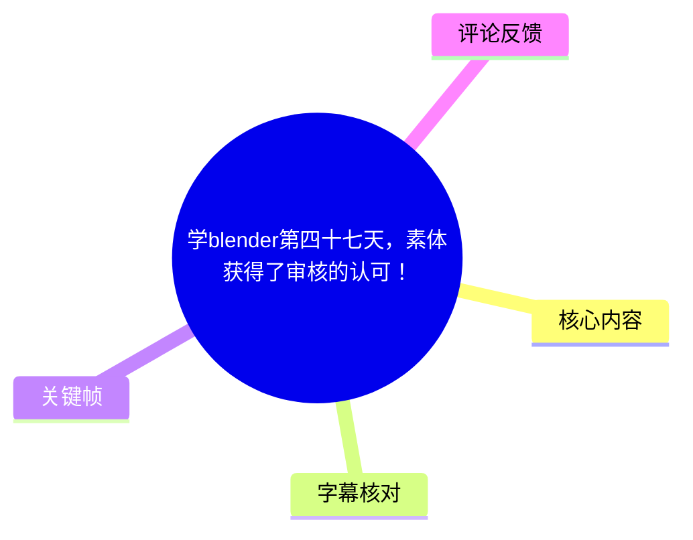
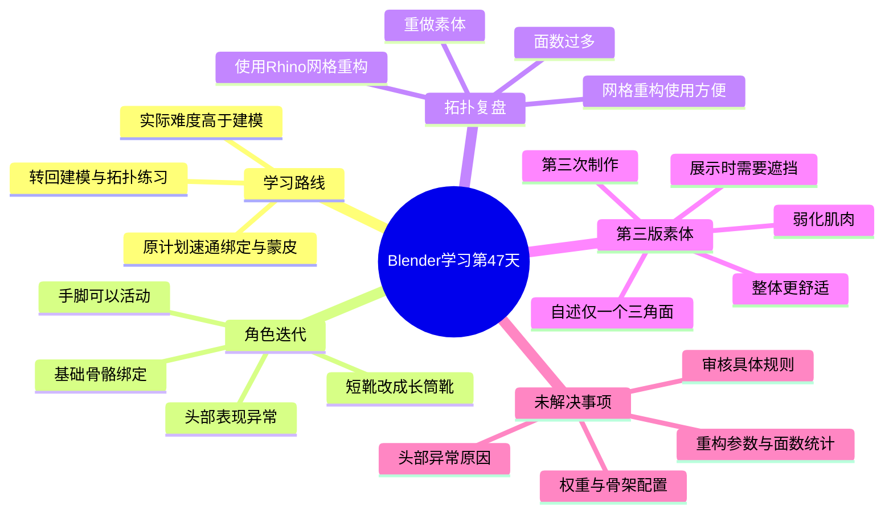
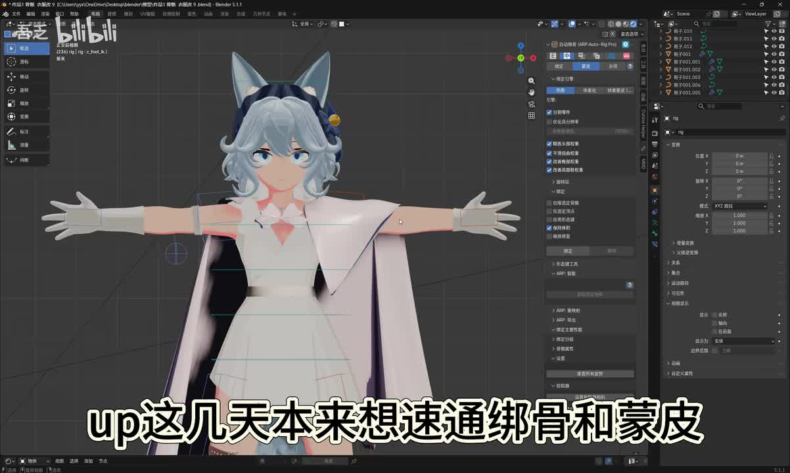
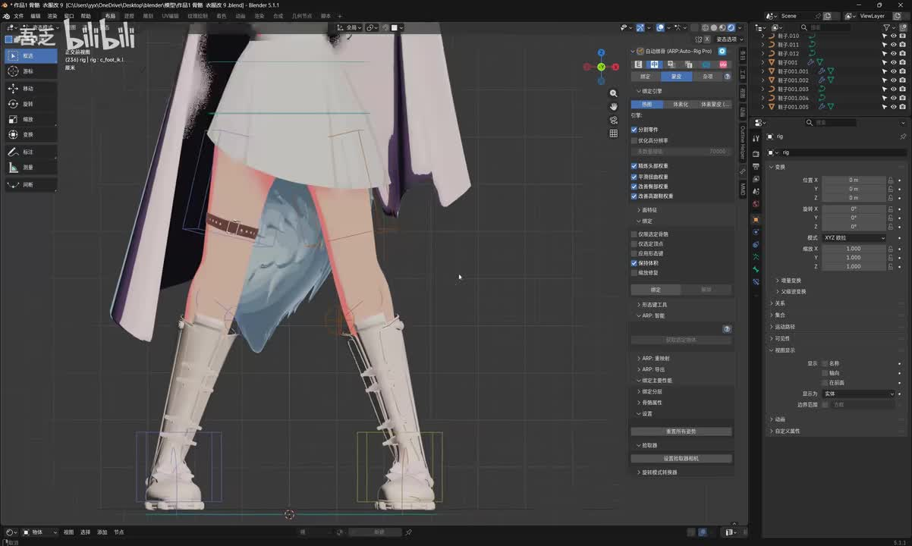
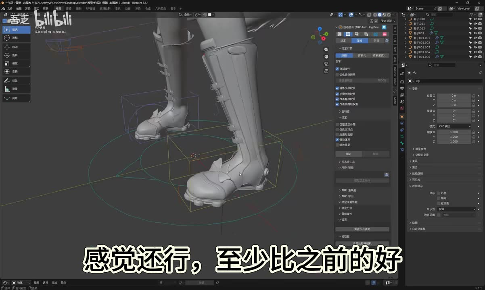
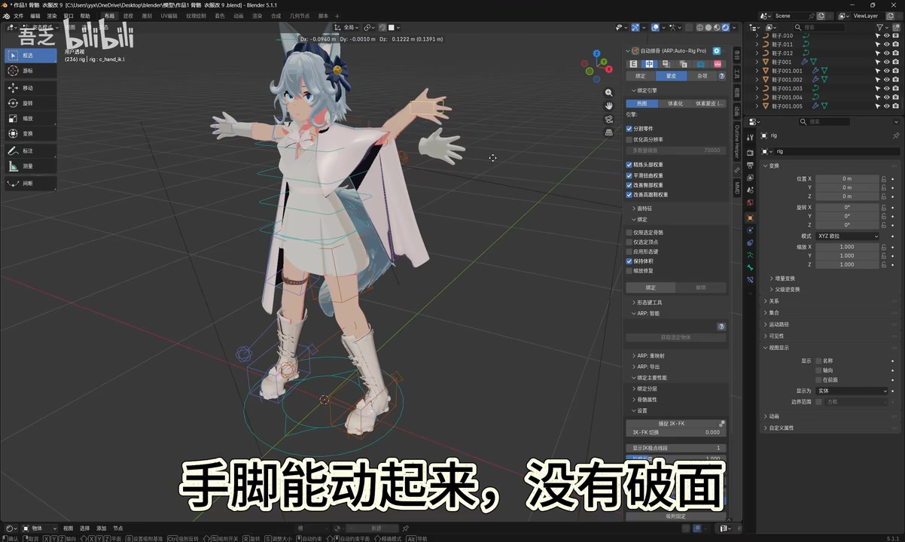

## 小结

本视频是 UP 主“吾乏”在 Blender 学习第 47 天的阶段记录，重点展示角色模型在**鞋子重做、基础骨骼绑定、身体拓扑重制与素体迭代**方面的进展。视频标题所称“素体获得了审核的认可”，对应的是 UP 自述：当前第三版素体若不作遮挡便难以通过审核；这不是平台公开规则或官方认证结论。

UP 原本想快速学习骨骼绑定与蒙皮，但实际接触后认为其难度明显高于建模，因此调整练习重心，继续强化建模和拓扑。其已完成基础绑骨：手脚能够活动，演示姿态下未见破面；但 UP 同时认为头部表现“非常诡异”，并未在视频中给出原因或修复方案。

身体网格是本期最重要的技术复盘。UP 表示此前没有手工给身体拓扑，而是使用 Rhino（犀牛）的网格重构功能；该方法使用方便，但产生的面数过多，不适合当前角色模型的后续需求，因此重新制作了素体。第三版素体弱化了肌肉表达，整体视觉更柔和；UP 自述整个模型仅有一个三角面。

视频适合正在从静态角色建模过渡到角色绑定、蒙皮和拓扑整理的 Blender 初学者参考。它提供的是阶段经验和问题识别过程，而不是可直接复现的完整教程：未提供骨架层级、权重绘制、Rhino 命令参数、模型统计数据或头部异常的修复步骤。

视频时长约 02:11。相关判断具有个人项目与时间条件限制：软件版本、建模目标、审核要求都可能变化；“不遮挡无法过审”只能视作 UP 的个人发布经验，不能外推为普遍平台规则。

## 思维导图

## 目录

- [视频信息与背景](#视频信息与背景-0000)
- [学习路线调整：绑定与蒙皮难度](#学习路线调整绑定与蒙皮难度-0003)
- [鞋子重做：短靴改为长筒靴](#鞋子重做短靴改为长筒靴-0015)
- [基础绑定演示：肢体可动与头部异常](#基础绑定演示肢体可动与头部异常-0029)
- [身体拓扑复盘：Rhino 网格重构与面数问题](#身体拓扑复盘rhino-网格重构与面数问题-0053)
- [第三版素体：肌肉弱化与布线检查](#第三版素体肌肉弱化与布线检查-0116)
- [回看第一版素体](#回看第一版素体-0144)
- [可迁移的实践流程、参数缺失与限制](#可迁移的实践流程参数缺失与限制-0003)
- [字幕比对](#字幕比对-0000)
- [评论分析](#评论分析-0000)
- [处理记录](#处理记录-0000)

## 视频信息与背景 [00:00](https://www.bilibili.com/video/BV1czEu6VEJR?t=0)

- **标题**：学blender第四十七天，素体获得了审核的认可！
- **BV 号**：BV1czEu6VEJR
- **UP 主**：吾乏
- **合集**：AIcode
- **视频时长**：131 秒（约 02:11）
- **标签**：学习、建模、blender新人、Blender
- **视频链接**：[Bilibili](https://www.bilibili.com/video/BV1czEu6VEJR)
- **视频简介**：求关注，求点赞
- **元数据发布时间**：2026-06-08；素材未提供可核实的时区信息。

视频属于连续学习记录，记录的是创作者第 47 天的实际进度。画面主要为 Blender 工作界面与角色模型展示，包含已配置的角色控制器、服装、长筒靴和素体布线。

> 图：关键帧展示角色位于 Blender 工作区，模型处于展开姿势，周围可见控制器。它能够证明视频所讨论的绑定与蒙皮已进入实际角色模型操作阶段，而不只是理论学习。

## 学习路线调整：绑定与蒙皮难度 [00:03](https://www.bilibili.com/video/BV1czEu6VEJR?t=3)

在 [00:03—00:11](https://www.bilibili.com/video/BV1czEu6VEJR?t=3)，UP 表示自己原本想“速通绑骨和蒙皮”，但学习后发现，这部分内容“比建模难不少”，于是决定继续练习建模和拓扑。

视频中能够确认的学习路线变化是：

1. 原计划：快速进入角色骨骼绑定与蒙皮。
2. 实际体验：绑定、蒙皮的学习难度高于此前的建模工作。
3. 当前调整：不继续强行速通，而是返回建模和拓扑练习。
4. 阶段状态：模型已具备一定绑定结果，但拓扑和头部表现仍存在需要继续处理的问题。

视频未说明 UP 采用的课程、插件、绑定系统或骨架模板，不能据此判断其具体工作流。这里的“绑骨”与“蒙皮”可按视频中的常规角色制作语境理解：

- **建模**：制作角色、服装、鞋子等几何形体。
- **拓扑**：组织网格边线与面结构，以便编辑、控制面数和支持变形。
- **绑定**：将骨骼或控制器系统配置到模型上。
- **蒙皮**：建立模型网格与骨骼之间的变形关系，使网格跟随骨骼运动。

## 鞋子重做：短靴改为长筒靴 [00:15](https://www.bilibili.com/video/BV1czEu6VEJR?t=15)

在 [00:15—00:25](https://www.bilibili.com/video/BV1czEu6VEJR?t=15)，UP 展示了重新制作的鞋子，并明确说明将原本的短靴改成了长筒靴。UP 对这一版本的评价是“感觉还行，至少比之前的好”。

从画面和口述可以确认：

- 鞋型已由短靴改为覆盖小腿的长筒靴；
- 鞋子有较完整的轮廓细节，包括鞋筒、鞋底和局部装饰；
- 鞋子放在已经配置角色控制器的模型环境中展示；
- 视频没有演示鞋子的具体建模过程，也未给出顶点数、面数、修改器、材质节点或贴图信息。

> 图：关键帧聚焦角色下半身，可直接观察到长筒靴的高度、轮廓及其与服装的搭配关系。这是“短靴改成长筒靴”最直观的画面证据。

> 图：该帧以局部视角展示鞋子外形，同时可见脚部周围的控制器。它说明鞋子处于后续绑定检查的角色场景中；但仅凭这一帧不能验证鞋子权重是否已完全正确。

## 基础绑定演示：肢体可动与头部异常 [00:29](https://www.bilibili.com/video/BV1czEu6VEJR?t=29)

UP 在 [00:29—00:41](https://www.bilibili.com/video/BV1czEu6VEJR?t=29) 展示模型绑定后的状态：

| 时间 | 视频陈述 | 可确认范围 |
| --- | --- | --- |
| [00:29—00:30](https://www.bilibili.com/video/BV1czEu6VEJR?t=29) | 已给模型绑骨 | 角色已进入骨骼驱动的测试阶段。 |
| [00:34—00:36](https://www.bilibili.com/video/BV1czEu6VEJR?t=34) | 手脚能动起来，没有破面 | 当前展示动作中，肢体可被控制，未见 UP 所称的破面。 |
| [00:39—00:41](https://www.bilibili.com/video/BV1czEu6VEJR?t=39) | 头部非常诡异 | UP 明确识别到头部存在未解决的异常表现。 |

> 图：角色呈现非对称肢体姿势，周围可见多组控制器。该画面对应“手脚能动起来，没有破面”的展示，有助于区分静态建模完成度与实际绑定变形效果。

“没有破面”应严格限定为视频展示的当前姿势和观察范围，不代表模型在全部动作、极端关节角度、衣物部位或隐藏结构上都不会发生拉伸、穿插或破损。

视频没有说明“头部诡异”的具体表现，也未展示故障定位步骤。因此不能将它确定为权重、骨骼位置、头发跟随、控制器设置或其他任一单独问题。评论区有观众给出条件化的排查建议，详见后文评论分析，但未得到视频验证。

## 身体拓扑复盘：Rhino 网格重构与面数问题 [00:53](https://www.bilibili.com/video/BV1czEu6VEJR?t=53)

UP 在 [00:53—01:07](https://www.bilibili.com/video/BV1czEu6VEJR?t=53) 展示身体布线，并解释此前身体网格的来源与问题。

| 时间 | 视频内容 | 知识要点 |
| --- | --- | --- |
| [00:47—00:50](https://www.bilibili.com/video/BV1czEu6VEJR?t=47) | 展示身体布线 | 视频进入身体网格结构检查。 |
| [00:53—00:58](https://www.bilibili.com/video/BV1czEu6VEJR?t=53) | 没有给身体拓扑，只用了“犀牛”的网格重构指令 | UP 表示此前身体网格不是通过完整人工重拓扑得到。 |
| [00:59—01:02](https://www.bilibili.com/video/BV1czEu6VEJR?t=59) | 犀牛的网格重构“太好用了” | UP 肯定该功能在获得网格上的便利性。 |
| [01:03—01:07](https://www.bilibili.com/video/BV1czEu6VEJR?t=63) | 面数太多，因此重新做素体 | 网格重构的结果不满足当前角色的面数与后续使用需求。 |

正文将字幕中的“犀牛”保守记为 **Rhino（犀牛）**。但视频没有展示具体命令名称、软件版本、输入网格条件或参数配置，因此不能将其进一步等同于某个确定的 Rhino 操作。

视频给出的核心经验是：

> 网格重构可以快速生成连续网格，但“操作方便”不等于“适合角色绑定”。当模型需要蒙皮、关节变形或面数控制时，还要检查网格密度和布线是否满足目标。

UP 未给出重构前后的顶点数、边数、四边面数或三角面数，故“面数太多”只能记录为其项目判断，不能进行量化比较。

## 第三版素体：肌肉弱化与布线检查 [01:16](https://www.bilibili.com/video/BV1czEu6VEJR?t=76)

在 [01:16—01:40](https://www.bilibili.com/video/BV1czEu6VEJR?t=76)，UP 介绍重新制作的第三版素体：

1. [01:16—01:18](https://www.bilibili.com/video/BV1czEu6VEJR?t=76)：这是其第三次制作素体。
2. [01:19—01:23](https://www.bilibili.com/video/BV1czEu6VEJR?t=79)：UP 称现在制作的素体“不遮挡一下都过不了审”。
3. [01:25—01:28](https://www.bilibili.com/video/BV1czEu6VEJR?t=85)：本次版本弱化了肌肉，整体看上去更舒服。
4. [01:31—01:33](https://www.bilibili.com/video/BV1czEu6VEJR?t=91)：再次展示布线。
5. [01:38—01:40](https://www.bilibili.com/video/BV1czEu6VEJR?t=98)：UP 自述整个模型只有一个三边面，即一个三角面。

这次重做同时对应两类目标：

- **造型目标**：减弱肌肉刻画，使素体整体视觉更柔和。
- **结构目标**：避免此前网格重构导致的过高面数，并尽量使拓扑更可控。

“只有一个三角面”属于 UP 的口述结论。视频未展示完整网格统计面板、所有隐藏面、该三角面的位置，也不能确定“整个模型”的范围是否包含服装、头发和其他配件，因此不应将其作为独立验证过的模型统计数据。

关于“审核”的陈述同样需要限定：视频没有说明平台、审核条款、遮挡方式、审核时间或被拒绝的具体原因。可确认的仅是 UP 个人认为当前素体展示时需要遮挡；不能据此推出平台对所有人体模型的统一标准。

## 回看第一版素体 [01:44](https://www.bilibili.com/video/BV1czEu6VEJR?t=104)

在 [01:44—01:59](https://www.bilibili.com/video/BV1czEu6VEJR?t=104)，UP 回看第一次制作的素体，并评价：“当时感觉挺好，现在感觉丑爆了。”

这段内容反映的是创作者对早期作品的主观复盘。随着建模、拓扑和角色制作经验增加，创作者可能会以更高标准重新审视过去的成果。

视频没有拆解第一版素体的具体技术问题，例如：

- 人体比例是否存在问题；
- 解剖结构是否不合理；
- 网格边流是否不利于变形；
- 面密度是否不均衡；
- 是否存在绑定或蒙皮问题。

因此，第一版“丑爆了”应仅作为 UP 的个人审美评价，而非客观技术诊断。

## 可迁移的实践流程、参数缺失与限制 [00:03](https://www.bilibili.com/video/BV1czEu6VEJR?t=3)

### 可从视频整理出的实践顺序

以下是依据视频已展示的工作过程整理出的经验流程，不是视频逐步演示的操作教程。

1. **识别学习瓶颈**  
   当发现绑定与蒙皮难度超出当前掌握程度时，先承认问题，而不是为了“速通”忽略基础网格质量。

2. **继续迭代局部资产**  
   重做鞋子，将短靴改成长筒靴，并放回角色整体中查看视觉效果与比例关系。

3. **进行基础绑定验证**  
   给角色配置骨骼，检查肢体是否可动，以及当前动作中是否出现破面。

4. **记录异常但不贸然定因**  
   当头部表现异常时，视频只确认“异常存在”，没有在证据不足时直接归因；这是更稳妥的问题处理方式。

5. **评估重构网格是否适用于后续制作**  
   即使 Rhino 网格重构方便，也仍要检查面数与布线，尤其是角色模型还要进入绑定、蒙皮和动作阶段时。

6. **必要时重做基础素体**  
   当旧网格无法满足后续目标时，UP 选择重做素体，并重新检查布线与三角面数量。

### 视频未提供的关键参数

下列信息直接影响复现和技术评估，但素材中没有提供：

- Blender 版本、插件清单与工程文件；
- 骨架结构、骨骼命名、控制器设置与约束关系；
- 蒙皮方式、自动权重设置与权重绘制过程；
- 头部异常的实际原因及修复操作；
- Rhino 网格重构的具体命令、版本、输入模型与参数；
- 重构前后模型的顶点数、边数、面数及目标面数预算；
- 第三版素体完整线框与唯一三角面的位置；
- 审核的具体平台规则、审核记录和适用范围。

### 使用边界与时效性

- 视频是学习第 47 天的个人阶段记录，不能视为成熟角色制作流程的完整标准。
- 视频元数据发布时间记录为 2026-06-08；软件界面、工具功能与平台审核政策可能随时间变化。
- Rhino 网格重构在该项目中被认为“好用”，不表示它在所有角色模型、全部绑定目标或所有面数预算下都适用。
- “不遮挡一下都过不了审”是 UP 的个人经验，不能扩展为普遍且固定的审核结论。
- 评论区中关于头部问题的建议具有参考价值，但未被 UP 在视频中实操确认。

## 字幕比对 [00:00](https://www.bilibili.com/video/BV1czEu6VEJR?t=0)

本次同时检查了站内字幕 `p01-ai-zh.srt` 与 ASR 结果 `asr/asr-result.json`、`asr/transcript.srt`。

ASR 诊断信息显示：

- 识别模型：`medium`
- 识别语言：中文
- 语言置信度：约 0.9858
- 音频时长：约 130.01 秒
- ASR 分段数：21 段
- 有语音覆盖时长：约 55.48 秒
- 语音覆盖率：约 42.67%
- ASR 有时间戳：是
- `noAudioStream=true`：**未标记**

因此，源视频存在音轨，不属于无音轨视频；正文使用站内 SRT 的真实分段时间作为主要时间轴依据，并通过本次 ASR 时间段交叉核对。

| 字幕来源 | 完整性 | 专有名词与人称识别 | 时间轴 | 主要问题 |
| --- | --- | --- | --- | --- |
| Bilibili 站内字幕 | 覆盖开场、技术讲解、结束语，包含部分音乐或背景噪声转写 | “UP”“犀牛”等词可依语境理解 | 提供真实 SRT 起止时间，首段为 00:00:00,100—00:00:00,980 | 存在明显识别噪声，如“妈妈感觉还行”“阿基米”“找个嫂子”等，音乐段文本尤其混乱。 |
| 本次 ASR 字幕 | 21 段覆盖主要口述内容，未完整转写音乐段 | “Blender”被识别为“雪布倫德”，“UP”多次被误识别为“阿布”“奧畢”“奧匹”等 | 提供真实 SRT 时间戳，首段为 00:00:00,000—00:00:02,740 | 存在繁体转写、同音误识别与词语切分问题，如“犀紐的网隔重构”“只有这有个三边面”。 |

### 最终字幕采用与校正

正文采用**站内字幕时间轴为主、ASR 时间轴为交叉验证**的方式。两份字幕对主要技术段落的位置基本一致：

| 内容 | 站内字幕时间 | ASR 时间 | 正文处理 |
| --- | --- | --- | --- |
| 绑定与蒙皮难度 | 00:03.599—00:11.919 | 00:03.490—00:11.310 | 采用站内起止时间，时间轴链接定位至 00:03。 |
| 重做鞋子 | 00:15.400—00:25.360 | 00:15.630—00:25.360 | 采用站内时间。 |
| 手脚可动、没有破面 | 00:30.760—00:39.690 | 00:34.170—00:36.170 | 采用站内字幕的完整叙述范围，并在正文中单列关键结论时定位 00:34。 |
| Rhino 网格重构 | 00:53.900—01:07.830 | 00:54.130—01:07.240 | 采用站内时间。 |
| 第三版素体与三角面 | 01:16.430—01:41.060 | 01:16.680—01:40.250 | 采用站内时间。 |
| 回看第一版素体 | 01:44.010—01:59.570 | 01:44.380—01:59.780 | 采用站内时间。 |

对原始识别文本进行的最小必要校正如下：

| 原始识别 | 正文采用 | 校正依据 |
| --- | --- | --- |
| “学blender”“雪布倫德” | Blender | 视频标题、标签及开场语义一致。 |
| “阿布”“奧畢”“奧匹”“阿普” | UP | 多处出现于第一人称创作叙述语境，属于对“UP”的同音误识别。 |
| “犀牛”“犀紐的网隔重构” | Rhino（犀牛）的网格重构 | 两份字幕都指向“犀牛”和“网格重构”；视频未展示具体命令，因此不补充命令名。 |
| “只有这有个三边面” | 只有一个三角面 | 依据拓扑术语与“整个模型只有……”的句法作最小修正，仍保留为 UP 自述。 |

音乐段或无意义识别文本没有被写入知识正文，避免将歌词、背景音或 ASR 噪声误当成技术信息。

## 评论分析 [00:00](https://www.bilibili.com/video/BV1czEu6VEJR?t=0)

以下仅分析本次可获取的热评前三条。评论内容属于观众评价或建议，不作为视频中已经验证的事实。

### 1. 阶段成果的肯定

- **用户**：VK_伊吕波_01-P-
- **点赞**：5
- **评论**：“47天这么强？！强强！？”

该评论表达了对 UP 在学习第 47 天所展示成果的惊讶和肯定。它反映观众认为角色建模、鞋子迭代和绑定展示具备较高完成度。

**限制**：这是主观反馈，没有提供可验证的建模、拓扑或绑定技术指标。

### 2. 人物建模学习路径需求

- **用户**：dater_killer
- **点赞**：3
- **评论**：“人物看的什么教程，学完小狐狸不知道学什么了[笑哭]”

评论者希望知道 UP 学习人物制作所参考的教程，并提到自己完成“小狐狸”项目后，不清楚后续应学习什么。

这说明视频对初学者的吸引力之一是“从入门项目向角色人物制作过渡”的学习路径问题。结合视频内容，可能的下一步练习方向包括人物素体、衣物、鞋类资产、拓扑和基础绑定，但这是基于视频主题整理的学习方向，不是 UP 在视频中明确给出的课程建议。

**限制**：视频没有列出教程、课程名称、参考模型或具体学习路线，不能据此推断 UP 的学习资源。

### 3. 对头部异常的条件化排查建议

- **用户**：翼月生OvO
- **点赞**：2
- **评论要点**：
  - 若“头诡异”指头发没有随头部一起移动，可能是头发没有头部骨骼的权重；
  - 可在权重模式中为头发添加头部骨骼权重；
  - 若是头部发生位移，可在骨骼面板的变换设置中锁定 XYZ 轴的位置。

该评论为视频 [00:39](https://www.bilibili.com/video/BV1czEu6VEJR?t=39) 所提到的头部异常提供了两个不同前提下的排查方向：

| 可能现象 | 评论者建议 | 验证状态 |
| --- | --- | --- |
| 头发未跟随头部 | 检查并补充头发到头部骨骼的权重 | 未在视频中验证。 |
| 头部出现不期望位移 | 在骨骼变换面板锁定 XYZ 位置 | 未在视频中验证。 |

建议具有合理的 Blender 绑定排查逻辑，但视频没有清晰展示头部异常的具体形态，UP 也未回复或演示修复。因此，这些内容只能作为待验证的故障排查假设，不能确定为问题根因或已确认的解决方案。

## 处理记录 [00:00](https://www.bilibili.com/video/BV1czEu6VEJR?t=0)

- **Worker ID**：worker-mrj0wbly-5dc4e50c
- **模型**：gpt-5.6-terra
- **使用素材**：
  - 视频元数据；
  - 站内字幕 `subtitles/p01-ai-zh.srt`；
  - 本次 ASR 结果 `asr/asr-result.json`；
  - 本次 ASR 时间轴字幕 `asr/transcript.srt`；
  - 热评数据 `comments/comments.json`；
  - 关键帧目录 `frames/`。
- **调用工具与模型信息**：ASR 使用 `medium` 模型，识别语言为中文，设备为 CUDA，计算类型为 float16；文档整理模型为 gpt-5.6-terra。
- **字幕选择**：以站内 SRT 的真实起止时间为正文时间轴主要依据，并与本次 ASR 的 21 段时间戳交叉验证；未将音乐段和明显识别噪声纳入正文。
- **音轨检查**：已检查 `asr/asr-result.json`；诊断中没有 `noAudioStream=true` 标记，且 ASR 识别到约 55.48 秒语音，因此确认源视频存在音轨。
- **关键帧选择依据**：
  - `frames/frame-001.jpg`：展示 Blender 中的角色、骨骼/控制器环境，对应绑定学习背景；
  - `frames/frame-002.jpg`：展示长筒靴的整体穿着效果，支持鞋型改动说明；
  - `frames/frame-003.jpg`：展示长筒靴细节与脚部控制器，说明鞋子位于绑定检查环境；
  - `frames/frame-004.jpg`：展示角色在绑定后姿势中的肢体与控制器，对应“手脚能动起来，没有破面”的演示。
- **关键帧使用限制**：关键帧未被用于证明画面中无法直接确认的信息，例如完整面数、唯一三角面位置、权重配置、头部异常根因或审核规则。
- **评论范围**：仅处理可获取热评前三条，未扩展分析其他评论。
- **缓存清理**：本次仅使用任务提供的已生成素材，未执行可报告的本地缓存删除操作；未虚构缓存清理结果。
- **未解决问题**：
  - 头部异常的具体表现与根因；
  - 完整骨骼、控制器和蒙皮权重配置；
  - Rhino 网格重构的实际命令、版本与参数；
  - 重构前后模型的具体面数统计；
  - 第三版素体唯一三角面的具体位置；
  - 平台审核条款及 UP 所述“遮挡”要求的适用范围。

## 评论分析

- 热评 1：47天这么强 ？！强强！？
- 热评 2：人物看的什么教程，学完小狐狸不知道学什么了[笑哭]
- 热评 3：不知道你的头诡异是什么意思，如果是头发没有跟着一起动，那么就是权重问题，头发上没有头部骨骼的权重，调整到权重模式给头发加上头部骨骼的权重就行，如果是指头移动了，那么选中骨骼，在骨骼面板-变换里面给xyz轴添加上位置锁定就行

以上内容是观众反馈摘录，只用于补充理解视频反响，不作为正文事实依据。
