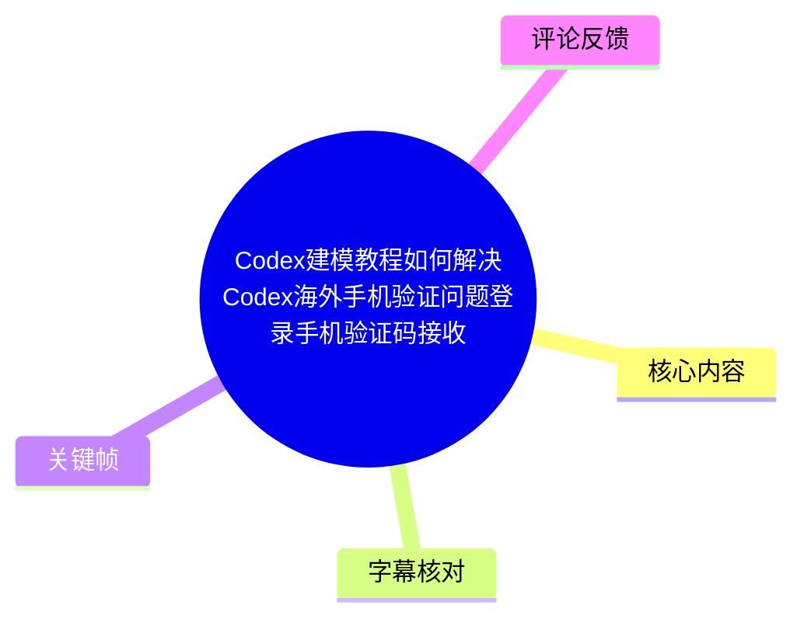
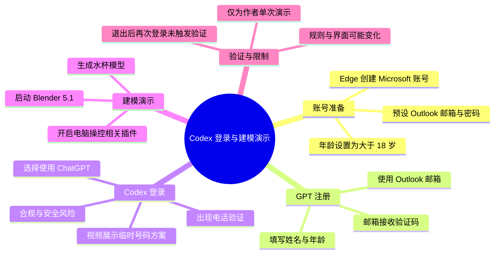
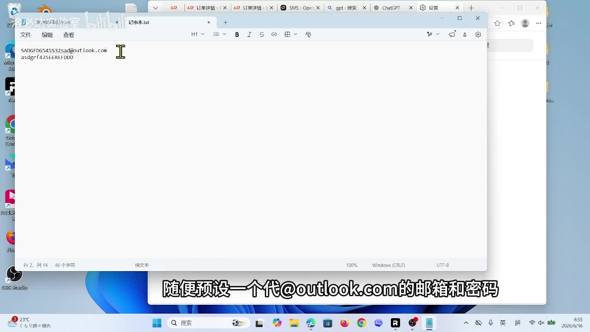
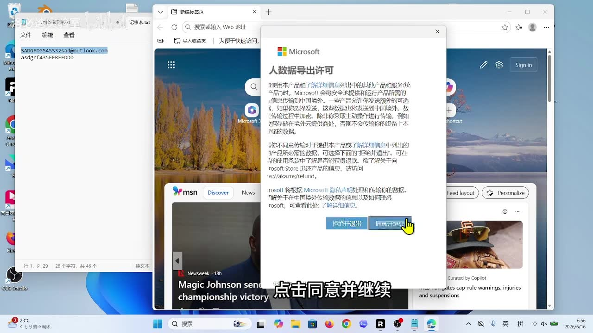
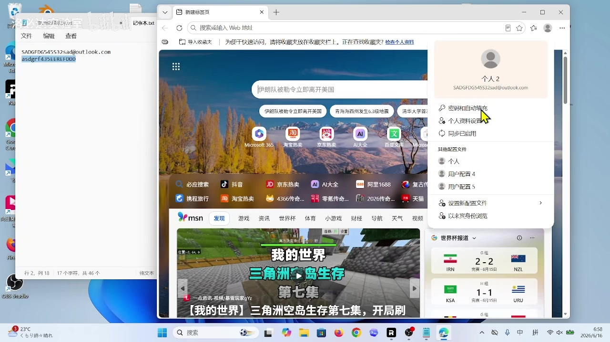

# Codex建模教程如何解决Codex海外手机验证问题登录手机验证码接收

> 来源：[Bilibili 视频](https://www.bilibili.com/video/BV1v9Mw6WEVR)  
> UP 主：洛必达实验室｜时长：7 分 16 秒｜分辨率：1280 × 720  
> 数据抓取时间：2026-07-13｜互动数据：播放 1,645、收藏 64、点赞 18、评论 5（均为抓取时快照）

## 小结

视频围绕两个连续目标展开：先注册一个 Outlook 邮箱，再以该邮箱注册 GPT 账号，并在 Codex 中选择“使用 ChatGPT”登录。后半段展示了 Codex 的电脑操控能力：打开相关插件后，让其启动 Blender 5.1 并生成一个喝水用水杯的模型。

视频的核心障碍是 Codex 登录页出现电话验证。作者声称日常号码无法通过，随后展示了购买临时海外号码、接收验证码的做法。这一部分属于规避服务电话验证与地区/风控限制的流程，可能违反平台条款、带来账户封禁、付款欺诈、隐私泄露及号码复用风险；本文仅记录其风险与结论，不保留可复现的购买、卡密、号码分配和验证码提交操作。

对希望使用 Codex 进行桌面建模的人而言，视频可提供一个有限的产品操作观察：Codex 可以通过“电脑操控”相关插件调用本机 Blender，作者以“建模一个喝水用的水杯”为例展示了结果确认界面。视频还声称，新账号登录后，本机原有项目记录没有被覆盖；这只是作者单台设备上的现象，不足以说明数据隔离、同步策略或隐私边界。

该教程的时效性较强。账号注册页、地区可用性、验证要求、Codex 的产品入口、插件名称与 Blender 兼容情况均可能随服务端更新变化。视频没有给出 GPT 官网的完整网址、接码服务的可靠性证明，也没有提供失败场景、退款机制或合规依据。

## 思维导图

## 目录

- [视频定位、前置条件与时效性](#视频定位前置条件与时效性)
- [准备 Outlook 邮箱](#准备-outlook-邮箱)
- [注册 GPT 并验证邮箱](#注册-gpt-并验证邮箱)
- [Codex 登录与电话验证风险](#codex-登录与电话验证风险)
- [Codex 操控 Blender 建模演示](#codex-操控-blender-建模演示)
- [退出重登与视频结论](#退出重登与视频结论)
- [参数、步骤与限制汇总](#参数步骤与限制汇总)
- [字幕比对](#字幕比对)
- [评论分析](#评论分析)
- [处理记录](#处理记录)

## 视频定位、前置条件与时效性 [00:00](https://www.bilibili.com/video/BV1v9Mw6WEVR?t=0)

作者开场称，评论区中有人询问如何注册 Codex 与 GPT 账号并完成电话验证，因此录制本教程。视频没有报道独立新闻事件，内容性质是一次 Windows 桌面端录屏经验分享。

视频涉及的应用与服务包括：

| 类别 | 视频中出现的对象 | 视频中的用途 |
| --- | --- | --- |
| 浏览器 | Microsoft Edge | 创建 Microsoft/Outlook 账号；作者要求设为默认浏览器。 |
| 邮箱 | Outlook | 接收 GPT 注册验证码。 |
| AI 账号 | GPT / ChatGPT | 作为 Codex 的登录身份。 |
| AI 编程/代理工具 | Codex | 登录后进行电脑操控与建模测试。 |
| 三维软件 | Blender 5.1 | 被 Codex 调用，用于生成水杯模型。 |
| 电话验证 | 临时号码与验证码接收网站 | 作者用以处理电话验证；该段不提供操作性复述。 |

前置条件方面，视频默认观众已经具备 Windows 桌面环境、网络访问能力、可创建邮箱账号的条件，以及能够进入 Codex 与 GPT 的网页入口。作者多次强调年龄需要大于 18 岁，但未解释这是否为全部地区、全部账号类型或全部时间段均适用的规则。

> **时效提醒：** 元数据显示视频发布时间为 2026-07-04（时区未标注）。注册资格、电话验证策略、国家/地区限制、付费方式、网页视觉布局及插件入口都属于服务端可变内容，应以服务官方当前页面、服务条款与当地法律为准。

## 准备 Outlook 邮箱 [00:14](https://www.bilibili.com/video/BV1v9Mw6WEVR?t=14)

作者先在记事本中预设一个 `@outlook.com` 邮箱地址和密码，随后在 Edge 中创建 Microsoft 账号。站内字幕称作者要求将 Edge 设为默认浏览器；视频没有说明“设为默认浏览器”与账号创建成功之间存在必然技术关系，因此这应理解为作者自己的操作环境要求，而非已验证的必要条件。

流程中可确认的页面动作包括：

1. 在 Edge 中进入 Microsoft 账号创建流程。
2. 点击“创建一个”。
3. 在 Microsoft 数据导出许可页面点击“同意并继续”。
4. 输入预先准备的 Outlook 邮箱地址与密码。
5. 选择地区。
6. 填写大于 18 岁的年龄信息。
7. 完成人机验证；作者描述为“长按通过验证”。
8. 作者展示账号已登录的页面。

> 图：画面展示作者在记事本中提前记录邮箱与密码，并在底部字幕中说明“随便预设一个代 @outlook.com 的邮箱和密码”。它解释了后续 Microsoft 账号注册所使用的凭据来源；截图中含有疑似演示性账号信息，实际操作不应在明文记事本中保存真实密码。

> 图：该关键帧显示 Microsoft 的数据导出许可弹窗以及“同意并继续”按钮，是账号创建流程中可见的确认步骤。它有助于区分“创建账号”与后续 Outlook 登录、GPT 注册三个不同阶段。

### 操作经验与安全边界

- 视频使用“预设邮箱 + 密码”的方式快速填写表单，但没有展示密码强度、恢复邮箱、双因素认证或账号恢复设置。
- 将密码明文放在记事本中仅适合作为录屏演示，不应作为实际账号管理方法。对真实账号，应使用独立且高强度的密码，并采用可信密码管理器。
- 视频要求年龄大于 18 岁，不应据此虚报年龄或绕开服务准入要求；应如实填写符合服务条款与当地法律的信息。
- 人机验证、地区选择和默认浏览器设置均可能因页面版本不同而发生变化。

## 注册 GPT 并验证邮箱 [01:24](https://www.bilibili.com/video/BV1v9Mw6WEVR?t=84)

在 Microsoft 账号创建完成后，作者在电脑上打开 Outlook，登录刚创建的账号。视频明确说明，这个邮箱将用于接收 GPT 注册验证码。

随后作者打开其称为“GPT 官网”的网页，并提醒“注意是这个网址”，但素材没有提供可可靠抄录的完整 URL，因此本文不补写或猜测网址。安全上应自行从服务官方渠道进入，不应依据视频、搜索广告或第三方页面中的相似域名输入凭据。

作者展示的 GPT 注册顺序为：

1. 打开 Outlook 并登录刚注册的邮箱。
2. 打开 GPT 注册页面，点击注册账号。
3. 粘贴刚注册的 Outlook 邮箱地址，点击继续。
4. 在 Outlook 收件箱查看验证码。
5. 复制验证码并粘贴回注册页。
6. 填写姓名；作者称姓名可自行填写。
7. 填写大于 18 岁的年龄。
8. 作者表示至此“离目标已经完成了一大半”。

> 图：该画面显示 Edge 右上角账户菜单中已出现登录身份，能作为作者完成 Microsoft 账号登录的视觉佐证。它不能证明 GPT 注册已成功，也不能证明该账号在其他地区或设备上同样可用。

### 关键信息

| 项目 | 视频陈述 | 可确认范围 |
| --- | --- | --- |
| 邮箱用途 | Outlook 用于接收 GPT 验证码。 | 这是视频展示的注册链路。 |
| 验证方式 | GPT 会向邮箱发送验证码。 | 仅代表录制时页面流程。 |
| 姓名填写 | 作者称“名字随便起一个”。 | 不应将其理解为可以提交虚假身份资料。 |
| 年龄要求 | 作者称年龄要大于 18 岁。 | 未展示官方规则文本与地区差异。 |
| 官网地址 | 作者口述“注意是这个网址”。 | 素材未给出可核验完整地址，不能补充。 |

## Codex 登录与电话验证风险 [02:24](https://www.bilibili.com/video/BV1v9Mw6WEVR?t=144)

作者打开 Codex，选择“使用 ChatGPT”，继续后选择刚刚登录 GPT 的邮箱。随后页面要求电话验证。作者声称其日常号码无法登录，并将这视为教程要解决的主要问题。

视频接下来展示了一套通过第三方临时海外号码接收短信验证码的方案，并提到一笔约 9 元的购买金额。该流程涉及购买第三方服务、输入卡密、分配临时号码、等待并复制验证码、再提交至 Codex 的操作。

> **安全与合规说明：** 临时号码代收验证码、利用非本人或短期号码通过账户风控，可能规避服务的验证、地域或反滥用机制。本文不提供该方案的第三方站点、购买入口、卡密处理、号码分配、验证码刷新或提交步骤，也不建议将其用于创建或访问账号。应使用服务官方支持的地区、本人可控制且符合要求的电话号码，或通过官方支持渠道解决验证问题。

### 此段可迁移的非规避性结论

1. **电话验证是独立风险点。** 邮箱验证成功并不意味着 Codex 登录一定完成；视频显示电话验证可能在 Codex 登录阶段再次出现。
2. **第三方接码存在高风险。** 临时号码可能已被滥用、与他人共享或被平台识别；验证码、账号、付款信息可能暴露给第三方。
3. **一次通过不代表长期可用。** 即使作者录制时进入了产品，也不能推导出账号后续不会触发重新验证、限制、审查或封禁。
4. **应优先选择官方路径。** 使用真实、受自己控制的联系方式；检查账户地区资格、账单资料与支持文档；遇到异常验证时咨询官方支持。

## Codex 操控 Blender 建模演示 [04:43](https://www.bilibili.com/video/BV1v9Mw6WEVR?t=283)

通过登录后，作者先以输入“你好”测试功能。随后他提到：虽然本次登录的是新账号，但电脑中此前已有的旧项目仍显示存在，且没有被覆盖。该结论仅反映作者当前机器上的本地状态；视频没有区分这些项目究竟存储在本地、云端缓存、工作区目录还是账号同步空间中。

接着，作者进入设置中的“电脑操控”，打开两个相关插件，以允许 Codex 操控电脑。由于站内字幕与 ASR 都只说“打开这两个插件”，未给出两个插件的精确名称，本文不对其名称、权限范围或安装方式作猜测。

建模演示的顺序如下：

1. 进入 Codex 设置中的“电脑操控”区域。
2. 打开视频中所示的两个插件。
3. 让 Codex 打开 Blender 5.1。
4. 向 Codex 输入自然语言任务：创建一个用于喝水的水杯模型。
5. 等待模型生成。
6. 在授权/确认提示出现后，作者点击“是”。
7. 作者展示生成后的建模结果。

### 技术观察

| 观察点 | 视频展示内容 | 不能据此确认的内容 |
| --- | --- | --- |
| 本机应用调用 | 作者称 Codex 打开了 Blender 5.1。 | 是否适用于其他 Blender 版本、其他操作系统或所有 Codex 账户。 |
| 插件权限 | 作者开启两个“电脑操控”插件。 | 插件具体名称、供应方、权限粒度、数据上传范围。 |
| 指令形式 | 使用自然语言提出“建模一个喝水用的水杯”。 | 模型的拓扑质量、尺寸、材质、可编辑性与生产可用性。 |
| 人工确认 | 出现提示后点击“是”。 | 提示的完整内容、是否会执行额外文件/系统操作。 |
| 历史项目 | 新账号下仍可看到旧项目。 | 项目归属、同步机制与隐私隔离情况。 |

> **权限建议：** 启用电脑操控类能力前，应确认插件来源、所需权限、可访问文件范围和可执行操作。避免在包含私钥、密码、客户资料或重要工程文件的环境中直接授权自动化代理进行广泛控制。

## 退出重登与视频结论 [06:34](https://www.bilibili.com/video/BV1v9Mw6WEVR?t=394)

最后，作者退出账号后再次登录，并称第二次登录时没有再弹出电话验证。该现象可能与浏览器 Cookie、设备信任状态、会话缓存、风险策略或验证有效期有关，但视频没有提供足以判定原因的证据。

因此，合理的表述应是：**作者在其录制环境中完成一次退出并重新登录后，没有再次看到电话验证弹窗。** 不能据此推出电话验证已永久解除，也不能保证其他用户、设备、网络、账号或地区会得到相同结果。

作者以“合格的 YES 工程师”作结，并呼吁点赞、关注，表示会继续发布教程。视频未展示最终模型文件的保存位置、导出格式、模型参数、可复现脚本或完整失败排查流程。

## 参数、步骤与限制汇总 [00:00](https://www.bilibili.com/video/BV1v9Mw6WEVR?t=0)

### 视频明确出现的参数与名称

| 项目 | 值或描述 | 来源与备注 |
| --- | --- | --- |
| 视频时长 | 436 秒 / 7 分 16 秒 | 元数据。 |
| 画面尺寸 | 1280 × 720 | 元数据。 |
| 邮箱域名 | `@outlook.com` | 视频口述及画面。 |
| 浏览器 | Microsoft Edge | 视频口述。 |
| 年龄条件 | 大于 18 岁 | 作者口述，未展示官方条款。 |
| 建模软件 | Blender 5.1 | 作者口述。 |
| 测试任务 | 建模一个喝水用的水杯 | 作者口述。 |
| 临时号码服务价格 | 作者称约 9 元 | 仅为视频陈述；不构成价格、可用性或安全性保证。 |
| 电话验证后表现 | 第二次登录未弹窗 | 仅为作者单次环境观察。 |

### 可安全遵循的账号与产品使用步骤

1. 使用本人合法、可长期控制的邮箱注册服务。
2. 从服务官方渠道进入账号注册和登录页面。
3. 使用强密码并开启服务提供的安全保护措施。
4. 按服务条款如实填写年龄、地区及其他资料。
5. 如需电话验证，使用本人有权使用且符合官方地区要求的号码。
6. 需要桌面操控时，先审查插件来源与权限，再在隔离环境中测试。
7. 对 AI 生成的 Blender 模型进行人工检查，包括网格结构、尺寸、法线、非流形面、材质与导出兼容性。
8. 遇到账号验证异常、地区限制或登录失败时，优先查阅官方支持文档或联系官方支持。

### 视频未覆盖或未验证的事项

- GPT 与 Codex 的确切官方访问地址；
- 两个“电脑操控”插件的准确名称、版本与权限说明；
- 临时号码服务的运营主体、隐私政策、退款规则及合法性；
- 账号是否符合各服务条款、地区规则与反滥用政策；
- 水杯模型的具体几何质量、面数、尺寸、保存路径及文件格式；
- 其他国家/地区、手机号码运营商、网络环境下的成功率；
- 电话验证再次出现时的官方解决路径。

## 字幕比对 [00:00](https://www.bilibili.com/video/BV1v9Mw6WEVR?t=0)

本次任务同时提供了 Bilibili 站内字幕和本次 ASR 字幕；**本次 ASR 已执行**。两份字幕均没有逐句时间戳，因此正文时间轴依据视频总时长、内容顺序和关键帧位置进行近似定位。

| 字幕来源 | 完整性 | 专有名词 | 时间轴 | 主要问题 |
| --- | --- | --- | --- | --- |
| Bilibili 站内字幕 | 较完整，覆盖邮箱注册、GPT 注册、Codex 登录、建模及重登结尾。 | 整体较好，能识别 Codex、Outlook、Edge、ChatGPT、Blender 5.1。 | 未提供逐句时间码。 | 个别口语/转写不稳定，如“gt”“GFDGR 登录这里”；电话验证第三方网站未给出可核验名称。 |
| 本次 ASR 字幕 | 较完整，顺序与站内字幕基本一致。 | 较弱，存在中英混写与误识别。 | 未提供逐句时间码。 | 将 `@outlook.com` 识别为“atoutlouk.com”，将“邮箱”误作“游戏”，出现无关文本“中文字幕组”，并把“接码/校验/分配”等词识别为“接马/教验/分开”。 |

### 最终字幕选择与校正原则

正文以 **Bilibili 站内字幕为主**，使用 ASR 作为完整性复核。原因是站内字幕在产品名称、操作次序和中文语义上明显更稳定。

已依据两份字幕的上下文及关键帧进行以下校正或保留策略：

- 将 ASR 的“atoutlouk.com”校正为视频明确表达的 `@outlook.com`。
- 将 ASR 的“游戏”校正为“邮箱”。
- 将 ASR 中无上下文关联的“中文字幕组”视为误识别，不纳入正文事实。
- 对“GPT”“ChatGPT”“Codex”“Outlook”“Edge”“Blender 5.1”采用站内字幕中更一致的写法。
- 对站内字幕中的“GFDGR 登录这里”不作术语解释，因为素材不足以确定其含义。
- 对电话验证第三方方案，虽然字幕可辨识其大致操作，但基于安全与合规原因不输出可执行细节。

## 评论分析 [00:00](https://www.bilibili.com/video/BV1v9Mw6WEVR?t=0)

仅处理可获取的热评前三条。三条评论点赞数均为 0，且评论内容均属于个人表达，不应作为产品可用性、接码成功率或账号合规性的证据。

1. **有丰富的**：`@机器工具人 音乐识别`  
   - 观点：像是对“音乐识别”功能或账号的召唤/提及，没有对教程步骤、Codex 或电话验证方案作出实质评价。  
   - 补充信息：无。  
   - 可信度与争议：无法据此推断视频背景音乐、工具能力或教程有效性。

2. **洛必达实验室**：`这个视频做得很用心，复杂的内容被拆解得很好理解。看得出作者准备得非常充分！`  
   - 观点：正面评价视频的拆解程度与准备度。  
   - 补充信息：评论者用户名与 UP 主一致，属于作者或同名账号的自我评价/关联评价可能性较高。  
   - 可信度与争议：没有提供可核验的技术细节，不能将其视为第三方独立背书。

3. **吾婧0922**：`我有实体卡接码的不太行`  
   - 观点：评论者称即使拥有实体卡，接收验证码的效果也“不太行”。  
   - 补充信息：这间接提示电话验证可能受号码信誉、地区、运营商、平台风控或账号状态等多因素影响。  
   - 可信度与争议：评论未说明服务、地区、号码归属、错误提示或测试时间，无法验证原因；但它与视频中“验证并非稳定可复现”的风险判断相符。

## 评论分析

本次流程未获取到可用热评，因此不推断观众态度或额外结论。

## 处理记录

- **Worker ID**：`worker-mrj0wjed-b0c290ad`
- **模型**：`gpt-5.6-terra`
- **调用工具与素材**：基于任务提供的 Bilibili 元数据、视频素材清单、站内字幕、已执行的本次 ASR 字幕、热评 JSON 与关键帧路径进行整理；未对未提供的网页地址、第三方服务信息或账号状态进行外部推断。
- **字幕选择**：站内字幕为主，本次 ASR 为交叉核对；原因是站内字幕对 Outlook、Codex、ChatGPT、Blender 5.1 等专有名词及步骤语义更准确。本次 ASR 已执行，但存在“atoutlouk”“游戏”“中文字幕组”“接马”等明显误识别。
- **关键帧选择依据**：选用 `frames/frame-001.jpg` 说明预设 Outlook 凭据的准备环节，`frames/frame-002.jpg` 说明 Microsoft 页面确认步骤，`frames/frame-004.jpg` 说明 Edge 中账号登录状态；这些画面均直接对应正文中的非规避性账号准备内容。未选用或复述电话验证环节的可操作画面，以避免传播绕过验证的操作路径。
- **关键帧隐私处理说明**：关键帧中可见疑似演示用邮箱/密码文本。正文不转录、扩散或验证其中任何具体凭据；实际使用中不应以明文方式保存真实密码。
- **缓存清理**：素材清单仅表明任务产物已生成，未提供缓存清理执行日志；因此无法确认或声明缓存已清理。
- **未解决问题**：无法从现有素材确认 GPT/Codex 官方页面完整 URL、电脑操控插件名称及权限、第三方接码服务身份与可靠性、电话验证失败原因，以及生成水杯模型的可编辑性和导出质量。
