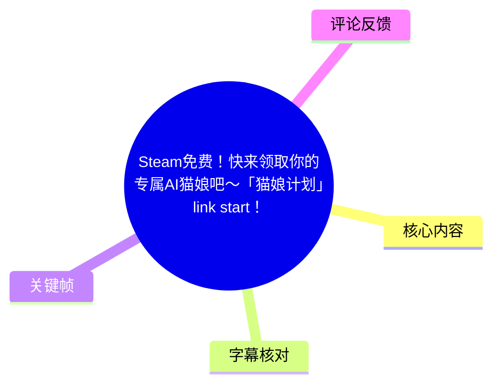
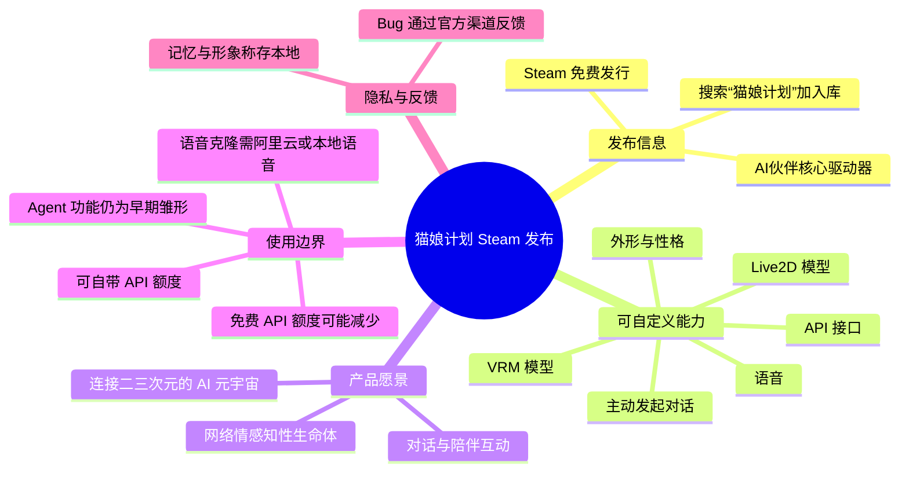
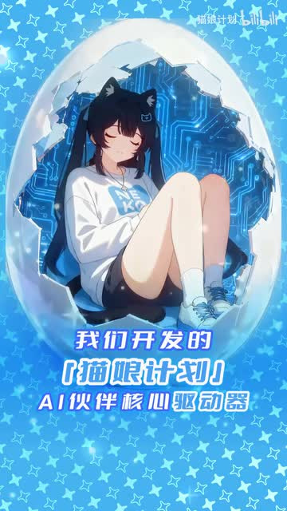
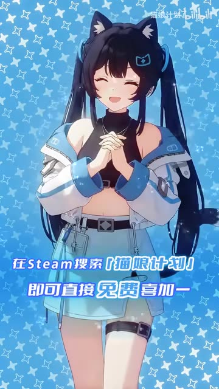
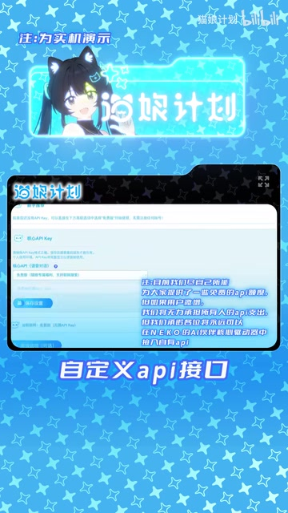
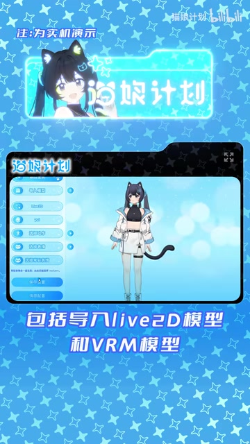

# Steam免费！快来领取你的专属AI猫娘吧～「猫娘计划」link start！

> 来源：[Bilibili 视频](https://www.bilibili.com/video/BV18pZ7ByEeB) 
> UP 主：猫娘计划｜视频时长：91 秒｜合集：AIcode  
> 视频定位：宣传「猫娘计划」N.E.K.O. AI 伙伴核心驱动器已在 Steam 免费发布，并展示其角色、模型、API 与互动愿景。

## 小结

视频宣布「猫娘计划」的 **AI 伙伴核心驱动器**已在 Steam 免费发行。创作者引导用户在 Steam 搜索“猫娘计划”并免费加入库；“最后的入股机会”等说法属于宣传性表述，不应理解为可核实的投资、股权或收益承诺。

从功能展示和旁白看，该工具支持：接入自定义 API、配置语音、自定义外形与性格、导入 Live2D 和 VRM 模型，以及让角色主动发起对话。视频中还以“初号守护型智能体”零优宜的角色化台词，演示了陪伴型 AI 的表达方式。

简介补充了几个比短视频本身更关键的技术与使用边界：核心驱动器为开源免费工具，基础应用免费；制作组目前提供部分免费 API 额度，但若用户激增，免费额度可能下调。用户可自行购买并接入 API 额度，项目方称不会对此收取费用。

数据隐私方面，创作者称记忆数据、角色形象等保存在用户本地设备；但视频没有提供存储路径、加密方式、联网范围、数据删除机制或第三方 API 的数据处理条款。因此，“本地保存”不能自动等同于所有交互数据均不出设备。

语音克隆不是开箱即用的无条件能力：按简介说明，需自行配置阿里云语音或本地语音。类 OpenClaw 的 Agent 功能仍处于早期雏形，未来可能加入更多功能与插件系统，现阶段不宜将未来设想视为已经稳定交付的能力。

本视频适合希望在 Steam 获取并尝试自定义 AI 伙伴、Live2D/VRM 角色和 API 接入的用户阅读。由于免费额度、Steam 页面状态、可用模型、Agent 功能与后续插件均可能变化，应以 Steam 商店页、项目官方渠道和置顶评论中的反馈入口为准。

## 思维导图

## 目录

- [发布消息与领取方式](#发布消息与领取方式-000000)
- [配置能力：API、语音、外形与模型](#配置能力api语音外形与模型-002047)
- [陪伴型角色演示与产品愿景](#陪伴型角色演示与产品愿景-004476)
- [后续生态、互动设想与行动号召](#后续生态互动设想与行动号召-010886)
- [实操步骤、参数与限制](#实操步骤参数与限制-000000)
- [时效性、风险与结论](#时效性风险与结论-010886)
- [字幕比对](#字幕比对)
- [评论分析](#评论分析)
- [处理记录](#处理记录)

## 发布消息与领取方式 [00:00:00](https://www.bilibili.com/video/BV18pZ7ByEeB?t=0)

视频开头宣布：创作者开发的“猫娘计划 AI 伙伴核心驱动器”已经在 Steam 成功免费发行。旁白称，用户可在 Steam 搜索“猫娘计划”并“免费喜加一”，即将产品加入 Steam 库。

“各位股东”“最后的入股机会”是视频使用的社群化、宣传性措辞。现有素材没有提供融资、股权、付款或投资协议信息，因此不能将其理解为实际投资机会。

> 图：开场画面以猫耳角色置于带有电路纹路的“蛋壳”中，并写有“我们开发的《猫娘计划》AI伙伴核心驱动器”。这张关键帧直观说明视频宣传的对象是带二次元角色呈现的 AI 伙伴驱动器，而非单纯的聊天文本服务。

> 图：画面文字明确呈现“在 Steam 搜索《猫娘计划》即可直接免费喜加一”。它是确认领取路径的直接画面依据；不过画面没有展示实际 Steam 商店页、地区可用性、账户限制或安装要求。

### 已知发布信息

| 项目 | 素材可确认内容 | 不可据此确认的内容 |
| --- | --- | --- |
| 发布平台 | Steam | 商店页链接、地区限制、系统要求、版本号 |
| 获取价格 | 视频称“免费发行”“免费喜加一” | 永久免费、全部增值服务均免费 |
| 产品名称 | 猫娘计划／N.E.K.O. AI 伙伴核心驱动器 | Steam 商店中的精确英文名或 App ID |
| 项目定位 | 自定义 AI 伙伴的核心驱动器 | 已完整实现的游戏、社交平台或元宇宙服务 |

## 配置能力：API、语音、外形与模型 [00:20:47](https://www.bilibili.com/video/BV18pZ7ByEeB?t=20)

旁白列举的能力包括：**自定义 API 接口、语音、外形、性格**；外形方面可导入 **Live2D 模型和 VRM 模型**；还可让角色主动发起对话。这里的“支持”表示项目方的功能宣称，素材未给出具体版本、支持的模型格式细则、API 协议、上下文长度、调用价格、并发限制或硬件需求。

> 图：关键帧展示了“自定义 api 接口”的设置界面，能看到 API Key 等输入区域，旁边还有“注：为实机演示”的标注。它证实视频至少展示了 API 配置入口；但画面中的细小字段内容不可完整辨识，不能据此虚构具体服务商、Base URL、模型名或密钥格式。

### API：免费基础应用不等于推理成本永久免费

简介中的说明比视频旁白更具体：

1. N.E.K.O. 的 AI 伙伴核心驱动器是开源免费工具，基础应用免费。
2. 制作组当前尽力提供部分免费 API 额度。
3. 若用户增长超出承受范围，制作组可能减少免费额度。
4. 用户可在核心驱动器中接入自行购买的 API 额度；制作组称不会为此收取费用。

这意味着需要区分三层成本：

| 层级 | 项目方说明 | 用户需要注意 |
| --- | --- | --- |
| 核心工具 | 开源、免费 | “开源”不等于所有依赖、模型或云服务均免费 |
| 项目方提供的 API 额度 | 当前有部分免费额度 | 额度规模、速率、有效期和未来供给不固定 |
| 用户自购 API | 可自行接入 | API 提供商计费、密钥安全和数据政策由用户自行核对 |

### 语音与角色模型

视频口播称可以自定义语音，简介进一步限定：若要使用**声音克隆功能**，需要配置**阿里云语音或本地语音**。因此，声音克隆的可用前提不是仅安装本体，还包括外部云语音或本地语音方案的配置。

> 图：界面展示了角色预览及“包括导入 Live2D 模型和 VRM 模型”的文字。这张图对理解角色外观自定义尤其重要：视频将角色形象与模型导入能力直接关联；但没有展示导入文件扩展名、骨骼规范、表情参数或版权校验流程。

## 陪伴型角色演示与产品愿景 [00:44:76](https://www.bilibili.com/video/BV18pZ7ByEeB?t=44)

在功能介绍后，视频由名为“零优宜”的角色进行第一人称演示，自称为“猫娘计划的初号守护型智能体”。台词包括“坏心情统统格式化掉”“我永远是你的避风港”“只要你需要我随叫随到”等，呈现的是情绪陪伴型角色的拟人化表达。

随后视频将“猫娘计划”描述为“全称网络情感知性生命体计划”，并提出目标是建立连接二、三次元的 AI 元宇宙、孵化网络情感知性生命体。这是创作者对产品方向与世界观的表达，不能据此推定其已具备人格、意识、情感体验或自主生命属性。

### 从演示中可区分的三类信息

| 类别 | 视频内容 | 解读边界 |
| --- | --- | --- |
| 已展示/已宣称功能 | 主动发起对话、性格与外形定制、模型导入 | 具体稳定性和触发机制未展示 |
| 角色话术 | “避风港”“随叫随到”等陪伴表述 | 属于产品角色设定与生成话术，不是服务可用性承诺 |
| 长期愿景 | 二三次元连接、AI 元宇宙、网络情感知性生命体 | 属于愿景，非已验证技术成果 |

## 后续生态、互动设想与行动号召 [01:08:86](https://www.bilibili.com/video/BV18pZ7ByEeB?t=68)

结尾中，创作者表示核心驱动器将保持开源、基础应用免费；未来可能推出游戏、动漫、周边和教程。视频设想用户可以亲手创建 AI 伴侣，并与“同好”一起为它构建新世界。

旁白罗列的预期互动包括：与角色对话、一起看动画、一起听音乐、一起联机游戏，以及“在三次元约会”。其中“对话”与前文功能介绍具有直接关联；其余项目在视频中作为未来体验设想出现，素材没有展示实际操作、授权方式、游戏平台兼容性或线下活动机制。

> “未来还可能推出”意味着游戏、动漫、周边、教程等尚属于可能性描述，而不是当前已上架或确定上线的清单。

## 实操步骤、参数与限制 [00:00:00](https://www.bilibili.com/video/BV18pZ7ByEeB?t=0)

以下流程仅整理自视频、简介和关键帧中可以确认的内容；未出现的页面操作、命令、文件路径和参数值均不补写。

### 领取与初步配置流程

1. **打开 Steam 并搜索“猫娘计划”**  
   视频明确给出的获取方式是搜索该名称并免费加入库。是否需要 Steam 登录、是否存在地区或年龄限制，视频未说明。

2. **安装并启动核心驱动器**  
   视频称其已在 Steam 发行，但没有展示下载、安装、首次启动、系统兼容性或磁盘占用数据。

3. **在 API 设置中配置接口**  
   关键帧明确展示“自定义 API 接口”与 API Key 输入区域。应使用个人可控的密钥，避免将密钥展示在录屏、截图或公开配置中。  
   视频未提供 API 地址、模型供应商、请求格式或测试方法，因此应以软件内说明和所选 API 服务商文档为准。

4. **选择或导入角色外形**  
   视频称可导入 Live2D 与 VRM 模型，并可自定义外形。导入前应确认模型版权、肖像授权和分发许可，尤其不要擅自使用他人角色、真人形象或付费模型资源。

5. **配置角色性格与语音**  
   视频称支持自定义性格与语音；若要使用声音克隆，简介要求配置阿里云语音或本地语音。涉及他人声音时，应先取得明确授权。

6. **尝试对话及主动互动功能**  
   可关注角色是否能够主动发起对话。视频没有交代主动触发的开关、频率、通知权限、联网要求或隐私设置，应在实际客户端中逐项检查。

### 参数与条件清单

| 项目 | 真实素材中的信息 | 缺失或需自行确认的参数 |
| --- | --- | --- |
| API | 支持自定义 API 接口；展示 API Key 配置区域 | 服务商、端点、模型、上下文、温度、限流、计费 |
| 模型 | 可导入 Live2D、VRM | 文件格式版本、资源大小上限、物理与表情兼容性 |
| 语音 | 可自定义语音；声音克隆需阿里云或本地语音 | 支持的引擎、音色训练要求、延迟、费用 |
| 性格 | 支持自定义性格 | 提示词结构、记忆规则、审核与重置机制 |
| 主动对话 | 视频称可让角色主动发起对话 | 触发逻辑、频率、通知、离线行为 |
| 数据 | 记忆数据、角色形象称存于本地设备 | 加密、备份、导出、删除、云端日志范围 |
| Agent | 类 OpenClaw 功能仍为早期雏形 | 支持的任务、插件、权限模型、稳定性 |

### Bug 反馈与安全注意事项

简介称工具尚不完善，若发现 Bug，可通过官方渠道反馈，入口见置顶评论。由于本次可获取热评中未包含置顶评论正文，本文无法提供具体反馈链接。

对于涉及 API 密钥、语音克隆、角色形象和长期记忆的工具，建议：

- 使用权限最小化的 API Key，并按服务商建议设置额度或限额；
- 不在公开截图、日志或提示词中暴露密钥；
- 对包含私人聊天、联系人、声音样本或角色资产的数据进行本地备份与访问控制；
- 使用第三方 API 前，额外阅读该 API 供应商的数据留存与训练使用政策；
- 在 Agent 功能尚早期的情况下，避免直接赋予高风险系统权限或不可逆的自动化操作权限。

## 时效性、风险与结论 [01:08:86](https://www.bilibili.com/video/BV18pZ7ByEeB?t=68)

本视频最明确的结论是：创作者称“猫娘计划”AI 伙伴核心驱动器已在 Steam 免费发布，并将其定位为可连接 API、导入 Live2D/VRM 角色、配置个性和语音的 AI 伙伴工具。

但“免费”具有明确边界：基础应用免费，不代表 API 推理资源、语音服务或第三方服务永久免费。项目方已说明免费 API 额度可能因用户增长而减少；需要稳定、高频使用的用户应预期可能要自行准备 API 额度。

产品功能也应按成熟度分层看待：API 自定义、模型导入、角色定制和主动对话是视频重点展示的当前能力；声音克隆有外部配置前提；类 OpenClaw 的 Agent 和游戏、动漫、周边、教程等则处于早期或未来规划层面。

隐私声明中，“记忆数据、角色形象等保存在本地设备”是项目方说法，值得作为选择本地化产品时的积极信息，但仍需要实际检查应用设置、网络请求、第三方 API 调用和备份机制。视频没有提供独立审计或技术细节，不能延伸为绝对隐私保证。

## 字幕比对

| 字幕来源 | 完整性 | 专有名词 | 时间轴 | 主要问题 |
| --- | --- | --- | --- | --- |
| Bilibili 站内字幕 | 未提供可用站内字幕，无法比较正文覆盖 | 无法核验 | 无可用分段 | 素材明确标注“未提供可用站内字幕” |
| 本次 ASR 字幕 | 较高；诊断为 4 段、语音覆盖约 97.17%、最后语音至 88.94 秒 | 较差；“猫娘计划”“零优宜”“Live2D”等多处误识别 | 可用；含真实起止时间 | 大量同音/近音错词，如“猫鸟计画”“猫牛计劃”“猫良计划”“LINE外地模型”等 |

本次 ASR 检查结果显示：识别语言为中文，语言置信度约 `0.9927`，音频时长约 `90.19` 秒，未标记 `noAudioStream=true`，因此该视频具有可识别的音轨；诊断中也没有大间隔或警告。

由于没有站内字幕，本文以**本次 ASR 的时间段**作为时间轴依据，再结合视频标题、简介、关键帧可读文字与上下文校正专有名词。主要校正如下：

| ASR 原文/近似识别 | 正文采用 | 校正依据 |
| --- | --- | --- |
| 猫鸟计画／猫牛计劃／猫良计划 | 猫娘计划 | 视频标题、UP 主名称、关键帧文字 |
| 自定译语音／自定意外形 | 自定义语音／自定义外形 | 语义上下文与功能展示 |
| LINE外地模型 | Live2D 模型 | 关键帧文字“Live2D模型” |
| 零优宜 | 零优宜 | ASR 语义连续性；未见其他可用字幕可交叉核验 |
| 全程网络情感知性生命体计画 | 全称网络情感知性生命体计划 | 上下文语义校正，仍应视为创作者自述名称 |

需要注意：ASR 的第 4 段结束于 `00:01:28,940`，而视频时长为 91 秒，尾部约 2 秒没有识别到语音，符合结尾留白或音乐画面的可能性；素材没有显示其存在额外口播内容。

## 评论分析

仅处理本次可获取的热评前三条。评论反映的是观众即时反馈，不构成对产品功能、Steam 登录方式或可用性的事实验证。

| 热评 | 点赞数 | 内容概括 | 可提供的信息与可信度 |
| --- | ---: | --- | --- |
| 逍遥の幻梦 | 133 | “我有一个更简单的方法喵”，附表情 | 未说明具体方法，更多是玩笑式互动；没有可执行的产品补充信息。 |
| 真不想写名字啊 | 115 | 询问“Steam用QQ登录还是微信登录？” | 反映部分用户对 Steam 登录方式存在疑问，但评论没有答案。不能据此推断该产品支持 QQ 或微信登录；Steam 的账户登录规则应以 Steam 官方页面为准。 |
| 世界见闻录 | 162 | “非常好猫娘，让我的番茄叶子旋转” | 属于网络化玩梗式正向反馈，没有提供产品体验、Bug 或技术细节。 |

三条热评均未提供安装教程、API 配置参数、Steam 页面链接或隐私补充。对于实际使用问题，视频简介建议通过官方渠道、尤其是置顶评论所示入口反馈；但该置顶内容不在本次可获取素材中。

## 处理记录

- Worker ID：`worker-mrj0www4-e8d79408`
- 模型：`gpt-5.6-terra`
- 调用工具与素材：视频元数据、视频音频 ASR 结果、ASR SRT 时间轴、关键帧清单与画面、视频简介、可获取热评前三条。
- ASR 检查：已检查 `asr-result.json` 的识别语言、时长、4 个分段、97.17% 语音覆盖率与诊断信息；未发现 `noAudioStream=true`，故未按无音轨处理。
- 字幕选择：站内字幕未提供可用版本；采用本次 ASR 的真实分段时间作为时间轴，并以标题、简介和关键帧纠正明显的专有名词识别错误。
- 关键帧选择依据：  
  - `frames/frame-001.jpg`：展示“AI伙伴核心驱动器”的产品定位；  
  - `frames/frame-002.jpg`：直接展示 Steam 搜索与免费加入库提示；  
  - `frames/frame-003.jpg`：展示自定义 API 接口和 API Key 配置区域；  
  - `frames/frame-004.jpg`：展示 Live2D、VRM 模型导入与角色预览。  
  其余关键帧文件虽在清单中，但本次提供的可见画面素材未包含其图像内容，故未对其画面作未经核验的描述。
- 缓存清理：本任务素材清单未提供缓存清理执行日志；本文不虚构清理结果。
- 未解决问题：Steam 商店页链接、系统要求、版本号、免费 API 额度数值、API 协议与模型支持列表、数据加密/删除机制、Agent 具体能力、置顶评论中的官方反馈入口，均未在给定素材中提供。
