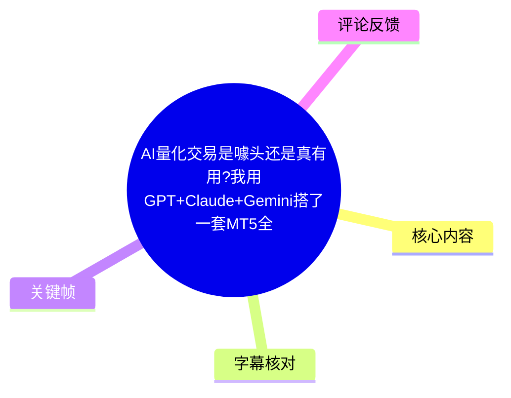
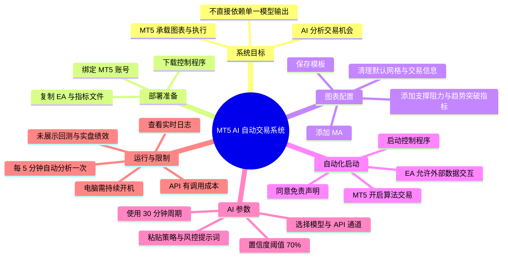
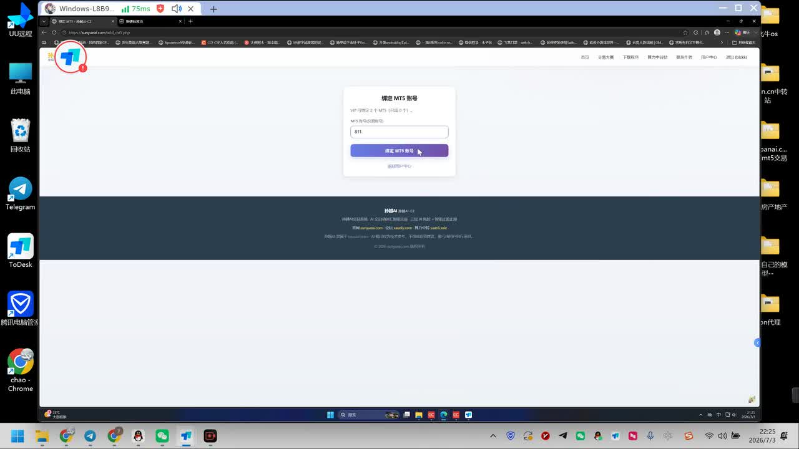
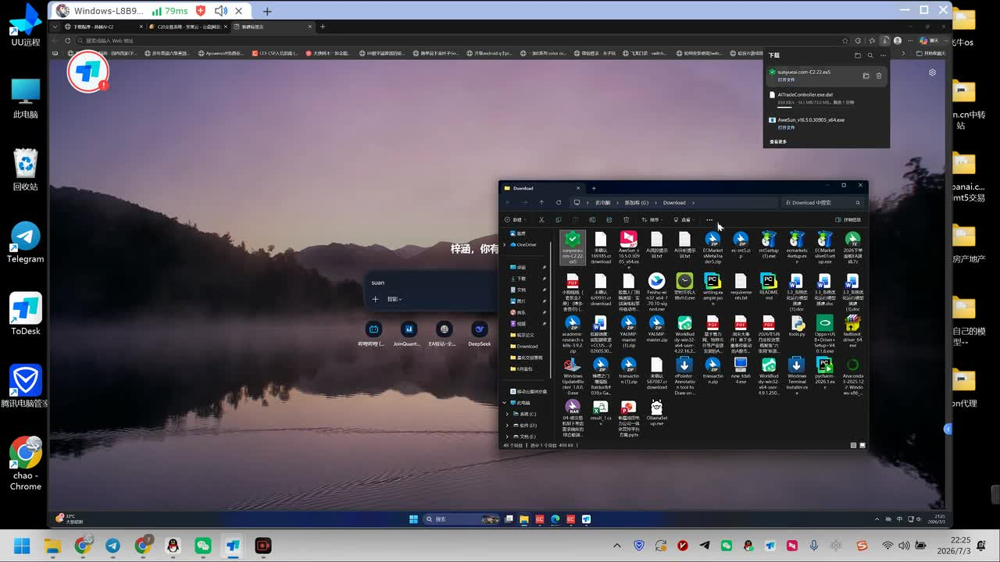
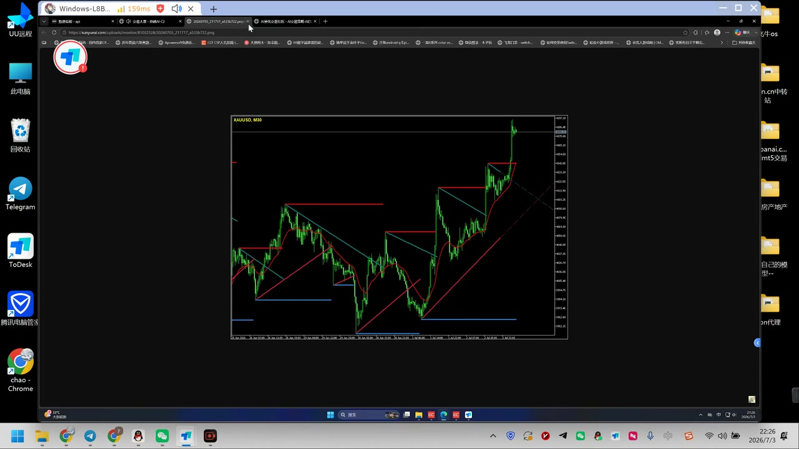

# AI量化交易是噱头还是真有用？我用 GPT+Claude+Gemini 搭了一套 MT5 全自动 AI 交易系统，核心思路就一句话：不让任何一个 AI 单独说了算

## 小结

视频是一段以 MT5（MetaTrader 5）为执行端的 AI 自动交易系统部署演示。UP 主展示了从绑定 MT5 账号、下载并放置 EA/指标文件、建立图表模板，到启动控制程序、填入模型 API、查看 AI 分析日志的一整套操作链路。

视频中可确认的核心机制是：MT5 图表负责承载行情与技术指标，EA 与外部控制程序负责交互，AI 模型根据图表和提示词给出交易分析；系统再依据置信度等规则决定是否放行交易。UP 主举例称，模型即使给出买入方向，若置信度低于设定的 `70%`，系统仍建议观望。该设置体现的不是“让模型直接下单”，而是给 AI 输出加一道阈值过滤。

部署重点有两个：其一，先建立并保存**不含 EA 的图表模板**，再加载 EA；其二，系统运行期间电脑需要持续开机，且模型 API Key、模型通道、交易品种/周期、离场规则均需正确配置。视频示例使用 `30 分钟`周期，图中可见品种标注为 `XAUUSD, M30`。

标题声称系统涉及 GPT、Claude、Gemini 并强调“多个 AI 协作、不让单个 AI 决策”，但本次可用 ASR 主要明确提到了类似“Claude 4.8”的模型名称、AI 交易/风控提示词和置信度阈值；未能从字幕材料中完整核验 GPT、Gemini 的具体接入方式、投票机制、模型权重、回测结果或实盘收益。因此，这些内容只能视为标题和 UP 主系统定位，不能据此推导系统已经具备稳定盈利能力。

适合读者：已有 MT5 基础、理解 EA/指标/模板概念，并希望了解“LLM 分析 + MT5 自动执行”部署流程的人。视频不提供可复现的完整代码、策略统计或风险披露，实际使用前仍应先在模拟账户和历史数据中验证。

## 思维导图





## 目录

- [视频信息与时效说明](#视频信息与时效说明)
- [绑定账号、下载文件与安装位置](#绑定账号下载文件与安装位置)
- [策略参考、图表与模板配置](#策略参考图表与模板配置)
- [启动 MT5 EA 与外部控制程序](#启动-mt5-ea-与外部控制程序)
- [模型、提示词与运行参数](#模型提示词与运行参数)
- [AI 分析日志、置信度与交易过滤](#ai-分析日志置信度与交易过滤)
- [完整操作步骤清单](#完整操作步骤清单)
- [关键参数、技术关系与限制](#关键参数技术关系与限制)
- [结论与风险提示](#结论与风险提示)
- [字幕比对](#字幕比对)
- [评论分析](#评论分析)
- [处理记录](#处理记录)

## 视频信息与时效说明

- 来源：[Bilibili：BV1i4Tf65Etc](https://www.bilibili.com/video/BV1i4Tf65Etc)
- UP 主：Ai量化交易程序员
- 合集：AIcode
- 时长：13 分 15 秒（795 秒）
- 视频画面分辨率：2560 × 1440
- 标签：`Ai交易`、`交易系统`、`ai量化`
- 元数据抓取时间：2026-07-13
- 元数据中的发布时间戳：`1783130999`；未提供平台已格式化的发布时间字段，本文不额外推断展示时区。

本视频属于软件部署与交易策略配置演示，具有明显时效性：模型名称、API 计费、模型广场通道、网站页面、MT5 文件目录、EA 权限选项及平台功能均可能在视频发布后变化。视频中提到的成本与模型可用性，仅代表录制时的口述信息，不能作为当前报价或服务承诺。

---

## 绑定账号、下载文件与安装位置

### [00:00](https://www.bilibili.com/video/BV1i4Tf65Etc?t=0) 绑定 MT5 与下载系统文件

视频开头演示网页端的 MT5 账号绑定页面。ASR 可识别到 UP 主输入或确认了一个 MT5 账号编号，并点击“绑定 MT5 账号”。账号号码属于演示环境信息，视频没有说明账户所属经纪商、服务器、账户类型、权限范围或实际资金情况。



> 图：该帧展示了网页中的“绑定 MT5 账号”表单和绑定按钮。它说明该系统并非只在 MT5 内运行，还存在网页/控制端与 MT5 账户的连接环节，是理解后续“外部控制程序”角色的关键画面。

随后，UP 主下载至少两个文件，画面中可见下载提示与本地下载目录。ASR 中能辨识出类似 `AITradeController.exe.dat` 的文件名；该命名来自画面与识别文本的组合，无法确认其完整大小写、版本号及文件校验值。



> 图：该帧显示 Windows 下载目录、浏览器下载通知以及若干待安装文件。其价值在于提示用户：系统部署依赖本地文件，不能仅在网页完成配置；文件来源、版本与安全性应由使用者自行核验。

### [01:10](https://www.bilibili.com/video/BV1i4Tf65Etc?t=70) 将 EA/指标复制到 MT5 数据目录

UP 主接着打开 MT5 的数据目录，说明需要把下载的“EA/程序”复制到对应位置，并在 MT5 中刷新，使其出现在导航器或可用列表中。由于 ASR 对目录名称识别混乱，无法可靠确认具体路径；视频语义指向 MT5 的数据文件夹及其专家顾问（EA）/指标相关目录。

这里的可迁移经验是：

1. 不应只把文件放在普通下载目录；
2. 需要按 MT5 的目录规则放置 EA、指标或辅助文件；
3. 复制后需要刷新或重启对应组件，才能让 MT5 识别新文件；
4. 第三方 EA 与 `.exe` 控制程序涉及账户和交易权限，应确认来源可信、文件无篡改后再执行。

视频未展示文件哈希、源码、数字签名、杀毒检测结果或最小权限配置，因此无法据此判断程序安全性。

---

## 策略参考、图表与模板配置

### [02:05](https://www.bilibili.com/video/BV1i4Tf65Etc?t=125) 参考“AI 交易大赛”页面与预设策略

UP 主提到网站存在“AI 交易大赛”或策略展示页面，自己已公开其中一个配置，另有数个“跑得挺好”的策略，后续会继续发布。观众可以参考公开页面中的图表、配置及提示词自行配置。

视频中明确提及或可辨识的技术组件包括：

- `MA`：移动平均线；
- 水平支撑/阻力指标：UP 主称为自己编写；
- 趋势突破指标；
- 图表周期：示例为 `30 分钟`；
- 交易策略与 AI 提示词；
- 风控/分析提示词。

这些组件仅构成视频中的配置示例。UP 主口述“跑得挺好”属于个人陈述，视频未给出策略的样本区间、交易次数、最大回撤、夏普比率、胜率、滑点、点差、手续费、样本外检验或实时净值曲线，不能作为策略有效性的量化证据。

### [03:00](https://www.bilibili.com/video/BV1i4Tf65Etc?t=180) 清理图表并添加指标

UP 主在 MT5 图表中移除或隐藏默认元素，包括网格、交易量及交易相关显示，使图表变为较“干净”的状态。之后添加 MA 指标，并把先前复制的两个指标加载到图表中：一个为自写的水平支撑/阻力，另一个为趋势突破类指标。



> 图：画面中可见 `XAUUSD, M30` 图表、K 线、均线、水平线及趋势/突破辅助线。它直观呈现了 AI 可能读取的技术分析上下文：价格结构、支撑阻力、均线与趋势线均被叠加在同一张图上。

视频强调，指标放在哪个周期“无所谓”，但紧接着又要求保存模板，并在后续 AI 系统中选择 `30 分钟`周期。因此更严谨的理解是：

- 指标本身可以被添加到不同周期图表；
- 但如果要复现该视频展示的策略，应使用其所保存的模板及其指定的 `M30` 周期；
- “任何周期都无所谓”不能被理解为不同周期会得到等价的策略表现。

### [03:55](https://www.bilibili.com/video/BV1i4Tf65Etc?t=235) 保存不含 EA 的模板

UP 主特别强调模板的重要性：应先保存一个只有指标、没有 EA 的模板，示例名称类似“模板一”。之后才启动 EA。

这一顺序的实际意义是将“图表视觉/指标环境”与“自动化执行组件”分开：

| 配置对象 | 视频中的作用 | 需要注意的点 |
| --- | --- | --- |
| 图表模板 | 保存周期、MA、支撑阻力、趋势突破等显示与指标配置 | 视频要求先保存，且模板中不带 EA |
| EA | 与系统交互、接收或执行交易相关指令 | 需在 MT5 中启用算法交易与相应权限 |
| 外部控制程序 | 连接网页/AI 系统与 MT5 | 需要在本机运行，依赖 API 配置 |
| 提示词 | 约束模型分析、交易和风控角色 | 质量影响输出，但不保证交易正确 |

---

## 启动 MT5 EA 与外部控制程序

### [04:35](https://www.bilibili.com/video/BV1i4Tf65Etc?t=275) 开启算法交易与 EA 数据交互

在 MT5 中，UP 主进入工具/选项/EA 相关设置，打开算法交易，并勾选或填写用于允许 EA 与 AI 系统进行数据交互的选项。ASR 中“这两个网址填上去”的词句不够清晰，不能可靠还原为具体 URL、域名或白名单内容，因此本文不记录未经核验的地址。

视频可确认的操作意图是：

1. 启用 MT5 对 EA 的算法交易支持；
2. 授予 EA 必要的外部通信/数据交互权限；
3. 将 EA 加载到已保存模板的图表；
4. 让 MT5 图表和外部 AI 控制端建立联系。

这也是高风险节点。启用自动交易、DLL、WebRequest 或外部通信权限后，第三方程序可能获得读取行情、发起交易或访问网络的能力。任何实盘账户操作前都应先在模拟环境验证权限范围。

### [05:20](https://www.bilibili.com/video/BV1i4Tf65Etc?t=320) 启动本地控制程序与免责声明

UP 主打开作为主程序/核心控制程序的文件。视频说明下载文件默认可能带有 `.dat` 后缀，需要按其演示方式处理后成为 `.exe` 程序；随后点击运行。首次启动较慢属于其口述现象。

程序启动后会弹出免责声明，使用者需要点击“我阅读并同意”。画面出现绿色状态标志时，UP 主将其解释为 EA 已启动、系统已绑定。

视频还明确回答了运行条件：**电脑需要一直开着**。这意味着该方案不是由视频材料证明的纯云端托管系统，而是至少依赖一台持续运行 MT5 与控制程序的设备。若电脑休眠、断网、MT5 退出、EA 被禁用、程序崩溃或 API 不可用，自动化链路都可能中断。

---

## 模型、提示词与运行参数

### [06:30](https://www.bilibili.com/video/BV1i4Tf65Etc?t=390) 在控制页面选择模型与复制提示词

控制程序运行后，UP 主切换到一个可直接控制 MT5 的页面，并表示用户不必持续查看 MT5，而是可在此处看到 AI 看到的画面、状态和日志。

ASR 可辨识到 UP 主推荐或使用类似“Claude 4.8”的模型名称；但其准确官方名称、提供商、版本和实际 API endpoint 无法仅凭当前素材确认。标题中出现 GPT、Claude、Gemini，然而视频素材未完整展示三者的同时配置、分工、仲裁规则或一致性算法。

视频演示从策略页面复制两类文本：

- 交易策略/定位相关提示词；
- AI 分析或风控相关提示词。

UP 主将其描述为团队配合：一个部分负责交易分析，另一个部分负责风控。这里能确认的是视频存在多角色提示词的配置思路；不能确认这些角色是否对应独立模型、同一模型的多次调用，或实际的多模型投票系统。

### [07:40](https://www.bilibili.com/video/BV1i4Tf65Etc?t=460) 周期、模板、API 与默认配置

视频中明确强调了以下配置：

| 参数/项目 | 视频示例或说明 | 解释 |
| --- | --- | --- |
| 图表周期 | `30 分钟`（M30） | UP 主称其整套设置基于 30 分钟周期 |
| 图表模板 | 选择先前保存的模板 | 模板应包含指标，且在保存时不含 EA |
| 模型 | ASR 可辨识为类似“Claude 4.8” | 具体名称需在实际界面核验 |
| API Key | 必须填写 | 不填会导致模型调用无法正常进行 |
| 固定指令/资讯 | 视频称多数可保持默认 | 默认值未逐项展示，不能推断其内容 |
| 模型通道 | 可以选择不同价格的通道 | UP 主称可在模型广场或自行创建通道 |
| 离场模式 | 可辨识为移动保本、利润追踪一类 | 精确字段与触发参数未清楚展示 |

关于 API 成本，UP 主口述早期大约“1 至 2 元”，现在“2 元以上”，并表示有持仓/订单时可能不会按某种方式扣费。该段语义和计费单位不完整，也没有说明是单次调用、日成本、账户余额、人民币还是其他口径。因此只能记录为其对成本变化的个人描述，不能用作预算依据。

---

## AI 分析日志、置信度与交易过滤

### [09:00](https://www.bilibili.com/video/BV1i4Tf65Etc?t=540) 日志显示与五分钟分析循环

保存配置后，UP 主表示系统开始正式运行，底部位置可以查看详细日志，包括读取的周期和模板、模型分析过程、订单及动作记录。

视频称系统“每隔五分钟都会自动……一次”，结合语境应是自动分析或自动执行一次检查；但 ASR 对该词识别不稳定，不能确认是“学习”“巡检”还是其他动作。较稳妥的表述是：视频展示了约 `5 分钟`为间隔的自动循环机制。

UP 主还提到，模型处于分析/思考阶段时，界面可能显示离线或等待状态；模型速度较慢“无所谓”。这说明系统可能存在模型响应延迟，且交易时效会受模型调用耗时、网络、API 服务状态和本地程序运行状态影响。

### [10:10](https://www.bilibili.com/video/BV1i4Tf65Etc?t=610) 交易建议不等于交易放行：70% 置信度门槛

视频展示了一段 AI 对图表的分析结果。ASR 中可辨识到的内容包括：

- 某条均线或结构线倾斜；
- 价格位于某一水平位之上；
- 当前 K 线缺乏突破；
- 预估盈亏比约为 `2.0`；
- 模型给出买入方向及止损点；
- 该建议的置信度为 `62%`；
- 因置信度低于 `70%`，系统建议观望。

这段是本视频最清晰的风险过滤逻辑：

```text
模型给出方向/入场建议
        ↓
读取置信度
        ↓
置信度 < 70% → 不满足执行条件，建议观望
置信度 ≥ 70% → 是否交易仍取决于系统其他规则与实际配置
```

需要注意，视频没有说明置信度是如何计算的，也未展示“70%”阈值的历史优化过程、不同市场环境下的表现，或该阈值是否能减少亏损。因此，`70%` 是演示中的规则参数，而不是经过视频证实的通用有效阈值。

### [11:10](https://www.bilibili.com/video/BV1i4Tf65Etc?t=670) 策略页面、订单参考与复制限制

视频结尾提到，UP 主将更多策略、订单及相关配置上传到网站，方便用户参考；包括使用的模型、参数、保存配置及订单等。UP 主也提到用户可以参考其公开策略配置或登录自己的 MT5 自行操作。

这部分的边界很重要：

- 页面可见的配置、订单或图表，最多是他人策略运行记录或示范材料；
- 复制同一组提示词、模板和指标，不会自动复制市场条件、报价环境、点差、账户杠杆、执行延迟和风险承受能力；
- 视频未展示完整可下载策略文件、可审计交易历史或第三方验证数据；
- 因此“照着配”只能理解为软件配置复现，不等于收益结果复现。

---

## 完整操作步骤清单

### [00:00](https://www.bilibili.com/video/BV1i4Tf65Etc?t=0) 部署顺序整理

以下按视频展示顺序整理，并对 ASR 无法确认的界面字段保留不确定性。

1. **准备 MT5 与目标账户**
   - 在网页/系统页面中绑定自己的 MT5 账号。
   - 核验账号、服务器和经纪商环境是否正确。
   - 不要在未验证程序来源前连接实盘账户。

2. **下载所需文件**
   - 下载控制程序及视频要求的其他文件。
   - 视频画面显示文件进入 Windows 下载目录。
   - 确认下载文件未损坏，保留原始安装包和版本信息。

3. **将 MT5 组件放入数据目录**
   - 在 MT5 中打开数据文件夹。
   - 将 EA、指标等文件复制到对应目录。
   - 刷新 MT5 导航器，确认文件可被识别。
   - 视频未完整展示目录路径，不应盲目按 ASR 的错误词拼写创建目录。

4. **选择或参考公开策略配置**
   - 在 UP 主所述的策略/交易大赛页面中查看图表、参数与提示词。
   - 视频案例使用 MA、支撑阻力和趋势突破类指标。
   - 将“公开配置”与“已验证盈利策略”明确区分。

5. **清理图表并加载指标**
   - 移除网格、交易量和不需要的交易显示。
   - 添加 MA。
   - 添加水平支撑/阻力和趋势突破指标。
   - 使用与策略匹配的交易品种和周期；视频示例为 XAUUSD 的 M30 图表。

6. **保存模板**
   - 在图表中保存模板。
   - 关键要求：模板保存时不要包含 EA。
   - 模板用于固定指标、图表周期和显示环境。

7. **开启 MT5 自动化权限**
   - 在 MT5 工具/选项的 EA 相关页面开启算法交易。
   - 按系统要求允许必要的数据交互。
   - 对每项网络、DLL 或外部调用权限进行最小化授权。

8. **加载 EA 并运行控制程序**
   - 将 EA 启动在目标图表上。
   - 运行本地控制程序。
   - 阅读免责声明后确认。
   - 检查绿色运行标识或日志，确认 EA/控制端连接状态。

9. **配置 AI 系统**
   - 选择模型及模型通道。
   - 输入对应 API Key。
   - 选择保存的图表模板。
   - 选择 `30 分钟`周期以匹配视频示例。
   - 粘贴交易策略提示词与分析/风控提示词。
   - 未展示明确用途的参数可暂用默认值，但应先记录默认值并在模拟环境观察。

10. **观察日志与交易建议**
    - 确认系统能读取图表、模板和周期。
    - 观察模型分析、网络状态、报错和订单日志。
    - 注意视频案例中的置信度过滤：`62% < 70%` 时建议观望。
    - 检查止损、仓位、最大订单数、最大亏损等实际风控项；这些关键参数在视频中未被完整展示。

11. **维持运行环境**
    - 保持电脑、MT5、控制程序和网络在线。
    - 防止系统休眠、Windows 更新重启、断网、API 余额耗尽或 EA 被关闭。
    - 更稳妥的做法是先使用模拟账户、监控告警和独立日志备份。

---

## 关键参数、技术关系与限制

### [12:10](https://www.bilibili.com/video/BV1i4Tf65Etc?t=730) 参数汇总

| 项目 | 视频中可确认的信息 | 不可确认/未展示的信息 |
| --- | --- | --- |
| 交易终端 | MT5 | 经纪商、服务器、账户类型 |
| 图表案例 | XAUUSD，M30 | 是否只支持黄金、是否支持多品种 |
| 图表指标 | MA、水平支撑阻力、趋势突破 | 指标公式、参数值、源码 |
| 模板 | 先保存不含 EA 的模板 | 模板文件名、完整内容 |
| 自动化程序 | 本地控制程序 + MT5 EA | 完整架构、通信协议、安全机制 |
| 模型 | ASR 可辨识出类似“Claude 4.8” | 模型官方名称、具体版本、GPT/Gemini 的真实接入方式 |
| 提示词 | 交易策略提示词、分析/风控提示词 | 完整提示词文本、版本管理方法 |
| 分析频率 | 约每 5 分钟循环一次 | 是否随行情/持仓状态动态调整 |
| 置信度阈值 | 70% 才满足视频所述的执行门槛 | 置信度计算方法、阈值验证过程 |
| 交易示例 | AI 给买入建议，置信度 62%，建议观望 | 后续是否成交、实际盈亏 |
| 离场方式 | 可辨识到移动保本、利润追踪 | 触发条件、回撤比例、止损止盈数值 |
| 运行成本 | UP 主口述 API 有消耗、价格曾发生变化 | 当前价格、计费口径、调用量 |

### 技术关系：视频展示的是“分析—过滤—执行”的链路

依据视频画面和口述，可将系统理解为以下流程：

```text
MT5 行情与图表
  + MA / 支撑阻力 / 趋势突破指标
        ↓
EA 或截图/数据交互层
        ↓
本地 AI 控制程序
        ↓
模型读取提示词与市场上下文
        ↓
输出方向、理由、止损、盈亏比、置信度
        ↓
置信度及风控规则过滤
        ↓
MT5 EA 执行或保持观望
```

其中，“多 AI 协作”是标题与口述定位的一部分，但当前素材没有提供足以验证的模型间仲裁细节。严格来说，视频能够证明的是存在“交易分析提示词 + 风控提示词 + 置信度门槛”的工作流演示；不能证明该系统实现了统计意义上的多模型集成优势。

---

## 结论与风险提示

### [12:45](https://www.bilibili.com/video/BV1i4Tf65Etc?t=765) 可迁移经验

1. **把模型建议与执行决策分离。**  
   视频中的 `70%` 置信度门槛展示了一个基础原则：模型给出方向，不应自动等同于允许下单。更完整的系统还应叠加仓位上限、单日亏损限制、最大回撤、异常行情暂停、点差过滤和人工熔断。

2. **模板是复现环境的重要载体。**  
   策略不只是一句提示词，还依赖周期、指标、图表布局和 EA 状态。视频特别强调先保存不含 EA 的模板，反映出图表环境和执行组件需要分层管理。

3. **日志可观测性不可省略。**  
   系统如果对外部模型、API 和 MT5 都有依赖，必须能查看模型分析、连接状态、订单动作和错误日志。否则用户无法判断系统是“观望”、调用失败，还是执行异常。

4. **自动交易不等于无人值守风险消失。**  
   视频明确要求电脑持续开机，同时需要网络、API Key、MT5、EA 和控制程序都正常。这些环节中的任意一个失效都可能造成漏单、重复下单、保护单未按预期更新或无法及时停止。

### 关键限制与风险

- 视频没有展示策略的历史回测、样本外测试、实盘审计记录或完整交易统计。
- 未展示仓位计算、杠杆、最大风险暴露、止损执行、滑点容忍度、点差过滤等决定实盘风险的参数。
- LLM 能生成解释性文字和交易建议，但不天然具备稳定预测市场走势的能力；模型的“置信度”也不等同于统计胜率。
- 标题中的 GPT、Claude、Gemini 多模型组合未在本次可用材料中被完整验证，不能默认其一定采用投票、交叉验证或互相否决机制。
- 使用第三方 EA、控制程序和 API Key 会引入账户安全、程序完整性、网络权限、服务中断与费用不确定性。
- 评论区对“自然语言模型是否等同量化模型”提出质疑，提示读者应区分：**LLM 参与交易分析流程**与**经过严格研究验证的量化策略**并不是同一概念。

本文仅整理视频内容，不构成投资建议、软件安全背书或对任何策略收益的承诺。

---

## 字幕比对

| 字幕来源 | 完整性 | 专有名词 | 时间轴 | 主要问题 |
| --- | --- | --- | --- | --- |
| Bilibili 站内字幕 | 不可用 | 无法评估 | 无法评估 | 素材提取时字幕工具报错：`Missing JSON resource URL`；未提供可用站内字幕。 |
| 本次 ASR 字幕 | 覆盖了主要操作顺序与部分参数 | 较弱，存在大量错听 | 未提供逐句时间戳 | MT5 目录、文件名、模型名、权限字段、指标名称和部分数值出现混淆，如“模板仪”“纸片”“王子”等。 |

本次任务**已执行 ASR**，但由于没有可用站内字幕，正文以 ASR 的操作顺序为基础，并结合关键帧与上下文进行保守校正；无法确认的内容不作补写。

重点校正与保留原则如下：

- “MP5”“MT 5”等识别结果，结合上下文统一为 **MT5**。
- “EAM”“EA 路”等，结合自动交易与图表加载语境，统一表述为 **EA/专家顾问相关组件**，但不补充具体文件目录。
- “模板仪”按语义处理为 **图表模板**；视频明确强调保存模板且模板不含 EA。
- “纸片”按上下文处理为已复制到 MT5 中的**指标文件/组件**，不擅自确定扩展名。
- “Cloud 4.8”可能指某 Claude 系列模型，但 ASR 不足以确认官方名称，正文保留“类似 Claude 4.8”的表述。
- “自信度”统一为 **置信度**；`62%` 与 `70%` 的关系在 ASR 中较为清晰，因此予以记录。
- `XAUUSD, M30` 由关键帧图表文字直接支持，作为视频中的图表案例记录。

---

## 评论分析

仅处理可获取热评前三条；评论内容均为用户观点，不等于已验证事实。

1. **吹殇溯江（57 赞）**  
   - 观点：质疑“量化模型”和“自然语言模型”之间的关联，认为二者并非天然等价。  
   - 补充价值：指出视频标题中的 AI 概念可能被泛化使用。传统量化通常强调可量化特征、统计检验、风险模型与执行规则；LLM 则更偏自然语言理解、推理与生成。  
   - 可信度边界：评论未提供技术论证或具体反例，但其质疑与视频未展示回测统计、模型验证机制这一事实相呼应。

2. **water喝多了（33 赞）**  
   - 观点：认为若该方法能稳定赚钱，机构可能早已大规模使用；普通人不应把 AI 当作“逆天改命”工具。  
   - 补充价值：提醒读者警惕收益预期和幸存者偏差，尤其是自动交易系统容易被包装为低门槛获利工具。  
   - 可信度边界：机构是否“早已赚麻”是夸张性推断，不能作为证明某个系统无效的证据；但“不能把 AI 等同稳赚工具”的风险提醒是合理的。

3. **困达（12 赞）**  
   - 观点：将量化描述为反复“捡硬币”，依靠高频次、小利润和可重复动作堆积收益。  
   - 补充价值：指出部分量化策略确实可能依赖频率、执行和风险控制，而非单次预测的高收益。  
   - 可信度边界：该说法过于概括。量化策略类型很多，包括趋势、套利、做市、统计套利、事件驱动等，并非都属于“捡硬币”；“能稳赢”也不符合真实市场中的模型风险与尾部风险特征。

---

## 处理记录

- Worker ID：`worker-mrj0wbly-5dc4e50c`
- 模型：`gpt-5.6-terra`
- 视频来源：[BV1i4Tf65Etc](https://www.bilibili.com/video/BV1i4Tf65Etc)
- 使用的素材工具/产物：视频合并文件 `merged.mp4`、音频 `audio/audio.wav`、ASR 产物 `asr/`、关键帧目录 `frames/`、评论数据 `comments/comments.json`、视频信息 `info.json`。
- 字幕选择：站内字幕不可用；本次 ASR 已执行并作为主要文本依据。对于 ASR 无法可靠识别的专名、目录、文件名和界面字段，采用关键帧与上下文进行有限校正，无法确认处明确保留不确定性。
- 站内字幕异常：素材记录显示字幕工具执行失败，原因是 `Missing JSON resource URL`。
- 关键帧选择依据：
  - `frames/frame-001.jpg`：展示 MT5 账号绑定，是部署入口；
  - `frames/frame-002.jpg`：展示本地下载目录与控制程序文件，支持“需本地安装/运行”的说明；
  - `frames/frame-004.jpg`：展示 XAUUSD M30 图表与多种技术指标，支持周期、模板和指标配置说明。
- 评论处理范围：仅使用可获取热评前三条，未扩展至其余评论。
- 缓存清理：素材中未提供缓存清理执行日志，无法确认是否已清理；本文不虚构清理结果。
- 未解决问题：
  - 未取得可用站内字幕及逐句时间戳；
  - 无法确认控制程序完整文件名、版本、下载来源、安全性和通信权限白名单；
  - 无法核验 GPT、Claude、Gemini 的具体模型分工及多模型仲裁机制；
  - 无法核验策略回测、实盘订单、收益、回撤及风险参数。
