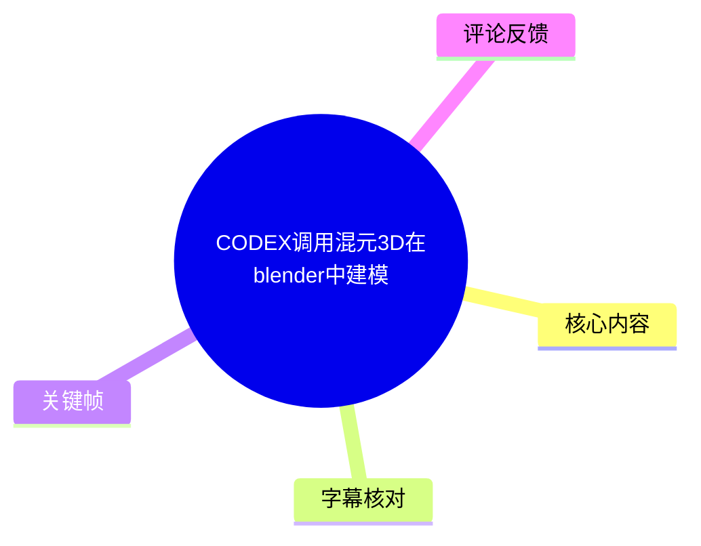
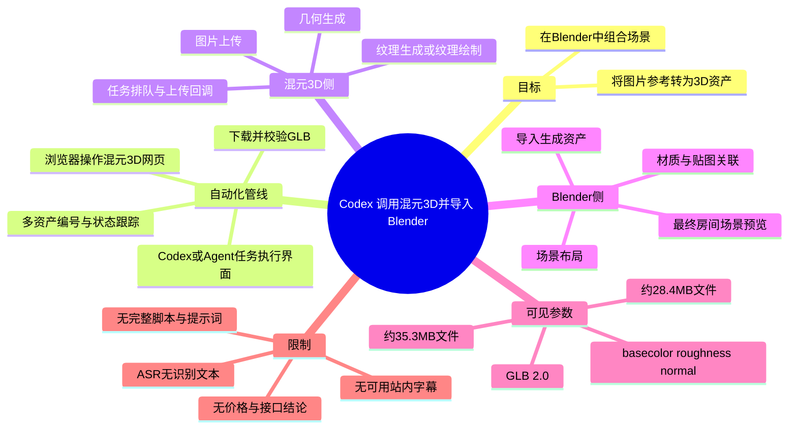
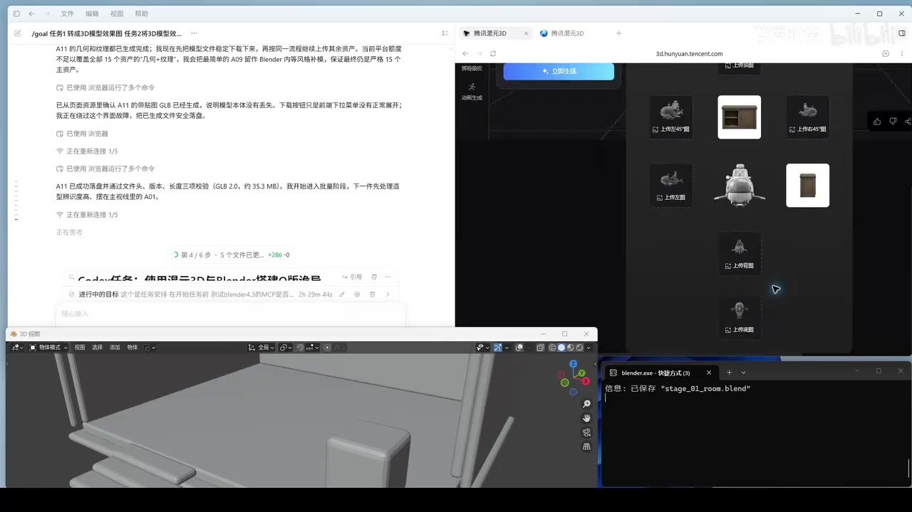
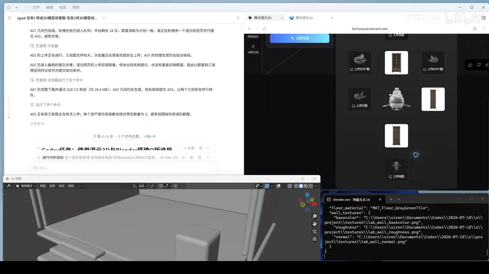
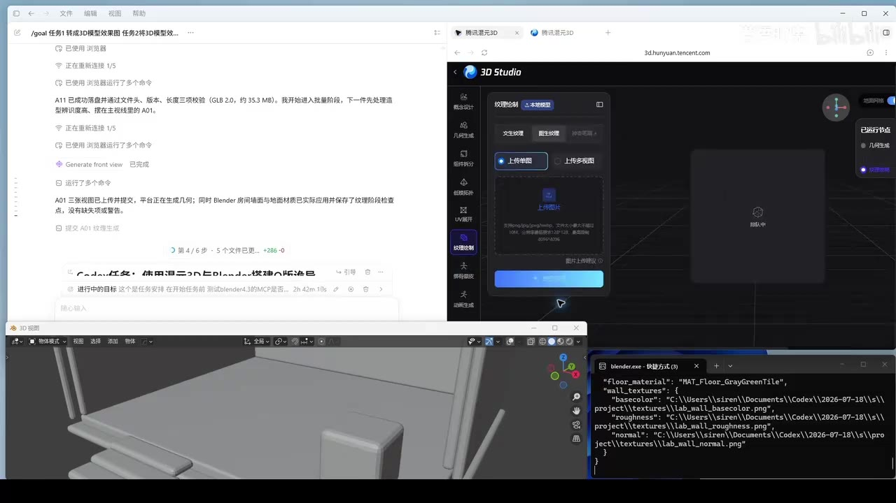
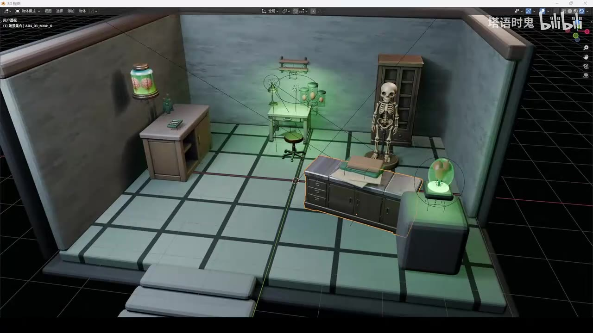

# CODEX调用混元3D在blender中建模

> 来源：[Bilibili 视频](https://www.bilibili.com/video/BV1Lm3X63Ekq) 
> UP 主：塔语时鬼｜发布时间：2026-08-02｜视频时长：02:24｜分辨率：1920 × 1080

## 小结

视频以屏幕录制方式展示一个“AI 代理调度网页端混元 3D，并将结果导入 Blender”的建模管线。画面中同时出现了任务执行界面、腾讯混元 3D（`3d.hunyuan.tencent.com`）网页、Blender 窗口与命令行/日志窗口，重点不在手工建模操作，而在多个资产生成、下载、校验与导入的自动化衔接。

可从画面确认的流程是：先在混元 3D 网页端以图片作为生成输入，分别处理房间内的家具、装置等对象；随后由代理跟踪生成状态，下载带贴图的 GLB 文件；最后将资产送入 Blender，并继续处理场景材质与布局。最终镜头展示了一个已在 Blender 中组合完成的实验室/工作室风格房间场景。

画面可见该流程包含多个并行或排队任务。任务日志中出现 `A01`、`A02`、`A03`、`A11` 等编号；其中可见“几何完成”“纹理任务进入队列”“上传回调无错误”“带贴图 GLB 已生成”等状态。这说明视频展示的是一套多资产流水线，而非仅生成单个模型。

视频中的可核实技术细节包括：导出格式为 **GLB 2.0**；画面中至少出现约 **35.3 MB** 与约 **28.4 MB** 的模型文件体积记录；材质侧可见 `basecolor`、`roughness`、`normal` 等贴图类型，以及类似 `MAT_Floor_GrayGreenTile` 的材质命名。上述数值是该次录屏项目的日志信息，不应视为混元 3D 的固定输出规格或平台限制。

本视频适合希望把图生 3D 服务接入 Blender 资产制作流程、关注 Codex/Agent 浏览器自动化能力的 Blender 用户。它更像一次工作流演示，**并未提供可复制的完整提示词、脚本、接口文档、账号权限配置或收费说明**；热评中关于网页请求、浏览器控制和价格的疑问，视频素材本身也没有给出直接答案。

时效性需特别注意：视频发布于 2026-08-02，网页端混元 3D 的界面、额度、上传限制、导出能力、模型质量及自动化兼容性均可能后续变化。录屏画面只能证明当时该环境中出现过相关流程，不能据此确认普通用户当前均可获得相同功能或结果。

## 思维导图

## 目录

- [视频范围、证据边界与时间轴](#视频范围证据边界与时间轴)
- [工作流总览：Agent、混元 3D 与 Blender](#工作流总览agent混元-3d-与-blender)
- [混元 3D 的多资产生成与任务状态](#混元-3d-的多资产生成与任务状态)
- [GLB 下载、校验与 Blender 导入](#glb-下载校验与-blender-导入)
- [贴图与材质处理线索](#贴图与材质处理线索)
- [最终场景与可迁移经验](#最终场景与可迁移经验)
- [限制、风险与时效性](#限制风险与时效性)
- [字幕比对](#字幕比对)
- [评论分析](#评论分析)
- [处理记录](#处理记录)

## [视频范围、证据边界与时间轴](https://www.bilibili.com/video/BV1Lm3X63Ekq?t=0)

本片总时长为 143.872 秒（页面显示为 02:24）。站内未提供可用字幕，本次 ASR 也没有产生任何带时间戳的语音分段。因此，素材中**不存在能够据以精确定位各操作步骤的字幕时间轴**。

为避免根据画面排列或文字顺序虚构时间位置，以下章节链接统一指向唯一可验证的播放起点 `t=0`；正文按关键帧中可见的工作流关系整理，而**不将其声称为精确的秒级发生顺序**。

| 可验证时间信息 | 证据 | 可得结论 |
| --- | --- | --- |
| [00:00](https://www.bilibili.com/video/BV1Lm3X63Ekq?t=0) | 视频元数据与播放链接 | 视频从此开始播放。 |
| 02:23.872 | ASR 诊断中的 `duration: 143.872` | 音频文件/视频处理时长约为 143.872 秒。 |
| 各步骤具体起止秒数 | 缺失 | 无站内 SRT，ASR `segments` 为空，不能可靠标注。 |

## [工作流总览：Agent、混元 3D 与 Blender](https://www.bilibili.com/video/BV1Lm3X63Ekq?t=0)

画面将四类界面并置，构成这次演示的核心证据：

1. **左侧任务/对话界面**：可见面向任务的中文执行记录，以及“已使用浏览器运行了多个命令”等状态文字。这表明操作并非纯手动演示，而是存在通过浏览器执行步骤、检查结果的代理式流程。
2. **右上混元 3D 网页**：浏览器地址栏可见 `3d.hunyuan.tencent.com`，页面中出现多个图片缩略图、上传入口、生成区域和/或纹理绘制面板。
3. **左下 Blender**：显示 3D 视口中的模型局部或场景，承担生成资产的接收、组合与预览角色。
4. **右下终端/日志窗口**：可见 Blender 保存提示及材质/贴图路径字典，说明流程还包含本地文件、材质数据或 Blender 自动化执行的记录。

> 图：该关键帧的价值在于同时呈现任务执行界面、混元 3D 网页、Blender 视口与终端输出，是识别“网页生成—本地处理—Blender 落地”管线关系的直接视觉证据。

需要谨慎区分两件事：

- **画面可确认**：存在浏览器端操作、混元 3D 页面、GLB 资产处理、Blender 窗口及任务日志。
- **画面不能确认**：Codex 是否通过官方 API 调用混元 3D、是否使用网页自动化协议、浏览器控制的具体实现、是否需要人工介入，以及所有操作的完整源代码。标题中的“CODEX 调用”可作为视频主题描述，但不能在缺少脚本与字幕的情况下扩展为具体接口实现结论。

## [混元 3D 的多资产生成与任务状态](https://www.bilibili.com/video/BV1Lm3X63Ekq?t=0)

关键帧中可见混元 3D 页面以多个独立图片/物体缩略图组织资产：例如柜体、设备或装饰物等。左侧日志用 `A01`、`A02`、`A03`、`A11` 等编号管理任务，反映出作者将房间场景拆分成多个对象，而不是期待一次生成完整场景。

从可辨认的日志状态，可整理出以下资产处理状态：

| 任务编号 | 画面可见状态 | 可确认含义 | 不可延伸的结论 |
| --- | --- | --- | --- |
| A01 | “几何已完成”；后续出现已下载并通过 GLB 2.0 校验的记录 | 至少有一个资产完成几何生成并完成下载校验 | 不能确认其具体物体名称、面数或生成耗时。 |
| A02 | 上传进行中/上传回调无错误；几何仍在生成 | 上传阶段未见画面所述错误，后续生成尚未完成 | 不能确认上传一定成功到最终成模，也不能确认最终质量。 |
| A03 | 多张图依次上传；提交前检查预览数量 | 该任务使用了多图上传或多图片参考的工作方式 | 无法确定支持的固定图片数量、每张图片的权重或官方限制。 |
| A11 | 几何与纹理完成；带贴图 GLB 已生成并下载 | 至少一个资产已达到“几何+纹理+GLB 导出”的完成状态 | 不能据此证明所有资产都已完成同样流程。 |

> 图：此图的价值在于显示多个物体缩略图与左侧的任务文字记录，支撑“按资产拆分、逐项上传和生成”的整理，而不是把流程误读为单一模型生成。

画面还出现“纹理任务进入队列”及平台等待相关提示。可提炼的经验是：

- 几何生成与纹理生成可能不是同一即时步骤，至少在该录屏任务中可见两者被分别追踪。
- 多资产并发或连续提交时，应为每个对象维护独立编号、上传状态、生成状态与下载状态。
- 出现“上传回调无错误”不等于整个生成任务完成；应继续检查几何、纹理、下载和导入等后续阶段。
- 该视频没有给出平台并发上限、排队策略、配额计算规则或失败重试策略，实践中不能把画面中的任务数量当成通用容量参数。

## [GLB 下载、校验与 Blender 导入](https://www.bilibili.com/video/BV1Lm3X63Ekq?t=0)

视频可见的一个重要工程环节，是不把“网页显示生成完成”等同于“本地资产可用”。日志中出现从页面资源确认带贴图 GLB 已生成、下载到本地、并进行文件检查的叙述。

可从画面直接提取的文件与校验信息如下：

| 项目 | 画面信息 | 应如何理解 |
| --- | --- | --- |
| 导出格式 | `GLB 2.0` | 该次流程使用 GLB 容器导入/传递资产。 |
| 文件大小之一 | 约 `35.3 MB` | 出现在 A11 相关的下载和校验文字中，是单次样本记录。 |
| 文件大小之二 | 约 `28.4 MB` | 出现在 A01 相关的下载和校验文字中，是另一单次样本记录。 |
| 校验项 | 文件头、版本、长度三项校验 | 画面所示的最小完整性检查思路。 |
| Blender 保存 | 终端出现 `stage_01_room.blend` 已保存 | 说明至少有一个 Blender 阶段文件被保存。 |

可复用的操作顺序应是：

1. 在网页端确认目标资产的生成任务完成，且需要时确认纹理阶段也已完成。
2. 下载 GLB，而非只保留网页预览状态。
3. 检查文件是否可读取，并至少核对：
   - 文件头是否符合预期；
   - 格式版本是否为预期的 GLB 2.0；
   - 文件长度/体积是否异常；
   - 需要贴图时，确认材质与纹理信息是否随资产正确保留。
4. 导入 Blender 后，在视口中检查几何是否出现、比例和朝向是否合理。
5. 保存 `.blend` 阶段文件，避免把网页任务状态当作唯一资产存档。

> 图：该图的价值在于将 Blender 视口与终端输出并置；终端中可见 JSON 式材质/贴图路径信息，说明导入后的资产处理还涉及本地文件引用，而不只是网页下载。

这里的“校验”只能确认文件层面的基本可用性，不能替代美术质量验收。即使 GLB 文件头、版本和长度均通过检查，仍可能存在网格破损、UV 异常、贴图丢失、法线问题、比例不一致或不适合当前场景风格等问题；视频没有提供系统化的质量验收标准。

## [贴图与材质处理线索](https://www.bilibili.com/video/BV1Lm3X63Ekq?t=0)

画面中混元 3D 页面侧栏可见“纹理绘制”相关界面，并展示了“上传单图”“上传多视图”等可见入口。终端窗口则出现与地板、墙面相关的材质和贴图路径信息。

可辨认的材质数据包括：

| 类别 | 画面可见名称或字段 | 作用 |
| --- | --- | --- |
| 地板材质 | `MAT_Floor_GrayGreenTile` | 指向灰绿色地砖风格的地板材质命名。 |
| 墙面基础色贴图 | `basecolor` / `Lab_wall_basecolor.png` | 控制墙面基础颜色信息。 |
| 墙面粗糙度贴图 | `roughness` / `Lab_wall_roughness.png` | 控制表面粗糙程度与高光扩散表现。 |
| 墙面法线贴图 | `normal` / `Lab_wall_normal.png` | 用于表现细节凹凸方向。 |

> 图：图中可见混元 3D 的纹理绘制侧栏及上传图片入口，有助于理解该流程不只处理几何，还关注图片参考与纹理生成/绘制阶段。

从画面可迁移的材质经验包括：

- 对于场景级建模，资产生成与环境材质可以分开管理：单个家具/道具通过 GLB 带入，地面和墙面可由 Blender 场景侧独立指定贴图。
- `basecolor`、`roughness`、`normal` 是常见 PBR 材质的关键贴图类别。视频显示它们以独立文件路径被组织，但未展示 Blender 节点连接细节。
- 上传单图和上传多视图应根据资产参考资料选择；视频画面只能确认两类入口存在，无法验证各模式对生成精度的实际差异。
- 若要复现，应自行检查导入后贴图的颜色空间、法线贴图解释方式和路径可用性；这些具体设置未在素材中展示。

## [最终场景与可迁移经验](https://www.bilibili.com/video/BV1Lm3X63Ekq?t=0)

最终关键帧展示了 Blender 中的一个房间式场景：空间内有柜体、桌面、椅子、书架、骷髅摆件、发光装置等对象，地面为方格分区，整体采用偏灰绿的照明与材质风格。部分对象边缘呈橙色高亮，符合 Blender 中对象被选中的视觉状态。

> 图：该图展示了多个独立资产被组合到同一房间布局后的结果，是评估该工作流最终交付形态的关键画面。它证明了“生成资产已被用于场景搭建”，但不能单凭画面判断所有对象是否均由混元3D生成。

这一结果提供的经验不是“AI 已经替代场景制作”，而是以下资产管线思路：

1. **先拆分场景**：把房间拆成墙体、地面、家具、装置和装饰物等资产单元。
2. **以资产编号管理任务**：对每个对象记录上传、生成、纹理、下载与导入状态。
3. **把网页生成当作资产来源之一**：生成后仍需要本地下载、格式校验和 Blender 整合。
4. **在 Blender 统一完成场景语境**：位置、尺度、陈设关系、整体材质与灯光决定了资产能否形成统一场景。
5. **保留中间文件**：画面中的 `stage_01_room.blend` 保存记录表明，阶段性保存是该类多资产流程的重要保障。

视频未展示以下关键制作步骤：场景比例标准、原始参考图、提示词、生成失败样例、网格清理、UV 修复、减面、碰撞体、渲染设置以及最终渲染参数。因此，该成果应被理解为一次可见的场景组装展示，而非完整生产级教程。

## [限制、风险与时效性](https://www.bilibili.com/video/BV1Lm3X63Ekq?t=0)

### 素材本身的限制

- 没有可用站内字幕。
- 本次 ASR 没有识别出语音文本与时间段。
- 无法从现有素材获取完整命令、脚本、提示词、账号配置或 API 调用请求。
- 无法确认所有画面中的模型均来自混元 3D，也无法确认是否存在手工补模或其他工具参与。
- 无法确认网页端功能是否对所有用户、地区、账户或套餐开放。

### 技术与工程风险

- 网页端任务可能经历排队、上传、几何生成、纹理生成等多个状态，任一阶段均可能阻塞整体资产流水线。
- 文件“生成完成”不等于 Blender 内可直接生产使用；仍要处理尺度、坐标系、材质引用、网格质量与场景风格统一性。
- 多资产任务中，任务编号、下载文件名和导入对象的映射若不清晰，容易发生资产错配。
- 视频中的文件大小约 28.4 MB、35.3 MB 仅代表实例，不能据此预测其他资产的下载大小、生成成本或处理时间。

### 时效性

元数据表明视频发布于 2026-08-02。混元 3D 的网页 UI、模型能力、导出格式支持、上传模式、队列机制、额度与收费策略均属于可能变动的信息。本文只记录视频画面中可见的当时状态，不把它们表达为当前平台保证或官方规则。

## [字幕比对](https://www.bilibili.com/video/BV1Lm3X63Ekq?t=0)

| 字幕来源 | 完整性 | 专有名词 | 时间轴 | 主要问题 |
| --- | --- | --- | --- | --- |
| Bilibili 站内字幕 | 未提供可用字幕 | 无法评估 | 无 | 素材清单明确说明未提供可用站内字幕。 |
| 本次 ASR 字幕 | 空 | 无法识别 | 无有效分段 | `large-v3-turbo` 检测语言为英语、置信度 0.6005859375，但 `segments` 为空，语音覆盖率为 0。 |

本次 ASR 已被检查：处理结果显示音频时长为 143.872 秒，但没有识别出语音片段，警告为“未识别到语音内容”。诊断数据**没有**标记 `noAudioStream=true`，因此不能称源视频没有音轨；更准确的表述是：本次处理拿到了音频文件，但 ASR 未成功提取可用语音文本。

最终正文未采用任何字幕转写，而是依据以下多模态证据整理：

- 视频标题与元数据；
- 关键帧中可见的 Blender、混元 3D 网站和任务日志；
- 可辨认的页面地址 `3d.hunyuan.tencent.com`；
- 可辨认的技术词：`GLB 2.0`、`basecolor`、`roughness`、`normal`；
- 可辨认的项目/材质名称：`stage_01_room.blend`、`MAT_Floor_GrayGreenTile`。

由于无可用字幕和 ASR 时间分段，本文不对任何一句画面文字附加虚构的逐句时间戳。

## [评论分析](https://www.bilibili.com/video/BV1Lm3X63Ekq?t=0)

以下仅处理可获取的热评前三条。三条评论点赞数均为 0，反映的是观众待验证的问题，不构成对视频技术实现或平台政策的事实补充。

| 评论者 | 评论要点 | 可反映的问题 | 可信度与边界 |
| --- | --- | --- | --- |
| 孟冬下元 | 询问混元 3D 网页是否支持网页请求，以及如何发送建模请求、取回模型。 | 观众关注自动化管线的关键接口：请求提交与模型回传。 | 这是问题而非答案；视频现有素材没有展示 API 请求或官方网页接口文档，不能据此断定其支持或不支持。 |
| cgaga渣渣 | 询问 UP 是否由 Codex 直接控制浏览器，在混元页面操作后再导入 Blender。 | 观众从画面中的多窗口布局推测使用浏览器自动化。 | 与画面中“已使用浏览器运行多个命令”的文字相符，但仍无法确认具体自动化框架、人工参与程度或执行权限。 |
| loudMore老末哒 | 询问该方案如何收费。 | 观众关心混元 3D 服务与整条工作流的成本。 | 视频素材未展示价格页、账单、额度规则或 Codex/Blender 相关成本，不能推导收费标准。 |

评论集中暴露了该演示最重要的三个信息缺口：**调用方式、自动化方式、成本方式**。若要将视频演示发展为可复用方案，后续应优先补充这些可验证资料，而不是根据标题或画面猜测。

## [处理记录](https://www.bilibili.com/video/BV1Lm3X63Ekq?t=0)

- Worker ID：`worker-mrj0wjed-b0c290ad`
- 模型：`gpt-5.6-terra`
- 调用工具与模型：素材处理链提供的音频提取、关键帧提取、ASR、元数据与评论抓取；ASR 模型为 `large-v3-turbo`。
- 使用的素材文件：`merged.mp4`、`audio/audio.wav`、`frames/`、`asr/asr-result.json`、`comments/comments.json`。
- 字幕选择：站内字幕未提供可用版本；已检查本次 ASR，结果为空且无时间分段；最终不采用字幕文本，改以元数据、关键帧与画面文字进行保守整理。
- ASR 状态：音频处理时长 143.872 秒；`segments: []`；语音覆盖率 0；未出现 `noAudioStream=true` 标记，因此未将问题表述为“源视频没有音轨”。
- 时间轴策略：因不存在站内 SRT 或 ASR 分段，不根据文字顺序猜测章节秒数；章节链接统一使用可验证的 `t=0` 播放起点，并在正文中明确说明该限制。
- 关键帧选择依据：
  - `frames/frame-001.jpg`：展示 Blender 中已组合完成的房间场景，用于说明最终交付形态；
  - `frames/frame-002.jpg`：并置任务界面、混元 3D、Blender 和终端，用于说明系统构成；
  - `frames/frame-003.jpg`：显示纹理绘制入口、Blender 与贴图路径，用于说明材质处理；
  - `frames/frame-004.jpg`：显示多资产缩略图与任务记录，用于说明资产拆分和任务状态。
- 缓存清理：未提供缓存清理执行日志；本文不宣称已执行或完成缓存清理。
- 未解决问题：无完整口述转写；无精确步骤时间轴；无调用脚本/API 请求；无提示词、费用、额度、并发限制与最终模型质量参数。

## 评论分析

- 热评 1：混元3d的网页支持网页请求么，不支持吧，那怎么发送建模请求和取回模型呢[蹲蹲]
- 热评 2：[doge]请教下up怎么搞的，codex直接控制浏览器在混元点点点在导入到blender中吗
- 热评 3：怎么收费的他这个

以上内容是观众反馈摘录，只用于补充理解视频反响，不作为正文事实依据。
