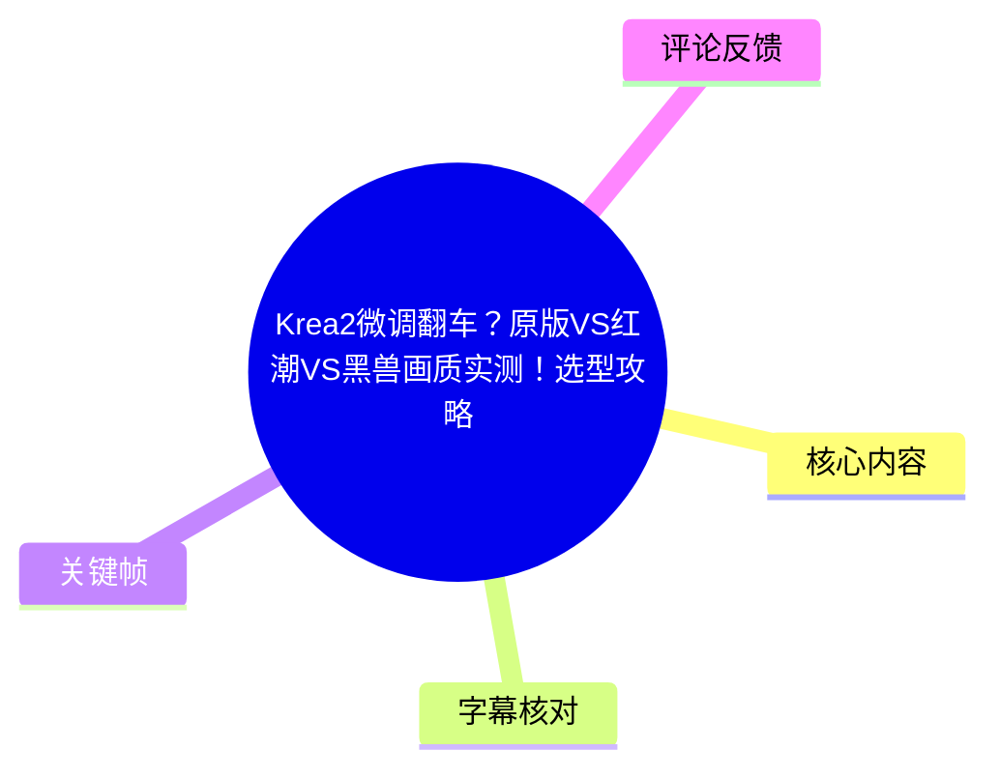
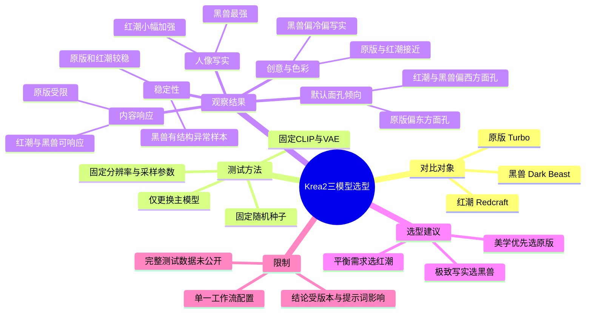
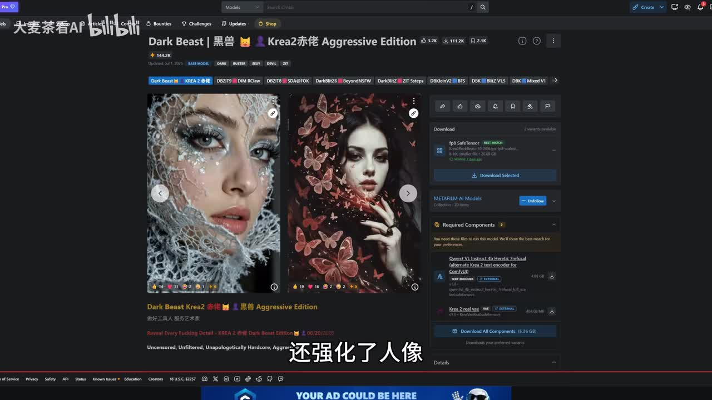
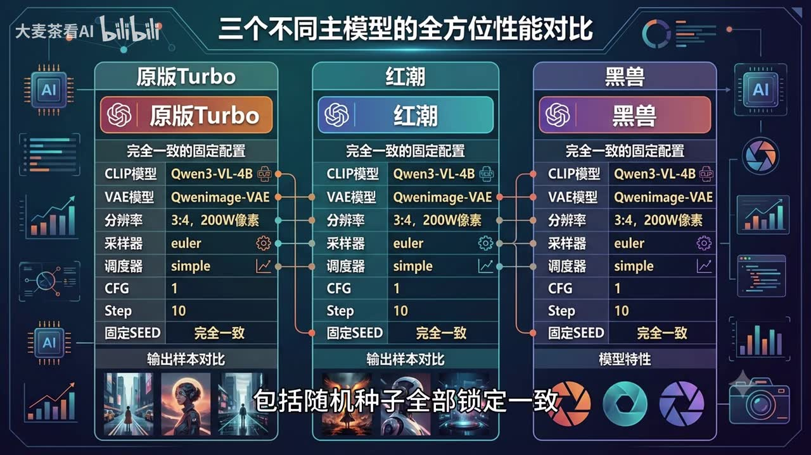
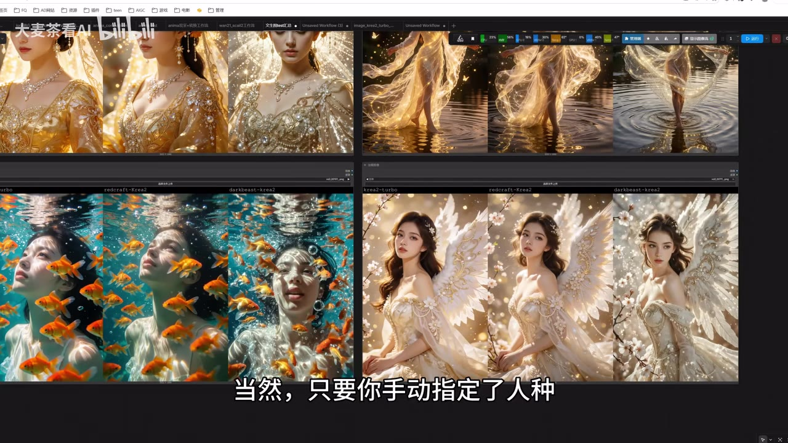
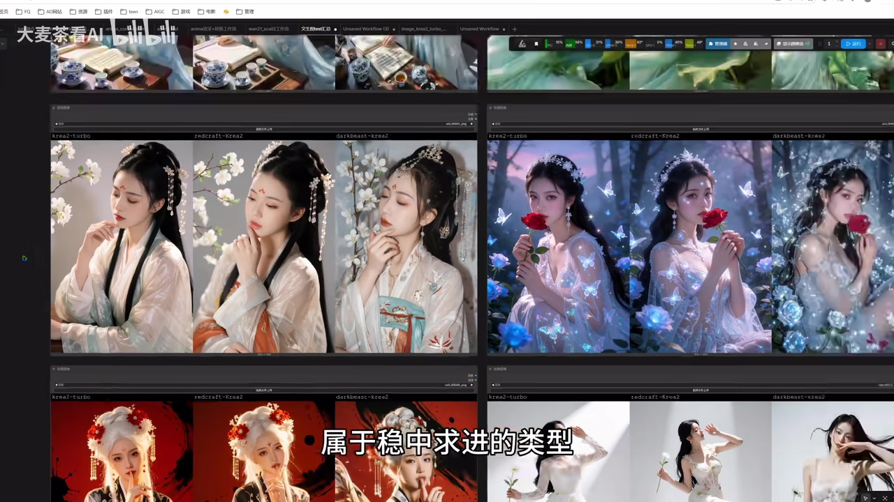

## 小结

本视频对比 **Krea2 原版 Turbo、红潮（Redcraft）与黑兽（Dark Beast）** 三个模型，核心问题是：在解除原版内容限制、强化人像后，微调版本是否还能保留 Krea2 原有的美学、清晰度与稳定性。

UP 主采用三组平行工作流进行测试，声明三组之间仅更换主模型；CLIP、VAE、分辨率、采样器、调度器、CFG、步数与随机种子均锁定一致。关键帧显示的固定配置为：**Qwen3-VL-4B、Qwenimage-VAE、3:4、200 万像素、Euler、simple、CFG 1、Step 10、固定 Seed**。

视频的主要结论是：**原版 Turbo**最能保留 Krea2 的原生美学、暖调和创意氛围，但会拦截视频所称“破限方向”的描述；**红潮**与原版风格最接近，能响应相关描述，并对肤质细节有所加强，是“保留审美、扩大生成范围”的平衡选项；**黑兽**的人像皮肤细节和真实感最强，但整体更偏冷调与写实，在创意题材中可能显得细节更满、意境感较弱，且稳定性存在取舍。

关于稳定性，UP 主称测试了 **100 多组图片**：原版与红潮全程“零报错”，黑兽出现过一次结构异常，具体表现为两次生成出“三条腿”的人物。视频将此归因于黑兽对原版改动更大，但这一因果关系属于 UP 主基于样本观察作出的解释，未见完整统计数据或独立复现材料。

适合阅读本文的人群包括：需要在 ComfyUI 或相似工作流中选择 Krea2 系模型的创作者、重视人像写实度与审美风格取舍的用户，以及希望理解“原版底模、微调模型、LoRA 路线”差异的使用者。视频与评论中的结论均依赖具体模型版本和工作流，不能直接视为所有版本、所有提示词与全部采样设置下的通用排名。

模型页面、网盘链接、RunningHub 工作流、内容规则和模型行为都具有时效性；本文仅整理视频中出现的事实，不验证外部链接当前可用性、模型安全性、许可证或合规性。

## 思维导图

## 目录

- [背景：Krea2 的优势与评测问题](#背景krea2-的优势与评测问题)
- [测试设计：三组平行工作流与固定参数](#测试设计三组平行工作流与固定参数)
- [样张观察：默认面孔倾向与人像写实度](#样张观察默认面孔倾向与人像写实度)
- [创意表现、色调与内容响应](#创意表现色调与内容响应)
- [稳定性测试与选型步骤](#稳定性测试与选型步骤)
- [资源、限制与时效性](#资源限制与时效性)
- [字幕比对](#字幕比对)
- [评论分析](#评论分析)
- [处理记录](#处理记录)

## [背景：Krea2 的优势与评测问题](https://www.bilibili.com/video/BV1YjTz6nEd7?t=0)

视频开场认为，Krea2 近期热度较高，其美学质感与清晰度是主要优势；但原版存在较严格的内容限制，导致部分用户认为使用范围受限。

本次对比涉及三个模型：

| 模型 | 视频中的定位 |
| --- | --- |
| 原版 Turbo | Krea2 原生美学与稳定性的参照组 |
| 红潮（Redcraft） | 视频称其与黑兽出自同一作者，主打解除限制、强化人像，并尽量保留原版审美 |
| 黑兽（Dark Beast） | 同样属于微调版本，更强调写实人像和视频所称“破限方向”的生成能力 |

> 图：该关键帧展示了名为“Dark Beast｜黑兽”的模型页面及样张。它的价值在于说明黑兽是独立于原版 Krea2 的衍生微调模型；页面展示内容仅能作为视频引用背景，不能替代对模型能力、来源或安全性的独立验证。

标题中的“翻车”并非指视频最终判定某一个模型完全不可用。实际结论是三个模型的目标不同：原版侧重原生审美，红潮侧重审美与生成范围的平衡，黑兽侧重高写实度；相应地，它们在创意感、色调和结构稳定性上存在取舍。

## [测试设计：三组平行工作流与固定参数](https://www.bilibili.com/video/BV1YjTz6nEd7?t=23)

为尽量避免工作流差异干扰，UP 主搭建三组完全平行的工作流，分别加载原版 Turbo、红潮和黑兽。视频明确称：**三组之间只有主模型不同**，其余主要参数保持锁定一致。

关键帧可读出的固定设置如下：

| 项目 | 固定配置 |
| --- | --- |
| 主模型 | 原版 Turbo / 红潮 / 黑兽，三组分别替换 |
| CLIP 模型 | Qwen3-VL-4B |
| VAE 模型 | Qwenimage-VAE |
| 画幅与像素 | 3:4，200 万像素 |
| 采样器 | Euler |
| 调度器 | simple |
| CFG | 1 |
| 采样步数 | Step 10 |
| 随机种子 | 固定，且三组完全一致 |

> 图：该帧直接列出了原版 Turbo、红潮、黑兽三列配置，并标明“完全一致的固定配置”。这是理解评测公平性的关键证据：视频试图把主模型之外的变量压缩到最少。

需要注意以下方法边界：

1. **固定 Seed 不代表三模型必然生成相同构图。** 不同主模型对同一文本编码、噪声和采样过程会有不同响应。
2. **固定参数不必然等于每个模型的最佳参数。** 视频使用的 Euler、simple、CFG 1、10 步等设置，是该评测工作流中的统一条件，而不是模型的通用最优配置。
3. 视频没有公开完整提示词、负面提示词、全部原始图片、失败样本目录和统计表，因此“谁更好”的判断主要是当前配置与展示样张下的经验结论。
4. 若要复测，应至少保持主模型之外的 CLIP、VAE、尺寸、采样器、调度器、CFG、步数、Seed 与提示词一致，再分别观察多批次结果。

## [样张观察：默认面孔倾向与人像写实度](https://www.bilibili.com/video/BV1YjTz6nEd7?t=56)

### 默认面孔倾向

UP 主提出一项样张观察：虽然 Krea2 是海外模型，但在**未明确指定人种**、仅依提示词自由生成的情况下，原版 Turbo 更偏向出现东方面孔；红潮与黑兽则默认更偏西方面孔。

视频同时说明，只要在提示词中手动明确人种，上述默认倾向差异会消失。也就是说，这是一种在提示词约束不足时可能出现的默认偏好，而不是无法控制的固定输出规则。

> 图：该帧展示多个三列样张，画面字幕为“当然，只要你手动指定了人种”。图片价值在于将“默认取向可以被提示词约束修正”的视频观点与实际工作流输出并置呈现。

实践上，若人物人种、地域面貌或文化形象对项目重要，提示词中应明确这些信息，而不应仅依赖模型默认倾向。视频并未提供完整提示词，因此本文不补写具体提示词模板。

### 人物写实度

视频对人像表现的判断如下：

| 模型 | 视频中的观察 | 相应取舍 |
| --- | --- | --- |
| 黑兽 | 皮肤细节和真实感最突出，接近“以假乱真” | 会牺牲一部分原版美学质感 |
| 红潮 | 与原版接近，肤质细节有小幅优化 | 属于偏稳健的增强路线 |
| 原版 Turbo | 更保留 Krea2 原始审美与整体氛围 | 不以极端写实肤质为主要优势 |

“高级美学”“AI 感”“真实感”等词均属于 UP 主基于画面样张的主观视觉评价，并非视频提供的客观图像质量指标。不同用户对皮肤颗粒、锐化程度、光影真实性和风格化程度的偏好可能不同，应以自身目标复测。

## [创意表现、色调与内容响应](https://www.bilibili.com/video/BV1YjTz6nEd7?t=108)

### 创意类题材：红潮更接近原版

在创意类样张中，UP 主认为红潮与原版的风格、色彩和细节高度接近，能够较大程度延续 Krea2 原版的美学能力。

对于黑兽，视频认为其明显转向写实路线；这种方向在人像细节上有优势，但在创意题材中可能带来更多画面信息，使画面显得更满、更复杂，意境感相对减弱。

> 图：该帧展示茶具、人物、蝶翼、古风等多组题材的三列输出。图片价值在于帮助观察视频所述的视觉取舍：原版与红潮在若干画面中更接近，黑兽的画面组织与人物细节倾向则更偏写实。

### 色调差异

视频对整体色调的描述如下：

| 模型 | 视频判断 | 适用倾向 |
| --- | --- | --- |
| 原版 Turbo | 保持 Krea2 原生色彩风格 | 适合以原版审美为目标的创意画面 |
| 红潮 | 继承原版色彩，整体偏暖、舒适 | 适合希望扩大生成范围但保留原版氛围的用户 |
| 黑兽 | 整体偏冷，形成另一种调性 | 更适合偏写实、冷调或高细节视觉目标 |

这些色调判断来自视频展示结果，可能受到提示词、参考图、显示设备、后期处理和模型版本影响；不应据此推断黑兽在所有场景中都必然偏冷。

### 视频所称“破限方向”的响应

视频将部分受内容规则影响的需求称作“破限方向”，但没有完整展示相关提示词。UP 主的陈述是：

- 红潮与黑兽可对带有相关描述的提示词正常响应并生成；
- 原版 Turbo 对此类描述更为严格，会将其拦截；
- 黑兽在这类内容中的真实感更强；
- 红潮虽可响应，但视频认为仍保留部分“AI 感”，不如黑兽写实。

此处是对视频内容的转述，不代表对任何模型绕过限制、生成特定内容或规避平台规则的建议。模型是否响应某类描述，也不等于使用方式自动合规；用户仍应遵循平台条款、模型发布规则、适用法律与项目规范。

## [稳定性测试与选型步骤](https://www.bilibili.com/video/BV1YjTz6nEd7?t=169)

### 稳定性结果

UP 主称本次测试覆盖 **100 多组图片**，并报告以下结果：

| 模型 | 视频报告的表现 |
| --- | --- |
| 原版 Turbo | 全程零报错 |
| 红潮 | 全程零报错 |
| 黑兽 | 出现一次“小翻车”，两次生成出现三条腿的结构异常 |

视频认为，黑兽对原版的改动更大，因此牺牲了部分稳定性。这是视频作者基于测试样本提出的解释，素材中未提供模型内部机制、完整失败率统计、全部异常图片或第三方验证，不能将其视作已证明的因果关系。

还应区分两个概念：

- **工作流报错**：通常指节点、依赖、显存、模型加载或执行流程失败；
- **图像结构异常**：例如人物肢体数量或形态不合理，属于生成结果质量问题。

视频将原版与红潮称为“零报错”，并报告黑兽有“三条腿”的结果；但未明确每一类异常的完整计数和统计口径。

### 按需求选择模型

UP 主给出的“不纠结”选型逻辑可整理为以下步骤：

1. **优先确认你是否需要原版的纯粹美学。**  
   若重视 Krea2 的暖调、创意氛围、原生审美，且不需要视频所称“破限方向”，选择原版 Turbo。

2. **若希望扩大可生成范围，同时不想放弃 Krea2 审美，选择红潮。**  
   视频将红潮视为最稳妥的折中选项：风格接近原版，又能响应相关描述。

3. **若目标是极致人像真实感，且不介意原版审美变化，选择黑兽。**  
   黑兽的核心卖点是更强的人像肤质与写实表现；但需要接受创意感变化、冷调倾向以及可能的结构稳定性代价。

4. **若结构稳定性是硬性要求，优先复测原版和红潮。**  
   根据视频的 100 多组样本报告，原版与红潮未出现其记录的异常；但正式生产仍应按自己的提示词和尺寸再次验证。

| 核心需求 | 视频推荐 | 原因 |
| --- | --- | ---|
| 原生美学、创意氛围 | 原版 Turbo | 最纯粹保留 Krea2 原始审美 |
| 审美与生成范围兼顾 | 红潮 | 接近原版视觉风格，同时扩大可响应范围 |
| 极致人像写实 | 黑兽 | 皮肤细节和真实感最强 |
| 对异常结构更敏感 | 原版 Turbo 或红潮 | 视频样本中二者更稳定 |

## [资源、限制与时效性](https://www.bilibili.com/video/BV1YjTz6nEd7?t=211)

视频末尾称，更多对比样张和完整测试数据已整理在专栏《原版 VS 红潮 VS 黑兽画质实测》中；工作流已上传至 RunningHub，模型文件也已打包至网盘，链接位于描述区或评论区。

视频描述中还提供了：

- Krea2 Turbo 工作流的 RunningHub 链接；
- 红潮与黑兽模型页面；
- 夸克网盘与百度网盘下载信息；
- AIGC 交流群信息；
- RunningHub 注册邀请链接。

这些资源均可能发生失效、迁移、权限调整、版本更新或内容变更。使用前建议自行核验：

1. 链接是否仍由发布者或模型作者维护；
2. 下载文件的模型版本、文件哈希、许可证和依赖项；
3. 工作流是否还需要自定义节点、特定 VAE、CLIP 或其他未列出的组件；
4. 使用场景是否符合模型页面、托管平台和所在地区的规则；
5. 当前模型表现是否与视频录制时版本一致。

本评测的主要限制包括：

- 只比较三个模型，且核心结论建立在一套固定工作流之上；
- 视频虽称测试超过 100 组图片，但未提供完整原始数据、提示词、统计方法和全部失败样本；
- 美学、真实感、意境和 AI 感属于主观视觉评价；
- 默认人种倾向、色调、内容响应和结构稳定性均可能受版本、语言、尺寸、采样器、LoRA、ControlNet、参考图等因素影响；
- 视频中关于内容限制的描述具有明显时效性，不能推定为模型长期固定能力。

## [字幕比对](https://www.bilibili.com/video/BV1YjTz6nEd7?t=0)

本次任务中，**Bilibili 站内字幕与本次 ASR 字幕均已提供并完成比对**。最终正文以站内字幕为主要依据，并以视频标题、描述和关键帧可读文字校正专有名词与参数。

| 字幕来源 | 完整性 | 专有名词准确性 | 时间轴信息 | 主要问题 |
| --- | --- | --- | --- | --- |
| Bilibili 站内字幕 | 覆盖开场、测试、样张、结论和资源说明 | 相对较好，但“KOREA2 / CREER / career2”“黑瘦”等词存在不一致 | 提供连续文本，未提供逐句时间码 | 模型名有转写混用；“CFG部署”疑似断句或识别问题 |
| 本次 ASR 字幕 | 覆盖全片主要口播 | 较弱，音近词与英文术语误识别较多 | 未提供逐句时间码 | “红潮”被识别为“红茶、红场、红巢”；“Krea2”被识别为“create 2、Korea 2、CREA2”；“黑兽”被识别为“黑寿、黑手”；“CFG”误为“C AppGip” |

最终采用的术语及校正依据如下：

| 最终写法 | 校正依据 |
| --- | --- |
| Krea2 | 视频标题与描述均明确写作“Krea2” |
| 原版 Turbo | 关键帧配置表中明确显示“原版Turbo” |
| 红潮 | 视频标题、描述中的红潮模型链接与关键帧均支持此写法 |
| 黑兽 | 视频标题、描述模型链接与关键帧中的“黑兽”支持此写法 |
| Qwen3-VL-4B | 关键帧固定配置表可读 |
| Qwenimage-VAE | 关键帧固定配置表可读 |
| Euler / simple / CFG 1 / Step 10 | 关键帧固定配置表可读，且与站内字幕的参数描述一致 |
| 肤质细节 | 站内字幕语义连贯；ASR 中“复制细节”不符合上下文，未采用 |

本次未获得逐句字幕时间码，因此正文时间轴按口播段落、画面切换与视频叙事顺序定位，而非精确到每一句字幕。

## [评论分析](https://www.bilibili.com/video/BV1YjTz6nEd7?t=189)

以下仅分析可获取热评中的前三条。评论反映观众经验与立场，不构成已验证的技术结论。

### 1. 伊吹童子｜3 赞

> “不破限玩什么开源[吃瓜]”

- **观点概括**：该评论者认为，开源模型的重要吸引力在于更宽的可生成范围。
- **补充价值**：它解释了部分用户为何更关注红潮、黑兽等微调版本，而不只比较原版美学。
- **可信度与边界**：这是态度表达，未给出模型版本、工作流、样张或可复现实验；不能据此推断开源模型的唯一价值，也不能据此推断任何内容生成行为均可接受或合规。

### 2. MS5117｜8 赞

> “目前版本下，如果玩ns，效果上原版加lora（推Realism）/Ponmaster>moody>红/黑。moody红黑劣化太多了。”

- **观点概括**：评论者认为，在其所称的“目前版本”与相关需求下，原版叠加 LoRA，或使用 Ponmaster，效果优于 moody、红潮和黑兽。
- **补充信息**：评论提出了一条视频未详细展开的路线：不直接切换微调主模型，而是保留原版底模并加载 LoRA，例如评论中推荐的 Realism。
- **争议与边界**：评论没有提供 LoRA 权重、模型版本、提示词、分辨率、采样器、Seed、样张或对比方法；“Ponmaster”“moody”的具体版本也未说明。因此，这是一项可供复测的反例，而不是可以直接确认的性能排序。

### 3. 新千年的绿叶｜3 赞

> “原版加LORA，目前是最优解，我试了很多直接炼模型的，最终出图效果，都不如原版[呲牙]”

- **观点概括**：评论者同样支持“原版 + LoRA”路线，认为其测试过的直接训练或微调模型，出图效果不如原版叠加 LoRA。
- **补充信息**：该观点与第二条评论形成呼应，提示实际选型不必局限在“原版、红潮、黑兽”三选一，也可以考虑以原版为底模，通过 LoRA 完成局部风格或能力扩展。
- **可信度与边界**：该评论未提供训练方式、训练数据、样本数量、对比图、评价指标或具体 LoRA 配置。“最优解”是个人结论，不能推广到所有审美、写实度、内容响应和稳定性目标。

## [处理记录](https://www.bilibili.com/video/BV1YjTz6nEd7?t=0)

- **Worker ID**：worker-mrj0wjed-b0c290ad
- **模型**：gpt-5.6-terra
- **使用素材与工具结果**：依据任务提供的视频元数据、视频描述、站内字幕、本次 ASR 字幕、热评 JSON、关键帧列表及已展示的关键帧内容完成整理；未对描述区外部链接、模型页面、网盘文件或专栏页面进行实时访问和验证。
- **字幕选择**：站内字幕作为正文主来源；本次 ASR 已执行并作为交叉核对来源。涉及模型名、英文缩写和固定参数时，优先采用视频标题、描述与关键帧中可直接读出的文字校正。
- **关键帧选择依据**：
  - `frames/frame-001.jpg`：展示黑兽模型页面，用于说明黑兽的衍生微调模型身份；
  - `frames/frame-002.jpg`：展示三组工作流固定配置，是参数和测试公平性章节的核心证据；
  - `frames/frame-003.jpg`：展示指定人种后的并排样张，对应默认面孔倾向可被提示词约束修正的讨论；
  - `frames/frame-004.jpg`：展示多组创意与人像题材的并排输出，用于说明原版、红潮和黑兽的视觉差异。
- **未选用关键帧**：`frames/frame-005.jpg` 至 `frames/frame-008.jpg` 未在提供素材中呈现可供核验的画面内容，且前四帧已覆盖模型背景、固定参数、人种控制和样张比较，故未重复插入。
- **缓存清理**：提供的素材清单仅记录 `merged.mp4`、音频、字幕、ASR、关键帧、评论和信息文件的产物路径，未提供实际缓存清理操作或结果；因此本文不宣称已执行额外缓存清理。
- **未解决问题**：
  - 未取得逐句字幕时间码，时间轴为段落级定位；
  - 未取得视频所称“100 多组图片”的完整原始样本、提示词与统计表；
  - 未验证描述区、评论区、模型页、网盘与 RunningHub 链接的当前可用性；
  - 未对热评提出的“原版 + LoRA 优于微调主模型”路线进行独立复现；
  - 未验证模型许可证、文件安全性及不同地区或平台下的合规要求。

## 评论分析

本次流程未获取到可用热评，因此不推断观众态度或额外结论。
