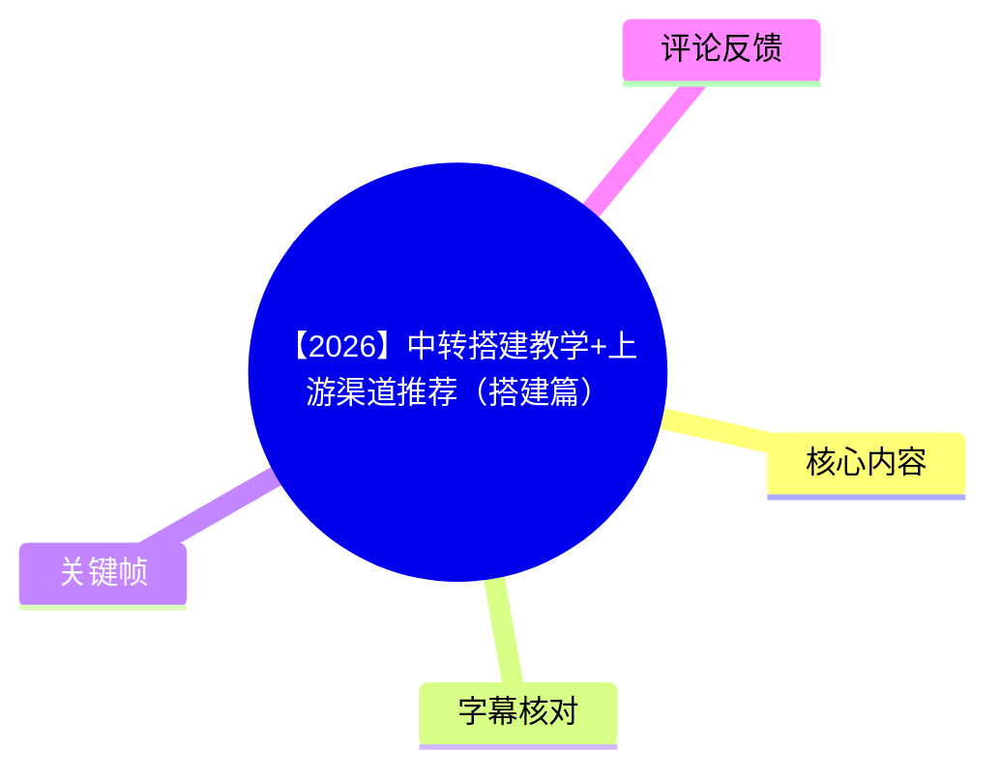
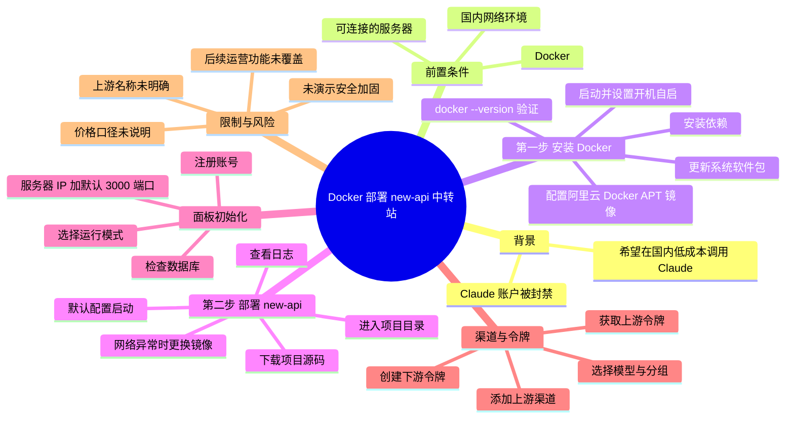
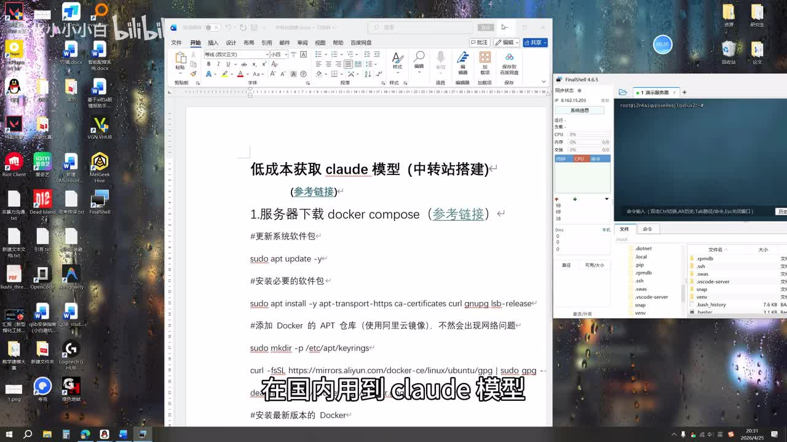
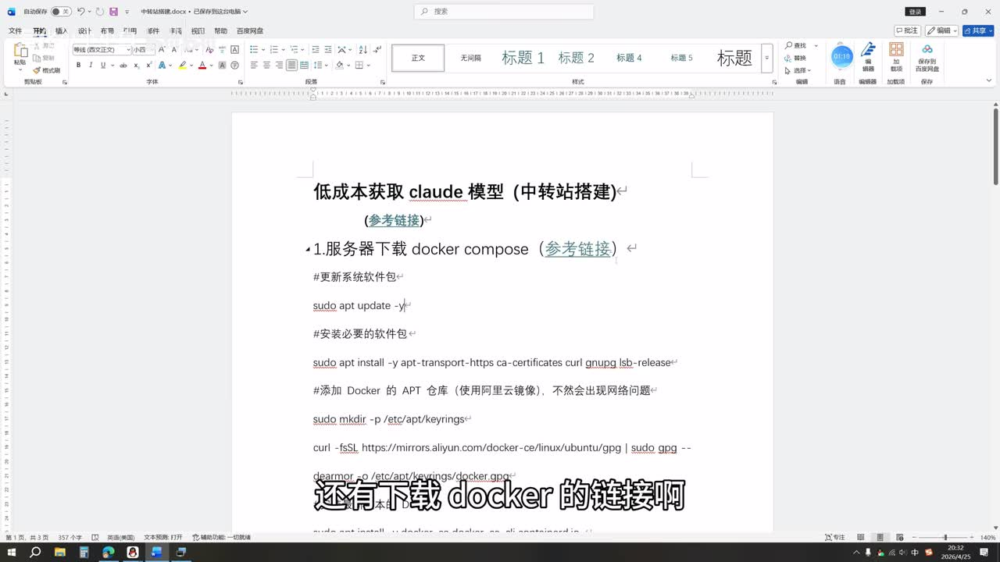
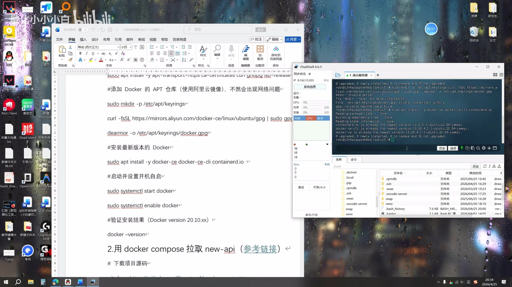

# 【2026】中转搭建教学+上游渠道推荐（搭建篇）

> 来源：[Bilibili 视频](https://www.bilibili.com/video/BV1WQo9BiEpD)<br>
> UP 主：量化小小小白｜发布时间：2026-04-25｜时长：08:50｜分辨率：3840×2160  
> 视频分区标题：低成本获取 Claude 模型 API（中转站搭建教学）

## 小结

视频演示了在服务器上通过 Docker 部署开源 **new-api** 项目、进入管理面板并配置上游渠道的基本流程。作者的出发点是其 Claude 账户被封禁，希望以较低成本在国内环境中使用 Claude 模型接口。

完整流程可分为两段：第一段安装并验证 Docker；第二段下载 new-api 源码、用 Docker Compose 拉取并启动服务、查看日志，随后通过“服务器公网 IP + 默认 3000 端口”进入管理面板。已有 Docker 的观众可直接从约 03:13 开始看第二段。

在面板初始化时，视频说明存在对外运营、个人使用、演示三种模式：个人开发者为日常调用和成本控制可选“个人模式”；但作者在演示中选择了“对外运营模式”。完成初始化后，管理员可添加渠道、填入上游令牌、创建下游访问令牌，供其他应用填写并调用。

作者推荐了一个未在可用字幕中明确写出名称的上游渠道，并声称该渠道覆盖“大部分 Claude 模型”、价格“大概两毛钱一刀”（原话，具体计价单位及模型版本未说明），且体验与官网“差不太多”。这些均为作者个人经验，不构成价格、稳定性、合规性或模型能力保证。

视频只覆盖“搭建篇”。模型管理、兑换码管理、用户管理以及中转站运营没有展开，作者表示后续可能另行制作。实际部署时还应自行处理服务器防火墙、端口暴露、域名与 HTTPS、访问令牌保护、上游服务条款及数据安全等问题；这些安全配置并未在视频中完整演示。

## 思维导图





## 目录

- [背景、目标与前置条件](#背景目标与前置条件-0000)
- [安装 Docker：系统更新、镜像配置与验证](#安装-docker系统更新镜像配置与验证-0115)
- [部署 new-api：下载、启动、日志与访问入口](#部署-new-api下载启动日志与访问入口-0313)
- [初始化控制台与运行模式](#初始化控制台与运行模式-0526)
- [添加上游渠道并创建访问令牌](#添加上游渠道并创建访问令牌-0625)
- [操作步骤清单与参数汇总](#操作步骤清单与参数汇总-0115)
- [限制、风险与时效性](#限制风险与时效性-0758)
- [字幕比对](#字幕比对)
- [评论分析](#评论分析)
- [处理记录](#处理记录)

## 背景、目标与前置条件 [00:00](https://www.bilibili.com/video/BV1WQo9BiEpD?t=0)

作者表示，制作本视频的直接原因是自己的 Claude 账户近期被封禁；因此尝试通过自建“中转站”以更低成本在国内使用 Claude 模型。这里的“中转站”在视频语境中指部署在自有服务器上的 API 管理与转发服务：一端对接上游渠道，另一端给应用或用户发放访问令牌。

作者在开场给出两项前置条件：

1. **服务器可连接**：安装与部署均在远程服务器终端中操作。
2. **服务器具备 Docker，或能够安装 Docker**：已有 Docker 的用户可以跳过第一部分，直接部署 new-api。

作者称其准备的文档包含私有渠道参考链接、Docker 下载链接和 new-api 链接，需私信获取。由于文档及链接正文未作为本次素材提供，本文不补写其实际 URL、渠道名称或命令。



> 图：画面左侧是“低成本获取 claude 模型（中转站搭建）”文档，右侧为 FinalShell 远程终端。这证明视频采用“参考文档 + 服务器终端”的实操方式，也能帮助辨认 ASR 中将 Claude 误写为“cloud”的问题。

## 安装 Docker：系统更新、镜像配置与验证 [01:15](https://www.bilibili.com/video/BV1WQo9BiEpD?t=75)

### 更新系统与安装依赖 [01:15](https://www.bilibili.com/video/BV1WQo9BiEpD?t=75)

作者先说明，连接服务器后应更新系统软件包，再安装必要依赖。关键帧可见文档中列出了以下命令：

```bash
sudo apt update -y
```

随后安装依赖的命令在画面中可见为：

```bash
sudo apt install -y apt-transport-https ca-certificates curl gnupg lsb-release
```

该流程明显面向使用 `apt` 包管理器的 Debian/Ubuntu 类系统；视频没有说明如何在 CentOS、RHEL、Alpine 或其他发行版上执行，不能直接迁移到这些系统。

### 配置 Docker APT 镜像 [01:54](https://www.bilibili.com/video/BV1WQo9BiEpD?t=114)

作者强调此步骤“比较重要”：由于后续需要访问 Docker 相关官方资源，若网络条件不佳可能出现网络问题，因此其在文档中使用阿里云镜像配置 Docker 的 APT 仓库。

画面中可辨认的步骤包括创建 keyrings 目录、下载 GPG 密钥并写入对应路径：

```bash
sudo mkdir -p /etc/apt/keyrings
curl -fsSL https://mirrors.aliyun.com/docker-ce/linux/ubuntu/gpg | sudo gpg --dearmor -o /etc/apt/keyrings/docker.gpg
```

> 视频口述把问题归因于连接“谷歌的一个官网”，但画面和文档实际呈现的是 Docker APT 仓库镜像配置。本文仅记录该视频中展示的操作，不对其网络原理作超出素材的推断。



> 图：文档中展示了 `apt update`、依赖安装、阿里云 Docker GPG 地址及 keyring 路径；这是复核 Docker 安装前置命令的重要画面依据。

### 安装、启动与验证 [02:14](https://www.bilibili.com/video/BV1WQo9BiEpD?t=134)

作者在确认提示后执行 Docker 安装，并提醒首次安装可能需要等待；若等待过久，作者判断可能是网络问题。视频文档画面中可见安装命令：

```bash
sudo apt install -y docker-ce docker-ce-cli containerd.io
```

安装完成后，作者启动 Docker 并设置开机自启：

```bash
sudo systemctl start docker
sudo systemctl enable docker
```

最后用版本命令验证：

```bash
docker --version
```

作者第一次验证时提到“掉了一个杠”，说明前一次命令输入出现问题；随后在约 03:01 的终端中确认 Docker 版本为 **29.4.1**，并将 Docker 安装步骤视为完成。



> 图：终端画面显示 Docker 安装结果，文档下方同时列出启动、开机自启与 `docker --version` 验证步骤。该帧用于确认视频实际验证的是 Docker 命令可用性，而非仅凭安装过程判断成功。

## 部署 new-api：下载、启动、日志与访问入口 [03:13](https://www.bilibili.com/video/BV1WQo9BiEpD?t=193)

### 下载源码与默认配置启动 [03:13](https://www.bilibili.com/video/BV1WQo9BiEpD?t=193)

Docker 就绪后，作者转入第二步：下载开源 **new-api** 项目源码。作者称下载过程很快，且自己的演示过程“没有开代理”，全程为国内网络环境。

随后操作顺序为：

1. 下载项目源码；
2. 进入项目目录；
3. 如有需要，可编辑其中的配置文件；
4. 本次演示不改配置，直接使用默认设置；
5. 拉取所需资源并启动服务。

视频字幕没有可靠转写出源码下载命令、项目仓库地址、Compose 文件内容或具体启动命令。尽管标题和口述涉及 Docker Compose，素材未提供可完全辨认的命令文本，因此不应擅自补为 `git clone`、`docker compose up -d` 等具体写法。执行时应以项目官方文档及实际版本的 Compose 配置为准。

### 网络异常、日志检查与服务状态 [04:08](https://www.bilibili.com/video/BV1WQo9BiEpD?t=248)

作者认为本次启动“好像成功”，但提醒首次运行未必像演示中一样快，观众可能需要等待。约 04:16，作者补充：若遇到网络问题，可使用视频中展示的一条指令“把镜像改一下”；其本人曾遇到该问题，修改镜像后恢复正常。

但该“改镜像”的具体指令未在提供的文字素材中完整保留，关键帧也未呈现完整内容。因此可确认的排障原则只有：

- 首次拉取、启动较慢时，先判断是否为网络问题；
- 作者的解决方式是替换镜像；
- 具体镜像源和修改语法需要以项目文档或视频原始画面为准。

启动后，作者执行日志查看并判断“没有问题”。视频没有说明日志中的具体成功标志、容器名称、容器端口映射或健康检查标准。

### 通过公网 IP 与 3000 端口访问 [04:43](https://www.bilibili.com/video/BV1WQo9BiEpD?t=283)

作者说明管理面板的访问地址由两部分组成：

- **IP**：服务器的公网 IP；
- **端口**：默认是 **3000**。

即概念上可按如下形式访问：

```text
http://<服务器公网IP>:3000
```

作者指出，如要进行分发或正式上线，可以用“宝塔”（ASR 识别为“保卡”，按常见产品名称与语境校正为宝塔）或采用反向代理，并接入自己的域名；本次演示则直接使用公网 IP 加端口。

这意味着视频中的配置仅展示了基础直连，并未展示 HTTPS 证书、域名解析、反向代理配置、防火墙规则、登录保护或端口白名单。

## 初始化控制台与运行模式 [05:26](https://www.bilibili.com/video/BV1WQo9BiEpD?t=326)

进入面板后，作者依次展示：

1. 检查数据库；
2. 注册账号；
3. 选择系统模式；
4. 初始化系统控制台；
5. 用刚注册的账号登录。

视频提到三种模式：

| 模式 | 视频中的用途说明 | 适用对象 |
| --- | --- | --- |
| 对外运营模式 | 建站赚钱或做分发，供其他用户使用 | 需要对外提供服务的运营者 |
| 个人模式 | 方便个人开发者日常使用、降低成本 | 自己调用模型的个人开发者 |
| 演示模式 | 仅提及为第三种模式，未解释具体功能 | 视频未说明 |

作者明确表示：如果是个人开发者、主要目的是日常使用和降低成本，可以选择第二个“个人模式”；但演示实际选择的是第一个“对外运营模式”。

初始化后，作者概括管理界面权限：

- **聊天控制台、个人中心**：所有用户均有；
- **后续管理界面**：管理员才有。

这一区分意味着后续绑定渠道、管理用户等操作需要管理员权限。视频未展示账户权限模型、注册开放策略或管理员安全设置。

## 添加上游渠道并创建访问令牌 [06:25](https://www.bilibili.com/video/BV1WQo9BiEpD?t=385)

### 绑定渠道与模型选择 [06:25](https://www.bilibili.com/video/BV1WQo9BiEpD?t=385)

作者接着演示绑定上游渠道。其使用的是一个自认为“挺好用”的渠道，并称没有上游来源的观众可使用该渠道，已有上游的用户则可以填写自己的渠道配置。

可用素材未给出该渠道的清晰名称、网站地址、认证格式、API Base URL、模型 ID 或服务条款，故无法将其识别为特定供应商。

关于上游能力与成本，作者作出以下经验性陈述：

- 覆盖“大部分 Claude 模型”；
- 价格“大概两毛钱一刀”；
- 使用体验与官网“差不太多”；
- 因此作者一直在使用。

其中“刀”是口语化计价说法，视频没有定义究竟对应 1M tokens、一次调用、某种额度单位或特定模型。因此不能据此推导实际单价，更不能与 Claude 官方价格进行严格对比。

### 获取上游令牌、分组与添加渠道 [07:13](https://www.bilibili.com/video/BV1WQo9BiEpD?t=433)

作者在该上游渠道处获取令牌，再在 new-api 中选择模型、填写相关信息并添加渠道。视频明确提到：

- 可以在上游侧获取令牌；
- 演示所用令牌是“新号”，**没有额度**；
- 添加时可选择分组；
- 演示使用默认分组。

这意味着该段更接近界面操作演示，并没有完成一次可验证的付费调用或额度消耗测试。令牌应被视作敏感凭据，视频没有说明其安全存储、轮换、权限收敛或泄露处理方案。

### 创建下游令牌并供应用调用 [07:35](https://www.bilibili.com/video/BV1WQo9BiEpD?t=455)

添加渠道后，作者说明还需创建“令牌”，用于实际调用。演示中设置为：

| 参数 | 视频演示值 |
| --- | --- |
| 有效期 | 永不过期 |
| 额度 | 无限额度 |
| 分组 | 默认分组 |

作者最后说明，其他需要使用 Claude API 的位置，可以填写这里生成的令牌来调用；视频目标是让用户以更低价格获得“和官网效果一样的模型”。


> 图：该画面中的文档已经进入“用 docker compose 拉取 new-api”部分，作为从 Docker 安装过渡到 new-api 部署的视觉证据。画面未完整显示 Compose 启动命令，因此正文没有臆补命令参数。

> **安全提醒：**“永不过期、无限额度”是视频演示设置，并不等于推荐的生产策略。若令牌泄露，可能导致持续的未授权调用和费用风险；视频未讲解限制额度、到期时间、IP 限制等防护配置。

## 操作步骤清单与参数汇总 [01:15](https://www.bilibili.com/video/BV1WQo9BiEpD?t=75)

以下仅按视频明确展示或口述的顺序整理，不补充素材中未给出的具体命令。

1. 准备一台可连接的服务器。
2. 若服务器没有 Docker，更新软件包：

   ```bash
   sudo apt update -y
   ```

3. 安装 HTTPS 仓库与密钥处理依赖：

   ```bash
   sudo apt install -y apt-transport-https ca-certificates curl gnupg lsb-release
   ```

4. 按视频文档配置阿里云 Docker APT 镜像的密钥目录与 GPG 密钥：

   ```bash
   sudo mkdir -p /etc/apt/keyrings
   curl -fsSL https://mirrors.aliyun.com/docker-ce/linux/ubuntu/gpg | sudo gpg --dearmor -o /etc/apt/keyrings/docker.gpg
   ```

5. 安装 Docker：

   ```bash
   sudo apt install -y docker-ce docker-ce-cli containerd.io
   ```

6. 启动 Docker，并设置为开机自启：

   ```bash
   sudo systemctl start docker
   sudo systemctl enable docker
   ```

7. 验证 Docker 是否可用：

   ```bash
   docker --version
   ```

   作者的演示结果为 `Docker version 29.4.1`。

8. 下载 new-api 源码并进入项目目录。  
   **限制：**视频素材未提供可确认的仓库地址和完整命令。

9. 使用默认配置拉取并启动服务。  
   **限制：**视频称使用 Docker Compose，但本次素材没有可核验的完整启动命令和 Compose 文件，执行时需查阅 new-api 当前官方部署说明。

10. 若拉取或启动时出现网络问题，按作者经验更换镜像；具体指令未在素材中完整保留。

11. 查看服务日志，确认启动无误。  
   **限制：**视频未给出可复用的日志成功判据。

12. 通过下列地址形式进入面板：

   ```text
   http://<服务器公网IP>:3000
   ```

13. 检查数据库、注册账号、初始化控制台，并根据用途选择模式。
14. 在管理员界面添加上游渠道，填入从上游获取的令牌，选择模型与分组。
15. 创建用于下游应用调用的新令牌。视频演示为“永不过期、无限额度”，实际使用应自行控制权限和额度。

### 视频中出现的关键参数

| 项目 | 视频信息 | 说明 |
| --- | --- | --- |
| Docker 验证版本 | 29.4.1 | 作者演示环境的结果，不是部署的最低或推荐版本声明 |
| 管理面板默认端口 | 3000 | 作者明确口述 |
| 面板访问方式 | 公网 IP + 端口 | 演示采用直连 |
| 上游模型 | 大部分 Claude 模型 | 作者主张，未列出具体模型清单 |
| 作者口述价格 | “大概两毛钱一刀” | 计价单位、模型与时间范围均未说明 |
| 下游令牌演示 | 永不过期、无限额度 | 仅演示配置，存在安全和成本风险 |
| Docker APT 镜像 | 阿里云镜像 | 用于改善作者所述网络问题 |
| 部署项目 | new-api | 作者称其为开源项目 |

## 限制、风险与时效性 [07:58](https://www.bilibili.com/video/BV1WQo9BiEpD?t=478)

### 视频覆盖边界

作者在结尾明确说明，本期只讲“搭建”。以下内容仅被提及，未进行教程式展开：

- 模型管理；
- 兑换码管理；
- 用户管理；
- 面向对外中转站的运营方式。

因此，本文不能把本视频视为完整的商业运营、计费、风控或多租户治理指南。

### 技术与安全限制

视频在基础部署后直接用公网 IP 和 3000 端口访问，并只简略提及宝塔、反向代理和自定义域名。以下关键事项未演示：

- 服务器安全组与防火墙端口规则；
- 域名解析和 HTTPS；
- 反向代理的实际配置；
- 管理员账户安全、强密码与访问控制；
- 上游和下游 API 令牌的安全存储、轮换与撤销；
- 令牌额度上限、有效期、调用频率控制；
- 数据传输、日志留存与隐私处理；
- 容器升级、备份、持久化和故障恢复。

这些缺口意味着直接照搬演示配置用于公网生产环境存在风险，尤其是把令牌设置为“永不过期、无限额度”时。

### 上游渠道与模型能力限制

作者推荐渠道的名称和链接未在可用素材中明确呈现；其关于模型覆盖、费用和“与官网差不多”的描述属于个人使用体验。上游转售、聚合或代理服务的稳定性、数据处理方式、模型实际来源、速率限制、账单规则及是否符合相关服务条款，均需要使用者自行核验。

### 时效性

视频标题标注“2026”，元数据显示发布时间为 **2026-04-25**。Docker 软件包、镜像站、new-api 部署方式、默认端口、界面字段、上游模型名称、价格和服务政策均可能随版本与时间变化。

尤其需要注意：

- Docker 29.4.1 仅是作者当时环境中的验证结果；
- 作者口述价格没有标出日期、币种、计价维度和模型；
- new-api 的仓库、镜像、Compose 配置可能已更新；
- 上游渠道是否可用、是否仍支持 Claude 模型及其定价，不能仅据视频判断。

## 字幕比对

| 字幕来源 | 完整性 | 专有名词 | 时间轴 | 主要问题 |
| --- | --- | --- | --- | --- |
| Bilibili 站内字幕 | 未提供可用字幕 | 无法核验 | 无法使用 | 本次素材中没有可用站内字幕文件 |
| 本次 ASR 字幕 | 较完整，共 48 段；语音覆盖约 383.9 秒，占视频约 72.48% | 存在明显误识别 | 完整，首段 00:00:00.110，末段 00:08:47.250 | Claude 被识别为 cloud、KLAL、KLal；new-api 被识别为 nash 新 API；宝塔被识别为保卡；令牌被识别为拎牌；部分命令与渠道名不完整 |

最终采用**本次 ASR 的带时间戳分段**作为章节时间轴依据，并结合关键帧和上下文对少量术语进行保守校正：

| ASR 原文 | 正文采用 | 校正依据 |
| --- | --- | --- |
| cloud 模型 | Claude 模型 | 标题、首帧文档均清晰显示“claude 模型” |
| nash 新 API | new-api | 作者口述语境为开源项目，且视频标题与文档主题对应中转站部署 |
| KLAL / KLal | Claude | 同一上下文均指模型，且与视频主题一致 |
| 保卡 | 宝塔 | 语境为部署上线、反向代理、绑定域名，按常见工具名称进行标注 |
| 拎牌 | 令牌 | 后文涉及渠道认证与调用凭据，语义一致 |

本次 ASR 诊断显示音频语言为中文、置信度约 0.992、时间戳可用，且**未标记 `noAudioStream=true`**；因此可确认源视频存在可识别的音轨，并非无音轨视频。由于站内字幕缺失，未进行双字幕逐句对照；对无法通过画面确认的命令、URL、渠道名和参数，均未补写。

## 评论分析

仅处理本次可获取的热评前三条。三条评论点赞数均为 3，均未提供技术补充、部署反馈或争议信息。

| 评论者 | 热评内容 | 分析 |
| --- | --- | --- |
| 韭菜永不做T | “关注了大佬” | 表达对作者的认可和关注意愿，没有提供教程可行性、成本或安全性的验证信息。 |
| trtripleCCc | “已三连” | 表达互动支持，不含可验证的技术经验。 |
| 剑苫河 | “已三连” | 同样是支持性互动，不能据此判断部署成功率或上游渠道质量。 |

评论区可获取的热评整体呈正向互动，但样本量很小，且没有涉及 Docker 安装、new-api 配置、上游价格、服务稳定性或合规性，不能作为教程有效性的证据。

## 处理记录

- Worker ID：worker-mrj0wjed-b0c290ad
- 模型：gpt-5.6-terra
- 工具与素材：视频元数据、关键帧 `frames/`、本次 ASR 结果 `asr/asr-result.json`、ASR SRT `asr/transcript.srt`、热评数据 `comments/comments.json`
- 站内字幕检查：素材明确标注“未提供可用站内字幕”。
- 字幕选择：采用本次 ASR 的带时间戳 SRT 作为时间轴来源；通过关键帧将“cloud / KLAL”等误识别保守校正为 Claude，并保留无法核验的缺失信息。
- 关键帧依据：选择 `frame-001.jpg` 展示教程文档与远程服务器环境；选择 `frame-002.jpg` 复核 Docker APT 镜像及依赖命令；选择 `frame-004.jpg` 复核 Docker 验证步骤并标识文档已进入 new-api 部署段落。未将画面中不可完整辨认的命令、链接或渠道名称写为确定事实。
- 缓存清理：提供的素材未包含缓存清理执行记录，无法确认是否已清理；本文不将其表述为已完成。
- 未解决问题：new-api 的具体仓库地址、完整 Compose 命令、网络异常时的换镜像指令、上游渠道名称与 URL、上游认证字段、实际模型清单和价格计价单位均未能从提供素材可靠确认。
