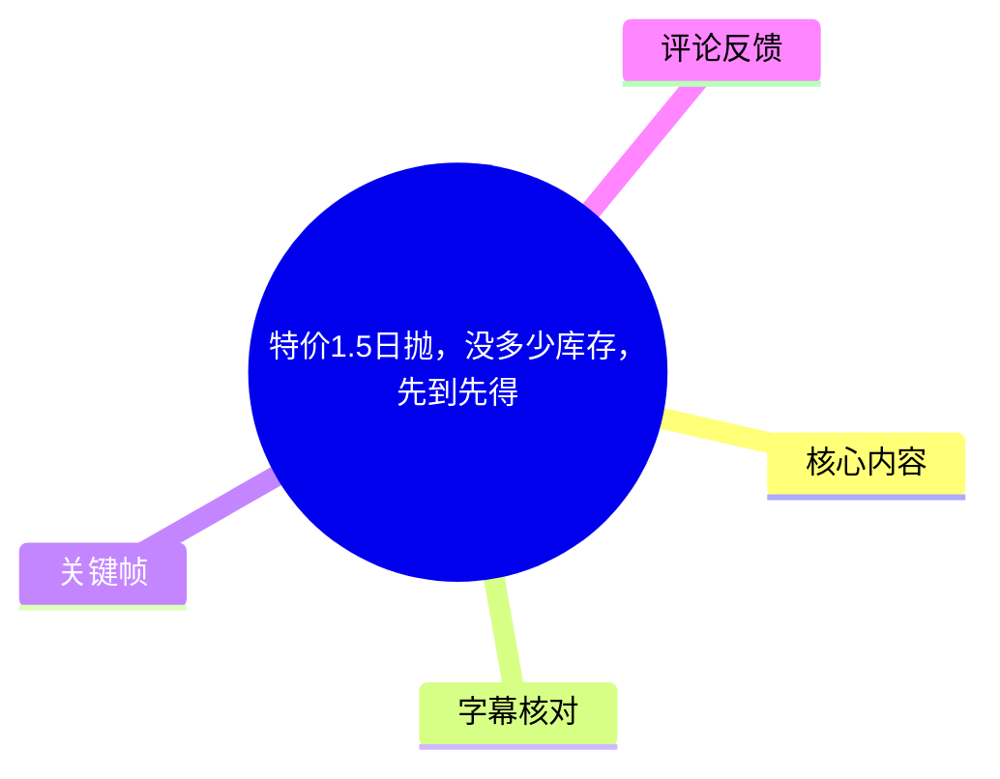
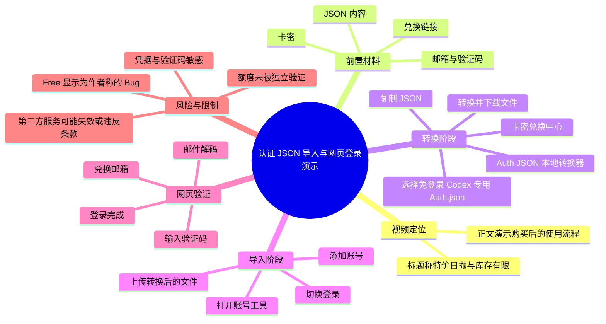
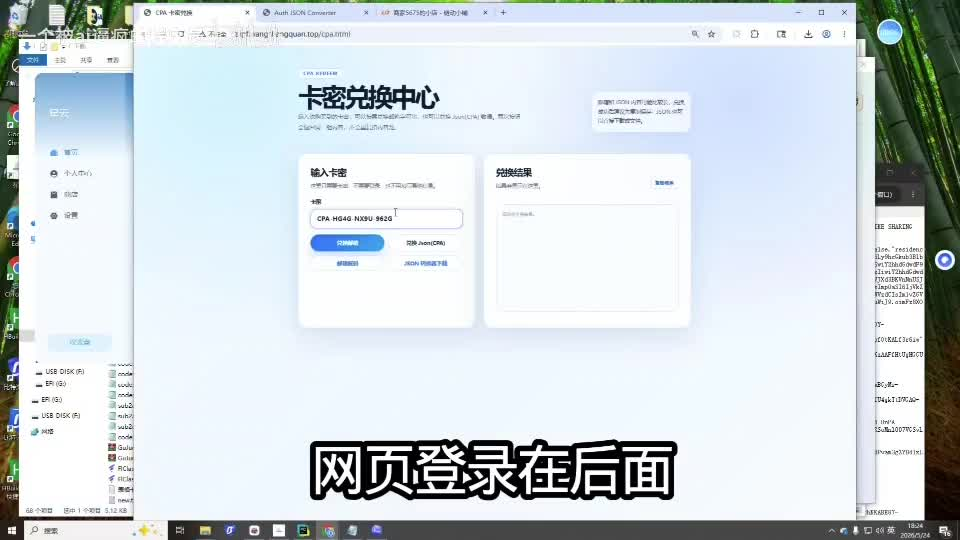
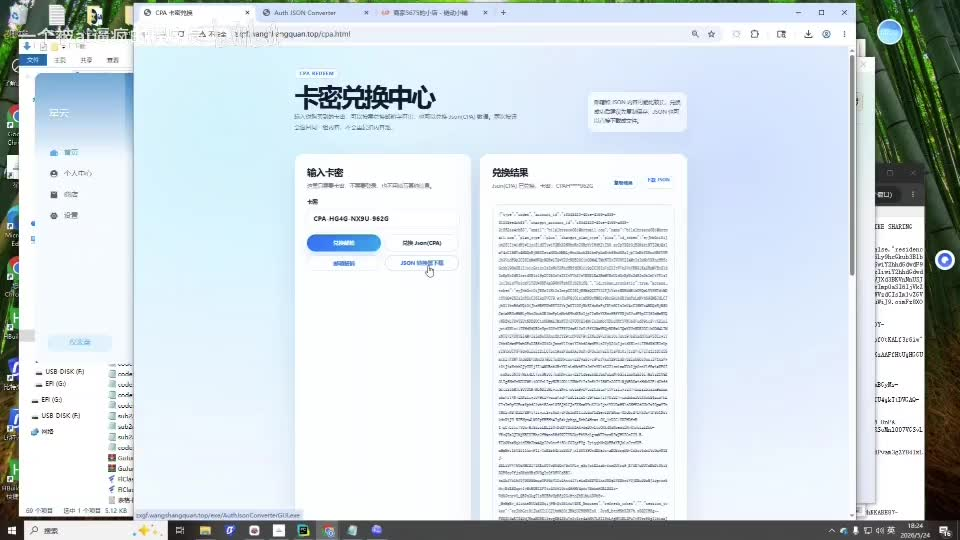
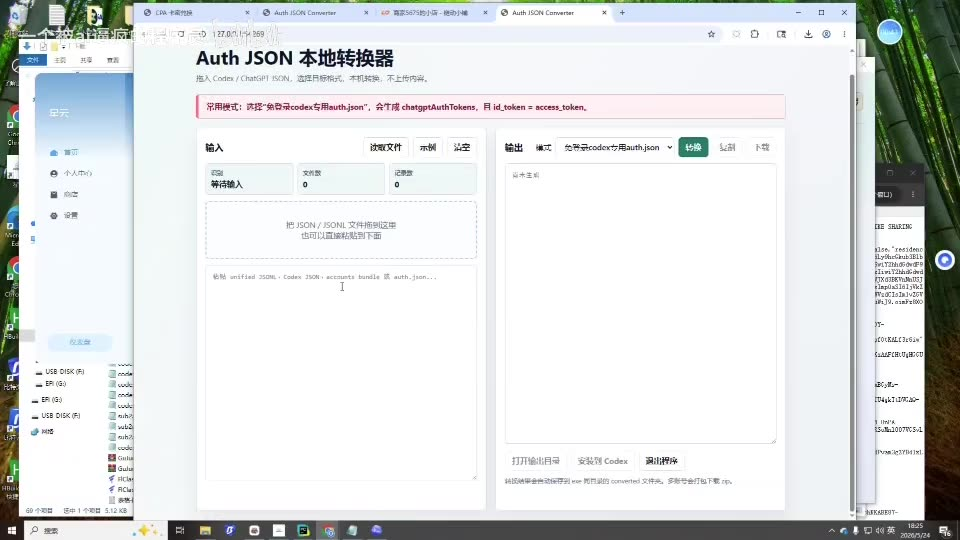
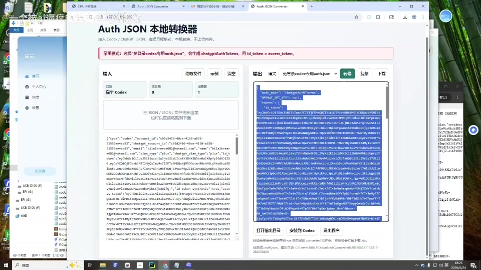

# 特价1.5日抛，没多少库存，先到先得

> 来源：[Bilibili 视频](https://www.bilibili.com/video/BV1qqGn6QEex)  
> UP 主：一个被ai逼疯的程序员｜发布时间：2026-05-25｜视频时长：02:12  
> 标签：经验分享、库存、学习心得  
> 数据抓取时可见：7,231 播放、59 收藏、34 点赞、17 评论。

## 小结

视频演示的是：购买所谓“PLUS 日抛号”后，如何将兑换结果转换为面向 Codex 的认证 JSON 文件、导入某个账号管理工具，并继续通过邮箱验证码完成网页登录的流程。视频标题同时声称“特价 1.5 日抛、库存不多、先到先得”，但这一价格、库存和可用期限均仅来自标题，视频口述中没有给出可核验的价格明细、库存数字或售后规则。

核心路径可概括为：**卡密兑换 → 复制 JSON → Auth JSON Converter 转换并下载 → 在账号工具中上传并切换登录 → 兑换邮箱、邮件解码与验证码验证 → 网页登录**。画面中可以辨认出“卡密兑换中心”“Auth JSON 本地转换器”等页面，转换器的模式显示为“免登录 Codex 专用 Auth.json”。

UP 主特别提示：账号工具导入后界面可能显示为 `Free`，但其称这是“Bug”，实际可用额度仍是 `PLUS`。这是视频作者的个人陈述，素材未提供额度后台、账单、官方说明或长期使用结果，不能视为已验证事实。

该操作涉及账号、认证 JSON、邮箱和验证码等高敏感信息。认证文件及验证码可能具有登录或会话授权作用；不应在公开聊天、截图、网盘或不可信网站中上传、转发、复用他人凭据。此类第三方账号、兑换服务及转换页面也可能违反平台服务条款，或随时失效、封禁、变更。

视频适合希望理解其演示界面与流程的读者参考；不适合作为账号购买、共享凭据、绕过正常登录或获取订阅服务资格的依据。实际使用前应优先采用服务提供方的官方账户、官方登录和官方 API / 客户端方式。

## 思维导图

## 目录

- [背景、范围与时效性](#背景范围与时效性-000000)
- [卡密兑换与获取 JSON](#卡密兑换与获取-json-000000)
- [Auth JSON 转换与文件下载](#auth-json-转换与文件下载-002153)
- [导入账号工具与切换登录](#导入账号工具与切换登录-003960)
- [邮箱兑换、解码与验证码登录](#邮箱兑换解码与验证码登录-011718)
- [完整操作清单与关键参数](#完整操作清单与关键参数-000000)
- [风险、限制与结论](#风险限制与结论-005718)
- [字幕比对](#字幕比对)
- [评论分析](#评论分析)
- [处理记录](#处理记录)

## 背景、范围与时效性 [00:00:00](https://www.bilibili.com/video/BV1qqGn6QEex?t=0)

视频开头说明的对象是“买完的 PLUS 日抛号”。这里的“日抛号”是 UP 主在视频中的称谓，素材没有说明它对应哪家官方产品、其账户归属、有效期定义、是否允许转售，或是否符合相关服务条款。

标题中包含三个营销性信息：

1. “特价 1.5 日抛”；
2. “没多少库存”；
3. “先到先得”。

这些信息未在 ASR 正文中展开，也没有可用站内字幕或其他素材证明价格、库存量、活动开始结束时间。因此，最多只能记录为**视频标题中的主张**，不应据此推断实际交易条件。

视频发布于 2026-05-25，素材抓取于 2026-07-16。认证格式、Codex 登录流程、第三方页面和账号状态均可能在此期间或之后发生改变，因此本视频只能反映录制时的操作界面，不构成当前可复现性保证。

## 卡密兑换与获取 JSON [00:00:00](https://www.bilibili.com/video/BV1qqGn6QEex?t=0)

### 1. 输入卡密并执行兑换

在 [00:00:00–00:00:10](https://www.bilibili.com/video/BV1qqGn6QEex?t=0)，UP 主说明：购买后会得到“卡密”，需要前往对应链接进行兑换，并获取 JSON。

画面可见“卡密兑换中心”页面，页面左侧包含“输入卡密”区域和兑换按钮，右侧为“兑换结果”区域。该画面能佐证视频确实展示了一个卡密兑换网页，但不能证实网站运营主体、兑换结果有效性或其安全性。

> 图：画面展示“卡密兑换中心”的卡密输入区和兑换结果区，是理解“先兑换再复制 JSON”这一前置步骤的直接视觉依据。图中任何卡密、邮箱、JSON 或其他认证内容均不应复制、保存或传播。

### 2. 复制兑换结果中的 JSON

在 [00:00:11–00:00:20](https://www.bilibili.com/video/BV1qqGn6QEex?t=11)，UP 主要求复制 JSON，并进入“JSON 转换器”。随后在 [00:00:21–00:00:27](https://www.bilibili.com/video/BV1qqGn6QEex?t=21)，说明应将此前复制的 JSON 粘贴到打开的网页中。

第二张画面中，兑换结果区域出现了较长的结构化文本，符合视频口述中“复制 JSON”的情境；但不应据画面推断该 JSON 的字段结构、来源合法性或授权范围。

> 图：兑换结果区显示较长的 JSON 式文本，说明后续操作依赖一段认证配置数据。其价值在于确认视频的输入并非普通文本，而是需要谨慎处理的结构化认证内容。

## Auth JSON 转换与文件下载 [00:00:21](https://www.bilibili.com/video/BV1qqGn6QEex?t=21)

### 1. 打开转换器并粘贴内容

在 [00:00:21–00:00:27](https://www.bilibili.com/video/BV1qqGn6QEex?t=21)，视频展示名为“Auth JSON 本地转换器”的页面。页面左侧是输入区域，提示可拖入 JSON / JSONL 文件或粘贴文本；右侧是输出区域。

> 图：该关键帧清晰呈现“Auth JSON 本地转换器”的双栏布局、输入区和输出区，有助于核对 ASR 中“JSON 转换器”的名称与操作位置。页面虽自称“本地”，但素材无法独立验证它是否确实只在本地处理数据。

### 2. 选择目标格式、转换并下载

在 [00:00:29–00:00:38](https://www.bilibili.com/video/BV1qqGn6QEex?t=29)，UP 主口述操作为：

1. 选择“免登录 Codex 专用 JSON”；
2. 点击转换；
3. 下载转换后的 JSON 文件。

从画面可读到的更完整模式文字为“免登录 Codex 专用 Auth.json”。转换后右侧输出框出现内容，页面上方可见“转换”“复制”“下载”等按钮。ASR 将该名称识别为“免登录Codex专用JSON”，根据画面补正为“免登录 Codex 专用 Auth.json”。

> 图：该画面是确认转换目标格式的关键证据：顶部模式下拉框显示“免登录 Codex 专用 Auth.json”，右侧已经出现输出内容，旁边有下载操作入口。

### 此环节的安全边界

- JSON、`Auth.json`、访问令牌、刷新令牌或会话信息都可能等同于登录凭据。
- 视频没有展示文件内容审查、令牌撤销、有效期检查或最小权限控制。
- 将此类内容粘贴进第三方页面存在泄露风险；即便页面名称含“本地”，也应先审查其源码、网络请求和数据处理方式。
- 本文不复述画面中可能包含的密钥、邮箱、验证码或其他可用于登录的信息。

## 导入账号工具与切换登录 [00:00:39](https://www.bilibili.com/video/BV1qqGn6QEex?t=39)

在 [00:00:39–00:00:53](https://www.bilibili.com/video/BV1qqGn6QEex?t=39)，UP 主称打开“等号器”（ASR 识别结果；素材无法可靠确认具体工具名称），依次执行：

1. 点击“添加账号”；
2. 点击“上传文件”；
3. 选择刚刚下载、转换得到的文件；
4. 点击上传。

由于 ASR 对该工具名存在明显识别不稳定，且所给关键帧未展示这个账号工具的完整标题或品牌，不能将“等号器”当作准确产品名称，也不能据此定位下载地址或判断其可信度。

在 [00:00:57–00:01:14](https://www.bilibili.com/video/BV1qqGn6QEex?t=57)，UP 主补充两项结果性说明：

- 上传完成后，界面可能显示 `Free`；
- UP 主称这是一个“Bug”，实际可用额度仍是 `PLUS`；
- 随后点击“切换登录”，工具会自行完成登录；
- 之后可在网页继续执行“兑换邮箱”。

这里最重要的限制是：`Free` 显示是否为 Bug、`PLUS` 额度是否仍有效，均为 UP 主单方陈述。视频没有展示订阅管理页、额度消耗记录、官方定价页或长期稳定性测试。读者不应把显示状态与实际权益自动等同，也不应仅凭此视频进行支付或账号交易。

## 邮箱兑换、解码与验证码登录 [00:01:17](https://www.bilibili.com/video/BV1qqGn6QEex?t=77)

### 1. 获取兑换邮箱并进行邮件解码

在 [00:01:17–00:01:22](https://www.bilibili.com/video/BV1qqGn6QEex?t=77)，UP 主称先“兑换邮箱”，再复制邮件（ASR 可能将“邮箱”与“邮件”混用），并打开“邮件解码”。

在 [00:01:25–00:01:29](https://www.bilibili.com/video/BV1qqGn6QEex?t=85)，UP 主继续说将内容“弄入”解码页面，然后打开新页面。由于画面资料未提供这两个阶段对应的清晰关键帧，且 ASR 字词不够稳定，能确认的是视频存在**将邮箱相关内容粘贴至解码页面**的操作；具体输入是邮箱地址、邮件正文还是其他编码内容，无法由现有素材准确断定。

### 2. 进入网页登录并填写验证码

在 [00:01:31–00:01:36](https://www.bilibili.com/video/BV1qqGn6QEex?t=91)，ASR 识别为“输入 Chest GPT”，结合语境更可能是在新页面进入 ChatGPT 相关登录入口；但由于 ASR 将英文产品名误识别为“Chest GPT”，且缺少对应清晰画面，本记录保留不确定性，不将其改写为确定的页面名称。

在 [00:01:45–00:01:46](https://www.bilibili.com/video/BV1qqGn6QEex?t=105)，UP 主说“然后输入下验证码”。最后在 [00:02:06–00:02:07](https://www.bilibili.com/video/BV1qqGn6QEex?t=126)，其称“直接就登录进来了”。

中间存在两个明显的无语音间隔：

| 无语音区间 | 时长 | 可确认信息 |
| --- | ---: | --- |
| [00:01:36–00:01:45](https://www.bilibili.com/video/BV1qqGn6QEex?t=96) | 8.13 秒 | ASR 未识别到语音，不能从字幕补充操作细节。 |
| [00:01:46–00:02:06](https://www.bilibili.com/video/BV1qqGn6QEex?t=106) | 20.54 秒 | 可能展示等待、输入或页面跳转，但现有 ASR 没有口述；不对其内容作推断。 |

验证码是账号安全机制的一部分。若验证码属于本人账户，应仅在官方页面输入；若来自他人、临时邮箱或第三方转发服务，则可能带来账号归属、隐私、欺诈及平台条款风险。

## 完整操作清单与关键参数 [00:00:00](https://www.bilibili.com/video/BV1qqGn6QEex?t=0)

以下按视频实际口述顺序整理，保留不确定处，不补充素材之外的工具地址、命令或账户信息。

| 时间 | 视频中的动作 | 可见 / 可听参数 | 注意事项 |
| --- | --- | --- | --- |
| [00:00:00](https://www.bilibili.com/video/BV1qqGn6QEex?t=0) | 获取购买后得到的卡密并前往兑换链接 | 卡密、兑换页面 | 卡密属于敏感凭据；不要公开。 |
| [00:00:00–00:00:10](https://www.bilibili.com/video/BV1qqGn6QEex?t=0) | 执行兑换，获取 JSON | “卡密兑换中心”、兑换结果 | 结果真实性和服务主体未验证。 |
| [00:00:11–00:00:20](https://www.bilibili.com/video/BV1qqGn6QEex?t=11) | 复制 JSON，打开 JSON 转换器 | JSON 转换器 | 不应向不可信网页提交认证 JSON。 |
| [00:00:21–00:00:27](https://www.bilibili.com/video/BV1qqGn6QEex?t=21) | 将 JSON 粘贴到转换器 | Auth JSON 本地转换器 | “本地”处理属性未被独立验证。 |
| [00:00:29–00:00:38](https://www.bilibili.com/video/BV1qqGn6QEex?t=29) | 选择模式、转换、下载 | “免登录 Codex 专用 Auth.json” | 输出文件可能含认证令牌，应加密保管。 |
| [00:00:39–00:00:53](https://www.bilibili.com/video/BV1qqGn6QEex?t=39) | 在账号工具中添加账号并上传文件 | 工具名 ASR 不可靠；“添加账号”“上传文件” | 不安装或运行来源不明的账号管理软件。 |
| [00:00:57–00:01:14](https://www.bilibili.com/video/BV1qqGn6QEex?t=57) | 查看显示状态并切换登录 | 界面显示 `Free`；UP 主称额度仍为 `PLUS` | 这是未验证的作者判断，不能据此保证权益。 |
| [00:01:17–00:01:29](https://www.bilibili.com/video/BV1qqGn6QEex?t=77) | 兑换邮箱、复制相关内容、邮件解码 | “邮件解码” | 邮箱内容可能包含账号恢复或验证信息。 |
| [00:01:31–00:01:46](https://www.bilibili.com/video/BV1qqGn6QEex?t=91) | 打开新页面，粘贴邮箱相关内容并输入验证码 | “Chest GPT”是 ASR 误识别可能性较高的文本；验证码 | 应只在官方可信页面验证本人账号。 |
| [00:02:06–00:02:07](https://www.bilibili.com/video/BV1qqGn6QEex?t=126) | 宣称登录完成 | “直接就登录进来了” | 仅为视频录制时的结果，不代表当前仍可成功。 |

## 风险、限制与结论 [00:00:57](https://www.bilibili.com/video/BV1qqGn6QEex?t=57)

### 视频提供了什么

视频实际提供的是一次短流程演示：从卡密兑换、认证 JSON 转换、文件导入，到邮箱验证码网页登录。它展示了页面名称、按钮方向和作者声称的状态表现，适合用于识别录屏中的流程节点。

### 视频没有提供什么

素材没有提供以下关键证据：

- “1.5 日抛”的准确含义、价格币种、交易渠道和活动截止时间；
- 库存数量、补货机制、退款规则或售后方式；
- 账号或凭据的合法来源与归属；
- `Free` 显示为 Bug、但实际为 `PLUS` 额度的官方证据；
- 转换器和账号工具的开发者、代码审计、隐私策略及网络行为；
- 登录成功后的可用模型、额度大小、有效期和稳定性；
- 是否符合 OpenAI、Codex 或其他相关服务的服务条款。

### 可迁移的经验

1. **认证文件应按密码级别对待。** JSON 配置文件不只是“导入文件”，可能含有可用于会话恢复或身份认证的令牌。
2. **显示标签不等于实际权益。** 即便界面显示 `Free` 或 `PLUS`，也应以官方账户管理、实际授权和服务条款为准。
3. **第三方转换与管理工具需要验证。** 应检查来源、开源情况、网络请求、文件写入位置和权限要求，避免将敏感信息提交给未知服务。
4. **验证码必须限定在本人账户的官方验证流程内。** 从他人处取得、共享或代填验证码存在明显安全与合规风险。
5. **短期促销和“日抛”类信息时效极强。** 标题中的库存和价格不能脱离发布时点使用，更不能作为长期价格承诺。

## 字幕比对

| 字幕来源 | 完整性 | 专有名词 | 时间轴 | 主要问题 |
| --- | --- | --- | --- | --- |
| Bilibili 站内字幕 | 未提供可用站内字幕，无法比对内容完整性 | 无法评估 | 无可用时间轴 | 素材明确标注“未提供可用站内字幕”。 |
| 本次 ASR 字幕 | 共 12 段，识别到 80.55 秒语音，覆盖全片约 61.21% | 多处不稳定，如“下轿”“一查一文件”“等号器”“Chest GPT”“登彁” | 有 SRT 级起止时间，可直接用于章节定位 | 存在 8.13 秒、20.54 秒的大段无语音间隔；个别中文词和英文产品名误识别。 |

### 最终字幕选择与校正原则

最终以**本次 ASR 的带时间戳 SRT**为时间轴依据，因为没有可用站内字幕。ASR 诊断未标记 `noAudioStream=true`；相反，检测到音频时长 131.5875 秒、语言为中文、语言置信度 0.9951，因此本视频并非无音轨视频。

对 ASR 的处理遵循“保留时间、谨慎校词”原则：

- 将画面可直接读到的“Auth JSON 本地转换器”作为转换器名称；
- 将 ASR 的“免登录Codex专用JSON”结合画面校正为“免登录 Codex 专用 Auth.json”；
- “等号器”无法由现有画面确认具体名称，保留为 ASR 不确定词，不扩展为具体软件；
- “Chest GPT”疑似英文产品名识别错误，但缺少足够清晰的画面证据，不将其强行改为确定名称；
- “一查一文件”等明显误识别不作为文件格式结论，统一表述为“转换后下载的文件”。

## 评论分析

仅获取到 2 条热评，未获取到第 3 条，因此不补充或推测缺失评论。评论均不能视为对视频所述账号、额度或交易可靠性的验证。

1. **1243asd（2 赞）：“还有群吗 人满了”**  
   - 观点：询问是否存在其他群组，并表示已知群组已满。  
   - 可补充的信息：反映部分观众在寻找交流群或社群入口。  
   - 限制：没有提供群组名称、管理规则、交易信息或服务可靠性证据。

2. **木皆比白（2 赞）：“给个交流群呢”**  
   - 观点：希望 UP 主提供交流群。  
   - 可补充的信息：说明观众对后续交流或使用支持有需求。  
   - 限制：该评论不证明存在官方群、授权社群或可靠售后，也不应据此加入来源不明的账号交易群。

3. **第 3 条热评**  
   - 获取结果：素材中仅返回两条评论，未提供第 3 条可分析内容。  
   - 处理：不编造评论观点。

## 处理记录

- Worker ID：`worker-mrj0wbly-5dc4e50c`
- 模型：`gpt-5.6-terra`
- ASR 模型与运行参数：`medium`，语言自动检测为 `zh`，置信度 `0.9951171875`，`cuda`，`float16`。
- 使用的素材工具结果：已提供合并视频 `merged.mp4`、音频 `audio/audio.wav`、12 张关键帧、ASR SRT / 分段 JSON、评论 JSON 与元数据；本记录基于这些已提供产物整理。
- 字幕选择：站内字幕未提供可用版本；已检查本次 ASR，采用其 SRT 时间戳作为章节链接依据，并以关键帧可见文字对“Auth JSON 本地转换器”“免登录 Codex 专用 Auth.json”等词进行有限校正。
- 关键帧选择依据：选用 `frames/frame-001.jpg` 至 `frames/frame-004.jpg`，因为它们分别清楚显示卡密兑换中心、兑换结果中的结构化文本、Auth JSON 转换器输入界面及转换输出/格式选择；这些画面可直接支撑正文中的界面与步骤描述。未对未提供画面内容说明的其他帧作推断。
- 缓存清理：素材未提供缓存清理日志或执行结果，无法确认是否已清理；不将“未记录”表述为“已清理”。
- 未解决问题：账号工具真实名称、兑换服务主体、认证文件字段与权限、`Free`/`PLUS` 状态真实性、活动价格和库存、网页登录页面的准确产品名称，均无法从现有素材可靠确认。
