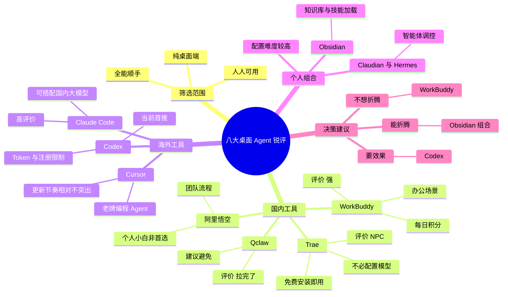
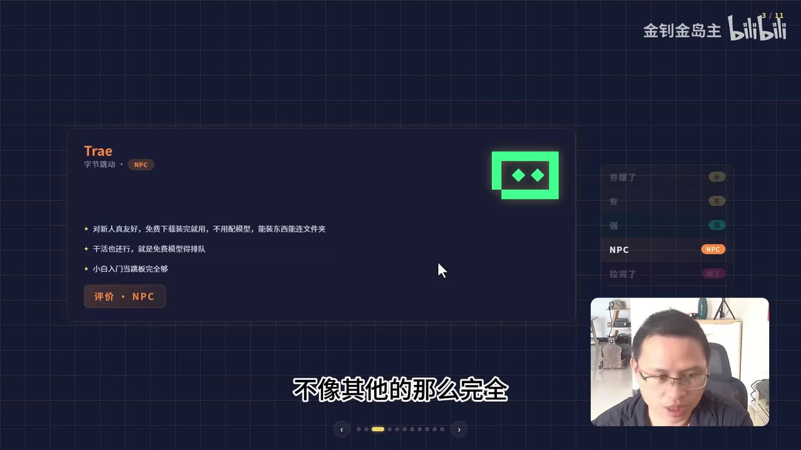
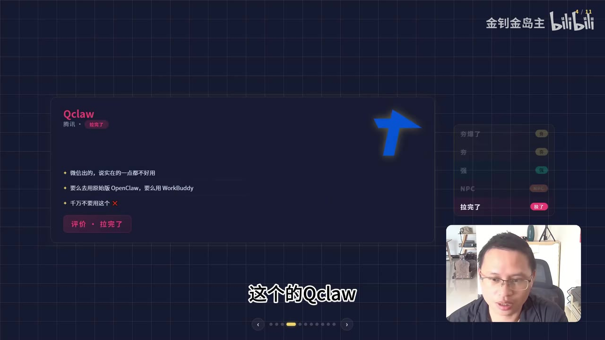
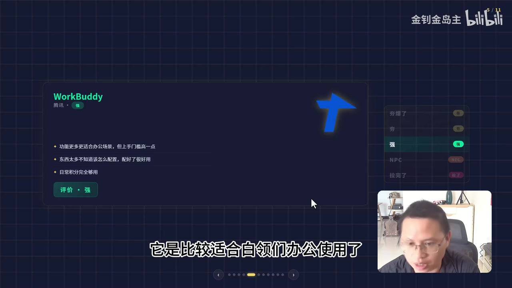

# 从 Trae 到Codex ：八大桌面 Agent 锐评

> 来源：[Bilibili 视频](https://www.bilibili.com/video/BV1U7V66FEiK) 
> UP 主：金钊金岛主｜发布时间：2026-06-02｜视频时长：02:59｜合集：AIcode

## 小结

这是一支面向非纯开发者的桌面 Agent 工具主观横评。UP 主明确将范围限定为：可下载、可在桌面打开、普通人也能使用的软件，而非“黑乎乎的编程工具”。视频按国内与海外工具分别点评，并给出“夯爆了、强、NPC、拉完了”等强烈个人化评级。

视频实际覆盖的对象包括 Trae、Qclaw、WorkBuddy、阿里悟空、Cursor、Claude Code、Codex，以及一套由 Obsidian 与两个智能体组件构成的个人配置。素材中称其为“八大”选手；其中最后一项是组合式方案，且组件名称在不同素材中存在转写差异，不能视为已完全确认的标准产品名。

对小白最直接的建议是：不想折腾时选 WorkBuddy；追求效果时直接选 Codex。具备配置与调试能力者，可考虑 UP 主正在使用的 Obsidian 组合方案；Claude Code 也被列为高评价选择。Trae 被定位为免费、易安装的入门跳板，而非功能最完整的长期主力。

需要注意，这不是基于统一任务、成功率、价格、上下文长度、模型版本和安全性等指标得出的可复现实验报告，而是短视频形式的经验“锐评”。“免费”“每日送积分”“账号难注册”“更新快”等信息都具有时效性，使用前应以产品当前官网、客户端和账户区域的实际政策为准。

视频没有提供具体安装命令、模型参数、配额数值、价格、版本号、基准测试任务或 Obsidian 组合的配置步骤。因此本文只整理原视频已出现的选择逻辑、已说出的限制与可执行的决策路径，不补造教程细节。

## 思维导图

## 目录

- [筛选范围与信息边界](#筛选范围与信息边界)
- [国内桌面 Agent：Trae、Qclaw、WorkBuddy 与阿里悟空](#国内桌面-agenttraeqclawworkbuddy-与阿里悟空)
- [海外工具：Cursor、Claude Code 与 Codex](#海外工具cursorclaude-code-与-codex)
- [Obsidian 组合方案与配置限制](#obsidian-组合方案与配置限制)
- [按能力和目标选择工具](#按能力和目标选择工具)
- [关键参数、限制与时效性](#关键参数限制与时效性)
- [字幕比对与名称校正](#字幕比对与名称校正)
- [评论分析](#评论分析)
- [处理记录](#处理记录)

## [筛选范围与信息边界](https://www.bilibili.com/video/BV1U7V66FEiK?t=32)

UP 主在开场说明，当前桌面 Agent 工具已经很多，本期不评“黑乎乎的编程工具”，而是选取普通用户能够下载并在桌面端打开的软件。画面进一步给出三条筛选标准：

1. **纯桌面端**：必须是桌面端工具，而不是网页版。
2. **人人可用**：不局限于编程专家，小白也能用于日常办公。
3. **全能顺手**：强调易用性，并希望工具具备多类能力。

> 图：画面列出“纯桌面端、人人可用、全能顺手”三项筛选逻辑，是理解本期为什么不按传统代码编辑器或纯 Web 服务进行比较的前提。该图来自提供的关键帧；关键帧素材未附带逐帧时间码，正文时间轴仍以 ASR/SRT 的真实分段起点为准。

需要区分的是：视频口述“国内四个、国外四个”，但实际呈现还包含一套“私人推荐”的组合方案。它是由知识库与智能体组件组成的工作流，不等同于单一桌面应用；因此“八个选手”的计数口径带有视频作者自身的归类方式。

## [国内桌面 Agent：Trae、Qclaw、WorkBuddy 与阿里悟空](https://www.bilibili.com/video/BV1U7V66FEiK?t=32)

### Trae：适合新人起步，但非完整方案

视频将字节的 **Trae** 定位为新人友好型产品。画面与口述可确认的优点包括：

- 可免费下载、安装完成后即可使用；
- 不要求用户自行配置模型；
- 能够安装内容并连接文件夹；
- 基础“干活”能力尚可；
- 对小白而言可作为进入 Agent 工作流的跳板。

同时，UP 主指出其功能“不像其他的那么完全”；关键帧还补充了一个具体使用摩擦：**免费模型可能需要排队**。最终主观评级为 **“NPC”**，含义更接近“能用来体验和入门，但不是首选主力工具”。

> 图：Trae 卡片将“新人友好、免费安装即用、无需配模型、可连接文件夹”和“免费模型得排队”同时展示出来，补足了 ASR 对功能细节识别不清的问题，也保留了“评价：NPC”的原始画面结论。

### Qclaw：作者明确建议避免

对于腾讯的 **Qclaw**，视频口述称其在模仿“小龙虾”式工具；关键帧文字明确写为：与其使用 Qclaw，不如使用原始版 **OpenClaw** 或 WorkBuddy。UP 主给出的结论很直接：**“千万不要用这个。”**

画面评级为 **“拉完了”**。这是作者的体验判断，不包含具体失败案例、任务成功率、版本号或可复现测试过程，不能外推为所有版本、所有地区用户都必然得到同样结果。

> 图：Qclaw 页面直接呈现“要么去用原始版 OpenClaw，要么用 WorkBuddy”“千万不要用这个”的判断及“拉完了”评级。它也是将 ASR 中含混的“小龙虾”校正为画面明确出现的 OpenClaw 的主要依据。

### WorkBuddy：不想折腾时的推荐项

**WorkBuddy** 同样被归入腾讯产品。视频认为它更适合白领办公，主要理由是功能较多且办公场景匹配度较高。画面和口述共同指向以下特点：

- 能力更丰富，偏办公使用；
- 配好以后会很好用；
- 但选项和配置较多，上手门槛相对更高；
- 日常积分“完全够用”，口述为“每天都一送”；
- 定价/积分上的直接表述为“免费”。

它得到 **“强”** 的评级。视频结尾还将 WorkBuddy 作为“实在不想折腾”的直接选择，意味着作者将其放在易用性与功能性之间的务实平衡点。

> 图：该卡片明确写出“功能更多更适合办公场景，但上手门槛高一点”“东西太多不知道怎么配置，配好了很好用”“日常积分完全够用”，因此比口述转写更完整地呈现了 WorkBuddy 的优势与配置门槛。

### [阿里悟空：面向团队流程，而非个人小白首选](https://www.bilibili.com/video/BV1U7V66FEiK?t=62)

视频称 **阿里悟空** 的主要用途是团队使用：将整个企业流程放入其中。UP 主的选择建议是：

- 普通小白用户基本可以不优先选择；
- 如果工作内容涉及企业流程或企划流程管理，可以考虑悟空；
- 最终评级为 **“NPC”**。

原视频没有进一步解释“企业流程”的具体模块、权限管理方式、部署方式、价格、协作人数上限或集成列表。因此只能确认其被定位在组织工作流场景，不能据此推断它的具体企业功能。

## [海外工具：Cursor、Claude Code 与 Codex](https://www.bilibili.com/video/BV1U7V66FEiK?t=86)

### Cursor：老牌，但在快速迭代中不够突出

视频中的 ASR 将名称误识别为“corsair/corsayer”，结合视频元数据中已列出的产品名，应校正为 **Cursor**。UP 主认为 Cursor 是较早进入 Agent 工具领域、最初偏编程用途的产品，也是其较早接触的工具之一。

不过，作者认为 Claude Code 和 Codex 的更新速度太快，因此 Cursor 目前显得不那么突出。视频给予它“勉勉强强”、但仍可算“强”的评价。这种说法反映的是相对竞争位置，而非否认 Cursor 的全部能力。

### Claude Code：可结合国内模型，评价很高

视频将 **Claude Code** 作为当前使用广泛的工具之一，并提出一个组合思路：可以搭配国内大模型。ASR 将模型名识别为“deep thick”，依据常见产品名及发音，本文仅作保守标注为 **DeepSeek（ASR 疑似误识别，未获站内字幕交叉验证）**。

原话的核心判断是：若将 DeepSeek 与国内大模型的能力“杠上去”，Claude Code 的评价会“强到飞起”，并且作者“强烈建议使用”。

这里有两个不能忽略的边界：

- 视频没有说明 Claude Code 如何接入国内模型，包括 API、网关、账户、模型路由或计费配置；
- 没有提供 DeepSeek 的具体模型版本、提示词、测试任务与效果对比。

因此，这是一条方向性经验，不是一份可以照抄的配置教程。

### [Codex：作者当前最推荐，但受 Token 与账号限制](https://www.bilibili.com/video/BV1U7V66FEiK?t=111)

视频对 **OpenAI Codex** 的评价最强烈，称其为“夯爆了”，并明确说它是“目前最推荐”的选择。作者还认为它可处理视频、图片、编程等多类任务，体现其对工具综合能力的认可。

同时，视频也说出两项限制：

1. **Token 限制**：ASR 原文为“有点 short token”。这可以确认作者认为可用 Token 额度/上下文资源存在约束，但视频未给出任何具体数值，不能推断实际配额。
2. **账号注册不便**：作者称账号“不太好注册”。这可能受地区、时间、验证策略和账户状态影响，并非永久不变的技术结论。

故而，Codex 在本片中的定位是“追求效果时优先选择”，但读者仍需先核实当前账户可用性、服务地区、额度规则和成本。

## [Obsidian 组合方案与配置限制](https://www.bilibili.com/video/BV1U7V66FEiK?t=135)

最后，UP 主给出自己正在使用的私人推荐方案：**Obsidian + Claudian + Hermes**。其中：

- 视频元数据描述写作“Obsidian 加 claudian”；
- ASR 将后两项识别为“clouding”和“harmus”；
- 因没有站内字幕、产品链接或更清晰画面可交叉验证，本文保留素材描述中的 **Claudian、Hermes** 拼写，并明确其仍有名称不确定性。

视频对这套组合的角色划分为：

| 组件 | 视频中的定位 | 可确认信息 |
| --- | --- | --- |
| Obsidian | “知识库” | 可加载各种 skill 和知识/技能 |
| Claudian、Hermes | 智能体 | 可调控 Obsidian |
| 三者组合 | 个人工作流 | 作者评价为“夯爆了” |

作者给出的核心经验是：将可承载知识与技能的 Obsidian 同能够调控它的智能体结合起来，可形成更强的 Agent 工作流；但这套方案**存在一定调配难度**。视频表示如果点赞较高，后续可能制作配置教程，但本片并未给出任何安装步骤、插件名称、目录结构、Skill 格式、模型配置、权限范围或故障排查方法。

## [按能力和目标选择工具](https://www.bilibili.com/video/BV1U7V66FEiK?t=160)

视频末尾给出的综合选择逻辑可以整理为以下决策路径：

1. **目标是“用得好”、优先追求总体效果**  
   直接选 **Codex**。  
   前提：能够处理 Token 资源与账号注册可能带来的限制。

2. **有较强折腾与配置能力**  
   选择 **Obsidian + Claudian + Hermes** 的组合方案。  
   前提：接受更高的配置与调试成本；本视频未提供落地教程。

3. **希望使用 Claude 生态的高能力方案**  
   选 **Claude Code**。  
   视频将其与 Codex、Obsidian 组合一起列为高评价选择，并提出可搭国内大模型的思路；具体接入方法需另行验证。

4. **不想折腾，主要用于日常办公**  
   直接选 **WorkBuddy**。  
   前提：接受其功能较多、初始配置可能稍复杂的特点。

5. **想低成本试水、建立基本认知**  
   可以从 **Trae** 开始。  
   它适合新人、无需自行配模型，但视频不建议将其视为功能最完整的长期方案。

6. **团队/企业流程场景**  
   可关注 **阿里悟空**。  
   普通个人用户在本视频的建议中不必优先选它。

7. **Qclaw**  
   视频作者明确不推荐。若仍要评估，应自行依据当前版本与自身任务进行独立测试，而不要只以短视频评级作最终决策。

## [关键参数、限制与时效性](https://www.bilibili.com/video/BV1U7V66FEiK?t=111)

### 视频已出现的参数与条件

| 项目 | 视频信息 | 未提供的信息 |
| --- | --- | --- |
| Trae 成本 | 免费下载、安装即用 | 免费额度、模型列表、排队时长 |
| Trae 使用条件 | 无需配置模型；可连接文件夹 | 操作系统、权限与文件安全边界 |
| WorkBuddy 积分 | 每日赠送/日常积分够用 | 每日具体点数、任务消耗、付费规则 |
| Claude Code | 可搭配国内大模型 | 接入教程、模型版本、API 成本与稳定性 |
| Codex | 被称可处理视频、图片、编程 | 实际能力范围、工作流、模型版本、Token 数值 |
| Codex 限制 | Token 有限制；账号不太好注册 | 上下文长度、配额、地区政策、注册失败原因 |
| Obsidian 组合 | 可加载 Skill，智能体可调控 | 组件安装方式、Skill 格式、自动化权限与配置文件 |

### 使用风险与验证建议

- **主观评分不可替代测试**：本片评级没有公开统一任务、耗时、成功率和成本，适合用作工具初筛，不适合当作性能排行榜。
- **“免费”不等于无条件长期免费**：免费模型排队、积分赠送和账户权限均可能调整。
- **Agent 的文件与自动化权限需谨慎**：视频提到连接文件夹、调控知识库等能力，但没有讨论读取范围、写入权限、数据上传和误操作回滚。实际使用时应先用测试目录和非敏感资料验证。
- **名称与版本强依赖时点**：本视频发布于 2026-06-02，AI 工具更新频繁。产品定位、价格、注册门槛、模型接入和功能完整度都可能在发布后变化。
- **没有“新闻发布”内容**：视频没有给出新产品发布、版本更新公告或官方数据；其价值主要是作者在该时间点的工具选择经验。

## [字幕比对与名称校正](https://www.bilibili.com/video/BV1U7V66FEiK?t=32)

| 字幕来源 | 完整性 | 专有名词 | 时间轴 | 主要问题 |
| --- | --- | --- | --- | --- |
| Bilibili 站内字幕 | 未提供可用字幕 | 无法核验 | 无法使用 | 素材明确标注“未提供可用站内字幕” |
| 本次 ASR 字幕 | 覆盖语音约 141.53 秒，占全片约 79.09% | 多处误识别 | 有 SRT 分段时间 | 多段文本过长；首段仅 0.22 秒却包含大量内容；产品名、英文名误识别明显 |

本次 ASR 已实际检查。其诊断信息显示：

- 识别语言：中文，置信概率约 **0.9976**；
- ASR 模型：`medium`；
- 音频时长：**178.956 秒**；
- 首段语音起点：**00:00:32.560**；
- 最后语音终点：**00:02:57.310**；
- 语音覆盖率：约 **79.09%**；
- 诊断未标记 `noAudioStream=true`，且已产出 `audio/audio.wav`，因此可以确认源视频存在音轨，不属于“无音轨视频”。

最终采用策略为：**以本次 ASR 的 SRT 时间轴作为章节定位依据，以关键帧和元数据对少量专有名词进行保守校正**。由于 ASR 在 00:00:32.560—00:00:59.600 的分段异常粗糙，Trae、Qclaw、WorkBuddy 的精确内部切换秒数不能从现有 SRT 可靠拆出；本文为该组工具统一使用其真实语音段起点链接，而不伪造更细时间点。

已校正或保留不确定性的词语如下：

| ASR 识别结果 | 本文处理 | 依据与说明 |
| --- | --- | --- |
| `tree` | Trae | 视频标题/简介列出 Trae，关键帧标题明确为 Trae |
| `Cocklaw` / `Clocklaw` | Qclaw | 关键帧标题明确为 Qclaw |
| “小龙虾” | OpenClaw | Qclaw 关键帧明确写“原始版 OpenClaw” |
| `wokbully` / `wokbolry` / `workbody` | WorkBuddy | 关键帧标题明确为 WorkBuddy |
| `corsair` / `corsayer` | Cursor | 视频简介列出 Cursor；ASR 为音近误识别 |
| `cloudcode` | Claude Code | 视频简介列出 Claude Code |
| `deep thick` | DeepSeek（疑似） | 发音近似且语义上是模型名称；无站内字幕，保留不确定性 |
| `clouding` | Claudian（暂按元数据拼写） | 视频描述为“claudian”，无法进一步核验 |
| `harmus` | Hermes（暂译写） | ASR 音近结果，无其他素材确认其标准名称 |

## [评论分析](https://www.bilibili.com/video/BV1U7V66FEiK?t=160)

仅获取到热评前三条，以下内容均为评论者个人表达，不构成工具事实或性能证据。

1. **核桃笔｜394 赞**  
   评论内容为表情“[doge_金箍]”。  
   这是一条玩梗式互动，没有提出可供核验的产品体验、补充信息或反驳观点，因此无法用于评价视频结论。

2. **Evilgodxu｜361 赞**  
   评论称：“基本上全都用过，交互上还是更满意 trae”。  
   该评论与视频中 Trae “新人友好、安装即用”的定位形成对照：视频将 Trae 定为“NPC”，评论者则特别认可其交互体验。它说明不同用户可能会把“交互顺手”置于功能完整性之上。  
   但评论未说明使用版本、系统环境、具体交互环节、任务类型及比较对象，不能据此得出 Trae 的交互必然优于其他工具。

3. **汤碗牙牙｜211 赞**  
   评论称：“特喵的，是真的[笑哭]”。  
   这是对视频观点的情绪化认同，但没有明确指向哪一项工具评价，也没有补充测试证据。可视为观众共鸣，不能视为对 Qclaw、Codex 或其他工具的独立验证。

## [处理记录](https://www.bilibili.com/video/BV1U7V66FEiK?t=32)

- **Worker ID**：`worker-mrj0wjed-b0c290ad`
- **整理模型**：`gpt-5.6-terra`
- **使用的素材工具/产物**：已提供的媒体处理产物，包括合并视频 `merged.mp4`、音频 `audio/audio.wav`、关键帧目录 `frames/`、ASR SRT `asr/transcript.srt`、ASR 结果 `asr/asr-result.json`、评论文件 `comments/comments.json` 与视频元数据。
- **ASR 工具与参数**：`medium` 模型、`cuda`、`float16`、自动语言识别；识别为中文。
- **字幕选择**：站内字幕未提供可用版本；已检查本次 ASR，并以其真实 SRT 起止时间作为时间轴来源。对产品名称以关键帧及视频元数据作最小必要校正；无法核验的 Claudian、Hermes、DeepSeek 相关词保留不确定性说明。
- **关键帧选择依据**：选用 `frame-001` 说明筛选标准；选用 `frame-002`、`frame-003`、`frame-004` 分别验证 Trae、Qclaw、WorkBuddy 的产品名、画面要点与评级。未对未展示的其余关键帧内容作推断，也未将关键帧当作精确时间码来源。
- **评论范围**：严格限于可获取的热评前三条。
- **缓存清理**：提供的素材中没有缓存清理执行日志；无法确认是否已清理，故不声称完成清理。
- **未解决问题**：ASR 前段存在异常粗粒度切分；Obsidian 组合中 Claudian 与 Hermes 的标准产品名称、安装方式及配置细节未被现有素材可靠确认；各工具的当前版本、收费、额度、账号可用性与功能状态需在实际使用时另行核验。

## 评论分析

- 热评 1：[doge_金箍]
- 热评 2：基本上全都用过，交互上还是更满意trae[吃瓜]
- 热评 3：特喵的，是真的[笑哭]

以上内容是观众反馈摘录，只用于补充理解视频反响，不作为正文事实依据。
