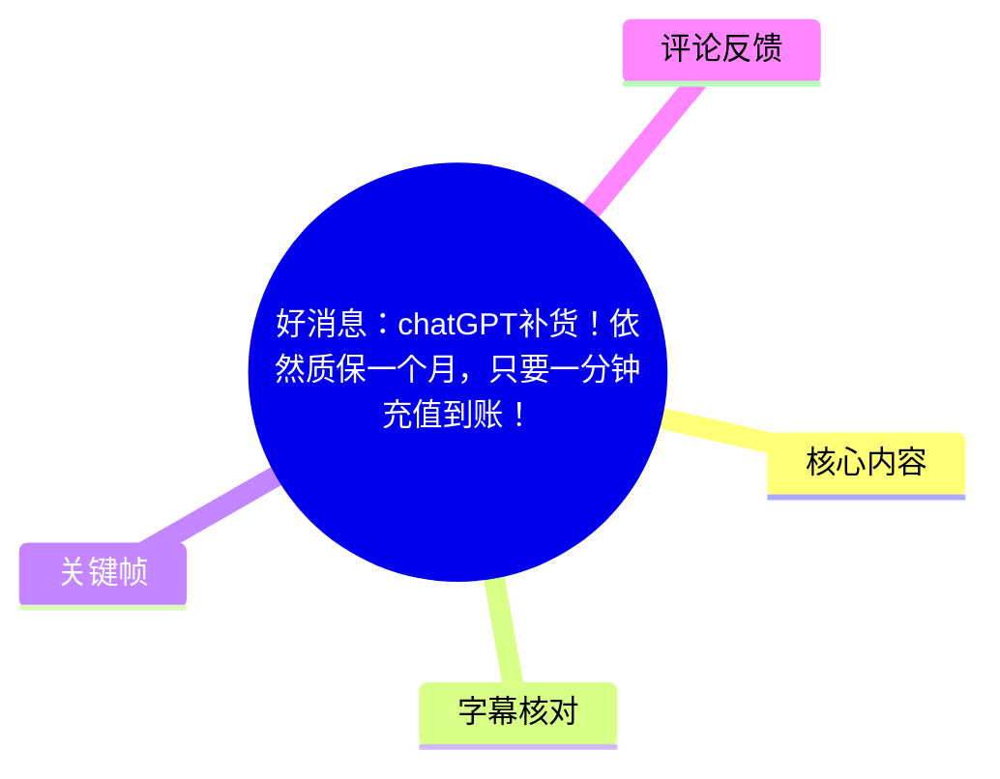
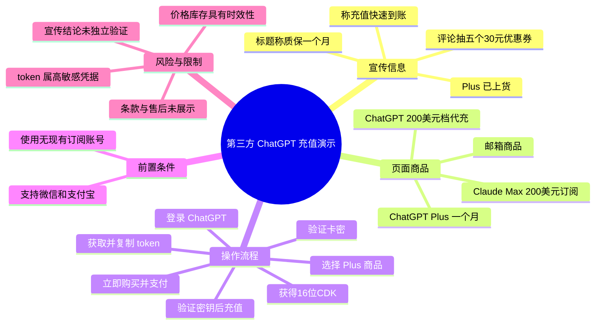
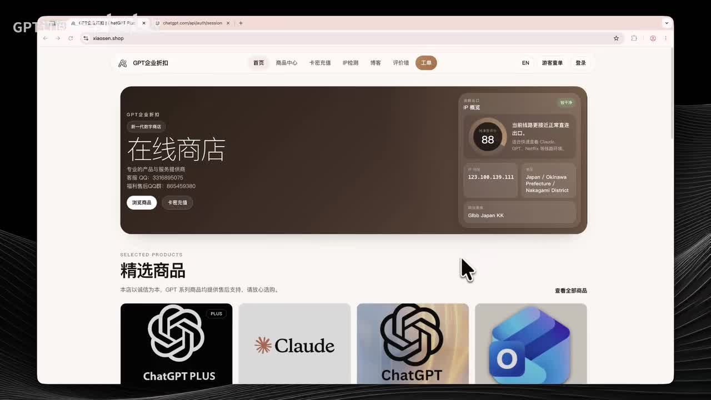
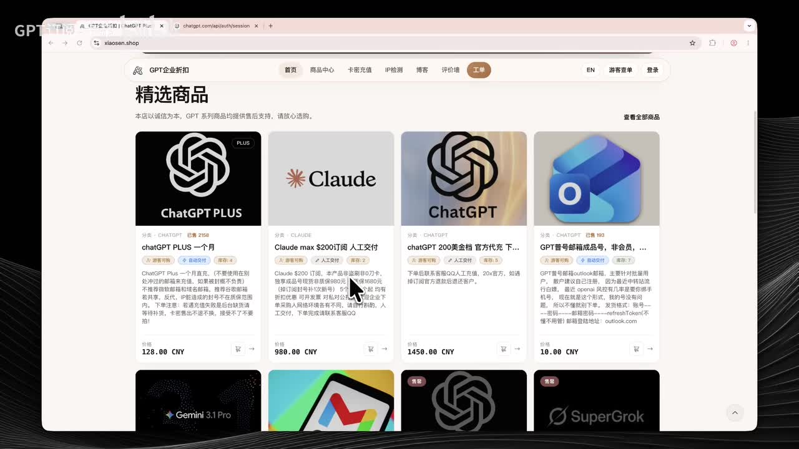
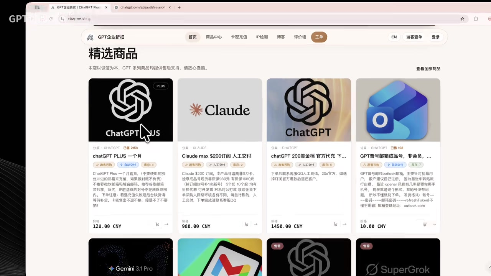

# 好消息：chatGPT补货！依然质保一个月，只要一分钟充值到账！

> 来源：[Bilibili 视频](https://www.bilibili.com/video/BV1bvLM6LEa3) 
> UP 主：GPT订阅-卡帝｜视频时长：2 分 17 秒｜合集：AIcode  
> 视频简介提及：GPT Plus、GPT Pro、Claude Max 等产品，站点为 `xiaosen.shop`；并称将从评论中抽取 5 个 30 元优惠券。

## 小结

视频是一则第三方 AI 订阅充值服务的商品宣传与操作演示。UP 主称 ChatGPT Plus 已“上货”、可通过购买 CDK（卡密）后向 ChatGPT 账号充值，并将该流程描述为“秒充秒到”。标题额外宣称“质保一个月、只要一分钟充值到账”，但正文演示并未展示质保条款、实际到账耗时记录或售后执行方式。

演示的核心路径是：在第三方商城选择 ChatGPT Plus 商品并下单，使用微信或支付宝付款，取得 **16 位卡密/CDK**；在卡密充值页面验证卡密后，登录 ChatGPT，进入 token 页面复制一段令牌文本，再将令牌粘贴回第三方页面，验证密钥并执行充值。

关键前置限制是，UP 主明确提示应使用“**当前没有订阅**”的 ChatGPT 账号充值。视频没有说明已有 Plus/Pro 订阅、不同地区账号、风控状态异常账号或付款争议情形下会发生什么，也没有展示失败处理、退款机制及售后边界。

从画面可见，该站点除 ChatGPT Plus 外还陈列 Claude、ChatGPT 充值及邮箱商品；商品卡片上可见的价格包括 ChatGPT Plus 一个月 **128.00 CNY**、Claude Max $200 订阅人工交付 **980.00 CNY**、ChatGPT 200 美金档官方代充商品 **1450.00 CNY**。这些是录屏当时页面信息，不等于持续有效的市场价格或官方定价。

此内容适合需要理解视频中“第三方 CDK + token 验证”操作链路的人阅读；不宜将视频中的“稳定”“官方凭证”“秒到账”作为已被独立验证的事实。尤其是 token 属于高敏感账户凭据，将其交给第三方页面会带来账户控制、隐私与订阅安全风险，应先自行核验服务主体、授权关系、数据处理方式和售后规则。

## 思维导图

## 目录

- [背景、商品与时效性](#背景商品与时效性-0000)
- [视频宣称的充值方式](#视频宣称的充值方式-0004)
- [操作步骤：购买、卡密验证与账户充值](#操作步骤购买卡密验证与账户充值-0029)
  - [1. 选择 Plus 商品并下单](#1-选择-plus-商品并下单-0029)
  - [2. 支付并验证 16 位卡密](#2-支付并验证-16-位卡密-0046)
  - [3. 登录 ChatGPT 并取得 token](#3-登录-chatgpt-并取得-token-0111)
  - [4. 验证密钥与执行充值](#4-验证密钥与执行充值-0130)
- [限制、风险与可迁移经验](#限制风险与可迁移经验-0151)
- [活动与结尾信息](#活动与结尾信息-0151)
- [字幕比对](#字幕比对)
- [评论分析](#评论分析)
- [处理记录](#处理记录)

## 背景、商品与时效性 [00:00](https://www.bilibili.com/video/BV1bvLM6LEa3?t=0)

UP 主在开场称近期 Plus“已经上货了”“非常稳定”，并表示其通过“CDK 的方式”向用户账号直充；同时口述还提供 Claude $200 档、GPT Pro 等其他产品。这里的“稳定”“官方凭证”“直充”等均为视频发布者的陈述，素材中未提供可供独立核验的授权文件、服务协议或交易凭证细节。

画面中录制的是名为“GPT企业折扣”的第三方网站首页及商品区。导航栏可见“首页、商品中心、卡密充值、IP检测、博客、评价墙、工单”等入口；首页还显示 IP 环境信息模块。该信息表明视频演示依赖第三方站点，而不是在 ChatGPT 官方订阅结算页面内直接完成。

> 图：该帧展示第三方网站首页、“浏览商品”“卡密充值”等入口及 ChatGPT Plus、Claude 等商品缩略卡。其价值在于确认视频中的操作环境是第三方商城，不是 OpenAI 官方付款界面。

商品列表画面中，能读取到以下录屏时点的部分商品与标价：

| 画面商品名称/描述 | 录屏可见价格 | 说明 |
| --- | ---: | --- |
| chatGPT PLUS 一个月 | 128.00 CNY | 商品卡明确显示“一个月”。 |
| Claude max $200 订阅 人工交付 | 980.00 CNY | 商品卡描述为人工交付。 |
| chatGPT 200 美金档 官方代充（名称截断） | 1450.00 CNY | 名称在画面中被截断，不能据此补全具体条款。 |
| GPT 普号邮箱成品号，非会员……（名称截断） | 10.00 CNY | 仅能确认存在该类商品卡及标价。 |

> 图：该帧同时呈现 ChatGPT Plus、Claude、ChatGPT 代充和邮箱商品的商品卡及价格，是记录视频中具体商品陈列与价格信息的关键依据。价格、库存和商品说明均可能随时变化。

### 时效性说明

- 视频时长为 137 秒，素材抓取时间为 2026-07-16；商品页内容仅反映录屏及抓取素材所对应时点。
- 标题中的“补货”“质保一个月”“一分钟充值到账”属于时效性和服务承诺信息，视频未展示库存后台、质保合同、退款规则或实际一分钟计时过程。
- 页面价格、可售库存、支付方式、账号可用性和 AI 平台政策都可能改变，不能据此推导当前仍可按相同条件购买或充值。

## 视频宣称的充值方式 [00:04](https://www.bilibili.com/video/BV1bvLM6LEa3?t=4)

根据 00:04.910—00:29.030 的 ASR，UP 主称流程是“通过 CDK 的方式直冲到大家的账号”，并描述为快捷高效、基本“秒充秒到”。随后说明本期主要演示 Plus 如何充值。

视频技术上涉及两类信息：

1. **16 位卡密/CDK**：支付后由第三方服务交付，用于在其卡密充值页进行验证。
2. **ChatGPT token**：UP 主要求用户登录 ChatGPT 后打开 token 页面，复制数十行代码，再回填至第三方充值页面验证。

这里需要区分两个层次：

- **视频展示的操作事实**：第三方页面要求输入 CDK 和 token，且视频口述验证通过后会显示邮箱和当前套餐。
- **无法由视频证实的服务结论**：CDK 来源是否为“官方凭证”、token 如何被保存/处理、充值如何在平台侧完成、服务能否稳定维持一个月，均未在素材中证实。

## 操作步骤：购买、卡密验证与账户充值 [00:29](https://www.bilibili.com/video/BV1bvLM6LEa3?t=29)

以下仅整理视频实际演示顺序，不构成对第三方充值渠道安全性、合规性或成功率的背书。

### 1. 选择 Plus 商品并下单 [00:29](https://www.bilibili.com/video/BV1bvLM6LEa3?t=29)

1. 打开第三方网站的 Plus 商品页面。
2. 视频在 00:39.630—00:45.680 处称商品“已经到货”。
3. 点击“立即购买”。
4. UP 主称页面支持微信和支付宝在线支付，但未在视频中实际走完支付页面。

> 图：该帧中鼠标位于“ChatGPT Plus”商品区域，且能看到商品列表中的 Plus 月订阅、Claude 订阅和代充卡片，有助于对应“先点开 Plus 商品页面”的操作起点。

**视频未覆盖的支付信息：**

- 支付订单的具体金额、订单号、商家主体及发票信息；
- 支付后的发货时长和异常订单处理；
- 是否需要实名、是否存在地区限制；
- 商品说明中“质保”的具体定义、起止时间和索赔条件。

### 2. 支付并验证 16 位卡密 [00:46](https://www.bilibili.com/video/BV1bvLM6LEa3?t=46)

依据 00:46.990—01:11.240 的字幕，UP 主描述的后续步骤为：

1. 完成常规的微信或支付宝在线支付。
2. 获取一个 **16 位卡密**。
3. 打开“卡密充值页面”。
4. 输入该 16 位卡密/CDK。
5. 点击“验证卡密”。
6. 页面应显示“卡密验证通过”。

视频在此处是口述流程，没有提供完整的支付录屏、真实卡密样例或验证失败画面。因此可以确认的是视频声称存在这一验证步骤，不能确认具体发卡机制、卡密有效期、一次性使用规则及失败后的补救路径。

### 3. 登录 ChatGPT 并取得 token [01:11](https://www.bilibili.com/video/BV1bvLM6LEa3?t=71)

1. 验证卡密后，UP 主要求打开 ChatGPT 页面。
2. 在该页面登录用户的 ChatGPT 账号。
3. 约在 01:21.310—01:27.440，UP 主称登录后点击打开 token，并表示页面中会出现“几十行”的代码。
4. 将这些代码全选并复制。

**敏感信息提示：**  
token 通常可用于验证或维持账户会话，属于不应随意向他人披露的高敏感信息。视频没有说明 token 的有效期、权限范围、服务端是否留存、是否加密传输、是否可撤销，或服务方是否会在充值后删除该信息。若用户考虑执行类似流程，至少应避免在公共设备、录屏、聊天窗口或不可信页面中暴露此类凭据，并优先查看平台官方账户安全设置和第三方隐私条款。

### 4. 验证密钥与执行充值 [01:30](https://www.bilibili.com/video/BV1bvLM6LEa3?t=90)

根据 01:30.040—01:50.260 的 ASR，视频要求用户：

1. 返回第三方充值页面；
2. 在页面输入或粘贴已复制的 token；
3. 点击“验证密钥”；
4. 在显示验证通过、邮箱及当前套餐后继续；
5. 确认使用的是“**现在没有订阅的一个账号**”；
6. 点击“确认充值”。

UP 主称点击后即可充值到账号。这一“无现有订阅账号”的条件是视频中最明确的适用限制。对于已有订阅的账号，视频没有给出是否无法操作、覆盖订阅、叠加周期、退款或降级的说明。

## 限制、风险与可迁移经验 [01:51](https://www.bilibili.com/video/BV1bvLM6LEa3?t=111)

### 视频已明确的限制

| 项目 | 视频中的信息 | 需要注意的边界 |
| --- | --- | --- |
| 账户状态 | 应使用当前没有订阅的账号 | 未解释已有订阅账号如何处理。 |
| 支付方式 | 支持微信、支付宝在线支付 | 未演示支付过程及异常处理。 |
| 卡密形式 | 支付后获得 16 位卡密/CDK | 未展示卡密规则、有效期或补发政策。 |
| 凭据验证 | 需复制 ChatGPT token 并验证密钥 | 未交代 token 的数据处理与权限风险。 |
| 到账速度 | UP 主称“秒充秒到” | 视频没有提供独立计时、到账记录或失败案例。 |
| 质保 | 标题称“质保一个月” | 正文没有展示质保范围、申请入口或证明材料。 |

### 风险判断

1. **账户凭据暴露风险**  
   将 token 粘贴到第三方页面，意味着第三方可能获得与账户会话相关的敏感信息。素材无法确认其是否只用于单次操作、是否留存或是否存在后续账户安全影响。

2. **服务承诺缺少可核验细节**  
   “稳定”“官方凭证”“秒到账”“质保一个月”均是商家/UP 主的宣传口径；视频没有展示可审计的证明、正式授权关系或售后协议。

3. **订阅状态与平台规则风险**  
   视频仅适用于其口述的“无订阅账号”。账号所在地区、既有付款记录、平台风控及服务条款都可能影响结果，视频没有覆盖。

4. **价格与库存波动风险**  
   商品标价和“上货”状态具有时间敏感性。录屏中 128.00 CNY 的 Plus 月订阅价格只是当时页面读数，不能作为购买建议、官方价格或价格承诺。

### 可迁移经验

- 对任何涉及账户充值的流程，先区分“平台官方支付”与“第三方代充/卡密服务”；二者的资金流、凭据处理和争议解决机制并不相同。
- 若页面要求提供 cookie、token、验证码或其他登录态信息，应将其视为高风险操作；在确认服务主体、权限范围和数据删除机制前，不应轻易提交。
- 宣传中的到账时长、质保和稳定性应对应到可查的订单规则、售后入口、适用账号类型和例外情形，而不应只依据口述或单次录屏。
- 若仅需订阅服务，优先比较官方订阅路径与第三方路径的安全性、凭据暴露范围、售后可追溯性及价格总成本。

## 活动与结尾信息 [01:51](https://www.bilibili.com/video/BV1bvLM6LEa3?t=111)

在 01:51.660—02:07.220，UP 主再次称流程“很简单”“秒充秒到”，并表示会在评论区抽取 **5 个 30 元优惠券**，次日开奖；02:08.620—02:14.630 则称将私信中奖观众并结束视频。

该抽奖活动是视频发布者口述的促销信息。后续热评中有 UP 主账号发布“恭喜五位宝子中奖”的留言，可作为其宣称开奖的后续线索，但无法仅凭该评论验证优惠券是否实际发放、金额是否到账或全部获奖者身份。

## 字幕比对

| 字幕来源 | 完整性 | 专有名词 | 时间轴 | 主要问题 |
| --- | --- | --- | --- | --- |
| Bilibili 站内字幕 | 未提供可用字幕 | 无法评估 | 无法使用 | 素材明确标注未提供可用站内字幕。 |
| 本次 ASR 字幕 | 较完整；10 段，语音覆盖约 121.9 秒，占视频约 89.55% | 存在明显误识别 | 完整，含毫秒级 SRT 起止时间 | “cloud20成”“GPTA”“XGPT页”“点净”等词语不准确；部分句首结尾因口语和断句不完整。 |

### 采用策略与校正

本次整理以 **ASR SRT 时间轴** 为唯一可用的逐段时间依据，章节链接均按 SRT 起止时间换算为秒数；未依据文字顺序臆测时间位置。

ASR 诊断显示：

- 识别语言：中文，置信度约 0.9990；
- 音频时长：136.128 秒；
- `noAudioStream` 未标记为 `true`，说明本素材存在音轨，不能将字幕缺失归因为无音轨；
- 无大段语音空缺警告。

结合上下文与关键帧，对下列词语作了审慎规范化，但不扩展原视频未说的信息：

| ASR 原文 | 正文处理 | 依据 |
| --- | --- | --- |
| plus | ChatGPT Plus / Plus | 视频标题、商品卡“chatGPT PLUS 一个月”。 |
| cloud20成 | Claude $200 档订阅 | 视频简介写有“claude max 200 美金”，商品卡可见“Claude max $200订阅”。 |
| GPT Pro 的一些直冻 | GPT Pro 的相关产品 | “直冻”语义不清，正文未将其解释为具体技术或服务形式。 |
| XGPT页 / GPTA账号 | ChatGPT 页面 / ChatGPT 账号 | 上下文均围绕 ChatGPT 账号登录；仍保留“视频未展示具体页面路径”的限制。 |
| token | token | 原词可辨，属于视频所称需要复制的代码/凭据。 |
| 点净、点几圈充直 | 点击、确认充值 | 由句义和流程推定，仅作为操作动词校正。 |

## 评论分析

以下仅处理素材中可获取的热评前三条。评论是用户或 UP 主的主观表达，不能替代交易、服务质量或抽奖结果的独立证据。

1. **faia1024（4 赞）：“这么贵？三到四手了吧？”**  
   - 观点：质疑商品价格偏高，并推测服务可能经过多层转售。  
   - 价值：反映部分观众对第三方订阅价格与供应链透明度的担忧。  
   - 可信度边界：评论未提供价格对比、订单证据或供应来源，不能据此确认存在多层转售。

2. **GPT订阅-卡帝（2 赞）：公布五位中奖者并提及“@人太难了”**  
   - 观点/补充：UP 主账号称已经开奖并祝贺五位用户。  
   - 价值：与视频中“抽 5 个 30 元优惠券、次日开奖”的承诺相呼应。  
   - 可信度边界：该留言只能说明账号发布过开奖声明，不能证明优惠券已成功发放，也不能确认获奖名单完整性。

3. **化学ksp（1 赞）：“很好用”**  
   - 观点：对服务给出正向主观评价。  
   - 价值：提供一条使用体验反馈。  
   - 可信度边界：没有说明购买产品、使用时长、账号状态、支付情况或评价标准，证据强度有限。

## 处理记录

- **Worker ID**：worker-mrj0wjed-b0c290ad
- **模型**：gpt-5.6-terra
- **调用工具与素材**：视频元数据、ASR 结果 JSON、ASR SRT 时间轴字幕、关键帧清单、可获取热评前三条。
- **使用的应用工具**：素材编排任务提供的音频 ASR（`medium`，CUDA、float16）、关键帧抽取、Bilibili 元数据与评论抓取；本整理未额外执行外部网页验证。
- **字幕选择**：站内字幕不可用；已检查本次 ASR，确认存在音轨且 ASR 含时间戳。正文采用 ASR SRT 的真实起止时间，并以关键帧和上下文校正少量明显专名误识别。
- **关键帧选择依据**：选用 `frames/frame-001.jpg` 说明第三方网站与导航入口，`frames/frame-002.jpg` 记录商品种类和画面标价，`frames/frame-004.jpg` 对应选择 ChatGPT Plus 商品的演示步骤；未将画面中无法清晰辨认的文字作为确定事实。
- **缓存清理**：未提供本任务运行环境中的缓存清理日志；未声称已执行缓存删除。
- **未解决问题**：无法从素材验证第三方服务的授权关系、CDK 来源、token 的传输/留存方式、质保和退款条款、实际到账速度、现时库存与价格，以及抽奖优惠券的实际发放情况。
