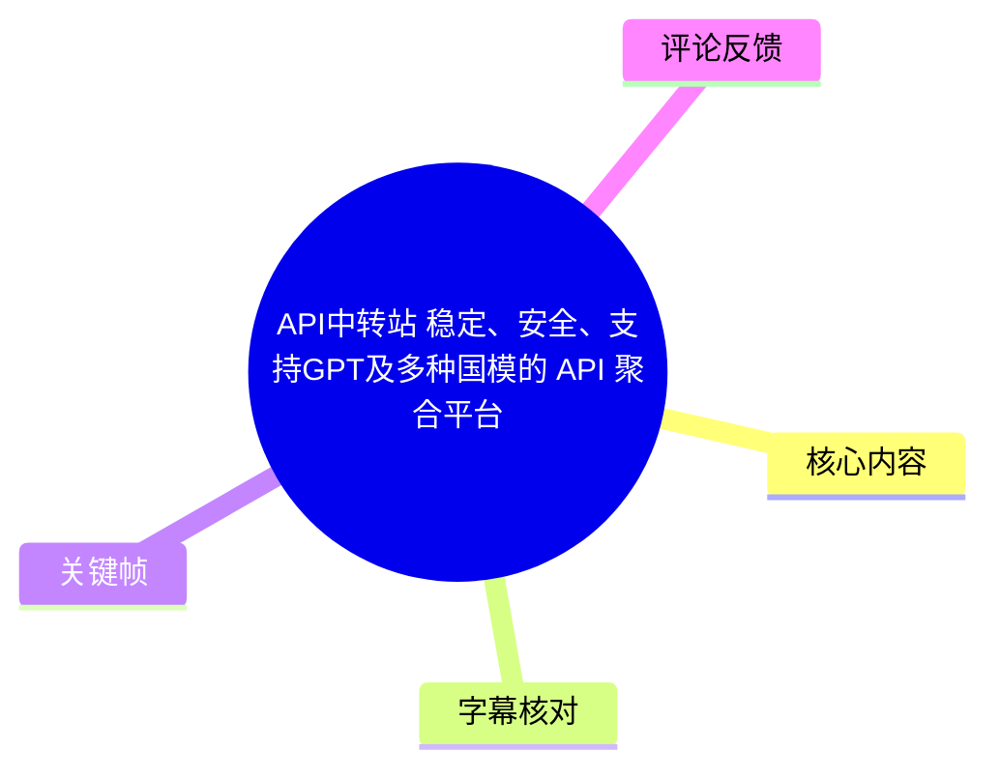
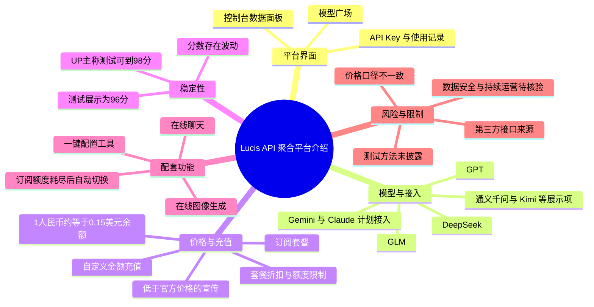
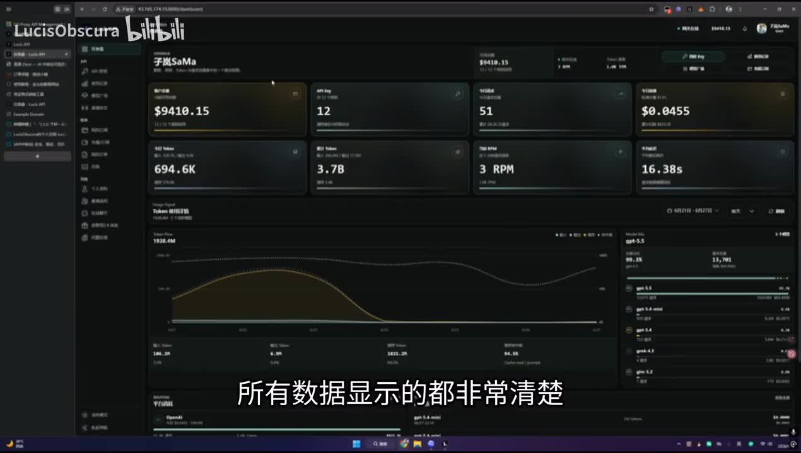
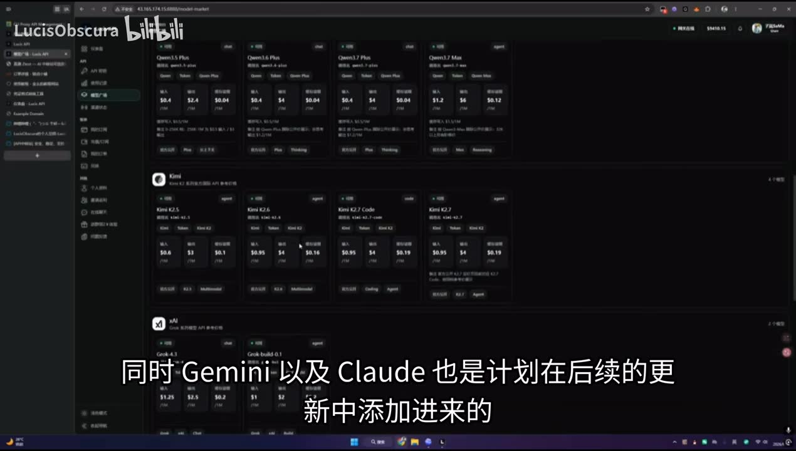
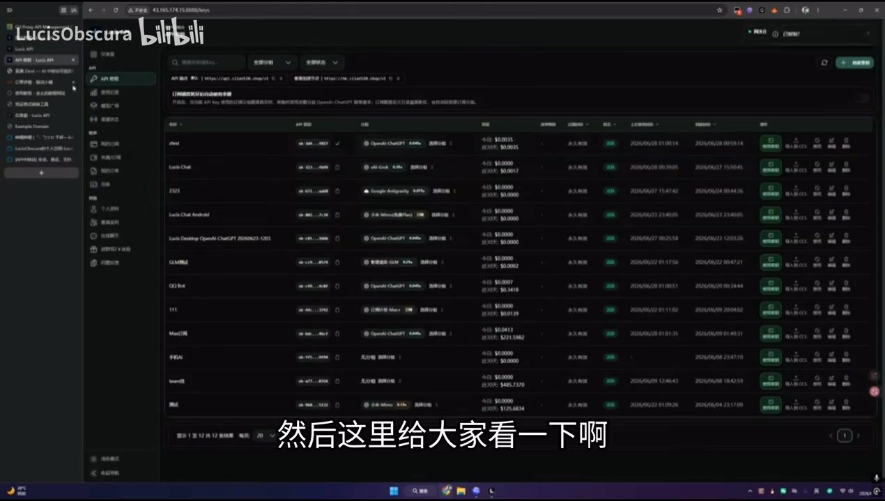
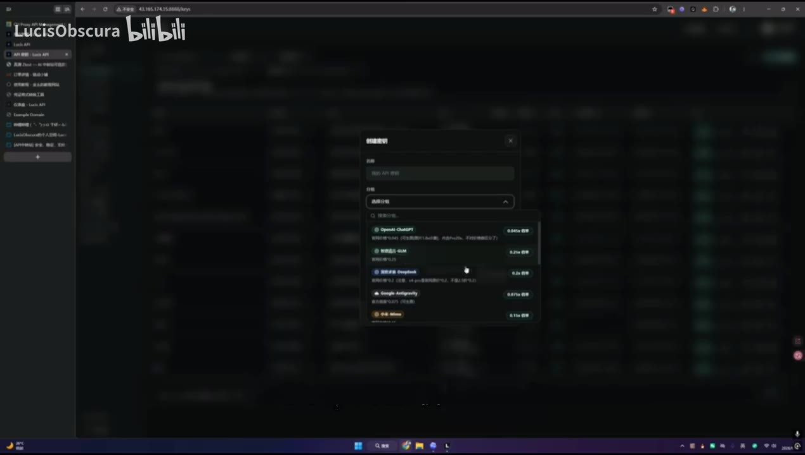

# [API中转站] 稳定、安全、支持GPT及多种国模的 API 聚合平台

> 来源：[Bilibili 视频](https://www.bilibili.com/video/BV1nETP6wEF4)<br>
> UP 主：LucisObscura｜视频时长：4 分 47 秒｜合集：AIcode<br>
> 视频定位：对「Lucis API」这一第三方 API 聚合/中转服务的功能、定价、稳定性测试与配套工具进行推广介绍。

## 小结

视频展示了一个名为 Lucis API 的第三方 API 聚合平台后台。UP 主依次演示控制台数据面板、模型广场、API Key/使用记录、稳定性测试、充值与订阅，以及在线聊天和一键配置工具。平台宣传重点是：以低于官方 API 的价格提供多模型调用，并强调稳定性、售后与隐私。

按照视频口述，该平台当时已接入 GPT、GLM、DeepSeek 等主要模型，且展示页中还能看到通义千问、Kimi、xAI/Grok 等品牌或模型分类；Gemini 与 Claude 被称为“计划后续添加”。这是视频发布时的服务状态陈述，不代表目前仍然可用，也不代表各模型均由对应官方直接提供。

价格是视频的主要卖点，但不同位置的口径并不完全一致：UP 主口述称某 GPT 相关价格约为官网价的 1%、GLM 约为 20%、DeepSeek 约为官网两折；视频简介则写有“ChatGPT 分组计费倍率 0.045x”、综合价格约为官网价格的 4.5%，并附带特定缓存命中率条件。因此，价格只能作为历史宣传信息，实际下单前应以平台模型广场、账单规则、缓存规则和官方最新价格为准。

视频称稳定性测试成绩可达 96 分，UP 主还称自己测试到过 98 分，并解释分数会随波动变化。但视频没有说明测试网站名称、测试样本、持续时长、并发量、地域、模型版本或评分指标，不能将该结果外推为长期 SLA、所有模型的可用性，或任何使用者都能复现的结论。

这份内容适合正在比较多模型 API 接入方式、需要仪表盘/密钥管理/调用记录，或希望快速接入 OpenAI 兼容应用的开发者参考。对于企业、生产业务和涉及敏感数据的场景，重点不应仅是价格，还应额外核验服务主体、数据处理条款、日志保留与删除机制、密钥保护、故障赔付、合规资质以及模型来源。

## 思维导图





## 目录

- [背景、定位与时效性](#背景定位与时效性)
- [控制台、模型广场与调用记录](#控制台模型广场与调用记录)
- [模型覆盖、价格宣传与来源说明](#模型覆盖价格宣传与来源说明)
- [稳定性测试：展示结论与证据边界](#稳定性测试展示结论与证据边界)
- [充值、订阅及企业使用提示](#充值订阅及企业使用提示)
- [配套工具与接入步骤](#配套工具与接入步骤)
- [结论、风险与核验清单](#结论风险与核验清单)
- [字幕比对](#字幕比对)
- [评论分析](#评论分析)
- [处理记录](#处理记录)

## 背景、定位与时效性 [00:00](https://www.bilibili.com/video/BV1nETP6wEF4?t=0)

视频开头直接进入 Lucis API 控制台，目标是介绍一个面向开发者的 API 中转/聚合站：用户在该站创建密钥、选择模型、充值余额，再将密钥用于支持相应协议的客户端或应用中。

从视频简介可提取的历史宣传信息包括：

- 官网：`https://www.zilan520.shop`
- 交流群：`717986113`
- 注册后可联系 UP 主领取约 2 元体验余额。
- 充值口径：`1 元人民币 = 0.15 美元`站内余额。
- 宣传提供全球 API 接口与加速线路、图像生成功能、在线聊天站点和一键配置工具。
- UP 主欢迎团队与企业用户咨询，并称充值可开票。

这些均是发布者的自述和推广信息。尤其是官网可访问性、可用模型、额度、赠金、发票、线路与服务规则均可能变化；简介中还提示若站点无法访问可尝试开启网络加速节点，这意味着访问条件本身可能受网络环境影响。

## 控制台、模型广场与调用记录 [00:08](https://www.bilibili.com/video/BV1nETP6wEF4?t=8)

UP 主首先展示控制台，并称数据“显示得非常清楚”，用户可直观看到使用数据。画面中的后台以卡片和图表汇总余额、API Key 数、调用/Token 数据、请求速率、平均响应时间，以及按模型划分的消耗或使用情况。



> 图：该关键帧展示了平台控制台的深色仪表盘，包括余额、API Key 数、Token、请求速率、响应时间及趋势图。它对应视频对“数据界面”的介绍，可用于理解该服务不仅是转发入口，也试图提供调用可观测性；但画面中的数值是演示账户数据，不能用于推断普通用户的真实成本或性能。

随后视频进入模型广场。UP 主强调所有模型“明码标价”，并称实际价格由模型广场标价与所属分组倍率共同决定。也就是说，理解最终成本不能只看单个模型卡片，还必须确认账户所在分组、模型的输入/输出单价、缓存命中与未命中规则，以及可能的订阅额度限制。



> 图：关键帧中可见模型广场按厂商或系列排列，画面可辨识到 Qwen、Kimi、xAI 等区域，并在模型卡片上展示多项价格信息。该图是核对“支持哪些模型、如何标价”的直接视觉依据；但截图分辨率不足以可靠抄录每个具体模型和单价，因此不将模糊数值写为确定事实。

视频还展示了 API Key 列表与调用配置/记录区域，说明平台具备多个密钥、关联模型、余额或额度、创建/使用时间等管理信息。对于开发者而言，这类页面的实际价值在于区分项目、轮换密钥和追溯消耗；但视频未展示密钥权限粒度、IP 白名单、速率限制、审计导出或日志保留周期。



> 图：该关键帧展示了多个 API Key 的列表、所关联模型及状态/操作列，证明视频确实演示了密钥管理界面。它有助于理解“一站式管理”的使用场景，同时也提示用户：密钥泄露、权限控制和使用记录中的敏感信息需要自行评估。

## 模型覆盖、价格宣传与来源说明 [00:29](https://www.bilibili.com/video/BV1nETP6wEF4?t=29)

### 视频所称模型范围

UP 主口述称，平台当时支持除 Gemini 和 Claude 外“大部分主要厂商”的模型，并点名 GPT、GLM、DeepSeek 等；Gemini 与 Claude 被描述为后续更新计划。结合模型广场画面，可以确认画面存在 Qwen、Kimi、xAI 等模型或厂商分类展示。

ASR 将部分专有名词识别成“XBT”“JLM”“DeepSec”“Gimbali”“Cloud”。根据视频标题、简介、屏幕字幕和上下文，应分别理解为 GPT/ChatGPT、GLM、DeepSeek、Gemini、Claude；此处是对 ASR 误识别的语义校正，而非新增模型信息。

### 视频宣称的价格

视频中的价格表述可归纳为：

| 项目 | UP 主在视频中的说法 | 需要注意的条件 |
| --- | --- | --- |
| GPT/ChatGPT 相关模型 | “价格是官网价的 1%” | 未说明对应具体型号、输入/输出、缓存、分组、额度或计费周期。 |
| GLM | “价格是官网的 20%” | 未说明具体版本及官方对比基准。 |
| DeepSeek | “低于官网”，并称约为官网“两折” | 同样缺少模型版本、缓存及输入/输出价格拆分。 |
| 免费模型 | 称最近提供“免费的小模型”供体验 | 免费模型名称、期限、限额及质量标准均未展示。 |
| OpenCloud 应用用户 | UP 主称“非常友好” | ASR 中该名称可能有误，视频未展示清晰产品定义或兼容细节。 |

视频简介还提供了另一组更细的宣传口径：

- ChatGPT 分组计费倍率：`0.045x`。
- 综合价格：约为官网价格的 `4.5%`。
- 特定条件下：GPT-5.5 且缓存命中率为 `95%` 时，每 `1M token` 价格不到 `0.3 元`。
- 国产模型：宣传为官方 API 调用价的 `15%–25%`。

“GPT 约官网 1%”与简介中的“ChatGPT 分组倍率 0.045x / 综合约 4.5%”显然不宜直接视作同一无条件结论。更合理的理解是：二者可能对应不同模型、分组、缓存命中率、输入输出方向或计费版本，但视频没有把对应关系讲清楚。实际采购时应按目标模型发起小额、可复算的真实请求，并记录响应 Token、缓存 Token、账单金额与官方同期公开价进行对比。

### 成本为何较低：视频给出的解释

UP 主称低价原因在于使用“第三方厂商接口”，以降低会员成本。这也意味着该站不是简单等同于模型官方 API：

1. 请求可能经由中间服务商、上游账号体系或转发线路。
2. 实际模型身份、版本、区域路由和可用功能可能随上游调整。
3. 数据处理责任、故障处置路径和服务连续性需要以站点协议及服务商承诺为准。
4. 对于包含源代码、客户数据、个人信息、密钥、商业文档的请求，应先确认是否允许发送至第三方中转和其上游。



> 图：画面显示创建/配置项目时可选择多种模型或服务项。这张图能补充模型广场的“可选择性”，但弹窗中文字无法完全可靠辨认，因此只能证明存在多选配置界面，不能作为每项价格、模型版本或官方来源的完整证据。

## 稳定性测试：展示结论与证据边界 [01:44](https://www.bilibili.com/video/BV1nETP6wEF4?t=104)

UP 主在约 1 分 44 秒处转入测试结果，称测试网站“非常严谨”，在该网站获得高分“不容易”。视频画面所述总评分为 **96 分**；UP 主随后说明测试存在波动，因而会失分，并称自己刚才的测试曾达到 **98 分**，据此判断稳定性“可以完全放心”。

这里需要严格区分：

- **可记录的事实**：视频展示了一个总分为 96 的测试页面，UP 主口述另一次结果为 98。
- **UP 主的判断**：该成绩说明服务稳定性强。
- **无法由视频确认的事项**：测试平台名称、评分公式、请求模型、请求数量、测试时段、地区、网络、并发、限流、错误率、P50/P95/P99 延迟和跨日可用性。

因此，96/98 分应被视为单次或少量测试展示，而非长期运营指标。若稳定性影响生产环境，建议自行验证：

1. 使用计划部署的模型、地区、并发数和请求体积。
2. 至少持续观测多个时段，而非只测一次。
3. 记录成功率、429/5xx 比例、首 Token 延迟、完整响应时间、超时率和重试次数。
4. 测试流式输出、工具调用、图像生成及长上下文等实际业务能力。
5. 明确上游故障时的降级模型、退款、赔付和支持响应机制。

## 充值、订阅及企业使用提示 [02:31](https://www.bilibili.com/video/BV1nETP6wEF4?t=151)

UP 主在充值部分特别称平台“可以开票”，欢迎企业用户咨询。视频口述的基础充值比例为：

```text
1 人民币 = 0.15 美元站内余额
```

UP 主称该比例与美元汇率基本等同，并表示相对美元汇率会便宜一些。平台支持自定义金额快捷充值，也提供订阅套餐。视频对订阅的描述是：相当于按量计算，套餐相较普通方式“便宜 30% 多”，但存在额度限制，用户应按自身需求选择。

实际选择充值或套餐前，至少应确认：

- 站内美元余额是否可退款、是否有有效期、是否受汇率或活动影响。
- 套餐额度按日、月、模型、分组还是 Token 类型计算。
- 订阅到期、超额、模型下架或价格变化时如何处理。
- “开票”对应的开票主体、可开票类型、税率、金额门槛和流程。
- 是否有企业合同、服务等级协议、对公付款与售后响应承诺。

视频仅提供宣传级说明，未展示订单页、套餐条款或发票流程，故不能据此确认具体权益。

## 配套工具与接入步骤 [03:18](https://www.bilibili.com/video/BV1nETP6wEF4?t=198)

### 1. 订阅额度耗尽后的自动切换

UP 主介绍了一个“订阅额度耗尽后自动使用 UI”的功能。其表述是：在订阅分组额度用完后，自动切换至另一个分组，以避免用户执行任务中途因额度耗尽而中断。

这是一个面向连续任务的容错思路，但视频没有明确：

- “UI”及目标分组的精确定义；
- 切换是否改变模型、价格、上下文、速率或输出质量；
- 是否需要用户手动授权或预设优先级；
- 切换失败、余额不足或全部分组耗尽时的行为；
- 是否会产生超出预期的额外费用。

因此，若用于自动化任务，应先设置消费上限和告警，并通过非生产任务验证切换后的模型一致性和账单表现。

### 2. 在线聊天与图像生成

视频称平台提供在线聊天，可供用户快速测试模型；同时可快速进行在线图像生成。该功能适合在正式接入 API 前快速检查某个模型是否满足需求。

但视频未展示具体聊天模型、上下文长度、文件上传、历史记录保存、图像生成模型、图片保存期限、生成次数限制和内容审核规则。含敏感内容的聊天或图像请求尤其不应因“在线测试方便”而跳过数据处理评估。

### 3. 一键配置软件

UP 主称自己制作了一键配置软件，并将其与 “CZ Switch”（ASR 可能存在名称误识别）进行对比。视频描述的最简接入流程为：

1. 在平台完成注册并获取 API 密钥。
2. 打开该一键配置软件。
3. 输入平台密钥。
4. 点击“配置”。
5. 之后即可接入相应应用或客户端使用。

该流程体现了“用一个站内密钥替代手工填写多项配置”的便利性，但视频没有展示软件下载地址、支持的操作系统、是否开源、实际写入的 Base URL、配置文件位置、是否会上传密钥，或如何撤销配置。

在安装此类工具前，建议：

- 仅从发布者可验证的官方渠道下载；
- 使用独立、低额度、可随时撤销的测试 Key；
- 检查配置变更的 Base URL、模型名及环境变量；
- 关闭屏幕录制、同步盘或日志中的明文密钥暴露；
- 验证软件卸载后是否会清除配置和缓存凭据。

## 结论、风险与核验清单 [04:14](https://www.bilibili.com/video/BV1nETP6wEF4?t=254)

视频结尾再次强调平台的稳定性、质量、隐私和服务。UP 主称遇到问题或建议可联系自己，通常可较快处理，并对售后服务作出较强正面评价。注册后联系 UP 主可获得约 2 元体验余额，也是结尾再次提及的推广条件。

从可迁移的实践经验看，多模型聚合平台真正值得评估的不是单一低价，而是以下四个维度能否同时满足：

| 维度 | 应核验的问题 |
| --- | --- |
| 兼容性 | 是否兼容目标 SDK、OpenAI API 格式、流式响应、工具调用、视觉/图像及所需模型版本。 |
| 成本可复算性 | 输入、输出、缓存、分组倍率、套餐、超额与汇率是否能通过账单和 Token 数独立复算。 |
| 稳定性 | 是否能在自身网络、业务模型、并发和时间跨度下达到可接受的成功率与延迟。 |
| 安全与合规 | 服务主体、隐私条款、请求/日志保留、上游路径、密钥保护、数据删除和企业合同是否清晰。 |

本视频的限制也较明确：

- 它是服务推广视频，关键论断主要来自 UP 主自述。
- 模型支持与价格会随上游、分组、缓存规则和活动变化。
- “稳定性高分”缺少可复现实验条件。
- 数据安全、隐私保护、模型上游及企业合规没有通过文档或第三方材料证实。
- 热评中已出现对价格竞争力、数据安全和持续运营的质疑，说明用户不应把营销描述直接等同于可验证保障。

建议将视频作为发现候选服务的入口，而非最终采购依据。先以小额余额、非敏感测试数据和可撤销密钥完成兼容性、账单、延迟和支持响应测试，再决定是否扩大使用范围。

## 字幕比对 [00:00](https://www.bilibili.com/video/BV1nETP6wEF4?t=0)

| 字幕来源 | 完整性 | 专有名词 | 时间轴 | 主要问题 |
| --- | --- | --- | --- | --- |
| Bilibili 站内字幕 | 不可用 | 无法评估 | 无法评估 | 素材明确注明未提供可用站内字幕；字幕抓取还出现“Missing JSON resource URL”错误。 |
| 本次 ASR 字幕 | 覆盖了开场、功能、价格、测试、充值、工具与结尾 | 存在多处误识别 | 未提供逐句时间戳 | 将 GPT/ChatGPT 识别为“XBT”，GLM 识别为“JLM”，DeepSeek 识别为“DeepSec”，Gemini 识别为“Gimbali”，Claude 识别为“Cloud”；另有“Open Cloud”“CZ Switch”等名称不能完全确认。 |

本次任务已经执行 ASR。由于没有可用站内字幕，正文以本次 ASR 为主要文本来源，并结合视频标题、简介、画面可见字幕和上下文进行有限校正。

重要校正如下：

- “XBT”按标题、简介中的 ChatGPT/GPT 信息及语境校正为 **GPT/ChatGPT**。
- “JLM”按国内模型语境校正为 **GLM**。
- “DeepSec”校正为 **DeepSeek**。
- “Gimbali”校正为 **Gemini**。
- “Cloud”校正为 **Claude**。
- “Open Cloud”与“CZ Switch”无法仅凭现有素材可靠确认其正式产品名，正文保留其不确定性，未将其扩展为确定事实。

## 评论分析 [00:00](https://www.bilibili.com/video/BV1nETP6wEF4?t=0)

仅分析当前可获取的热评前三条，不将评论内容视为已验证事实。

1. **gwfvpn（24 赞）**  
   评论认为该价格“做不大”，并指出一些大型中转服务可能更便宜；同时质疑数据安全无法保证，追问用户使用动机。该评论没有给出具体竞品、价格表或安全事件，因此不能证实其价格比较结论；但它准确提出了第三方聚合服务应重点核验的两个风险：价格竞争力与数据安全边界。

2. **你菜别怪我啊（1 赞）**  
   评论表示打算尝试支持，但希望“不要跑路”。这反映出用户对服务持续运营的谨慎预期，而非对平台稳定性或资金安全的实证评价。对这类风险，用户可采用小额充值、可撤销密钥、避免预付大额余额、留存订单与账单记录等方式降低敞口。

3. **肉肉怕维C（4 赞）**  
   评论称已注册使用一下午、花费 0.6 美元，体验“挺好的”，并认为仪表盘和使用记录清晰，虽然自己“看不懂”。这是一条有限的正向使用反馈，能够补充“界面可见、调用似乎可完成”的个体体验，但缺乏所用模型、请求类型、Token 数、成功率、延迟、计费明细和测试时段，不能据此验证平台整体稳定性或价格优势。

## 处理记录 [00:00](https://www.bilibili.com/video/BV1nETP6wEF4?t=0)

- Worker ID：`worker-mrj0www4-e8d79408`
- 模型：`gpt-5.6-terra`
- 调用工具与素材：视频元数据、视频音频 ASR 文本、关键帧、热评数据；站内字幕抓取结果不可用。
- 使用的应用工具：视频素材处理产物包含 `merged.mp4`、`audio/audio.wav`、`frames/`、`comments/comments.json`、`asr/`；字幕工具执行报错：`Missing JSON resource URL`。
- 字幕选择：站内字幕未提供可用内容，已执行并采用本次 ASR；对 GPT/ChatGPT、GLM、DeepSeek、Gemini、Claude 等明显误识别项，依据标题、简介、画面文字与语境做了标注式校正。
- 关键帧选择依据：`frame-001.jpg` 用于说明控制台的统计与可观测性；`frame-002.jpg` 用于说明模型广场及模型分类；`frame-003.jpg` 用于说明模型/服务选择弹窗；`frame-004.jpg` 用于说明 API Key 与调用管理。未使用其余帧，避免在正文中重复展示相近界面。
- 缓存清理：素材未提供缓存清理成功记录；本整理无法确认是否执行了缓存清理，因此不宣称已清理。
- 未解决问题：无法从现有素材确认官网当前可访问性、实际模型来源、完整模型清单、实时价格、测试网站与评分方法、数据保留政策、发票细则、订阅套餐限制及一键配置工具的正式名称与安全实现。

## 评论分析

本次流程未获取到可用热评，因此不推断观众态度或额外结论。
