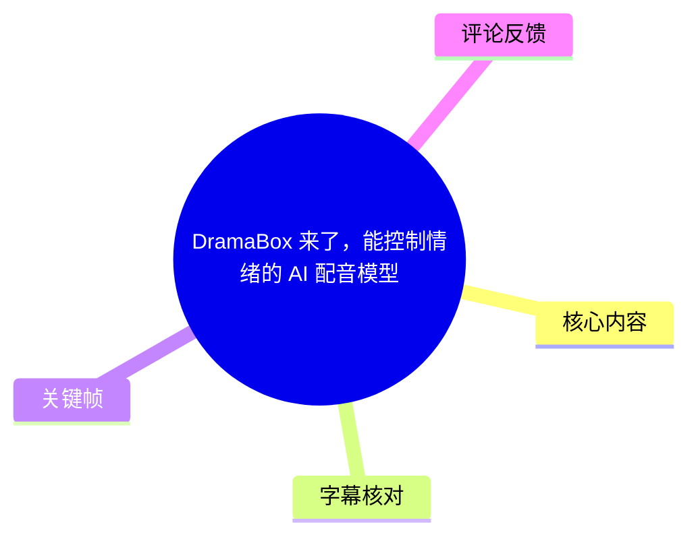
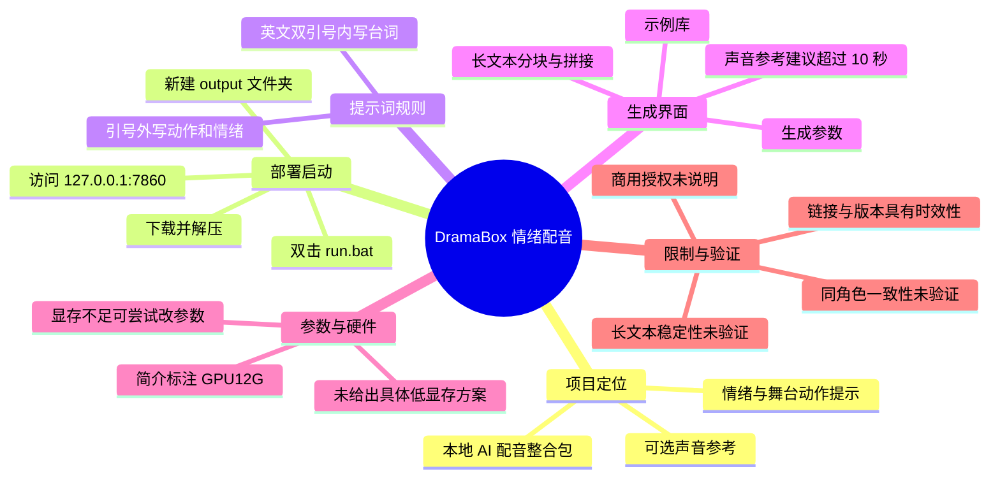
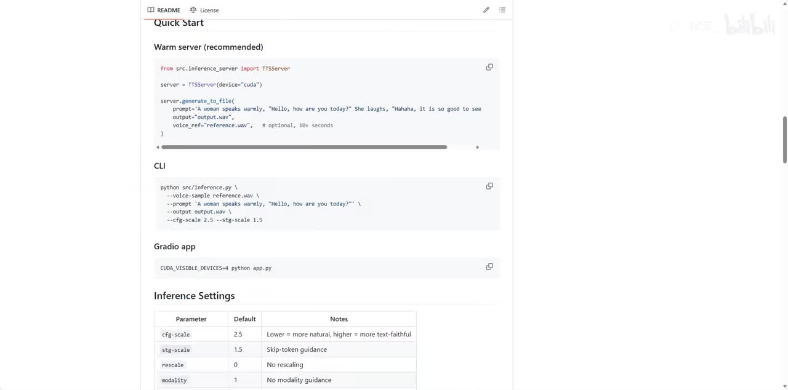
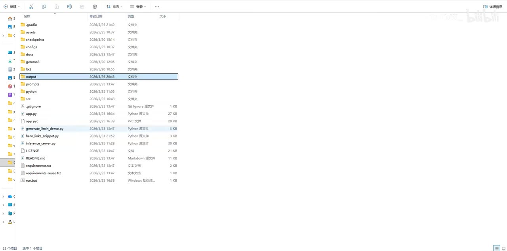
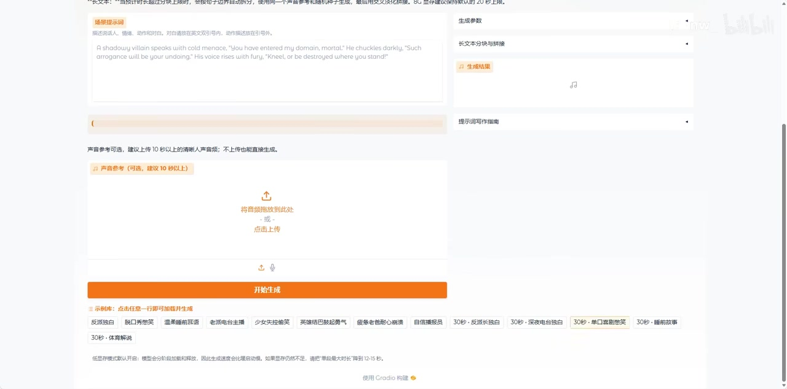

# DramaBox 来了，能控制情绪的 AI 配音模型

> 来源：[Bilibili 视频](https://www.bilibili.com/video/BV1cSVN6HECC)  
> UP 主：Jasonw_｜发布时间：2026-05-26｜视频时长：2 分 09 秒  
> 视频简介提供 DramaBox GitHub 地址、夸克网盘链接及“GPU12G”提示。

## 小结

DramaBox 是视频介绍的一套本地 AI 配音整合包。UP 主将其核心能力概括为“能控制情绪的 AI 配音模型”：用户在文本中同时写入动作、情绪和实际台词，并可选上传声音参考后生成语音。

本视频最具操作价值的信息有四项：从简介链接下载并解压；在项目根目录手动新建 `output` 文件夹以避免报错；双击 `run.bat` 后访问本地地址 `127.0.0.1:7860`；将要生成的台词放进**英文双引号**，将舞台动作和情绪描述写在双引号外。

界面显示声音参考为可选项，建议使用 **10 秒以上的清晰人声音频**；不上传参考音频也可以直接生成。页面还可见“生成参数”“长文本分块与拼接”“提示词写作指南”和示例库等区域，但视频没有完整讲解每个参数的含义、默认值或推荐配置。

硬件方面，视频简介写有“GPU12G”；结尾口播称显存不足时可打开参数信息修改参数。不过，视频没有提供显卡型号、最低可运行显存、具体低显存参数、生成耗时或显存占用测试。因此，“12GB 显存”只能视为视频资源发布时给出的环境提示，不能视为已验证的通用硬件门槛。

本视频是短流程上手演示，而非稳定性、质量或商用能力评测。角色跨段音色一致性、长篇文本拼接、中文效果、多人对话、情绪可控程度、模型授权与实际部署兼容性，均需要以当前项目文档和自行测试为准。项目链接、依赖版本、整合包结构和硬件需求也可能随版本变化。

## 思维导图





## 目录

- [项目定位与资源入口](#项目定位与资源入口)
- [部署：创建 output 文件夹并启动服务](#部署创建-output-文件夹并启动服务)
- [提示词：用引号区分台词与情绪动作](#提示词用引号区分台词与情绪动作)
- [生成界面：声音参考、结果与示例](#生成界面声音参考结果与示例)
- [显存、参数与长文本功能边界](#显存参数与长文本功能边界)
- [关键帧索引](#关键帧索引)
- [结论与限制](#结论与限制)
- [字幕比对](#字幕比对)
- [评论分析](#评论分析)
- [处理记录](#处理记录)

## 项目定位与资源入口

### DramaBox 的视频定位与项目文档 [00:00](https://www.bilibili.com/video/BV1cSVN6HECC?t=0)

UP 主开场介绍“DramaBox 来了，能控制情绪的 AI 配音模型”，随后提示观众从视频简介中的链接下载并解压。

视频简介中可直接核对的资源信息为：

- GitHub：`https://github.com/resemble-ai/DramaBox`
- 网盘：视频简介提供夸克网盘链接。
- 硬件提示：`GPU12G`

关键帧中的项目 README 显示，该项目文档包含多种使用方式：

- Warm server（标注为 recommended）
- CLI
- Gradio app

视频实际演示的是本地 Gradio 风格网页界面及 Windows 整合包启动流程，并未讲解 Warm server 或 CLI 的完整命令行操作。因此，不能把 README 中的运行方式直接等同于视频所演示的整合包部署步骤。



> 图：关键帧展示项目 README 的 Quick Start 页面，可辨识 Warm server、CLI、Gradio app 以及 Inference Settings 表格。它说明 DramaBox 项目文档至少覆盖多种运行入口，也为视频中本地网页界面的来源提供了背景依据。

README 画面中可辨识的推理设置如下：

| 参数 | 画面显示默认值 | 画面中的说明 |
| --- | ---: | --- |
| `cfg-scale` | `2.5` | 值更低时更自然，值更高时更忠实于文本。 |
| `stg-scale` | `1.5` | Skip-token guidance。 |
| `rescale` | `0` | No rescaling。 |
| `modality` | `1` | No modality guidance。 |

这些值来自 README 关键帧，并非 UP 主在视频中给出的调参结论。视频也没有证明这些参数就是整合包网页界面的默认配置，或说明它们与显存占用之间的定量关系。

## 部署：创建 output 文件夹并启动服务

### 新建输出目录、运行脚本并访问本地地址 [00:11](https://www.bilibili.com/video/BV1cSVN6HECC?t=11)

根据 00:11—00:19 的 ASR 字幕，视频给出的启动顺序如下：

1. 从视频简介链接下载 DramaBox 并解压。
2. 在解压目录中创建 `output` 文件夹。
3. 双击 `run.bat`。
4. 在浏览器访问 `127.0.0.1:7860`。

其中，创建 `output` 文件夹是视频明确强调的排错步骤：如果没有该文件夹，“不然会报错”。



> 图：关键帧为 Windows 文件资源管理器。`output` 文件夹位于项目根目录中，并可见 `app.py`、`README.md`、`requirements.txt` 与 `run.bat` 等文件。这直接说明 `output` 应与项目主要文件处于同一层级，而非创建在任意子目录。

可按视频流程整理为：

```text
下载整合包
  ↓
解压到本地目录
  ↓
在项目根目录新建 output/
  ↓
双击 run.bat
  ↓
浏览器打开 127.0.0.1:7860
```

需要注意的事实边界：

- 视频未展示实际报错内容，因此不能确定缺失 `output` 后会出现何种错误。
- 视频未说明 `run.bat` 是否会自动安装依赖、下载模型或要求特定 Python/CUDA 环境。
- 本地地址由 ASR 识别为“1270017860”；结合本地 Web 服务常见写法及视频操作语境，校正为 `127.0.0.1:7860`。
- 不应把该修复经验扩展为所有 DramaBox 版本或所有 GitHub 克隆方式都必须手动创建 `output`；这一步是针对视频所用整合包的操作建议。

## 提示词：用引号区分台词与情绪动作

### 场景提示词的书写规则 [00:21](https://www.bilibili.com/video/BV1cSVN6HECC?t=21)

在 00:21—00:30 的 ASR 中，UP 主说明 DramaBox 的提示词写法与常规输入方式不同：

- **英文双引号内**：写需要实际生成、由模型说出的内容。
- **英文双引号外**：写舞台动作与情绪描述。

可将结构概括为：

```text
人物状态、动作、情绪描述，"实际要说出的台词"
```

视频画面顶部的说明文字表达了相同规则：把真正要说出口的语音放在英文双引号中，舞台动作和情绪描述放在引号外。界面示例以英文表达一个带冷酷语气、笑声和威胁台词的反派场景。


> 图：关键帧同时呈现“场景提示词”输入框、右侧生成参数与长文本功能区、声音参考上传框和底部开始生成按钮。这是判断提示词结构与输入关系的核心画面。

该规则的实际意义是区分两类信息：

| 信息类别 | 放置位置 | 作用 |
| --- | --- | --- |
| 台词文本 | 英文双引号内 | 预期由模型念出的语句。 |
| 动作、语气、情绪、场景 | 英文双引号外 | 为台词表达提供情境与情绪指引。 |

视频没有说明以下情况是否支持，因此不应自行假定：

- 是否支持中文全角引号。
- 是否可在一个提示词中使用多段台词、嵌套引号或多角色标记。
- 是否支持角色名固定、角色切换或跨段角色记忆。
- 情绪描述的语言范围、词汇格式及其可控程度。
- 同一提示词多次生成时是否稳定产生一致音色和表达。

“能够控制情绪”是本视频对模型能力的概括。视频未提供不同情绪提示词的 AB 对照音频、可量化成功率或用户研究数据，因此无法据此评估其控制精度。

## 生成界面：声音参考、结果与示例

### 上传声音参考并开始生成 [00:33](https://www.bilibili.com/video/BV1cSVN6HECC?t=33)

00:33—00:38 的 ASR 表示：输入提示词后，上传参考音频，再点击“开始生成”按钮。

从界面文字可确认，声音参考具有以下特点：

- 声音参考为可选项。
- 建议上传 **10 秒以上** 的清晰人声音频。
- 不上传声音参考也可直接生成。

操作顺序可整理为：

1. 在“场景提示词”中按引号规则输入动作、情绪与台词。
2. 按需上传声音参考。
3. 展开或调整生成参数、长文本功能等界面选项。
4. 点击“开始生成”。
5. 在“生成结果”区域查看或播放输出。



> 图：关键帧聚焦声音参考上传区域、橙色“开始生成”按钮和底部示例按钮。它补充了 ASR 没有完整覆盖的可视化界面信息：用户可拖放或点击上传参考音频，且页面提供可点击的预设示例。

界面中还可确认以下区域存在：

| 区域 | 可确认的信息 | 未被视频说明的部分 |
| --- | --- | --- |
| 声音参考 | 可选；建议 10 秒以上清晰人声；支持上传。 | 支持的音频格式、采样率、最大时长与参考音频对音色的实际影响。 |
| 生成参数 | 右侧存在“生成参数”折叠区域。 | 参数名称、默认值、范围、推荐组合和具体显存影响。 |
| 长文本分块与拼接 | 右侧存在对应功能区域。 | 单段长度上限、分块策略、拼接质量与角色一致性机制。 |
| 生成结果 | 右侧存在“生成结果”区域。 | 输出格式、生成耗时、失败处理与结果保存位置。 |
| 提示词写作指南 | 界面存在该区域。 | 视频没有展示其完整内容。 |
| 示例库 | 底部显示多个示例标签。 | 每个示例的完整提示词、参考音频与实际生成结果。 |

ASR 在 00:38.860 至 01:45.400 之间存在约 66.54 秒的无语音覆盖间隔。对该区间，依据关键帧只能确认视频继续展示了操作网页；不能据此补写未被字幕记录的口播内容、功能机制或具体参数。

## 显存、参数与长文本功能边界

### 显存不足时的参数修改提示 [01:45](https://www.bilibili.com/video/BV1cSVN6HECC?t=105)

在 01:45—01:59 的 ASR 中，UP 主表示显存不够时可以打开参数信息进行修改，并再次提示分享链接位于视频简介。

可从视频与简介可靠整理出的信息如下：

- 视频简介标注：`GPU12G`。
- 界面中存在“生成参数”区域。
- UP 主建议显存不足时从参数设置方向尝试调整。
- README 画面中存在 `cfg-scale`、`stg-scale`、`rescale`、`modality` 等推理设置。

但下列信息未被视频提供：

- 12GB 显存是最低要求、推荐要求，还是视频作者的测试环境提示。
- 哪个参数能显著降低显存占用。
- 应设置的具体参数值。
- 改参后对自然度、文本遵循度、速度和稳定性的影响。
- 模型运行所需的显卡品牌、CUDA 版本、系统版本和依赖版本。
- 是否支持 CPU 推理或低显存卸载方案。

因此，面对显存问题时，视频能够支持的实践原则是：

1. 优先阅读当前下载版本的 README、启动日志和界面说明。
2. 先保存可运行的原始配置，再逐项调整参数。
3. 每次只改动少量变量，记录输入文本长度、参考音频长度、显存占用、耗时与输出结果。
4. 保留完整报错日志，不能把所有启动或生成失败都简单归因于显存不足。
5. 将关键帧 README 中的参数理解为文档背景，不将其误当作视频验证过的低显存配置。

## 关键帧索引

### 关键画面与正文证据关系 [00:00](https://www.bilibili.com/video/BV1cSVN6HECC?t=0)

| 关键帧 | 正文用途 | 画面价值 |
| --- | --- | --- |
|  | 项目定位、运行方式、推理参数背景 | 显示 Warm server、CLI、Gradio app 和 Inference Settings，证明项目文档有多种调用形式。 |
|  | 部署踩坑 | 直观显示 `output` 位于项目根目录，且与 `run.bat`、`app.py` 等文件同级。 |
|  | 提示词规则、页面结构 | 同屏展示场景提示词、生成参数、长文本区域、生成结果与声音参考。 |
|  | 生成步骤、声音参考与示例 | 显示上传区域、开始生成按钮和示例库，补足短 ASR 片段未覆盖的界面细节。 |

所选关键帧均直接服务于正文中的可核验操作信息。其余已提供关键帧未被强行解读，以避免将无法清晰辨识的界面文字、未出现的参数或未演示的结果写成事实。

## 结论与限制

### 可复用的上手流程与未验证问题 [01:45](https://www.bilibili.com/video/BV1cSVN6HECC?t=105)

对于希望快速复现视频流程的用户，最可执行的内容是：

1. 从视频简介提供的项目或网盘资源获取整合包。
2. 解压后，在项目根目录建立 `output` 文件夹。
3. 双击 `run.bat`，通过 `127.0.0.1:7860` 访问本地页面。
4. 在场景提示词中将实际台词写在英文双引号内，将动作、情绪等提示写在引号外。
5. 按需上传超过 10 秒的清晰人声参考音频。
6. 点击“开始生成”，并根据当前界面与项目文档处理参数、长文本和输出结果。

视频的价值主要在于提供了一个本地化情绪配音工具的启动与提示词入门路径，而非建立了全面的性能结论。

以下问题没有在本视频中得到验证：

- 同一角色多次生成时的音色、音底色和情绪一致性。
- 长篇小说或长文本分块生成后的衔接质量。
- 多角色对话、复杂剧本和中文内容的稳定表现。
- 参考音频的质量、时长和语言对生成效果的影响。
- 12GB 显存下的真实生成速度、最大文本量与稳定性。
- 模型权重、数据来源、授权条款及商业使用许可。
- 具体参数对显存、速度、自然度和文本忠实度的影响。

视频元数据的发布时间为 2026-05-26，素材抓取时间为 2026-07-16。GitHub 仓库、网盘文件、依赖版本、模型权重、启动脚本、端口和硬件需求均可能发生变化。实际部署时，应以访问时的仓库 README、发布说明、许可证与启动日志为准。

## 字幕比对

### 站内字幕与本次 ASR 的覆盖情况 [00:00](https://www.bilibili.com/video/BV1cSVN6HECC?t=0)

| 字幕来源 | 完整性 | 专有名词 | 时间轴 | 主要问题 |
| --- | --- | --- | --- | --- |
| Bilibili 站内字幕 | 未提供可用站内字幕。 | 无法核验。 | 无可用 SRT 起止时间。 | 素材清单中没有可用的站内字幕文件。 |
| 本次 ASR 字幕 | 共 5 段，语音覆盖约 44.64 秒，占 128.45 秒音频约 34.75%。 | `Dramabox`、`output`、`runbat`、本地地址等存在连写或误识别。 | 提供真实 SRT 时间戳，可用于正文章节链接。 | 00:38.860—01:45.400 存在约 66.54 秒大间隔；部分操作词识别不准确。 |

本次 ASR 的检测信息：

- 模型：`medium`
- 识别语言：中文（`zh`）
- 语言置信度：`0.99560546875`
- 运行设备：CUDA
- 计算类型：`float16`
- 音频时长：约 `128.45` 秒
- 带时间戳：是
- `noAudioStream=true`：**未标记**

因此，本素材并非无音轨视频；ASR 已提取到口播音频。中间存在大段 ASR 空白，只能说明本次识别结果在该区间没有文字覆盖，不能将其解释为工具失败或擅自补充未记录内容。

最终字幕采用策略：

- 站内字幕缺失，无法进行逐句交叉比对。
- 正文的时间轴优先使用本次 ASR SRT 的真实起止时间。
- 对影响操作的 ASR 文字，依据关键帧和明确语境进行最小必要校正。
- 对无 ASR 覆盖的区域，仅从关键帧中确认可见界面元素，不虚构口播。

主要校正项如下：

| ASR 原识别 | 正文采用写法 | 校正依据 |
| --- | --- | --- |
| `Dramabox` | `DramaBox` | 视频标题、简介 GitHub 链接。 |
| `runbat` | `run.bat` | 文件管理器关键帧中可见该批处理文件。 |
| `1270017860` | `127.0.0.1:7860` | 本地网页服务地址的常见格式与口播语境。 |
| `提示此` | 提示词 | 前后语义和界面“场景提示词”标签。 |
| `开始升轴按钮` | “开始生成”按钮 | 界面橙色按钮可见“开始生成”。 |
| `优色参数信息` | 参数信息／生成参数区域 | ASR 音近误识别；界面存在“生成参数”区域，但具体原话无法完全确认。 |

## 评论分析

### 可获取热评前三条 [00:00](https://www.bilibili.com/video/BV1cSVN6HECC?t=0)

以下仅处理素材中可获取的热评前三条。评论反映的是观众个人经验、判断或观点，不应作为已验证的模型事实。

1. **老伙计放飞自我了（4 赞）**  
   评论认为，情绪控制并不足以支持商业应用；更重要的是同一角色、同一情绪提示词在多次生成时能否稳定保持相近的“味道”与音底色。评论进一步担忧，长篇小说配音会放大角色一致性问题。  
   - 补充价值：指出了视频没有覆盖的重复生成稳定性、长文本角色保持与商用输出一致性。  
   - 可信度边界：评论没有说明所用版本、测试样本、参考音频、参数、复现步骤或失败比例，不能据此确认 DramaBox 必然存在该问题。  
   - 实践启示：若用于连续角色或长篇内容，应自行测试“同一参考音频 + 同一提示词”的多次输出一致性。

2. **孤独康之清（2 赞）**  
   评论称：“12G内存显卡3000以上”。  
   - 补充价值：与视频简介中的“GPU12G”提示有关，反映观众对显卡与显存要求的关注。  
   - 可信度边界：“内存显卡”可能是在指显存，“3000以上”可能是在指 NVIDIA RTX 3000 系列或其他个人经验，但评论未说明具体显卡、显存容量、运行版本、操作系统或测试结论。  
   - 结论：不能将其视作官方配置要求或已验证的最低配置。

3. **流沙VS飞鸟（1 赞）**  
   评论肯定情绪配音方向，并称自己接入的网站也支持类似能力。  
   - 补充价值：说明带情绪表达的语音合成功能是用户关注的需求，且市场上可能有其他同类实现。  
   - 可信度边界：评论未提供网站名称、模型、定价、质量样本、功能范围或与 DramaBox 的比较方法。  
   - 结论：不能据此判断 DramaBox 在同类产品中的技术优势、音质水平或商业竞争力。

## 处理记录

### 素材使用与证据边界 [00:00](https://www.bilibili.com/video/BV1cSVN6HECC?t=0)

- Worker ID：`worker-mrj0www4-e8d79408`
- 模型：`gpt-5.6-terra`
- 任务视频：`BV1cSVN6HECC`
- 使用素材：视频元数据、视频简介、ASR 结果 JSON、ASR SRT、ASR 覆盖诊断、4 张可用于正文的关键帧、热评 JSON。
- ASR 模型与运行信息：`medium`／CUDA／`float16`；中文识别，语言置信度 `0.99560546875`。
- 站内字幕检查：素材明确标注“未提供可用站内字幕”，因此无法使用站内 SRT 进行交叉校对。
- 字幕选择：采用本次 ASR 的真实 SRT 时间戳作为章节时间轴；对 `run.bat`、`127.0.0.1:7860`、“开始生成”等操作性词语结合关键帧做最小校正。
- 音轨判断：ASR 诊断未标记 `noAudioStream=true`，且存在有效语音片段；未将 ASR 空白段误判为无音轨或工具失败。
- 关键帧选择依据：
  - `frames/frame-001.jpg`：支撑 README 中多种运行方式与推理参数背景。
  - `frames/frame-002.jpg`：支撑在项目根目录建立 `output` 文件夹的操作。
  - `frames/frame-003.jpg`：支撑场景提示词、参数区、长文本区和声音参考区的界面关系。
  - `frames/frame-004.jpg`：支撑声音上传、“开始生成”按钮及示例库的可视化信息。
- 评论处理：仅处理可获取热评前三条，未扩展至未提供的评论。
- 缓存清理：未提供缓存清理执行记录，无法确认是否已清理；未将其表述为已完成。
- 未解决问题：
  - 缺少站内字幕，无法与 ASR 逐句互证。
  - ASR 在 00:38.860—01:45.400 存在大段无文字覆盖。
  - 视频未展示实际生成音频与质量对照。
  - 视频未给出可复现的低显存参数方案、硬件实测、长文本稳定性测试或商业授权说明。
