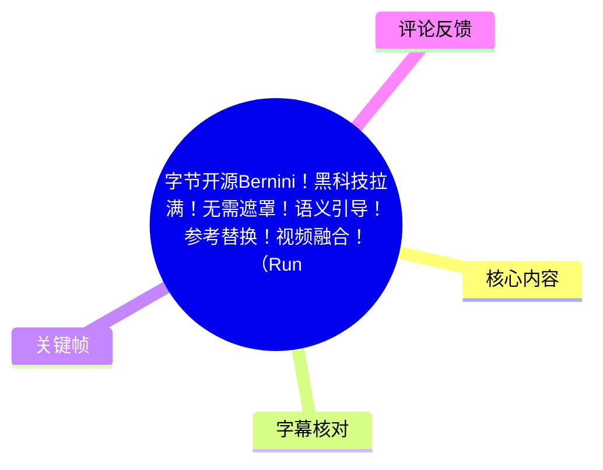
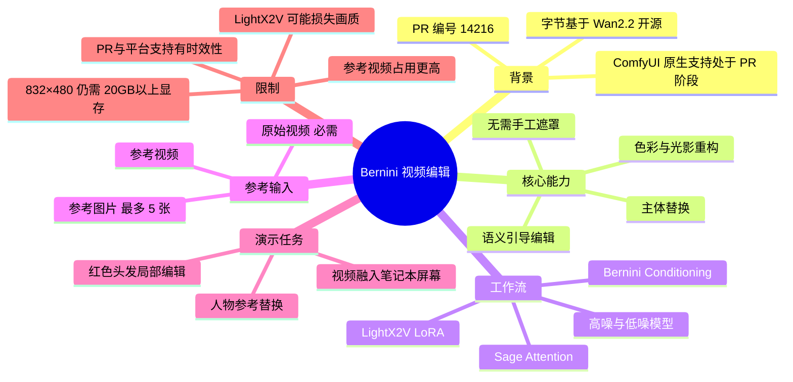
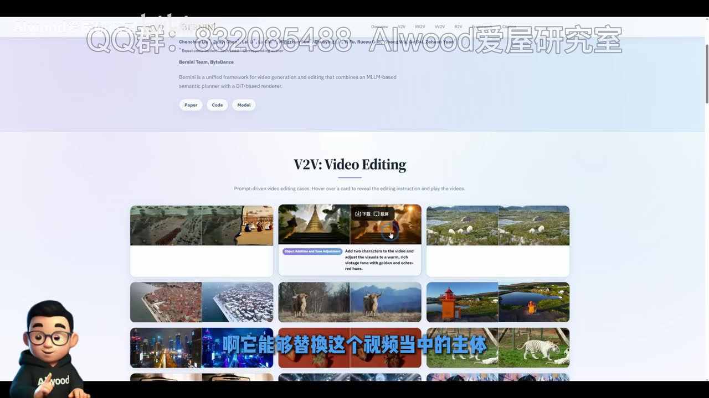
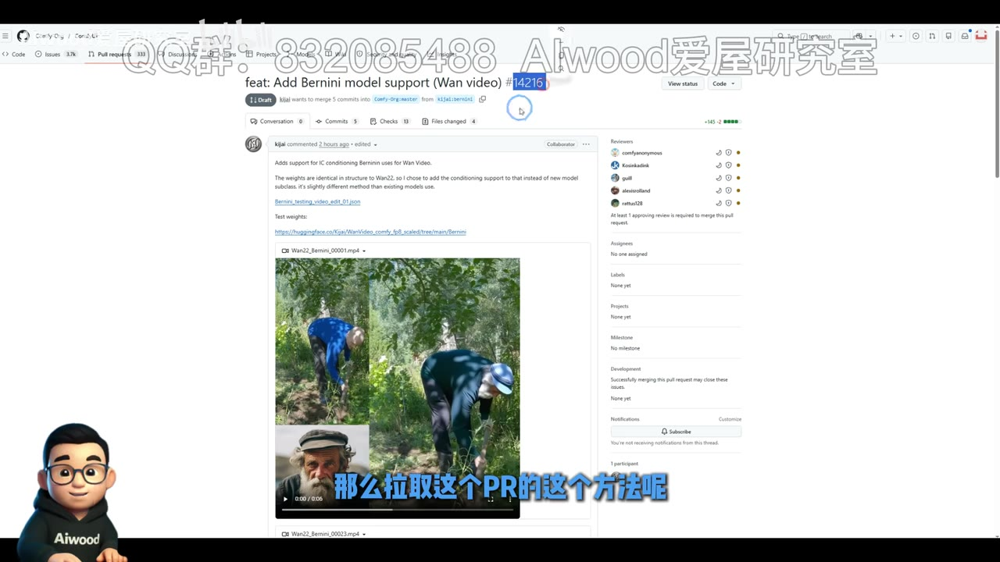
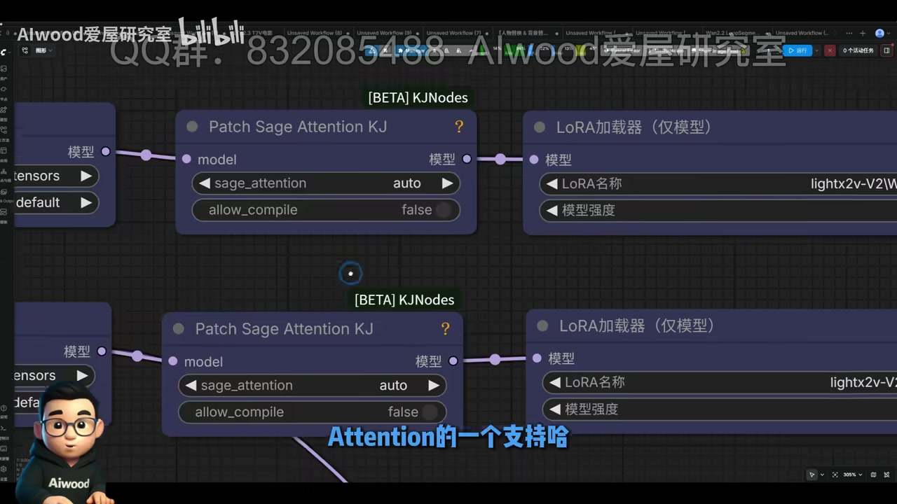

# 字节开源 Bernini：无需遮罩的视频语义编辑、参考替换与融合

> 来源：[Bilibili 视频](https://www.bilibili.com/video/BV1aCVi6dEWy)<br>
> UP 主：AIwood爱屋研究室｜时长：07:27｜分辨率：1920×1080

## 小结

视频介绍了字节在 **Wan2.2** 基础上开源的 **Bernini** 视频编辑模型，以及其接入 ComfyUI 的工作流思路。UP 主将其定位为语义引导的视频编辑工具：可用文本指令修改主体、色彩和光影，并强调其卖点是**不需要手工遮罩（mask）**。

视频展示了三类实际用法：一是把一段参考视频的内容融合到原视频中的笔记本屏幕；二是借助参考图将视频中的女孩替换为戴眼镜、穿 T 恤的男性；三是不接参考素材，仅通过文本把女孩头发改成红色。演示表明，模型能尝试把编辑影响集中在目标区域，但画质仍可能因加速 LoRA 与分辨率限制而下降。

部署层面，当时 ComfyUI 对 Bernini 的支持仍处于 **PR #14216** 阶段，尚未合并到主分支。工作流涉及高噪、低噪两个模型阶段，以及对应的 Sage Attention 和 LightX2V LoRA 配置；UP 主特别提示，LightX2V 对该模型的优化尚不理想。

性能是最明确的实际限制：即使在 **832×480** 这一较低分辨率下，UP 主本地运行也占用 **20GB 以上显存**；接入参考视频时，显存占用会高于普通视频编辑。移除高噪阶段的 LightX2V、将第一阶段设为 10 步、第二阶段运行 4 步，可能改善画质，但会显著变慢并提高显存压力。

本文适合已具备 ComfyUI、Wan 系列视频模型和 LoRA 基本使用经验的读者。需要注意：视频中的 PR 状态、Running Hub 支持状态和下载资源均具有时效性，不能直接视为当前仍可用或仍未合并的事实。

## 思维导图





## 目录

- [背景：Bernini 的定位与能力](#背景bernini-的定位与能力)
- [ComfyUI 支持状态与资源](#comfyui-支持状态与资源)
- [工作流结构、模型与加速配置](#工作流结构模型与加速配置)
- [提示词与 Bernini Conditioning 节点](#提示词与-bernini-conditioning-节点)
- [三种参考编辑实践](#三种参考编辑实践)
- [显存、画质与部署限制](#显存画质与部署限制)
- [结论与时效性](#结论与时效性)
- [字幕比对](#字幕比对)
- [评论分析](#评论分析)
- [处理记录](#处理记录)

## [背景：Bernini 的定位与能力](https://www.bilibili.com/video/BV1aCVi6dEWy?t=30)

UP 主在 [00:30](https://www.bilibili.com/video/BV1aCVi6dEWy?t=30) 起介绍 Bernini，称其为字节基于 **Wan2.2** 开源的视频编辑模型。根据视频陈述，模型能够进行：

1. **视频主体替换**：替换原视频中的人物或其他主体。
2. **色彩重构**：改变视频中特定对象或区域的颜色属性。
3. **光影重构**：对画面光照与视觉风格做语义驱动的重构。
4. **无需遮罩的编辑**：UP 主强调不需要传统手动 mask 操作，而是由文本语义和输入条件引导模型完成编辑。
5. **参考驱动编辑**：可输入参考视频或参考图片，辅助实现元素注入、人物替换等效果。

这里的“无需遮罩”是视频对模型交互方式的概括，不应理解为所有场景均可完全避免选区、裁剪或输入预处理。实际生成质量仍会受提示词、输入素材、分辨率、模型配置和显存条件影响。



> 图：该关键帧展示 Bernini 项目页面中的 “V2V: Video Editing” 示例矩阵，包含主体、对象、场景等多种前后对照案例。它有助于理解视频所说的 Bernini 不仅是单一的人物替换工具，而是面向视频到视频编辑的统一能力集合。

## [ComfyUI 支持状态与资源](https://www.bilibili.com/video/BV1aCVi6dEWy?t=78)

### PR 仍未合并的状态

在 [01:18](https://www.bilibili.com/video/BV1aCVi6dEWy?t=78)，UP 主说明 ComfyUI 对 Bernini 的支持已通过 PR 形式提交，但**当时仍是 PR，尚未合并至 ComfyUI 本体**。画面显示的 PR 标题为：

- `feat: Add Bernini model support (Wan video)`
- PR 编号：`#14216`

视频没有给出拉取 PR 所需的具体命令，仅提到此前视频已经介绍过通过编号拉取 PR 的方法。因此，不能从本视频推导或补写具体 Git 命令。



> 图：关键帧显示 ComfyUI GitHub 中的 `#14216` PR 页面及其测试内容，是判断“视频录制时仍处于 PR 阶段”的直接画面依据。该状态具有时效性，应以当前仓库页面为准。

### 视频描述区提供的资源

视频元数据描述中列出以下外部资源：

- Running Hub 高噪加速版工作流：<https://www.runninghub.cn/post/2061852006909825025/?inviteCode=kol01-rh149>
- Running Hub 高噪无加速版工作流：<https://www.runninghub.cn/post/2061860532604465153/?inviteCode=kol01-rh149>
- ComfyUI PR：<https://github.com/Comfy-Org/ComfyUI/pull/14216>
- 模型与工作流网盘：<https://pan.quark.cn/s/247285f2c2c8>
- Hugging Face 模型下载页：<https://huggingface.co/Kijai/WanVideo_comfy_fp8_scaled/tree/main/Bernini>

这些链接来自视频简介，不表示本文已验证其当前可访问性、内容完整性或安全性。

## [工作流结构、模型与加速配置](https://www.bilibili.com/video/BV1aCVi6dEWy?t=94)

### 基本加载结构

从 [01:34](https://www.bilibili.com/video/BV1aCVi6dEWy?t=94) 开始，UP 主打开工作流并说明前部属于常规模型加载部分。视频明确提及的组件包括：

| 组件 | 视频中的作用或说明 |
| --- | --- |
| 高噪模型 | 工作流中的一个模型阶段 |
| 低噪模型 | 工作流中的另一个模型阶段 |
| Sage Attention | 高噪、低噪阶段均出现相应支持 |
| LightX2V LoRA | 高噪、低噪各有一个对应 LoRA |
| VAE | 后续正常加载 |
| CLIP 模型 | 后续正常加载 |



> 图：关键帧展示两个 `Patch Sage Attention KJ` 节点及其连接的 LoRA 加载器。画面是理解高噪、低噪双阶段配置以及 Sage Attention/LightX2V 配合关系的直接依据。

### LightX2V 的质量取舍

在 [01:59](https://www.bilibili.com/video/BV1aCVi6dEWy?t=119)，UP 主转述开发者提示：Bernini 对 **LightX2V** 的优化目前“不太好”，可能带来画质损失。

视频给出一种改善质量的调整方案：

1. 移除**高噪阶段**的 LightX2V。
2. 将前段设置为 **10 步**。
3. 第二段再运行 **4 步**。

UP 主把这一思路类比为此前 Wan2.2 的双阶段做法，并同时指出代价：

- 运行速度会明显变慢；
- 显存占用会更高；
- Bernini 本身就是高显存消耗模型。

该方案是视频中的经验性建议，不代表适用于所有硬件、模型版本或工作流实现。

## [提示词与 Bernini Conditioning 节点](https://www.bilibili.com/video/BV1aCVi6dEWy?t=167)

### 提示词存在任务前缀规则

从 [02:47](https://www.bilibili.com/video/BV1aCVi6dEWy?t=167) 起，UP 主强调 Bernini 的提示词不能只写自然语言编辑要求。不同任务需要先添加相应的标准化前缀或任务描述，再接具体内容。

视频提及模型可支持的任务类型包括：

- 文生视频；
- 图生视频；
- 视频编辑；
- 参考编辑相关任务。

但视频音频没有逐字展示可复制的完整模板，也未给出每种任务的确切前缀文本。因此，实践时应以工作流内标注、模型仓库说明或项目文档中的模板为准，不能依据本视频自行补全提示词格式。

### 必需输入：Bernini Conditioning

在 [03:12](https://www.bilibili.com/video/BV1aCVi6dEWy?t=192)，视频指出新增的核心节点为 **Bernini Conditioning**。根据口述，它需要接入：

- 正面条件（positive conditioning）；
- 负面条件（negative conditioning）；
- VAE；
- 原始视频。

其中原始视频通过图像/视频加载节点输入，并被 UP 主明确称为必要接入项。

在 [03:36](https://www.bilibili.com/video/BV1aCVi6dEWy?t=216)，UP 主进一步列出工作流中的主要可调项目：

- 宽度（width）；
- 高度（height）；
- 长度，即帧数（frames）；
- 参考输入的最大值设置；
- 可选参考视频；
- 可选参考图片。

可将输入关系概括如下：

```text
正面条件 + 负面条件 + VAE + 原始视频
                ↓
      Bernini Conditioning（必需）
                ↓
    采样与输出视频生成流程

可选附加输入：
参考视频 / 参考图片
```

## [三种参考编辑实践](https://www.bilibili.com/video/BV1aCVi6dEWy?t=240)

### 1. 参考视频：把内容融合到笔记本屏幕

在 [04:00](https://www.bilibili.com/video/BV1aCVi6dEWy?t=240)，UP 主解释参考视频的逻辑：原视频接入后，还可再接入另一段视频，使参考视频中的元素以图像形式参与生成与编辑。

他回答了“为什么不直接大量接参考图片”的问题：若逐帧使用参考图片，模型会对参考视频的每一帧都进行图像生成处理，计算成本会“爆掉”。因此，工作流设置了专门的**参考视频节点**。

演示步骤为：

1. 接入原视频；
2. 接入一段参考视频；
3. 使用参考编辑对应的提示词前缀；
4. 在后部补充指令：让该参考视频出现在笔记本屏幕上；
5. 生成结果中，参考视频内容被放入原视频的笔记本屏幕区域。

这一案例说明“视频融合”的具体含义：不是简单拼接两个视频，而是在原视频语义与空间位置中生成参考视频的呈现效果。

### 2. 参考图片：人物替换，最多五张图

在 [05:13](https://www.bilibili.com/video/BV1aCVi6dEWy?t=313)，UP 主说明参考图像模式支持**最多 5 张图片**，并可批量加载。操作关系是：

1. 加载一张或多张参考图片；
2. 将图片接入参考图像节点；
3. 保留参考编辑任务所需的标准化提示词前缀；
4. 补充具体替换指令。

视频使用的示例指令语义为：将视频中的女孩替换成戴眼镜、穿 T 恤的男人。

UP 主展示了相应替换结果，并同时提醒：该结果存在一定画质损失，原因与前文所说的 LightX2V 和分辨率限制有关。由此可见，参考图数量上限是明确参数，但“多图一定更稳定”并非视频已证实的结论。

### 3. 不接参考素材：文本驱动局部属性编辑

在 [06:01](https://www.bilibili.com/video/BV1aCVi6dEWy?t=361)，UP 主演示不连接参考视频和参考图片、只输入原视频的编辑方式。

步骤为：

1. 只接入原视频；
2. 使用前置标准化提示词；
3. 添加编辑要求：让女孩头发变成红色；
4. 生成编辑视频。


> 图：关键帧以左右对照方式展示“源视频”与“编辑结果”，右侧人物头发变红，而衣物、面部和背景总体保持接近原始画面。它是视频“直接文本编辑且影响尽量局部化”这一能力的核心例证。

UP 主的主观评价是：在这个案例中，头发被改为红色，视频其他部分没有受到明显影响。他还表示，自己目前主要体验了“参考视频融合、参考图替换、直接文本编辑”三类能力，感觉效果不错；其余功能仍有待尝试，并未在视频中逐项验证。

## [显存、画质与部署限制](https://www.bilibili.com/video/BV1aCVi6dEWy?t=385)

### 硬件门槛

在 [06:25](https://www.bilibili.com/video/BV1aCVi6dEWy?t=385)，UP 主给出最具体的实测资源信息：

| 项目 | 视频中的信息 |
| --- | --- |
| 使用分辨率 | 832×480 |
| 显存占用 | 20GB 以上 |
| 参考视频输入 | 比普通编辑功能消耗更多显存 |
| 取消高噪 LightX2V 的代价 | 更慢、显存更高，但可能提升画质 |

这里的“20GB 以上”是 UP 主本地环境的观察结果，而非官方最低配置。显存实际占用还会受到视频长度、帧数、批处理、模型格式、注意力实现、VAE、采样设置和其他已加载节点影响。

### 平台支持的时效限制

在 [06:38](https://www.bilibili.com/video/BV1aCVi6dEWy?t=398)，UP 主表示模型和工作流已先上传网盘，具备条件的用户可先行测试；同时他说 Running Hub 需要等待 ComfyUI 本体合并该 PR、更新本体后才能支持，自己会尽快处理。

因此，视频标题中“Running Hub 已上”与口述中“仍需等待本体合并后更新支持”之间，可能反映了不同工作流版本、上线节奏或录制时点。仅基于现有素材，无法进一步判定当时具体可用范围；使用前应直接检查视频简介所列工作流页面和平台状态。

## [结论与时效性](https://www.bilibili.com/video/BV1aCVi6dEWy?t=422)

Bernini 的价值在于把视频编辑的控制方式从手动遮罩、合成与逐帧处理，部分转移为“原视频 + 任务提示词 + 可选参考素材”的语义引导流程。对于人物替换、局部属性修改、将外部视频内容嵌入特定区域等任务，它提供了一种统一的工作流方向。

但视频中的演示并不等于稳定的生产级承诺。至少需要同时评估以下问题：

- **画质**：LightX2V 和分辨率约束可能造成清晰度或细节损失。
- **算力**：832×480 已达到 20GB 以上显存；参考视频会进一步提高需求。
- **提示词依赖**：任务需要对应的标准化前缀，错误或缺失前缀可能导致结果偏离预期。
- **版本依赖**：ComfyUI 集成在视频中仍是 PR 状态，工作流能否直接导入取决于本地版本和节点支持。
- **素材风险**：人物替换、参考图驱动编辑涉及肖像、版权与授权问题，使用者应确保拥有输入视频和参考素材的合法使用权限。

视频结尾中，UP 主认为字节在参考类项目上持续具有优势，并提到此前的相关项目名称，但 ASR 对该专有名词识别不稳定，且视频未展开技术细节，本文不将其作为可核验的技术事实延伸。

## 字幕比对

| 字幕来源 | 完整性 | 专有名词 | 时间轴 | 主要问题 |
| --- | --- | --- | --- | --- |
| Bilibili 站内字幕 | 未提供可用字幕 | 无法评价 | 无法评价 | 素材中没有可用站内 SRT 或站内字幕文本 |
| 本次 ASR 字幕 | 较完整，19 段，覆盖约 408.03 秒语音 | 存在多处音近误识别 | 可用，带精确起止时间 | 模型名、技术名词及部分中文词语识别不稳定 |

本次已检查 ASR 结果。ASR 诊断显示：语言为中文，置信度约 `0.9995`，音频时长 `446.976` 秒，语音覆盖率约 `91.29%`，首段语音从 `00:00:30.800` 开始，末段至 `00:07:24.020`。诊断中**没有** `noAudioStream=true` 标记，因此不能将本视频视为无音轨视频。

由于没有可用站内字幕，正文时间轴以本次 ASR 的 SRT 起止时间为依据；术语则结合元数据描述、关键帧画面和视频上下文进行有限校正。主要校正如下：

| ASR 识别文本或疑似误识别 | 正文采用形式 | 校正依据 |
| --- | --- | --- |
| 贝尔尼尼 | Bernini | 视频标题、标签、PR 标题和模型下载链接 |
| 万象 2.2 | Wan2.2 | PR 画面中的 Wan video、视频上下文 |
| 康复原生 | ComfyUI 原生 | 视频主题与 PR 链接 |
| 爆脸仓库 | Hugging Face 仓库 | 视频描述区 Hugging Face 链接 |
| saka tension | Sage Attention | 工作流关键帧节点名称 `Patch Sage Attention KJ` |
| light x2v | LightX2V | 工作流节点与口述上下文 |
| 鱼翼引导 / 鳞引寮 | 语义引导 | 视频标题与上下文语义 |

ASR 在开头约 30 秒之前没有语音转写；素材未提供足以确认该段口述内容的站内字幕，因此本文未补写该时间段的信息。

## 评论分析

仅处理可获取的热评前三条，评论内容均不作为已验证事实。

1. **AIwood爱屋研究室（55 赞）**  
   评论称，其在某短视频平台发布该平台自家模型的视频后被限流，并据此批评该平台不适合学习。该内容属于 UP 主个人经历和主观判断，没有提供限流通知、规则条款或复现信息，无法验证其原因是否与 Bernini 内容直接相关。

2. **AIwood爱屋研究室（36 赞）**  
   评论称“疑似 seedance2.0 技术下放”。这是一种推测性判断，可能意在说明 Bernini 与字节内部或其他产品技术路线存在关联。但素材中未提供官方声明、论文对应关系或技术证据，不能据此确认 Bernini 是 Seedance 2.0 的技术下放。

3. **jinyu1018（14 赞）**  
   评论认为字节可能是在研究其他开源项目后进一步开发并商用。这是对企业研发路径的概括性看法，不包含具体项目、代码、论文或授权证据，也没有直接评价本视频中的工作流效果。其价值主要在于反映观众对大厂开源与商业化关系的讨论，而非可核实结论。

## 处理记录

- Worker ID：`worker-mrj0www4-e8d79408`
- 模型：`gpt-5.6-terra`
- 调用工具与素材：视频元数据、ASR 时间轴字幕与诊断、关键帧素材、可获取热评前三条、视频简介中的资源链接。
- 字幕选择：未提供可用 Bilibili 站内字幕；已检查本次 ASR，采用其 SRT 精确时间段作为时间轴依据，并以标题、简介链接、PR 画面和工作流画面校正少量专有名词。
- 关键帧选择依据：
  - `frames/frame-002.jpg`：展示 Bernini 项目页的视频编辑示例，用于说明能力范围。
  - `frames/frame-003.jpg`：展示 ComfyUI PR #14216，用于说明集成状态。
  - `frames/frame-004.jpg`：展示 Sage Attention 与 LoRA 节点，用于解释工作流组件。
  - `frames/frame-001.jpg`：展示头发变红前后对比，用于验证直接文本局部编辑案例。
- 缓存清理：素材未提供可验证的缓存清理日志；本文不声称已执行缓存清理。
- 未解决问题：
  - 未提供完整工作流文件及模型配置，无法核验所有节点参数。
  - 未提供完整可复制的提示词模板，无法逐字还原任务前缀。
  - 视频中 PR、Running Hub 和外部下载链接均可能已发生变化，需访问原链接确认当前状态。
