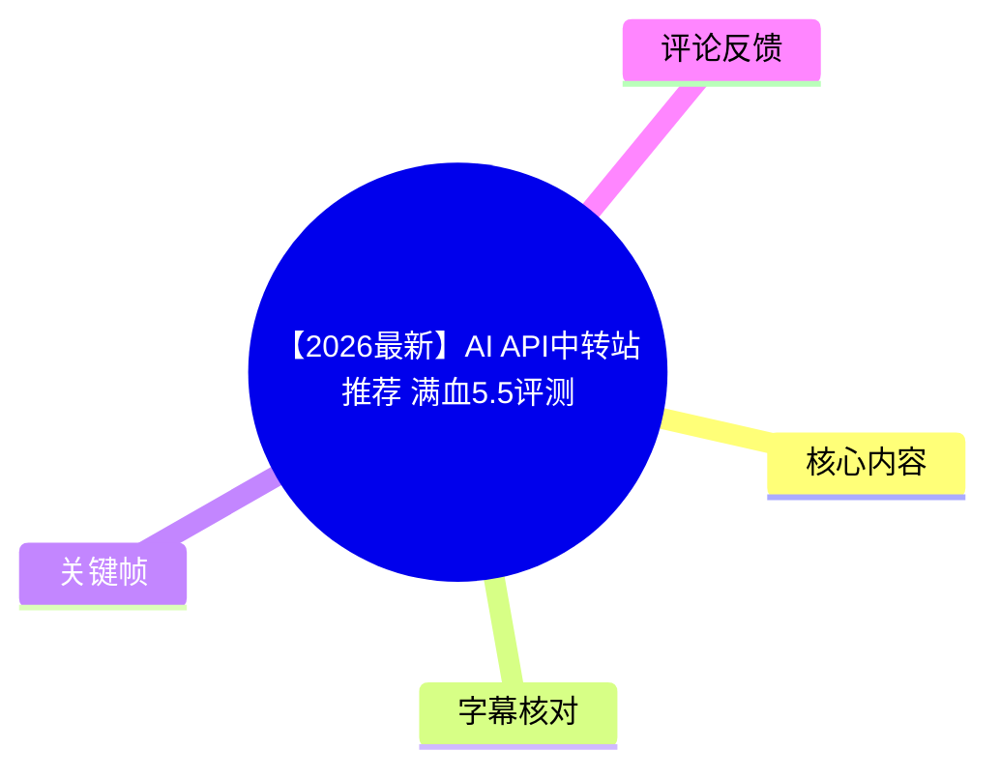
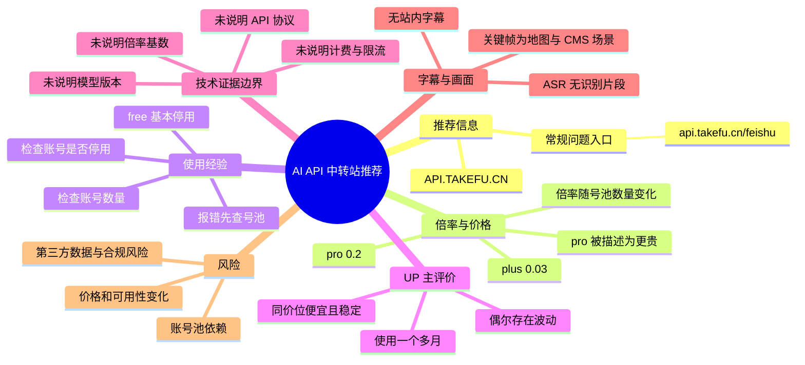
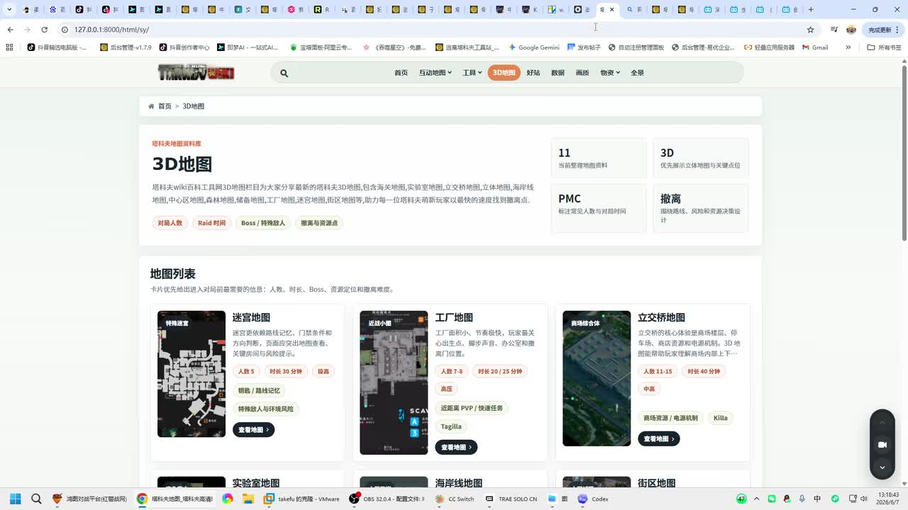
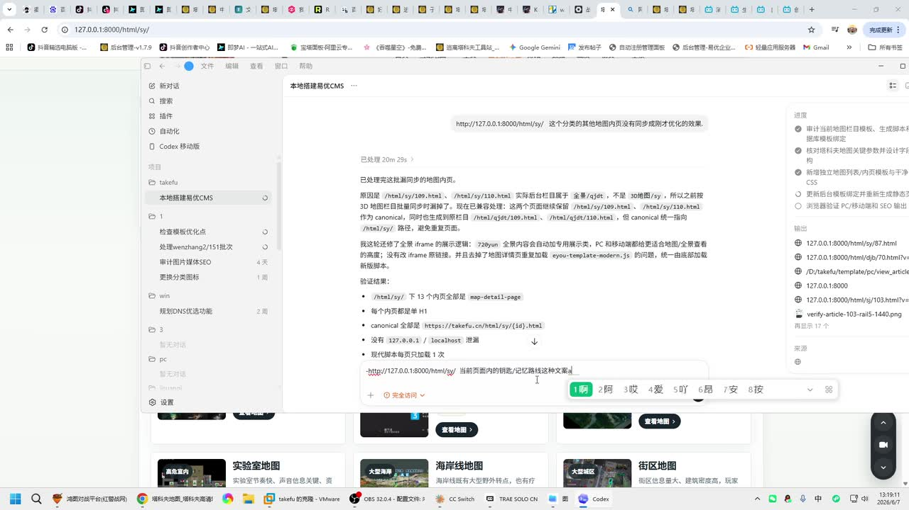
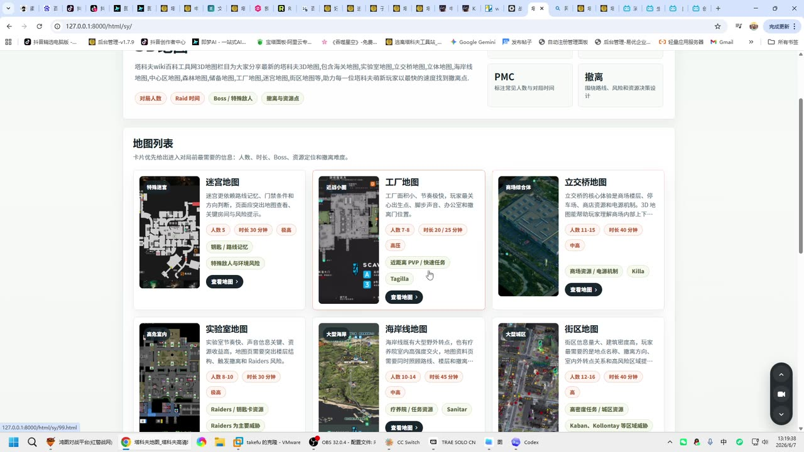
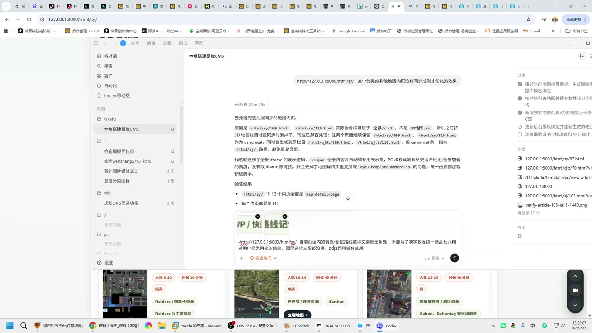

## 小结

视频标题为“【2026最新】AI API中转站推荐 满血5.5评测”，UP 主为“生于忧患死于忧患”，时长 363 秒。可直接核验的核心信息主要来自视频简介：UP 主推荐注册地址 `API.TAKEFU.CN`，并称自己已使用“一个多月”，主观评价其在同价位中“又便宜又稳”，但也承认服务“偶尔也会波动”。

简介披露了账号池相关的倍率信息：`plus` 当前倍率为 `0.03`，`pro` 当前倍率为 `0.2`，且倍率会随号池账号数量变动。UP 主认为 `pro` 的市场成本较高，因此其 API 价格也更贵，并给出“不差钱的可以直接上 pro”的建议。素材没有定义“倍率”的计费基数，也没有给出模型单价、Token 口径、并发、限流或上下文长度，不能由这些数字反推实际调用成本。

故障处理方面，简介建议调用报错时优先检查号池，确认所选 API 账号数量是否过少、账号是否停用；其中 `free` 被描述为“基本停用”。常规问题入口被指向 `api.takefu.cn/feishu`。这反映出该服务的可用性与账号池状态有关，价格和可用模型都具有明显动态性。

本次素材没有提供可用的 Bilibili 站内字幕；本次 ASR 已执行，但识别结果为空，`segments` 为 0、语音覆盖率为 0。诊断未标记 `noAudioStream=true`，且素材中存在导出的 WAV 文件，因此只能说明“未识别出可用语音片段”，不能断言源视频没有音轨。没有真实字幕分段可用于定位口播，正文中的时间轴链接统一跳转至视频起点，不代表对具体内容位置的推断。

适合将本文作为第三方 AI API 中转服务的风险核对清单阅读，而不应将其视为对该站点当前模型来源、价格、稳定性、合规性或“满血 5.5”能力的独立验证。

## 思维导图

## 目录

- [视频信息与证据范围](#视频信息与证据范围)
- [推荐服务与已披露参数](#推荐服务与已披露参数)
- [故障排查与使用经验](#故障排查与使用经验)
- [技术信息、限制与时效性](#技术信息限制与时效性)
- [关键帧与画面证据](#关键帧与画面证据)
- [字幕比对](#字幕比对)
- [评论分析](#评论分析)
- [处理记录](#处理记录)

# 【2026最新】AI API中转站推荐 满血5.5评测

> 来源：[Bilibili 视频](https://www.bilibili.com/video/BV1EdE46sEgA)  
> UP 主：生于忧患死于忧患  
> 视频时长：363 秒（约 6 分 03 秒）  
> 收藏夹：AIcode  
> 标签：`api`、`中转站`  
> 元数据发布时间：Unix 时间戳 `1780810249`

## 视频信息与证据范围 [00:00](https://www.bilibili.com/video/BV1EdE46sEgA?t=0)

视频标题将内容定位为“2026 最新”的 AI API 中转站推荐，以及“满血 5.5”评测。当前可用素材由视频元数据、视频简介、12 个关键帧路径、ASR 诊断结果和可获取的热评前三条组成。

但本次资料存在三项重要证据限制：

1. **没有可用站内字幕**  
   素材明确说明“未提供可用站内字幕”，因此不存在可以直接采用的站内 SRT 起止时间。

2. **本次 ASR 结果为空**  
   ASR 使用 `medium` 模型、CUDA 与 `float16` 推理，处理音频时长为 `362.0906875` 秒；自动语言识别结果为 `en`，概率为 `0.541015625`。但最终没有生成任何识别片段：
   - `sentenceCount`：0；
   - `speechSeconds`：0；
   - `speechCoverage`：0；
   - `segments`：空数组。

3. **关键帧与标题主题未形成直接对应证据**  
   已提供的关键帧画面主要展示本地网页、3D 地图列表和 Codex 类对话/任务窗口，没有直接显示 `API.TAKEFU.CN` 的注册、余额、模型列表、接口请求、模型返回、价格页面或稳定性测试。

因此，本文严格区分以下信息层级：

| 信息类别 | 采用方式 |
| --- | --- |
| 视频标题、简介、元数据 | 可整理为 UP 主或页面的直接陈述 |
| 关键帧画面 | 只描述画面实际可见内容 |
| ASR 空结果 | 用于说明无法还原视频口播与分段 |
| 热评 | 仅作为观众观点和风险信号，不作为事实证明 |
| 未出现的技术参数 | 明确标注为未披露，不作补写 |

> 时间轴说明：由于不存在可用站内 SRT 或 ASR 时间分段，以下章节链接均使用 `t=0` 作为原视频入口，不能视为对文字内容的精确定位。

## 推荐服务与已披露参数 [00:00](https://www.bilibili.com/video/BV1EdE46sEgA?t=0)

### 推荐地址与问题入口 [00:00](https://www.bilibili.com/video/BV1EdE46sEgA?t=0)

视频简介给出的注册地址为：

- `API.TAKEFU.CN`

简介还给出常规问题说明入口：

- `api.takefu.cn/feishu`

从视频标题和简介文字看，UP 主推荐的是一个面向 AI 模型调用的 API 中转服务。不过，现有素材没有展示其 API 文档或控制台，因此无法确认以下内容：

- 是否兼容 OpenAI 风格 API；
- 是否支持 Anthropic、Gemini 或其他厂商的协议；
- 实际 Base URL、Endpoint 与模型 ID；
- API Key 的创建方式；
- 是否支持流式返回、视觉输入、工具调用或批量任务；
- 服务实际运营主体与上游模型来源。

### 倍率、成本与套餐说法 [00:00](https://www.bilibili.com/video/BV1EdE46sEgA?t=0)

视频简介中明确出现以下参数和判断：

| 项目 | 简介直接表述 | 可确认范围 | 未披露内容 |
| --- | --- | --- | --- |
| `plus` 倍率 | 当前为 `0.03` | 数值来自简介 | 倍率基数、对应模型、输入/输出是否不同价 |
| `pro` 倍率 | 当前为 `0.2` | 数值来自简介 | 同上 |
| 倍率变化因素 | 会根据号池账号数量变动 | 属于 UP 主对服务机制的描述 | 变更频率、计算规则、公告方式 |
| `pro` 成本 | “目前市场价是一千多一个” | 属于 UP 主的市场判断 | “一个”指账号、订阅、额度或其他对象；价格币种与时间点 |
| `pro` 定位 | 比 `plus` 更贵 | UP 主结论 | 实际价目表与性价比比较 |
| 购买建议 | 预算充足可直接上 `pro` | UP 主个人建议 | 适用调用量、模型差异和成本测算 |

“倍率”常被用于描述额度折算、成本系数或模型消耗权重，但视频简介没有说明其计算公式。特别是 `0.03` 和 `0.2` 不能直接等同于人民币价格、美元价格、每次调用价格，或每百万 Token 价格。

### UP 主的体验性评价 [00:00](https://www.bilibili.com/video/BV1EdE46sEgA?t=0)

简介中可提取的体验性结论包括：

- UP 主称已使用该服务“一个多月”；
- 其认为服务“同价位没有一个能打的”；
- 其评价为“又便宜又稳”；
- 同时承认“偶尔也会波动”；
- 其认为“不掺水的也仅此一家”。

这些均属于创作者的个人使用感受或比较结论。当前素材未提供可复核的性能测试样本，例如：

- 请求成功率；
- 首 Token 延迟和完整响应延迟；
- 高峰期错误率；
- 长上下文表现；
- 模型版本或响应指纹；
- 价格扣费明细；
- 与其他中转服务的统一测试数据。

因此，不能把上述表达扩展为“该服务已经被证实稳定、便宜、无降级或优于所有竞品”。

## 故障排查与使用经验 [00:00](https://www.bilibili.com/video/BV1EdE46sEgA?t=0)

视频简介给出的最具体实践经验，是在 API 调用报错时检查号池状态。可按原始信息整理为以下排查顺序：

1. **遇到报错时先查看号池。**  
   简介建议形成查看号池的习惯，而不是仅重复发送请求。

2. **确认所选 API 账号数量是否太少。**  
   简介将账号数量不足列为可能导致问题的原因之一。素材没有说明不同账号类型的最低可用数量，也没有说明用户能否手动切换账号池。

3. **确认账号是否停用。**  
   简介提示检查所选 API 账号有无停用状态。由此只能判断：UP 主认为账号状态与调用结果有关。

4. **谨慎使用 `free`。**  
   简介称 `free` “基本停用”，并以口语化措辞表达其可用性下降。该说法不等于免费档位永久关闭，实际状态应以服务方当前页面或公告为准。

5. **遇到常规问题时查看说明页。**  
   简介提供 `api.takefu.cn/feishu` 作为常规问题入口。当前素材没有包含该页面内容，因此不能替代其中的规则、费用说明或具体解决方案。

6. **根据预算评估 `plus` 与 `pro`。**  
   简介倾向于建议预算充足的用户选择 `pro`。在没有当下价目表、调用量与模型清单的情况下，这不能构成通用的成本最优方案。

> **边界说明**：上述内容来自视频简介，不是由本次字幕逐句验证的操作教程。素材没有出现注册、实名认证、充值、创建密钥、配置 Base URL、发起 API 请求、查看账单或处理错误码的完整演示，不能将常见操作流程补写为视频内容。

## 技术信息、限制与时效性 [00:00](https://www.bilibili.com/video/BV1EdE46sEgA?t=0)

### “满血 5.5”无法由现有素材确认 [00:00](https://www.bilibili.com/video/BV1EdE46sEgA?t=0)

标题包含“满血5.5评测”，但本次素材中没有字幕、口播文本、模型选择画面或 API 响应内容。因此以下关键问题均无法确认：

| 待确认项目 | 当前结论 |
| --- | --- |
| “5.5”具体对应的模型名称 | 未提供 |
| 模型所属厂商 | 未提供 |
| 模型的具体版本或发布日期 | 未提供 |
| “满血”的定义 | 未提供，不能自行理解为官方原版、未降级或完整上下文 |
| 是否进行了模型能力测试 | 没有可核验的测试过程与结果 |
| 是否显示模型响应、版本标识或系统指纹 | 未提供 |
| 是否存在降级、混用或动态路由 | 未提供 |

“满血”属于中转服务营销和用户讨论中常见但边界不固定的表达。没有模型厂商标识、API 响应证据和复现实验时，不能把它当作可验证的技术规格。

### 未披露的 API 技术参数 [00:00](https://www.bilibili.com/video/BV1EdE46sEgA?t=0)

素材没有提供以下对开发者决策很重要的参数：

| 技术项目 | 素材状态 |
| --- | --- |
| API 协议格式 | 未提供 |
| Base URL 与接口路径 | 未提供 |
| 鉴权方法 | 未提供 |
| 模型列表与模型 ID | 未提供 |
| 输入/输出 Token 定价 | 未提供 |
| 倍率的具体换算规则 | 未提供 |
| 上下文窗口与最大输出 | 未提供 |
| RPM、TPM、并发限制 | 未提供 |
| 超时、重试、错误码说明 | 未提供 |
| 流式输出与函数/工具调用支持 | 未提供 |
| 日志保存与数据保留规则 | 未提供 |
| 退款、账单、争议处理机制 | 未提供 |

对于任何需要发送代码、文档、客户信息或内部数据的工作负载，第三方中转服务还应额外核验数据处理规则、请求日志保存方式、运营主体、地区合规性及团队账户权限机制。

### 时效性与服务风险 [00:00](https://www.bilibili.com/video/BV1EdE46sEgA?t=0)

本视频所涉信息具有较高时效性，原因包括：

- 简介明确说明倍率会随号池账号数量变动；
- `plus` 的 `0.03` 与 `pro` 的 `0.2` 均被称为“当前”倍率；
- `free` 的状态被描述为“基本停用”，后续可能恢复、变化或进一步收缩；
- UP 主承认服务存在“偶尔波动”；
- 中转服务可能受上游模型政策、账号状态、风控、支付渠道与运营策略影响；
- 标题中的“2026 最新”只是视频发布时的时间性标记，不保证在后续仍然有效。

如果需要实际试用，应优先用非敏感、低成本任务独立验证，并自行记录：

1. 当前可用模型与实际返回模型标识；
2. 价格页、倍率规则与扣费明细；
3. 同一请求在不同时间段的成功率；
4. 首 Token 延迟、完整响应耗时与错误码；
5. 长上下文和高并发下的稳定性；
6. 充值、退款、账单导出与客服渠道；
7. 数据是否会被记录、保留或用于其他用途。

## 关键帧与画面证据 [00:00](https://www.bilibili.com/video/BV1EdE46sEgA?t=0)

关键帧目录中提供了 `frame-001.jpg` 至 `frame-012.jpg`。但本次可直接查看的画面材料没有附带可核验的逐帧时间戳，因此不为图片添加推测性的播放秒数。以下选图用于说明画面证据边界，而非证明 API 服务性能。

> 图：浏览器页面显示“3D地图”与“地图列表”，可见迷宫地图、工厂地图、立交桥地图等卡片。该帧的价值在于表明已提供画面并非 API 中转站控制台、模型价格页或接口测试页面，不能据此证明推荐服务的功能与性能。

> 图：前景是“本地搭建易优CMS”相关的 Codex 类任务/对话窗口，背景仍为地图页面，可见本地地址 `127.0.0.1:8000`。画面可支持“视频中存在网页开发或 AI 辅助编码场景”的观察，但未显示 `API.TAKEFU.CN` 的密钥、调用配置、账单或模型响应。

> 图：该帧进一步展示多个地图条目、人数、时长、标签与“查看地图”按钮。其价值是帮助识别画面主体为地图内容，而不是将其错误归类为中转站服务评测证据。

> 图：窗口中可见本地 CMS 页面调整、路径与验证说明，背景仍为地图列表。该图没有展示 API 服务域名、模型名称、倍率、支付信息或请求日志；其作用是提示素材画面与标题主题之间缺少可直接建立的关联。

基于上述画面，以下主张均**不能**得到关键帧支持：

- `API.TAKEFU.CN` 当前可正常注册、充值或调用；
- `plus` 与 `pro` 当前倍率仍分别为 `0.03`、`0.2`；
- 该服务提供某一个特定“5.5”模型；
- 模型为“满血”、官方原版或无降级版本；
- 服务在价格、延迟、稳定性或成功率上优于竞品。

## 字幕比对 [00:00](https://www.bilibili.com/video/BV1EdE46sEgA?t=0)

| 字幕来源 | 完整性 | 专有名词核对 | 时间轴 | 主要问题 |
| --- | --- | --- | --- | --- |
| Bilibili 站内字幕 | 无可用字幕 | 无法核对 | 无 | 素材明确标注未提供可用站内字幕 |
| 本次 ASR 字幕 | 为空，0 个片段 | 无法识别或校正 | 无可用分段 | 自动语言识别为 `en`，概率 `0.541015625`；语音覆盖率为 0 |

本次 ASR 已检查，其并非“未运行”或“工具失败”：任务输出了音频时长、语言判断与诊断信息，但没有识别到可用语音片段。诊断中没有 `noAudioStream=true` 标记；同时素材清单存在 `audio/audio.wav`，因此本文不将该视频描述为“源视频没有音轨”。

最终字幕选择如下：

- **站内字幕**：无可用文本，无法采用；
- **本次 ASR**：无识别文本和时间分段，无法采用；
- **最终正文依据**：视频元数据、视频简介、关键帧可见内容及热评文本。

以下词语来自标题或简介，未经过站内字幕或 ASR 口播校正：

- `API.TAKEFU.CN`
- `api.takefu.cn/feishu`
- `plus`
- `pro`
- `free`
- `0.03`
- `0.2`
- “满血 5.5”

其中“满血 5.5”的模型指代、版本与技术含义是当前最重要的未解决问题。

## 评论分析 [00:00](https://www.bilibili.com/video/BV1EdE46sEgA?t=0)

仅分析本次可获取的热评前三条。三条评论的点赞数均为 0，不能将其视为高共识结论。

### 1. 对低价中转站持续性的担忧

用户 `qiyeus` 表示：“上一家跑路了 现在都不敢用便宜的了 有没有靠谱点的”。

- **核心观点**：评论者因曾使用的服务停止运营或失效，对低价中转站的持续性与可靠性产生担忧。
- **与视频的关联**：该担忧与简介提到的号池、倍率变化、免费档停用和偶发波动具有风险层面的相关性。
- **可信度边界**：评论没有说明“上一家”具体是谁、何时发生、是否有证据，也没有指向本视频推荐服务。因此，不能据此推断 `API.TAKEFU.CN` 存在跑路或停运事实。

### 2. 替代站点推广与“薅羊毛”建议

用户 `api公益站` 发布了两个带邀请参数的注册链接，并声称存在注册赠送额度、低价调用、多模型支持等情况，还建议额度用完后注销账号再注册。

- **核心观点**：评论试图推荐其他低价或免费 API 服务。
- **补充价值**：反映出评论区用户关注注册送额度、低价模型调用与替代供应商。
- **可信度与风险**：
  - 评论包含推广链接和邀请参数，存在推广动机；
  - 所称支持模型、赠送额度、每次调用成本均没有独立证据；
  - “注销后继续注册”的建议可能违反服务规则，也可能导致风控或账号限制；
  - 该评论不应被视为合规、稳定或安全的使用方案。

### 3. 对 UP 主的支持性留言

用户 `小马驹派派营` 为多次留言表示歉意，并祝 UP 主“火火火”。

- **核心观点**：属于对创作者的鼓励和互动。
- **主题补充**：没有涉及模型能力、价格、稳定性、隐私、账号池或服务质量。
- **可信度边界**：不能作为服务推荐、性能评测或用户口碑的依据。

## 处理记录 [00:00](https://www.bilibili.com/video/BV1EdE46sEgA?t=0)

- **Worker ID**：`worker-mrj0wbly-5dc4e50c`
- **生成模型**：`gpt-5.6-terra`
- **ASR 模型与推理信息**：`medium` / CUDA / `float16` / 自动语言识别。
- **ASR 诊断结果**：
  - 音频处理时长：`362.0906875` 秒；
  - 识别语言：`en`；
  - 语言概率：`0.541015625`；
  - 语音片段数：0；
  - 语音覆盖率：0；
  - 未出现 `noAudioStream=true` 标记。
- **使用的素材与工具结果**：
  - 视频元数据与简介；
  - 关键帧目录 `frames/`；
  - ASR 诊断与空结果；
  - 热评数据，限定为可获取的前三条；
  - Bilibili 站内字幕检查结果：未提供可用字幕。
- **字幕选择**：未采用站内字幕或 ASR 文本。原因是站内字幕缺失，ASR 的 `segments` 为空，无法形成可靠字幕或时间轴。
- **时间轴依据**：没有可直接使用的 SRT 起止时间，也没有 ASR 分段时间。为避免按文字顺序猜测位置，章节统一使用 `t=0` 跳转链接，并明确其仅为原视频入口。
- **关键帧选择依据**：选用 `frame-001.jpg` 至 `frame-004.jpg`，因为这些帧能直接显示网页地图与本地 CMS/Codex 场景，并可用于说明其与 API 中转站主题之间缺乏直接证据关联。
- **缓存清理**：提供的素材中没有缓存清理日志或执行结果，未虚构清理已完成。
- **未解决问题**：
  - “满血 5.5”具体指向的模型、厂商、版本和测试结果；
  - `API.TAKEFU.CN` 当前可用模型、价格、倍率和库存状态；
  - `plus`、`pro`、`free` 的定义、计费规则与号池机制；
  - API 协议、接口参数、并发与限流；
  - 数据保留、隐私、合规与服务主体信息；
  - 视频口播内容与关键帧画面未呈现 API 评测界面的原因。

## 评论分析

- 热评 1：上一家跑路了 现在都不敢用便宜的了 有没有靠谱点的
- 热评 2：https://xn--vduyey89e.com/register?aff=aqFH 注册送3刀，支持所有模型（哈基米，克劳德，GPT）一次只需要一两分，送的就可以用很久，用完了注销账号继续注册。 https://api.gemai.cc/register?aff=FyuK 第二个注册就送200额度，gemini3.1一次只需要五额度，国产模型只需要一额度。欢迎大家来薅羊毛。up优先，分享的也用了，十分好用
- 热评 3：对不起，我好像已经在你好几个视频底下评论了，这次真不好意思了，祝up火火火[打call][打call][打call]

以上内容是观众反馈摘录，只用于补充理解视频反响，不作为正文事实依据。
