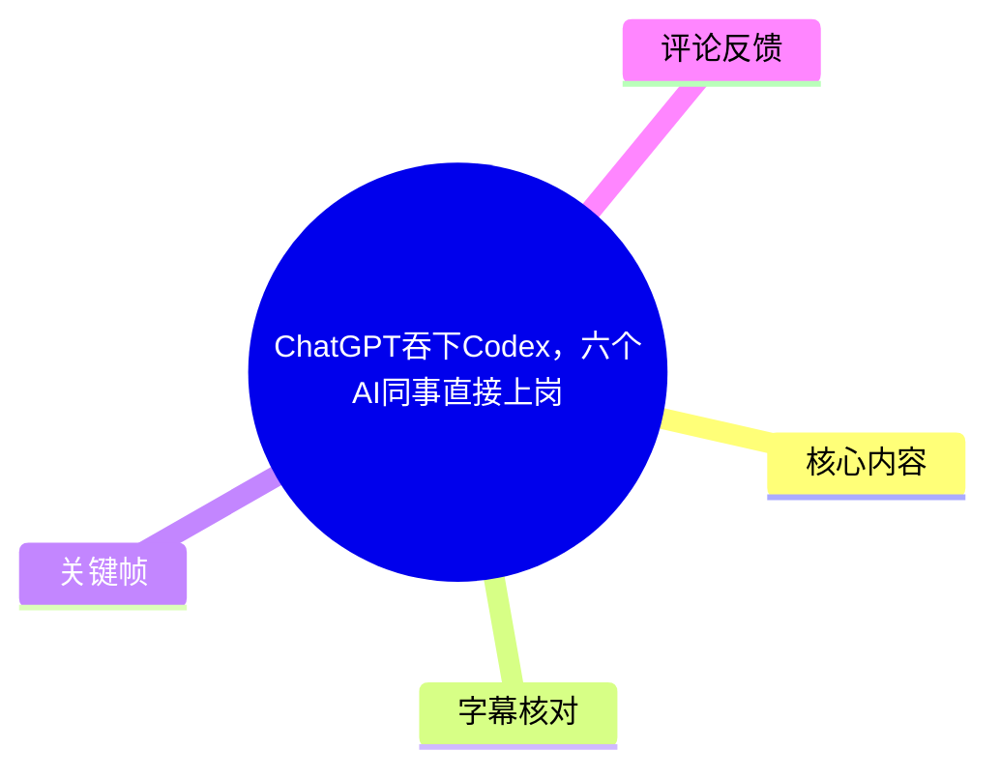
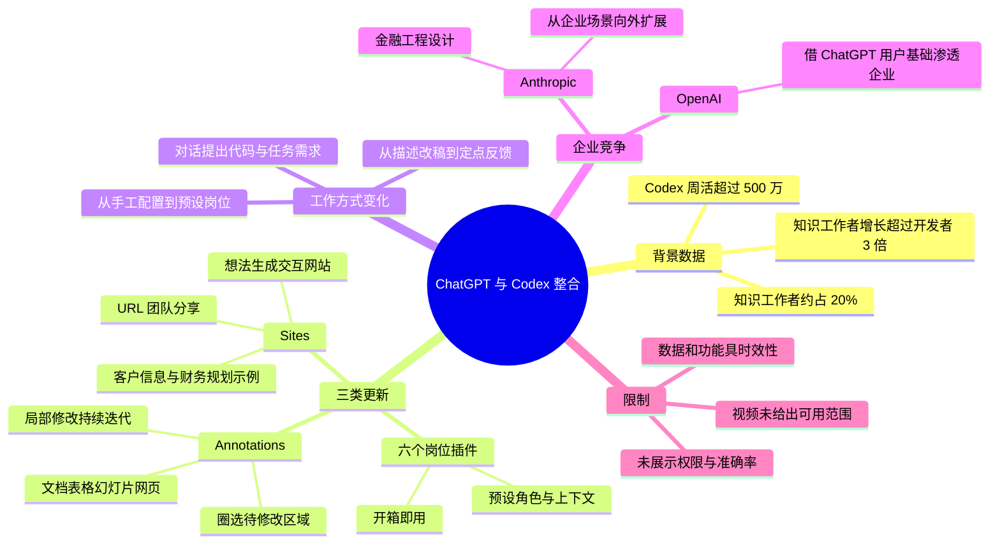
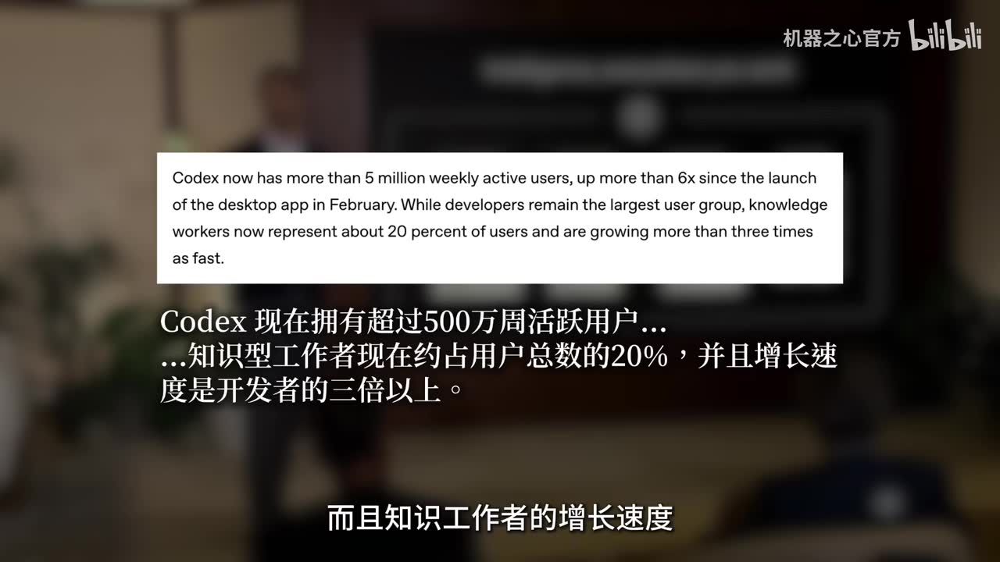

# ChatGPT吞下Codex，六个AI同事直接上岗

> 来源：[Bilibili 视频](https://www.bilibili.com/video/BV15qVm68EJh)  
> UP 主：机器之心官方｜时长：01:34｜合集：AIcode  
> 说明：本视频为新闻速览，核心信息围绕 OpenAI 所述 ChatGPT 与 Codex 的整合、岗位插件、Sites 与 Annotations，以及其与 Anthropic 的企业 Agent 路线竞争。

## 小结

视频称，ChatGPT 与 Codex 将进一步整合：用户可直接在 GPT 对话框中提出“运行代码”“写任务”等需求，而非在独立入口中单独操作 Codex。这里的“合体”是视频的概括性表述，视频没有展示具体上线范围、账号套餐、地域限制或完整产品操作界面，因此不能据此推断所有用户已可使用全部能力。

视频援引的关键规模数据是：Codex 周活跃用户已超过 **500 万**；知识工作者约占用户总数 **20%**，其增长速度超过开发者的 **3 倍**。关键帧中还能看到“自 2 月桌面应用发布以来增长超过 6 倍”的英文原文，但这项“6 倍”信息未在中文站内字幕主文本中完整展开，应作为画面引述而非进一步推导。

为承接非开发者及企业用户需求，视频归纳 OpenAI 一次推出三类能力：**面向具体岗位的 6 个插件**、将工作想法生成并分享为交互网站的 **Sites**、以及可在文档、表格、幻灯片和网页中圈选修改位置的 **Annotations（标注）**。它们共同指向同一工作流：从“配置 AI 角色—生成初稿—反复描述修改”转向“选预设角色—生成可分享产物—定点反馈迭代”。

对实际使用者而言，视频提供的经验不是“完全不需要编程”，而是将技术门槛前移为**需求表达、业务上下文、结果核验和团队治理**。视频用客户信息汇总、财务情景规划器举例，但未展示这些成果的数据权限、准确率、部署方式或协作权限控制。

竞争层面，视频认为 Anthropic 较早在金融、工程、设计等企业场景布局 Agent；Anthropic 被概括为从企业场景向外扩展，OpenAI 则依靠 ChatGPT 的大规模用户基础向企业市场渗透。视频结论是 AI Agent 竞争将更加激烈，未对两者性能、价格或市场份额做定量比较。

上述信息具有明显时效性：视频发布于 2026 年 6 月，产品名称、能力可用性、用户数据与企业策略都可能快速更新。应以 OpenAI、Anthropic 后续正式产品文档和当前账户界面为准。

## 思维导图

## 目录

- [整合背景与增长数据](#整合背景与增长数据)
- [三项功能：岗位插件、Sites 与标注](#三项功能岗位插件sites-与标注)
- [可复用的工作流与适用边界](#可复用的工作流与适用边界)
- [企业 Agent 路线之争](#企业-agent-路线之争)
- [关键帧索引](#关键帧索引)
- [结论与限制](#结论与限制)
- [字幕比对](#字幕比对)
- [评论分析](#评论分析)
- [处理记录](#处理记录)

## [整合背景与增长数据](https://www.bilibili.com/video/BV15qVm68EJh?t=0)

### [ChatGPT 对话框承接 Codex 任务](https://www.bilibili.com/video/BV15qVm68EJh?t=0)

视频开篇称“ChatGPT 和 Codex 终于要合体了”。其给出的用户层变化是：今后如需让 Codex 跑代码、写任务，可直接在 GPT 对话框中提出需求。

这段内容强调的是**交互入口整合**：用户通过对话描述目标，再让 Codex 承担代码或任务执行相关工作。视频没有提供提示词格式、代码运行环境、文件挂载方式、执行权限、结果审查机制或失败处理流程；因此不应把“直接提需求”理解为无需验证即可自动完成生产任务。

> 图：该关键帧以两个产品标志的连接关系直观呈现视频的核心新闻——ChatGPT 与 Codex 的整合叙事，有助于区分“对话入口”与“编码/任务能力”的关系。

### [用户规模与增长结构](https://www.bilibili.com/video/BV15qVm68EJh?t=7)

视频称 Codex 周活跃用户已超过 **500 万**；知识工作者约占总用户数 **20%**，且其增长速度是开发者的 **3 倍以上**。这些数字被用来解释 OpenAI 为什么要扩展更贴近非技术岗位的 Agent 能力。

画面中的英文引文进一步写道：

- Codex 周活跃用户超过 500 万；
- 自 2 月桌面应用发布以来，用户量增长超过 6 倍；
- 开发者仍是最大用户群；
- 知识工作者约占用户的 20%，增长速度超过开发者三倍。

其中，前 3 项中文口播/站内中文字幕可直接对应；“自 2 月桌面应用发布以来增长超过 6 倍”来自画面英文信息。视频没有展示原始统计口径，例如“周活跃”的计算周期、地域范围、是否包含不同端产品，因此这些指标只能按视频转述理解。

> 图：该帧保留了视频所依据的英文统计文字，是核对“500 万周活”“20% 知识工作者”“增长超过三倍”等关键参数的重要画面证据。

## [三项功能：岗位插件、Sites 与标注](https://www.bilibili.com/video/BV15qVm68EJh?t=13)

### [功能一：6 个面向岗位的插件](https://www.bilibili.com/video/BV15qVm68EJh?t=15)

第一项更新是面向具体岗位的 **6 个插件**，视频将其称为“六个不同岗位的 AI 同事拎包入住”。视频没有列出全部 6 个岗位名称；因此不能补充或臆测其具体职业清单。

视频以“专属销售顾问”为例，对比了两种方式：

| 过去的做法 | 视频称的新做法 |
| --- | --- |
| 自行逐步配置角色设定 | 使用面向岗位的预设插件 |
| 填充背景上下文 | 以开箱即用方式启动 |
| 编写操作指引等规则 | 减少从零调教的初始工作 |

“开箱即用”并不等于无需输入业务信息。视频的对比重点是减少基础角色配置，而不是承诺插件能在缺乏组织资料、目标定义与审核规则时可靠产出。

> 图：该帧展示了以 “Data Analytics” 为例的对话式任务输入与插件文件入口，能帮助理解视频所说“具体岗位插件”不是单纯的角色描述，而是嵌入对话任务流程的能力。

> 图：该帧将角色、上下文和操作指引拆开呈现，解释了视频为何将插件描述为减少前期配置成本的方案。

### [功能二：Sites——把工作想法变成交互网站](https://www.bilibili.com/video/BV15qVm68EJh?t=29)

第二项更新名为 **Sites**。中文站内字幕将其误识别为“size”，但英语、日语、西班牙语、葡萄牙语站内字幕均明确为 **Sites**；视频的语义是“把工作想法直接变成可交互的网站”。

视频描述的结果流程如下：

1. 用一句话或工作想法提出需求；
2. AI 将想法生成为交互式网站；
3. 生成后可通过 URL 分享给团队；
4. 团队乃至公司其他人员可共同使用、共同修改。

视频给出的应用例子有两类：

- 汇总客户相关信息；
- 构建财务情景规划器。

视频用“不会写代码似乎也不重要”概括低代码/无代码趋势。这是新闻视频的判断，不应延伸为“网站无需工程能力”。例如数据来源、访问控制、合规审查、复杂业务规则、测试与维护等问题，视频没有展开。

### [功能三：Annotations——圈选后定点修改](https://www.bilibili.com/video/BV15qVm68EJh?t=46)

第三项是 **Annotations（标注）**。视频认为，让 AI 生成第一版并不难，难点是持续改稿；新功能的目标是将“反复用语言描述哪里要改”变为“直接圈出待修改区域”。

视频声称该标注方式可用于：

- 文档；
- 表格；
- 幻灯片；
- 网页。

其描述的编辑逻辑为：

1. 先得到 AI 生成的初稿或已有内容；
2. 在上述内容载体中圈出要修改的位置；
3. 让 Codex 根据指向区域接受反馈；
4. 进行局部修改并持续迭代，即“指哪改哪”。

这类交互的价值在于缩小修改范围，减少“修改 A 却连带改坏 B”的沟通风险；但这是根据视频工作流作出的合理理解，并非视频对修改精度的性能承诺。视频没有说明标注如何解析、能否跨文件保留上下文、是否支持版本回滚，以及模型会不会改动圈选范围以外的内容。

## [可复用的工作流与适用边界](https://www.bilibili.com/video/BV15qVm68EJh?t=21)

结合视频中三项功能，可将其表达的实践顺序整理为以下工作流：

1. **确定任务类型**：判断任务是否接近已有岗位或常见业务场景；如是，优先考虑使用预设岗位插件，而不是从零编写角色设定、背景上下文和操作指引。
2. **在对话中陈述目标**：直接通过 GPT 对话框描述希望 Codex 执行的代码或任务。视频只说明“直接提”，未给出固定提示词模板。
3. **将成果产品化**：若目标是给多人使用的工作工具，可尝试把工作想法转成 Sites 所述的交互网站，再通过 URL 分享。
4. **用圈选替代模糊改稿**：当初稿出现局部问题时，在文档、表格、幻灯片或网页中圈选位置，提出定点修改反馈。
5. **人工审核后再协作发布**：这是对视频工作流的必要实践补充。因为视频没有说明自动执行、共享链接与生成网站的权限/安全机制，涉及客户信息、财务信息或代码运行时，应先完成内容、数据和权限复核。

### 适合的任务

按视频示例，较适合先尝试的任务包括：

- 将客户相关资料整理为可检索或可浏览的工作页面；
- 将财务假设制作成可交互的情景规划器；
- 使用岗位预设快速建立初始工作助手；
- 对已有文档、表格、演示材料或网页进行局部修订。

### 视频未覆盖、实际应确认的限制

- **产品可用性**：视频没有说明哪些 ChatGPT 计划、地区、组织账户或客户端可以使用这三项能力。
- **六个插件内容**：只确认数量与“面向具体岗位”，没有给出全部插件名称、职责、数据连接能力或权限。
- **代码执行安全**：虽然提到“跑代码”，但未说明执行沙箱、网络权限、密钥管理、文件访问范围或人工批准节点。
- **Sites 发布治理**：没有说明 URL 是否公开、是否可设置访问控制、数据是否会暴露给无权限成员。
- **标注修改边界**：没有验证 Annotations 是否严格只修改圈选区域，也未展示版本对比或撤销机制。
- **“不会代码不重要”**：这是视频的趋势性表达。业务逻辑定义、验证、数据治理与上线维护仍可能需要专业人员参与。

## [企业 Agent 路线之争](https://www.bilibili.com/video/BV15qVm68EJh?t=63)

视频指出，OpenAI 不是唯一瞄准企业市场的参与者。它称 Anthropic 更早在金融、工程、设计等场景布局企业 Agent。

视频给出的竞争框架如下：

| 公司 | 视频所述路径 | 视频提及的场景/基础 |
| --- | --- | --- |
| Anthropic | 从企业场景往外扩展 | 金融、工程、设计等企业 Agent |
| OpenAI | 借助 ChatGPT 巨大用户规模向企业市场渗透 | ChatGPT 用户基础、Codex 与新功能整合 |

需要注意，这是一段面向趋势的路线概括，而不是独立的竞争评测。视频没有提供两家公司在企业客户数量、收入、准确率、模型能力、定价、数据隔离或行业合规方面的可比较数据。

视频最终判断是，AI Agent 赛道竞争会越来越激烈，并以“谁会更胜一筹，我们拭目以待”收束。这一结论是预测性判断，不是已被证明的结果。

## [关键帧索引](https://www.bilibili.com/video/BV15qVm68EJh?t=0)

| 关键帧 | 对应主题 | 正文使用价值 |
| --- | --- | --- |
| `frames/frame-001.jpg` | ChatGPT 与 Codex 标志并列 | 直观支撑“合体/整合”这一开场新闻主题。 |
| `frames/frame-002.jpg` | Codex 用户规模英文引文 | 用于核验 500 万周活、20% 知识工作者及增长速度等参数。 |
| `frames/frame-003.jpg` | Data Analytics 插件式任务输入 | 展示“岗位插件”在对话任务入口中的具体视觉形式。 |
| `frames/frame-004.jpg` | 角色设定、背景上下文、操作指引 | 用于说明预设插件相对手工调教所减少的配置项。 |

其余关键帧文件虽在素材清单中可用，但当前提供的画面内容仅明确展示了上述 4 帧；为避免对未展示画面作无依据描述，正文未强行引用。

## [结论与限制](https://www.bilibili.com/video/BV15qVm68EJh?t=75)

这支视频的主线是：OpenAI 将 Codex 更紧密地纳入 ChatGPT 对话入口，并围绕企业与知识工作者的需求，提供岗位预设、交互网站生成和圈选式修改三种能力。其共同目标是把 AI 从“生成一次答案的工具”推向“可以接收反馈、协作交付并持续迭代的团队成员”。

可迁移的经验是，使用此类 Agent 时应把注意力从“是否会写代码”扩展到四件事：清晰定义任务、提供必要上下文、约束共享范围、验证生成结果。对于客户资料、财务规划和代码执行等高影响任务，人工审核和权限治理仍不可省略。

视频没有展示真实完整操作、功能开关、支持平台、价格、配额、数据处理方式、企业权限模型或效果评估。因此，本文不将其表述为已经验证的通用能力，也不将“6 个插件”“Sites”“Annotations”延展为视频未提及的功能细节。

## 字幕比对

| 字幕来源 | 完整性 | 专有名词 | 时间轴 | 主要问题 |
| --- | --- | --- | --- | --- |
| Bilibili 站内中文字幕 `p01-ai-zh.srt` | 覆盖 00:00–01:28，内容分段完整 | 有多处误识别：`DP/GP` 应为 GPT，`size` 应为 Sites，`and opic/and sobia` 应为 Anthropic | 逐句时间轴完整，可作为章节定位依据 | “6 个插件”与“六个 AI 同事”在相邻分段中顺序略有混排；结尾时间轴字幕到 01:28，短于 01:34 视频总时长。 |
| Bilibili 英文等多语字幕 | 内容与中文主线一致 | 英文、日文、西班牙文、葡萄牙文均确认 **Sites**、**Annotations**、**Anthropic** 等名称 | 与中文字幕时间轴一致 | 英文 00:09–00:12 一段存在重复拼接文本，不能逐字照录。 |
| 本次 ASR `asr/transcript.srt` | 检测到中文音频，识别覆盖约 62.22 秒；文本包含视频核心内容 | 存在 `GBT/GP/ChatGBT`、`Size`、`Anthobic`、`直拿改拿`、`企链` 等误识别 | 虽有时间戳，但首段从 00:25.900 才开始，且第一段只有 1 秒却塞入约 26 秒内容；后续段落过长，不能用于精确定位 | 时间切分严重失真，不宜作为正文时间轴依据。未标记 `noAudioStream=true`，因此可确认源视频存在音轨。 |

### 最终字幕选择与校正

正文以 **Bilibili 中文时间轴字幕** 作为章节时间定位来源，因为其从 00:00 开始、分段粒度正常；以英文及其他多语站内字幕交叉核对专有名词；本次 ASR 已检查，但仅作为“音频内容确为中文且主线一致”的辅助证据，不采用其不可靠的段落时间。

本次校正的重点包括：

- `DP 对话框`、`GP 对话框`、`GBT`、`ChatGBT`：统一校正为 **GPT / ChatGPT**；
- `Code X`：统一为 **Codex**；
- `size`：结合多语字幕与视频语义，校正为 **Sites**；
- `and opic`、`and sobia`、`Anthobic`：统一为 **Anthropic**；
- `直拿改拿`：结合站内中文字幕“指哪改哪”，校正为 **指哪改哪**；
- 用户统计中“超过 6 倍”的补充信息来自 `frame-002` 的英文画面引文，不作为中文口播的额外扩写依据。

## 评论分析

以下仅分析本次可获取的热评前三条；评论是用户个人经验或态度，不构成已经验证的产品事实。

1. **eamoncat（59 赞）**  
   评论者称，自己申请某国电子钱包牌照的大量智力与案头工作依赖 GPT；又称通过约十分钟陈述需求和调教输出，让 GPT 将数百页、多份文档自动标注关键点、建立搜索和锚点链接，并整合为资料检索门户。  
   - 补充价值：该评论与视频的 Sites、Annotations 叙事高度相关，提供了“长文档整理—标注—检索门户”的实际需求场景。  
   - 可信度边界：未提供产品版本、文档样本、操作记录、准确率或权限设置；“秒杀所有竞争对手”“所有竞争对手都 failed”属于主观比较，不能作为客观结论。

2. **゚゚T1-Faker（16 赞）**  
   评论者质疑“500 万”周活数据的真实性，戏称其中“至少 200 万注册机”。  
   - 补充价值：指出用户规模类新闻数字可能存在统计口径和真实性讨论。  
   - 可信度边界：评论未提供数据来源或证据。视频画面展示了相关英文统计引文，但也没有说明完整统计方法，故该质疑不能被证实或证伪。

3. **小白啥都干（10 赞）**  
   评论以调侃口吻表示，尽管某个以 “A/” 代称的对象“能力不行”，但只要竞品稍有起色就不会考虑它。  
   - 补充价值：反映部分用户对 AI 产品品牌、体验或竞争格局的情绪化评价。  
   - 可信度边界：评论未明确 “A/” 的具体指代，也没有给出能力测试或使用证据，无法用于比较 OpenAI、Anthropic 或其他产品。

## 处理记录

- **Worker ID**：`worker-mrj0www4-e8d79408`
- **模型**：`gpt-5.6-terra`
- **调用工具与素材**：视频元数据、Bilibili 站内多语 SRT 字幕、ASR 识别结果与 SRT、关键帧素材、热评 JSON。
- **ASR 检查结果**：ASR 模型为 `medium`，语言识别为中文（置信度 `0.99951171875`），音频时长 `93.34425` 秒；未出现 `noAudioStream=true`，故源视频有音轨。ASR 的时间切分异常，未用作精确章节定位。
- **字幕选择**：采用 `p01-ai-zh.srt` 的真实逐句时间轴生成 Bilibili 跳转链接；以英语、日语、西班牙语、葡萄牙语站内字幕校正 Sites、Annotations、Anthropic 等专有名词；ASR 仅辅助核验内容主线。
- **关键帧选择依据**：仅选用已提供并可明确辨认内容的 `frame-001` 至 `frame-004`，分别支撑产品整合、用户数据、岗位插件入口与人工配置项对比；未对未展示的其他帧作推测性描述。
- **缓存清理**：未提供可执行的缓存清理日志或结果；本文不虚构清理状态。
- **未解决问题**：视频未披露六个插件的完整岗位列表、功能实际可用范围、套餐/地区限制、Sites 的发布权限与数据治理机制、Annotations 的修改精度与版本控制能力；相关信息需以产品官方后续文档为准。
