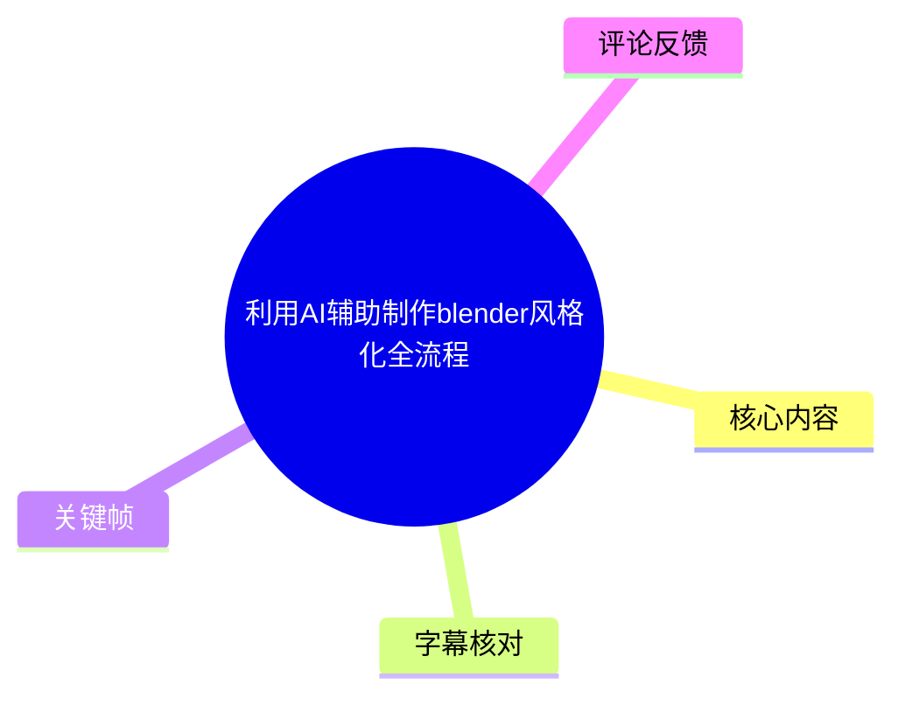
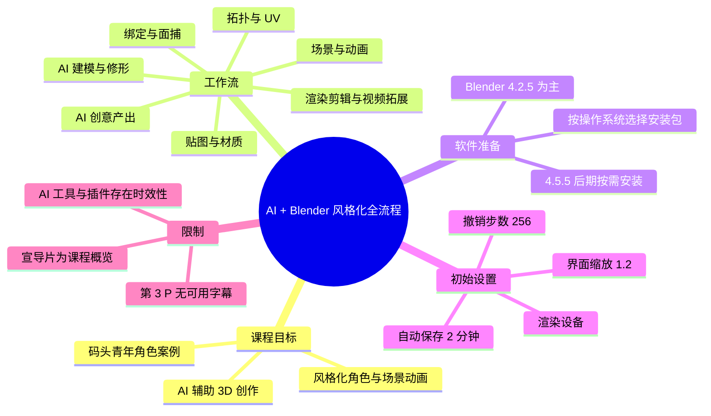
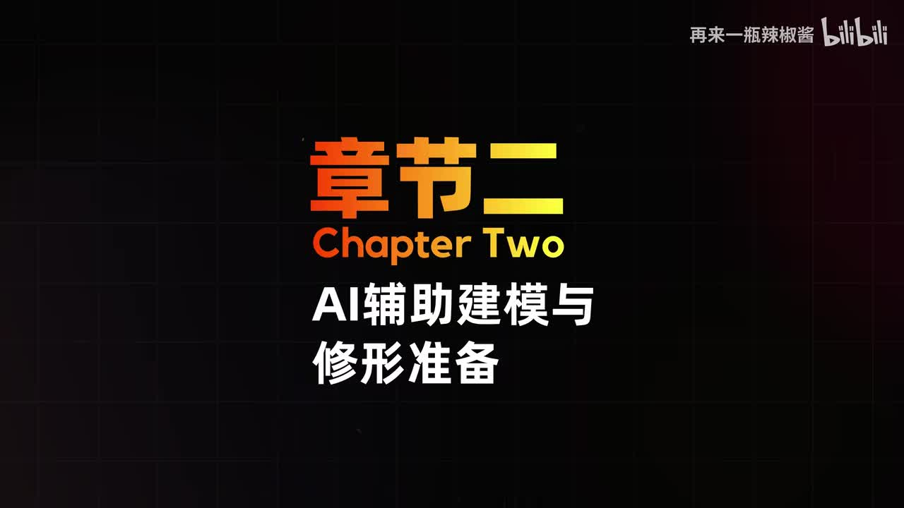
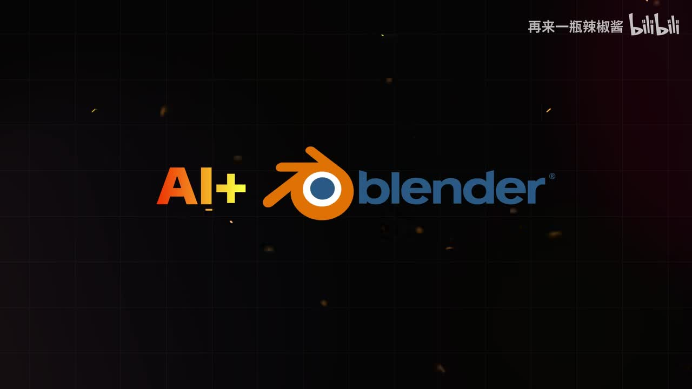

# 利用AI辅助制作blender风格化全流程

> 来源：[Bilibili 视频](https://www.bilibili.com/video/BV1fnLc6rETL)<br>
> UP 主：再来一瓶辣椒酱｜合集：AIcode｜视频总时长：26:03｜分为 3 个分 P  
> 本条素材可核验的内容包括：第 1 P「课程宣导片」完整 ASR、第 2 P「Blender 安装与入门说明」站内字幕；第 3 P 仅有分 P 标题，未提供对应字幕或语音识别文本。

## 小结

这是一套以“码头青年”角色案例为主线的 **AI + Blender 风格化角色动画与场景制作课程**的宣导与入门内容。课程定位并非只教某一个 AI 工具，而是将 AI 生图、AI 建模、AI 动捕等环节嵌入传统 3D 制作流程，覆盖从创意、模型修形、拓扑、UV、贴图、绑定、场景、动画，到渲染、剪辑及 AI 视频拓展的完整链路。

课程宣导片明确提出九个章节的结构：软件准备与基础说明、AI 辅助建模与修形准备、模型修正与拓扑/UV、贴图与风格化材质、角色绑定与面捕、案例场景搭建、动画制作、渲染优化与输出剪辑，以及 AI + Blender 拓展应用。其核心方法是：**将 AI 产出作为 3D 项目的起点或辅助，而不是跳过后续的规范化建模、材质、绑定和动画流程。**

第 2 P 给出了可直接操作的 Blender 初始环境配置。讲师建议课程主流程使用 Blender **4.2.5**，并将 **4.5.5** 留到课程后期需要时再安装；原因是最新版可能有稳定性问题，且部分插件未及时适配。Windows、Intel Mac 与 Apple Silicon Mac 需要选择各自对应的安装包。

基础设置中最重要的是性能与数据安全：界面缩放建议设为 **1.2**（需要更大字体可设为 **1.5**）；渲染设备应按硬件选择；自动保存需保持开启，默认每 **2 分钟**保存一次；撤销步数默认 **256**，增加撤销步数会增加内存消耗。完成设置后应点击“保存用户设置”。

适合已经会一点 Blender、希望建立 AI 辅助 3D 工作流的人，也适合完全零基础但愿意先完成基础预习的人。视频本身没有展示具体 AI 工具的实操界面、实际模型参数、插件清单或第 3 P 的插件安装步骤，因此这些内容不能据此视为已验证的具体操作方案。

时效上，软件版本、插件兼容性、AI 工具名称与能力都可能快速变化。特别是视频中的“4.2.5/4.5.5 推荐”和扩展插件适配判断，应在实际安装前以 Blender 官方下载页、插件发布页和课程附件为准。

## 思维导图





## 目录

- [视频结构、素材范围与学习定位](#视频结构素材范围与学习定位)
- [课程全流程：九个章节及其衔接](#课程全流程九个章节及其衔接)
- [Blender 安装：版本策略与系统选择](#blender-安装版本策略与系统选择)
- [首次启动与基础界面设置](#首次启动与基础界面设置)
- [性能、保存与内存相关设置](#性能保存与内存相关设置)
- [零基础预习与可执行清单](#零基础预习与可执行清单)
- [限制、风险与时效性](#限制风险与时效性)
- [字幕比对](#字幕比对)
- [评论分析](#评论分析)
- [处理记录](#处理记录)

## 视频结构、素材范围与学习定位 [00:00:03](https://www.bilibili.com/video/BV1fnLc6rETL?t=3)

视频元数据显示总时长为 26:03，由以下三个分 P 构成：

| 分 P | 标题 | 时长 | 本次可用素材情况 |
| --- | --- | ---: | --- |
| P1 | 课程宣导片 | 03:03 | 有本次 ASR，语音覆盖约 92.86% |
| P2 | 0-blender安装与入门说明 | 07:31 | 有站内时间轴字幕 |
| P3 | 1-blender必备插件安装与说明 | 15:29 | 仅有分 P 元数据标题；未提供可用字幕或 ASR |

宣导片中，讲师将课程描述为“AI 加 Blender 角色动画场景全流程的风格化教程”，案例围绕“码头青年”展开。课程既包含基础 3D 全流程内容，也试图加入 AI 辅助创作思路。



> 图：画面明确展示“章节二：AI辅助建模与修形准备”。它验证了课程的章节式组织，以及 AI 建模并非终点、后续仍需“修形准备”的课程定位。

从本次所给关键帧和宣导片语音可知，视频强调的是组合式工作流：AI 负责创意、初始模型或辅助能力，Blender 则承接修形、规范化、材质、绑定、动画和渲染等 3D 生产环节。这里的“AI + Blender”是课程框架，不应解读为 AI 可以自动完成所有后续制作。

## 课程全流程：九个章节及其衔接 [00:00:28](https://www.bilibili.com/video/BV1fnLc6rETL?t=28)

### 1. 软件准备与入门说明 [00:00:28](https://www.bilibili.com/video/BV1fnLc6rETL?t=28)

宣导片说明，第一章将准备必备软件、插件及 AI 工具集，并附带零基础入门说明和动画制作常识。其作用是建立软件环境与基础认知，降低后续案例跟学门槛。

本条视频的 P2 正是该章节的一部分，实际讲解了 Blender 的下载、安装、首次启动和偏好设置。

### 2. AI 辅助建模与修形准备 [00:00:52](https://www.bilibili.com/video/BV1fnLc6rETL?t=52)

课程计划介绍主流 AI 生图与 AI 建模工具，并提到“即梦”“Tripo 3D”“Rodin”等名称的语音识别结果。由于 ASR 对专有名词存在明显误识风险，以下只记录其课程意图，不将工具拼写视为已核验：

1. 利用 AI 生图或 AI 建模工具获得角色初步模型；
2. 为 AI 模型进入 Blender 后的雕刻和修形做准备；
3. 将 AI 结果纳入可编辑的 3D 生产流程。



> 图：画面以“AI + Blender”为核心视觉信息，直接对应课程的技术组合：以 AI 辅助创作、以 Blender 完成后续制作。该图只能证明视频的主题呈现，不能证明特定 AI 工具、插件或工作流已经在本条素材中完成演示。

### 3. 模型修正、拓扑规范化与 UV [00:01:17](https://www.bilibili.com/video/BV1fnLc6rETL?t=77)

宣导片称，AI 产出的模型会在 Blender 雕刻模式中进行后期修正，再结合自动与半自动拓扑方式进行规范化处理，最后为模型展开 UV。

这一段体现出课程的重要经验：

- AI 模型不是可以直接进入动画生产的最终资产；
- 修形用于改善模型外观与结构；
- 拓扑用于让模型更适合后续绑定、变形和制作；
- UV 是贴图和材质流程的前置条件。

视频未给出网格面数、拓扑工具名称、UV 接缝策略或具体参数，不能补充为确定性技术细节。

### 4. 贴图与风格化材质 [00:01:32](https://www.bilibili.com/video/BV1fnLc6rETL?t=92)

课程计划使用专业绘图软件制作角色贴图，并在 Blender 中拆解“3D 风格化材质”（ASR 该处识别不稳定，无法确认具体风格名称），最终将码头青年角色转化为风格化质感。

可确认的流程关系为：

```text
规范模型 + UV
    ↓
角色贴图绘制
    ↓
Blender 内材质拆解与组合
    ↓
风格化视觉效果
```

视频未提供具体绘图软件名称、贴图通道、节点网络或材质数值，因此不能将其写成可复现的材质配方。

### 5. 角色绑定、面部与衣物动态 [00:01:48](https://www.bilibili.com/video/BV1fnLc6rETL?t=108)

宣导片表示将逐步搭建：

- 角色基础绑定；
- 面部绑定；
- 视频面捕与实时面捕；
- 帽子、领带等物件的动态效果。

这说明课程同时覆盖骨骼变形、面部表现和附属物运动。ASR 将其中一部分识别为“谷歌动力”等错误词，结合语义仅可确认其指向衣物/配饰动态相关内容，无法据此认定所用物理系统、插件或解算方案。

### 6. 案例场景搭建 [00:02:12](https://www.bilibili.com/video/BV1fnLc6rETL?t=132)

场景部分计划：

1. 用几何节点完成电梯的搭建和动画制作；
2. 通过简单几何体和平面搭建外部场景；
3. 结合场景插件与风格化资产，完成整体场景塑造。

这里可迁移的思路是：先用简单几何组织场景大结构，再添加资产与风格化处理；对于具有规律性或重复性结构的场景元素，可考虑使用几何节点。

### 7. 场景动画、角色动画与镜头 [00:02:13](https://www.bilibili.com/video/BV1fnLc6rETL?t=133)

课程计划把风吹植物动画、角色动画、动作重定向及镜头动画组合成完整场景。其重点不是孤立制作某个动作，而是将环境动态、角色表演和镜头调度整合为一个镜头或片段。

“动作重定向”可理解为将已有动作数据适配到目标角色骨骼的过程；但本素材没有说明动作来源、骨骼标准、重定向工具和修正步骤。

### 8. 渲染优化、输出与剪辑 [00:02:37](https://www.bilibili.com/video/BV1fnLc6rETL?t=157)

宣导片称会利用“相机”“节点”等手段优化渲染性能，最终导出到剪映进行后期剪辑。ASR 对“相机……节点”中间词存在识别错误，因此只能确认以下事实：

- 课程包含渲染性能优化；
- 课程包含渲染输出；
- 输出后进入剪映完成后期剪辑。

不能据此确认具体使用了哪一种相机设置、节点类型、渲染器、采样数、分辨率或编码参数。

### 9. AI + Blender 拓展应用 [00:02:37](https://www.bilibili.com/video/BV1fnLc6rETL?t=157)

拓展内容包括：

- AI 视频动补；
- AI 辅助渲染；
- AI 趣味视频等结合玩法。

这是建立在前述 3D 工作流完成后的扩展方向。视频将课程定位为录播形式，称课程经过剪辑和内容打磨，并提供配套学习资料；该说法属于课程方的介绍，具体资料内容、交付范围和可访问性需以课程页面及附件为准。

## Blender 安装：版本策略与系统选择 [00:03:03](https://www.bilibili.com/video/BV1fnLc6rETL?t=183)

> 本节为 P2 的本地时间 00:00:00 起。链接秒数按 P1 时长 183 秒加 P2 本地时间换算，用于对应总视频顺序。

### 下载与版本选择

讲师的操作顺序如下：

1. 在浏览器搜索 Blender 并进入官网，也可以通过课程附件中的官网链接进入。
2. 官网首页默认展示最新版本，点击下载按钮后会自动识别电脑系统。
3. 下载跳转到赞助页面时可忽略；讲师强调 Blender 是免费开源软件，下载会自动进行。
4. **不要因为首页展示最新版本就直接安装。** 讲师认为最新版可能存在不稳定因素，且常用插件可能未及时跟进版本迭代。
5. 通过顶部“下载”进入历史版本页面，选择下载任意版本，进入 4.2 系列。
6. 在 4.2 的小版本中选择 **4.2.5**。

讲师将 **4.2.5**称为 Blender 官方指定的稳定版本之一，并说明本套课程以该版本为主；**4.5.5** 暂时无需安装，待后续课程需要时再安装。

> 版本提示：上述“稳定版本”与“插件适配”结论是视频讲师在录制时的建议。Blender 的当前正式版、LTS 策略与插件兼容状态可能已变化，实际项目应先确认课程项目文件、插件版本和本机系统兼容性。

### 按硬件平台选择安装包 [00:04:16](https://www.bilibili.com/video/BV1fnLc6rETL?t=256)

视频区分了三类安装包：

| 设备类型 | 应选择的安装包原则 |
| --- | --- |
| Windows 电脑 | 选择 Windows 对应版本 |
| Intel 芯片 Mac | 选择 Intel Mac 对应版本 |
| Apple M 系列芯片 Mac | 选择 Apple Silicon / M 芯片对应版本 |

课程附件中也已放置安装包。若按本课程主线学习，先安装 Blender 4.2.5 即可。

### 安装与首次打开 [00:05:06](https://www.bilibili.com/video/BV1fnLc6rETL?t=306)

安装过程按视频说明较为简单：

1. 双击安装包运行；
2. 按安装向导持续点击“下一步”；
3. 安装完成后，在桌面找到 Blender 4.2.5；
4. 双击启动，等待进入 Blender 界面。

首次打开时，软件会提示语言设置，可改为中文。启动弹窗可点击空白处隐藏。

视频中出现的黑色弹窗是讲师已安装的“真实相机”插件产生的提示；讲师明确说明初学者当前不会看到它，可先忽略。它不是 Blender 初始安装的必然界面。

## 首次启动与基础界面设置 [00:05:56](https://www.bilibili.com/video/BV1fnLc6rETL?t=356)

进入 Blender 后，视频给出的路径是：

```text
编辑 → 偏好设置
```

### 界面缩放与语言 [00:06:03](https://www.bilibili.com/video/BV1fnLc6rETL?t=363)

在“界面”设置中，讲师建议调整界面分辨率/缩放比例：

| 项目 | 建议值 | 视频中的理由 |
| --- | ---: | --- |
| 界面缩放 | 1.2 | 字号显示更舒适 |
| 更大字号需求 | 1.5 | 适合希望界面文字更大的用户 |
| 默认值 | 1.0 | 缩小后界面字号会随之变小 |

视频中“分辨率”实际指 UI 显示缩放相关设置，非最终渲染图像的输出分辨率。不要混淆这两类参数。

语言可在界面设置中切换。虽然可使用英文界面，讲师从学习角度建议使用中文界面，其余语言选项保持默认即可。

### 暂不需要调整的选项 [00:06:50](https://www.bilibili.com/video/BV1fnLc6rETL?t=410)

视频建议初学阶段对以下项目保持默认：

- 视图；
- 灯光；
- 编辑；
- 动画；
- 主题；
- 输入；
- 视图切换。

“获取扩展”用于系统自带插件的安装与更新，也可安装外部插件；“插件”面板用于外部插件的安装与显示。讲师表示插件的具体操作会在下一节介绍，但该 P3 的实际字幕或语音内容未提供，因此不能在本文补写其安装步骤。

## 性能、保存与内存相关设置 [00:07:11](https://www.bilibili.com/video/BV1fnLc6rETL?t=431)

### 渲染设备设置 [00:07:41](https://www.bilibili.com/video/BV1fnLc6rETL?t=461)

视频认为“系统”选项十分重要，因为它直接影响软件渲染速度，核心是顶部的渲染设备设置。

讲师给出的原则是：

| 平台与硬件情况 | 视频建议 |
| --- | --- |
| Windows 有独立显卡 | 切换到视频中所示的 GPU 计算选项；ASR/站内字幕将其写作“obo tics”，无法可靠确认实际英文名称 |
| 显卡性能较好 | 只勾选显卡 |
| CPU 性能较好 | 可将下方 CPU 也勾选 |
| Apple M 芯片 Mac | 关注视频中对应 M 芯片的选项 |
| Intel 芯片 Mac | 关注视频中对应 Intel 的选项 |

需要特别注意：站内字幕对 GPU 后端名称的识别明显不可信，本文不将其还原为某个具体技术名。实际设置中应以 Blender 当前版本“偏好设置 → 系统 → Cycles 渲染设备”内可选项为准，并根据硬件和驱动情况测试。

### 自动保存与撤销步数 [00:08:25](https://www.bilibili.com/video/BV1fnLc6rETL?t=505)

视频要求确保启用自动保存，原因是软件崩溃且忘记手动保存时，仍有机会借助自动保存文件恢复工作。

关键参数如下：

| 设置 | 视频默认/建议 | 影响 |
| --- | ---: | --- |
| 自动保存 | 必须开启 | 降低崩溃导致的未保存文件损失 |
| 自动保存间隔 | 默认每 2 分钟 | 缩短间隔会产生额外内存消耗，因此建议保持默认 |
| 撤销步数 | 默认 256 | 增大可保留更多操作历史，但会增加内存消耗 |

视频还提到“文件路径”设置会在添加风格化资产时再讲，当前可暂不处理。

完成偏好设置后，为避免设置未写入，应执行：

```text
偏好设置窗口左下角 → 保存用户设置
```

## 零基础预习与可执行清单 [00:09:26](https://www.bilibili.com/video/BV1fnLc6rETL?t=566)

对于完全零基础的学习者，讲师建议先通过课程附件中的基础预习链接进入一个 B 站教程。视频称该基础教程共六节，适合掌握 Blender 基础操作，学习压力相对较低。

此外，视频提到可以在课程附件中打开讲师个人 B 站链接，或在 B 站搜索“大鱼干货时间”查看免费课程合集，其中包括：

- 面向零基础的案例教程；
- 插件分享；
- 进阶案例教程；
- 技巧案例等。

这些频道与课程资源的存在、内容数量及后续更新属于视频发布时的描述，当前访问状态未在本次素材中核验。

### 建议执行顺序

根据视频已经提供的可验证内容，可按以下顺序准备：

1. 确认自己的操作系统与芯片类型：Windows、Intel Mac 或 Apple Silicon Mac。
2. 从 Blender 官网历史版本或课程附件获取 Blender 4.2.5 安装包。
3. 安装并首次启动 Blender，将语言设为中文。
4. 打开“编辑 → 偏好设置”，将界面缩放设为 1.2；如确有需求可使用 1.5。
5. 根据自身硬件，在系统设置中检查可用的渲染设备。
6. 确保自动保存已开启，保持默认的 2 分钟间隔。
7. 保持撤销步数默认 256，除非确认设备内存充足且确有更多历史记录需求。
8. 点击“保存用户设置”。
9. 零基础学习者先完成基础预习，再进入后续 AI 建模、绑定、动画课程。

## 限制、风险与时效性 [00:10:21](https://www.bilibili.com/video/BV1fnLc6rETL?t=621)

1. **素材覆盖不完整**：总视频包含 3 个分 P，但本次 ASR 仅覆盖 P1，站内字幕仅提供 P1 与 P2；P3“Blender 必备插件安装与说明”没有可用正文素材。因此本文不能虚构插件名称、安装来源、启用步骤或配置参数。

2. **P1 站内字幕失配**：P1 站内字幕内容是与 AI/Blender 课程无关的对白，和本次 ASR、关键帧及视频标题均不一致，不能作为该分 P 的可靠转录。

3. **ASR 专有名词误识**：本次 ASR 对部分工具、功能和术语有明显误识，例如工具名、动态相关术语、渲染设备后端名等。本文仅在语义和其他素材能够支持时概括其功能，不把误识文本当作准确技术名。

4. **版本具有时效性**：视频建议的 Blender 4.2.5 与 4.5.5、插件兼容性和 AI 工具能力均会随版本更新而变化。若项目必须复现课程，优先锁定课程指定版本；若新项目追求新功能，先在副本工程中验证升级与插件兼容性。

5. **硬件建议不是性能保证**：视频所称“显卡好则只勾选显卡、CPU 好可同时勾选”是讲师经验性建议。不同 GPU、CPU、驱动、渲染器和场景复杂度下的结果可能不同，仍应以实际测试为准。

6. **课程宣导不等于技术实操证明**：P1 主要是课程范围说明，未演示 AI 生图、AI 建模、拓扑、绑定、面捕、几何节点、渲染节点或剪辑的完整实操。因此不能从宣导片推导出工具效果、成功率或工作效率。

## 字幕比对

| 字幕来源 | 完整性 | 专有名词 | 时间轴 | 主要问题 |
| --- | --- | --- | --- | --- |
| Bilibili 站内字幕 P1 | 不可用于课程内容 | 与课程主题不符 | 有精确时间轴 | 内容为无关对白，与视频标题、关键帧和 ASR 严重冲突，判定为字幕失配 |
| Bilibili 站内字幕 P2 | 完整覆盖 07:31 的安装入门课 | 部分 GPU 后端名称错误或不清晰 | 有精确时间轴 | 对“渲染设备”具体选项识别不可靠，但安装和设置流程整体连贯 |
| 本次 ASR | 覆盖 P1 约 03:02，语音覆盖率 92.86% | 多个 AI 工具名与技术词存在误识 | 有精确时间轴 | 句子过长、分词不稳定；不能可靠还原若干工具和功能名称 |
| P3 字幕/ASR | 未提供 | 无法判断 | 无 | 只能确认分 P 标题为“blender必备插件安装与说明” |

### 最终字幕采用策略

- **P1（课程宣导片）**：采用本次 ASR 的时间轴与课程结构信息，并通过视频标题、元数据描述和关键帧进行主题校验；不采用失配的站内字幕 P1。
- **P2（安装与入门）**：采用站内字幕，因为其内容完整、步骤连贯且带有精确时间轴。
- **P3（插件安装）**：不做内容扩写，仅保留元数据中可确认的标题。

本次 ASR 诊断显示音频语言为中文，语言置信度为 0.9976，且未标记 `noAudioStream=true`；因此源视频存在可识别音轨，本次 ASR 不是无音轨场景下的替代方案。

关键帧对字幕选择的价值在于：`frame-001.jpg` 显示“AI辅助建模与修形准备”，`frame-002.jpg` 显示“AI + blender”，与本次 ASR 的课程宣导内容一致，进一步表明 P1 站内字幕的武侠/对白文本与实际课程内容不匹配。

## 评论分析

本次仅获取到 2 条热评，少于要求的“热评前三条”；不补造缺失评论。

| 评论者 | 点赞 | 评论概括 | 可提供的信息与可信度 |
| --- | ---: | --- | --- |
| 深夜阅片 | 1 | 连续使用狗头表情。 | 未提供与课程内容、软件版本或学习体验有关的实质信息，无法作为内容评价依据。 |
| 千层蛋糕真的高i | 1 | 称赞视频内容做得好，表达支持并期待互关。 | 属于鼓励性评论，反映正面态度，但没有提供可核验的课程质量、技术细节或使用反馈。 |

评论区没有出现对 Blender 版本、插件安装、AI 工具效果、课程资料或技术问题的具体补充，也没有可识别的争议点。

## 处理记录

- Worker ID：`worker-mrj0www4-e8d79408`
- 模型：`gpt-5.6-terra`
- 可用工具/产物：视频元数据、分 P 信息、站内 SRT 字幕、本次 ASR 结果与 SRT、ASR 诊断、关键帧、热评 JSON。
- 本次 ASR 检查：已检查。ASR 使用 `medium` 模型、CUDA、`float16`，识别语言为中文；音频时长约 182.70 秒，对应 P1 宣导片。
- 字幕选择：P1 采用本次 ASR，原因是站内 P1 字幕与课程主题完全失配；P2 采用站内 SRT；P3 无可用字幕，因此不扩写。
- 时间轴依据：P1 链接使用 ASR 实际起止时间换算秒数；P2 链接使用站内 SRT 本地时间，并以 P1 时长 183 秒换算为总视频顺序秒数。
- 关键帧选择依据：选择 `frames/frame-001.jpg` 说明第二章“AI辅助建模与修形准备”，选择 `frames/frame-002.jpg` 说明“AI + Blender”课程主题；两图均用于校验宣导片主题和帮助理解课程结构。
- 评论处理：仅分析可获取的前 2 条热评；未获取到第 3 条，不作补全。
- 缓存清理：素材中未提供缓存清理执行日志；未将其表述为已完成。
- 未解决问题：P3 的插件名称、来源、安装流程和配置未提供；P1 中部分 AI 工具、动态术语与渲染设备名称受 ASR 误识影响，无法据素材可靠还原。
