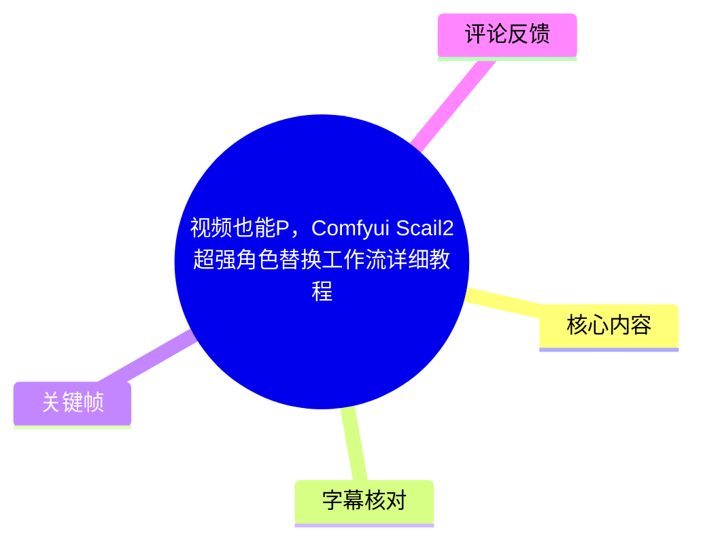
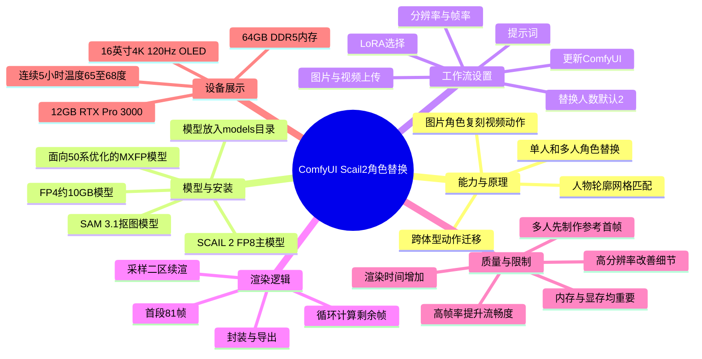
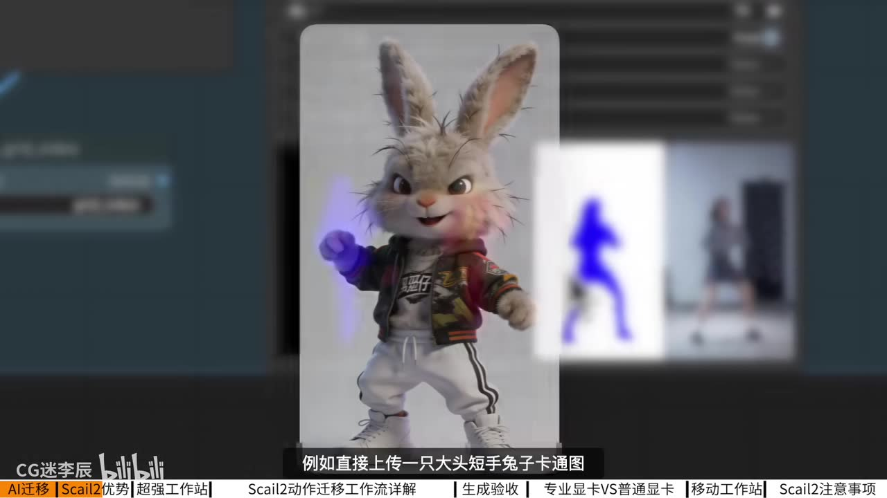
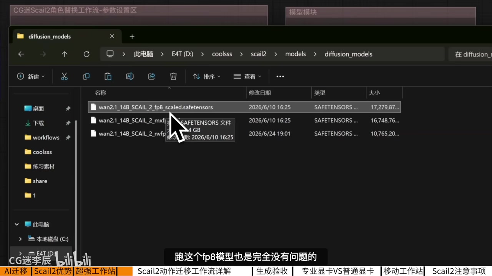
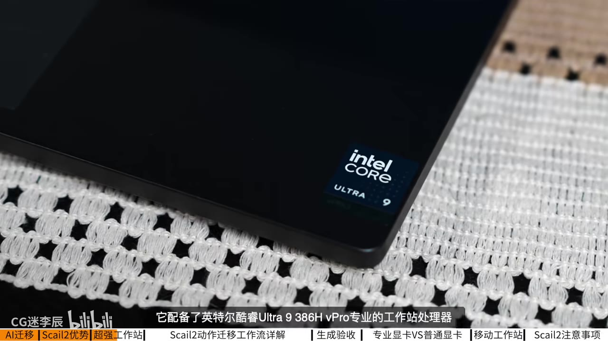

# 视频也能P，Comfyui Scail2超强角色替换工作流详细教程

> 来源：[Bilibili 视频](https://www.bilibili.com/video/BV13cKV6rELq)  
> UP 主：CG迷李辰｜时长：14 分 39 秒｜分辨率：1920×1080  
> 素材说明：站内未提供可用字幕；本笔记以带时间戳的本次 ASR 为主要依据，并结合关键帧校对可见的产品、模型和界面信息。

## 小结

视频讲解了一个运行于 ComfyUI 的 **Scail2 / SCAIL 2 视频角色替换工作流**。其核心思路是：上传替换角色图片与原始动作视频，先用 **SAM 3.1** 抠出角色，再利用人物轮廓与视频人物动态轮廓之间的网格匹配来迁移动作。作者认为，相较此前依赖姿态捕捉的 WanAnimate 类方案，这种方式减少了手动选区需求，并提升了跨体型角色替换的可行性。

工作流的实操重点不在全部节点，而在两个红色配置区域：一是生成参数、提示词、替换人数、素材上传和模型选择；二是配合分段采样完成长视频渲染。作者强调，使用前必须将 ComfyUI 更新至最新版，否则可能报错；模型文件需要放入 ComfyUI 安装目录下的 `models` 目录。

显存方面，作者实测称 12GB 显存可运行 FP8 主模型，显存较紧张时可使用约 10GB 的 FP4 模型；同时提醒，复杂视频工作流不只受显存制约，系统内存也很关键。其演示设备配有 64GB DDR5 内存，满载时工作流内存占用最高可到约 49GB——这是作者设备和工作流场景下的观察，不应直接等同于所有硬件组合的固定门槛。

视频后半段较大篇幅为 Dell Pro Precision 7 移动工作站的体验与对比：作者主张其 12GB NVIDIA RTX Pro 3000 专业显卡在同参数 Scail2 工作流中快于一张 16GB 的“400Ti”台式显卡，并给出连续 5 小时渲染时 65–68℃的温度描述。这些均为视频作者的单次展示性测试，未交代完整驱动版本、功耗墙、实际总耗时、视频素材规格和可复现实验记录，不能推广为普遍性能结论。

多人替换是重点限制场景：作者建议先从原视频截取一帧，用在线生图工具将该帧中的人物预替换为目标角色、同时保持原姿势，再把处理后的图片上传工作流。输出质量还与分辨率、帧率有关：提高分辨率有助于面部、手指等细节；16 帧率在演示中较低帧率更流畅，但会增加渲染时长。

本文适合已经会安装、更新 ComfyUI，并希望本地进行 AI 视频角色替换的创作者阅读。模型文件、节点实现、第三方在线生图服务及硬件产品均可能持续更新，尤其应以视频描述区给出的网盘资源和当前项目说明为准。

## 思维导图

## 目录

- [效果演示、问题与方法变化](#效果演示问题与方法变化-0000)
- [模型准备与环境要求](#模型准备与环境要求-0310)
- [工作流参数与节点逻辑](#工作流参数与节点逻辑-0423)
- [分段渲染、导出与质量检查](#分段渲染导出与质量检查-0648)
- [硬件演示与性能主张](#硬件演示与性能主张-0736)
- [多人替换与画质优化步骤](#多人替换与画质优化步骤-1226)
- [限制、时效性与可迁移经验](#限制时效性与可迁移经验-1402)
- [字幕比对](#字幕比对)
- [评论分析](#评论分析)
- [处理记录](#处理记录)

## [效果演示、问题与方法变化](https://www.bilibili.com/video/BV13cKV6rELq?t=0)

### [单图角色替换与多人动作复刻：演示范围](https://www.bilibili.com/video/BV13cKV6rELq?t=0)

作者开场展示“以一张图片替换视频角色并复刻动作”的效果，称点击执行后，动作会被迁移到目标角色。随后展示多人替换：上传两个目标角色图和一段人物出场视频，生成替换后的视频；还展示了三人跳舞的复杂肢体交错场景。

这些片段证明视频的目标是**角色外观替换与动作迁移的组合任务**，并非仅对单帧图像换脸。视频的演示性结论是多人场景也能处理，但未给出所有素材条件、失败案例或成功率，因此应将其理解为样例效果，而非稳定性保证。

> 图：画面左右呈现原始人物动作与小丑、橙色服装角色替换后的结果，是理解“保留动作、替换角色外观”这一任务定义的直接证据；画面下方还列出了视频的章节导航。

### [Scail2 相对旧方法的定位](https://www.bilibili.com/video/BV13cKV6rELq?t=56)

作者将 Scail2 与此前讲过的 WanAnimate 方法比较，指出旧方案有两项痛点：

1. 需要手动点选要替换的区域，操作繁琐；
2. 旧方法依赖姿态捕捉进行动作迁移；当源人物和目标角色体态差异较大时，迁移受到限制。

据作者介绍，Scail2 使用“人物网格”思路：将图片人物轮廓与视频中人物动态轮廓匹配，因此即便目标是大头、短手等比例夸张的卡通兔子，也可以映射动作。这里的“网格匹配”是作者对工作流机制的描述；视频未展示算法论文、节点源代码或量化评估，不能据此进一步推断其具体网络结构。

> 图：关键帧中可见大头短手兔子角色图，背景为工作流界面和动作视频预览；它具体说明了作者所称的“跨体型”示例，而不只是抽象描述。

## [模型准备与环境要求](https://www.bilibili.com/video/BV13cKV6rELq?t=190)

### [模型类型、显存说法与目录放置](https://www.bilibili.com/video/BV13cKV6rELq?t=190)

作者称已在评论区准备本课使用的模型、练习素材和工作流；视频简介另给出夸克网盘、百度网盘链接。资源链接具有时效性和可访问性风险，下载前应自行核验文件来源、许可、哈希及安全性。

视频说明涉及以下文件类型：

| 类别 | 视频中的说明 | 选择建议与注意事项 |
| --- | --- | --- |
| SAM 3.1 | 用于抠图 | 负责从上传的角色图中分离角色主体。 |
| SCAIL 2 FP8 | 主模型 | 作者称 12GB 显存实测可运行。 |
| 面向 50 系显卡优化的模型 | ASR 识别为“MX / MXFP”类名称 | 关键帧可见文件名中含 `mxfp`，但精确文件名应以下载包为准。 |
| FP4 | 容量约 10GB | 作者建议显卡条件较弱时选择。ASR 对该术语有误识可能，需按实际文件名确认。 |
| 加速 LoRA | 工作流模型选项 | 作者称 `i2b`、`t2v` 的 LoRA 均可选择测试。 |

关键帧中的资源管理器显示路径位于 `models/diffusion_models`，可见文件名包含 `wan2.1_14B_SCAIL_2_fp8_scaled.safetensors`，以及名称含 `mxfp`、`nvfp4` 的相关文件。视频口播将安装概括为：将全部模型文件夹复制至 ComfyUI 安装目录的 `models` 下。实际应保留资源包原有的子目录结构；若某节点无法识别模型，应优先查阅该工作流发布者的目录要求，而不要机械地把所有文件扁平堆放。

> 图：画面直接展示 `diffusion_models` 文件夹及 SCAIL 2 相关 `.safetensors` 文件，是核对模型命名、格式与存放子目录的关键参考。文件大小在截图中未完整可读，本文不据此补充未展示的精确数值。

### [运行前置条件与资源规划](https://www.bilibili.com/video/BV13cKV6rELq?t=239)

作者明确提醒：**先把 ComfyUI 更新到最新版本**，否则运行工作流可能报错。工作流大多数节点由官方本身支持，用户通常只需要调整两个标红区域中的节点。

硬件资源方面，视频给出的经验是：

- 过去运行大型复杂视频工作流，往往至少需要 16GB 显存；
- 此 Scail2 工作流可在 12GB 显存条件下运行；
- 显存不够时应优先降低生成分辨率；
- 系统内存同样重要，影响大模型缓存读取和视频分段渲染；
- 作者使用 64GB DDR5 内存，称 Scail2 满载时内存占用可达约 49GB；
- 内存不足又同时开启网页、Photoshop 等程序，可能发生卡顿、蓝屏或死机。

其中“12GB 可跑”不表示任何 12GB 显卡、任何分辨率和任意视频长度都可用。模型精度、驱动、系统内存、输入素材、帧数、分辨率、后台程序和工作流版本都会改变实际占用。

## [工作流参数与节点逻辑](https://www.bilibili.com/video/BV13cKV6rELq?t=263)

### [可操作参数：从素材到生成设置](https://www.bilibili.com/video/BV13cKV6rELq?t=263)

按视频的实际讲解顺序，可将操作整理为以下流程：

1. **更新环境**：将 ComfyUI 更新至最新版本，安装并正确放置所需模型。
2. **加载工作流**：打开 Scail2 工作流，优先关注两个红色参数区域，其余基础节点通常无需改动。
3. **设置输出尺寸**：在参数区填写生成视频宽度和高度。显存不足时降低分辨率。
4. **设置视频时间参数**：填写生成视频的帧率和总帧数。视频未在字幕中给出具体默认数值。
5. **填写提示词**：用简洁文字描述预期动作，例如“角色在跳舞”或“角色在打篮球”。
6. **设置替换人数**：默认值为 `2`；若替换角色超过两人，必须将该数值改为实际人数。
7. **上传素材**：上传角色图片和动作源视频。
8. **选择模型与 LoRA**：在模型板块选择 SCAIL 2 主模型，并按工作流要求选择加速 LoRA；作者称 `i2b` 与 `t2v` LoRA 都可使用。
9. **运行与检查**：工作流会执行抠图、网格匹配、分段采样和封装导出，输出后检查人物、衣物、头发与动作细节。

### [基础节点、抠图与轮廓网格匹配](https://www.bilibili.com/video/BV13cKV6rELq?t=359)

作者将未重点调整的基础部分概括为：

- 图像缩放节点；
- 渲染调度器；
- 采样器；
- 工作流全局连接设置节点。

核心处理模块则包括：

1. **抠图模块**：通过 SAM 3.1 从上传角色图中抠出角色；
2. **Scail2 网格匹配模块**：匹配目标角色轮廓与视频人物动态轮廓；
3. **视频分段渲染模块**：把视频拆成多个采样段，控制显存占用；
4. **封装模块**：生成便于对比的动作迁移视频，并提供单独的视频保存导出结果。

对于实际使用而言，角色图的轮廓清晰度和人物主体完整性会直接影响抠图与匹配的输入质量；这一点是由流程结构可推得出的操作性风险，而视频未给出具体的图片尺寸、背景复杂度或透明通道要求。

## [分段渲染、导出与质量检查](https://www.bilibili.com/video/BV13cKV6rELq?t=408)

### [81 帧首段与循环续渲机制](https://www.bilibili.com/video/BV13cKV6rELq?t=408)

作者说明该工作流使用分段渲染以降低显存消耗，流程如下：

- **采样一区**通常只渲染 **81 帧**视频；
- 超出部分交由**采样二区**继续渲染；
- 如果仍有剩余帧数，则进入下方分段循环模块；
- 循环模块使用一个“数学表达式 4”计算剩余帧数并继续分段渲染；
- 所有段完成后进入封装模块，生成对比视频；
- 底部还提供可单独保存、导出的迁移结果视频。

视频没有展示“数学表达式 4”的具体公式，也未说明各段之间的重叠帧、衔接策略或种子控制方式。因此，使用者若遇到分段边界的闪烁、角色漂移或动作不连续，不能仅凭本视频推导出确切修复参数，应检查原工作流节点配置。

### [输出观感与显示器检查](https://www.bilibili.com/video/BV13cKV6rELq?t=432)

作者在演示中评价输出的人物动作、姿势以及头发、衣服随动作抖动较自然。随后转入显示器对生成结果检查的重要性：其演示机为 Dell Pro Precision 7，配备 16 英寸 4K、120Hz OLED 触摸屏；作者称其可方便在 ComfyUI 中移动、缩放节点并切换参数、选择模型。

作者还通过普通便携屏与该 OLED 屏的画面对比，认为后者具有更好的明暗层次、色域与色彩还原，并能观察到暗部泥土纹理等细节。对于 AI 视频质检，这一部分的可迁移经验是：**在最终交付前，使用可信显示设备检查暗部细节、肤色、边缘、手指和运动帧问题**。但屏幕的综合色彩表现需要结合色彩管理、校色状态与素材本身判断，不能只凭单段录屏作结论。

## [硬件演示与性能主张](https://www.bilibili.com/video/BV13cKV6rELq?t=528)

### [视频中的设备配置与定位](https://www.bilibili.com/video/BV13cKV6rELq?t=142)

视频演示由 Dell Pro Precision 7 16 英寸笔记本完成。作者口播列出的主要配置与体验包括：

| 项目 | 视频陈述 |
| --- | --- |
| 处理器 | Intel Core Ultra 9 386H vPro 工作站处理器，带面向 AI 内容创作的 NPU。 |
| 显卡 | NVIDIA RTX Pro 3000 专业显卡，12GB 显存。 |
| 内存 | 64GB DDR5。 |
| 屏幕 | 16 英寸、4K、120Hz、OLED、支持触控。 |
| 重量 | 约 2.1kg。 |
| 接口 | 一侧 USB-C 与读卡器；另一侧 HDMI 和两个满功率 USB-C / 雷电 5 接口。ASR 将 USB-C 误识为“Tape-C”。 |
| 电池与续航 | 作者称配备 6 芯 96Wh 快充大容量电池，轻度办公可续航 12–18 小时；咖啡厅高负载运行 ComfyUI 可支撑约 3 小时。 |

> 图：画面可见机身贴纸“intel CORE ULTRA 9”，可用于校对 ASR 对处理器品牌系列的识别；具体型号后缀仍以作者字幕与产品页面为准。

### [同工作流对比与专业显卡说法](https://www.bilibili.com/video/BV13cKV6rELq?t=528)

作者展示两台设备运行同一个 Scail2 工作流、使用相同参数的过程：左侧为被 ASR 识别为“400Ti 16GB”的台式显卡，右侧为 Dell Pro Precision 7 的 RTX Pro 3000 12GB 专业显卡。视频中的时间线是：

- 右侧先进入采样一区时，左侧仍在进行前期视频抠图；
- 约再等待两分半钟后，左侧进入采样一区，而右侧已进入采样二区；
- 后续右侧完成采样二区，左侧才进入第二阶段。

作者据此声称，12GB RTX Pro 3000 的速度比“400Ti 16GB”快“一倍多”，原因包括 CUDA 性能、专业驱动针对渲染与 AI 工程计算的调度优化、更高显存带宽、专业计算指令集及持续满载下较低的算力衰减。

这段内容应谨慎使用：

- “400Ti”的准确型号在 ASR 中不可靠，视频提供的文字素材不足以确认具体产品；
- 比较未给出完整的生成总耗时、输入视频长度、分辨率、帧数、模型精度、驱动版本、显卡功耗、CPU、内存、系统版本与温度；
- 视频结果能说明该作者在所展示条件下观察到了阶段进度差异，**不能独立证明普遍的倍数领先关系**。

### [稳定性、散热与移动创作场景](https://www.bilibili.com/video/BV13cKV6rELq?t=625)

作者将专业驱动的优势归结为对 ISV 软件认证测试和复杂节点工作流兼容性，并以“更换显卡驱动后 ComfyUI 报错”的常见经历说明稳定性需求。其实际体验是：连续渲染 5 小时，设备温度维持在 **65–68℃**，满载风扇噪声可以接受，且作者认为设备在长时间高负载下不降频。

视频的观点可以概括为：“游戏本为玩得爽，专业工作站为干得稳”。对于长时间本地 AI 渲染，稳定驱动、散热设计、内存容量、携带性和接口扩展确实都是应评估的维度；不过具体温度、噪声、续航与性能高度取决于环境温度、电源模式、任务负载及风扇策略，本文不将其视作独立可验证的产品规格。

## [多人替换与画质优化步骤](https://www.bilibili.com/video/BV13cKV6rELq?t=746)

### [多人视频的预处理办法](https://www.bilibili.com/video/BV13cKV6rELq?t=770)

多人角色替换时，作者建议先处理参考首帧，步骤如下：

1. 从原始动作视频中截取某一帧；
2. 准备该截帧及要替换的角色图片；
3. 将原视频截帧和目标角色图上传至即梦、Lovart 或其他在线生图网站；
4. 输入提示词，要求把图 1 的人物替换成图 2、图 3 的角色，并**保持图 1 中人物姿势不变**；
5. 得到已完成角色替换的静态参考图；
6. 再将该图上传至 ComfyUI 的 Scail2 工作流进行视频替换。

该方法实质上是先构造一个身份与站位更明确的参考图，以降低多人身份对应关系混乱的风险。视频未说明不同在线服务的具体模型、版权政策、隐私策略或提示词格式；将人物视频上传第三方服务前，应取得人物肖像、原始视频和目标角色素材的合法使用授权。

### [分辨率、帧率与渲染成本](https://www.bilibili.com/video/BV13cKV6rELq?t=794)

作者给出两项质量调节经验：

- **优先提高分辨率**：分辨率越高，人物样貌、手指和动作细节越好。作者称其设备在选择 FP4 模型时，最大可设至 **1040** 而不爆显存；字幕未说明“1040”对应的宽度、高度或长边数值，故不补写为具体输出尺寸。
- **提高帧率**：作者对比认为 16 帧率的角色动作更流畅；代价是渲染时间额外增加。

可执行的调参顺序是：先以较低分辨率、较短帧数测试人物身份和动作映射是否正确，再逐步提高分辨率与帧率做最终渲染。这样能避免在角色绑定错误时直接付出长时间高成本渲染。

## [限制、时效性与可迁移经验](https://www.bilibili.com/video/BV13cKV6rELq?t=842)

### 使用边界

1. **不是无条件成功的替换工具**：尽管视频展示了跨体型和多人结果，但未展示遮挡极强、多人频繁交叉、快速镜头切换、人物离画、剧烈模糊等失败条件。
2. **多人任务需建立清晰身份对应**：作者用预处理参考帧作为补救方案，说明多人场景仍是较难环节。
3. **硬件门槛不只看显存**：12GB 显存是作者的实测经验；分辨率、帧数与内存容量会显著改变结果。
4. **高质量与高效率存在取舍**：更高分辨率和帧率改善视觉效果，也增加渲染时间与资源压力。
5. **存在肖像、版权与合规风险**：角色替换可能涉及真人肖像、影视素材、IP 角色与第三方在线服务上传，应在获得授权、遵守平台规则的前提下使用，不应用于误导、冒充或侵权传播。

### 信息时效性

- 视频中使用的 ComfyUI、节点支持、Scail2 模型文件、LoRA、网盘资源和在线生图服务均可能更新、迁移或失效。
- “最近推出”“最新版”等描述仅反映视频录制时点，不等同于当前版本状态。
- Dell 设备的价格、促销、配置可选项、驱动版本和软件兼容性也会变化；视频中包含推广性推荐与置顶链接引导，应与独立评测、官方规格及自身工作负载交叉验证。
- 元数据抓取时间为 `2026-07-22`；文中所有“作者称”“视频演示”均限定于该视频素材，不扩展为后续事实。

## 字幕比对

| 字幕来源 | 完整性 | 专有名词 | 时间轴 | 主要问题 |
| --- | --- | --- | --- | --- |
| Bilibili 站内字幕 | 未提供可用字幕 | 无法核验 | 无法使用 | 素材明确标注“未提供可用站内字幕”。 |
| 本次 ASR 字幕 | 较高：39 段，语音覆盖约 841.82 秒，占视频约 95.79% | 存在多处音近误识 | 可用：含 SRT 起止时间 | `ComfyUI`、`Scail2`、设备名、型号、USB-C、LoRA 等术语误识较多。 |

### 最终字幕选择与校正原则

本次采用 **ASR 时间轴字幕** 作为章节定位依据：ASR 模型为 `medium`，语言识别为中文，置信度约 `0.9995`，音频时长约 `878.81` 秒，且 `asrHasTimestamps=true`。诊断信息中**没有** `noAudioStream=true` 标记，素材也提供了 `audio/audio.wav`，因此本视频并非无音轨源视频。

站内字幕缺失，无法进行逐句站内字幕与 ASR 的交叉校对；但仍已检查本次 ASR。以下词语依据视频标题、关键帧可见文字、元数据标签及上下文作保守规范化，未据此补充 ASR 未提供的新信息：

| ASR 常见识别 | 本文采用写法 | 校正依据 |
| --- | --- | --- |
| Konfu UI、convUI、空VI | ComfyUI | 视频标题、标签与上下文。 |
| Skill 2、Scale 2 | Scail2 / SCAIL 2 | 视频标题写作“Scail2”，关键帧模型文件含 `SCAIL_2`。 |
| CM 3.1 | SAM 3.1 | 作者在模型段明确称其为抠图模型；ASR 音近误识。 |
| LOWA | LoRA | AI 工作流常用术语及上下文。 |
| Dial Pro Position 7 | Dell Pro Precision 7 | 视频标签含 Dell Pro Precision 7，口播为音近识别。 |
| Tape-C | USB-C | 上下文为设备接口。 |
| 400Ti | 未确认的“400Ti 16GB” | ASR 没有提供足以确认完整型号的可靠证据，保留不确定性。 |

ASR 在 `00:00:10.540–00:00:19.110`、`00:00:45.840–00:00:56.720`、`00:01:48.860–00:01:58.520` 有较长无语音间隔；本文没有将这些空档臆测为新的口播内容。

## 评论分析

可获取热评不足三条，仅有两条，且两条点赞数均为 0；以下只作评论内容归纳，不视为已验证事实。

1. **噗噗有乐**：询问 `gimmvfi_r_arb_lpips_fp32.safetensors` 模型。  
   - 反映出观众可能在复现工作流时遇到素材包未覆盖或依赖不明的问题。  
   - 该评论没有说明模型用途、下载源、版本或与视频工作流的明确依赖关系，不能据此确认该模型是必需组件。

2. **舟渡_zdi**：“月更博主[笑哭]”。  
   - 属于对 UP 主更新频率的调侃，不提供 Scail2 安装、参数或效果方面的实质补充。  
   - 无需据此推断账号实际更新周期。

## 处理记录

- Worker ID：`worker-mrj0wbly-5dc4e50c`
- 模型：`gpt-5.6-terra`
- 可用素材与工具结果：视频元数据、关键帧列表与已提供关键帧、ASR SRT/分段诊断、热评 JSON；本次未获得站内字幕文件。
- 字幕选择：站内无可用字幕；已检查本次 ASR，采用其真实 SRT 起止时间生成时间轴链接，并通过标题、标签、关键帧和上下文规范化明显的专有名词误识。
- 音轨判断：ASR 诊断未标记 `noAudioStream=true`，且提供 `audio/audio.wav`；据此按有音轨视频处理。
- 关键帧选择依据：
  - `frames/frame-001.jpg`：展示原始动作与替换结果对照；
  - `frames/frame-002.jpg`：展示卡通兔子跨体型替换案例；
  - `frames/frame-003.jpg`：展示 Intel Core Ultra 9 标识，用于处理器系列校对；
  - `frames/frame-004.jpg`：展示 SCAIL 2 模型文件及目录结构。
- 热评处理：请求范围为前三条，实际仅获取 2 条，均已逐条分析，未虚构缺失的第 3 条。
- 缓存清理：未提供缓存清理执行日志或结果；为避免编造，不能声称已完成清理。
- 未解决问题：
  - “400Ti 16GB”显卡型号无法由现有 ASR 和关键帧可靠确认；
  - 视频未给出完整工作流文件、节点版本、精确分辨率、总帧数、随机种子及完整基准测试条件；
  - 网盘资源与评论区资源的当前可用性、模型授权和文件完整性未在本素材中验证。
