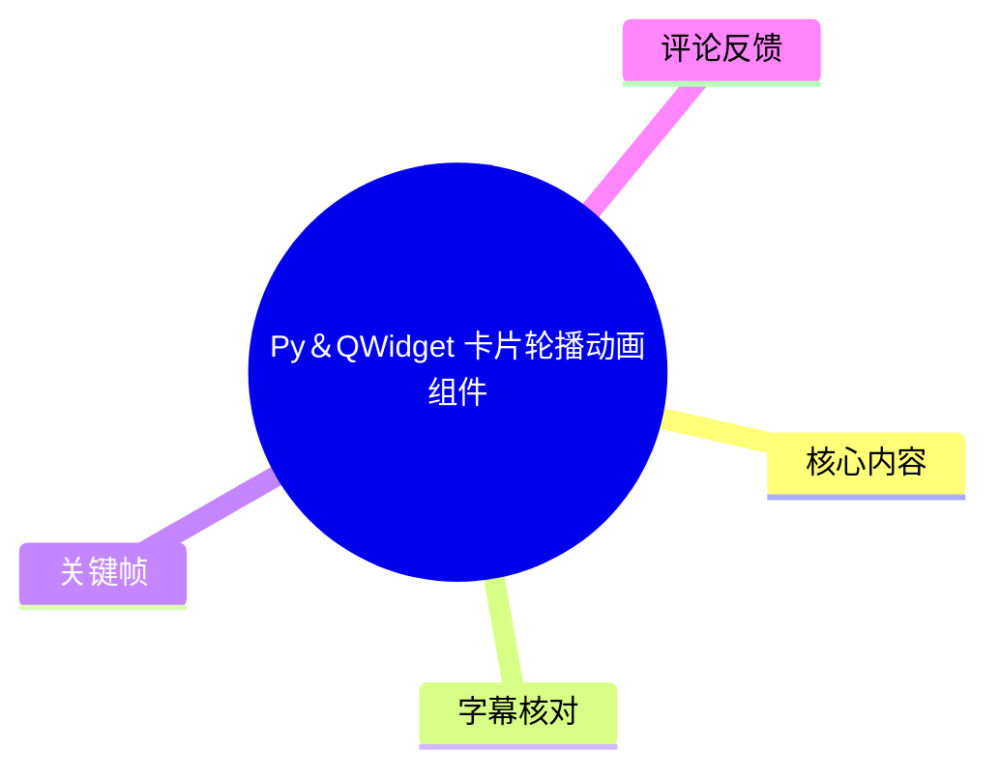
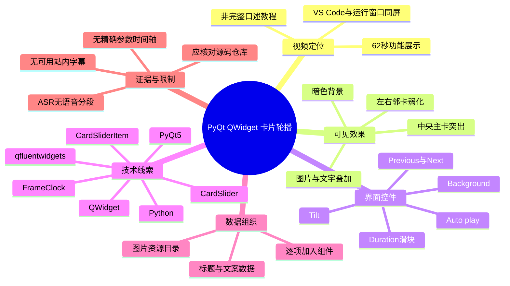
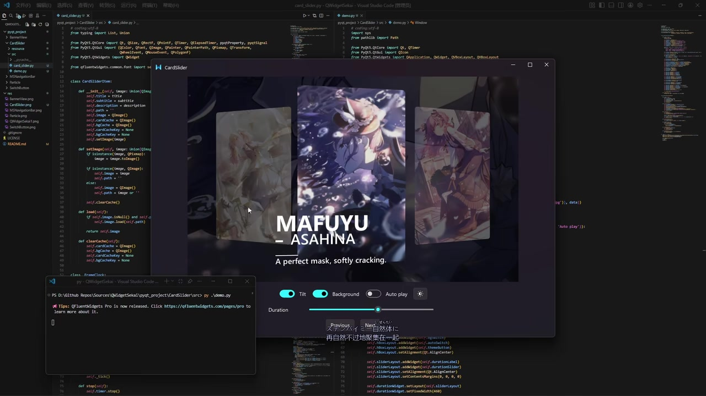
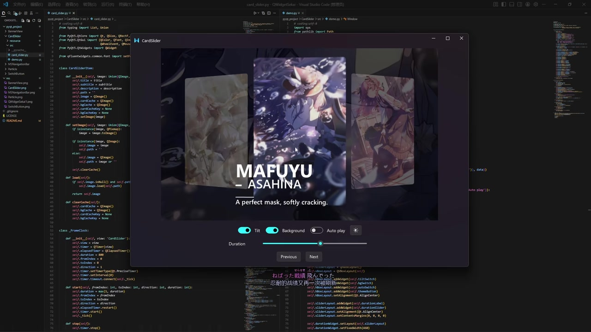
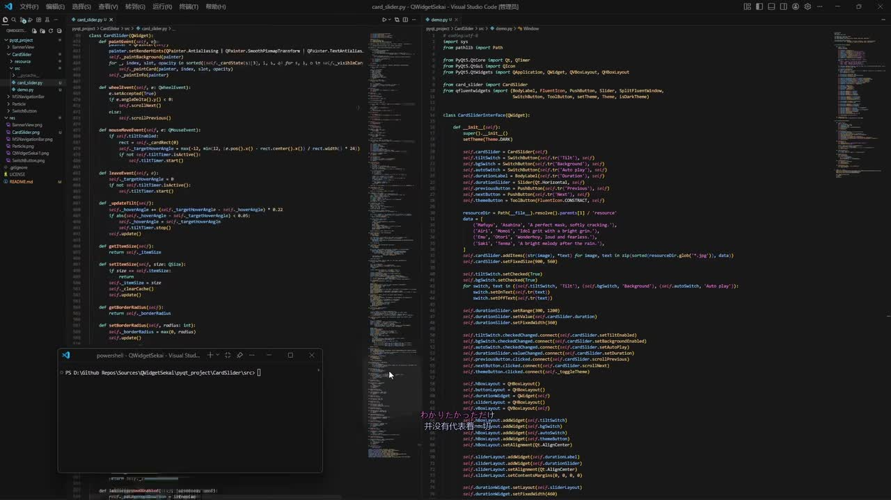
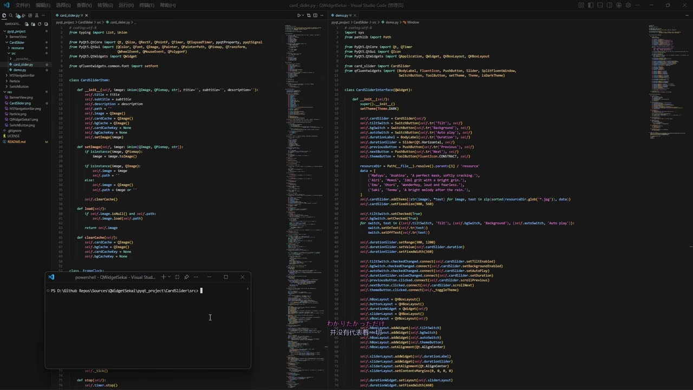

## 小结

视频展示了一个基于 Python、Qt Widgets 的卡片轮播动画组件运行效果，标题为《[Py＆QWidget] 卡片轮播动画组件》。演示窗口采用“中央主卡片 + 左右相邻卡片”的三卡片构图：当前卡片居中、尺寸最大，左右卡片缩小并弱化显示，形成层级明确的视觉轮播效果。

从关键帧中的 VS Code 代码可确认，项目使用 `PyQt5`、`qfluentwidgets` 与 `QWidget` 路线实现；可辨识的组件/类名包括 `CardSliderItem`、`FrameClock`、`CardSlider`。主程序将图片资源与标题、文案数据加入轮播组件，并把界面控件连接到轮播相关状态或操作。

运行界面明确展示了 `Tilt`、`Background`、`Auto play` 三个开关，`Duration` 时长滑块，以及 `Previous`、`Next` 两个导航按钮。它们分别与倾斜视觉效果、背景显示、自动播放、时长配置和前后切换有关；但视频未给出滑块数值范围、单位、默认值、动画曲线和自动播放间隔，因此不能据此补写精确参数。

该视频更接近功能与代码展示，而不是逐步教学。素材中没有可用的站内字幕；本次 ASR 已实际检查，但 `segments` 为空、语音覆盖率为 0%，因此正文主要依据视频元数据、简介、关键帧可见内容和热评整理。ASR 结果并未标记 `noAudioStream=true`，故不能称为“源视频没有音轨”；准确说法是：已提取音频，但未识别出可转写的语音段。

适合希望在 PyQt5 / QWidget 桌面程序中实现视觉化 Banner、角色图集、内容导航或相册式轮播的开发者参考。UP 主在简介中提供了源码目录：<https://github.com/Aegisir/QWidgetSekai/tree/main/pyqt_project/CardSlider>；由于该链接不是固定提交版本，实际依赖与 API 应以仓库当前文件为准。

## 思维导图

## 目录

- [视频定位与时效性](#视频定位与时效性)
- [演示界面与轮播视觉结构](#演示界面与轮播视觉结构)
- [交互控件与可见参数](#交互控件与可见参数)
- [代码结构与技术实现线索](#代码结构与技术实现线索)
- [可复用的实现流程](#可复用的实现流程)
- [步骤参数与限制](#步骤参数与限制)
- [关键帧索引](#关键帧索引)
- [字幕比对](#字幕比对)
- [评论分析](#评论分析)
- [处理记录](#处理记录)

## 视频定位与时效性 [00:00](https://www.bilibili.com/video/BV1WoL26yE7M?t=0)

### 基本信息

| 项目 | 信息 |
| --- | --- |
| 标题 | `[Py＆QWidget] 卡片轮播动画组件` |
| BV 号 | `BV1WoL26yE7M` |
| UP 主 | Aegisir |
| 合集 | AIcode |
| 视频时长 | 62 秒 |
| 分辨率 | 1920 × 1080 |
| 标签 | 动画、设计、pjsk、pyqtfluentwidgets、Python、Windows、pyqt、PyQt5、QWidget、pyside |
| 简介中的源码地址 | <https://github.com/Aegisir/QWidgetSekai/tree/main/pyqt_project/CardSlider> |
| 简介中的参考地址 | `youtube.com/watch?v=--0sp8IO6Iw` |
| 素材抓取时间 | 2026-07-16 |

视频画面由开发环境与运行结果组成：背景是 VS Code 中打开的 Python 项目，前景为名为 `CardSlider` 的桌面程序窗口。视频没有提供可利用的站内 SRT，也没有获得可用的 ASR 逐段文本，因此不能按语音内容建立精细的章节秒级定位。

本节及后续章节统一链接至 `t=0`。这是因为可用素材中不存在站内字幕的 `HH:MM:SS,mmm --> HH:MM:SS,mmm` 分段，也不存在本次 ASR 的有效时间戳段；统一指向起点是对时间证据不足的保守处理，并非声称所有画面均发生在 0 秒。

### 时效性与源码边界

元数据记录的发布时间对应 2026 年 5 月，素材抓取发生于 2026 年 7 月。视频简介指向 GitHub 的项目目录，而不是某个固定 commit、release 或带哈希的版本快照，因此下列内容均可能在视频发布后变化：

- 项目目录结构；
- Python 版本要求；
- `PyQt5`、`PySide`、`qfluentwidgets` 的依赖与 API；
- 组件的公开方法、参数默认值和示例资源；
- 安装方式与运行入口。

视频画面可作为组件设计与界面表现的参考，但若要运行或修改项目，应优先查看仓库当前的 `README`、依赖文件、入口文件及组件源码。

## 演示界面与轮播视觉结构 [00:00](https://www.bilibili.com/video/BV1WoL26yE7M?t=0)

### 中央主卡与侧边预览卡

运行窗口的核心区域是三张同时可见的卡片：

1. **中央主卡**：尺寸最大，位于视觉中心，承担当前选择项的信息展示；
2. **左侧卡**：缩小、位于主卡左侧，作为前一项或相邻项的视觉预览；
3. **右侧卡**：缩小、位于主卡右侧，作为后一项或相邻项的视觉预览。

中央卡片展示竖版角色插画，并在下部覆盖文字。画面中可读到主标题 `MAFUYU_ASAHINA`，副标题为 `A perfect mask, softly cracking.`。主卡之外的区域还能看到经过弱化处理的大幅背景图，整体使用深色界面风格。

> 图：该帧同时显示中央主卡、左右两张邻卡、主标题、副标题、背景图与底部控制区，是确认组件“三卡片轮播”视觉层级的主要证据。中央卡的放大和侧卡的弱化共同构成当前项突出、相邻项可预览的效果。

### 可见的视觉效果

从展示画面可确认以下视觉事实：

| 视觉元素 | 画面表现 | 可确认结论 |
| --- | --- | --- |
| 卡片内容 | 使用纵向角色插图 | 组件至少支持图片作为卡片主体内容 |
| 当前项信息 | 主标题与副标题叠加在主卡下方区域 | 卡片可关联文字信息 |
| 相邻项展示 | 左右卡片同时保留在视野内 | 不是单图替换式展示 |
| 背景 | 主卡后方存在低亮度、大幅图像 | 界面具有可控制的背景显示能力 |
| 层级 | 主卡更大、更突出；侧卡较小、更暗 | 组件通过尺寸、位置与视觉权重区分卡片状态 |
| 色彩风格 | 深色窗口、白色文字、青色强调控件 | 示例采用暗色主题与高对比控件状态 |

视频展示的是静态截帧中的效果和运行窗口，不足以逐帧确认侧卡在动画过程中的所有变化，例如透明度插值公式、旋转角度、缩放比例或图层排序规则。

## 交互控件与可见参数 [00:00](https://www.bilibili.com/video/BV1WoL26yE7M?t=0)

### 控制区

运行窗口底部可以辨认出三项开关、一个滑块和两个导航按钮：

| 控件 | 画面可证实的功能语义 | 当前演示状态 | 未知内容 |
| --- | --- | --- | --- |
| `Tilt` | 与卡片倾斜或旋转视觉效果有关 | 截帧中为开启 | 倾斜角度、透视算法、作用范围 |
| `Background` | 控制背景显示 | 截帧中为开启 | 是否使用当前卡片图片、模糊方式、暗化强度 |
| `Auto play` | 控制自动播放 | 截帧中为关闭 | 默认值、间隔、悬停暂停、首尾行为 |
| `Duration` | 控制与时长相关的配置 | 有可拖动滑块 | 单位、范围、步长、默认值、是否仅控制动画 |
| `Previous` | 前往前一张卡片 | 有按钮 | 到首项时是否循环、是否禁用 |
| `Next` | 前往后一张卡片 | 有按钮 | 到末项时是否循环、是否禁用 |
| 图标按钮 | 显示太阳/亮度样式图标 | 有按钮 | 是否切换主题或其他显示状态，视频未说明 |

> 图：该帧较清楚地呈现 `Tilt`、`Background`、`Auto play`、`Duration`、`Previous` 和 `Next`。它支持“界面存在这些交互入口”的结论，但不支持推定滑块的数值范围或开关背后的具体实现。

### 控件状态的证据边界

`Tilt` 与 `Background` 在选取的演示帧中显示为开启状态，`Auto play` 显示为关闭状态。这只代表录屏中的当前 UI 状态，不能推断其为组件默认值。

同样，`Duration` 的滑块位置可见，但画面没有显示数值标签、单位或刻度。因此，不能将其写为“以毫秒设置动画时长”，也不能将其等同于自动播放切换间隔。二者可能相关，也可能分别对应动画过渡时间和自动播放等待时间，需以源码验证。

## 代码结构与技术实现线索 [00:00](https://www.bilibili.com/video/BV1WoL26yE7M?t=0)

### 可见依赖与项目技术栈

关键帧中 VS Code 左侧打开组件实现文件，右侧打开演示程序文件。可辨认的导入与命名线索包括：

- `PyQt5.QtCore`；
- `PyQt5.QtGui`；
- `PyQt5.QtWidgets`；
- `qfluentwidgets`；
- `Path`；
- `QTimer`；
- `QPainter`、`QPixmap`、`QImage`、`QTransform` 等 Qt 图形类型；
- `BodyLabel`、`FluentIcon`、`PushButton`、`Slider`、`SwitchButton`、`ToolButton` 等 Fluent Widgets 控件名称线索。

这些证据支持如下判断：该项目使用 Python 的 Qt Widgets 框架进行界面构建，并使用 `qfluentwidgets` 提供 Fluent 风格的控件；它不是 Web 前端、QML 或游戏引擎项目。

> 图：左侧是卡片轮播组件的 Python 代码，右侧是创建窗口、组装控件和添加资源数据的演示程序。画面可见 `PyQt5`、`qfluentwidgets`、资源目录与 `CardSlider` 等线索，故可用于确认技术方向。

### 可辨识的类分层

代码画面中可辨识出至少三个名称：

| 名称 | 截图中的可见线索 | 可合理归纳的职责 | 证据限制 |
| --- | --- | --- | --- |
| `CardSliderItem` | 可见类声明，构造函数附近有图像、标题、子标题、描述等字段线索 | 表示单张卡片的数据、图片状态或缓存 | 不能据截图完整确认构造函数签名和所有属性 |
| `FrameClock` | 可见类声明；附近存在计时器、索引、方向、时长等线索 | 管理动画进度、切换方向或帧推进 | 无法确认其帧率、缓动公式和停止条件 |
| `CardSlider` | 主程序中创建该控件并添加数据 | 管理卡片集合、布局、绘制与导航 | 不能据此断言所有公开方法或事件支持情况 |

`CardSliderItem`、`FrameClock`、`CardSlider` 的职责说明属于基于类名与邻近代码结构的审慎归纳，而不是来自视频口述的 API 文档。特别是定时器间隔、重绘策略、动画插值和性能优化措施，均应以实际源码为准。

### 演示程序中的资源与控件连接

右侧演示代码可见：

- 使用 `Path` 构造资源目录；
- 定义图片与文本相关的数据；
- 对资源进行遍历或排序后，向 `CardSlider` 添加条目；
- 创建 `SwitchButton`、`Slider`、`PushButton`、`ToolButton`；
- 将控件的状态变化或点击事件连接到轮播组件的相关操作。

从画面可可靠得出：**演示窗口并非把图片硬编码在单一控件中，而是存在“资源数据 → 卡片条目 → 轮播组件 → 外部控件”的组织层次。**

但下列信息无法由截图可靠转录：

- 所有图片文件名；
- 每位角色对应的完整文案；
- 资源排序规则；
- 缺图、空数据和路径错误的处理；
- 添加卡片方法的完整签名；
- 所有 signal/slot 的精确名称；
- 实际依赖版本。

## 可复用的实现流程 [00:00](https://www.bilibili.com/video/BV1WoL26yE7M?t=0)

本节整理的是从视频可见架构中提炼出的实现思路，用于帮助理解这类组件的组成，不是对未展示代码的逐行复原。

### 1. 准备卡片数据

每张卡片可抽象为一份独立数据，至少包含：

- 图片路径或已加载图像；
- 标题；
- 副标题或描述；
- 可能的图片缓存；
- 用于绘制的当前状态，例如位置、缩放、透明度、旋转角度或层级。

视频中中央卡与侧卡同时存在，说明轮播不能只保存“当前图片”，还需要保留多个卡片的相对展示状态。

### 2. 以当前索引计算相对位置

三卡片布局通常围绕“当前索引”计算：

- 相对位置为 `0`：中央主卡；
- 相对位置小于 `0`：左侧相邻卡；
- 相对位置大于 `0`：右侧相邻卡；
- 超出可见范围：隐藏、裁剪或进一步弱化。

视频仅明确展示中央一张、左右各一张的效果。是否支持更多可见卡、无限循环、首尾回绕或动态增删项目，现有素材不能确认。

### 3. 由定时器推进动画状态

截图中的 `QTimer` 和 `FrameClock` 是动画调度的关键线索。可复用的总体过程是：

1. 用户点击 `Previous` 或 `Next`，或由自动播放触发切换；
2. 确定旧索引、新索引和切换方向；
3. 在预设时间内持续更新动画进度；
4. 根据进度插值计算每张可见卡片的位置、大小、透明度或倾斜状态；
5. 请求控件重绘；
6. 动画结束后提交新的当前索引并停止或复位时钟。

视频没有展示每帧间隔、动画帧率、缓动曲线、是否使用 `QPropertyAnimation`，因此这些实现细节不能补写为既定事实。

### 4. 将轮播逻辑与窗口控件分离

从演示程序可见的控件连接方式，可以归纳出较清晰的职责划分：

- `CardSlider`：管理卡片数据、当前索引、绘制和切换；
- `CardSliderItem`：承载单项内容；
- `FrameClock`：提供动画推进或过渡状态；
- 演示窗口：创建开关、滑块、按钮，并将用户操作传给轮播组件。

这种分层的价值在于：轮播组件可以被嵌入不同页面，窗口层只需要决定如何暴露设置项，而不必直接处理每张卡片的绘制细节。

## 步骤参数与限制 [00:00](https://www.bilibili.com/video/BV1WoL26yE7M?t=0)

### 视频可验证的使用层次

视频没有给出安装命令、环境配置命令或从零开始的操作讲解。根据演示窗口和代码画面，可整理出以下可见使用层次：

1. 准备多张图片资源，以及各图片对应的标题和文案；
2. 在 PyQt5 / QWidget 程序中创建 `CardSlider`；
3. 将图片和文字数据逐项添加到轮播组件；
4. 将轮播组件嵌入窗口布局；
5. 添加 `Tilt`、`Background`、`Auto play` 等状态开关；
6. 添加 `Duration` 滑块；
7. 将 `Previous`、`Next` 按钮连接到前后切换操作；
8. 运行程序，通过手动或自动方式观察卡片切换。

### 可见参数与未知参数

| 参数或状态 | 可确认信息 | 无法从视频确认的信息 |
| --- | --- | --- |
| 图片内容 | 支持角色插图作为卡片主体 | 图片格式、缩放模式、缓存策略、加载失败处理 |
| 标题 | 中央卡可显示主标题 | 字号、字体、颜色、对齐规则、换行规则 |
| 副标题/描述 | 中央卡可显示英文短句 | 是否支持富文本、多行、国际化 |
| `Tilt` | 存在倾斜相关开关 | 旋转轴、角度范围、透视矩阵、默认值 |
| `Background` | 可开关背景显示 | 背景取图来源、模糊程度、暗化比例 |
| `Auto play` | 可开关自动播放 | 自动播放间隔、暂停策略、首尾行为 |
| `Duration` | 可由滑块调整时长相关配置 | 单位、范围、步长、是否影响自动播放 |
| `Previous` / `Next` | 可进行前后切换 | 是否循环、快速连续点击的行为、动画打断逻辑 |
| 卡片数量 | 示例至少有多张卡片 | 最大数量、虚拟化策略、性能上限 |

### 实践时应优先验证的事项

若要基于该项目复用或改造组件，建议按以下顺序进行核对：

1. 打开 UP 主提供的 GitHub 目录，确认入口文件和依赖声明；
2. 核对项目使用的是 `PyQt5`、`PyQt6`、`PySide2` 或 `PySide6`，不要仅依据标签推断；
3. 使用自己的多张图片测试资源路径与加载行为；
4. 分别测试 `Previous`、`Next`、`Auto play`；
5. 修改 `Duration` 后，确认它影响动画过渡还是自动播放间隔；
6. 测试首张、末张、空列表、单卡片和图片缺失场景；
7. 测试连续点击导航按钮时，动画是否可重入、打断或排队；
8. 在 Windows 高 DPI、不同窗口尺寸和高分辨率图片场景中检查文字可读性与图像质量。

### 不应擅自补全的结论

以下内容并未被现有素材可靠证实：

- 动画时长的精确数值；
- 滑块的最小值、最大值、步进和单位；
- 精确帧率；
- 缓动曲线类型；
- 是否支持鼠标拖拽、滚轮切换或触摸手势；
- 是否支持无限循环；
- 是否异步加载图片；
- 是否兼容 PySide6、PyQt6；
- `qfluentwidgets` 的确切版本；
- 内存占用、CPU 占用和性能数据；
- 完整 API 方法签名与默认参数。

## 关键帧索引 [00:00](https://www.bilibili.com/video/BV1WoL26yE7M?t=0)

由于没有可用站内 SRT，且本次 ASR 没有输出带时间戳的语音分段，不能将以下关键帧伪造绑定到具体字幕起止时间。正文选择关键帧时，以其对代码结构、运行界面和控件状态的证明价值为依据。

| 关键帧 | 正文用途 | 图片价值 |
| --- | --- | --- |
|  | 技术栈、资源目录、组件与窗口代码的同屏核对 | 同时展示 Python 代码、`qfluentwidgets` 控件导入、资源目录和运行控制台 |
|  | 类分层与数据模型线索 | 左侧可见 `CardSliderItem` 及其属性/图像处理相关区域，下方可见 `FrameClock` 类名 |
|  | 主卡、侧卡、标题、背景和控件区 | 最完整呈现三卡片布局，是理解视觉层级的核心画面 |
|  | 开关、时长滑块和导航按钮 | 可辨认 `Tilt`、`Background`、`Auto play`、`Duration`、`Previous`、`Next` 的界面位置与状态 |

> 关键帧中的英文控件标签、窗口标题、可辨认类名和当前卡片文字可作为画面事实记录；对于无法清晰辨认的代码细节、未展示的函数分支和参数值，本文不将其写为确定结论。

## 字幕比对 [00:00](https://www.bilibili.com/video/BV1WoL26yE7M?t=0)

| 字幕来源 | 完整性 | 专有名词 | 时间轴 | 主要问题 |
| --- | --- | --- | --- | --- |
| Bilibili 站内字幕 | 无可用字幕 | 无法核验 | 无 | 素材未提供站内 SRT；字幕工具记录了 `Invalid URL` 警告 |
| 本次 ASR 字幕 | 空 | 无可识别术语 | 无有效分段 | `segments` 为空，语音句数为 0，语音覆盖率为 0% |
| 最终正文依据 | 有限 | 采用画面和元数据中可见的名称 | 仅统一定位到视频起点 | 依据关键帧、视频简介、元数据和热评整理，不把推测写成字幕事实 |

### 本次 ASR 检查结果

本次 ASR 已执行，诊断信息如下：

| 项目 | 结果 |
| --- | --- |
| ASR 模型 | `medium` |
| 请求语言 | `auto` |
| 检测语言 | `en` |
| 语言概率 | `0.541015625` |
| 音频时长 | 约 61.05 秒 |
| 设备 | CUDA |
| 计算类型 | `float16` |
| 语音段数量 | 0 |
| 语音时长 | 0 秒 |
| 语音覆盖率 | 0% |
| 首段/末段语音时间 | 均为空 |

ASR 的诊断警告为“未识别到语音段，应验证源中是否存在可听语音并使用正确音轨重试”。素材中没有 `noAudioStream=true` 标记，且清单中存在提取后的 `audio/audio.wav`，因此不能将本视频描述为“没有音轨”。更准确的结论是：**存在提取音频的产物，但本次识别未获得可转写的语音内容。**

### 最终字幕选择

未采用站内字幕，因为没有可用站内字幕文本；也未采用本次 ASR 文本，因为其为空。正文改用以下证据来源：

1. 视频元数据：标题、UP 主、时长、标签、简介链接；
2. 关键帧：界面控件、当前卡片文字、窗口标题、代码中的可见类名与导入线索；
3. 热评：仅作为观众反馈，不作为技术事实；
4. 素材诊断：ASR 运行状态、时间轴缺失原因。

通过关键帧可校正或确认的术语包括：

- `CardSlider`
- `CardSliderItem`
- `FrameClock`
- `Tilt`
- `Background`
- `Auto play`
- `Duration`
- `Previous`
- `Next`
- `MAFUYU_ASAHINA`
- `qfluentwidgets`

## 评论分析 [00:00](https://www.bilibili.com/video/BV1WoL26yE7M?t=0)

仅分析本次可获取的热评前三条，按提供数据顺序如下。

1. **喵の詩（5 赞）**：  
   评论称，视频中的签名文字“应该是‘既自以心为形役’，不是‘既以自...’”。  
   - 补充价值：这是对画面中文案可能存在笔误的校对意见。  
   - 可信度边界：评论未提供原始出处、完整截图或文字来源说明，且讨论内容与轮播组件的技术实现无直接关联。因此只能记录为待核验的观众勘误，不将其认定为已证实的视频错误。

2. **一根雪糕GXT（1 赞）**：  
   评论为“这样太好看了吧[星星眼]”。  
   - 补充价值：反映观众对轮播视觉效果持正面评价。  
   - 可信度边界：属于审美反馈，不能用于证明组件性能、稳定性、易用性或代码质量。

3. **雲不识月（1 赞）**：  
   评论为“好酷[鸣潮·共鸣与群星_点赞]”。  
   - 补充价值：同样反映演示的视觉呈现具有吸引力。  
   - 可信度边界：未包含技术建议、使用问题、依赖信息或复现细节，不能外推为功能验证结论。

前三条热评没有补充安装流程、依赖版本、完整 API、性能测试或兼容性结果。总体而言，评论区可说明观众对视觉设计的正向反响，但不能替代源码与运行测试。

## 处理记录 [00:00](https://www.bilibili.com/video/BV1WoL26yE7M?t=0)

- Worker ID：`worker-mrj0www4-e8d79408`
- 生成模型：`gpt-5.6-terra`
- 视频对象：`BV1WoL26yE7M`
- 视频时长：62 秒
- 使用的素材产物：
  - 合并视频：`merged.mp4`
  - 提取音频：`audio/audio.wav`
  - 关键帧目录：`frames/`
  - ASR 结果：`asr/asr-result.json`
  - ASR SRT：`asr/transcript.srt`
  - ASR 文本：`asr/asr-transcript.txt`
  - 评论数据：`comments/comments.json`
- ASR 模型与参数：`medium` / 自动语言识别 / CUDA / `float16`
- 站内字幕检查：未提供可用站内字幕；素材警告中记录字幕工具返回 `Invalid URL`。
- 本次 ASR 检查：已检查；ASR 结果 `segments` 为空，语音覆盖率为 0%，无可用时间戳分段。
- 字幕选择：未采用站内字幕或 ASR 字幕；正文依据视频元数据、视频简介、关键帧和可获取热评撰写。
- 时间轴策略：因无可用站内 SRT 和有效 ASR 分段，所有章节链接统一指向 `t=0`，避免伪造未经证实的精确时间位置。
- 关键帧选择依据：
  - `frames/frame-001.jpg`：确认 VS Code、Python、`PyQt5`、`qfluentwidgets`、资源与演示程序结构；
  - `frames/frame-002.jpg`：确认 `CardSliderItem`、`FrameClock` 等类名线索；
  - `frames/frame-003.jpg`：确认三卡片轮播构图、主标题、副标题、背景与控制区；
  - `frames/frame-004.jpg`：确认开关、时长滑块及前后导航按钮。
- 缓存清理：素材未提供缓存清理已执行的记录，无法确认清理状态；本文不声明已完成缓存清理。
- 未解决问题：
  - 无法依据字幕或 ASR 还原任何口述讲解；
  - 无法确认组件完整 API、参数范围、默认值与依赖版本；
  - 无法验证动画帧率、缓动曲线、循环策略和异常处理；
  - 无法从现有素材确认 `Duration` 对动画时长与自动播放间隔的具体影响；
  - 若需可运行级复现，仍需访问并审阅 UP 主提供的源码目录。

## 评论分析

- 热评 1：upup,签名应该是‘既自以心为形役’，不是‘既以自...’
- 热评 2：这样太好看了吧[星星眼]
- 热评 3：好酷[鸣潮·共鸣与群星_点赞]

以上内容是观众反馈摘录，只用于补充理解视频反响，不作为正文事实依据。
