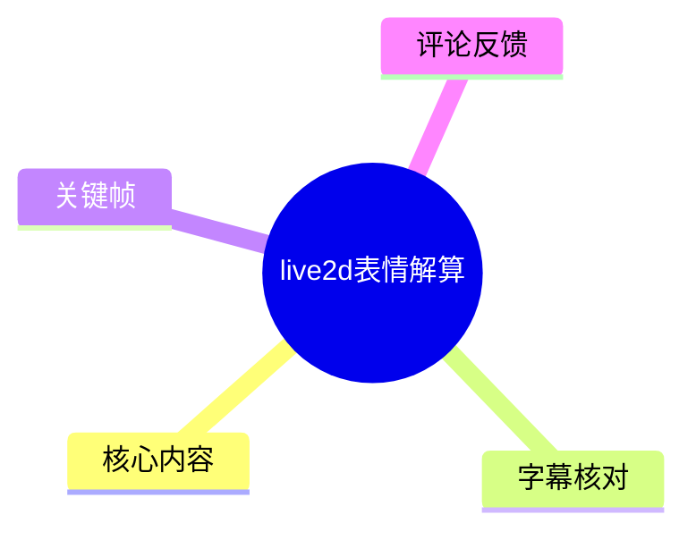
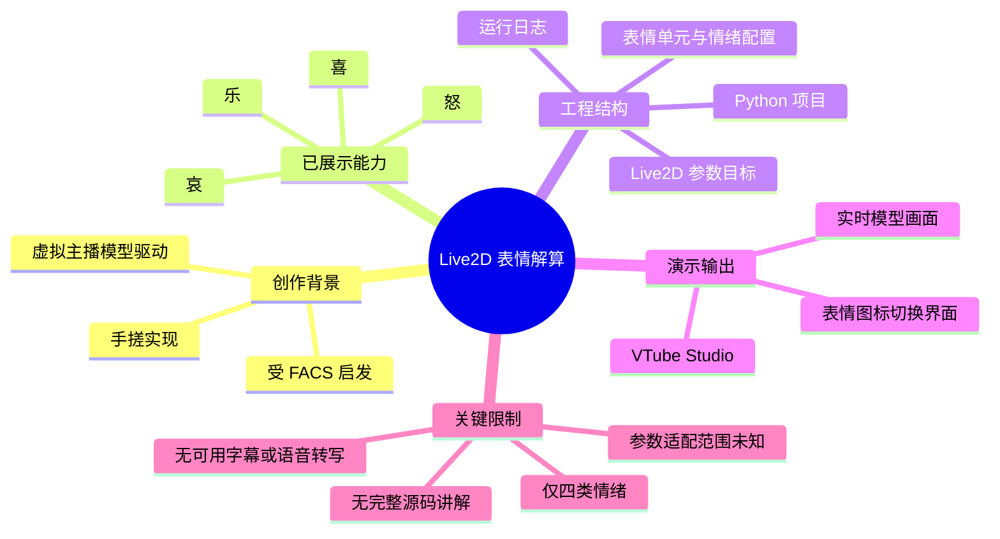
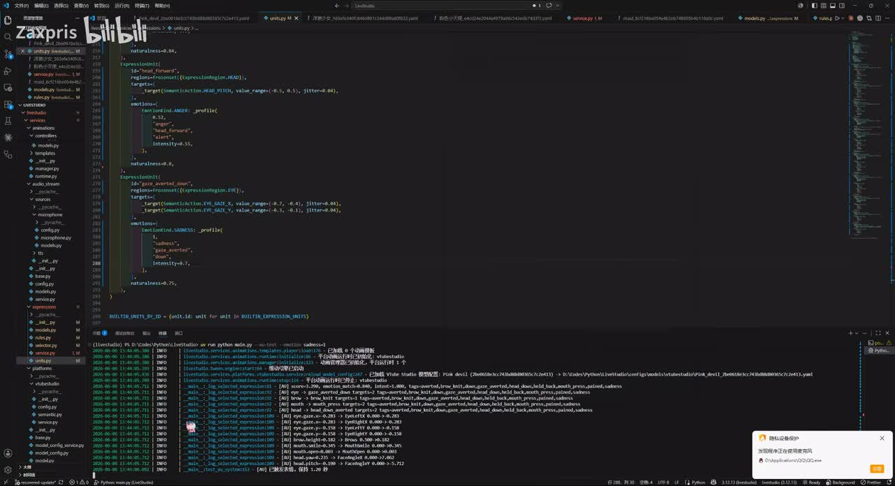
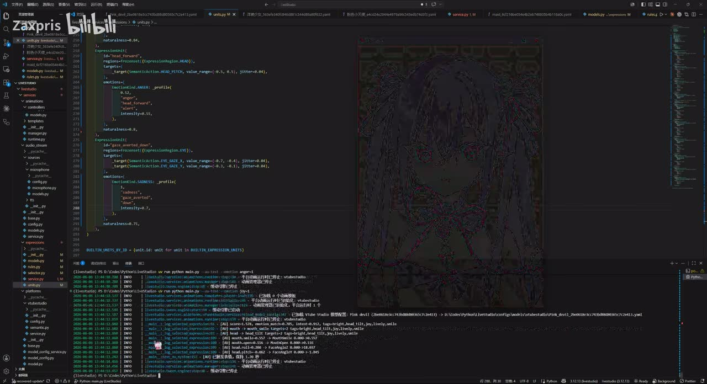
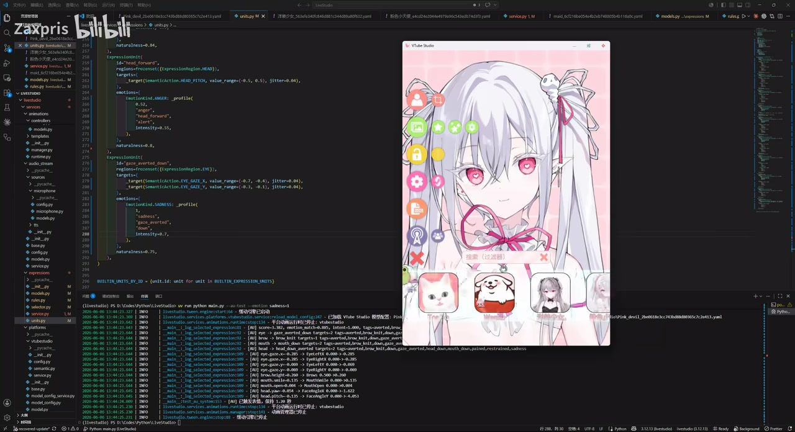

# live2d表情解算

> 来源：[Bilibili 视频](https://www.bilibili.com/video/BV1cqE86NEVs)<br>
> UP 主：Zaxpris｜视频时长：97 秒｜分区/标签：表情包、可爱、虚拟主播<br>
> 视频简介：UP 主称其“看到 FACS 突发奇想手搓的”，目前仅实现喜、怒、哀、乐四种情绪。

## 小结

这是一段约 97 秒的 Live2D 表情解算运行演示。视频画面主要展示开发环境中的 Python 工程、表情单元（expression units）配置/实现代码、运行日志，以及 VTube Studio 中被实时驱动的 Live2D 角色。

从视频简介和画面可确认，作者的思路受到 **FACS（Facial Action Coding System，面部动作编码系统）**启发：不是直接将一个“情绪名称”硬切换为固定表情，而是为情绪组织相应的动作/参数组合，再将这些组合输出到 Live2D 模型的可控参数上。画面中可见情绪配置、动作目标和随机扰动（jitter）等实现痕迹。

该演示最值得关注的工程信息是：项目存在情绪配置或“表情单元”抽象；运行时日志会输出被选择的情绪/动作及参数值；VTube Studio 窗口用于观察模型效果。角色窗口中还可见可选表情图标，说明演示同时涉及表情触发或切换界面。

适合正在开发虚拟主播驱动、Live2D 参数编排、情绪到表情映射，或希望将 FACS 类面部动作概念落实到程序结构中的读者。视频不是完整教程：没有提供可复制的完整代码、接口协议、模型参数表、训练数据或配置文件全文。

当前实现范围有明确限制：作者仅说明支持“喜怒哀乐”四种情绪。视频所展示的是某一模型和某套参数配置下的效果，不能据此推出其对其他 Live2D 模型、任意参数命名体系或通用表情识别输入都已适配。

时效性方面，视频元数据的发布时间为 2026 年 6 月；运行环境、VTube Studio 版本、项目依赖与代码状态都可能在发布后变化。本文只记录素材中可核实的内容，不把画面未展示的功能视为已实现。

## 思维导图





## 目录

- [视频定位与证据边界](#视频定位与证据边界)
- [工程画面：情绪与参数映射](#工程画面情绪与参数映射)
- [运行与 VTube Studio 驱动演示](#运行与-vtube-studio-驱动演示)
- [可复用的实现流程](#可复用的实现流程)
- [参数、限制与待验证项](#参数限制与待验证项)
- [关键帧索引](#关键帧索引)
- [字幕比对](#字幕比对)
- [评论分析](#评论分析)
- [处理记录](#处理记录)

## [视频定位与证据边界](https://www.bilibili.com/video/BV1cqE86NEVs?t=0)

视频没有提供可用的站内字幕；本次 ASR 虽成功处理音频文件，却没有识别出任何语音片段。因此，素材不支持按口述内容还原逐句讲解，也不存在可据以精确划分“某一句话出现于某一秒”的 ASR/SRT 时间段。

可直接建立的事实链如下：

1. **标题**为“live2d表情解算”，指向 Live2D 表情驱动/解算主题。
2. **简介**明确写出 FACS 是创作灵感来源，并明确限定当前只实现“喜怒哀乐”四种情绪。
3. **关键帧画面**可见 Python 项目目录、表情相关的实现代码、终端运行日志及 VTube Studio 窗口。
4. **运行日志和模型窗口并置**，可支持“代码运行过程在驱动模型表现”的观察；但不能据此断言采用了何种输入源、网络协议或完整算法。

由于没有真实的语音字幕分段，本文所有章节均以视频起点链接作为定位入口，而不会伪造精确到中段秒数的叙述时间轴。

## [工程画面：情绪与参数映射](https://www.bilibili.com/video/BV1cqE86NEVs?t=0)

视频画面中的编辑器显示一个 Python 工程。左侧目录可辨认出与 `livestudio`、`models`、`services`、`animations`、`platforms` 等相关的模块/目录名称；打开的代码文件与表情单元、服务或模型配置有关。这表明该演示至少以模块化工程而非单一临时脚本组织。

代码区域可见以下类型的结构性信息：

- 存在与头部、眼部等语义动作相关的目标设置；
- 存在情绪配置或情绪档案（profile）式的数据组织；
- 对不同动作设置目标参数、取值范围以及 `jitter` 一类扰动；
- 可见 `EmotionKind.SURPRISE`、`EmotionKind.SADNESS` 等英文情绪枚举/名称痕迹。

需要特别区分两件事：

- 视频简介中可确认的“当前只有喜怒哀乐四种情绪”，是作者对当前成品范围的直接说明。
- 代码画面中出现的 `SURPRISE`、`SADNESS` 等名称，只能说明当前打开的代码或日志中存在这些标识；由于画面分辨率和上下文有限，不能据此断言每个枚举都已作为最终可用表情完整实现，更不能把它扩展为所有 FACS 情绪均已支持。

`jitter` 的出现意味着作者可能试图在目标参数附近加入小幅变化，以降低机械的静态感。这是基于可见代码字段作出的工程解释；视频没有给出扰动分布、刷新频率、平滑滤波方式或最终数值，因此无法评价其具体效果或复现相同参数。



> 图：画面同时呈现 Python 代码、工程目录和运行终端。代码中能看到情绪/动作配置、目标参数及 `jitter` 一类字段，是判断该项目采用“情绪—动作—Live2D 参数”映射结构的重要视觉证据。

## [运行与 VTube Studio 驱动演示](https://www.bilibili.com/video/BV1cqE86NEVs?t=0)

终端日志显示程序已进入运行状态，并持续打印多行与情绪选择、动作目标、参数数值相关的信息。画面右侧/上方随后出现 VTube Studio 窗口，窗口内是白发粉瞳的 Live2D 角色模型。这构成了视频的核心演示：开发端运行的表情逻辑与模型端的视觉结果被同时展示。

从日志的呈现形式可归纳出以下已展示的运行环节：

1. 程序初始化或加载模型/配置；
2. 表情相关逻辑选择某种情绪或动作组合；
3. 运行日志输出本次选中的内容及对应参数；
4. 向模型侧施加参数变化；
5. 在 VTube Studio 窗口观察角色表现。

这不是对底层传输机制的证明。视频画面没有清晰展示 VTube Studio API 连接地址、端口、认证令牌、插件设置、模型 `.model3.json` 文件，也没有展示参数映射的完整配置。因此，“通过何种 API/协议驱动”的问题仍应视为未披露。



> 图：编辑器和终端仍在左侧，VTube Studio 中的角色模型出现在右侧。这张画面能直观说明视频并非只展示配置代码，也展示了程序运行时的模型侧结果。

在后续模型窗口画面中，可以看到角色周围的功能图标、底部的若干图片式表情/道具入口，以及搜索输入区域。可可靠确认的是：VTube Studio 界面存在可操作的模型/资源选择控件。至于底部各图标是否直接对应本项目的“喜怒哀乐”解算输出、是否由代码自动点击或仅为手动测试界面，画面并未给出足够证据，不能下结论。



> 图：VTube Studio 窗口完整露出，角色模型、侧边控制图标、搜索栏及底部图标均可见。该帧的价值在于呈现最终观察端的实际交互环境，而不仅是终端文字输出。

## [可复用的实现流程](https://www.bilibili.com/video/BV1cqE86NEVs?t=0)

以下流程是根据视频中可见的工程分层、代码字段、日志与 VTube Studio 结果整理出的实现框架，用于理解和规划同类项目；其中未在视频展示的接口细节必须由实现者自行补充验证。

### 1. 明确目标模型可控制的参数

首先需要从目标 Live2D 模型中确认可控参数及其合法范围，例如头部朝向、眼部方向、嘴部、眉眼或其他表情参数。视频显示作者以“语义动作目标”组织参数，而不是只以原始参数名散落赋值。

实践中应记录：

| 项目 | 作用 | 视频证据状态 |
| --- | --- | --- |
| 参数 ID | 与 Live2D 模型实际参数对应 | 视频未展示完整清单 |
| 最小值/最大值 | 防止超出模型设计范围 | 代码画面可见取值范围式设置，但全文不可可靠抄录 |
| 默认值 | 表情结束后的回正依据 | 未展示 |
| 可叠加关系 | 避免眉、眼、嘴动作互相覆盖 | 未展示 |
| 更新频率与平滑策略 | 决定动态是否突兀 | 未展示 |

### 2. 建立“情绪—动作单元”配置

视频的核心结构是将情绪组织为一组动作或目标参数。可将每种情绪表示为一个 profile，其中包括多个局部动作。例如：

```text
情绪
  ├─ 头部动作：目标值、范围、变化
  ├─ 眼部动作：目标值、范围、变化
  ├─ 嘴部动作：目标值、范围、变化
  └─ 自然度/扰动：降低完全固定赋值的机械感
```

此处的层级是对画面中“情绪 profile + 目标参数 + jitter”结构的归纳，不是视频公布的原始数据格式。实际字段名、枚举类型、动作数量均应以源码为准。

### 3. 为每个动作施加范围约束与轻微扰动

画面中可见目标参数带有范围及 `jitter` 字段。这种设计可用于避免每次触发表情都落在同一个数值上，但实现时要注意：

- 扰动必须在模型参数合法范围内截断；
- 随机扰动不应破坏情绪的主要辨识度；
- 多个动作同时扰动时，需要考虑叠加后的极值；
- 若无时间平滑，随机值本身可能造成抖动；
- 需要给出回正、过渡或淡出策略，否则表情切换仍可能显得突兀。

视频没有展示以上保护逻辑是否已经实现，因此这些属于同类项目的必要工程检查项，而不是对作者代码的断言。

### 4. 输出参数并记录可诊断日志

视频终端的连续日志证明作者保留了运行可观测性。对于表情解算系统，建议日志至少包含：

```text
时间
输入情绪/触发来源
选中 profile 或动作单元
目标 Live2D 参数
最终输出值
范围裁剪结果
连接或发送状态
```

这样的记录有助于区分“情绪选择错了”“参数映射错了”“模型不支持该参数”“驱动链路未送达”等问题。视频中确实可看到动作/情绪与数值类日志，但未展示其完整日志格式。

### 5. 在 VTube Studio 中观察并迭代

模型端画面是验证的最后一步。仅靠终端输出不能证明角色视觉上自然；需要在目标模型上检查：

- 喜、怒、哀、乐是否具有稳定的可区分性；
- 同一情绪多次触发是否过度重复；
- 表情切换时是否出现突然跳变；
- 头部、眼睛与嘴部动作是否协调；
- 模型自身参数命名和范围变化后，映射是否需要重配。

作者在视频简介中将当前范围限定为四种情绪，这也符合先在小集合中调通映射与表现，再扩展情绪类别的迭代路径。

## [参数、限制与待验证项](https://www.bilibili.com/video/BV1cqE86NEVs?t=0)

### 已展示或直接说明的参数性信息

| 信息 | 可确认程度 | 依据 |
| --- | --- | --- |
| 情绪范围当前为喜、怒、哀、乐 | 高 | 视频简介直接说明 |
| 实现受到 FACS 启发 | 高 | 视频简介直接说明 |
| 使用 Python 工程结构 | 高 | 关键帧中的编辑器、文件后缀和工程目录 |
| 存在情绪/动作配置与参数目标 | 高 | 关键帧代码画面 |
| 存在范围式取值与 `jitter` 字段 | 中高 | 关键帧可见字段，但不宜逐字符转录 |
| 有运行日志 | 高 | 关键帧终端输出 |
| 用 VTube Studio 显示模型 | 高 | 关键帧窗口标题和界面 |
| 具体接口、端口、认证与传输协议 | 未知 | 视频未展示 |
| 全部参数名称与精确数值 | 未知 | 未提供源码或高清代码文本 |
| 输入情绪来自摄像头、文本、按键还是其他系统 | 未知 | 视频未展示 |
| 是否支持通用模型即插即用 | 未知 | 仅展示单一模型环境 |

### 主要限制

1. **情绪种类限制**：目前仅有四种情绪，这是作者明确说明的当前能力边界。
2. **字幕和口述信息缺失**：没有站内字幕，ASR 也没有得到语音文本，无法补全作者对设计取舍的说明。
3. **复现材料不足**：未给出完整源码、配置文件、依赖版本、启动命令或参数表。
4. **模型依赖性未知**：不同 Live2D 模型的参数 ID、范围和物理效果差异很大，映射逻辑通常需要逐模型校准。
5. **FACS 对应关系未公开**：视频只说明灵感来自 FACS，没有展示其 AU（Action Unit）选取、权重、情绪分类规则或标注依据。
6. **实时性能未知**：视频未提供帧率、端到端延迟、CPU/GPU 占用或断线恢复策略。
7. **视觉自然度尚未量化**：视频为主观演示，未提供用户评测、对照实验或动作平滑指标。

## [关键帧索引](https://www.bilibili.com/video/BV1cqE86NEVs?t=0)

由于素材未附带关键帧的逐帧时间戳，以下按画面内容索引，不将其伪标为精确秒点。

| 关键帧 | 画面内容 | 正文使用价值 |
| --- | --- | --- |
| `frames/frame-001.jpg` | Python 编辑器、表情相关代码、项目目录和终端日志同屏 | 说明工程化组织及“情绪/动作—参数”配置结构 |
| `frames/frame-002.jpg` | 代码与日志背景上叠加 VTube Studio 模型窗口 | 证明演示包含模型端实时观察 |
| `frames/frame-003.jpg` | 编辑器代码与终端日志 | 可辅助核对运行过程中持续的参数/动作输出 |
| `frames/frame-004.jpg` | VTube Studio 角色窗口及侧边、底部控制入口 | 展示最终模型端的交互和视觉验证环境 |

未在正文逐一嵌入其余关键帧，是因为现有正文所选画面已覆盖“代码结构—运行日志—模型结果”三类关键信息；避免用内容重复的截图拉长文档。

## [字幕比对](https://www.bilibili.com/video/BV1cqE86NEVs?t=0)

| 字幕来源 | 完整性 | 专有名词 | 时间轴 | 主要问题 |
| --- | --- | --- | --- | --- |
| Bilibili 站内字幕 | 无可用字幕 | 无法核验 | 无 | 素材明确标注“未提供可用站内字幕” |
| 本次 ASR 字幕 | 空 | 无法识别或校正 | ASR 具备时间戳能力，但实际 `segments` 为空 | 未识别到语音片段，`speechCoverage` 为 0 |

本次 ASR 使用 `medium` 模型，自动语言识别结果为英语，语言概率为 `0.541015625`；音频时长约 `96.149` 秒，但识别结果 `segments` 为空，诊断中的语音时长为 0 秒、语音覆盖率为 0。诊断提示为“未识别到语音片段”。

素材并**未**标记 `noAudioStream=true`：同时，产物清单中存在 `audio/audio.wav`。因此不能把此情况描述为“源视频没有音轨”，也不能将其归为工具失败；能够如实得出的结论是：本次抽取到了音频文件，但 ASR 未识别到可用语音文本。可能原因包括无旁白、音量过低、音乐/环境声占主导或语言识别不匹配，但素材不足以判定具体原因。

最终没有采用任何字幕文本，而是以视频标题、简介、关键帧中的可视内容和元数据作为证据来源。通过画面可辅助确认或校正的术语包括：

- **FACS**：来自视频简介文字，不依赖 ASR；
- **VTube Studio**：来自软件窗口标题/界面；
- **Live2D 表情解算**：来自视频标题；
- **喜怒哀乐四种情绪**：来自视频简介；
- **情绪 profile、参数目标、jitter**：来自代码画面的可见字段，保留其原始英文/技术语境，不扩展为未展示的算法定义。

## [评论分析](https://www.bilibili.com/video/BV1cqE86NEVs?t=0)

以下仅处理可获取的热评前三条。评论属于观众经验或提问，不应替代视频本身的技术证据。

### 1. 碎梦不是破碎的梦（27 赞）

评论称，其曾将“所有能控制的参数名及范围”交给大模型，并要求其参照模板生成表情动作，但结果“动作很僵硬”。

这条评论补充了一个实际工程风险：即使已经拥有参数名和范围，直接由大模型生成参数组合也不等于获得自然表情。其观察与视频画面中出现的范围、扰动、动作配置等设计方向具有一定相关性——自然度可能需要显式的编排与调参，而不只是一次性生成静态参数值。

但该评论没有给出模型、提示词、模板、测试样本或“僵硬”的衡量标准，因此只能视为个体经验，不能作为“大模型生成表情必然僵硬”的普遍结论。

### 2. 拂晓世尘（6 赞）

评论者表示做过相关工作，做法是直接规定参数范围并自动调整；并指出自行建模时，能较快确认哪些参数对应哪些表情，也能通过动作触发表情。

其补充价值在于强调两点：

- 参数范围约束是自动调整的基础；
- 对模型参数语义的掌握是实现表情映射的重要前提。

这与视频的可见工程画面相呼应：画面中同样出现面向参数范围的设置。不过评论没有展示其自动调整策略、模型类型或效果，因此不应将其方法视为本视频的实际实现细节。

### 3. 诺亚子__（5 赞）

评论肯定了“代码跑起来驱动模型实时动”的体验，并认为“自动根据情绪参数切换表情单元”的思路有意思；随后询问 UP 主是否计划将其做成更通用的驱动框架。

该评论反映出观众将视频理解为“情绪参数—表情单元—实时驱动”的方向，也提出了通用框架需求。不过“是否做成通用框架”是观众提问，不是作者承诺。视频素材中没有作者回复、路线图或开源信息，因此不能判断项目是否会通用化。

## [处理记录](https://www.bilibili.com/video/BV1cqE86NEVs?t=0)

- **Worker ID**：`worker-mrj0www4-e8d79408`
- **生成模型**：`gpt-5.6-terra`
- **ASR 模型**：`medium`，CUDA / `float16`，自动语言识别；诊断语言为英语，概率 `0.541015625`
- **使用素材/工具产物**：视频元数据、`audio/audio.wav`、ASR 诊断与结果、关键帧目录 `frames/`、热评数据 `comments/comments.json`、封面与视频页面信息。
- **字幕选择**：站内字幕不可用；本次 ASR 结果为空且无分段，未采用字幕正文。未发现 `noAudioStream=true` 标记，故不将其表述为无音轨；改以标题、简介、关键帧和界面/代码多模态画面整理。
- **时间轴依据**：ASR 未产生 SRT/分段时间，站内也无字幕时间轴；为避免根据文字顺序猜测时间位置，章节链接统一指向视频起点 `t=0`，未伪造中段时间戳。
- **关键帧选择依据**：选择 `frame-001` 说明代码与工程结构，`frame-002` 说明运行端到模型端的同屏关系，`frame-004` 展示 VTube Studio 观察/交互界面；其余重复画面未强行插入。
- **缓存清理**：素材清单未提供缓存清理日志或结果，无法确认是否已执行清理；本文不虚构清理状态。
- **未解决问题**：完整源码、依赖版本、Live2D 参数表、VTube Studio 的连接方式、情绪输入来源、精确参数值、平滑策略、性能指标及作者的通用化计划均未在素材中得到确认。

## 评论分析

- 热评 1：我之前把所有能控制的参数名以及范围丢给大模型，然后让他自己根据参考模板自己生成，但这样搞动作很僵硬就是了[doge]
- 热评 2：我搞过这个相关的，不过我是直接规定参数范围进行自动调整，主要是自己建模能快速确认哪几个参数对应什么表情，以及通过动作触发表情这些
- 热评 3：哇，看到代码跑起来驱动模型实时动的感觉，果然还是有点戳我。这种解算逻辑调得顺滑、没报错的时刻，真是程序员的快乐源泉了。话说这个自动根据情绪参数切换表情单元的思路挺有意思，UP主是打算做成更通用的驱动框架吗？

以上内容是观众反馈摘录，只用于补充理解视频反响，不作为正文事实依据。
