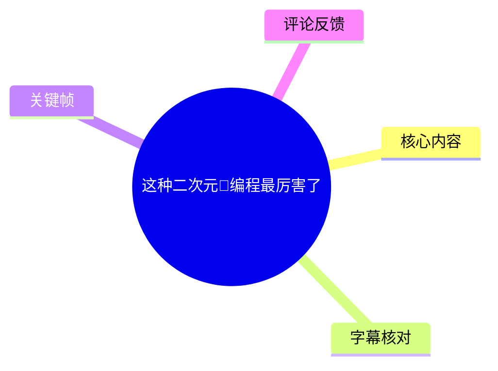
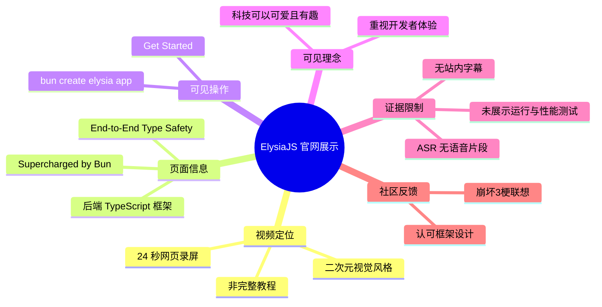
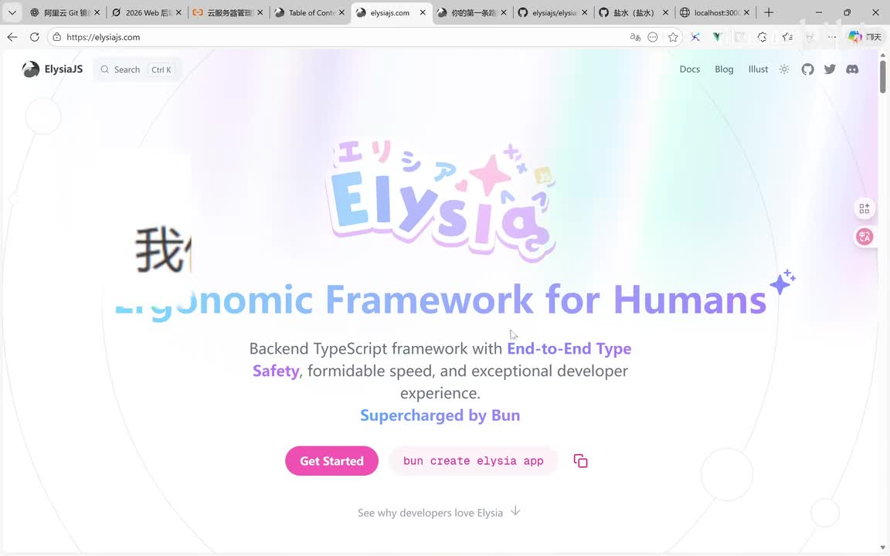
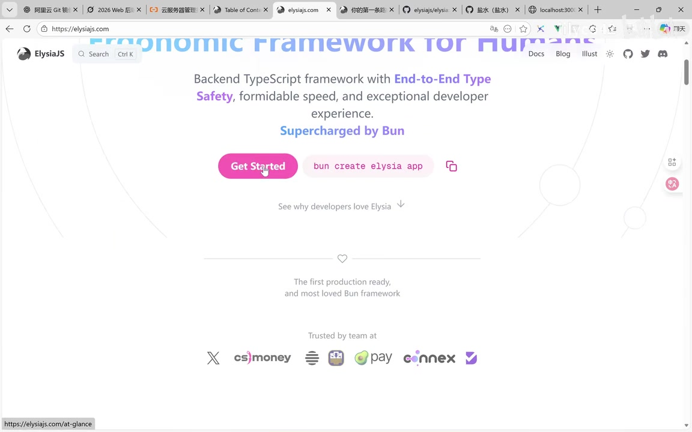
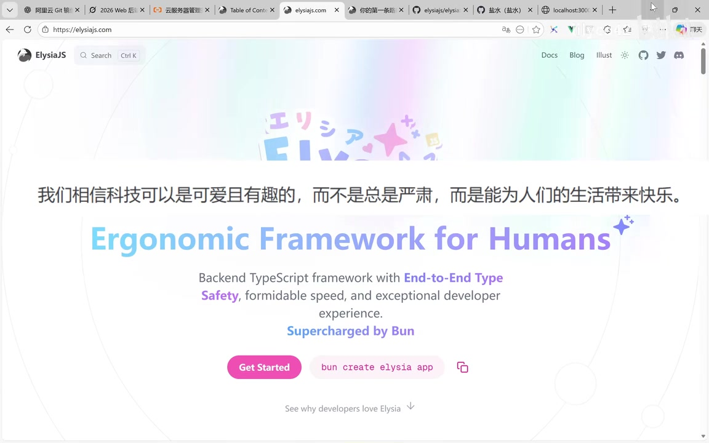

# 这种二次元🙌编程最厉害了

> 来源：[Bilibili 视频](https://www.bilibili.com/video/BV1aXieBrEM4)<br>
> UP 主：lilyco42 ｜合集：AIcode ｜时长：24 秒<br>
> 标签：`elysia`、`js`、`github`、`bun`、`elysiajs`

## 小结

视频以浏览器实录快速展示了 **ElysiaJS** 官网的视觉设计与首页文案。画面中心是带有日文风格标识的 Elysia Logo，搭配渐变配色、星形装饰和“可爱”取向的设计；这与标题中“二次元编程”的调侃相呼应。

从首页可直接读取到，Elysia 将自己描述为一个面向后端 TypeScript 的框架，主张 **端到端类型安全（End-to-End Type Safety）**、速度与开发者体验，并强调由 **Bun** 驱动。视频并未演示实际项目代码、接口运行结果、性能测试或与其他框架的基准对比。

画面中出现了创建项目的命令：

```bash
bun create elysia app
```

这可作为进入 Elysia 项目的入口线索；但视频未展示执行终端、依赖安装输出、生成目录、配置文件或启动命令。因此，不能据此补全任何未在画面中出现的安装与部署步骤。

该视频更适合希望快速了解 ElysiaJS 品牌风格、官网定位及初始化命令的 JavaScript / TypeScript 开发者观看，而不应将它视为完整技术教程。视频没有可用站内字幕，本次 ASR 也未识别出任何语音片段，正文主要依据关键帧中的可见页面文字与视频元数据整理。

时效性方面：视频发布于 2026 年 1 月，页面中显示的框架文案、合作方标识、初始化命令和网站布局均可能随官网更新而变化。实际使用前应以 ElysiaJS 官方文档及对应版本的 CLI 说明为准。

## 思维导图





## 目录

- [视频定位与素材边界](#视频定位与素材边界)
- [ElysiaJS 首页展示](#elysiajs-首页展示)
- [可见的初始化入口与实践边界](#可见的初始化入口与实践边界)
- [设计理念、技术定位与限制](#设计理念技术定位与限制)
- [关键帧索引](#关键帧索引)
- [字幕比对](#字幕比对)
- [评论分析](#评论分析)
- [时效性与结论](#时效性与结论)
- [处理记录](#处理记录)

## 视频定位与素材边界 [00:00](https://www.bilibili.com/video/BV1aXieBrEM4?t=0)

本视频总时长为 24 秒。素材中未提供站内 SRT 字幕；本次 ASR 的时长检测为 23.011 秒，但 `segments` 为空、识别到的语音时长为 0 秒，因此没有可据以划分具体内容段落的真实字幕时间轴。

因此，本整理仅将 `[00:00]` 作为整段视频的确定起点链接，不将关键帧的先后顺序臆测为精确播放时间。各技术结论均限定为画面中可见的内容：

- 视频录制的是 `elysiajs.com` 首页；
- 页面左上角可见 ElysiaJS 标识，顶部导航可见 `Docs`、`Blog`、`Illust` 等入口；
- 页面展示 Elysia 的框架定位、宣传语、开始按钮和初始化命令；
- 视频没有展示作者本人、终端操作、项目源码文件、运行日志、错误信息或性能数据；
- 元数据描述为“`[泰国，可爱，程序员]=大概是男娘`”，这是 UP 主填写的描述，不是可由画面验证的技术结论。

## ElysiaJS 首页展示 [00:00](https://www.bilibili.com/video/BV1aXieBrEM4?t=0)

首页主视觉将 Elysia 标识置于页面中央。Logo 使用日文风格字符、渐变文字与星形元素，整体视觉明显区别于常见的纯工具型开发者站点。这正是标题以“二次元”形容其编程体验的主要画面依据。



> 图：关键帧展示 ElysiaJS 首页首屏。可见英文主标题“Ergonomic Framework for Humans”、后端 TypeScript 框架定位、端到端类型安全主张，以及由 Bun 驱动的说明；它是判断本视频实际技术主题为 ElysiaJS 的核心证据。

页面可见英文定位如下：

> **Ergonomic Framework for Humans**

其中 “Ergonomic” 可理解为强调易用性、符合开发者使用习惯；“for Humans” 则是产品文案，并非可量化的技术指标。

同一区域还显示：

> **Backend TypeScript framework with End-to-End Type Safety, formidable speed, and exceptional developer experience.**  
> **Supercharged by Bun**

据此可严格整理为：

| 页面可见陈述 | 可确认含义 | 视频未提供的部分 |
| --- | --- | --- |
| Backend TypeScript framework | Elysia 将自身定位为后端 TypeScript 框架 | 未说明支持的完整运行时矩阵、版本要求或架构细节 |
| End-to-End Type Safety | 官网将端到端类型安全作为卖点 | 未展示类型从路由、校验到客户端推导的具体实现 |
| formidable speed | 官网宣称速度表现突出 | 未给出测试环境、吞吐量、延迟、对照框架或基准方法 |
| exceptional developer experience | 官网强调开发体验 | 未展示 IDE 补全、调试、错误提示或开发流程 |
| Supercharged by Bun | 页面强调 Bun 与该框架的关系 | 未证明必须使用 Bun，也未演示其他运行环境的兼容性 |

这里的“类型安全”“速度”“开发者体验”均为首页宣传语。它们可以帮助理解产品定位，但不能替代版本固定、环境一致的实测或官方技术文档。

## 可见的初始化入口与实践边界 [00:00](https://www.bilibili.com/video/BV1aXieBrEM4?t=0)

首屏提供了两个主要入口：

1. **Get Started**：用于进入入门文档或引导页面的网页按钮。
2. **`bun create elysia app`**：页面展示的创建项目命令，右侧有复制图标。



> 图：关键帧聚焦首屏下半部分，可辨识粉色“Get Started”按钮、`bun create elysia app` 命令及复制图标。这一帧是记录初始化入口的直接证据，但没有终端执行画面，因此不能把它扩展为已验证的安装教程。

### 画面明确给出的步骤

若仅按视频可见内容记录，流程为：

1. 打开 ElysiaJS 官网首页；
2. 选择点击 **Get Started**，或复制页面展示的初始化命令；
3. 使用 Bun 的创建命令创建 Elysia 应用：

```bash
bun create elysia app
```

### 不应擅自补全的步骤

以下信息未出现在视频或可用字幕中，不能作为本视频已经讲解的步骤：

- Bun 的安装方式与版本；
- 执行命令时的交互选项；
- 应用模板名称、目录结构与依赖清单；
- 开发服务器启动命令；
- 路由、校验、中间件、数据库或部署配置；
- TypeScript 配置、环境变量和生产构建流程；
- 命令是否仍适用于视频发布后最新版本。

换言之，视频传达的是“官网提供了一个 Bun 命令来创建 Elysia 应用”，而不是“已完整演示如何从零完成一个 Elysia 项目”。

## 设计理念、技术定位与限制 [00:00](https://www.bilibili.com/video/BV1aXieBrEM4?t=0)

画面中间叠加出现中文文案：

> 我们相信科技可以是可爱且有趣的，而不是总是严肃，而是能为人们的生活带来快乐。

这段文字与 Elysia 的日文风格 Logo、柔和渐变配色和星形装饰相结合，构成视频所强调的“二次元”或“可爱”编程文化表达。它是设计与品牌理念，不能等同于框架功能、性能或安全性的证明。



> 图：关键帧同时呈现中文理念文案、英文框架定位与“End-to-End Type Safety”。它说明视频把视觉理念和技术宣传并置展示，便于区分“品牌表达”与“技术主张”两类信息。

页面继续向下后，可见：

- “The first production ready, and most loved Bun framework”字样；
- “Trusted by team at”字样；
- 多个团队或公司 Logo。


> 图：该帧可见页面向下滚动后的“production ready”“most loved Bun framework”以及团队标识区域。其价值在于记录官网存在成熟度与采用情况的宣传，但画面未提供“production ready”标准、统计来源、Logo 对应合作关系或最新有效性，不能据此做独立背书。

### 经验：如何正确读取这类短视频

1. **区分官网文案与实测证据**  
   “速度快”“最受喜爱”“生产就绪”等可以记录为官网主张，不能直接转写为无条件事实。

2. **把初始化命令与完整实施分开**  
   `bun create elysia app` 仅是起点；真正落地仍须核对当前 CLI 文档、模板选项与运行环境。

3. **注意框架与运行时的关联**  
   本视频反复显示 Bun，说明 Bun 是理解 Elysia 产品定位的重要前置背景；但画面未提供兼容性范围，不应仅凭该视频断定运行时支持策略。

4. **将视觉风格视为开发者体验的一部分，而非技术能力本身**  
   可爱化 UI 可能降低初次接触的距离感，但是否提升开发效率、类型安全程度或性能，仍需要文档、代码和测试验证。

## 关键帧索引 [00:00](https://www.bilibili.com/video/BV1aXieBrEM4?t=0)

由于不存在可用的字幕时间段，以下按素材提供的关键帧内容说明，不标注未经证实的帧级秒数。

| 关键帧 | 画面内容 | 正文使用价值 |
| --- | --- | --- |
| `frames/frame-001.jpg` | ElysiaJS 首页主视觉、Elysia Logo、框架定位、Bun 创建命令 | 确认视频主题与核心技术文案 |
| `frames/frame-002.jpg` | 首屏上出现中文理念文案，背景仍为官网主视觉 | 确认视频强调“科技可爱且有趣”的视觉/理念表达 |
| `frames/frame-003.jpg` | 中文理念文案完整可读，同时保留类型安全与 Bun 宣传 | 便于区分品牌价值观与技术卖点 |
| `frames/frame-004.jpg` | “Get Started”、创建命令、页面下方生产就绪及团队标识区域 | 记录入门入口与成熟度宣传的可见范围 |

其余关键帧文件虽列入素材清单，但当前提供的可视内容不足以为它们建立可靠的独立画面说明，故未强行引用。

## 字幕比对 [00:00](https://www.bilibili.com/video/BV1aXieBrEM4?t=0)

| 字幕来源 | 完整性 | 专有名词 | 时间轴 | 主要问题 |
| --- | --- | --- | --- | --- |
| Bilibili 站内字幕 | 未提供可用字幕 | 无法核验 | 无 | 素材明确标注“未提供可用站内字幕” |
| 本次 ASR 字幕 | 空 | 未识别 | 无有效分段 | ASR 输出 `segments: []`，语音覆盖率为 0，无法提供转写或时间轴 |

本次 ASR 已检查，使用模型为 `medium`，自动识别语言结果为英语（置信概率 `0.541015625`），音频检测时长为 `23.011` 秒，运行设备为 CUDA、计算类型为 `float16`。但诊断显示：

- `sentenceCount: 0`
- `speechSeconds: 0`
- `speechCoverage: 0`
- 无首个或最后一个语音时间点
- 警告为“未识别到语音片段，应核查是否存在可听语音或正确音轨”

诊断数据**没有**标记 `noAudioStream=true`，因此不能断言源视频没有音轨；只能如实描述为：本次 ASR 未从所提供音频中识别出可用语音内容。最终没有采用字幕文本，而是依据关键帧中可直接辨认的页面文字、视频元数据和热评进行整理。

通过关键帧可校正或确认的专有名词包括：

- **ElysiaJS / Elysia**
- **Bun**
- **TypeScript**
- **End-to-End Type Safety**
- **Get Started**
- **`bun create elysia app`**

## 评论分析 [00:00](https://www.bilibili.com/video/BV1aXieBrEM4?t=0)

以下仅处理可获取热评前三条。评论是社区观点或线索，除画面已直接证实的部分外，不作为事实结论。

### 1. 包湫papa（1127 赞）

> 作者大概率是个玩崩坏三的，当时见到Elysia这个名字还不敢确定，但看到示例代码中也出现了moonhalo我就笑了[崩坏3_开心]

评论者将 “Elysia” 和 “moonhalo” 联想到《崩坏3》相关要素，并据此推测作者可能接触该游戏。该评论补充了观众为何会对框架命名及视频标题产生“二次元”联想。

可信度边界：本视频关键帧可以确认 Elysia 名称和二次元风格 Logo，但当前可见素材中没有展示 `moonhalo` 示例代码，也没有作者自述其游戏经历，因此这一关联不能视为已证实事实。

### 2. 马力综合症（854 赞）

> 图灵真传，敲代码最狠了[笑哭]

这是一条以“图灵”及“敲代码”为主题的玩笑式评论，没有提供可验证的技术信息、框架用法或性能证据。它反映了观众将视频中的人物化/二次元审美元素与程序员文化结合进行调侃的氛围。

可信度边界：纯情绪与玩梗表达，不应据此推导 ElysiaJS 的任何技术能力。

### 3. 一般通过泉此方（359 赞）

> elysia 是真潮酷吧，示例代码里面也一堆要素  
> 框架本身做的还行，我比较喜欢

评论者一方面认可 Elysia 的风格与示例中的文化要素，另一方面表达了对框架本身的个人偏好。这与视频通过官网视觉呈现出的设计特色相吻合。

可信度边界：“框架本身做得还行”是个人体验评价，未给出版本、项目规模、测试条件、对比对象或具体功能案例；视频本身也没有代码示例可供验证。因此，可将其视为社区口碑线索，而非技术评测结论。

## 时效性与结论 [00:00](https://www.bilibili.com/video/BV1aXieBrEM4?t=0)

这是一则以官网视觉展示为主的短视频，信息密度集中在三点：

1. **产品方向**：ElysiaJS 自我定位为后端 TypeScript 框架；
2. **技术卖点**：页面强调端到端类型安全、速度和开发者体验，并突出 Bun；
3. **入门线索**：首页展示 `bun create elysia app` 作为创建应用的命令。

可迁移的经验是：对于此类“框架首页 + 短视频”内容，先提取可执行入口与明确文案，再明确哪些是宣传主张、哪些没有演示证据。尤其不应把“生产就绪”“速度出色”“最受喜爱”等静态网页表达直接等同于在任意环境下成立的结论。

主要限制如下：

- 无可用站内字幕；
- 本次 ASR 未识别任何语音片段；
- 无可靠字幕分段，无法为画面变化建立精确秒级时间轴；
- 未提供源码、终端输出、性能数据、版本号或配置；
- 页面展示内容可能随 ElysiaJS 官网、Bun CLI 或框架版本更新而变化；
- 热评包含文化梗和个人感受，不能替代官方文档或实际验证。

如需将该视频中的命令用于项目，应以当前 ElysiaJS 官方文档和 Bun 的实际命令输出为准，并在目标环境中自行验证依赖、模板、类型推导、启动流程与部署方案。

## 评论分析

- 热评 1：作者大概率是个玩崩坏三的，当时见到Elysia这个名字还不敢确定，但看到示例代码中也出现了moonhalo我就笑了[崩坏3_开心]
- 热评 2：图灵真传，敲代码最狠了[笑哭]
- 热评 3：elysia 是真潮酷吧，示例代码里面也一堆要素 框架本身做的还行，我比较喜欢

以上内容是观众反馈摘录，只用于补充理解视频反响，不作为正文事实依据。

## 处理记录

- Worker ID：`worker-mrj0wjed-b0c290ad`
- 整理模型：`gpt-5.6-terra`
- ASR 模型：`medium`
- 调用工具与素材：视频合并文件 `merged.mp4`、音频 `audio/audio.wav`、关键帧目录 `frames/`、ASR 结果 `asr/asr-result.json`、ASR SRT 路径 `asr/transcript.srt`、评论文件 `comments/comments.json`、视频元数据与关键帧多模态画面理解。
- ASR 运行信息：自动语言识别为英语（概率 `0.541015625`），CUDA / `float16`；无识别文本段落。
- 字幕选择：站内字幕未提供可用内容；本次 ASR 为空且无时间戳分段可用；最终未采用字幕转写，改以关键帧可见文字、元数据和评论整理。
- 关键帧选择依据：选用 `frame-001` 记录框架定位，`frame-003` 记录中文理念与技术卖点并置，`frame-004` 记录初始化命令、入门按钮和下方成熟度宣传；均以画面中可直接辨认的文字为准。
- 时间轴依据：不存在站内 SRT 或 ASR 有效分段，故仅使用视频确定起点 `00:00`（`t=0`），未对后续画面猜测秒数。
- 缓存清理：素材未提供缓存清理执行记录；本文不宣称已执行缓存删除。
- 未解决问题：无法从现有素材确认视频音轨中是否实际含有人声、`moonhalo` 示例代码的具体内容、Elysia/Bun 的准确版本、命令当前有效性，以及官网合作方标识所对应的具体合作关系。
