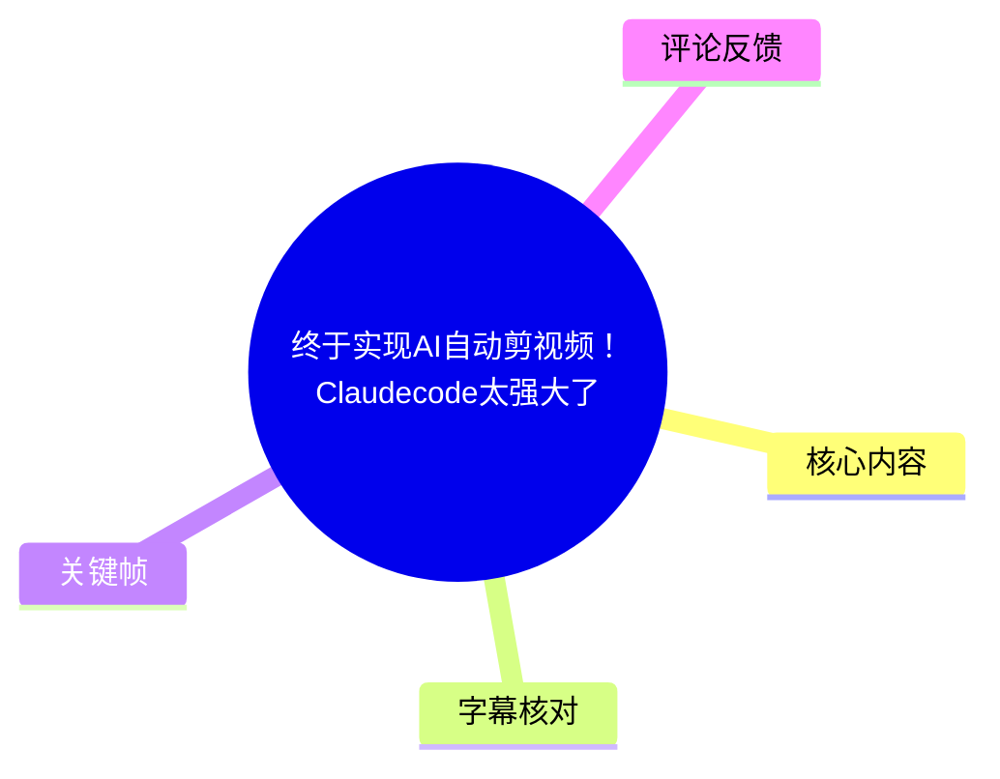
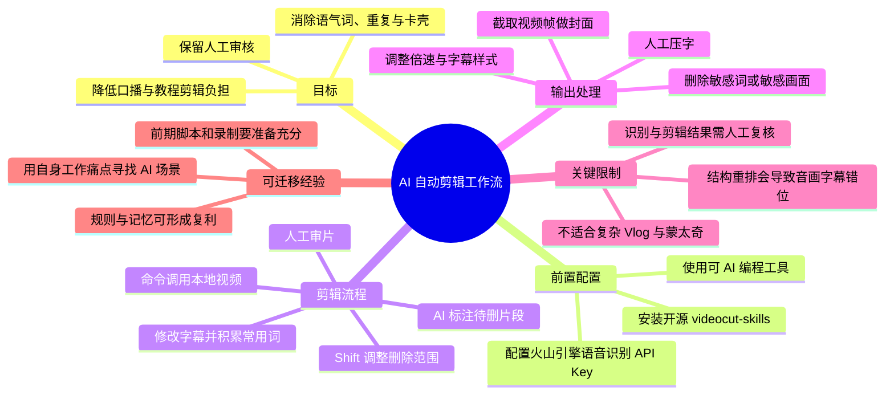
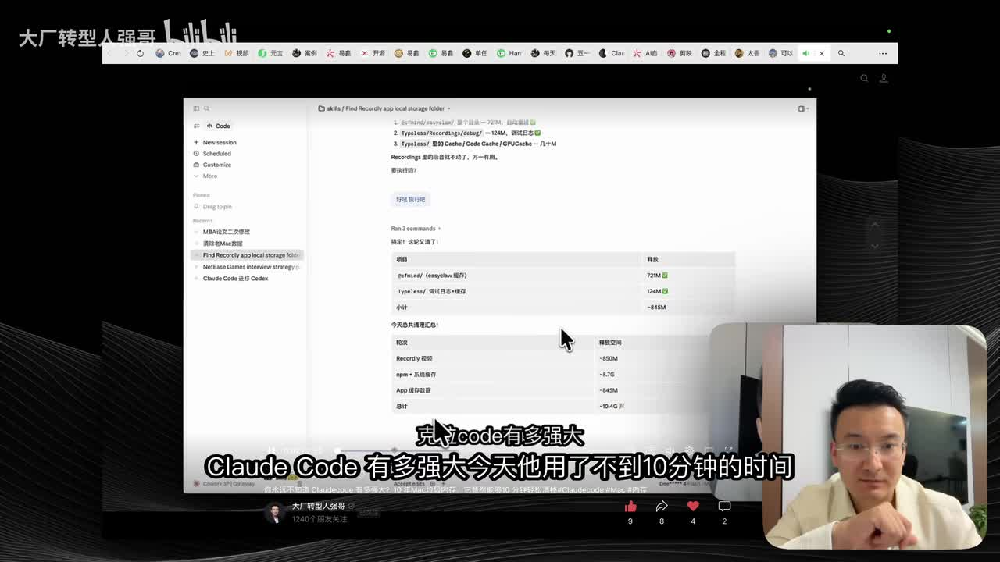
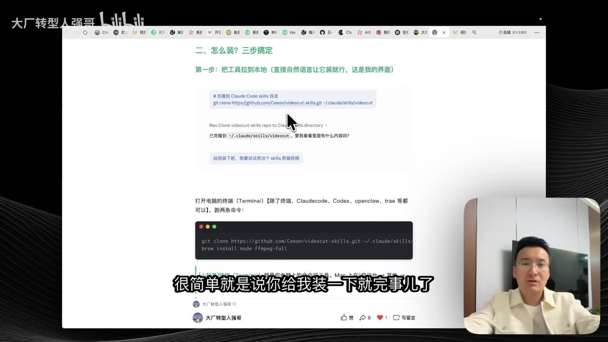
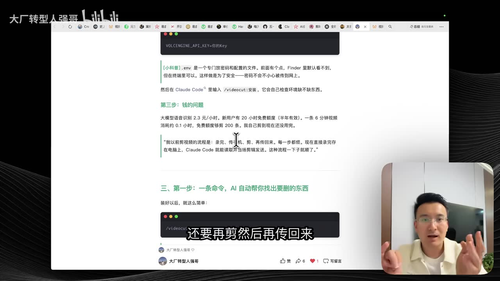
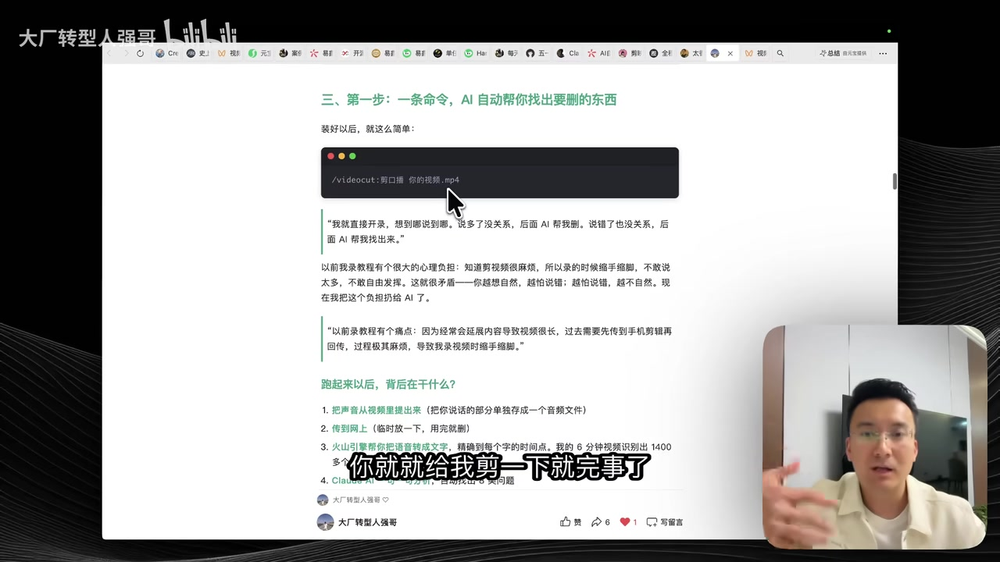

# 终于实现AI自动剪视频！Claudecode太强大了

> 来源：[Bilibili 视频](https://www.bilibili.com/video/BV1mkRtBfED9)  
> UP 主：大厂转型人强哥｜发布时间：2026-05-06｜视频时长：6 分 52 秒  
> 标签：AI、视频、Claude、剪辑视频、Mac  
> 数据抓取时播放量 24,281、点赞 447、收藏 1,454、评论 84；这些互动数据为抓取时快照，并非实时数据。

## 小结

这是一套面向**口播、录屏、教程类视频**的 AI 辅助剪辑工作流。UP 主将一个开源的视频剪辑 Skills 安装到可进行 AI 编程的工具中，再配置火山引擎语音识别 API，由 AI 处理本地视频的转写、问题标注、删除片段、字幕修改与导出等任务。

其核心并不是让 AI 完全替代剪辑师，而是把最耗时、重复度最高的“找语气词、找重复、找卡壳、删无效话、校字幕”交给 AI；创作者则负责前期脚本与录制质量、在工作台中审阅删除范围，以及最终人工验片。视频中的关键经验是：**前期录制越结构化，AI 后期越可靠。**

视频给出了若干量化说法：UP 主称一条 6 分钟原片会被工具自动标出 600 多个问题；火山引擎语音识别按其展示的页面为“2.3 元/小时”，新用户有 20 小时免费额度且半年有效；其口述称 6 分钟视频约消耗 0.1 小时识别额度，可剪约 200 条。视频简介另称，本条视频由 Claude Code 剪辑，14 分钟视频约 2 分钟剪完；这与视频主体“不到 10 分钟”的演示性表述并不完全一致，均应视为作者个人场景下的经验数据，而不是通用性能承诺。

该流程尤其适合画面结构简单、以讲话内容为主的创作者；不适合含大量素材匹配、蒙太奇、画中画、复杂转场与多人协作的 Vlog/商业短片。尤其需要注意：AI 调整前后结构后，可能造成字幕和声音错位；视频中明确将其称为当前“硬伤”。

## 思维导图





## 目录

- [背景：内容创作者的剪辑痛点](#背景内容创作者的剪辑痛点)
- [安装 Skills 与配置语音识别](#安装-skills-与配置语音识别)
- [自动找错、删减与字幕修订](#自动找错删减与字幕修订)
- [结构、封面与样式处理](#结构封面与样式处理)
- [适用范围、限制与可迁移经验](#适用范围限制与可迁移经验)
- [字幕比对](#字幕比对)
- [评论分析](#评论分析)
- [处理记录](#处理记录)

## 背景：内容创作者的剪辑痛点 [00:00:00](https://www.bilibili.com/video/BV1mkRtBfED9?t=0)

UP 主将这套方法定位为写给“被剪辑折磨过的内容创作者”的工作流，重点针对教程和录屏内容。其旧流程是：录制屏幕内容后传到手机，在手机端剪辑，再传回电脑；即使使用 Mac 端剪映，仍认为字幕识别和改字幕的操作体验不足，因此转向“Claude Code + Skills”的路线。

视频开头展示了 AI 可对本地 Mac 内容执行操作、识别并梳理冗余话语的效果。这里的前提并非单一剪辑软件，而是允许 AI 编程工具在本机访问相关文件、执行 Skills 中定义的流程。



> 图：画面中是桌面与 Claude Code 工作区，右下角为 UP 主出镜。它说明视频讨论的是具有本地文件与命令执行能力的工作流，而不是只在网页中输入文案的普通聊天式 AI。

### 视频提出的效率主张 [00:00:14](https://www.bilibili.com/video/BV1mkRtBfED9?t=14)

- 口述演示中称，AI 在不到 10 分钟内完成相关处理。
- 视频简介称：本条视频也是 Claude Code 剪辑的，14 分钟视频约 2 分钟剪完；并与“正常实习生剪辑需要 90 分钟”作对比。
- 这两组数字对应的素材长度、任务范围与是否包含人工审阅均未完整说明，不能直接推导为稳定的效率基准。
- 更可靠的理解是：该方法意在大幅压缩“粗剪、找错、删口癖”这一类机械劳动，而不是证明所有类型视频都能在数分钟内成片。

## 安装 Skills 与配置语音识别 [00:00:29](https://www.bilibili.com/video/BV1mkRtBfED9?t=29)

### 1. 安装开源剪辑 Skills [00:00:29](https://www.bilibili.com/video/BV1mkRtBfED9?t=29)

UP 主介绍先记住一个开源地址，将剪辑 Skills 安装到 AI 工具中。按其说法，可用范围包括但不限于 Claude Code、Codex、OpenClaw，以及字节跳动的 Trae；原则上，只要工具支持 AI 编程和本机命令执行，就可以尝试安装。

画面展示的文档标题为“怎么装？三步搞定”，并显示仓库与命令示例。根据画面可辨识信息，仓库为：

```bash
https://github.com/Ceeon/videocut-skills.git
```

画面还展示了将仓库克隆到 Claude Skills 目录的示例，以及安装 `node`、`ffmpeg-full` 的提示；但视频未完整讲解不同操作系统、不同 AI 工具的目录差异，也没有逐项验证安装结果。因此，实际操作应以仓库当前 README、工具官方文档和本机环境为准。



> 图：此帧直接呈现安装页面、GitHub 仓库地址、终端命令区和“Claude Code skills 目录”的说明，是确认视频所指开源 Skills 及其安装路径的关键视觉依据。

### 2. 注册语音识别服务并配置 API Key [00:00:51](https://www.bilibili.com/video/BV1mkRtBfED9?t=51)

安装后，工具会引导用户前往火山引擎注册、开通语音识别服务，并取得 API Key。UP 主的操作逻辑是：

1. 在火山引擎开通语音识别；
2. 获取 API Key；
3. 将密钥放入本地配置；
4. 让 AI 工具完成其余安装检查和调用。

画面中的文档还提到 `.env` 是专门存放密码和配置的文件，Finder 默认可能不显示这类以点开头的文件，但终端可以访问。将 API Key 放在 `.env` 中的意图是减少密钥被误上传到公开仓库的风险。



> 图：该帧显示 `VOLCENGINE_API_KEY=你的Key` 的配置提示，并展示火山引擎识别费用和免费额度说明；它补足了纯口述中未完整呈现的配置与参数信息。

### 3. 成本与额度参数 [00:01:02](https://www.bilibili.com/video/BV1mkRtBfED9?t=62)

视频口述和画面中出现的成本信息如下：

| 项目 | 视频中的说法 | 使用时应注意 |
| --- | --- | --- |
| 大模型语音识别价格 | 画面显示“2.3 元/小时” | 价格可能随供应商套餐、区域、活动与时间变化，需以火山引擎当前控制台为准。 |
| 新用户免费额度 | 画面显示“20 小时免费额度（半年有效）” | 属于画面展示时的套餐信息，不保证现在仍有效。 |
| 单条素材消耗 | UP 主称 6 分钟视频约消耗 0.1 小时 | 这是其个人测试口径，可能包含服务计费单位、转写时长或其他换算，不应擅自泛化。 |
| 可处理数量 | UP 主称免费额度“能够剪 200 条” | 这是基于其 6 分钟样本做的估算，实际取决于单条时长与计费规则。 |

视频没有披露 Claude Code、模型调用、本地算力、存储、网络或导出耗时的完整成本；因此，上述数字只能用于理解该案例的规模，不能作为总拥有成本。

## 自动找错、删减与字幕修订 [00:01:44](https://www.bilibili.com/video/BV1mkRtBfED9?t=104)

### 1. 用一句指令发起剪辑 [00:01:44](https://www.bilibili.com/video/BV1mkRtBfED9?t=104)

完成 API 配置后，UP 主在命令中直接告诉 AI：桌面上有一个什么样的视频，让其剪辑即可。画面示例显示类似如下的调用形式：

```text
/videocut: 剪口播 你的视频.mp4
```

这是一种工作流意图的示例，不应理解为所有安装环境都可直接使用的通用命令。实际命令名、文件路径、可用参数与权限要求，取决于所安装版本及宿主 AI 工具。

视频同时概括了背后处理链路：从视频中提取声音、上传或调用识别服务、得到带时间点的文本，再由 AI 根据文本与规则生成删除建议并执行剪辑。



> 图：该帧呈现“AI 自动帮你找出要删的东西”的章节、命令输入框及流程列表，有助于理解这里的自动剪辑主要以语音转写和文本级删改为基础，而非对镜头叙事进行全面创作。

### 2. 默认识别的“硬伤” [00:02:02](https://www.bilibili.com/video/BV1mkRtBfED9?t=122)

该 Skills 默认会标出并尝试删除以下问题：

- 语气词；
- 重复表达；
- 说话绕来绕去的片段；
- 卡壳、打结等不流畅表述。

UP 主称，一段 6 分钟原片被自动标记出 600 多个问题。这个数量显示工具的标注粒度可能较细，也意味着“自动标红”不等于“全部应删”。如果直接批量执行，可能损失必要停顿、自然口语感，甚至改变原意。

### 3. 工作台内的人工“监工挑错” [00:02:14](https://www.bilibili.com/video/BV1mkRtBfED9?t=134)

UP 主将“监工挑错”视为流程重点。视频描述的交互方式如下：

1. 工具以红色标记建议删除的内容；
2. 用户阅读标记，确认后执行剪辑；
3. 若工具漏掉需要删除的内容，按住 `Shift` 向后拖拽，使相应区域变红并加入删除范围；
4. 若工具误删了内容，同样按住 `Shift` 向回调整，取消不该删除的部分；
5. 在工作台中直接修改识别错误的字幕；
6. 最后仍需人工审片。

这里体现出该工具更像是“基于语音时间轴的粗剪协作界面”。AI 负责提出、定位和批量执行候选编辑；人负责语义边界、表达风格与内容完整性。

### 4. 字幕记忆与前期录制策略 [00:02:50](https://www.bilibili.com/video/BV1mkRtBfED9?t=170)

UP 主称，工作台会把创作者经常说的词记忆下来，下次再出现时可直接调用；Skills 也自带自动校错脚本。视频未展示记忆保存位置、是否跨项目有效、能否编辑或删除、以及是否会发送至第三方服务，因此不应假设其具备可控的长期个人知识库能力。

经验层面，UP 主强调应尽量在前期完成：

- 内容结构；
- 口播脚本；
- 录制准备；
- 尽可能一遍过的表达。

其目标是让系统识别超过 90% 的内容，剩余约 10% 的错误先不阻碍出片。这里“90%”是 UP 主的个人目标或体验，并不是工具官方准确率指标；站内字幕原话为“90%以上”，而本次 ASR 将其误识别为“14%”，以站内字幕为准。

## 结构、封面与样式处理 [00:03:18](https://www.bilibili.com/video/BV1mkRtBfED9?t=198)

### 1. 结构重排的硬伤：字幕与声音会错乱 [00:03:18](https://www.bilibili.com/video/BV1mkRtBfED9?t=198)

UP 主曾让 AI 在剪完后进一步判断结构、前后调换片段，但认为这个场景目前做得“不特别好”。其明确遇到的问题是：调完结构后，字幕与声音发生错乱。

这意味着当前流程适合在原有时间顺序中删减冗余内容，不宜把它当作稳定的“智能重构”工具。若确实要重排段落，应在导出前重点逐段检查：

- 画面、音频与字幕是否同步；
- 断句是否合理；
- 段落衔接是否导致指代不明；
- 关键结论是否被删掉前提；
- 删除后是否需要重做字幕时间轴。

### 2. 封面能力边界 [00:03:42](https://www.bilibili.com/video/BV1mkRtBfED9?t=222)

视频称，AI 目前可以从视频中截取一帧作为封面，但不能直接在封面上压字。UP 主因此自行制作了横版、竖版两种封面，以适配更多分发场景。

这说明封面仍需人工完成至少两项工作：

- 选择代表内容且视觉清晰的画面；
- 添加标题文字并按横竖版平台要求排版。

### 3. 倍速、字幕样式与内容清理 [00:04:03](https://www.bilibili.com/video/BV1mkRtBfED9?t=243)

UP 主表示，可直接让 AI 调整倍速和字幕样式；如果不知道口播适合什么字幕样式，可以询问 AI。还可以让其删除某些敏感词或敏感画面。

不过，敏感内容判断受平台规则、上下文和法律边界影响，不能只依赖自动删除。尤其在商业、医疗、金融、未成年人、版权或广告内容中，最终发布者仍应自行复核。

### 4. 规则同步与“记忆”的复利 [00:04:27](https://www.bilibili.com/video/BV1mkRtBfED9?t=267)

UP 主将 AI 与实习生剪辑作对比：两者都需要先同步规则；但其认为 AI 不需要额外沟通情绪成本，并会因使用次数增加而更了解个人要求，进而形成效率和内容资产的正循环。

可迁移的部分是：应把剪辑偏好显式规则化，例如：

- 哪些语气词必须删；
- 何种停顿保留；
- 字幕的术语、大小写和人名规范；
- 是否保留重复强调；
- 封面、字幕、倍速的默认风格；
- 敏感词、品牌词和禁用词清单。

至于“AI 会越用越懂你”，视频未说明具体记忆机制与数据保存方式。这是作者的使用感受，不应视为对任何 AI 工具的通用保证。

## 适用范围、限制与可迁移经验 [00:04:56](https://www.bilibili.com/video/BV1mkRtBfED9?t=296)

### 适合的内容类型 [00:04:56](https://www.bilibili.com/video/BV1mkRtBfED9?t=296)

视频认为以下人群更适合使用：

- 制作口播视频的创作者；
- 制作教程、录屏类内容的创作者；
- 画面简单、主要依靠语言传递信息的内容；
- 愿意在前期花一次时间搭建流程、后续获得复利的人。

UP 主戏称这套方法适合“很懒但是很喜欢折腾”的人。其真实含义是：愿意承担一次性配置与规则整理成本，但希望后续减少重复剪辑劳动。

### 不适合的内容类型 [00:05:14](https://www.bilibili.com/video/BV1mkRtBfED9?t=314)

视频明确指出，以下场景不适合：

- 大量 Vlog 素材；
- 大量画面剪辑与镜头选择；
- 蒙太奇表达；
- 大量画中画与转场；
- 涉及更多人员协作的复杂项目。

这些场景的核心难点不只是删除口头冗余，而是镜头叙事、素材检索、节奏设计、音乐节拍、视觉连续性与跨岗位沟通。视频提供的文本驱动式工作流没有展示这些能力。

### 最终经验：从自己的痛点寻找 AI 场景 [00:05:39](https://www.bilibili.com/video/BV1mkRtBfED9?t=339)

UP 主总结的三层收获是：

1. 解决剪辑问题后，可以更大胆录制教程类内容，不再因后期压力回避录制；
2. 工作流持续运行，会不断帮助有类似问题的人，并形成内容传播和个人资产的复利；
3. 不知道该研究什么 AI 场景时，不必先模仿别人，而应检查自己工作中反复出现、令人痛苦且尚未解决的任务。

其中最具操作性的做法是建立“痛点清单”：记录高频、可重复、输入输出较清楚的工作环节，再判断其中哪些能够由 AI 辅助完成。视频最后引导观众查看其公众号置顶文章并实践，未在视频内完整展示全部文档内容。

### 时效性说明

- 视频发布日期为 2026-05-06，工具名称、安装方式、仓库可用性、CLI 命令、模型能力、收费与免费额度均可能在之后变化。
- 本文记录的是视频中展示和口述的工作流，不代表 GitHub 仓库、Claude Code、火山引擎或其他产品的官方说明。
- 实操前应检查仓库近期提交、依赖版本、API 计费页、隐私条款与 AI 工具的本机权限范围。
- 因流程涉及本地文件、API Key 和可能的音频上传，使用前应确认素材版权、隐私授权、密钥管理和数据处理路径。

## 字幕比对

| 字幕来源 | 完整性 | 专有名词 | 时间轴 | 主要问题 |
| --- | --- | --- | --- | --- |
| Bilibili 站内字幕 `p01-ai-zh.srt` | 覆盖 00:00:00—00:06:42，基本完整 | “Claudecode / cloud code”“skills”“火山引擎”等存在口语化或大小写不统一 | 细粒度，逐句时间段可直接定位 | 个别工具名、数字和口语断句不规范，例如将 Claude Code 记为“cloud code”。 |
| 本次 ASR（medium） | 诊断为 376.8 秒语音、覆盖率 91.97%，最后至 00:06:42 | 专有名词错误较多，如“Code”“Cloud CodeConductsOpen Cloud”“Tree”“减硬”等 | 有时间戳，但首段从 00:00:25.200 开始，和站内字幕前 25 秒不一致 | 每段长度约 24 秒、文本严重连写，存在乱码及词义偏差；“90%以上”被识别成“14%”。 |

### 最终字幕选择

正文时间轴以**Bilibili 站内 SRT**为主，因为其从 00:00:00 开始完整覆盖、分段更细，且与视频口述逻辑一致。本次 ASR 已完成检查，`asr-result.json` 未标记 `noAudioStream=true`，说明源视频存在音轨；但 ASR 的首段延迟至 25.2 秒、专有名词和数字误识别较多，因此不作为正文的主要文本依据。

结合站内字幕、关键帧与上下文，对以下表述作了规范化处理：

- “cloud code / Claudecode”统一记为 **Claude Code**；
- “skills”统一记为 **Skills**；
- “火山引擎语音识别 APIK / API-K”统一记为 **API Key**；
- 画面展示仓库名规范为 **videocut-skills**；
- “90%以上”采用站内字幕，而非 ASR 的“14%”；
- 视频并未展示复杂镜头语义理解或自动素材匹配，因此没有将其概括为“全自动视频创作”。

## 评论分析

以下仅分析本次可获取的热评前三条，评论为个人观点或提问，不等同于已经验证的事实。

1. **Huge贝（17 赞）**  
   - 观点：认可视频方法，但更愿意购买剪映会员；称剪映也有语音识别、自动剪口播、选择保留内容和一键删除能力。  
   - 补充价值：指出“语音转写 + 删除口播冗余”并非只有该 Skills 才能实现，商业剪辑软件可能有更低的安装门槛。  
   - 可信度边界：评论未说明所用剪映版本、平台、会员档位及实际效果，不能据此判断与视频中工作流的功能、成本或准确率孰优。

2. **比官网低价全模型api（5 赞）**  
   - 观点：建议先让 Claude/代码把“镜头清单 + 字幕分段规则”写成模板，再让 AI 按模板自动剪，以减少手动对齐。  
   - 补充价值：把视频中“规则同步”和“前期准备”的思路具体化为可复用模板，适用于重复生产相似类型内容。  
   - 可信度边界：视频本身主要展示口播删减，不足以证明它可稳定按“镜头清单”完成复杂镜头匹配；这是一项延伸建议，而非视频已验证功能。

3. **快乐人二仔w（5 赞）**  
   - 观点与提问：询问运行所需电脑配置，以及是否适合短视频带货场景，例如录好口播后让 AI 自动匹配产品使用和产品介绍素材，甚至生成 AI 配音。  
   - 补充价值：准确触及该工作流的边界——从文本删减扩展到素材检索、镜头匹配、商品表达和语音生成，难度显著提高。  
   - 回应：视频没有给出电脑配置，也明确表示不适合包含大量画面剪辑、蒙太奇、画中画和协作的场景。因此，不能根据本视频断言它适合自动生成带货视频或自动匹配商品镜头。

## 处理记录

- Worker ID：`worker-mrj0www4-e8d79408`
- 模型：`gpt-5.6-terra`
- 调用工具与素材：视频元数据、站内字幕 `p01-ai-zh.srt`、本次 ASR 结果 `asr/asr-result.json` 与 `asr/transcript.srt`、关键帧、热评数据。
- 字幕选择：已检查站内字幕与本次 ASR。源视频存在音轨，ASR 未标记 `noAudioStream=true`；因站内字幕从 0 秒开始、分段更细且文本质量更高，正文时间轴优先采用站内 SRT。ASR 用于交叉核验覆盖范围与识别差异。
- 关键帧依据：选用 `frame-001` 展示 Claude Code 本机操作场景，`frame-002` 展示开源 Skills 仓库与安装命令，`frame-003` 展示 API Key 与费用页面，`frame-004` 展示 `/videocut` 调用和自动找错流程；均与对应正文段落存在直接视觉关联。
- 缓存清理：本任务仅使用已提供的素材清单、字幕文本、关键帧和评论数据；未生成额外缓存文件，因而无额外缓存待清理。
- 未解决问题：视频没有完整展示仓库 README、全部安装命令、模型版本、系统配置、导出格式、数据上传路径、API 实际账单或复杂视频项目的实测结果；相关内容不能据此补充或推断。
