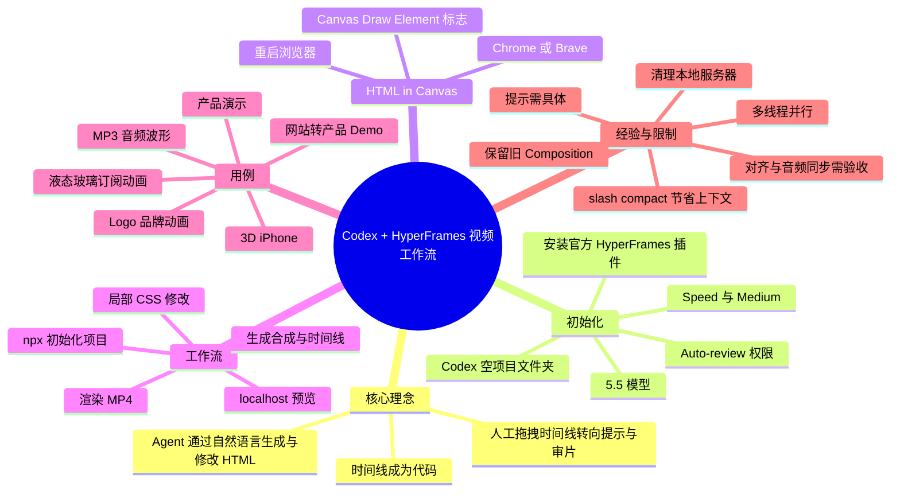
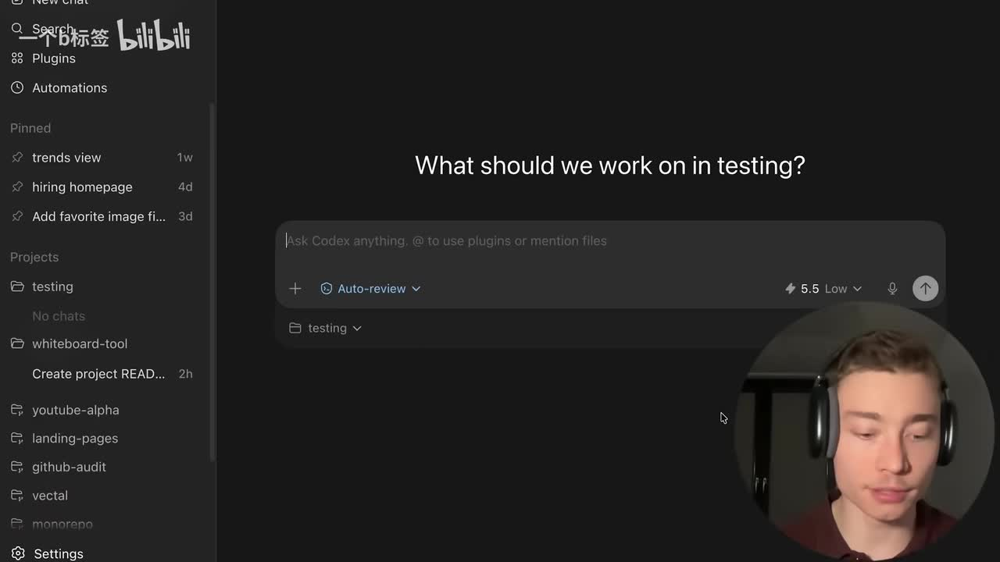
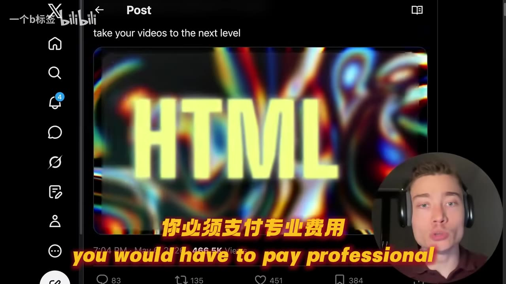
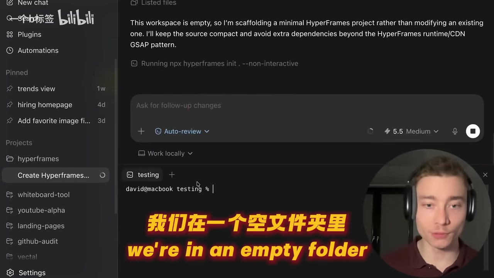

# Codex现在可以制作视频了……这个效率还是太夸张了！

> 来源：[Bilibili 视频](https://www.bilibili.com/video/BV15d7D6UEYX)  
> UP 主：一个b标签｜时长：22 分 34 秒｜合集：AIcode  
> 视频内容为英文讲解配中文字幕；视频明确说明 **HyperFrames 为本期赞助商**。

## 小结

视频介绍了 HyperFrames 与 Codex 的组合工作流：把传统视频时间线转化为 HTML/CSS 等代码描述，由 AI Agent 根据自然语言提示创建、修改并渲染动态图形、产品演示、3D 设备动画、品牌片尾/订阅动画和音频波形等内容。作者的核心判断是：视频制作的主要瓶颈不再只是渲染，而是人工在时间线上逐项操作；代码化时间线使 Agent 可以承担一部分编辑与迭代工作。

实操部分以 Codex App 为例：新建空项目文件夹，选择 5.5 模型、速度模式与中等质量，设置 `Auto-review` 权限，在插件市场安装官方 HyperFrames 插件。若要使用视频所称的 **HTML in Canvas** 能力，还需在 Chrome 或 Brave 中启用名为 **Canvas Draw Element** 的实验性浏览器标志并重启浏览器。

作者演示了从一段详细英文提示开始，让 Codex 在空目录内通过 `npx` 初始化 HyperFrames 项目，生成可在 `localhost:3000` 查看的工作区、资源、合成（composition）、代码、时间线与渲染产物。后续改色等局部修改不必重写整段动画：例如把视觉风格改为红色渐变，作者称约用时 2 分半。

视频也展示了多线程并行工作：利用 Codex 内置的 Git worktrees/工作区能力，可让不同提示在独立线程中同时执行，分别生成液态玻璃订阅动画、带 Logo 的版本、3D iPhone 动画、网站产品演示和音频波形可视化器。作者强调：可复用的合成与素材库会降低后续制作成本，而人的审美、内容判断与反馈能力仍是重要差异。

需要注意，视频中的“只需一句提示”“非专业人士也能完成”等属于作者体验和宣传性判断，并非对质量或耗时的保证。实测演示中出现了元素对齐错误、网页访问被 YouTube 条款页阻挡、音频波形初版不随 MP3 动态变化、反复创建本地服务器、任务持续测试约 40 分钟等情况；因此该工作流仍需要审片、反馈、资源清理和导出验证。

工具及功能具有强时效性。视频称 HTML in Canvas 在录制前“昨天”刚发布，且模型、套餐、插件能力、浏览器实验性标志与权限名称均可能快速变化。本文仅整理视频中可见与可听到的内容，不将其视为当前官方文档或兼容性承诺。

## 思维导图




## 目录

- [背景：从人工时间线到代码时间线](#背景从人工时间线到代码时间线)
- [安装与配置 Codex、HyperFrames](#安装与配置-codexhyperframes)
- [HTML in Canvas 的浏览器前置条件](#html-in-canvas-的浏览器前置条件)
- [首次生成动画：项目脚手架与工作区](#首次生成动画项目脚手架与工作区)
- [局部修改、并行任务与上下文管理](#局部修改并行任务与上下文管理)
- [真实素材与可复用资产案例](#真实素材与可复用资产案例)
- [音频波形案例：问题定位、反馈与导出](#音频波形案例问题定位反馈与导出)
- [限制、风险与可迁移经验](#限制风险与可迁移经验)
- [字幕比对](#字幕比对)
- [评论分析](#评论分析)
- [处理记录](#处理记录)

## 背景：从人工时间线到代码时间线 [00:00:47](https://www.bilibili.com/video/BV15d7D6UEYX?t=47)

作者将 HyperFrames 描述为一个“能用代码编辑和创作视频”的工具：用户以自然英语向 Codex、Hermes 或 Claude 一类 Agent 下达指令，Agent 以 HTML 为主要媒介生成、编辑和处理视频内容。

视频列出的能力包括：

- 一条提示词生成产品演示动画；
- 自定义动态图形；
- 个性化品牌素材，例如 lower thirds（下三分之一字幕条）、订阅动画、社交媒体帖子；
- 自动截图并把截图用作视频素材；
- 生成手机、笔记本等 3D 设备动画；
- 连接 ElevenLabs 生成配音与音效。

作者将传统软件 Adobe Premiere、Final Cut、CapCut 概括为需要人手动在时间线上拖拽片段的工具；HyperFrames 的不同点在于，**时间线本身成为代码**，因此擅长生成 HTML 的 Agent 也可以参与创作与修改。这里是视频的观点陈述，不代表这些传统工具不具备自动化能力，也不意味着所有视频类型都可仅凭提示词完成。


> 图：画面以传统剪辑软件时间线与剪辑师操作作为对照，直观对应作者“瓶颈是编辑者本人”的论述；它有助于理解视频为何强调将时间线代码化。

作者称演示不要求技术背景、视频剪辑经验或开发技能，只需能使用英语和一台电脑。但后续实际操作涉及项目目录、插件、浏览器实验性开关、命令执行、权限与本地服务器，因而“零门槛”更适合理解为降低动画编码门槛，而非完全没有操作与排错门槛。

## 安装与配置 Codex、HyperFrames [00:01:56](https://www.bilibili.com/video/BV15d7D6UEYX?t=116)

### 1. 获取并打开 Codex App

作者建议使用 Codex App，也提及可使用 Claude Code 或 Hermes，但个人认为 Codex 更适合此场景。其演示路径为：

1. 在搜索引擎中搜索 `Codex App`；
2. 打开 OpenAI 官方文档对应入口并按说明安装；
3. 视频称其支持 macOS 与 Windows；
4. 在 Codex 左侧 **Projects** 中选择 **Use existing folder**；
5. 新建或选择一个空文件夹作为项目目录。



> 图：关键帧展示 Codex 的项目列表、输入区、`Auto-review` 权限选项和模型下拉项，是理解后续“空文件夹 + 模型 + 权限”配置的界面依据。

### 2. 视频中的模型、质量与速度参数

作者在画面中选择的参数与建议如下：

| 项目 | 视频中的建议 | 说明与限制 |
| --- | --- | --- |
| 模型 | 5.5 | 作者明确建议使用 5.5，不建议其他模型；这是其个人经验，不构成官方兼容性结论。 |
| 速度模式 | 开启 Speed/Fast | 原因是生成数千行 HTML 可能耗时。 |
| 质量/推理级别 | Medium | 作者称中等通常足够。 |
| 更高质量 | Extra High/超高 | 可能获得更好结果，但作者称一次任务可耗时 10～15 分钟甚至更久。 |
| 权限 | 至少 Auto-review | 用于避免每条命令都手工批准。 |
| 更高权限 | Full access | 作者称可选，但明确将其描述为“更冒险”的选择。 |

权限设置需要结合本地文件、账户、浏览器和网络访问的范围审慎决定。视频后文展示了 Agent 可启动浏览器、读取网站并创建本地服务，因此不宜因为追求自动化而在不了解权限影响时直接授予完全访问。

### 3. 安装 HyperFrames 插件

操作顺序：

1. 在 Codex 左上角找到 **Plugins**；
2. 搜索 `hyperframes`；
3. 选择画面中显示的官方插件；
4. 点击安装。

作者称该插件包含多个 skills，其中包括 **HTML to Canvas**。视频中的安装演示显示很快完成，但实际安装速度受网络、平台与插件版本影响。

## HTML in Canvas 的浏览器前置条件 [00:04:55](https://www.bilibili.com/video/BV15d7D6UEYX?t=295)

视频将 **HTML in Canvas** 称为让 HyperFrames “提升到新高度”的更新，并称该能力在录制前一天刚发布。作者展示的视觉效果包括液态玻璃、不同字体、流畅动画、滑动交互和 3D 物体旋转；他认为数月前这类内容可能需要专业设计与动画人员投入较高费用，而现在可通过数条提示完成。这是作者的成本与效率评价，应结合实际项目复杂度、素材版权、审美标准和交付要求判断。



> 图：画面展示 HTML 视觉内容的效果案例，用于说明视频所说的液态玻璃、字体和动态视觉不是抽象概念，而是其演示目标风格之一。

### 启用实验性功能

作者给出的步骤是：

1. 打开 HyperFrames 官方 **HTML in Canvas** 文档；
2. 复制文档提供的地址；
3. 在 Chrome 或 Brave 新标签页粘贴并打开；
4. 查找并启用名为 **Canvas Draw Element** 的 Chrome Flag；
5. 重启浏览器；
6. 回到 Codex，在此前的 HyperFrames 文件夹中新建线程/聊天。

这是实验性浏览器标志，意味着兼容性与稳定性可能变化，也可能在不同浏览器版本中改名、移除或默认状态不同。视频未提供该 Flag 的完整内部地址，本文不补写或推断其具体 URL。

## 首次生成动画：项目脚手架与工作区 [00:05:26](https://www.bilibili.com/video/BV15d7D6UEYX?t=326)

### 从详细提示开始

作者在新线程粘贴了一段较长的英文提示，开头要求为：

> 创建一个动态图形视觉效果，解释 HyperFrames 与传统 AI 视频工具在根本上的区别。

视频强调，想获得特定效果时，提示应提供足够具体的背景与要求；“自然英语”不等于无需描述细节。对于复杂动画，内容目标、视觉风格、结构、交互、素材位置和不应改动的部分，都应明确写出。

### 空目录初始化与文件保护

Agent 发现当前目录为空后，在目录中使用 `npx` 安装/初始化 HyperFrames。画面显示的命令为：

```bash
npx hyperframes init --non-interactive
```

作者给出的重要经验是，把以下规则保存到 Agent 的 `agents.md` 记忆/说明文件中：

```text
Do not remove old compositions when making new ones.
```

即：**创建新内容时不要删除旧 composition（合成）**。原因是 Codex 有时会重写或删除旧作品；如果希望保留此前的动画和视频，应该要求它创建新的合成，而不是覆盖原合成。



> 图：画面显示 Codex 在空工作区执行 `npx hyperframes init --non-interactive`，并提示正在创建最小 HyperFrames 项目。这是“从空目录到项目脚手架”步骤的直接画面依据。

### 生成耗时与初版结果

作者称该首次任务即使在 Medium 与 Fast 设置下，仍运行约 **10 分钟**。生成结果是一个解释 HyperFrames 的动画演示。作者估计手动制作类似动画可能需要数小时，但同时承认初版存在轻微元素未对齐问题。

打开浏览器后，Codex 自动打开 `localhost:3000`。作者展示的 HyperFrames 工作区包括：

- 左侧：资源（assets）、合成（compositions）和代码；
- 底部：组成时间线的不同片段；
- 播放控制：可调整至 2 倍速、循环播放；
- 时间显示：可在帧数与秒/分钟之间切换；
- 渲染区：可查看已渲染的 MP4 文件。

这说明生成并非只有“黑箱输出视频”；工作区仍保留可编辑的结构、时间线与渲染结果，方便继续调整。

## 局部修改、并行任务与上下文管理 [00:08:38](https://www.bilibili.com/video/BV15d7D6UEYX?t=518)

### 用局部约束修改已有动画

作者将已有设计改成红色渐变时，使用了明确的范围约束：

```text
Change the design to be kind of a red gradient vibe.
Do not change anything else.
```

视频解释，Agent 不需要重写全部内容，而是主要修改定义色彩方案的 CSS 部分。作者称这次修改约耗时 **2 分半**，明显短于首次约 10 分钟的整体生成。

可迁移的提示经验：

- 指明要修改的对象：设计、背景、Logo、波形或设备边缘；
- 指明期望效果：红色渐变、更快、更 3D、液态玻璃等；
- 指明不可修改范围：如“不要改动其他内容”；
- 用截图反馈可见错误，例如元素边缘小方框、波形触顶过快；
- 对已有项目尽量做增量编辑，而不是每次重建。

### 并行线程与独立工作区

作者称 Codex 内置 Git worktrees，因此可以开第二个线程，让两个提示并行运行且互不干扰。视频中并行启动的任务包括：

1. 修改已有动画的配色；
2. 在 HyperFrames 工作区创建 3D 液态玻璃订阅动画；
3. 添加 Logo；
4. 按频道信息生成 3D iPhone 动画；
5. 根据网站生成产品 Demo；
6. 根据 MP3 创建波形可视化器。

作者对液态玻璃订阅按钮的提示要求其为：

- 位于 HyperFrames 工作区；
- 为单个、自包含的 HTML 文件；
- 通过 HyperFrames 的 HTML Preview 面板打开。

对于不相关的需求，视频建议开新线程并行；对于依赖当前任务结果的修改，则可以在同一线程中预先发送后续消息，等待当前任务完成后自动接续。

### 使用 `/compact` 管理上下文

作者建议高频使用 Codex 内置命令：

```text
/compact
```

其作用是压缩聊天历史以节省 token/上下文。视频称 HyperFrames 类任务会快速消耗配额和上下文窗口，使用频率应高于普通 Codex 会话。

作者还评价 Codex 的额度较 Claude Code 更宽裕，并称其 100 美元方案“很值得”；这是视频作者的个人消费评价。实际套餐价格、额度与地区可用性会变化，需以当时官方页面为准。

## 真实素材与可复用资产案例 [00:11:45](https://www.bilibili.com/video/BV15d7D6UEYX?t=705)

### 社区案例与定位：降低制作门槛，而非替代顶尖动画师

作者提到 HyperFrames 发布了 Community Playground，可浏览社区作品、获得灵感并获取代码，在已有示例上继续修改。其展示 Notion 示例后提出：工具目标并不是替代最顶尖的 0.01% 动画师，而是让更多人获得制作动画的能力。

这一区分很重要：工具可降低实现成本，但高水平动画仍涉及品牌策略、视觉语言、节奏、镜头、字体、版权、叙事和交付质量控制。作者实际演示中出现的错位与叠层，也印证了生成结果仍需人工判断。

### 加入真实 Logo

作者把自己的 Logo 拖入项目后，提示 Agent：

```text
Add a logo to the existing liquid glass animation.
Import my logo asset.
Place it above the glass card, centered horizontally.
```

结果在视频中显示为 Logo 位于玻璃卡片中心上方，并带有循环发光动画。作者称该次修改不足 2 分钟。

这里展示的提示结构可复用：

| 信息类别 | 示例 |
| --- | --- |
| 资产来源 | 导入我的 Logo 素材 |
| 修改对象 | 现有液态玻璃动画 |
| 位置 | 玻璃卡片上方、水平居中 |
| 视觉效果 | 发光、循环动画 |
| 约束 | 保留现有动画主体，进行增量修改 |

### 网站转产品演示

作者在新线程中提出“将任何网站转为产品演示”的用例：粘贴网站链接，并给 Agent 提供 Vector AI 的登录权限，让其分析落地页后生成产品动画。视频展示的结果是一次性生成的动画，作者称输入提示非常短，仅一句话。

但这一用例有明显边界：

- 需要向 Agent 提供网站访问或登录权限；
- 涉及网站条款、账号权限、数据隐私与内容授权；
- 演示中 Agent 被 YouTube 的“继续前接受条款”页面阻挡；
- 生成结果存在局部重叠，作者提到可补加阴影等进一步优化。

因此，不应把“粘贴链接即可”理解为对任意受保护网站均能无障碍自动处理。

### 3D iPhone 动画与迭代修复

作者还要求根据其频道内容与风格生成 3D iPhone 动画。初版中，iPhone 边缘处的小方框存在对齐问题。视频给出的修复方法是截图或使用 Playwright 观察后，直接反馈：

```text
Fix these little boxes that are a bit weird on the edges of the iPhone so it actually looks good.
```

这体现了 AI 视频/动态图形工作流中的实际闭环：

1. 生成初版；
2. 在预览中定位错误；
3. 用截图或语言描述错误位置与期望；
4. 让 Agent 定向修改；
5. 再次验收。

## 音频波形案例：问题定位、反馈与导出 [00:14:53](https://www.bilibili.com/video/BV15d7D6UEYX?t=893)

作者最看重的用例之一是 **音频波形可视化器**。他附加了一段约 10 秒的 MP3，要求生成与音乐动态对应的波形。作者认为这类素材可做成可复用资产：首次构建可能耗时较长，但以后只需替换音频或做小幅改动，预计约 1～2 分钟即可生成变体。

### 初版问题

首次波形任务在视频中暴露了多个真实问题：

- 运行约 **7 分 36 秒**后，视觉颜色接近目标，但音乐没有播放；
- 波形没有随实际 MP3 动态变化；
- Agent 持续工作并生成多个 localhost 服务；
- 作者称某任务已运行约 **40 分钟**，即使约 5 分钟后结果已经可用，仍继续测试与“过度思考”；
- 波形初版上冲过快，频繁触顶，缺少更自然的动态范围。

作者向 Agent 补充的关键反馈包括：

```text
Actual MP3 visualize audio waveform.
```

```text
The audio waveform stays flat. It doesn't really move around based on the MP3 file. Get to work and fix that.
```

```text
The waveform is hitting the top too soon.
Make it look nicer, more dynamic and more different,
rather than hitting the top so quickly and so easily.
```

### 本地服务清理与重新渲染

视频中作者注意到 Agent 不断创建新本地服务器，于是要求：

```text
List out all 3000 servers that are running on localhost.
```

这一步说明多任务开发后应检查残留的本地开发服务，避免端口占用、资源浪费或误连到旧版本。

之后作者发现波形需要作为一个新的 HyperFrames composition 创建。工作区内的预览可用，但他继续提出导出要求：需要一个 **包含视频与音频的 MP4**，而不是只有画面的波形预览。最终视频中展示的渲染结果较初版更好，并且作者已预先发送继续增强波形动态性的消息。

### 可复用资产的竞争点

作者把波形案例延伸为内容生产方法论：

- 大量制作同类资产的边际成本会下降；
- 优势不只在“能生成”，而在于建立可复用的高质量资产库；
- 真正的差异在审美、判断哪些内容有效、选择或制作更好动态图形的能力。

这一判断是作者观点，但与演示过程相符：低成本生成并没有自动消除选题、视觉判断和质量验收的工作。

## 限制、风险与可迁移经验 [00:22:00](https://www.bilibili.com/video/BV15d7D6UEYX?t=1320)

### 视频中已出现的限制

| 类别 | 视频中的实际表现 | 应对方式 |
| --- | --- | --- |
| 生成时间 | 首次项目约 10 分钟；高质量可能 10～15 分钟或更久；波形任务甚至持续约 40 分钟。 | 为首次生成预留时间；基于已有 composition 做局部迭代。 |
| 布局质量 | 初版动画、网站 Demo、3D iPhone 有元素错位、边缘方框或叠层。 | 截图并给出精确反馈；在工作区手动微调；再次预览。 |
| 音频联动 | 波形初版不动，音乐不播放。 | 明确要求基于实际 MP3 可视化；要求包含音频的 MP4 渲染。 |
| 服务管理 | 出现多个 localhost 服务。 | 检查并清理运行在端口 3000 的服务。 |
| 网络与网站访问 | Agent 被 YouTube 条款页阻挡。 | 遵守站点条款；人工处理必要确认；不要假定网页都可自动访问。 |
| 上下文与额度 | 长任务快速消耗 token 与上下文。 | 多用 `/compact`；拆分任务；保存长期规则。 |
| 旧作品覆盖 | Codex 可能移除旧 composition。 | 在 `agents.md` 写明保留旧合成、创建新合成。 |
| 权限与隐私 | 演示中涉及 Full access、网页登录和网站分析。 | 最小权限原则；避免把敏感账号、私有数据或无授权素材直接交给 Agent。 |

### 推荐的实施清单

1. **建立独立项目目录**：一个视频或资产库一个目录，避免与其他代码混杂。  
2. **先安装并验证插件**：确认 HyperFrames 插件及其 skills 可用。  
3. **启用前置浏览器能力**：仅在需要 HTML in Canvas 时启用 Canvas Draw Element，并重启浏览器。  
4. **写入持久规则**：在 `agents.md` 中要求保留旧 compositions，避免覆盖。  
5. **先做小型可验收样例**：如 5～10 秒的一个组件，而非直接生成完整长片。  
6. **提示中描述目标与约束**：明确素材、位置、风格、速度、不可变更项、导出格式。  
7. **将不相关任务分线程**：例如 Logo、3D 设备、网站 Demo、波形分别并行；有关联的改动放同一线程排队。  
8. **建立反馈闭环**：预览后用截图和准确语言指出问题，而不是笼统地说“修一下”。  
9. **验证最终交付**：确认 MP4 是否同时包含预期画面、音频、分辨率与动态效果。  
10. **结束时清理环境**：检查本地端口和开发服务器，保留需要的源文件、composition 与渲染产物。

### 时效性说明

视频发布日期为 2026-06-06，且作者称 HTML in Canvas 刚刚发布。以下信息均可能在后续发生变化：

- Codex App 的模型版本、模型名称、质量档位、Speed 模式；
- HyperFrames 插件名称、安装方式、技能清单与 `npx` 初始化命令；
- Chrome/Brave 的实验性标志名称与可用性；
- 订阅价格、额度和上下文限制；
- 网站自动分析、浏览器自动化与第三方登录的权限策略。

因此，实践时应先检查当前官方文档、插件页面和本地界面，再按照本文的视频整理执行。

## 字幕比对

| 字幕来源 | 完整性 | 专有名词 | 时间轴 | 主要问题 |
| --- | --- | --- | --- | --- |
| Bilibili 站内字幕 `p01-ai-zh.srt` | 覆盖 00:00:00～00:22:33，内容完整 | 有较多机器翻译式误写，如 “Hermes” 被写作 “Her Mess”，“HTML in Canvas” 被直译为“HTML在画布中”，“Git worktrees”未准确呈现 | 有逐段真实 SRT 起止时间，可直接用于本笔记时间轴 | 中文可读性较好，但部分产品名、命令、模型名与技术表述不准确或混杂 |
| 本次 ASR `medium` | 144 段，语音覆盖约 95.21%，覆盖 00:00:07.380～00:22:33.640 | 英语原话更利于核对 HyperFrames、Codex、ElevenLabs、`/compact`、`npx`、localhost、MP3 等术语 | 带时间戳，但首段较站内字幕晚约 7 秒；不宜直接替代站内字幕做全部章节定位 | 有识别错误与听写不稳，如 “HyperFace/HyperFramez”“cloud code”“GPD model”“margonfiles”等；部分句子缺词或断句异常 |

### 最终字幕选择与校正方式

本文以 **站内 SRT 的真实分段时间**作为章节时间轴来源，并逐段对照本次 ASR 的英语原话核对技术术语、命令和关键结论。

本次 ASR 已实际检查；其诊断中**没有** `noAudioStream=true`，且检测到英语音轨，语言置信度为 0.99609375，因此不是无音轨视频，也不是工具失败。ASR 从约 00:00:07 才开始识别出语音，而站内字幕从 00:00:00 开始；本文在时间定位上优先采用站内 SRT，在术语还原上优先参考 ASR 与画面。

重点校正包括：

- `Hermes`：站内字幕出现“Her Mess”，按 ASR 校正为 Hermes。
- `ElevenLabs`：站内字幕译作“ElevenLabs”，ASR 识别为“11 labs”，统一写作 ElevenLabs。
- `HTML in Canvas`：保留英文功能名，并在正文解释其视频中的中文含义。
- `Canvas Draw Element`：保留英文浏览器标志名称，不依据字幕猜测其完整 Flag URL。
- `npx hyperframes init --non-interactive`：依据关键帧与 ASR 还原。
- `Auto-review`、`Full access`、`/compact`、`localhost:3000`、Git worktrees：以 ASR 的英文原词及界面语境整理。
- ASR 中的 “HyperFace”“hyperface workspace”等属于识别偏差，统一校正为 HyperFrames。

## 评论分析

仅处理本次可获取的热评前三条；评论反映的是用户感受，不作为工具能力或价格的已验证事实。

1. **一只小野悠｜19 赞**  
   > “贫穷限制了我的想象力”  
   这条评论以调侃方式表达了对视频中高效生成能力及可能成本的震撼。它没有提供具体价格、设备或订阅门槛信息，不能据此推导 HyperFrames 或 Codex 的实际使用成本，但反映出观众对“能力很强、可能难以负担”的直觉。

2. **小辰_001｜6 赞**  
   > “up，你的视频我很想看，但是我看不懂，能不能改成中文呢[大哭]”  
   评论指出语言可达性问题：视频为英文讲解，虽然有中文字幕，但技术术语、长提示词和界面操作仍可能增加理解难度。这也是本笔记保留英文命令和术语、同时提供中文步骤解释的原因。该评论未涉及工具本身的准确性。

3. **Ai服务升级8｜5 赞**  
   > “给你加个油”  
   这是一条鼓励性评论，没有给出关于 Codex、HyperFrames、视频案例或操作步骤的可验证补充信息，也未形成争议点。

## 处理记录

- Worker ID：`worker-mrj0wbly-5dc4e50c`
- 模型：`gpt-5.6-terra`
- 调用工具与素材：视频元数据、站内字幕 `p01-ai-zh.srt`、本次 ASR 结果 `asr/asr-result.json` 与 `asr/transcript.srt`、关键帧素材、热评数据。
- ASR 检查结果：已检查。本次 ASR 使用 `medium`，识别语言为英语，语言置信度 0.99609375，语音覆盖约 95.21%；未标记 `noAudioStream=true`，说明源视频存在音轨。
- 字幕选择：章节时间轴以站内 SRT 的真实起止时间换算秒数；正文中的英文产品名、命令和技术名词通过本次英语 ASR 对照校正；对 ASR 自身的听写错误不直接采纳。
- 关键帧选择依据：
  - `frames/frame-001.jpg`：传统人工时间线编辑画面，用于解释“人工编辑瓶颈”论点。
  - `frames/frame-002.jpg`：Codex 项目、模型和 `Auto-review` 配置界面，用于配置步骤。
  - `frames/frame-003.jpg`：HTML 动态视觉效果案例，用于说明 HTML in Canvas 所展示的目标效果。
  - `frames/frame-004.jpg`：空目录执行 `npx hyperframes init --non-interactive`，用于初始化步骤。
- 热评范围：仅分析可获取热评前三条，未扩展到其他评论。
- 缓存清理：提供的素材中未包含实际缓存清理执行记录；本文未编造“已清理”。视频中仅整理了作者要求列出并处理 localhost:3000 服务的经验。
- 未解决问题：
  - 素材未提供 HyperFrames、Codex 或浏览器 Flag 的当前官方文档，无法验证视频录制后功能、定价、模型与权限选项是否仍保持一致。
  - 关键帧路径列表虽包含 12 个文件名，但本任务提供可见画面的关键帧为前 4 张；正文只使用了有明确画面依据的图片。
