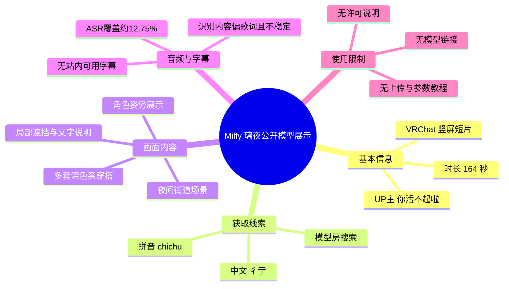
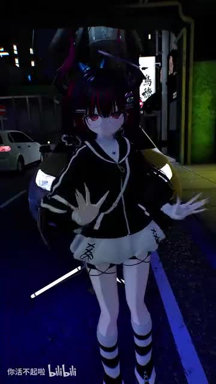
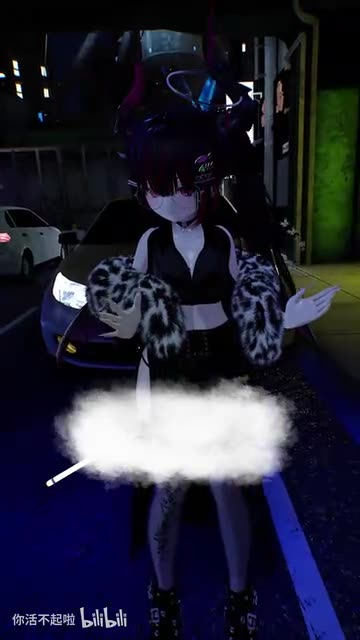
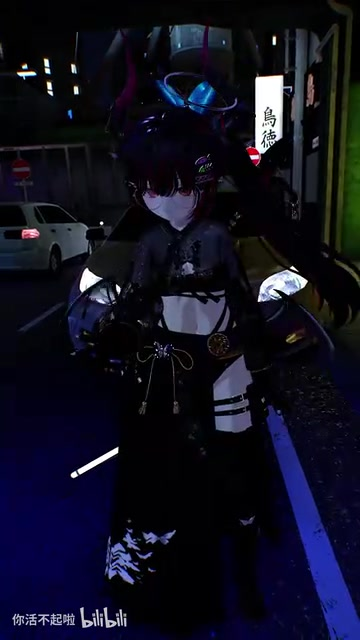
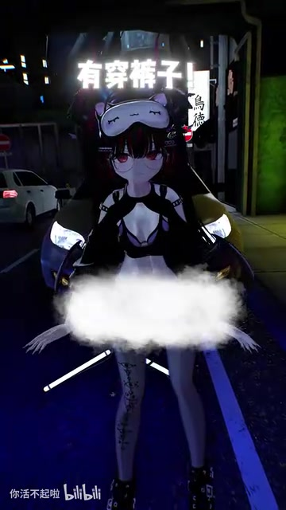

# vrchat 公开模型 Milfy 璃夜

> 来源：[Bilibili 视频](https://www.bilibili.com/video/BV1i7Ei6GEsw) 
> UP 主：你活不起啦｜时长：2 分 44 秒｜分辨率：1440 × 2560（竖屏） 
> 标签：VRChat、公开模型、Milfy、璃夜、可爱、剪辑

## 小结

视频是一支围绕 VRChat 公开模型 **Milfy「璃夜」**制作的竖屏展示短片。画面核心是同一角色在夜间街道场景中摆姿势、切换穿搭，以角色外观、服装搭配和氛围感作为主要观看内容；并非模型制作、上传或参数配置教程。

最重要的可执行信息来自视频简介：可在 VRChat 的模型房内搜索拼音 **`chichu`** 或中文 **`彳亍`** 查找相关内容。简介将该模型称为“公开模型”，但素材没有提供模型链接、作者主页、许可证、可商用范围、二创规则、PhysBone/表情菜单配置或上传所需 SDK 信息，因此实际使用前仍需在模型房或作者发布页核验。

画面显示角色具有多套服装视觉效果：包括偏学院风的黑白套装、露脐上装搭配毛绒外套的造型，以及带蕾丝和饰件的深色礼服感造型。视频简介还特别回应“衣服裤子都有穿”的问题；关键帧中的大面积白色遮挡及“有穿裤子了”字样表明，创作者对部分画面进行了遮挡或说明性处理。

音轨中没有清晰的讲解性口播。ASR 仅在 1.84–54.42 秒识别到少量、且语义不稳定的中文歌词/人声片段，视频其余时段没有可用的语音转写。因此，本文将**模型名称、搜索方式和公开属性**以标题、简介为准，将**服装与画面表现**以关键帧为准，不把不可靠 ASR 文本当作模型说明。

适合希望寻找或浏览 VRChat 女性角色公开模型、关注模型穿搭展示和摄影氛围的观众阅读。其限制是：素材没有展示进入模型房、下载、克隆、上传或使用菜单的过程，不能据此推导具体获取步骤或技术兼容性。

## 思维导图

## 目录

- [视频定位与时效信息](#视频定位与时效信息)
- [公开模型的已知获取线索](#公开模型的已知获取线索)
- [角色视觉展示与穿搭变化](#角色视觉展示与穿搭变化)
- [音轨、时间轴与内容边界](#音轨时间轴与内容边界)
- [可执行步骤与限制](#可执行步骤与限制)
- [关键帧索引](#关键帧索引)
- [字幕比对](#字幕比对)
- [评论分析](#评论分析)
- [处理记录](#处理记录)

## 视频定位与时效信息 [00:00:01](https://www.bilibili.com/video/BV1i7Ei6GEsw?t=1)

这是一个以角色摄影和剪辑展示为主的视频，而非完整的 VRChat 使用指南。标题直接给出“vrchat 公开模型 Milfy 璃夜”，标签也包含“模型”“公开模型”“VRChat”和“milfy”，可确认视频主题与 VRChat 角色模型有关。

视频采用 1440 × 2560 的竖屏画幅。现有关键帧可见角色处于夜晚的街道环境：背景有车辆、街灯、店铺或招牌视觉元素；角色被置于画面中央，以正面站姿、手势和服装切换作为主要构图。该环境可用于展示角色整体比例、服装轮廓与暗光氛围，但素材未说明它是哪个 VRChat World，也未说明是否可公开进入。

发布时间元数据对应 2026 年 6 月 11 日。模型房搜索结果、模型可访问性和 VRChat 平台内容均可能随作者更新、房间调整或平台规则变化而改变；本文记录的是该视频素材抓取时可见的信息，不保证后续仍可搜索到相同结果。

## 公开模型的已知获取线索 [00:00:29](https://www.bilibili.com/video/BV1i7Ei6GEsw?t=29)

视频简介给出唯一明确的获取入口线索：

> 模型房游戏内搜拼音或中文就有：`chichu` 或 `彳亍`

可据此确认的内容包括：

1. 创作者指向的是 **VRChat 游戏内的模型房**搜索方式，而不是网页下载页。
2. 可尝试的搜索关键词有两个：拼音 `chichu`、中文 `彳亍`。
3. 标题和简介均将内容表述为“公开模型”相关信息。

但以下信息**没有在素材中出现**，不能补全或臆测：

| 项目 | 素材是否提供 | 结论 |
| --- | --- | --- |
| 模型房的准确名称或链接 | 否 | 无法定位具体 World。 |
| 模型作者身份 | 否 | 不能将 UP 主直接等同于模型作者。 |
| 模型下载地址或 VCC/Unity 工程 | 否 | 无法提供离线导入路径。 |
| Avatar 克隆是否开启 | 否 | 不能确认可否直接 Clone。 |
| PC/Quest 兼容性 | 否 | 不可判断性能等级或平台支持。 |
| 许可证、再分发与商用权限 | 否 | “公开”不等于可任意二改、商用或再发布。 |
| 服装是否能独立开关 | 否 | 画面呈现多套造型，但未展示菜单操作。 |

> 图：关键帧展示角色位于夜间街道中央，穿黑白色系的短上装、短裙/下装与条纹袜。它能说明视频是角色外观展示而非软件界面录屏，也能呈现环境光对模型材质与服装轮廓的影响。

## 角色视觉展示与穿搭变化 [00:00:53](https://www.bilibili.com/video/BV1i7Ei6GEsw?t=53)

现有关键帧显示，视频通过服装切换或剪辑切换展示同一角色的不同造型。角色保持深色长发、红紫色眼部视觉特征与夜景街道背景，便于观众将注意力集中在衣装差异上。由于视频没有提供服装菜单或切换操作画面，以下仅描述**画面结果**，不认定这些造型一定来自同一模型内置菜单。

### 造型一：黑白学院感搭配

画面中的角色使用黑色上装，肩部和袖部有浅色装饰，搭配浅色下装、交叉绑带/线条元素以及黑白条纹袜。该造型在夜景中有较高的明暗对比，能够让角色腿部与服装边缘保持可见。

### 造型二：毛绒外套与露脐上装

另一帧中，角色穿黑色露脐上装，并披有黑白斑纹毛绒质感外套，下身区域被白色模糊遮挡覆盖。遮挡使下装、腿部细节与是否存在具体服装部件无法从该帧准确辨认，因此不应基于该画面判断模型的身体细节或服装完整度。

> 图：关键帧展示黑色露脐上装与毛绒质感外套的组合，下半部有明显白色遮挡。其价值在于证明视频存在不同穿搭展示，同时提醒读者：被遮挡区域不是可供分析的模型细节。

### 造型三：深色蕾丝与饰件造型

另一套造型使用深色蕾丝、腰部装饰、袖部/肩部立体元素及较长的下装轮廓，整体更接近哥特或礼服感视觉方向。画面可用于观察角色的服装风格跨度，但无法确认其是否为原模型自带服装、后期替换服装，或仅为剪辑中的独立展示。

> 图：关键帧突出角色上半身蕾丝装饰、腰部金色/圆形饰件与深色长下装轮廓，有助于辨识该片并非只展示单一服装外观。

### 关于“有穿裤子了”的画面文字

关键帧出现“有穿裤子了”文字，且下半部存在白色遮挡。结合简介“衣服裤子都有穿硬说我露点> <”，可以确认创作者在回应围绕角色穿着的争议或误解。这里应区分两点：

- **可确认**：创作者在简介中称角色“衣服裤子都有穿”，画面也出现相应文字。
- **不可确认**：具体服装结构、遮挡前后的完整下装细节，以及平台审核或举报事件的具体经过，素材均未提供。

> 图：画面中央上方显示“有穿裤子了”，下半部仍有白色遮挡。该帧是理解简介说明语气的直接视觉依据，不应用来反推出被遮挡区域的实际模型细节。

## 音轨、时间轴与内容边界 [00:00:53](https://www.bilibili.com/video/BV1i7Ei6GEsw?t=53)

本次 ASR 检测到音轨，`noAudioStream` **未标记为 true**，因此不能将视频视为无音轨源。识别语言为中文，语言置信度为 0.9971；但内容覆盖仅约 **20.85 秒 / 163.584 秒（12.75%）**，且文本明显更像背景歌曲/人声的片段，不能作为创作者口述说明。

可直接使用的 ASR 时间段如下：

| 时间段 | ASR 原文 | 适合作为事实依据吗 |
| --- | --- | --- |
| [00:00:01–00:00:02](https://www.bilibili.com/video/BV1i7Ei6GEsw?t=1) | “時間一點” | 否；语义不完整。 |
| [00:00:29–00:00:49](https://www.bilibili.com/video/BV1i7Ei6GEsw?t=29) | 关于生死、再见、魂魄、灰尘、时间与白马等连续文本 | 否；疑似歌词，且个别词句识别不通顺。 |
| [00:00:53–00:00:54](https://www.bilibili.com/video/BV1i7Ei6GEsw?t=53) | “把正方向轉向” | 否；脱离上下文，无法作为模型功能说明。 |

ASR 的最后一个识别片段止于 54.42 秒，而视频总长约 164 秒；这不表示后半段没有画面或没有声音，只表示本次语音识别未获得可靠可用的文本。对于 54.42 秒之后的精确内容、服装切换次序、角色动作与画面文字，现有材料没有提供逐帧时间标注，本文不按文字顺序虚构对应时间点。

## 可执行步骤与限制 [00:00:29](https://www.bilibili.com/video/BV1i7Ei6GEsw?t=29)

### 根据视频简介可尝试的操作

1. 启动 VRChat 并进入可搜索模型的模型房环境。
2. 在房内搜索界面尝试输入拼音：`chichu`。
3. 若拼音无结果，再尝试中文：`彳亍`。
4. 在找到相关结果后，查看模型房现场显示的作者署名、使用规则、克隆状态和平台兼容性。
5. 若要保存、克隆、上传、改造或商业使用，应以模型页面或作者明确公布的授权条款为准。

### 不应从本视频直接得出的操作结论

- 不能据此确认模型房名称、入口 URL 或邀请方式。
- 不能确认该模型目前仍在公开房间中可见。
- 不能确认服装、发型、配件是否可切换，或是否需额外导入。
- 不能确认 Quest 可用性、Polygon 数、材质槽数、纹理分辨率、PhysBone 数量、性能评级等技术参数。
- 不能确认可否二次发布、售卖、拆件、商用或用于其他平台。
- 视频没有 Unity、VRChat SDK、VRC Creator Companion、上传面板或 Avatar Descriptor 的画面，故不存在可整理的上传配置步骤。

## 关键帧索引

> 提供的关键帧文件共 12 张；本材料仅附带其中前 4 张的可视画面信息。以下选择以“能支撑正文陈述、能辨别服装差异、能解释创作者文字说明”为标准，不为未附画面描述的帧补写内容。

| 文件 | 用途 | 画面价值 |
| --- | --- | --- |
| `frames/frame-001.jpg` | 基础角色与环境介绍 | 展示夜景街道、角色整体比例与黑白搭配。 |
| `frames/frame-002.jpg` | 服装变化与遮挡说明 | 体现毛绒外套造型，并明确下半部存在遮挡。 |
| `frames/frame-003.jpg` | 深色礼服感造型说明 | 用于呈现蕾丝、腰饰和长下装形成的风格变化。 |
| `frames/frame-004.jpg` | 简介争议说明的视觉佐证 | 出现“有穿裤子了”文字，与简介内容直接对应。 |

## 字幕比对

| 字幕来源 | 完整性 | 专有名词 | 时间轴 | 主要问题 |
| --- | --- | --- | --- | --- |
| Bilibili 站内字幕 | 未提供可用字幕 | 无法核验 | 无可用分段 | 无法用于恢复视频内容。 |
| 本次 ASR 字幕 | 较低；仅覆盖约 12.75% 时长 | 未识别出 Milfy、璃夜、VRChat、`chichu` 或 `彳亍` | 有 3 个真实 SRT 时间段 | 语义多为疑似背景歌词，含不通顺片段，且 54.42 秒后无可用文本。 |

最终未采用任何字幕文本作为模型名称、作者、功能或操作事实的来源。模型名称以标题为准；搜索词 `chichu` 与 `彳亍` 以视频简介为准；角色服装变化、夜景场景、白色遮挡和“有穿裤子了”文字则通过关键帧画面确认。

ASR 与画面之间没有足够证据建立逐句语义对应：例如 ASR 中的“生死”“魂魄”“白马”等词并未被用作视频模型信息，也没有被解释为角色设定。

## 评论分析

仅处理本次可获取的热评前三条；评论属于个人表达或补充信息，不等同于已验证的模型资料。

1. **你活不起啦（5 赞）**：“群友拍的绝美照片[给心心]”  
   - 观点：视频中的展示画面或照片由群友拍摄，UP 主对其美感表示肯定。  
   - 补充价值：说明视频可能包含社群协作摄影，而不一定完全由 UP 主独自拍摄。  
   - 可信度与边界：评论来自 UP 主本人，能反映其说法；但没有提供拍摄者身份、拍摄地点或授权范围，不能据此确认具体 VRChat World 或摄影流程。

2. **琪露諾づ（4 赞）**：“坏了，我网名真叫璃夜，这下不得不用了……”  
   - 观点：评论者因自己的网名也叫“璃夜”，表达想使用该模型的兴趣。  
   - 补充价值：侧面反映角色名称具有记忆点，并引发了潜在使用意愿。  
   - 可信度与边界：这是个人玩笑式反馈，不证明模型可用、易获取或授权宽松。

3. **情商低下的黑听葡萄树（1 赞）**：“小萝莉穿成大人模样[doge][星星眼]”  
   - 观点：评论者将角色的幼态外观与成熟风格服饰并置评价。  
   - 补充价值：与关键帧中多套偏成熟风格的深色穿搭相呼应。  
   - 可信度与边界：属于主观审美描述；不应用于判断角色年龄设定、模型定位或服装授权状态。

## 处理记录

- Worker ID：`worker-mrj0wjed-b0c290ad`
- 模型：`gpt-5.6-terra`
- 调用工具与素材：
  - 视频元数据读取：标题、UP 主、简介、时长、标签、统计信息。
  - 音频提取与 ASR：`audio/audio.wav`、`asr/transcript.srt`、`asr/asr-result.json`。
  - ASR 模型：`medium`，语言自动检测为中文，CUDA，`float16`。
  - 关键帧：素材目录 `frames/`，正文选用 `frame-001.jpg` 至 `frame-004.jpg`。
  - 评论读取：`comments/comments.json`，仅使用可获取热评前 3 条。
- 字幕选择：
  - 站内字幕：未提供可用字幕。
  - 本次 ASR：已检查，存在音轨且有真实时间戳，但语音覆盖低、内容偏歌词且无法支撑模型信息。
  - 最终策略：不以 ASR 作为模型知识来源；以标题、简介和关键帧分别支撑名称/搜索词/画面描述。
- 关键帧选择依据：
  - `frame-001` 用于说明夜景场景与基础服装；
  - `frame-002` 用于说明毛绒外套造型及遮挡边界；
  - `frame-003` 用于说明深色蕾丝与饰件造型；
  - `frame-004` 用于核对简介中“有穿裤子”的回应性文字。
- 缓存清理：素材未提供缓存清理执行日志，无法确认是否已清理；不将其表述为已完成。
- 未解决问题：
  - 未提供模型房精确名称、链接或模型作者信息。
  - 未提供许可协议、平台兼容性与技术性能参数。
  - 未提供逐帧时间戳，不能把单张关键帧精确绑定到视频内具体秒数。
  - ASR 在约 54 秒后缺乏可用识别文本，无法以字幕完整复原后半段内容。
