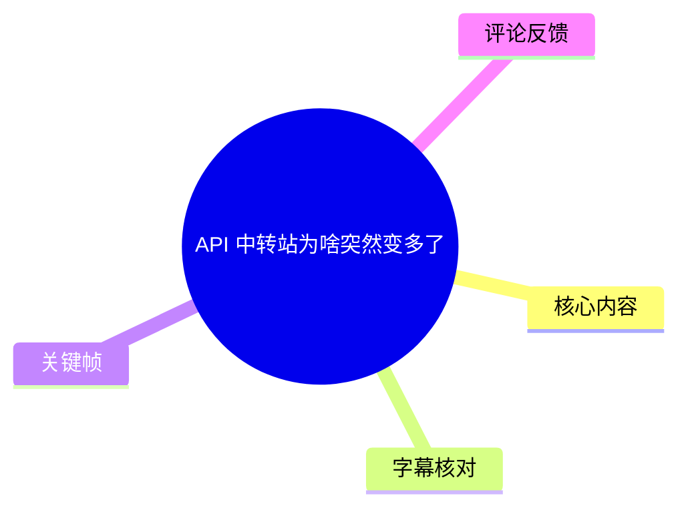
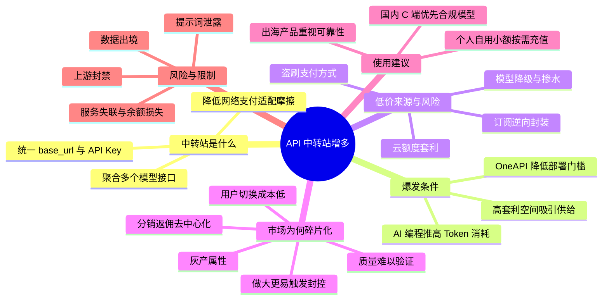
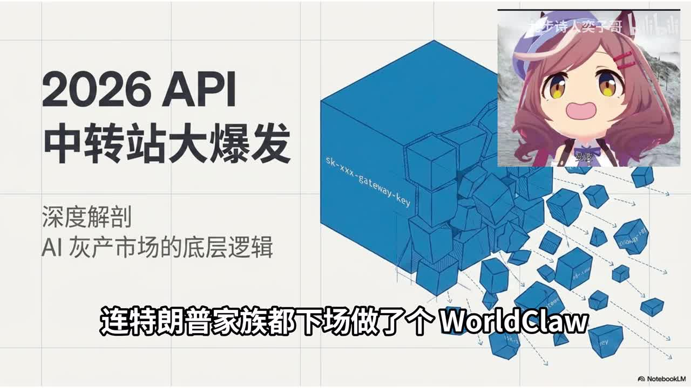
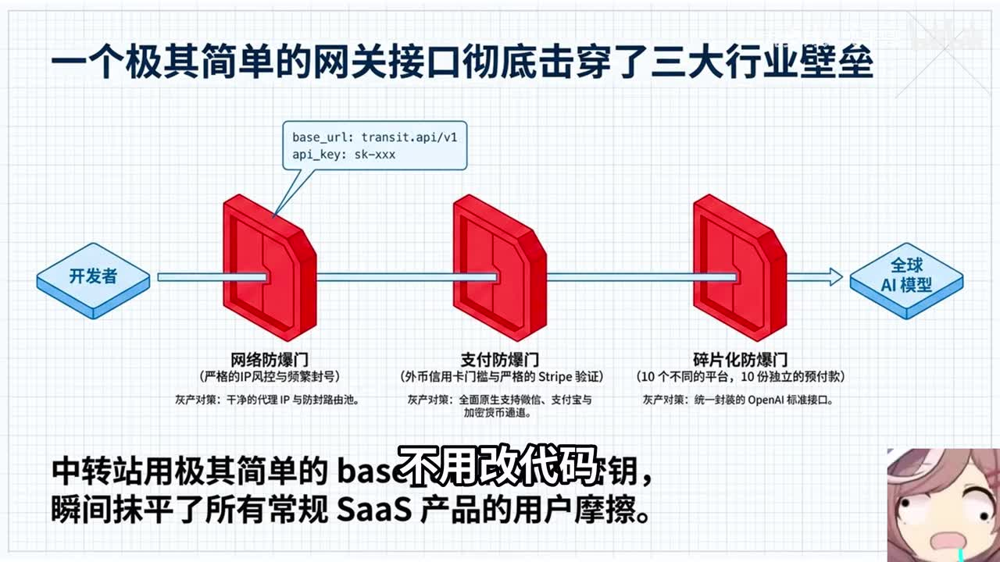
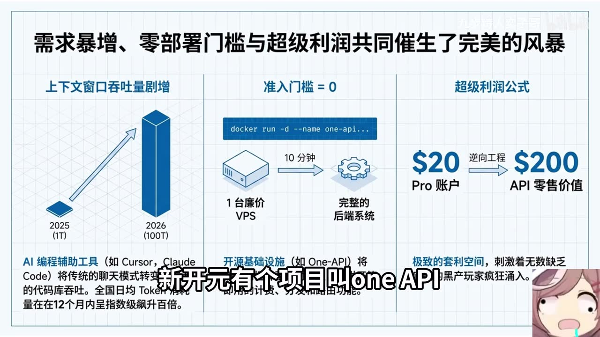
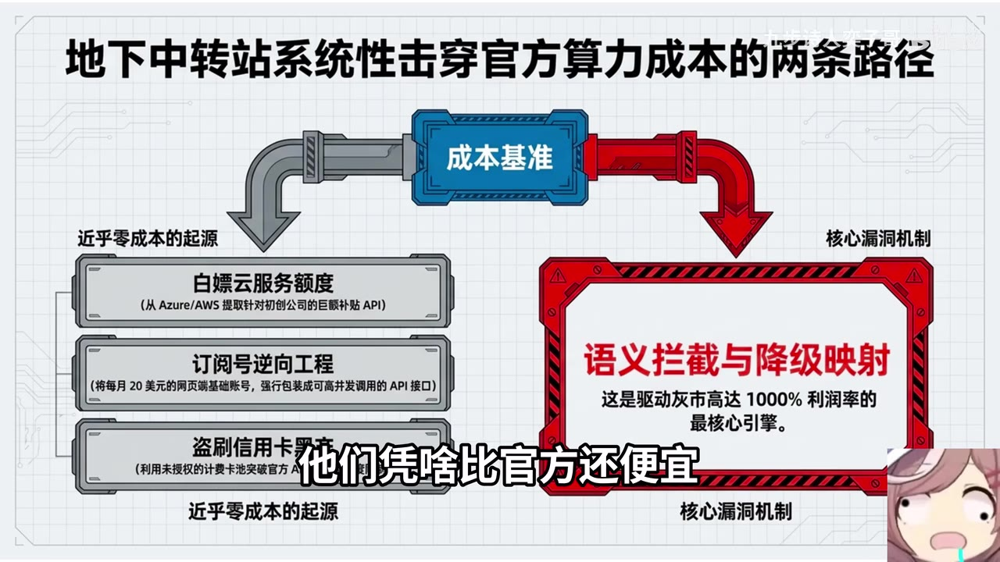

# API 中转站为啥突然变多了

> 来源：[Bilibili 视频](https://www.bilibili.com/video/BV1gAVs6sEMP) 
> UP 主：九步诗人奕子哥｜发布时间：2026-05-28｜视频时长：05:15｜分辨率：3840×2160

## 小结

视频讨论了 2026 年初 API 中转站（聚合网关）突然增多的原因。作者将其定义为：开发者只需更换一个 `base_url` 和 API Key，便可通过统一接口调用多个全球大模型的服务形态。其表层价值是降低网络、支付和接口适配的使用摩擦。

作者提出爆发的三项条件：AI 编程提高了 Token 消耗需求；OneAPI 等开源项目降低了部署门槛；中转业务存在显著套利空间。视频特别强调，低价并不必然来自效率，可能来自免费云额度套利、网页订阅逆向封装、盗刷支付方式，或将用户请求暗中路由到更便宜模型的“掺水”。

核心判断是：这不是一个会自然“赢家通吃”的普通 SaaS 市场。按视频观点，若供给中夹杂灰产来源，规模越大越容易触发上游封控；加之用户切换成本低、分销返佣高、服务质量难以验证，市场会呈现小站频繁出现、供给碎片化且难以集中清场的状态。

对实践者而言，视频给出按场景区分的建议：国内 C 端产品应避免使用未经合规审核的中转；出海产品可以考虑 OpenRouter 等聚合服务，但应将价格溢价理解为可靠路由与服务质量的成本；个人自用若一定要使用中转，应偏向运营时间较长的服务并坚持小额、按需充值。

这是一则带有强烈观点色彩的市场分析。涉及“全国 Token 用量”“特定平台封控方式”“企业认证”“盈利规模”“违法性”等陈述，均主要来自视频口述和画面，素材中没有提供原始报告、监管文件或平台公告链接，因此应视作作者观点或待核验信息，而不宜直接作为已经独立证实的事实。视频发布时间为 2026 年 5 月，平台政策、模型价格、可用服务与合规要求均可能快速变化。

## 思维导图

## 目录

- [背景：API 中转站及其解决的问题](#背景api-中转站及其解决的问题)
- [爆发的三项驱动：需求、门槛与利润](#爆发的三项驱动需求门槛与利润)
- [低价的两条路径：灰产成本与模型掺水](#低价的两条路径灰产成本与模型掺水)
- [风险：合规、数据与服务质量](#风险合规数据与服务质量)
- [为何没有赢家通吃：碎片化市场逻辑](#为何没有赢家通吃碎片化市场逻辑)
- [2026 年初的触发因素与使用建议](#2026-年初的触发因素与使用建议)
- [关键帧索引](#关键帧索引)
- [结论与限制](#结论与限制)
- [字幕比对](#字幕比对)
- [评论分析](#评论分析)
- [处理记录](#处理记录)

## 背景：API 中转站及其解决的问题 [00:00](https://www.bilibili.com/video/BV1gAVs6sEMP?t=0)

视频开头提出观察：近几个月出现大量 API 中转站新玩家。作者口述举例包括傅盛的 “Easy Router”、孙宇晨相关的 “BAI”，以及特朗普家族相关的 “WorldClaw”；其中部分名称在 ASR 中存在明显误识别，画面可见名称为 **WorldClaw**。作者将此现象与 2024 年已出现的 OpenRouter 对比，并提出问题：为什么 2026 年初反而出现更多新参与者。

作者对“API 中转站”的解释可以拆成两层：

1. **对开发者的表面形式**：配置一个服务地址和一枚密钥。
2. **对调用链路的作用**：由中转层将请求转发给多个模型或模型供应商，使用者不必为每个上游分别重写接口适配逻辑。

视频认为，中转服务主要抹平三类摩擦：

- **网络访问摩擦**：帮助请求连接海外模型服务；
- **支付摩擦**：提供微信、支付宝等本地化充值方式；
- **接口摩擦**：将上游碎片化接口统一封装为相近的 API 格式，减少应用代码改造。

> 图：画面以“2026 API 中转站大爆发”为主标题，并用大量分散的网关/密钥图形表现供给扩张。它直观对应了视频要解释的核心问题：中转站为何在短期内大量涌现。

> 图：画面展示“开发者 → 多层网关 → 全球 AI 模型”的链路，并标出网络、防支付、碎片化等障碍。该图补足了口述中的技术结构：中转站本质上是处于调用方与模型方之间的网关层。

### 使用这一类服务时应理解的技术前提

视频所说的“统一接口、不用改代码”并不意味着所有服务完全无差异。实际调用中，模型名称、上下文长度、工具调用、流式输出、多模态输入、速率限制、错误码语义和内容安全策略都可能不同。视频没有展开这些兼容性细节，因此“无需改代码”应理解为作者对常见兼容接口的概括，不应视为绝对保证。

## 爆发的三项驱动：需求、门槛与利润 [00:39](https://www.bilibili.com/video/BV1gAVs6sEMP?t=39)

### 1. AI 编程带来的 Token 消耗增长 [00:39](https://www.bilibili.com/video/BV1gAVs6sEMP?t=39)

作者的第一项原因是需求增长。其逻辑是：AI 编程工具需要将项目代码、上下文和任务说明输入模型，单个程序员在重度使用时，一天可能消耗数百万 Token。

视频口述称，国家数据局曾披露全国每日 Token 消耗从 2025 年初约 1 万亿增长至年末约 100 万亿，约一年增长 100 倍。该数字在视频中作为需求增长论据出现，但当前素材未包含报告标题、原始出处或统计口径，尤其“Token”是否包含推理 Token、输入输出 Token、国内外模型、训练与推理等均未说明，需谨慎引用。

### 2. 开源基础设施压低了开站门槛 [00:57](https://www.bilibili.com/video/BV1gAVs6sEMP?t=57)

第二项原因是部署门槛下降。视频点名开源项目 **OneAPI**，并给出高度简化的开站路径：

1. 准备一台低价海外 VPS；
2. 使用 Docker 运行 OneAPI 一类项目；
3. 配置上游渠道、计费与充值功能；
4. 在约十分钟内获得一个可运行的中转服务。

视频用“会按回车键的人都能干”强调自动化部署带来的低门槛。这是一种修辞表达：实际生产部署仍涉及服务器安全、密钥管理、域名与证书、上游账号、计费一致性、风控、日志、隐私、支付和运维，远非一条命令即可安全完成。

### 3. 高利润预期吸引供给 [01:12](https://www.bilibili.com/video/BV1gAVs6sEMP?t=72)

第三项原因是利润空间。作者口述了“单月盈利上百万”的市场说法，并以一个每月 200 美元的 “Claude Code Max” 账号可被拆分成数千美元 API 零售价值为例，说明套利诱因。

这一案例的关键不是它是否普遍成立，而是视频揭示的结构性矛盾：若中转价格低于官方价格，其成本优势必须来自规模采购、补贴、不同产品形态的价格差、违规使用规则，或服务质量上的隐性缩水。视频接下来将答案归纳为“成本接近零”和“掺水”两类路径。

> 图：画面将原因分为“上下文窗口吞吐量剧增”“准入门槛 = 0”“超级利润公式”三栏，展示 OneAPI 的 Docker 部署示意和 20 美元账号对应更高 API 零售价值的叙事。这是全片因果框架最集中的一张图。

## 低价的两条路径：灰产成本与模型掺水 [01:25](https://www.bilibili.com/video/BV1gAVs6sEMP?t=85)

### 路径一：将上游获取成本压至接近零 [01:25](https://www.bilibili.com/video/BV1gAVs6sEMP?t=85)

视频列举了几种作者认定的低成本来源：

- 利用云厂商面向初创公司的免费额度；
- 批量注册空壳公司以获取补贴额度；
- 购买低价网页订阅，再逆向或包装为 API 对外出售；
- 使用盗刷信用卡支付上游成本。

最后一项显然涉及违法犯罪，前几项是否违规取决于具体服务条款、注册主体真实性、授权范围与所在地法律。视频将这些共同归入“灰产”逻辑，但没有列举具体服务商、账号、证据或案件，不能据此推断任何具体中转站一定采用了上述方式。

### 路径二：语义拦截与降级映射，即“掺水” [01:43](https://www.bilibili.com/video/BV1gAVs6sEMP?t=103)

作者所说的“掺水”，是指用户名义上请求某个高价模型，例如 **Claude Sonnet**，中转层却依据任务复杂度将请求悄然改路由到免费或廉价小模型。ASR 将该模型误识别为 “CloudSonnet”，此处依据上下文与画面术语校正为 Claude Sonnet。

从技术上看，路由系统确实可以基于以下信息做模型分发：

- 用户指定的模型名；
- 提示词长度和预计输出长度；
- 请求是否包含代码、图像、工具调用等特征；
- 延迟、配额与上游可用性；
- 任务复杂度分类结果。

但“智能路由”本身并不当然等于欺骗。关键界限在于：服务是否清楚披露路由规则、是否取得用户同意、是否在账单与响应元数据中准确标注实际执行模型，以及是否仍承诺了用户购买的模型能力。如果未经披露而调包，用户可能无法从一次输出中稳定判断实际模型，便会形成视频后文所说的质量信息不对称。

> 图：画面左侧列出云服务额度、订阅号逆向工程和盗刷信用卡等“近乎零成本来源”，右侧突出“语义拦截与降级映射”。它帮助区分视频对“低价”的两种解释：取得成本被异常压低，或交付能力被暗中降低。

## 风险：合规、数据与服务质量 [02:13](https://www.bilibili.com/video/BV1gAVs6sEMP?t=133)

视频在约 02:13 进入风险部分，主要提出三类问题。

### 1. 面向国内用户的合规风险

作者认为，即便经过多层中转，面向国内用户提供部分海外模型能力仍可能违规。该结论涉及不同模型的服务范围、跨境访问、数据处理、生成式 AI 服务备案以及具体业务主体的法律义务，不能仅凭“是否使用中转”一项做一概而论的法律判断。

对产品团队来说，更可操作的判断是：确认模型供应商是否允许目标地区使用；核查自身产品面向用户的服务主体、数据处理链路与内容治理义务；避免把“中转技术可用”误解为“产品合规”。

### 2. 数据出境与提示词泄露

作者强调提示词也是数据：请求穿过中转站后，可能被转发至海外上游，也可能被中转方记录或截留。对于企业代码、客户资料、个人信息、合同内容、密钥、财务数据和未公开研发信息，这一风险尤其突出。

视频进一步声称部分灰产中转站可能将数据用于模型训练。素材未提供证据证明特定服务如此操作，但风险控制上应假设：**任何不受信任的代理层都可能记录请求、响应和元数据**。因此，不应向来源不明的中转端点上传敏感数据、生产数据库片段、私有代码库或长期有效凭据。

### 3. 服务连续性与模型真实性

中转服务还可能面临：

- 上游账号被封，导致服务突然失效；
- 模型被静默降级；
- 速率、并发或上下文规格与宣传不符；
- 余额因运营方失联而无法使用或退款；
- API Key、IP、用户行为等元数据被记录；
- 中间人攻击或传输链路被篡改。

视频在 01:54 至 02:13 存在约 19.64 秒 ASR 空档；关键帧内容表明该段仍以“成本击穿官方”和“降级映射”主题进行视觉解释。由于没有可用的连续语音文本，本文不补写该段未被识别到的具体口述内容。

## 为何没有赢家通吃：碎片化市场逻辑 [02:31](https://www.bilibili.com/video/BV1gAVs6sEMP?t=151)

作者先提出常规 SaaS 的预期：产品同质、切换成本低、技术门槛低时，大资本通常可以通过投入、品牌、渠道和规模效应推动市场集中。视频称 OpenRouter 已是头部，月处理量达到 30 万亿 Token，并据此反问：为什么市场没有在 2024 年左右收敛到少数平台，反而越来越碎片化？

作者的回答是：此类市场在其观察中并非标准 SaaS，而更接近“黑市”。这是作者的概念判断，不是针对任何特定平台的法律定性。

### 做大反而更容易被封

视频的因果链如下：

1. 部分中转 API 被作者认为来自灰产或非正常账号来源；
2. 站点规模扩大后，请求更集中、行为模式更显著；
3. 上游模型厂商可能以秒级封控等方式处置异常账号；
4. 上游账号集体失效后，中转站无法履约；
5. 因而小型、分散、快速迁移的站点更容易在短期内存活。

这套逻辑解释的是灰色供给为何不会形成稳定巨头，不应套用于拥有合法授权、稳定上游合同和合规数据处理能力的正常聚合服务。

### 用户没有明显的迁移成本

作者认为用户替换 API 地址和密钥只需很短时间，因此没有强忠诚度。这里的“切换只需 5 秒”是口语化估计。实际迁移成本因项目而异：如果只使用 OpenAI 兼容的文本接口，改动可能很小；但若涉及模型提示词调优、评测集、工具调用、鉴权、账单、审计、私有网络与 SLA，切换成本会显著增加。

### 返佣加剧流量去中心化

视频称许多中转站提供约 **20%—50%** 的返佣，自媒体、UP 主和学生通过软文或推广链接分发用户，导致流量来源高度分散。这一比例是作者口述，未附服务名单或结算凭证。

### “柠檬市场”：好坏难辨时，劣质服务可能挤压优质服务

视频以“柠檬市场”概括最后一个机制：用户无法准确判断自己是否遭遇模型降级，于是低成本、低质量的供给可以用更低价格竞争，认真按承诺转发的服务反而难以维持价格。

这一概念来自信息不对称经济学。其成立需要一个关键条件：买方确实缺少识别真实质量的手段。对于 API 服务，评测集、响应中的模型标识、延迟特征、输出质量对比、供应商审计和合同承诺都可在一定程度上降低不透明度，但普通用户通常难以持续验证，这正是视频强调的现实痛点。

## 2026 年初的触发因素与使用建议 [03:40](https://www.bilibili.com/video/BV1gAVs6sEMP?t=220)

### 视频给出的“为何偏偏在 2026 年初”解释 [03:43](https://www.bilibili.com/video/BV1gAVs6sEMP?t=223)

作者称 OpenAI 与 Anthropic 同时加强了企业认证、资金穿透核查和 AI 指纹识别；此前的一批头部中转站因为规模较大而被集中清理，原有开发者需求随即由更分散的“游击队”式服务填补。

这是全片用于解释时间点的关键新闻性判断，但素材中没有平台公告、具体时间、认证规则或受影响服务名。应将它视为作者对市场变化的归因，若要用于业务决策，应另行查阅模型厂商当期服务条款、地区支持列表、企业认证政策与正式风控公告。

### 按使用场景的建议 [03:59](https://www.bilibili.com/video/BV1gAVs6sEMP?t=239)

| 使用场景 | 视频建议 | 应注意的限制 |
| --- | --- | --- |
| 国内 C 端产品 | “立刻停用”未经审核的中转；ASR 口述建议使用已通过审核的国内模型服务，如“DeepSeek、通义”等 | 是否“已通过审核”需按产品、版本、地区及当期监管状态单独核验；“立刻停用”是作者强建议，不是法律意见。 |
| 出海产品 | 使用 OpenRouter 等聚合服务；视频称多付约 5% 是为避免“掺水”付费；不要碰灰产 | 5% 为视频观点，未给出统一定价依据。仍需审核上游、隐私条款、数据驻留、模型可用区域与 SLA。 |
| 个人写代码自用 | 可以使用，但只选运营两年以上的“老字号”；按需充值 | 运营年限不能证明安全、合规或不会跑路，仅是作者的风险筛选条件。 |
| 充值策略 | 即使“充一千送一千”，也只充五十 | 核心是控制预付余额暴露，而非 50 元本身具有普适性。应按可承受损失设定上限。 |

### 可执行的风险控制步骤

基于视频建议，可整理为以下保守实践流程：

1. **先区分用途**：生产产品、企业内部研发、个人实验的风险容忍度不同，不能共用同一套决策。
2. **识别数据等级**：涉及个人信息、商业机密、私有代码、访问令牌或客户数据时，不应发送到未经审查的中转端点。
3. **核对实际模型**：检查服务文档、响应字段、账单明细与模型版本说明；使用固定评测题进行抽样对比。
4. **限制密钥权限**：为不同项目使用独立 Key；设置预算、速率和额度上限；不要把主账号高权限凭据交给不可信服务。
5. **采用小额预付**：按需充值，避免大额沉淀余额；保留支付与调用记录。
6. **建立供应商退出预案**：在代码中保留多个可替换的服务配置；避免业务逻辑绑定某一中转专有模型名。
7. **核验合规与条款**：查看上游模型服务地区限制、中转方隐私政策、数据保留规则、是否声明训练用途及是否提供企业协议。
8. **监控异常**：持续观察输出质量、延迟、错误率、模型版本、账单 Token 数与价格变化，发现异常路由时及时停用。

## 关键帧索引

| 关键帧 | 对应主题 | 正文使用价值 |
| --- | --- | --- |
|  | 2026 年中转站大爆发 | 概括视频提出的市场现象及“分散网关”意象。 |
|  | 网关穿透网络、支付与接口壁垒 | 解释中转站位于开发者和全球模型之间的技术位置。 |
|  | 需求、部署门槛、利润 | 集中呈现作者的三因素解释与 OneAPI 部署示意。 |
|  | 灰产成本、订阅逆向与降级映射 | 可视化视频对“为什么比官方便宜”的两条回答。 |

其余关键帧虽可获取，但给定素材未提供逐帧时间戳和画面说明；为避免把未核实的帧内容强行对应到具体口述时间，本文仅选取上述与正文主题明确匹配的画面。

## 结论与限制 [04:26](https://www.bilibili.com/video/BV1gAVs6sEMP?t=266)

视频结尾最重要的可迁移观点是：不要仅用传统 SaaS 的“同质化、低门槛、赢家通吃”框架解释所有市场。若一个市场同时具有上游封控风险、供给来源不透明、低切换成本、强分销激励和难以验证的质量，那么它可能长期维持碎片化，而不是自然集中。

作者在 04:57 后总结：面对“同质化却不集中、门槛低却没清场、卷价格却卷不死”的反常识市场，应先问它实际运行的是哪套规则。该段前存在约 23.48 秒 ASR 空档（04:33—04:57），因此本文不虚构空档中的口述内容，仅记录识别到的结论。

需要保留以下限制：

- **事实来源限制**：视频未提供其关键数字、平台政策变化、封控案例、盈利案例和违法指控的原始引用。
- **术语范围限制**：“API 中转站”覆盖合规聚合、兼容网关、企业代理和灰色转售等不同形态，不能将所有中转服务等同于灰产。
- **法律判断限制**：跨境数据、生成式 AI 服务和支付规则受司法辖区、业务主体、数据类型与服务条款影响，应由专业合规人员按实际链路评估。
- **时效性限制**：本视频发布于 2026 年 5 月；模型价格、供应商政策、区域开放、认证要求、可用接口和服务存续情况均可能已变化。
- **技术验证限制**：是否发生模型“掺水”不能仅凭单轮回答判断，需要可重复测试、模型响应证据、性能基线和服务方披露共同验证。

## 字幕比对

| 字幕来源 | 完整性 | 专有名词 | 时间轴 | 主要问题 |
| --- | --- | --- | --- | --- |
| Bilibili 站内字幕 `p01-ai-zh.srt` | 严重不完整且内容不匹配，仅 00:00—00:53 | 不适用 | 时间轴格式有效，但对应的是“脱口秀演员称呼 29 岁女性为大姐”的另一段内容 | 与本视频标题、画面和音频完全无关，属于错配字幕，不能采用。 |
| 本次 ASR 字幕 | 覆盖约 263.96 秒语音，语音覆盖率 83.96%；有两处较大空档 | 多处误识别，如“中转战”“CloudSonnet”“World Club”“SSA”“GDPRE”等 | 45 个真实时间段，可用于章节链接 | 语句断词、专有名词误识别较多；01:54—02:13 与 04:33—04:57 有明显空档。 |

### 最终字幕选择与校正原则

最终以**本次 ASR 的真实时间轴**为主，因为站内字幕与实际视频内容完全错配；再以关键帧中的可见文字和语境对少数术语进行有限校正。

本次 ASR 诊断显示音频语言为中文、语言置信度约 0.9902、音频时长约 314.375 秒，且存在有效语音片段；`asr-result.json` 未标记 `noAudioStream=true`，因此源视频**有音轨**，并非无音轨素材。

已进行的谨慎校正包括：

- `API中转战 / 中轢战` → **API 中转站**；
- `Open Router` → **OpenRouter**；
- `CloudSonnet` → **Claude Sonnet**，依据上下文中的模型路由讨论；
- `World Club` → **WorldClaw**，依据开场关键帧中的可见文字；
- `OneAPI`、Docker、Token、OpenAI、Anthropic、DeepSeek、通义等保留原有或通行写法。

未能可靠确认的 ASR 词语，例如 “BAI” 的具体全称、“SSA”“Sysys”“GDPRE”等，不将其扩展为确定含义。文中相应位置以“ASR 误识别”或作者口述概念处理，避免编造。

## 评论分析

以下仅分析当前可获取的热评前三条；评论反映的是观众观点，不构成已核验事实。

1. **红莲之忆（10 赞）**  
   评论称自己使用的“最便宜倍率都 0.08”，并认为中转业务“利润空间大、无中生有”。这与视频“高套利空间推动站点增长”的论点一致。  
   但“0.08”的计价单位、模型、渠道、时间和对比基准均未说明，无法据此量化行业利润率；“无中生有”是情绪化评价。

2. **洋芋考拉（7 赞）**  
   评论补充“还有中间人攻击”。这一提醒具有技术相关性：API 中转确实在客户端与上游模型之间增加了一个可观察、转发甚至篡改流量的节点。  
   不过，是否存在中间人攻击取决于 TLS 配置、证书校验、客户端实现、服务端安全措施与攻击者能力；不能从“使用中转”直接推断已经遭受攻击。它更适合作为应进行 HTTPS、证书、密钥和供应商安全审查的提醒。

3. **就是狂徒张三（2 赞）**  
   评论建议“自己用，自己搭就完了”。自建网关确实可以减少将密钥和请求交给第三方中转方的风险，并增强路由与日志的可控性。  
   但自建不自动解决上游地区限制、账号授权、数据出境、服务器安全、成本、运维和合规问题；如果上游来源或使用方式不合规，自建也不能消除根本风险。

## 处理记录

- Worker ID：`worker-mrj0wbly-5dc4e50c`
- 调用模型：`gpt-5.6-terra`
- 使用的素材与工具结果：Bilibili 视频元数据、站内 SRT `p01-ai-zh.srt`、本次 ASR 结果 `asr/asr-result.json`、ASR SRT `asr/transcript.srt`、关键帧目录 `frames/`、热评文件 `comments/comments.json`。
- 字幕选择：检查了站内字幕与本次 ASR。站内 SRT 内容错配且仅覆盖前 53 秒，弃用；采用本次 ASR 的时间戳作为章节定位依据，并通过关键帧和上下文对明确可校正的术语做有限修正。
- 关键帧选择依据：选用 `frame-001` 至 `frame-004`，因为其可见标题分别对应开场市场现象、网关技术结构、三项爆发驱动与低价机制；未对缺少逐帧时间戳说明的其他帧作未经证实的内容归属。
- 时间轴依据：所有章节链接的秒数均来自 ASR 的实际起始时间；未按文字顺序猜测时间位置。
- 缓存清理：未提供缓存清理工具执行日志；本记录不宣称已执行缓存删除。
- 未解决问题：视频中大量市场数据、政策变化、平台封控与具体服务名称缺乏原始出处；ASR 在 01:54—02:13、04:33—04:57 存在空档，且部分专有名词无法从现有素材可靠复原。
