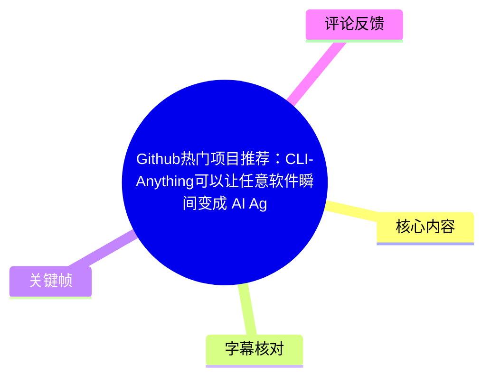
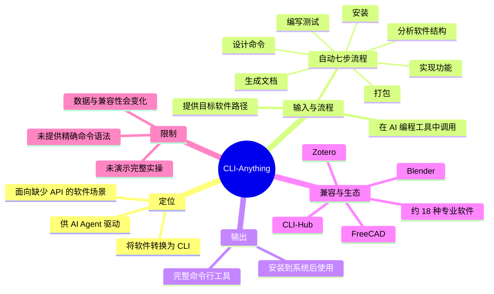
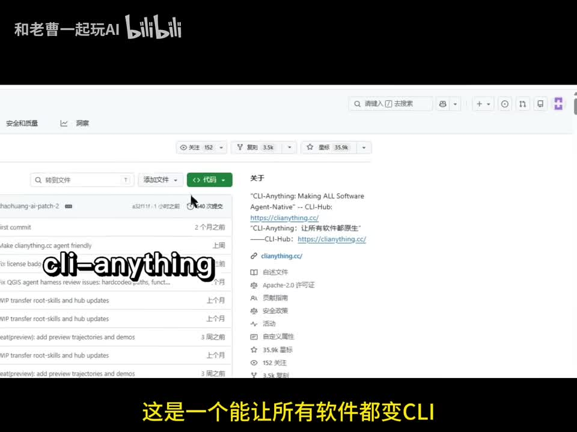
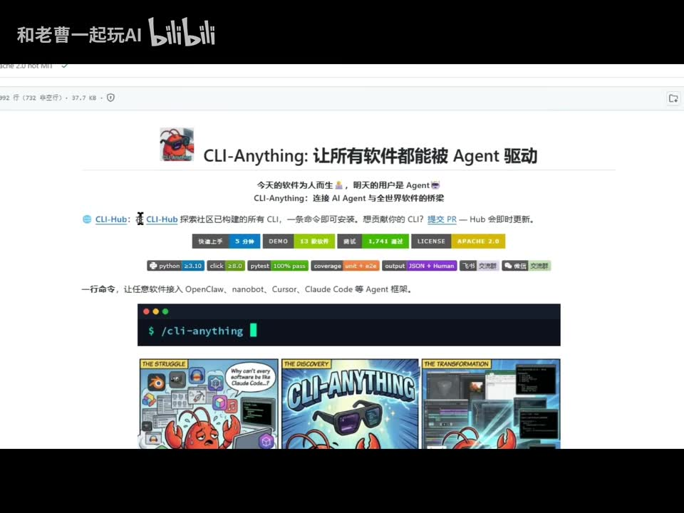
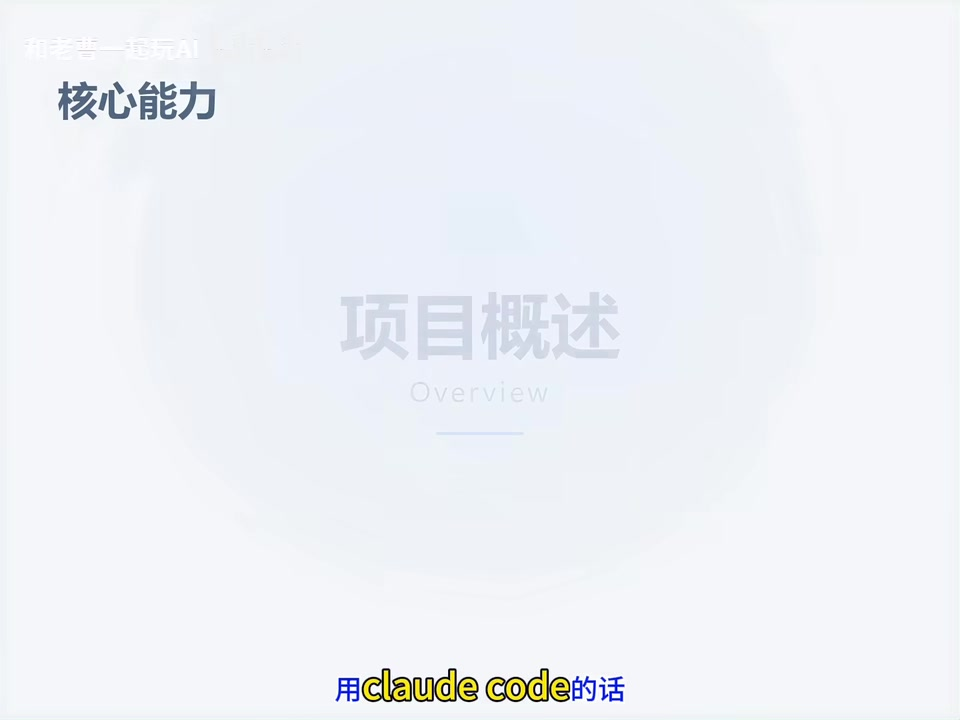

# Github热门项目推荐：CLI-Anything可以让任意软件瞬间变成 AI Agent 可控制的命令行工具

> 来源：[Bilibili 视频](https://www.bilibili.com/video/BV1MDLq6ZEeZ)  
> UP 主：和老曹一起玩AI｜视频时长：01:02｜合集：AIcode  
> 数据抓取时间：2026-07-16；视频中的 Star 数、支持软件数量及兼容平台均具有时效性。

## 小结

视频推荐开源项目 **CLI-Anything**。根据视频陈述，它的定位是将软件转换为可由 AI Agent 调用的命令行工具（CLI），从而让原本主要依赖图形界面、或缺少 API 的软件获得可被 Agent 编排和操作的接口。

视频给出的核心方法是：在 AI 编程工具中输入一条 `cli-anything` 相关命令，并提供目标软件路径；工具会自动完成软件结构分析、命令架构设计、功能实现、测试、文档生成、打包和安装共七个环节，最终生成可安装到系统中的 CLI。视频未展示实际运行终端输出，因此该流程应理解为项目宣称的工作方式，而非本视频中完成验证的实操演示。

项目热度方面，视频口播称 Star “突破 3.5 万还在涨”；关键帧中的项目介绍页显示 **35.9k GitHub Stars、3,498 Forks**。这些数值是画面/视频制作时的快照，不应当作当前实时数据。

兼容性方面，视频口播明确列举 Blender、FreeCAD、Zotero，并称已支持约 18 种专业软件；视频元数据说明还列有 Kdenlive、Godot，覆盖 3D 建模、视频剪辑、文献管理和游戏开发等领域。不过，视频没有逐项给出全部 18 种软件名单、版本范围、操作系统要求、命令参数、生成质量指标或失败处理策略。

该项目适合希望让 AI 编程 Agent 接入桌面专业软件的开发者、自动化工作流设计者及工具链维护者。应注意：**“没有 API”不等于一定可以稳定、完整地自动化**；生成出的 CLI 是否覆盖目标功能、是否安全可靠，以及是否适配具体软件版本，都需要在本地环境中测试和审查。

## 思维导图





## 目录

- [项目背景：让软件成为 Agent 可调用的 CLI](#项目背景让软件成为-agent-可调用的-cli)
- [项目热度、来源与支持范围](#项目热度来源与支持范围)
- [七步自动生成 CLI 的流程](#七步自动生成-cli-的流程)
- [使用方式与平台信息](#使用方式与平台信息)
- [痛点、适用场景与限制](#痛点适用场景与限制)
- [关键帧索引](#关键帧索引)
- [字幕比对](#字幕比对)
- [评论分析](#评论分析)
- [处理记录](#处理记录)

## [项目背景：让软件成为 Agent 可调用的 CLI](https://www.bilibili.com/video/BV1MDLq6ZEeZ?t=0)

视频开头将 CLI-Anything 定义为“能让所有软件都变 CLI 的开源工具”，并称其目标是让软件能够被 Agent 驱动。这里的 **CLI（Command Line Interface）** 指从终端以命令和参数调用功能的接口；若 AI Agent 能稳定调用此类接口，便可将软件操作纳入自动化任务链。

视频的关键问题是：AI 编程工具能力增强，但“很多软件没有 API”。在视频的叙事中，CLI-Anything 试图在 AI Agent 与传统专业软件之间建立一层命令行接口，使 Agent 不必只能依赖软件原生 API。



> 图：画面展示 CLI-Anything 的 GitHub 页面及视频的核心结论字幕。它直接对应视频对项目定位的概括，也能说明该内容以开源项目推荐为主，而非完整部署教程。

需要区分两个层次：

- **视频陈述**：CLI-Anything 能让任意软件变成 Agent 可控的命令行工具。
- **实际验证要求**：不同软件的架构、权限体系、插件机制和版本差异不同；是否能覆盖“任意软件”的所有功能，不能仅由本视频的概述确认。

## [项目热度、来源与支持范围](https://www.bilibili.com/video/BV1MDLq6ZEeZ?t=7)

### 热度与来源

视频在 00:07—00:14 称项目 Star 突破 3.5 万、仍在增长，且来自香港大学团队。关键帧标题页呈现“香港大学·开源 AI 工具”，并显示 **35.9k GitHub Stars / 3,498 Forks**。


> 图：画面以标题卡形式汇总项目名称、定位、来源和当时的 Stars/Forks 数据，适合作为“视频中数据快照”的依据。Star 和 Fork 会随时间变化，不能据此推断当前实时数值。

### 支持的软件与生态

视频口播在 00:25—00:30 明确提到：

- Blender；
- FreeCAD；
- Zotero；
- “类似这些”共约 18 种专业软件。

视频元数据补充称已支持 Kdenlive、Godot 等，覆盖的方向包括：

| 方向 | 视频素材中出现的软件示例 |
| --- | --- |
| 3D 建模 | Blender、FreeCAD |
| 视频剪辑 | Kdenlive（来自视频元数据说明） |
| 文献管理 | Zotero |
| 游戏开发 | Godot（来自视频元数据说明） |

关键帧中的项目页面还出现 **CLI-Hub** 的介绍：该页面文字称可探索社区构建的 CLI，并以“一条命令即可安装”的方式使用。视频元数据同样称 CLI-Hub 支持 Agent 自主发现和安装社区贡献的 CLI、无需人工干预；但这段细节并未在本视频口播中展开演示，应视作元数据与项目页画面提供的补充，而非视频已验证的端到端过程。



> 图：该画面展示“CLI-Anything：让所有软件都能被 Agent 驱动”的项目介绍页，并可见 CLI-Hub、技术标签及命令入口。其价值在于补充视频口播未展开的社区 CLI 发现/安装生态信息。

## [七步自动生成 CLI 的流程](https://www.bilibili.com/video/BV1MDLq6ZEeZ?t=16)

视频在 00:16—00:25 和 00:30—00:39 两次描述自动化流程。按口播顺序，输入一条命令后，内部会依次完成以下七步：

1. **分析软件结构**：识别或梳理目标软件的结构。
2. **设计命令**：规划 CLI 的命令架构。
3. **实现功能**：实现命令对应的软件操作能力。
4. **编写测试**：为生成的能力编写测试。
5. **生成文档**：输出使用说明。
6. **打包**：将结果组织为可分发/安装的产物。
7. **安装**：安装后作为系统中的命令行工具使用。

视频将这一过程概括为“内部自动跑七步流程”，最终“输出一个完整的命令行工具，装到系统里就能用”。



> 图：画面处于“核心能力—项目概述”的章节转场，并配有“用 Claude Code 的话”的字幕。它表明后续内容从项目定位转入调用方式和自动化能力说明。

### 流程的输入、处理与输出

| 环节 | 视频明确说明 | 视频未说明、需要自行验证的内容 |
| --- | --- | --- |
| 输入 | 在 AI 编程工具中输入 CLI-Anything 命令；后段提到还需加软件路径 | 完整命令格式、必填参数、路径格式、权限要求 |
| 处理 | 自动完成七步流程 | 如何分析不同软件、调用何种内部接口、失败时如何恢复 |
| 输出 | 完整 CLI；安装到系统后使用 | 生成目录、安装方式、命令清单、测试覆盖率及兼容性保证 |
| 使用 | 可由主流 AI 编程平台使用 | 各平台的安装插件步骤、认证配置与版本要求 |

因此，视频提供的是高层工作流而不是可复制的完整命令教程。尤其不能把站内字幕中误识别出的 `CRI` 当作实际术语：结合项目名称、上下文和关键帧，应统一理解为 **CLI**。

## [使用方式与平台信息](https://www.bilibili.com/video/BV1MDLq6ZEeZ?t=39)

视频在 00:39—00:50 说明其支持若干主流 AI 编程平台。站内字幕写作“Cloud code、Open cloud”，但关键帧项目页能读到的平台名称为：

- **Claude Code**
- **OpenClaw**
- Cursor
- nanobot

其中，口播/字幕的 “Cloud code” 应校正为 **Claude Code**；“Open cloud”与画面中 **OpenClaw** 不一致，正文以关键帧可见拼写 `OpenClaw` 记录，并保留口播转写存在误差这一事实。

### 视频给出的操作顺序

1. 安装相应插件。
2. 输入 `cli-anything` 加“软件路径”。
3. 工具自动生成一套完整 CLI。
4. 安装后直接使用。

视频没有给出可安全复制执行的完整命令行。例如，关键帧仅展示类似：

```text
/cli-anything
```

该画面不足以确认真实参数形式、是否需要斜杠前缀、目标路径如何传入，以及命令是否需在特定 Agent 工具内执行。因而应将下述内容视作**视频层面的抽象调用格式**，而非官方命令：

```text
cli-anything + <软件路径>
```

实践时应以项目当前文档为准，并建议先在隔离环境中对非生产项目测试生成的 CLI、检查生成代码和可执行命令的权限边界。

## [痛点、适用场景与限制](https://www.bilibili.com/video/BV1MDLq6ZEeZ?t=50)

视频在 00:50—00:57 总结其解决的痛点：AI 编程工具越来越强，但许多软件没有 API。其可迁移的思路不是“让 Agent 无条件操纵所有软件”，而是尝试将软件能力包装成更容易被程序和 Agent 调用的命令行边界。

### 可能适用的任务

结合视频列举的软件类别，较适合探索以下方向：

- 让 Agent 通过命令触发建模、工程设计类软件的重复操作；
- 将视频剪辑、资产处理等操作接入脚本化流程；
- 将文献管理软件的一部分操作纳入研究/整理 Agent；
- 为游戏开发工具构建可被自动化任务链调用的接口。

这些是根据视频所列领域作出的应用归纳，并非视频展示过的成功案例或功能承诺。

### 关键限制与风险

1. **未展示端到端运行**：视频没有呈现从插件安装、输入实际命令、生成 CLI 到执行软件操作的完整屏幕录制。
2. **命令细节不足**：没有提供可验证的完整命令、参数表、安装步骤和错误处理方案。
3. **“任意软件”需谨慎理解**：视频使用了“任意软件”“所有软件”等宣传性表述，但实际兼容性仍取决于具体软件、版本、运行环境和可访问接口。
4. **生成代码需要审查**：自动生成的 CLI 可能包含文件访问、软件控制或系统安装行为。投入生产前应审查代码、测试权限和回滚方式。
5. **数据存在时效性**：Star/Fork 数、支持软件数量、平台名称与插件兼容性都会变化。视频记录的是发布前后的阶段性状态。
6. **无 API 的软件并非没有约束**：缺少正式 API 时，自动化可能依赖插件、脚本、界面控制或其他桥接方式；其稳定性、可维护性和授权条件需另行确认。

## 关键帧索引

| 关键帧 | 正文用途 | 画面价值 |
| --- | --- | --- |
|  | 项目定位 | GitHub 页面与“让所有软件都变 CLI”的字幕同时出现，直观对应视频开场主张。 |
|  | 项目页、CLI-Hub 与生态 | 显示项目介绍、CLI-Hub、技术标签和命令入口，补充口播未展开的信息。 |
|  | 热度与来源 | 显示“香港大学·开源 AI 工具”及 35.9k Stars、3,498 Forks 的画面快照。 |
|  | 核心能力转场 | 标示视频进入“项目概述/核心能力”，并保留 Claude Code 相关字幕线索。 |

## 字幕比对

| 字幕来源 | 完整性 | 专有名词 | 时间轴 | 主要问题 |
| --- | --- | --- | --- | --- |
| Bilibili 站内字幕 | 高，覆盖 00:00.040—01:00.200，分段完整 | 存在识别误差，如“A阵”“free cid”“so tero”“Cloud code”“Open cloud”“CRI” | 高，可用的细粒度真实时间段 | 多处英文名和 CLI 被误写，但语义与段落边界基本完整 |
| 本次 ASR 字幕 | 较低，3 个大段覆盖 00:26.900—00:56.480 | 误差较多，如“软体”“软建”“Free C ID”“命定行”“AI缨程工区” | 较弱；首段把此前大量内容压缩到 00:26.900—00:27.460 | 分段极度聚合，首个语义内容实际对应开场却被标在 26.9 秒，不适合精确定位 |

### 最终字幕选择

正文以 **Bilibili 站内字幕** 作为主时间轴依据，因为其时间段细、覆盖接近全片，能可靠定位章节。已按 ASR 结果完成比对，但没有采用 ASR 的时间戳进行章节定位：ASR 虽然诊断为存在音频、语言为中文（置信度约 0.997），却仅产生 3 个超长片段，且首段时间与内容明显错位。

通过站内字幕、ASR 上下文及关键帧画面综合校正的关键术语如下：

| 原始转写 | 正文采用写法 | 校正依据 |
| --- | --- | --- |
| C li anything / CLI Anything | CLI-Anything | 标题、项目页画面与元数据一致 |
| A阵 | AI Agent | 视频标题、口播上下文及标题页 |
| free cid / Free C ID | FreeCAD | 视频口播上下文与软件名称 |
| so tero / IDSotero | Zotero | 视频口播上下文与软件名称 |
| Cloud code | Claude Code | 关键帧项目页可见名称 |
| Open cloud | OpenClaw | 关键帧项目页可见名称 |
| CRI | CLI | 全文主题、项目名与命令行工具语境一致 |

ASR 诊断中**没有** `noAudioStream=true` 标记；相反，素材提供了音频文件并识别出中文语音。因此，本视频并非无音轨来源，ASR 的主要问题是分段和专有名词识别质量，而不是音轨缺失。

## 评论分析

以下仅处理可获取的热评前三条。评论反映的是观众观点或需求，不构成对项目能力的验证。

### 1. s0m1ng：关注无 MCP 软件的可用性

> “真的假的？那些没兼容mcp的软件岂不是都可以用了？”（9 赞）

这条评论将 CLI-Anything 与 MCP（Model Context Protocol）兼容性联系起来，表达了对“未兼容 MCP 的软件是否也能接入 Agent”的期待。视频确实强调了“很多软件没有 API”的痛点，但没有直接说明 MCP 协议支持、MCP Server 生成能力或与 MCP 客户端的具体集成方式。因此，不能从视频推出“所有未兼容 MCP 的软件都可直接使用”的结论。

### 2. 华尔兹和赵欠抽：提出 Windows CLI 化测试诉求

> “真这么牛就cli windows”（8 赞）

该评论以 Windows 为例质疑“任意软件”叙述的边界，实质上要求以复杂、系统级目标验证项目能力。视频没有演示针对 Windows 系统本身生成 CLI，也未说明操作系统级自动化、管理员权限、安全策略或系统调用限制。因此，这是一项合理的验证诉求，但没有被现有视频素材证实。

### 3. 666-怀济-666：要求 Agent 邮件分发与深度拆解

该评论内容是一段面向 `@MilkyAi` 的复杂任务指令，要求把视频发送到邮件，并对视频内容进行原子化任务拆解、核心对象分析、更新渠道、集成方式及业务价值评估。

它没有提供 CLI-Anything 的新事实，也没有就项目能力提出可验证的技术证据；其价值主要在于反映出用户希望由 Agent 承担“内容整理—结构化分析—邮件分发”的自动化需求。评论中要求的“更新/获取方式”“兼容工具”等信息均未在本视频中完整给出，不能据此补全为项目事实。

## 处理记录

- **Worker ID**：worker-mrj0wbly-5dc4e50c
- **模型**：gpt-5.6-terra
- **字幕/语音模型信息**：本次 ASR 使用 `medium`，语言识别为 `zh`，`languageProbability` 为 `0.9970703125`，CUDA / float16。
- **使用的素材与工具结果**：检查视频元数据、站内 SRT（`p01-ai-zh.srt`）、本次 ASR 结果（`asr/asr-result.json`）、ASR SRT、12 个关键帧路径清单及可获取热评前三条；未新增外部检索或未提供的命令执行结果。
- **字幕选择**：采用站内字幕作为正文时间轴主依据；本次 ASR 已检查但因仅有 3 个聚合片段、首段时间与开场语义错位，未用于精确章节定位。ASR 未标记 `noAudioStream=true`。
- **关键帧选择依据**：选用 `frame-001` 至 `frame-004`，分别支撑项目定位、项目页/CLI-Hub、热度与来源、核心能力转场；其余关键帧未在已提供画面内容中获得可核实的独特信息，未强行引用。
- **缓存清理**：素材中未提供缓存清理执行日志或结果；本记录不虚构清理状态。
- **未解决问题**：未提供项目仓库链接、完整官方命令语法、全部 18 种支持软件清单、平台/系统版本要求、端到端运行录屏及生成 CLI 的实际测试结果；这些内容需以项目当前官方文档和本地测试为准。
