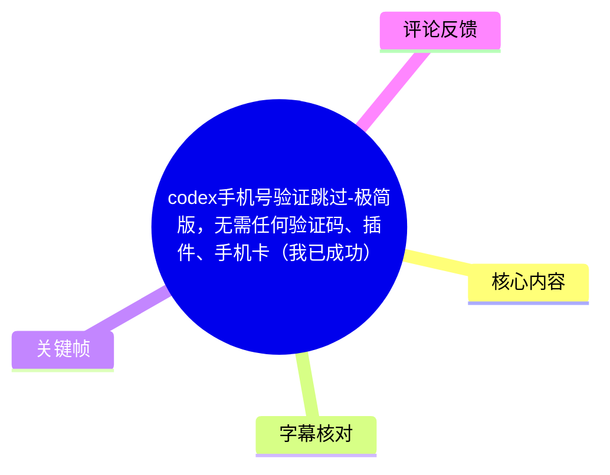
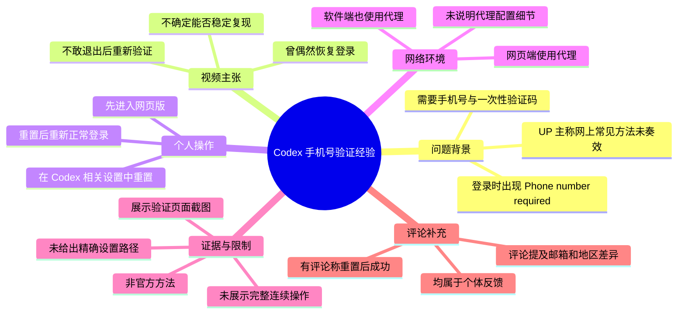
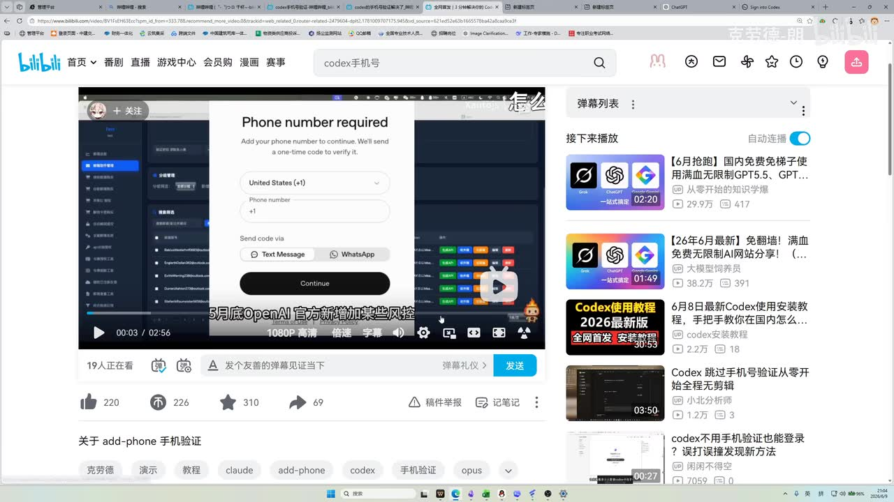
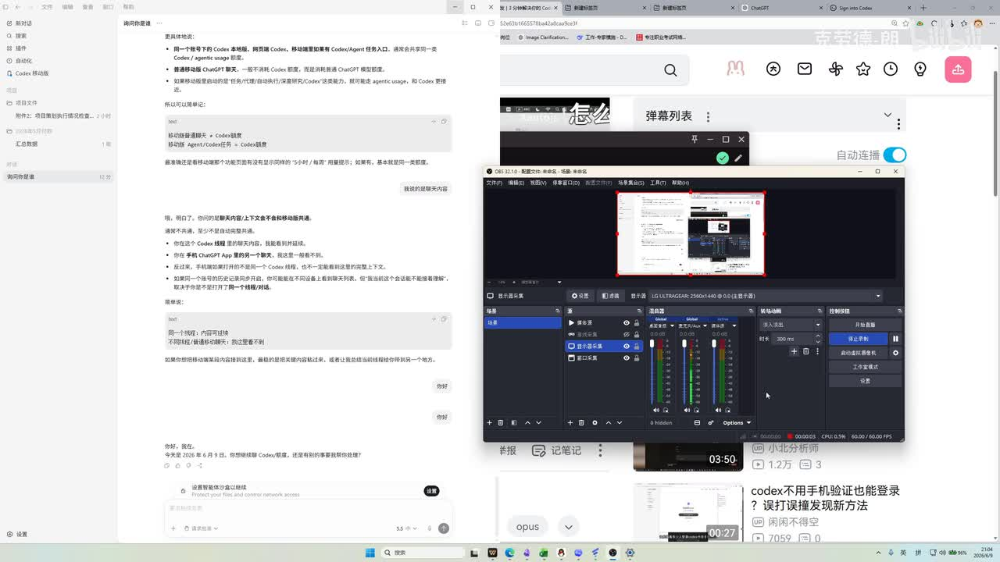

# codex手机号验证跳过-极简版，无需任何验证码、插件、手机卡（我已成功）

> 来源：[Bilibili 视频](https://www.bilibili.com/video/BV1fuEm6jEaY)  
> UP 主：克劳德-朗｜发布时间：2026-06-09｜视频时长：01:27｜分辨率：2560×1440  
> 视频简介：UP 主称自己是“无意间登录上”的，分享一次个人操作，但明确表示不确定其他人是否也能复现。

## 小结

视频讨论的是：用户在登录 Codex 时遇到“需要手机号”的验证页面后，UP 主偶然恢复登录的一次个人经历。画面中可见英文提示 **“Phone number required”**，要求添加手机号并接收一次性验证码，验证方式包括短信与 WhatsApp。

UP 主的核心说法并非提供验证码、插件或手机号，而是：先在网页版进入与 Codex 相关的设置并执行“重置”，随后重新进行正常登录；同时，其网页端与软件端均处于使用网络代理的环境。UP 主称自己在该环境下成功登录，但没有退出后再次验证，因此未完成严格的可重复性测试。

这是一个经验分享，而不是官方流程、功能公告或可验证的通用技术方案。视频没有展示重置按钮的精确路径、重置对象的完整名称、账户状态变化细节，也没有展示从触发手机号验证到成功进入 Codex 的连续无剪辑操作。因此，“重置后即可跳过验证”不能被视为确定结论。

从账号安全与合规角度看，手机号验证属于平台的访问控制与风险管理机制。应优先遵循 Codex/OpenAI 的官方支持渠道、地区可用性要求及账户条款，不应将本视频理解为规避身份验证的可靠或长期方法。

该信息具有明显时效性：视频发布于 2026-06-09，登录策略、地区限制、风控阈值、网页版界面与客户端行为都可能已变化。视频抓取时的站内数据为 20,318 播放、305 收藏、77 分享、94 回复；这些互动数据仅反映抓取时的页面状态，不证明方法普遍有效。

## 思维导图





## 目录

- [问题背景：手机号验证页面与视频定位](#问题背景手机号验证页面与视频定位)
- [UP 主的成功声明与证据边界](#up-主的成功声明与证据边界)
- [视频中的个人操作顺序](#视频中的个人操作顺序)
- [网络环境与关键参数缺失](#网络环境与关键参数缺失)
- [关键帧解读](#关键帧解读)
- [结论、风险与时效性](#结论风险与时效性)
- [字幕比对](#字幕比对)
- [评论分析](#评论分析)
- [处理记录](#处理记录)

## 问题背景：手机号验证页面与视频定位 [00:00:00](https://www.bilibili.com/video/BV1fuEm6jEaY?t=0.27)

UP 主开场称，可能有不少人与自己一样，被 Codex 的手机号验证“整了好久都没整完成”。这说明视频的目标受众是已经在登录流程中触发手机号验证、且未能继续完成登录的用户。

视频提供的关键画面显示，页面标题为 **“Phone number required”**，页面文字为“Add your phone number to continue. We'll send a one-time code to verify it.”，即要求用户添加手机号，并通过一次性验证码完成验证。界面包含：

- 国家/地区代码下拉项，画面中显示为 `United States (+1)`；
- 电话号码输入框；
- 验证码发送方式：`Text Message` 与 `WhatsApp`；
- `Continue` 按钮。



> 图：该关键帧直接呈现视频所说的受阻页面：系统要求手机号及一次性验证码。这是理解问题对象的最有价值画面，但它仅证明视频录制时存在该验证界面，不能单独证明任何“跳过”结果。

需要区分的是：视频标题使用了“跳过”一词，但视频口述实际描述的是一次“重置后重新登录成功”的个人现象；其并未展示对验证机制的技术破解，也未说明平台是否主动取消了该账户的验证要求。

## UP 主的成功声明与证据边界 [00:00:10](https://www.bilibili.com/video/BV1fuEm6jEaY?t=10.77)

UP 主称，自己此前在网上找过不少相关视频，但“都不行”，且都遇到了类似的手机号验证界面。之后，UP 主表示自己“无意间又登录上去了”，并以当前仍处于登录状态作为结果展示。

但 UP 主同时明确给出了重要保留：

1. **不确定方法是否有效。**  
   其原话是“不确定我的方法是不是有效”，因此不能将其描述为经验证的解决方案。

2. **没有进行退出后的重复测试。**  
   UP 主称自己不太敢退出登录后重新尝试验证。这意味着视频未验证该操作是否稳定、是否只对某个会话有效，或是否受到既有登录态影响。

3. **没有给出完整复现证据。**  
   视频没有展示账号初始状态、重置前后的完整设置页、浏览器与软件的具体版本、网络出口信息、成功后的 Codex 功能页面，也没有说明是否存在其他未提及的账户条件。



> 图：该帧显示桌面录屏环境，浏览器中打开了网页，前景可见 OBS 录制窗口。它说明视频是通过屏幕录制展示个人环境，而非官方文档或可审计的完整操作记录；画面中没有足以确认成功链路的连续证据。

因此，视频最可靠的信息是“UP 主在某一次个人环境中观察到重置后恢复登录”；不能进一步推导为所有账户、地区、邮箱或网络环境均可免除手机号验证。

## 视频中的个人操作顺序 [00:00:35](https://www.bilibili.com/video/BV1fuEm6jEaY?t=35.61)

UP 主在此段开始说明其操作。依据 ASR 的原始时间轴，能确认的顺序如下：

1. **先登录网页版。**  
   UP 主表述为“我是先登陆到网页版的……上去之后”。ASR 在此处将后续词识别为“登际”，语义不完整；结合上下文，仅能确认其先进入了网页版，不能据此补充具体站点、浏览器页面或登录入口。

2. **进入设置。**  
   UP 主称“去设置里面”，但没有在可用素材中给出设置菜单的逐级路径。

3. **在 Codex 相关设置中执行重置。**  
   原口述为“把这个 Codex 的设置里面去给它重置了”。视频未明确“重置”的对象究竟是 Codex 配置、登录状态、应用数据还是其他项目，也未展示确认对话框或重置范围。

4. **重置完成后重新正常登录。**  
   UP 主称重置完成后，“再去整一个像这样……去正常登录，然后就可以登录上了”。这只能视为其个人观察结果，不构成因果验证。

为避免把不完整信息包装成可操作的规避流程，以下仅保留视频中明确出现的经验链路，而不补充未展示的菜单路径、账户操作细节或验证规避技巧：

```text
网页版登录
  → 进入 Codex 相关设置
  → 执行 UP 主所称的“重置”
  → 重置完成
  → 再次正常登录
  → UP 主称其个人环境中登录成功
```

这里的“正常登录”并不等于平台保证不会再次要求验证。UP 主自己也承认没有退出并重复测试。

## 网络环境与关键参数缺失 [00:00:59](https://www.bilibili.com/video/BV1fuEm6jEaY?t=59.69)

UP 主补充称，操作过程中：

- **网页端**处于“挂着一个梯子”的网络环境；
- **软件端**也“挂了一个……梯子”；
- 最终其称登录成功；
- 整个尝试按其说法只需要“几分钟”。

这里的“梯子”是口语化说法，视频未说明所使用的代理服务、协议、节点地区、浏览器代理模式、DNS、系统代理状态、IP 是否一致，或网页端与软件端是否使用同一出口。因此无法从该视频得出“使用某地区网络即可成功”的结论。

视频也没有提供以下决定复现结果的重要参数：

| 项目 | 视频是否提供 | 说明 |
| --- | --- | --- |
| Codex/OpenAI 账户类型 | 未提供 | 无法判断账户权限、历史状态等影响。 |
| 邮箱提供商 | 未提供 | 视频本体未说明使用 QQ 邮箱、Google 邮箱或其他邮箱。 |
| 浏览器名称与版本 | 未提供 | 无法判断浏览器登录态、Cookie 与兼容性影响。 |
| 客户端名称与版本 | 未提供 | 仅口述“软件端”，没有可核验版本信息。 |
| 代理节点地区 | 未提供 | 不应根据评论或画面猜测。 |
| 重置项目的精确名称 | 未提供 | ASR 与画面均无法确认。 |
| 成功后的持续状态 | 未提供 | 未进行退出、重新登录或跨设备复测。 |

视频把网络环境作为其个人操作的一部分，但未证明网络代理是必要条件、充分条件或唯一变量。账户风控与验证要求可能基于多种信号动态决定，不能从单一成功个例倒推出稳定规则。

## 关键帧解读 [00:00:10](https://www.bilibili.com/video/BV1fuEm6jEaY?t=10.77)


> 图：该帧再次清晰呈现验证弹窗中的国家区号、号码输入框、短信/WhatsApp 选项及继续按钮。它补强了“手机号验证页面确实是视频讨论对象”的证据，同时也表明页面原本设计为通过号码验证继续，而非提供公开的跳过入口。


> 图：画面显示该验证页处于 Bilibili 播放页面中的录制内容，右侧为推荐列表与弹幕区域。该帧的价值是确认这是一段二次展示的桌面录屏；它不包含设置重置过程，也不能作为成功登录的独立证明。

关键帧选择遵循两项原则：

- 优先选取能直观支撑正文核心事实的画面，即“Phone number required”验证页面；
- 不将没有逐帧时间戳元数据的截图强行绑定到某一秒的具体操作。正文中的章节时间轴均以 ASR SRT 的真实分段起点为准，图片仅作为视觉证据使用。

## 结论、风险与时效性 [00:01:13](https://www.bilibili.com/video/BV1fuEm6jEaY?t=73.85)

视频可迁移的经验是：当登录问题发生时，网页端设置状态、客户端状态与网络环境可能共同影响登录体验；UP 主个人曾通过“网页版相关设置重置后重新登录”的方式获得成功结果。

但该经验的证据等级有限，原因包括：

- 仅有单一 UP 主的自述与结果展示；
- UP 主明确不确定方法是否有效；
- 没有退出后重试，缺少复现；
- 没有给出完整、连续、可审计的操作过程；
- 没有控制账户、地区、网络、浏览器、客户端等变量；
- 评论中的成功反馈同样是个体陈述，不是平台官方确认。

对遇到手机号验证的用户，更稳妥的处理原则是：

- 确认账户、地区与服务使用是否符合平台当前政策；
- 使用本人可验证且合规的账户资料；
- 检查官方帮助中心、产品状态页与账户支持渠道；
- 谨慎处理来源不明的“绕过验证”方案，不共享账号、Cookie、验证码或敏感身份信息；
- 认识到代理环境变化可能触发额外风险控制，不能将其视为普适解决方案。

**时效性说明：** 视频发布于 2026-06-09；其中描述的是当时一次个人操作。身份验证与风控策略可随时调整，视频标题中的“无需任何验证码、插件、手机卡”是 UP 主对其个人结果的概括，不应被当作当前仍有效的官方承诺。

## 字幕比对 [00:00:00](https://www.bilibili.com/video/BV1fuEm6jEaY?t=0.27)

| 字幕来源 | 完整性 | 专有名词 | 时间轴 | 主要问题 |
| --- | --- | --- | --- | --- |
| Bilibili 站内字幕 | 未提供可用站内字幕 | 无从核对 | 无从核对 | 素材中没有可用站内字幕文件。 |
| 本次 ASR 字幕 | 较完整，5 段覆盖约 78.92 秒语音 | `Codex` 识别正确；个别中文词错误或含混 | 可用；SRT 提供 00:00:00,270 至 00:01:23,130 的真实分段 | 存在口语粘连、断词与误识别，如“登际”“软界的一个梗子”等。 |

本次 ASR 使用 `medium` 模型，识别语言为中文，语言置信度为 `0.9892578125`，音频时长约 `86.31` 秒，语音覆盖率约 `91.43%`。诊断结果未标记 `noAudioStream=true`，且给出了带时间戳的语音段，说明源视频存在可识别音轨；并非无音轨视频。

最终正文以**本次 ASR 的 SRT 时间轴**作为章节定位依据，因为站内字幕不可用。文本层面仅对明显的专有名词和语义关系进行谨慎校正：

- `Codex`：ASR 识别稳定，按产品名称保留；
- “挂着一个梯子”：按 UP 主原始口语含义记录为使用代理环境，不扩展为某项具体网络配置；
- “登录到网页版的登际”：该处 ASR 语义不完整，正文不擅自补成特定网址或产品入口；
- “把这个 Codex 的设置里面去给它重置了”：保留“Codex 相关设置中的重置”这一最小可确认含义，不判断具体被重置的数据对象。

## 评论分析 [00:01:13](https://www.bilibili.com/video/BV1fuEm6jEaY?t=73.85)

以下仅分析素材中可获取的热评前三条，按点赞数排序。评论是用户个体反馈，未经过独立验证，不应作为普遍有效性的证据。

### 1. bili_37720637478：第二次重置后更换邮箱与节点，称成功

- 点赞：8
- 评论要点：该用户称第一次重置后，使用 QQ 邮箱并连接香港节点仍触发手机号验证；第二次重置后，使用 Google 邮箱并连接新加坡节点，“就跳过了”。
- 补充价值：评论提出邮箱类型和网络出口地区可能是变量，并说明一次失败后再次操作可能出现不同结果。
- 可信度与限制：这是单个用户的回忆性描述，涉及的变量不止一个——重置次数、邮箱、节点地区与当时风控状态同时变化，无法判断哪个因素产生影响，也不能据此建立因果关系。

### 2. 赴-_-：称“重置 Codex，再登录”有效

- 点赞：7
- 评论要点：该用户简短表示“重置 codex，再登陆就可以了，实测有效”。
- 补充价值：其反馈与视频的核心叙述方向一致，即认为“重置后重新登录”是关键动作。
- 可信度与限制：评论未说明账户条件、重置内容、登录端、网络条件、发生日期及复测次数；“实测有效”仅能证明该评论者自述曾成功，不能验证方法适用范围。

### 3. -潮-汐-：称在 7 月 6 日成功，并描述浏览器登录态操作

- 点赞：3
- 评论要点：该用户称“7.6 成功了”，并表示先重置 Codex 数据；登录时把默认浏览器打开的网址复制到 Google Chrome，在 Chrome 中预先登录目标账号后再点击“一键登录”，随后无需验证。
- 补充价值：评论提供了另一个可能相关的因素：浏览器中已有目标账户登录态。
- 可信度与限制：评论中的“7.6”应理解为评论者所述的日期，但未提供年份、时区和可复核记录；同时这仍是个人经验，且混合了数据重置、默认浏览器跳转、Chrome 登录态等多项变量，不能证明其中任一步骤可稳定免除验证。

综合三条热评，只能得出“存在若干用户自述成功”的观察，不能得出“重置必然有效”“特定邮箱或地区必然有效”或“手机号验证可被普遍跳过”的结论。

## 处理记录 [00:00:00](https://www.bilibili.com/video/BV1fuEm6jEaY?t=0.27)

- Worker ID：`worker-mrj0wjed-b0c290ad`
- 整理模型：`gpt-5.6-terra`
- ASR 模型：`medium`（CUDA / `float16`）
- 使用的素材工具产物：视频元数据、音频 ASR 结果、ASR SRT 时间轴、关键帧、热评 JSON。
- 字幕选择：站内字幕未提供可用文件；已检查本次 ASR，最终采用 ASR SRT 的 5 个真实时间分段作为时间轴依据。
- 音轨判断：ASR 结果未标记 `noAudioStream=true`；音频时长约 86.31 秒，存在有效语音识别结果。
- 关键帧选择依据：选用 `frames/frame-001.jpg` 说明录屏环境，选用 `frames/frame-002.jpg`、`frames/frame-003.jpg`、`frames/frame-004.jpg` 说明手机号验证页面及其字段。关键帧未提供逐张精确时间戳，因此不以图片顺序推断时间位置。
- 缓存清理：提供的素材未包含缓存清理执行记录，无法确认是否已清理；本整理不虚构清理结果。
- 未解决问题：
  - “重置”具体对应哪项 Codex 设置或数据，视频未清晰展示；
  - 网页端和软件端的具体名称、版本及代理配置未提供；
  - UP 主未退出账户进行复测；
  - 视频与评论均不足以验证方法是否符合平台政策、是否仍然有效或是否适用于其他账户。

## 评论分析

- 热评 1：亲测有效兄弟们 我的情况是第一次重置了之后使用QQ邮箱 挂香港的梯子触发了手机号验证 但是第二次重置使用谷歌邮箱加新加坡的梯子就跳过了
- 热评 2：重置codex，再登陆就可以了，实测有效
- 热评 3：7.6成功了。我是先重置codex的数据，然后登录把默认浏览器的网址复制到谷歌浏览器里。在谷歌浏览器里提前登录好要登录的账号，然后点一键登录就上登上了，不用验证。[doge]

以上内容是观众反馈摘录，只用于补充理解视频反响，不作为正文事实依据。
