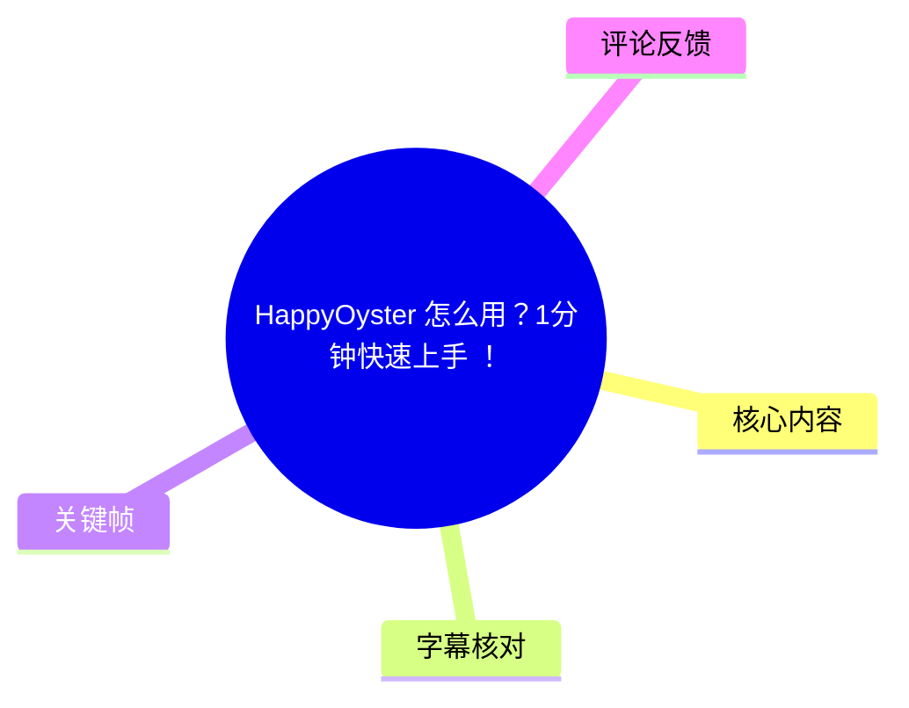
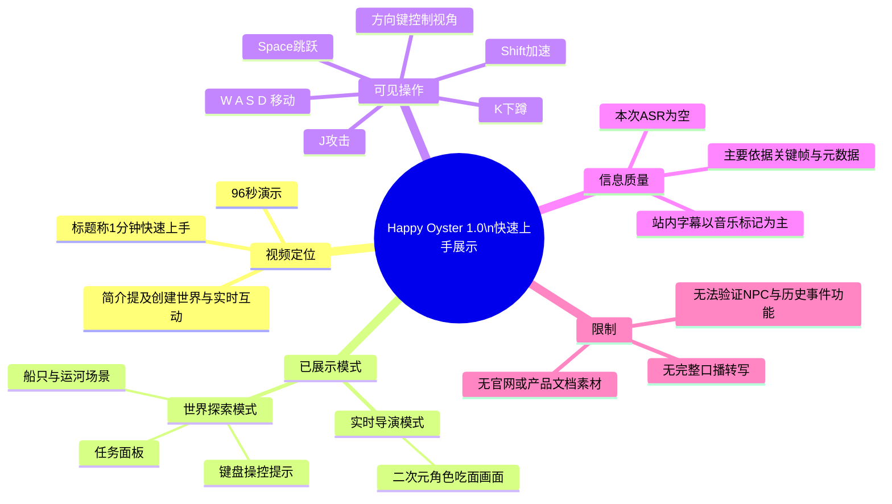
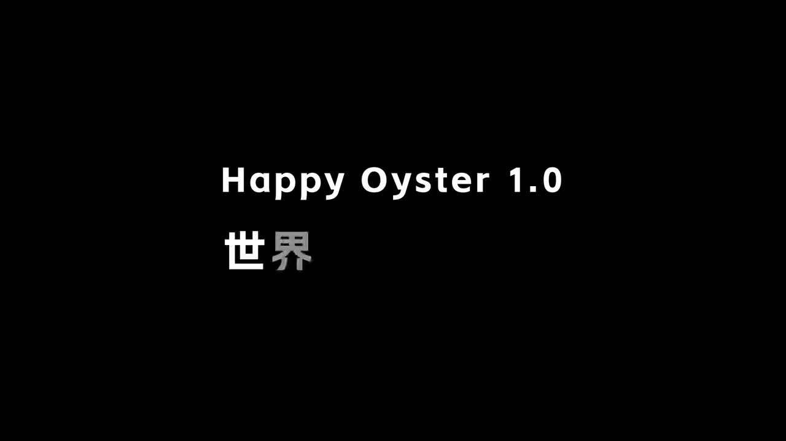

# HappyOyster 怎么用？1分钟快速上手 ！

> 来源：[Bilibili 视频](https://www.bilibili.com/video/BV1xWTx6MEmZ)  
> UP 主：HappyOyster｜时长：96 秒｜分辨率：1920×1080  
> 视频简介：**“从创建世界到实时互动，都能轻松拿捏～”**

## 小结

这是一支展示 **Happy Oyster 1.0** 的短教程/功能演示视频，主题围绕“世界”与实时互动。视频标题称为“1分钟快速上手”，但实际素材中可可靠识别的文字信息主要来自画面，而不是语音：站内字幕几乎只有音乐标记，ASR 结果为空。

从关键帧可确认，视频至少展示了两类体验：其一是标为“实时导演模式”的二次元角色吃面画面；其二是标为“世界探索模式”的可操作三维场景。后者明确出现键盘操控提示及任务面板，表明视频强调的不是单纯生成静态画面，而是带有角色/场景互动和移动控制的演示。

可见操作信息包括：`W/A/S/D` 移动、方向键视角控制、`J` 攻击、`K` 下蹲、`Space` 跳跃、`Shift` 加速。探索场景左侧还列出“探索世界中的马”“找到附近的车辆”“找个地方躲起来”等目标，并提供“上下”或“跳过”操作入口；不过，素材没有给出这些功能的完整触发流程、平台入口、账号要求、生成耗时或价格信息。

因此，这份笔记适合想快速理解视频**已展示能力边界**的读者：可以确认它呈现了“世界探索”和“实时导演”两个界面/模式；不能据此确认 Happy Oyster 的全部产品机制、实际可用地区、NPC 系统、多人功能、模型版本能力或稳定性。视频发布日期按元数据为 2026-07-03，AI 产品界面和功能迭代较快，应以实际产品页面为准。

## 思维导图

## 目录

- [视频定位与信息边界](#视频定位与信息边界)
- [画面时间轴与已展示功能](#画面时间轴与已展示功能)
  - [开场：实时导演模式画面](#开场实时导演模式画面)
  - [标题卡：Happy Oyster 10 世界](#标题卡happy-oyster-10-世界)
  - [世界探索：任务与键盘控制](#世界探索任务与键盘控制)
- [可复用的操作信息](#可复用的操作信息)
- [技术与产品信息：已知、未知及限制](#技术与产品信息已知未知及限制)
- [字幕比对](#字幕比对)
- [评论分析](#评论分析)
- [处理记录](#处理记录)

## 视频定位与信息边界 [00:00](https://www.bilibili.com/video/BV1xWTx6MEmZ?t=0)

视频标签包括“世界模型”“AI互动”“AI游戏”“Alibaba”“HappyOyster”等；这些是发布页面的分类信息，能够说明发布者希望将内容定位于 AI 世界/互动体验，但**不能单独证明**具体模型架构、所属机构关系或产品已全面开放。

标题“HappyOyster 怎么用？1分钟快速上手！”与简介“从创建世界到实时互动，都能轻松拿捏～”给出了视频的叙事目标：从世界创建延伸到实时互动。不过，由于没有可用的完整语音转写，以下内容严格以元数据、站内字幕、热评和三张关键帧中的可读信息为依据，不补写画面外的注册、提示词、生成、保存或发布步骤。

视频总长度为 **96 秒**。提供的关键帧没有附带精确截帧秒数，下面的时间轴将链接定位到视频中的对应段落区间；其中画面顺序依据关键帧编号与内容组织，具体切换秒数仍需播放原视频复核。

## 画面时间轴与已展示功能 [00:00](https://www.bilibili.com/video/BV1xWTx6MEmZ?t=0)

### 开场：实时导演模式画面 [00:00](https://www.bilibili.com/video/BV1xWTx6MEmZ?t=0)

第一张关键帧展示一位二次元风格角色在拉面店吃面。右上角可读到“**实时导演模式**”。

> 图：画面直接给出了“实时导演模式”这一模式名称，并用角色、餐食与室内场景构成具体示例。它的价值在于确认视频并非只展示抽象宣传语，而是展示了一个角色与场景结合的演出画面；但单帧无法证明角色动作是否由用户实时控制、由预设脚本驱动，或由模型自动生成。

从这一帧可作出的谨慎结论是：

1. 视频中存在一个标为“实时导演模式”的展示界面或演示标签。
2. 该模式的示例内容涉及二次元人物、室内场景和进食动作。
3. “实时”具体指实时生成、实时驱动、实时渲染还是实时交互，现有字幕和画面不足以进一步判定。

### 标题卡：Happy Oyster 1.0 世界 [00:32](https://www.bilibili.com/video/BV1xWTx6MEmZ?t=32)

第二张关键帧是黑底标题卡，文字为“**Happy Oyster 1.0**”与“**世界**”。

> 图：这是识别产品/版本名称和本段主题的最直接证据。“Happy Oyster 1.0”中的版本号清晰可读，“世界”则表明随后内容围绕世界体验展开。该图不能推出更多版本差异或发布日期信息。

该标题卡至少明确了两个信息：

- 演示画面使用或标注为 **Happy Oyster 1.0**；
- 本段内容主题为“世界”。

除版本号外，视频素材未提供版本更新日志、支持设备、浏览器要求、计算资源要求、API、提示词格式或模型参数，因此不能将“1.0”解读为某种特定技术版本或公开产品阶段。

### 世界探索：任务与键盘控制 [01:04](https://www.bilibili.com/video/BV1xWTx6MEmZ?t=64)

第三张关键帧展示了夕阳下的运河、停靠的小船、石桥与建筑环境。右上角标为“**世界探索模式**”，左侧是任务列表，底部给出键盘操控提示。

> 图：这张图同时保留了模式名称、任务 UI、场景画面与完整的主要按键提示，是理解视频中“互动”成分最有价值的关键帧。它能证明演示中存在移动、视角、动作和任务式界面，但无法证明每一项任务都已被实际完成。

画面中可辨识的任务条目为：

| 任务文本 | 画面显示的附加操作 | 可确认含义 |
| --- | --- | --- |
| 探索世界中的马 | 上/下 | 存在与“马”相关的探索任务或目标 |
| 找到附近的车辆 | 上/下 | 存在与“附近车辆”相关的探索任务或目标 |
| 找个地方躲起来 | 跳过 | 存在可跳过的躲藏类任务 |

底部按键提示可读为：

| 操作 | 键位 |
| --- | --- |
| 移动 | `W` / `A` / `S` / `D` |
| 攻击 | `J` |
| 下蹲 | `K` |
| 跳跃 | `Space` |
| 加速 | `Shift` |
| 视角/方向控制 | `↑` / `↓` / `←` / `→` |

这里的“攻击”“下蹲”“跳跃”“加速”等动作提示，说明展示界面采用接近游戏的第一/第三人称键鼠交互设计。但关键帧未展示角色本体、攻击对象、碰撞反馈、任务完成条件或存档机制，不能将其延伸解释为完整游戏玩法。

## 可复用的操作信息 [01:04](https://www.bilibili.com/video/BV1xWTx6MEmZ?t=64)

根据世界探索模式关键帧，如果实际产品界面仍保持相同布局，可优先按以下顺序理解和尝试操作：

1. **确认所在模式**  
   观察右上角标签；关键帧中显示为“世界探索模式”。视频另有“实时导演模式”画面，二者应属于不同展示语境或模式入口，但素材未展示切换方法。

2. **阅读左侧任务面板**  
   左侧列出探索、寻找车辆、躲藏等目标。前两项右侧显示“上/下”，第三项显示“跳过”。画面未说明“上/下”是切换任务、展开任务还是执行选项，实际操作应以产品内提示为准。

3. **使用 `W/A/S/D` 移动**  
   底部左侧以四个键位图标标注移动控制。可将其视为探索场景中的基础位移方式。

4. **使用方向键调整方向/视角**  
   底部右侧出现 `↑/↓/←/→` 图标。仅凭画面可确认这些键有方向相关用途；由于文字标签不完整/不可稳定辨认，不应断言其必然等同于镜头旋转或角色转向。

5. **使用动作键完成探索中的即时操作**  
   底部中间显示：`J` 攻击、`K` 下蹲、`Space` 跳跃、`Shift` 加速。视频没有展示组合键、连续输入、按住/点按差异及按键重映射。

6. **谨慎验证任务结果**  
   关键帧中只显示任务列表，没有完成状态、奖励、失败条件或具体交互提示。应在实际界面中观察任务更新，而不是仅按任务文本推断系统已具备完整任务链。

### 未能从素材恢复的步骤

以下信息未出现在可用字幕、元数据或关键帧中，故不能编造为教程步骤：

- 如何访问 Happy Oyster、登录或申请资格；
- 如何“创建世界”、使用何种输入内容或提示词；
- 如何从“实时导演模式”进入“世界探索模式”；
- 世界生成/加载的等待时间、分辨率、帧率、成本或配额；
- 是否支持角色编辑、多人协作、导入资产、保存、分享或导出；
- NPC、NPC 之间互动、历史事件等扩展功能是否已上线。

## 技术与产品信息：已知、未知及限制 [01:20](https://www.bilibili.com/video/BV1xWTx6MEmZ?t=80)

### 可由素材直接支持的信息

- 产品/演示名称：**Happy Oyster 1.0**。
- 视频主题：世界与实时互动。
- 可见模式标签：**实时导演模式**、**世界探索模式**。
- 可见探索场景：运河、小船、桥梁、建筑等三维视觉环境。
- 可见交互元素：任务列表、移动键、动作键和方向键。
- 视频规格：96 秒、1920×1080。
- 页面数据抓取时的互动统计：播放 2182、点赞 485、收藏 333、投币 5、分享 8、评论 4、弹幕 0。该数据为抓取时快照，会随时间变化。

### 不能从素材确认的信息

| 事项 | 当前结论 |
| --- | --- |
| “世界模型”的技术架构 | 未提供模型名称、论文、推理链路或技术文档，无法确认。 |
| 实时性的实现方式 | 仅有“实时导演模式”标签，无法确定实时生成、实时渲染或实时操控的具体含义。 |
| 世界是否由文本生成 | 视频简介提到“创建世界”，但没有展示输入与生成过程。 |
| NPC 与 NPC 互动 | 热评提出需求，不能作为功能已存在的证据。 |
| 历史事件系统 | 热评提出需求，不能作为功能已存在的证据。 |
| 平台可用性与收费 | 素材没有入口、价格、地区或资格说明。 |

### 时效性与使用风险

这是一个 AI 产品演示视频，版本、UI、键位、任务内容和开放范围都有可能变化。尤其是“Happy Oyster 1.0”的版本标识，不能保证在读者观看时仍为当前版本。

建议在实际使用前核对：

- 官方入口与当前开放资格；
- 当前版本是否保留“实时导演模式”和“世界探索模式”；
- 键位及任务 UI 是否变更；
- 生成内容的版权、隐私、使用规范和数据处理说明；
- 生成式场景中可能出现的内容失真、动作异常、任务不可完成或交互延迟问题。

## 字幕比对 [00:00](https://www.bilibili.com/video/BV1xWTx6MEmZ?t=0)

本次任务中，**站内字幕与 ASR 均已获取并比较**。站内字幕包含多条“♪ 音乐 ♪”和一句“无论什么”；本次 ASR 字幕为空。两者都不足以支撑完整口播级转写，因此正文以画面可读文字、元数据和关键帧为主要证据。

| 字幕来源 | 完整性 | 专有名词 | 时间轴 | 主要问题 |
| --- | --- | --- | --- | --- |
| Bilibili 站内字幕 | 很低；主要为音乐标记，仅有“无论什么”一条自然语言片段 | 未识别出 Happy Oyster、模式名或键位等专有信息 | 提供素材中未附逐句时间戳 | 不含有效教程说明，无法覆盖视频核心内容 |
| 本次 ASR 字幕 | 无有效文本 | 无法识别 | 无 | ASR 输出为空，无法用于转写或校正 |

### 最终字幕选择与校正方式

最终不采用任一字幕作为正文主干，而是采用以下证据优先级：

1. 关键帧中可直接阅读的界面文字；
2. 视频元数据中的标题、简介、标签和时长；
3. 可获取热评中的用户提问与反馈；
4. 站内字幕中唯一的自然语言片段“无论什么”，但该片段缺乏上下文，未纳入事实性结论。

通过关键帧校正/确认的重要文字包括：

- `Happy Oyster 1.0`
- `实时导演模式`
- `世界探索模式`
- `W/A/S/D`
- `J` 攻击、`K` 下蹲、`Space` 跳跃、`Shift` 加速
- “探索世界中的马”“找到附近的车辆”“找个地方躲起来”

上述文字来自画面而非 ASR，仍应注意部分小字号 UI 文本可能受压缩与截图清晰度影响。

## 评论分析 [01:28](https://www.bilibili.com/video/BV1xWTx6MEmZ?t=88)

仅处理本次可获取的热评前三条。评论是用户反馈或提问，不作为产品功能已经实现的证据。

1. **juveeeee**（点赞 1）：“`[打call][打call][打call]`”  
   - 观点：表达支持或鼓励。  
   - 补充信息：没有提供具体使用经验、功能描述或问题反馈。  
   - 可信度判断：可反映积极情绪，不能用于验证任何技术能力。

2. **以此身铸吾剑**（点赞 0）：“`实时交互的视频？`”  
   - 观点：对视频是否为实时交互提出疑问。  
   - 补充信息：该问题与画面中“实时导演模式”的标签高度相关，说明“实时”的具体含义可能对观众并不清晰。  
   - 可信度判断：这是合理的待验证问题，不是对产品机制的确认。现有素材不足以回答“是否为实时交互的视频”。

3. **月影明媚DG**（点赞 0）：“`能否添加npc与npc交互添加历史事件[吃瓜]`”  
   - 观点：希望增加 NPC、NPC 间互动与历史事件。  
   - 补充信息：反映用户对世界模拟深度和动态叙事的期待。  
   - 可信度判断：这是功能建议，不能反向推断当前版本已经拥有或缺少这些功能；视频素材也未展示相关内容。

整体来看，热评中没有出现可核实的安装教程、参数说明、性能数据或官方答复。讨论焦点主要集中于“实时交互是否成立”以及“世界中 NPC/历史事件的扩展可能性”。

## 评论分析

本次流程未获取到可用热评，因此不推断观众态度或额外结论。

## 处理记录

- Worker ID：`worker-mrj0wbly-5dc4e50c`
- 模型：`gpt-5.6-terra`
- 调用工具与素材：基于任务提供的元数据、视频素材清单、站内字幕、ASR 输出、热评 JSON 与 3 张关键帧进行整理；未使用外部资料补充未出现的产品信息。
- 使用的应用工具：素材读取与结构化整理；已检查 `merged.mp4`、`audio/audio.wav`、`frames/`、`subtitles/`、`asr/`、`comments/comments.json` 对应的任务输出说明。
- 字幕选择：站内字幕存在但基本仅含音乐标记；本次 ASR 已执行但结果为空。两者均不作为完整转写来源，正文以关键帧可读 UI 和元数据为准。
- 关键帧选择依据：
  - `frames/frame-001.jpg`：右上角清晰出现“实时导演模式”，用于证明该模式名称及其角色场景示例。
  - `frames/frame-002.jpg`：清晰显示“Happy Oyster 1.0 / 世界”，用于确认版本/段落主题。
  - `frames/frame-003.jpg`：同时呈现“世界探索模式”、任务列表和键盘控制，是还原可见操作信息的主要依据。
- 缓存清理：未在本次对话中产生可操作的本地缓存清理记录；任务提供的素材路径按原样引用，未擅自删除。
- 未解决问题：关键帧未提供精确截帧时间；完整口播缺失；“创建世界”的实际步骤、实时交互机制、NPC 功能、历史事件、可用入口、性能与费用均无法从现有素材确认。
