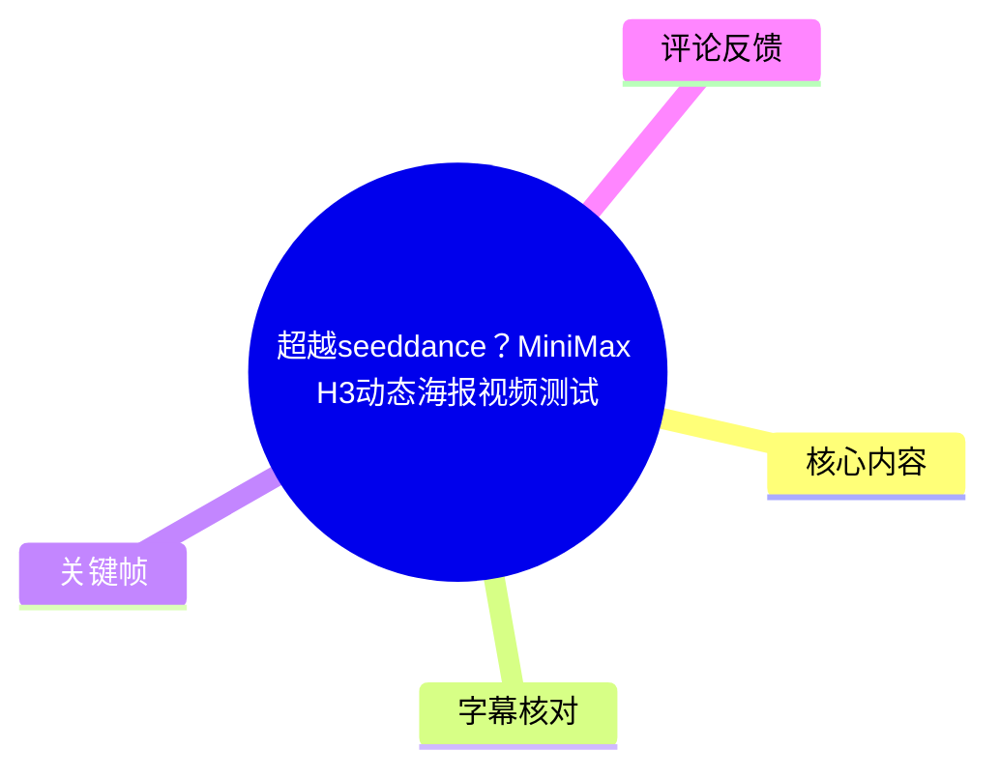
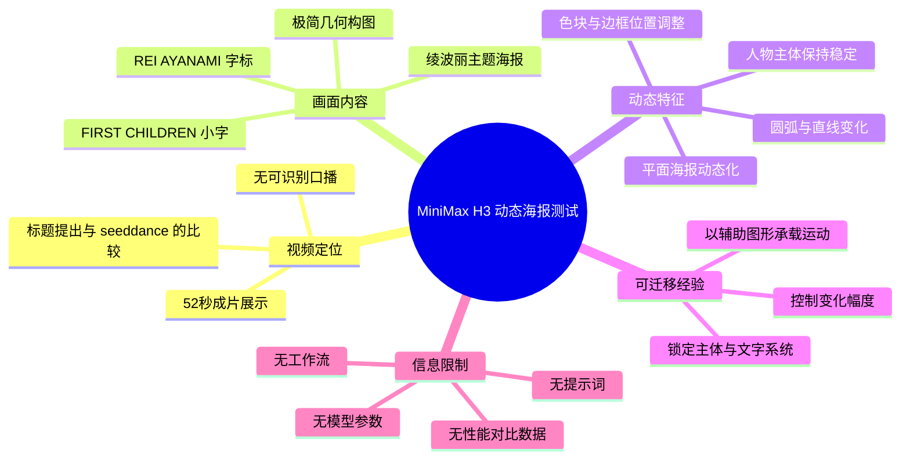
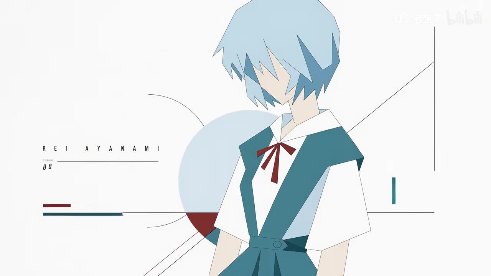
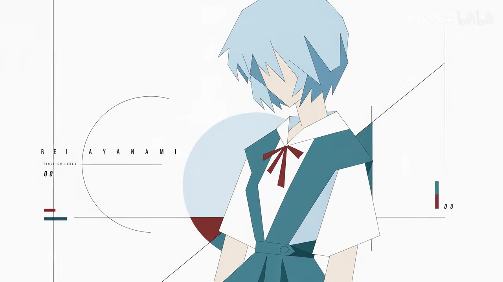
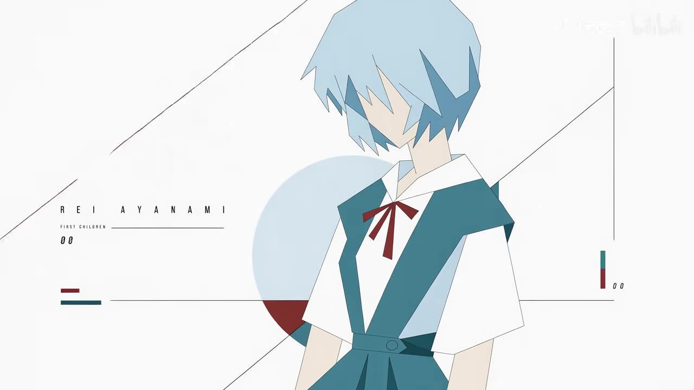
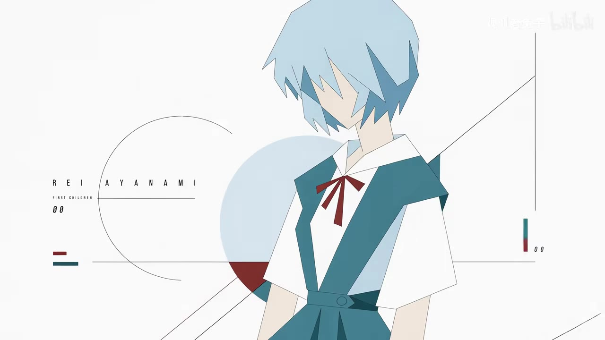

# 超越seeddance？MiniMax H3动态海报视频测试

> 来源：[Bilibili 视频](https://www.bilibili.com/video/BV1wjMd6EEDz) 
> UP 主：观测者兔子｜视频时长：52 秒｜画面规格：2560 × 1440 
> 标签：二次元、忍野忍、新世纪福音战士、海报、绫波丽、EVA、视频生成、MiniMax、comfui、seeddance

## 小结

视频是一支约 52 秒、以配乐和画面展示为主的动态海报效果测试。标题将测试对象标为“MiniMax H3”，并以“超越 seeddance？”提出比较性问题；但视频中没有可识别的口播、旁白、提示词、模型版本、工作流节点、生成参数或基准测试数据，因此不能据此验证两个工具之间的能力高低。

画面核心是一张以《新世纪福音战士》角色“绫波丽”为主题的极简平面海报：白色背景上放置蓝发制服人物、英文标题“REI AYANAMI”、小字“FIRST CHILDREN”、圆弧、直线、色块和编号式装饰。多个关键帧显示主体人物与文字系统保持稳定，而背景线条、色块及构图元素发生变化，构成“静态海报被动态化”的主要视觉思路。

从成片可迁移的经验是：动态海报不一定依赖复杂的人物动作。保持角色造型、字标与主色系统稳定，再对几何线条、圆弧、边缘色块和版式层级做克制的位移或显隐变化，即可保留海报的平面设计感，避免动画化后破坏原始构图。

本视频适合关注 AI 视频生成、二次元视觉设计、海报动态化和 MiniMax 相关效果测试的读者作为案例观看。它更接近结果展示而非可复现实操教程：素材未提供提示词、参考图输入方式、时长设置、帧率、分辨率选择、负面提示词、ComfyUI 工作流或后期合成信息。

时效性上，视频发布于素材元数据所示的 2026 年 8 月初；“MiniMax H3”“seeddance”的具体产品能力、模型版本、可用地区、计费和输出质量均可能迭代。标题中的“超越”应视为创作者提出的测试性表达，不应当作已被视频证实的行业结论。

## 思维导图

## 目录

- [视频定位与时效性](#视频定位与时效性)
- [动态海报成片观察](#动态海报成片观察)
  - [开场：建立角色与海报识别系统](#开场建立角色与海报识别系统)
  - [中段：几何元素的版式变化](#中段几何元素的版式变化)
  - [后段：稳定主体与动态背景的组合](#后段稳定主体与动态背景的组合)
- [可从画面提炼的制作步骤](#可从画面提炼的制作步骤)
- [参数、证据与限制](#参数证据与限制)
- [字幕比对](#字幕比对)
- [评论分析](#评论分析)
- [处理记录](#处理记录)

## 视频定位与时效性 [00:00](https://www.bilibili.com/video/BV1wjMd6EEDz?t=0)

素材元数据显示，视频标题为“超越seeddance？MiniMax H3动态海报视频测试”，UP 主为“观测者兔子”，总时长 52 秒，分辨率为 2560 × 1440。标题和标签能够确认这是围绕 AI 视频生成、MiniMax、seeddance 与动态海报的内容，但不能单独证明实际使用的模型名称、版本或完整制作流程。

站内时间轴字幕从 00:00.160 至 00:42.080 均标注为“♪ 音乐 ♪”，说明已提供的站内字幕没有记录任何讲解性语言。ASR 对约 51.328 秒音频进行识别后也未输出语音片段。因此，本文对“MiniMax H3”“seeddance”的描述仅以标题、标签和评论语境为依据，不将其扩展为未经展示的技术事实。

视频的实际价值主要在视觉结果：

1. 展示一个二次元人物海报在视频媒介中的动态化效果。
2. 通过同一角色、字标和几何布局的连续变化，观察视觉一致性。
3. 为“静态视觉设计 + 低幅度运动图形”的成片方向提供参考。
4. 没有提供足以复现或量化评测的技术信息。

## 动态海报成片观察

### 开场：建立角色与海报识别系统 [00:00](https://www.bilibili.com/video/BV1wjMd6EEDz?t=0)

在站内字幕首段覆盖的开始位置，画面已经建立起完整海报语言：白色底图中央偏右为蓝发少女形象，角色服装以蓝绿色、白色和暗红色为主；左侧出现间距拉开的英文“REI AYANAMI”，下方有“FIRST CHILDREN”及“00”样式文字。

画面可辨认为围绕绫波丽展开的设计，且与视频标签中的“绫波丽”“EVA”“新世纪福音战士”相互印证。人物面部没有被完整刻画，而采用大色块、简化轮廓和较少阴影的平面插画方式；这使其更接近海报或视觉识别系统，而非角色动画镜头。

> 图：该关键帧展示了人物主体、左侧“REI AYANAMI”文字、圆形色块与横向分割线共同组成的基础版式。它用于确认视频的核心不是人物表演，而是以角色海报作为动态化对象。

可从这一画面归纳的构图层级为：

- **第一层：角色主体**。人物位于中央偏右，占据最主要视觉面积。
- **第二层：身份文字**。左侧角色英文名用于建立主题识别。
- **第三层：辅助图形**。圆弧、长线、竖线、色条和数字为画面提供工业化、档案化的视觉感受。
- **第四层：配色锚点**。浅蓝、蓝绿色、暗红色分别呼应头发、制服和蝴蝶结，使抽象图形与人物建立颜色联系。

### 中段：几何元素的版式变化 [00:14](https://www.bilibili.com/video/BV1wjMd6EEDz?t=14)

站内字幕在 00:14.750—00:20.510 继续仅标为音乐。在这一类动态海报中，画面信息主要依赖几何元素的变化来传递节奏，而不依赖语言信息。

对比所给关键帧可见，人物的姿态、服装色块、左侧姓名标识和整体白底风格保持高度一致；可见变化集中在背景的斜线、左侧圆弧、边缘竖线及右下区域的装饰色条。因未提供逐帧运动轨迹或带时间戳的关键帧元数据，不能精确断言每个元素在何时以何种插值方式运动；但画面序列支持“辅助设计元素承担动态”的判断。

> 图：该帧中左侧圆弧更完整地参与构图，右下可见青绿与暗红的竖向色条及“00”标识。它说明动态化时可以保持角色不变，通过信息图形式元素调节画面张力。

这种设计方向的优势是：

- 对人物五官、手部、衣物褶皱等高难度连续性要求较低；
- 即使角色本身变化很小，画面也能保持节奏；
- 文字与色彩系统稳定，有利于维持“海报”而不是“随机动画截图”的辨识度；
- 几何元素可作为遮挡、转场或节拍同步的载体。

相应风险是，若线条移动幅度过大、文字发生变形或图形遮挡主体过多，平面设计中原本的留白与层级会被破坏。该视频未展示失败样本或参数对照，无法确定其采用何种约束方法来控制这些风险。

### 后段：稳定主体与动态背景的组合 [00:29](https://www.bilibili.com/video/BV1wjMd6EEDz?t=29)

站内字幕在 00:29.910—00:32.710、00:32.710—00:37.210、00:37.210—00:40.690 仍为音乐标记。该段可作为成片中后段视觉展示的时间锚点，而不是口播教程段落。

关键帧中，人物始终位于相近位置，文字“REI AYANAMI”仍保留在左侧。相较基础构图，画面中的斜线角度、横线的延伸关系和圆弧可见范围有所不同。这种“主体稳定、背景变化”的组织方式适合海报转视频：观看者先识别人物和作品主题，再从边缘与背景获得运动感。

> 图：该帧保留了人物、字标、浅蓝圆形和暗红色半圆等核心识别元素，同时出现更显著的左上至右侧斜线。它有助于观察运动图形如何在不改动角色主体的前提下改变视觉方向。

> 图：该关键帧呈现圆弧、横线、右侧竖线与底部斜线同时进入画面的状态。它的价值在于展示辅助图形数量增加后，人物主体仍保持中央视觉重心的版式平衡。

从画面可见结果出发，可将本例理解为以下动态策略：

| 视觉对象 | 画面中可观察到的状态 | 对动态海报的作用 |
| --- | --- | --- |
| 人物 | 位置、发色、服装和剪影基本稳定 | 保持角色识别与视觉锚点 |
| 英文姓名与小字 | 持续作为左侧信息层存在 | 维持海报的编辑设计感 |
| 圆弧与圆形色块 | 可见范围、相对关系发生变化 | 增加画面流动与层次 |
| 斜线、横线、竖线 | 分布及延展关系可变 | 引导视线、制造速度感 |
| 青绿与暗红色条 | 作为局部装饰点出现 | 与角色服装配色呼应 |

## 可从画面提炼的制作步骤 [00:40](https://www.bilibili.com/video/BV1wjMd6EEDz?t=40)

以下是依据成片画面整理的**视觉制作思路**，不是视频明确演示的 MiniMax H3、ComfyUI 或 seeddance 操作步骤。视频没有公开提示词、节点图、接口配置或软件操作过程，故不能补写为具体命令或参数。

1. **确定稳定的海报主题与主体**
   - 选择具有明确剪影和配色辨识度的人物作为画面中心。
   - 本例的主体为蓝发、蓝绿色制服配暗红色蝴蝶结的绫波丽风格角色。
   - 画面应先在静态状态下成立，再考虑增加运动。

2. **建立可重复的版式系统**
   - 使用角色名、编号、小字、细横线、竖线、圆弧等元素建立版式。
   - 文字不是纯说明信息，也承担左右画面平衡的功能。
   - 留白应作为构图的一部分；本例以大面积白底凸显人物与线条。

3. **限制动态对象的范围**
   - 优先让圆弧、直线、色块和边缘装饰产生位移、延展、显隐或构图变化。
   - 保持人物主体、主标题和关键配色尽可能稳定。
   - 这一限制有助于减少主体漂移、文字错乱和角色重绘感，但它是由成片经验推导而来，并非视频披露的模型设置。

4. **检查文字与角色的一致性**
   - 本例多帧均能读到“REI AYANAMI”，说明字标是重要画面资产。
   - 生成或后期阶段应特别检查字符拼写、字距、对齐关系和线条是否遮挡文字。
   - 但视频未说明文字是否由模型直接生成、后期叠加，或由其他流程完成。

5. **以音乐节奏组织成片**
   - 站内字幕将绝大部分可标注时间段标为音乐，说明声音层主要是配乐而非讲述。
   - 可让背景图形的变化服务于音乐节拍或段落推进。
   - 本素材未提供 BPM、曲名、剪辑点或音频授权信息，不能进一步量化节奏设置。

## 参数、证据与限制 [00:42](https://www.bilibili.com/video/BV1wjMd6EEDz?t=42)

### 已知参数与事实

| 项目 | 素材可确认的信息 |
| --- | --- |
| 视频时长 | 52 秒；ASR 读取音频时长为 51.328 秒 |
| 画面尺寸 | 2560 × 1440 |
| 视频主题 | 标题标示为 MiniMax H3 动态海报视频测试 |
| 视觉对象 | 绫波丽主题极简海报；画面中可读到“REI AYANAMI”“FIRST CHILDREN”“00” |
| 音频信息 | 站内字幕将 00:00.160—00:42.080 的多个片段标为“♪ 音乐 ♪” |
| 口播转写 | 本次 ASR 未识别出任何语音片段 |
| 可见动态方向 | 稳定人物与文字系统，配合几何图形和色块的画面变化 |

### 未公开、不可据此补全的信息

以下信息在素材中均未出现，因此不能将本视频视为可直接复现的教程：

- MiniMax H3 的精确模型版本、访问渠道和计费方案；
- 是否实际使用 seeddance，以及二者使用的相同输入条件；
- 提示词、负面提示词、参考图、种子值与生成轮次；
- 视频生成时长、帧率、运动强度、镜头控制或一致性控制参数；
- 是否使用 ComfyUI，以及具体节点、模型、LoRA、ControlNet 或工作流文件；
- 字标与几何图形是生成结果、后期合成素材，还是两者结合；
- 对“超越 seeddance？”的客观指标，包括一致性、速度、成本、可控性和失败率；
- 版权取得、角色素材来源及商业使用范围。

### 时效性与结论边界

“MiniMax H3”“seeddance”均属于可能持续迭代的生成式工具或产品名称。视频发布后的模型能力、输出限制和使用政策可能变化，因此本文仅记录该短片呈现的效果，不对当前版本的产品能力作延伸判断。

标题中的问号尤其重要：它表明“超越”在视频层面是待检验的问题或吸引观看的表述，而非已经由参数、盲测或对照样本证明的结论。若需要评价工具优劣，至少应补充统一参考图和提示词、同等时长/分辨率、重复生成次数、成本与耗时、文字稳定性、人物一致性及失败样本。

## 字幕比对

| 字幕来源 | 完整性 | 专有名词 | 时间轴 | 主要问题 |
| --- | --- | --- | --- | --- |
| Bilibili 站内字幕 | 对音乐提示有覆盖，但无讲解文本 | 未出现 MiniMax H3、seeddance、角色名等技术或主题专名 | 有效；提供 00:00.160—00:42.080 的真实分段 | 内容均为“♪ 音乐 ♪”，无法还原制作方法或观点 |
| 本次 ASR 字幕 | 无语音文本，0 个识别片段 | 无 | ASR 文件具备时间戳能力，但本次无有效语音分段 | `large-v3-turbo` 检测语言为英语的概率约 0.6006，最终未识别出语音；诊断提示无语音片段 |

### 最终字幕选择与校正方式

最终采用**站内字幕作为时间轴依据**，因为其提供了真实的音乐分段时间；本次 ASR 已检查，但结果为空，不能提供补充文本。ASR 诊断中**没有** `noAudioStream=true` 标记，因此不能将本视频断言为“没有音轨”；相反，素材清单中存在 `audio/audio.wav`，且站内字幕明确记录音乐。更准确的表述是：音轨可被提取，站内字幕标示为音乐，但 ASR 未检测到可转写的人声。

重要词语通过非字幕证据校正如下：

- **MiniMax H3 / seeddance**：来自视频标题，而非口播或 ASR。
- **绫波丽 / EVA / 新世纪福音战士**：由视频标签与画面中“REI AYANAMI”“FIRST CHILDREN”文字共同支持。
- **动态海报**：来自视频标题，并由同一海报版式在多个关键帧中的几何元素变化支持。
- **ComfyUI**：仅出现在标签内；视频未展示其界面或工作流，不能认定其为实际制作工具。

## 评论分析

以下仅处理素材中可获取的热评前三条。三条评论点赞数均为 0，且均属于观众发言，不构成对视频技术细节的验证。

1. **Zyaaki**：“大佬提示词私信发一份吧，，你动态啥的估计审核吞了”
   - 观点：评论者希望获得提示词，并猜测动态相关内容可能因审核原因未能展示。
   - 补充价值：反映观众对可复现提示词和动态制作信息有需求。
   - 可信度边界：这是评论者的推测；视频素材没有显示提示词，也没有证据证明任何内容被审核吞没，不能据此确认。

2. **xurobert**：“没看到呢 能分享下么？”
   - 观点：评论者表示未看到预期内容，并请求分享。
   - 补充价值：与第一条共同反映，公开视频没有满足部分观众对素材、提示词或制作细节的获取需求。
   - 可信度边界：评论没有明确“没看到”的具体对象，不能将其解释为某项技术功能缺失或平台故障。

3. **傻白甜巧克丽**：“[新世纪福音战士新剧场版终系列_注视]”
   - 观点：以《新世纪福音战士新剧场版终》系列相关表情回应。
   - 补充价值：说明观众将画面联想到 EVA 文化语境。
   - 可信度边界：这是一条表情化反应，不提供模型、流程、角色版权或成片质量的可验证信息。

## 处理记录

- Worker ID：`worker-mrj0www4-e8d79408`
- 调用模型：`gpt-5.6-terra`
- ASR 模型：`large-v3-turbo`，CUDA 推理，`int8_float16`；自动识别语言结果为英语，概率约 `0.6005859375`。
- 使用的素材与工具结果：视频元数据、站内字幕 `p01-ai-zh.srt`、ASR 诊断与空转写结果、热评 JSON、已提供关键帧。
- 字幕选择：以站内 SRT 的真实起止时间建立时间轴；ASR 已检查但无识别片段，未被用于补写文本。
- 关键帧选择依据：选用 `frames/frame-001.jpg` 至 `frames/frame-004.jpg`，因为它们共同呈现人物主体、英文角色名、圆弧、线条、色块与版式变化，可用于说明“稳定主体 + 变化辅助图形”的视觉结构。
- 关键帧时间说明：素材未提供这些图片各自的提取时间戳，因此未将单张图片强行绑定到具体秒数；章节时间仅依据站内 SRT 的真实音乐分段。
- 缓存清理：未提供缓存清理执行记录，无法验证是否已清理；不作已清理声明。
- 未解决问题：提示词、参考图、模型版本、生成参数、ComfyUI 工作流、文字后期方式、对 seeddance 的统一对照条件以及版权授权信息均未在素材中披露。
