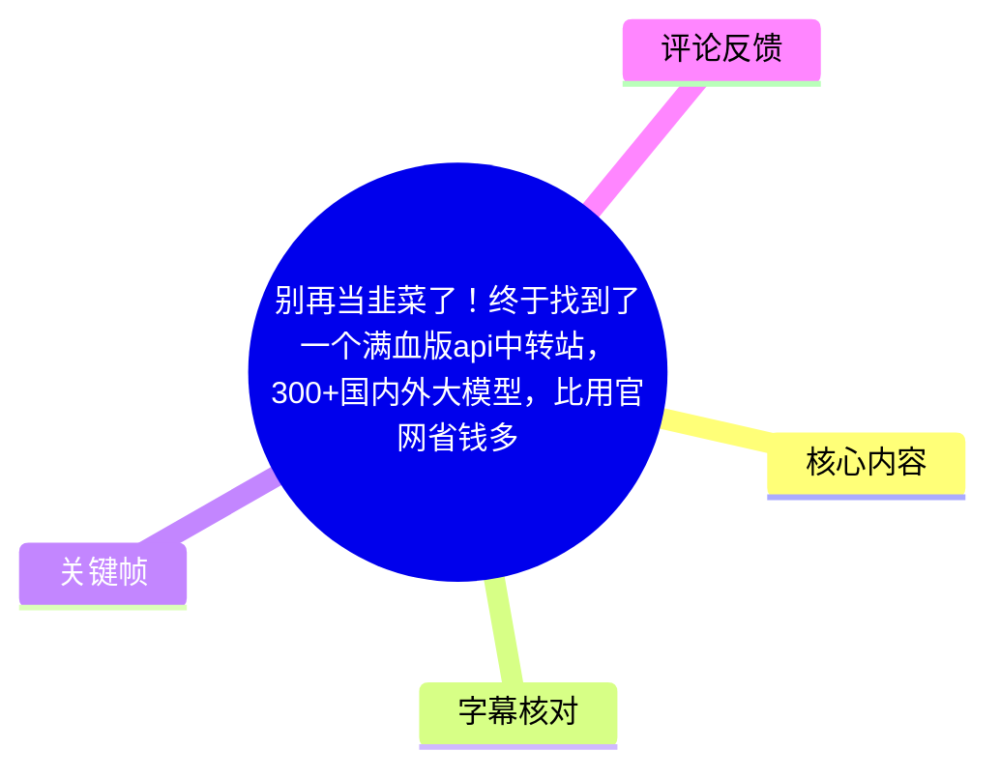
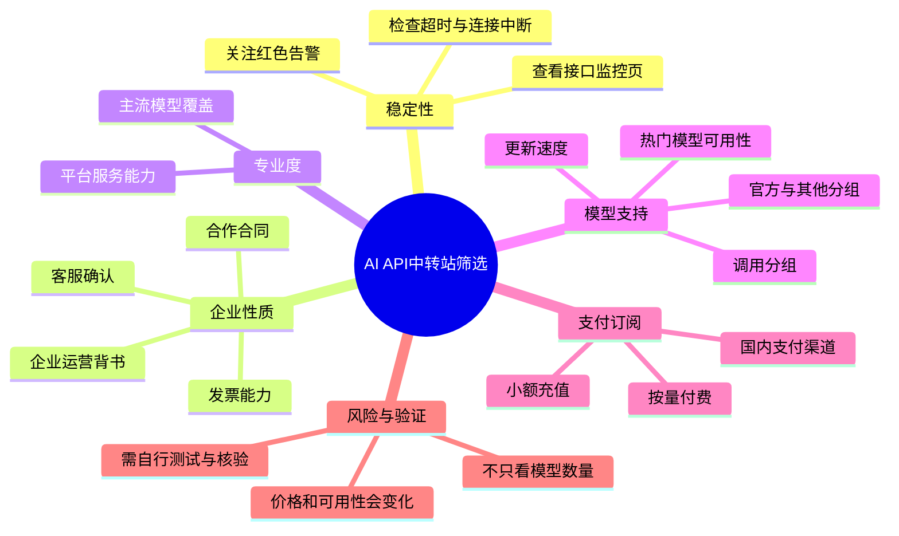
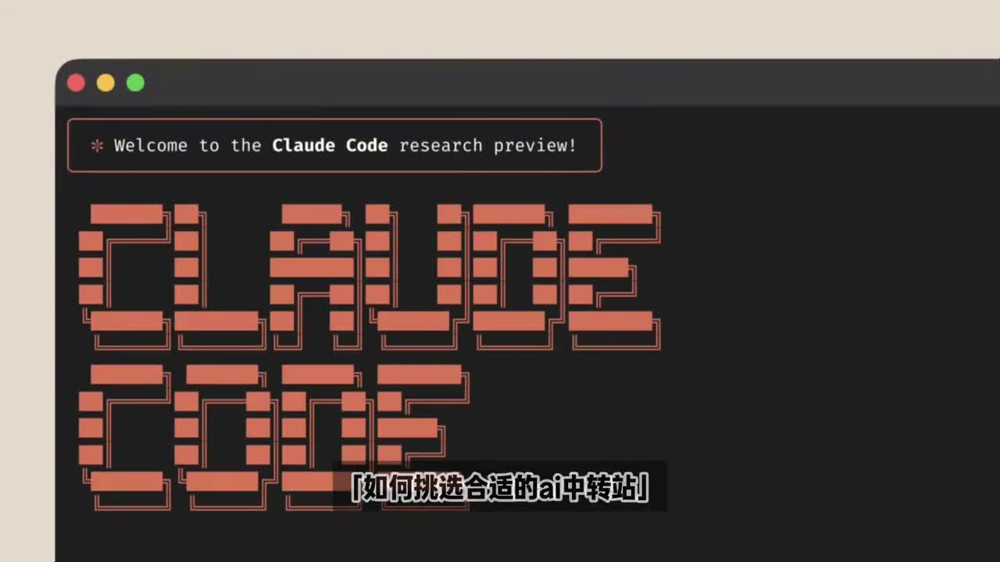
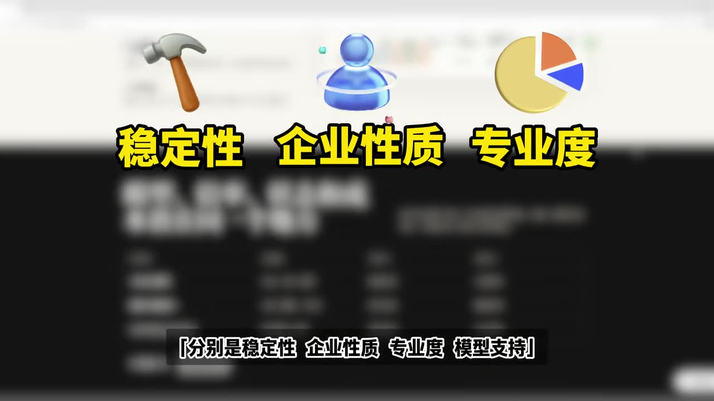
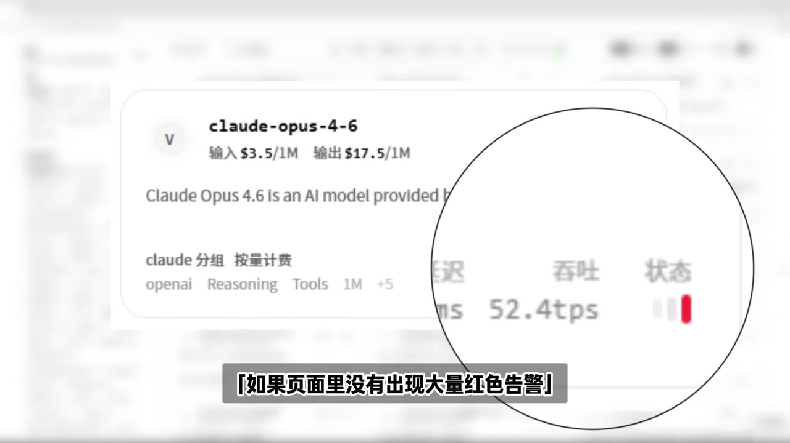
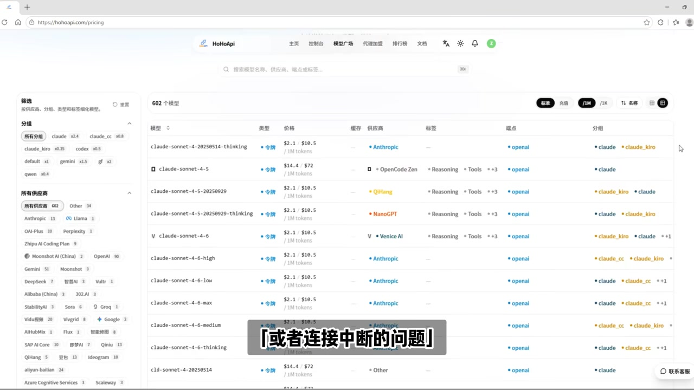
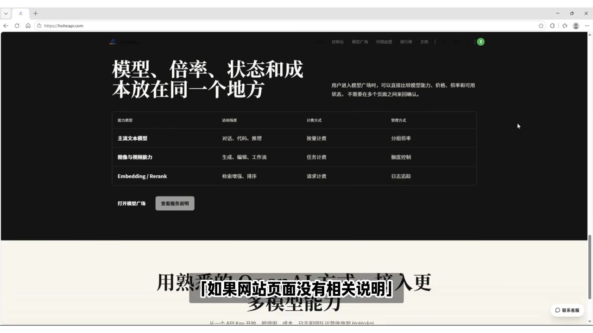

# 别再当韭菜了！终于找到了一个满血版api中转站，300+国内外大模型，比用官网省钱多了！

> 来源：[Bilibili 视频](https://www.bilibili.com/video/BV1z1V26NEXV) 
> UP 主：Ai学术小火龙｜时长：01:31｜合集：AIcode  
> 视频简介提及：`www.hohoapi.com`，并称其汇集“200+主流 AI 大模型”；而标题称“300+”，两处口径不一致，应以访问时平台实际模型列表、价格页和服务条款为准。

## 小结

视频并非演示某个 API 的具体接入代码，而是给出一套筛选 AI API 中转/聚合平台的五维检查框架：**稳定性、企业性质、专业度、模型支持（尤其是更新与分组）以及支付订阅方式**。UP 主以自己近期使用 Claude Code 的经历作为引入，主张不要仅依据“模型数量多”或“价格低”作决定。

稳定性方面，视频建议先看平台公开的接口监控或状态页面：若长期没有大量红色告警，可作为初步正向信号；同时关注高负载时是否频繁请求超时、连接中断。这里的“没有红色告警”只是观察指标，不等于服务可用性、数据安全或实际限流能力已经被证明。

在主体资质与服务保障方面，视频认为正规企业运营的平台通常能够开具发票、签订合作合同；若页面未明确展示，可向客服询问。对于个人开发者或企业采购者，这一维度分别关系到充值风险与财务、合同、售后流程的可追溯性。

模型能力的判断不应停留在“支持多少个模型”。视频建议同时核查主流厂商覆盖、模型是否及时更新，以及调用分组是否齐全。画面中可见模型广场/价格表式页面，并展示不同供应商、分组和模型条目；但视频没有提供独立压测、价格对比表、隐私政策审计或官方授权证明，因此“更省钱”“满血”“稳定高并发”等宣传性结论不能视作已验证事实。

这套方法适合正准备购买第三方 API 中转服务、需要多模型试用或希望使用国内支付方式的开发者。时效性很强：模型名称、上架状态、渠道、分组、价格、可用地区及支付能力都可能随时变化；尤其视频所说的具体新模型与价格，应在实际调用前重新确认。

## 思维导图

## 目录

- [背景：从 Claude Code 使用需求切入](#背景从-claude-code-使用需求切入)
- [五维筛选框架概览](#五维筛选框架概览)
- [稳定性与企业服务核查](#稳定性与企业服务核查)
- [专业度、模型更新与调用分组](#专业度模型更新与调用分组)
- [支付、订阅与实际选择步骤](#支付订阅与实际选择步骤)
- [结论、限制与时效性](#结论限制与时效性)
- [字幕比对](#字幕比对)
- [评论分析](#评论分析)
- [处理记录](#处理记录)

## 背景：从 Claude Code 使用需求切入 [00:28](https://www.bilibili.com/video/BV1z1V26NEXV?t=28)

ASR 在 00:28 开始识别到连续讲述。UP 主称自己近期一直在使用 **Claude Code**，并由此引出“如何挑选合适的 AI 中转站”这一主题。这里的核心问题是：当开发者不直接使用单一模型官方 API，而考虑使用聚合/中转平台时，应如何降低选择风险。

视频目标不是推荐一套固定配置，而是提出五项筛选维度：

1. 稳定性；
2. 企业性质；
3. 专业度；
4. 模型支持；
5. 支付与订阅方式。

> 图：画面以 “Claude Code” 与“如何挑选合适的 AI 中转站”为主题文字呈现视频问题意识。它有助于明确：视频讨论的是第三方 API 中转平台的选择方法，而非 Claude Code 的安装或编程教程。

### 前置理解：什么是视频所说的“中转站”

结合视频语境，“AI 中转站”指一个向用户提供统一接口、聚合多个模型或多个供应来源的平台。用户通常可以在同一控制台中充值、获取 API Key、选择模型并按量调用。视频将其价值归纳为模型覆盖与支付便利，但没有展开其底层路由、官方授权链路、数据保存策略或失败重试机制。

因此，使用这类服务前至少要区分以下三层信息：

- **平台声明**：页面上的模型列表、价格、分组、监控状态；
- **实际体验**：响应速度、并发、超时率、限流、上下文长度和工具调用兼容性；
- **合规与安全**：企业主体、合同、发票、隐私条款、密钥管理和数据处理范围。

## 五维筛选框架概览 [00:28](https://www.bilibili.com/video/BV1z1V26NEXV?t=28)

视频在开头明确给出五个判断维度。它们并非彼此替代，而应作为一套联合判断标准：平台即使模型多、报价低，如果频繁中断、无法获得合同发票或没有合适支付通道，仍未必适合长期使用。

> 图：关键帧以大字列出“稳定性、企业性质、专业度”，底部字幕还提到“模型支持”。该画面直接对应视频的筛选框架，是理解后续判断标准的总览依据。

| 维度 | 视频建议检查的对象 | 可回答的问题 | 视频未提供的验证内容 |
| --- | --- | --- | --- |
| 稳定性 | 接口监控页、告警状态、超时与中断 | 服务是否经常不可用？ | 历史 SLA、区域网络差异、独立压测 |
| 企业性质 | 发票、合同、客服说明 | 是否具备企业服务与采购支撑？ | 企业登记、授权范围、纠纷处理记录 |
| 专业度 | 主流模型覆盖程度 | 平台是否具有较完整的模型服务能力？ | 各模型真实能力与接口兼容性 |
| 模型支持 | 新模型上架、调用分组 | 是否能及时提供目标模型与线路？ | “官方/逆向”等分组的来源与稳定性 |
| 支付订阅 | 按量付费、国内支付、小额充值 | 是否方便试用与成本控制？ | 退款规则、余额有效期、税费与汇率成本 |

## 稳定性与企业服务核查 [00:28](https://www.bilibili.com/video/BV1z1V26NEXV?t=28)

### 1. 先观察接口监控与告警

UP 主提出的第一项是稳定性：查看平台的接口监控页面；若页面没有出现“大量红色告警”，则可初步认为站点较稳定。视频进一步将稳定表现描述为：即使长时间高负载调用，也基本不会频繁发生请求超时或连接中断。

> 图：画面对模型条目的“状态”区域进行放大，底部字幕为“如果页面里没有出现大量红色告警”。它说明视频建议把状态页/监控页作为第一轮筛选材料，而不是仅依赖宣传页。

这一判断可转化为可执行的检查步骤：

1. 打开候选平台的状态页、监控页或模型运行状态页。
2. 查看是否存在大面积故障颜色标识、持续告警或多个核心模型不可用。
3. 在目标模型、目标时段和目标网络环境下，用小额调用验证响应。
4. 记录常用请求是否出现连接中断、超时或异常错误。
5. 不要只根据某一时刻的绿色状态下结论；状态页面展示的是瞬时或有限历史信息。

视频没有给出成功率阈值、超时秒数、并发数、测试时长或 SLA 参数。因此，不能从素材推导出任何可量化的“稳定标准”。如果工作流依赖生产环境，应自行设计压测与降级策略。

### 2. 核查企业运营与服务能力

第二项是企业背书。视频称，正规企业运营的平台一般会支持开具发票、签订合作合同；若网站页面未写明，可直接咨询客服确认。UP 主的判断是：具备完整企业服务的平台会更有保障。

这项建议的实际价值在于：

- **财务合规**：发票能力影响报销、成本归集和企业采购流程；
- **合作可追溯**：合同可明确服务内容、结算与责任边界；
- **售后通道**：客服答复虽不是法律或技术保证，但可用于确认服务政策。

同时必须注意，能开票或能签约不自动等同于数据安全、服务稳定或模型来源合规。应进一步阅读合同、服务协议和隐私规则，并核实其所述主体与实际收款主体是否一致。

## 专业度、模型更新与调用分组 [00:28](https://www.bilibili.com/video/BV1z1V26NEXV?t=28)

### 3. 以主流模型覆盖评估平台专业度

视频第三点是“专业度”，其观察方法是模型覆盖情况：UP 主提到 Claude、Google、OpenAI、xAI 等主流模型，并认为支持得越全面，平台的专业能力越强。

这里应把“覆盖广”理解为候选指标，而非质量结论。一个模型列表可能包含不同版本、不同供应商、不同上下文限制或不同工具能力。真正调用前，还应确认：

- 模型 ID 与版本是否清晰；
- 输入/输出价格单位是否明确；
- 是否支持所需的视觉、推理、工具调用或流式输出能力；
- 接口协议是否与既有代码兼容；
- 是否标明供应商、分组和当前状态。

> 图：画面为 HoHoApi 的模型列表式页面，顶部可见“602 个模型”的页面计数，左侧含分组和供应商筛选项，列表中展示模型、价格、供应商、标签与分组等列。它说明视频关注的不只是模型名，还包括价格、供应商和分组等服务信息。该页面数字仅为画面当时显示，不能与标题的“300+”或简介的“200+”直接视为同一统计口径。

### 4. 重视新模型上线速度

视频将“模型更新速度”列为第四个重点，并称这一点“十分关键”。ASR 中提到应查看平台是否上线了“GPT 5.4”“Claude 4.6”等最新模型；其中具体名称受 ASR 专有名词识别误差影响，且视频没有给出官方发布链接或可复现的调用结果。

关键帧中能辨识到 `claude-opus-4-6` 条目，并显示：

| 画面可见字段 | 画面内容 |
| --- | --- |
| 模型名 | `claude-opus-4-6` |
| 输入价格 | `$3.5/1M` |
| 输出价格 | `$17.5/1M` |
| 分组文字 | 可见 `claude 分组`、`按量计费` 等字样 |
| 运行信息 | 局部可见“吞吐 52.4 tps”及状态图标 |

> 图：画面局部展示 `claude-opus-4-6`、输入/输出价格、分组和吞吐/状态信息，是视频关于“新模型是否上线”与“状态是否正常”的可视化例子。价格、吞吐和状态均为录屏瞬时信息，不能当作当前报价或持续性能承诺。

### 5. 查看调用分组是否完善

视频还建议看模型调用分组是否齐全。ASR 可较明确地识别出视频提到“微软分组”“Claude Code”“OpenAI 官方分组”等概念，但其中若干词存在识别混乱，无法据此还原每个分组的精确命名。

UP 主另称，某些“逆向分组”价格更实惠、性价比更高。对此应特别谨慎：

- 视频没有定义“逆向分组”的技术来源、授权关系和可用性保障；
- 更低价格可能对应不同线路、不同稳定性、不同限流或不同风险；
- 若业务涉及敏感数据、商业交付或长期生产使用，不宜仅因单价低就选择该分组；
- 应以平台当时公开说明、合同条款和实际测试结果判断。

ASR 后段还提到需要确认是否支持某个“热门新模型”，但模型名识别为“Cloud 2.0”，与常见命名不完全一致，缺乏站内字幕和清晰画面佐证，本文不将其作为已确认的具体模型名称。

## 支付、订阅与实际选择步骤 [00:52](https://www.bilibili.com/video/BV1z1V26NEXV?t=52)

视频最后一项、也是 UP 主称“最为重要”的一项，是支付和订阅方式。其推荐特征包括：

- **随用随付/按量付费**；
- **支持国内支付渠道**；
- **支持按需、小额充值**。

UP 主认为，即使平台支持按量付费，若无法使用国内支付方式，也不推荐。该观点主要面向需要国内支付便利性的用户；对于具备海外支付、企业采购渠道或已有官方账户的用户，这一限制的重要性会不同。

### 可复用的筛选流程

依据视频五维框架，可按以下顺序完成一次候选平台筛选：

1. **列出需求**
   - 需要哪些模型、哪些接口能力；
   - 是否要用于 Claude Code 等编码工作流；
   - 是否需要发票、合同、国内支付或团队协作。

2. **初筛模型能力**
   - 查询模型广场、价格页和分组页；
   - 检查目标模型是否存在，以及模型版本、供应商和价格是否清楚；
   - 不将“模型数量”作为唯一条件。

3. **检查稳定性**
   - 观察状态页和告警记录；
   - 对常用模型做小额、短时测试；
   - 记录超时、中断和错误类型。

4. **确认企业服务**
   - 查找开票、合同、服务协议与客服联系渠道；
   - 页面未明确时向客服确认；
   - 对企业场景，进一步确认收款、签约与开票主体。

5. **确认分组与更新能力**
   - 判断目标模型是否及时上架；
   - 了解各分组的定价、状态和适用场景；
   - 对来源与稳定性不清楚的低价分组保持审慎。

6. **最后处理支付与充值**
   - 确认是否按量计费；
   - 确认支付渠道和最低充值门槛；
   - 首次优先小额充值，避免在未测试前大额预付。

## 结论、限制与时效性 [01:16](https://www.bilibili.com/video/BV1z1V26NEXV?t=76)

视频的最终结论是：一个靠谱的 AI 中转站应同时具备运行稳定、正规企业资质、较专业的服务能力、及时且丰富的模型支持，以及灵活便捷的支付方式；同时支持按需小额充值会更符合试用和成本控制需求。

这一结论可迁移为一个简单原则：**先验证可用性和服务边界，再比较模型数量与价格；先小额试用，再决定长期投入。**

但素材本身存在以下限制：

1. **没有独立验证数据**：没有提供延迟、成功率、并发能力、故障历史、上下文上限或价格横向对比。
2. **没有接入教学**：未展示 API Key 创建、接口地址、鉴权头、SDK 配置、请求示例或 Claude Code 的具体配置步骤。
3. **没有安全与合规细节**：未说明日志保留、训练使用、数据跨境、密钥隔离、退款和争议解决政策。
4. **具体型号和数字存在时效性**：标题“300+”、简介“200+”、画面“602 个模型”属于不同来源和可能不同口径的表述；均不能替代访问当日的平台实际页面。
5. **ASR 专有名词误差较多**：如“Cloudy Code”“Cloud 2.0”等转写不能直接当作准确产品名；本文仅在有画面佐证时校正为 Claude Code 或保留不确定性说明。
6. **推荐关系需审慎看待**：视频简介明确给出 `www.hohoapi.com` 并称“up 自用”，视频内容亦以该类平台页面为例。观众应将其视为视频中的推荐/示例，而非经过本记录独立背书的结论。

## 字幕比对

| 字幕来源 | 完整性 | 专有名词 | 时间轴 | 主要问题 |
| --- | --- | --- | --- | --- |
| Bilibili 站内字幕 | 未提供可用字幕，无法比对 | 无法评估 | 无法评估 | 素材中未附站内 SRT 或可用字幕文本 |
| 本次 ASR 字幕 | 覆盖 00:28.180—01:30.300，诊断语音覆盖率为 68.58% | 存在较明显误识别 | 有 SRT 时间轴，但首段仅 0.12 秒却承载大量文本，分段粒度异常 | “Cloudy Code”“稳并性”“企业背书”“逆向分统”等词语存在错字或混淆；部分模型名无法可靠确认 |

### 最终字幕使用策略

本文以**本次 ASR 字幕**作为时间轴依据，因为没有可用站内字幕。ASR 诊断显示：

- 识别语言：中文；
- 模型：`medium`；
- 设备与精度：CUDA / float16；
- 识别到语音的起点：00:28.180；
- 识别到语音的终点：01:30.300；
- 未标记 `noAudioStream=true`，说明源视频存在音轨，不能将字幕问题归因为无音轨。

校正与保守处理如下：

- 画面明确写有 “Claude Code”，因此将 ASR 的 “Cloudy Code” 校正为 **Claude Code**。
- 画面标题写有“稳定性、企业性质、专业度”，因此将 ASR 的“稳并性”等明显错字统一整理为对应概念。
- `claude-opus-4-6`、输入 `$3.5/1M`、输出 `$17.5/1M`、以及页面显示“602 个模型”均有关键帧画面佐证；但它们仅代表录屏时的页面内容。
- 对“GPT 5.4”“Claude 4.6”“Cloud 2.0”及“逆向分组”等内容，保留为视频/ASR 所表达的说法或不确定描述，不将其扩展为已验证的外部事实。
- 章节链接优先使用 SRT 中真实存在的段起点 **28 秒、52 秒、76 秒**，未根据文本顺序虚构其他时间位置。

## 评论分析

当前仅获取到 1 条热评，未达到前三条；以下仅分析可获取内容，不将评论视为事实证明。

| 热评序号 | 评论内容 | 观点与信息价值 | 可信度与局限 |
| --- | --- | --- | --- |
| 1 | “还有类似的么” | 评论者在寻找同类平台，说明其关注点是替代选择，而非对视频所述平台的具体性能作出评价。 | 没有提供平台名称、使用经验、价格、稳定性或安全性证据，不能用于支持或反驳视频结论。 |

没有获取到第 2、3 条热评，因此不补造评论内容或观点。

## 处理记录

- Worker ID：`worker-mrj0www4-e8d79408`
- 整理模型：`gpt-5.6-terra`
- ASR 模型与参数：`medium`；中文自动识别；CUDA；float16；音频时长 `90.5810625` 秒。
- 使用素材：视频元数据、ASR 结果与 SRT、12 张关键帧路径、可获取评论 JSON。
- 字幕选择：站内字幕未提供可用版本；已检查本次 ASR，采用其真实 SRT 分段起点制作时间轴，同时依据画面纠正少量明显专有名词错误。
- 关键帧选择依据：
  - `frame-001.jpg`：呈现 Claude Code 与视频主题；
  - `frame-002.jpg`：直观展示五维筛选框架；
  - `frame-003.jpg`：展示以红色告警判断稳定性的例子；
  - `frame-004.jpg`：展示模型列表、供应商和分组信息；
  - `frame-005.jpg`：展示模型条目、价格、吞吐和状态。
- 缓存清理：素材仅提供处理完成状态，未提供缓存清理执行日志；因此不能声称已执行缓存清理。
- 未解决问题：
  - 缺少站内字幕，无法进行逐句交叉校对；
  - ASR 的首段时间跨度异常短且文本过长，无法据此进行更细粒度的逐句定位；
  - 无法从现有素材独立验证平台的模型数量、价格、授权来源、稳定性、隐私处理和“比官网省钱”等结论；
  - 视频发布时间及模型/页面信息具有高度时效性，使用前须重新核验。
