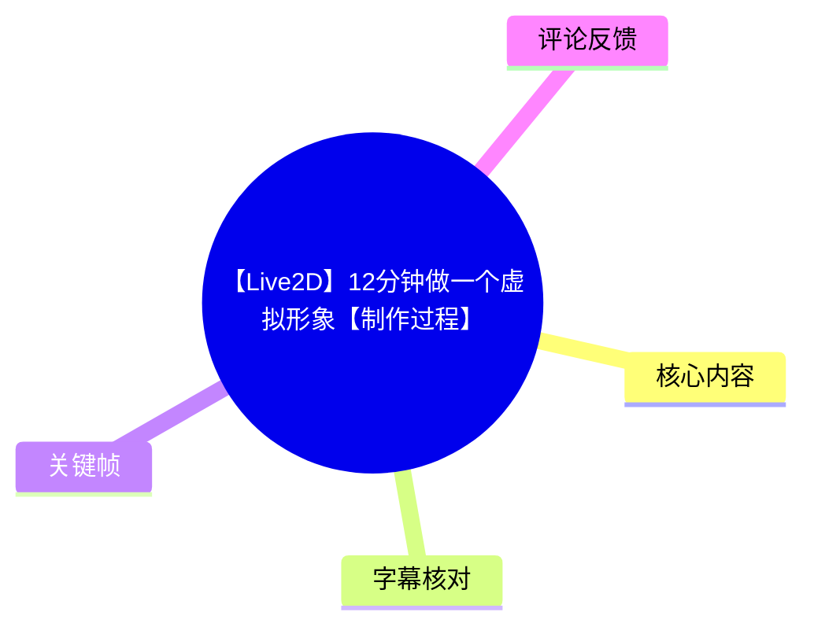
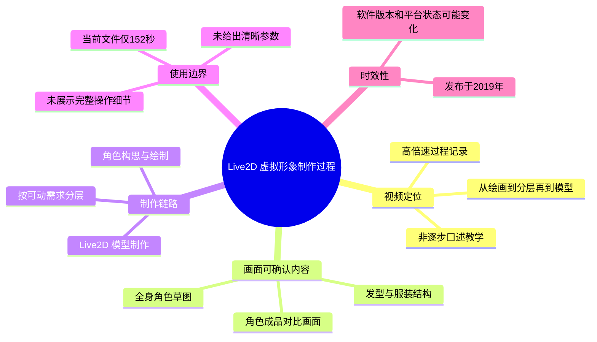
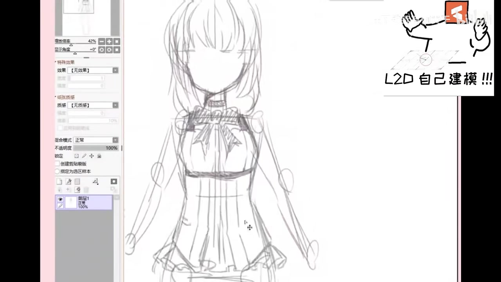
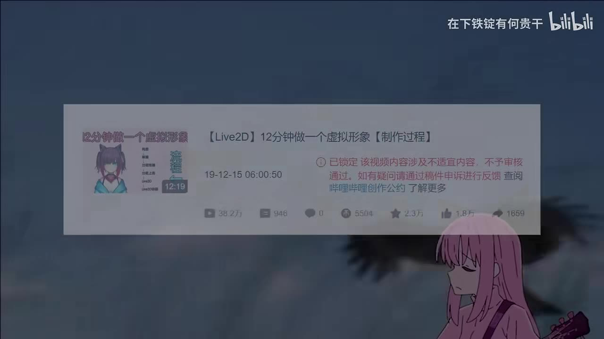
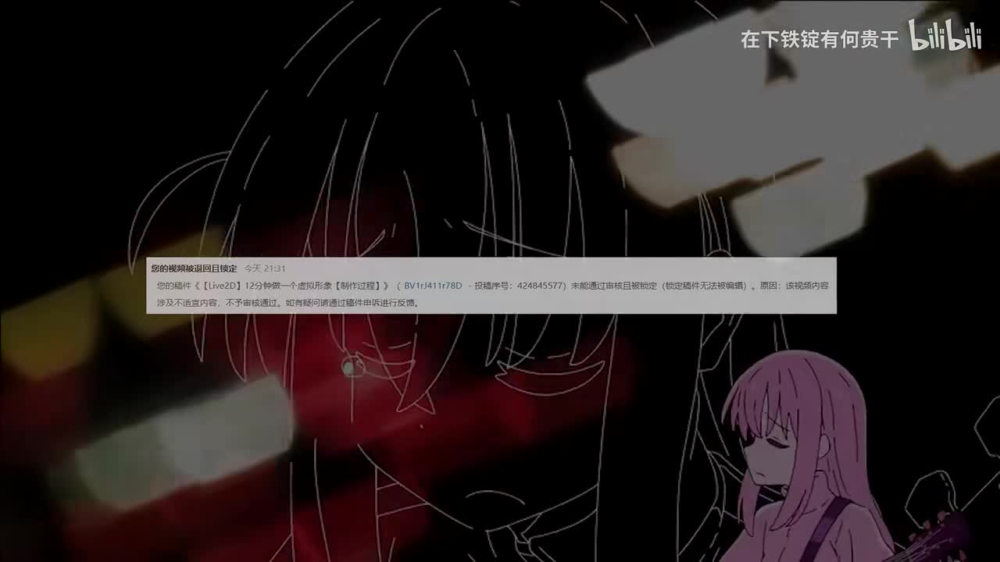

# 【Live2D】12分钟做一个虚拟形象【制作过程】

> 来源：[Bilibili 视频](https://www.bilibili.com/video/BV1rJ411r78D) 
> UP 主：铁锭Ferrum｜发布时间：2019-12-15｜当前素材时长：2 分 32 秒（152 秒）｜分辨率：1920×1080  
> 视频简介：已换源；以 **40 倍以上倍速**记录“从画→分层→到模型”的制作过程，希望供观众学习。  
> 标签：模型、虚拟偶像、绘画过程、虚拟UP主、制作过程、Live2D、FaceRig、VTuber。

## 小结

这是一支以高倍速呈现虚拟形象制作过程的视频。根据 UP 主简介，预期流程覆盖三项核心工作：**角色绘制、可动化所需分层、模型制作**。标题强调“12分钟”，但本次取得的视频文件实际时长为 152 秒；结合“已换源”和“40+倍速记录”的说明，应将其理解为浓缩的过程展示，而不是可逐步暂停复现的完整教程。

画面证据能够确认作者从一个正面、全身的人形草图开始：草图已经包含头发、五官预留区域、颈部饰物、上身服装、袖子、手臂与裙摆等结构。对于 Live2D 制作而言，这类前期设计决定了后续需要拆开的图层与可动范围；但视频素材中未提供清晰、可逐项读取的软件参数、网格设置、变形器配置或导出配置。

视频并非口述教学。ASR 仅识别到约 22.09 秒日语演唱/音乐人声，覆盖率为 14.58%，没有识别到能说明 Live2D 操作步骤的讲解。因此，正文对制作流程的归纳严格以视频标题、简介、标签及关键帧画面为限，不把未展示的软件操作、快捷键或参数补写为事实。

适合将本视频作为了解“二维角色如何从原画走向虚拟形象”的流程参考，尤其适合正在准备 VTuber/FaceRig 角色素材的人。若目标是独立完成建模，还需要另行查阅当前版本 Live2D Cubism 的官方文档或系统教程；本视频发布于 2019 年，软件界面、功能与运行环境均可能已经变化。

素材中还出现“视频被退回/锁定”等平台页面或二次剪辑画面。这些画面反映视频流传与换源语境，但不构成关于原作品状态、处理原因或平台规则的可验证结论。

## 思维导图

## 目录

- [视频背景、素材范围与时效性](#视频背景素材范围与时效性)
- [角色草图：制作的前置资产（00:00:05）](#角色草图制作的前置资产000005)
- [从绘制、分层到模型：视频声明的工作链路（00:00:31）](#从绘制分层到模型视频声明的工作链路000031)
- [成品形象与展示画面的信息边界](#成品形象与展示画面的信息边界)
- [可复用的准备步骤与限制](#可复用的准备步骤与限制)
- [数据、参数与未证实项](#数据参数与未证实项)
- [字幕比对](#字幕比对)
- [评论分析](#评论分析)
- [处理记录](#处理记录)

## 视频背景、素材范围与时效性

本视频由铁锭Ferrum 发布于 2019 年 12 月 15 日，标题为“【Live2D】12分钟做一个虚拟形象【制作过程】”。视频元数据显示其为单 P，当前采集文件时长为 152 秒。

UP 主在简介中明确给出如下范围：

1. 这是一段“从画→到分层→到模型”的制作记录；
2. 记录经过 **40 倍以上倍速**处理；
3. 目的为向观众分享、供学习参考；
4. 原说明提及“已换源”。

这决定了视频的知识类型：它更接近**创作过程缩时记录**，而不是带讲解、可直接照做的 Live2D 实操课。即使标题含有“12分钟”，本次素材对应的文件并非 12 分钟长，不能据此推算作者实际作画、切图或建模耗时。

### 时效性判断 [00:00:05](https://www.bilibili.com/video/BV1rJ411r78D?t=5)

- 视频发布于 2019 年，距本次素材获取时间已久。
- 标签中出现 FaceRig；该标签只能证明视频的主题关联，不能证明画面中一定展示了 FaceRig 的具体界面、版本或设置。
- Live2D Cubism 的版本、界面、导入导出流程以及常用面捕软件生态均可能发生变化。
- 当前素材未给出软件版本号、系统环境、画布尺寸、分辨率、图层数量、建模参数或导出格式，不能将现代教程中的具体设置反推为本视频的设置。

## 角色草图：制作的前置资产（00:00:05） [00:00:05](https://www.bilibili.com/video/BV1rJ411r78D?t=5)

ASR 的第一段可用时间轴从 00:00:05,900 至 00:00:24,590。该段文本为日语人声识别结果，内容不是制作解说；因此，本节的画面理解不依赖 ASR 文本，而依据关键帧中的绘图画面。

> 图：关键帧显示绘图软件中的正面全身角色线稿。角色具有长发、头部轮廓、颈部装饰、躯干、双臂及裙装轮廓；左侧可见软件的图层/属性区域。它直接证明视频至少包含角色原画/草图阶段，也是理解“从画到分层”这一流程起点的关键画面。

从该画面可见的角色设计信息包括：

- **构图**：角色采用正面站立的全身构图，便于以后围绕头部、躯干与双臂安排可动范围。
- **头部**：发型由多束刘海、头顶与两侧长发组成；这类彼此遮挡、运动方向不同的发束，是后续分层时需要重点考虑的对象。
- **服装**：颈部存在蝴蝶结/系带式装饰，上半身服装带有褶皱或饰边，腰部以下为裙摆结构。
- **四肢**：双臂处于自然垂放状态，草图中已经有手臂与袖部的轮廓关系。
- **绘制环境**：画面左侧存在图层/属性面板，但关键帧文字过小，无法可靠识别软件名称、图层名称、数量或混合模式。

对于可动立绘的前期资产而言，草图至少需要提前处理两个问题：

1. **遮挡关系**：例如刘海与脸部、头发与肩部、手臂与躯干、裙摆与腿部之间的前后关系。  
2. **动作余量**：当角色转头、摆动、呼吸或抬手时，原本被遮住的区域可能暴露；若原画没有补全这些区域，建模后容易出现空洞或断裂。

不过，上述两点是基于 Live2D 制作的一般性准备原则，对画面中草图的可用性作出的实践解释；视频没有通过字幕或旁白逐项说明作者实际如何拆分这些部分。

## 从绘制、分层到模型：视频声明的工作链路（00:00:31） [00:00:31](https://www.bilibili.com/video/BV1rJ411r78D?t=31)

第二段 ASR 时间轴为 00:00:31,790 至 00:00:35,190，依然识别为日语人声，未提供可用的操作语义。能可靠确认的流程名称来自 UP 主简介：“从画→到分层→到模型”。

可将作者明确声明的链路整理为：

| 阶段 | 视频/元数据可确认内容 | 对 Live2D 成品的意义 | 本素材未能确认的细节 |
| --- | --- | --- | --- |
| 绘制 | 出现正面全身角色草图；简介称“从画”开始 | 形成角色视觉设计与基础结构 | 是否完成线稿、上色、阴影及补图 |
| 分层 | 简介明确提及“分层” | 将不同可动区域拆成可编辑资产 | 图层命名、图层数量、拆分粒度、PSD 规范 |
| 模型 | 简介明确提及“到模型”；标题含 Live2D | 将二维分层资产用于虚拟形象呈现 | Cubism 版本、网格、变形器、参数与物理设置 |
| 使用场景 | 标签含虚拟UP主、Vtuber、FaceRig | 指向虚拟角色/面捕应用语境 | 是否实际导入 FaceRig、具体追踪效果及导出格式 |

### 这条链路的实际含义

“绘制—分层—模型”不是把一张完整插图直接导入建模软件即可完成：

- **绘制阶段**要确定角色外观与可动对象；
- **分层阶段**要把将来可能发生相对位移的对象分开保存；
- **模型阶段**才会把分层图像置入 Live2D 等建模环境，形成随参数变化的形变与运动。

视频的题名与简介使用“虚拟形象”“Live2D”“模型”等关键词，但没有给出“模型完成后支持哪些动作”的清单。因此，不能断言成品具备转头、眨眼、张嘴、呼吸、摇摆、表情切换或物理摆动等任一具体能力。

## 成品形象与展示画面的信息边界

> 图：关键帧呈现两名动漫风格角色的近景表情，其中左侧角色闭眼、右侧角色睁眼微笑。它有助于理解视频所指向的二次元虚拟形象视觉语境，但画面未标出软件界面或模型参数，不能单凭此图证明其为本视频最终 Live2D 模型效果。

> 图：关键帧包含视频页面式的信息卡及右下角角色插图，能辅助识别作品标题、日期与传播语境；但其中的统计数字、锁定提示或页面状态属于画面中的历史/剪辑内容，不能替代本次元数据，也不能据此推断当前平台审核结论。

> 图：关键帧出现一段“视频被退回且锁定”样式的通知叠层，背景为角色线稿和人物插图。该帧的价值在于说明视频素材中确有平台状态相关画面；但通知文字的具体原因与当前页面状态未获得独立证实，正文不将其延伸为平台规则事实。

画面中存在表现不同角色状态的插图、角色立绘以及平台提示类画面，但它们不能自动等同于“最终建模成果演示”。判断某一画面是否展示 Live2D 模型，通常至少需要看到以下可验证线索之一：

- Live2D Cubism Editor 中的模型、网格或参数面板；
- 面捕软件中的实时追踪输入与角色响应；
- 明确标注的模型导出、加载或运行界面；
- 连续可观察到的二维形变效果。

本次提供的关键帧中没有足够清晰、连续的上述证据。因此，本整理仅确认视频主题和作者声明的制作链路，不将静态角色画面误标为已验证的模型运行结果。

## 可复用的准备步骤与限制

### 可从视频主题迁移的准备顺序

以下顺序与视频简介的“画→分层→模型”一致；其中“分层检查”和“验证”是为使这条链路能够实际执行而列出的通用准备项，并非视频中逐字讲述的操作步骤。

1. **先完成角色设计**
   - 确定正面形象、发型、服装轮廓和主要装饰。
   - 像关键帧中的角色一样，先让头部、躯干、手臂与衣物的大体结构清楚可辨。
   - 优先处理将影响可动的重叠部位，例如刘海遮脸、长发压肩、袖子盖住躯干等。

2. **在分层前标出遮挡关系**
   - 区分前景与后景对象，而不是只按颜色或线稿分组。
   - 对可能露出的遮挡区域准备补绘空间。
   - 保留可单独移动或变形的对象，避免把未来需要相对运动的部件烘焙到同一张图中。

3. **把分层素材交给模型阶段**
   - 使用与目标工作流兼容的分层文件。
   - 在模型制作中再决定各部件如何被绑定、变形或响应参数。
   - 输出前应实际查看运动时的接缝、穿插和露白问题。

4. **按目标平台验证**
   - 若目标是虚拟主播或面捕应用，需要以目标运行环境的实际效果为准。
   - 标签虽包含 FaceRig，但视频素材没有提供可复用的 FaceRig 导入步骤；不能把标签当作操作指南。

### 视频本身无法解决的问题

- 如何从草图完成可用于建模的精细上色；
- 具体应拆成多少个图层；
- Live2D Cubism 中网格、变形器、参数与物理的配置方法；
- 嘴形、眨眼、头部角度等参数的数值范围；
- 模型文件如何导出并导入 FaceRig 或其他运行软件；
- 制作过程中实际使用的软件、版本、插件与硬件。

## 数据、参数与未证实项

### 可确认参数与事实

| 项目 | 内容 |
| --- | --- |
| 视频时长 | 152 秒；ASR 音频分析时长为 151.488 秒 |
| 分辨率 | 1920×1080 |
| 投稿时间 | 2019-12-15 |
| 流程描述 | 从画、分层到模型 |
| 倍速说明 | 40 倍以上倍速记录 |
| ASR 语言判断 | 日语，置信概率 0.9755859375 |
| ASR 有语音片段 | 2 段，合计约 22.09 秒 |
| ASR 语音覆盖率 | 14.58% |
| 站内字幕 | 未提供可用字幕 |

### 不能从现有素材确定的技术参数

以下项目在本次素材中均没有可可靠读取的值，故不作推测：

| 参数类别 | 未知内容 |
| --- | --- |
| 绘画资产 | 画布尺寸、分辨率、PSD 图层数、命名规则、补图范围 |
| Live2D 建模 | Cubism 版本、网格密度、变形器层级、参数名、参数范围、物理设置 |
| 表情与动作 | 是否含眨眼、张嘴、头部转动、呼吸、头发摆动、服装摆动 |
| 导出运行 | 导出格式、SDK/Viewer/FaceRig 的版本与导入配置 |
| 耗时 | 原画、分层和模型各自耗时；“12分钟”是否指原始版本或标题文案 |

## 字幕比对

| 字幕来源 | 完整性 | 专有名词 | 时间轴 | 主要问题 |
| --- | --- | --- | --- | --- |
| Bilibili 站内字幕 | 未提供可用站内字幕 | 无法评估 | 无 | 本次素材包中没有可用站内 SRT/字幕文本。 |
| 本次 ASR 字幕 | 较低：仅 2 段、覆盖约 22.09 秒 | 未识别出 Live2D、Cubism、FaceRig 等制作专名 | 可用：00:00:05,900–00:00:24,590；00:00:31,790–00:00:35,190 | 识别语言为日语，文本表现为音乐/演唱人声，不包含可靠的制作讲解；其余大部分时段无可用转写。 |

### 字幕采用结论

- 已检查本次 ASR 结果；诊断中**没有** `noAudioStream=true` 标记，因此不能说源视频没有音轨。
- ASR 检测到日语音频，首段语音始于 5.9 秒，末段语音止于 35.19 秒；但内容不是可用于技术整理的说明性口播。
- 因站内字幕缺失、ASR 又缺少制作语义，正文没有把 ASR 文本作为操作依据。
- 时间轴链接仅使用 ASR SRT 中可直接验证的起始时间：00:00:05 与 00:00:31。关键帧没有附带逐帧时间戳，故未为草图、角色展示或平台提示画面编造精确出现时刻。
- “绘制”“分层”“模型”“40+倍速”来自视频标题、简介和标签；“正面全身草图、头发/服装/手臂等结构”来自关键帧画面。未对模糊界面文字、软件名称或建模参数进行臆测性校正。

## 评论分析

仅分析本次可获取的热评前三条。三条评论均是观众感受或调侃，不能作为视频技术细节、实际工期或创作者能力的独立证据。

1. **药-九-九-九-----（3441 赞）**：“死在第一步（指构思）”
   - 观点：将创作难点归结为角色构思阶段。
   - 可提供的补充：呼应了视频从角色绘制开始的流程，说明观众普遍感到“有想法并落实为角色设计”是门槛。
   - 可信度边界：这是个人创作体验，不证明作者的实际构思过程或耗时。

2. **熊熊酱和安妮（2466 赞）**：“快住手啊 你这根本不是12分钟是12个月啊”
   - 观点：以夸张方式强调高倍速视频压缩了大量劳动时间。
   - 可提供的补充：与简介“40+倍速记录”相呼应，提醒观众不要将播放时长误认为实际制作时长。
   - 可信度边界：“12个月”是修辞，不是已验证的制作周期；当前文件时长 152 秒，也不能据此验证标题中的“12分钟”与原始版本的关系。

3. **一念流年丿（2099 赞）**：“手上人设千千万，唯有画技不过关”
   - 观点：认为角色设定再多，也需要绘画能力才能完成作品。
   - 可提供的补充：与视频展示的草图阶段相关，强调“设定”与“视觉实现”之间存在技能门槛。
   - 可信度边界：属于自我调侃式评价，不能推导出本视频的学习难度、作者技巧等级或可复制性。

## 处理记录

- Worker ID：`worker-mrj0www4-e8d79408`
- 模型：`gpt-5.6-terra`
- 素材与工具输出：已使用任务提供的元数据、视频信息、ASR 诊断与 SRT、热评 JSON、关键帧清单及关键帧画面理解；未额外虚构工具调用结果。
- 字幕选择：站内字幕未提供可用内容；已检查本次 ASR。ASR 含 2 段带时间戳的日语人声文本，但不含可用制作讲解，因此不作为技术步骤来源，仅用于验证可用时间轴锚点。
- 关键帧选择依据：
  - `frames/frame-004.jpg`：清晰呈现绘图软件中的全身角色草图，是“从画开始”的直接画面证据；
  - `frames/frame-003.jpg`：呈现角色表情状态，用于说明虚拟形象视觉语境及其证据边界；
  - `frames/frame-002.jpg`、`frames/frame-001.jpg`：呈现视频页面/平台提示相关画面，用于区分素材内历史画面与可验证元数据。
- 缓存清理：任务提供的素材清单未包含缓存清理执行日志；因此无法确认是否执行了缓存清理，未将其写为已完成。
- 未解决问题：缺少站内字幕、完整逐帧时间戳和清晰建模软件画面；无法确认实际软件版本、分层规则、模型参数、导出流程、最终可动效果及真实制作耗时。
