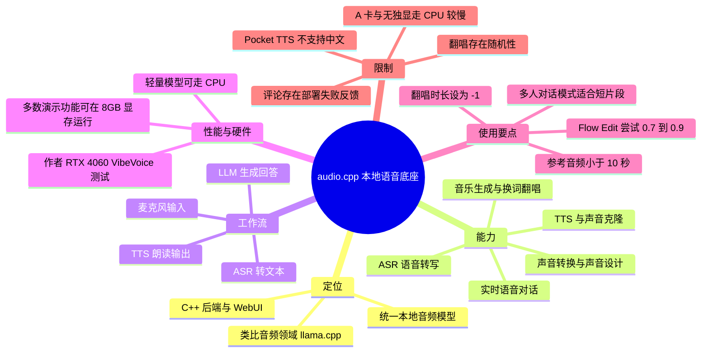
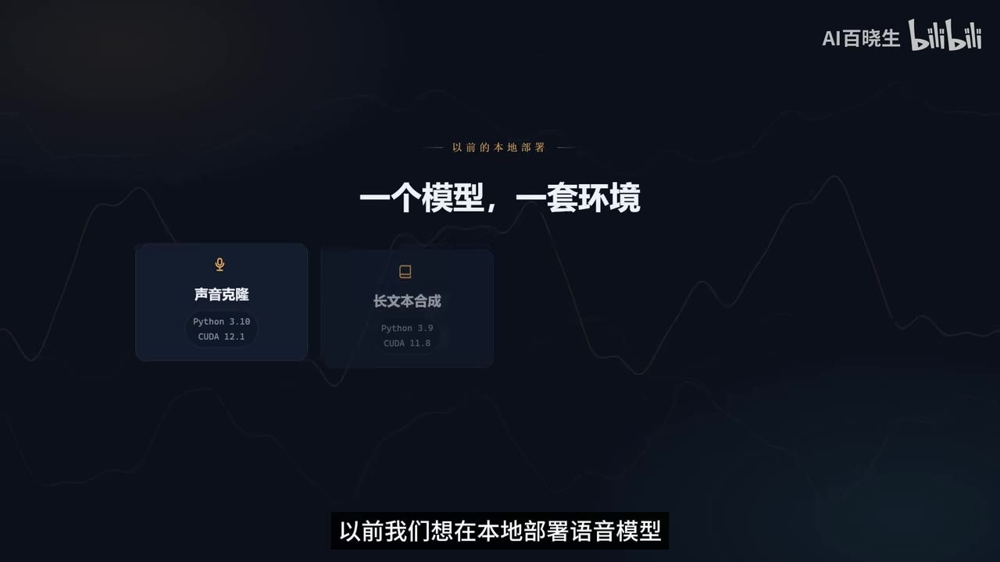
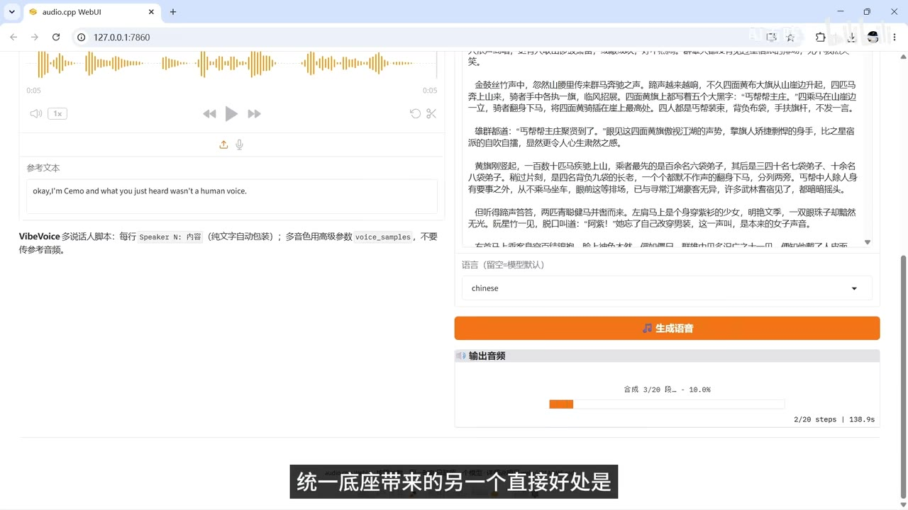
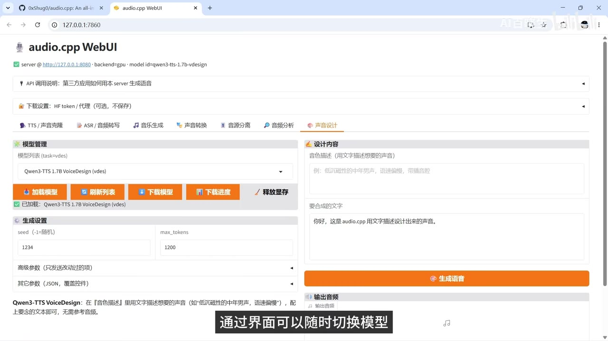
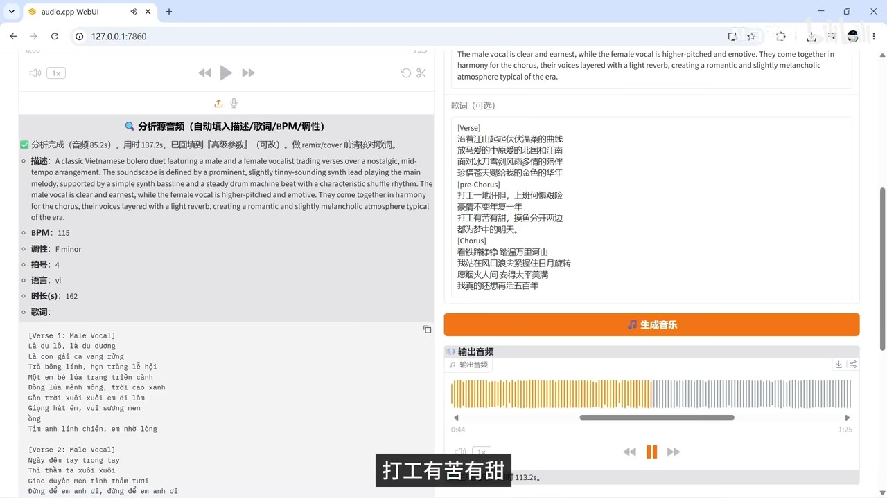

# 本地语音 AI 终于统一了！实时对话、声音克隆、AI 翻唱 8G 显存全跑通｜audio.cpp｜整合包

> 来源：[Bilibili 视频](https://www.bilibili.com/video/BV1geNg6bEt6)<br>
> UP 主：AI百晓生｜时长：11 分 27 秒｜合集：AIcode  
> 视频描述提供的项目地址：[kigner/audio.cpp-webui](https://github.com/kigner/audio.cpp-webui)  
> 视频描述提供的整合包：百度网盘链接（提取码 `scyx`，链接有效性未在本次素材中验证）

## 小结

视频介绍了 **audio.cpp**：一个试图将本地 TTS（文本转语音）、ASR（语音转写）、音乐生成、换词翻唱、声音/歌声转换、音频分析及声音设计统一到同一后端与 WebUI 中的 C++ 项目。UP 主将其类比为“音频领域的 llama.cpp”，重点不在单一模型，而在减少“一个模型配一套 Python/CUDA 环境”的部署负担。

视频的核心演示结论是：在 UP 主的 **8GB 显存笔记本**上，所演示的多数核心功能能够运行；部分轻量模型可由 CPU 运行。需要注意，这不是“所有模型均稳定适配 8GB 显存”的承诺：音乐翻唱界面中显存显示可能超过 8GB，UP 主称其测试中仍可完成；模型、输入长度、驱动与显存管理都会影响实际结果。

技术上，audio.cpp 提供本地音频层能力：麦克风音频经 ASR 转文本，再交由本地 LLM（如 Ollama）或外部 API 生成回复，最后通过 TTS 朗读。UP 主称该服务使用 **OpenAI 兼容接口**，因此支持相应接口形式的本地应用可直接接入 TTS/ASR 服务；视频还展示了 OpenMagic AI 调用该本地 TTS 服务的案例。

实操方面，视频给出了声音克隆、ASR、实时语音、ACE Step 换词翻唱与整合包启动的具体顺序。特别重要的经验包括：参考音频建议控制在 **10 秒以内**；首次合成先保持默认参数；多人 ASR 的“对话模式”更适合短片段；翻唱时将时长设为 `-1`、操作类型选 `Remix`，并按结果调整生成步数或 `Flow Edit` 参数。

性能数字均为视频作者或官方陈述，不能直接泛化为所有硬件上的基准：UP 主称在 RTX 4060 上，使用 VibeVoice 合成近 1 万字小说时，官方程序耗时 110 分钟，而 audio.cpp 耗时 29 分钟；官方在 RTX 5090 上的比较则被描述为多数模型快 1～3 倍、个别快 8～10 倍。热评中同时出现“无法使用”的反馈，表明整合包的易用性与兼容性仍需按自身环境验证。

本视频发布于 2026 年，涉及的模型接入数量、WebUI 参数、整合包内容、下载链接和 API 行为可能随项目更新而变化。视频称当时已有 **21 个可直接下载的模型家族**，但这不是当前仓库状态的实时保证。

## 思维导图




## 目录

- [背景：本地音频模型的环境碎片化](#背景本地音频模型的环境碎片化)
- [统一底座、硬件门槛与性能说法](#统一底座硬件门槛与性能说法)
- [TTS 与声音克隆](#tts-与声音克隆)
- [ASR：转写、多人对话与歌词识别](#asr转写多人对话与歌词识别)
- [本地实时语音系统与 OpenAI 兼容接口](#本地实时语音系统与-openai-兼容接口)
- [音乐生成与换词翻唱](#音乐生成与换词翻唱)
- [声音转换、音频工具与声音设计](#声音转换音频工具与声音设计)
- [整合包启动与实时语音配置](#整合包启动与实时语音配置)
- [结论、限制与时效性](#结论限制与时效性)
- [字幕比对](#字幕比对)
- [评论分析](#评论分析)
- [处理记录](#处理记录)

## 背景：本地音频模型的环境碎片化 [00:27](https://www.bilibili.com/video/BV1geNg6bEt6?t=27)

UP 主提出的痛点是：过去本地部署声音克隆、文本合成、AI 翻唱和实时语音等能力，往往需要“一个模型、一套环境”。不同项目的 Python 版本、PyTorch 版本与 CUDA 依赖不同，实际困难往往不是模型本身不能推理，而是依赖环境相互冲突、维护成本过高。

audio.cpp 的定位是把多个音频任务放到统一后台中，通过网页界面切换和下载模型。视频将它类比为运行本地大模型时的 Ollama/llama.cpp 式体验，但该类比是帮助理解产品定位，不能理解为它与这些项目具有相同实现或兼容范围。



> 图：该关键帧用于呈现“一个模型，一套环境”的部署困境。它有助于理解本视频为什么将统一后端而非单一声音模型视为主要价值。

### 视频中列举的统一能力 [00:51](https://www.bilibili.com/video/BV1geNg6bEt6?t=51)

视频明确列出被纳入同一后台的方向：

| 能力类别 | 视频中的用途或说明 |
| --- | --- |
| TTS / 文本转语音 | 根据文本合成语音；可使用参考音频进行声音克隆。 |
| ASR / 语音转文字 | 转写单人语音、短多人对话与歌词。 |
| 实时语音 | 串联 ASR、LLM、TTS 形成语音交互。 |
| 音乐生成 | 生成背景音乐，视频推荐 Stable Audio。 |
| 换词翻唱 | 用 ACE Step 分析歌曲后，以原旋律/结构为基础生成新歌词版本。 |
| 声音转换 | 保持内容和语气大致不变，改变音色。 |
| 歌声转换 | 与声音转换逻辑相近，但 UP 主对高质量结果仍推荐 RVC 流程。 |
| 音频工具 | 人声分离、实时语音检测、多人对话识别等。 |
| 声音设计 | 无需参考音频，仅用文字描述目标音色和表达方式。 |

## 统一底座、硬件门槛与性能说法 [01:15](https://www.bilibili.com/video/BV1geNg6bEt6?t=75)

视频称，当时 audio.cpp 已接入 **21 个可直接下载使用的模型家族**，另有一批模型仍在测试。该数字属于视频制作时的项目状态，后续仓库和整合包可能已发生变化。

### 硬件边界

- UP 主称其演示的**大部分核心功能**可在 **8GB 显存**设备上运行。
- 一些小模型不需要独立显卡，可以用 CPU 推理。
- 后续整合包说明中称，支持 NVIDIA 16～50 系列显卡；AMD 显卡与无独显设备将自动走 CPU 模式。
- CPU 模式可运行部分轻量模型，但速度会明显变慢。
- 这些结论均来自视频演示与作者描述，未提供完整的系统版本、驱动、模型量化方式、输入规模与重复测试条件，不能视为普适性能承诺。

### 视频中的性能数据 [01:39](https://www.bilibili.com/video/BV1geNg6bEt6?t=99)

| 场景 | 视频陈述 | 解读与边界 |
| --- | --- | --- |
| 官方 RTX 5090 对比 | 多数模型相较各自原生推理框架快 1～3 倍，个别快 8～10 倍。 | 未给出完整测试表、版本与模型清单；仅应作为官方展示结果。 |
| UP 主 RTX 4060 测试 | 用 VibeVoice 合成约 1 万字小说：官方程序约 110 分钟，audio.cpp 约 29 分钟。 | 同一文本的作者个人测试；可说明该组合具有加速潜力，但不能推导到其他模型或硬件。 |
| 长文本推理显存 | VibeVoice 合成近 1 万字期间，显存未超过 7GB。 | 是 UP 主单次观察，不等同于最大显存上限。 |



> 图：该关键帧展示网页界面中的长文本合成和进度信息，可辅助理解视频所说的长文本 TTS 与显存占用测试场景；它不是独立可复现的性能报告。

## TTS 与声音克隆 [02:27](https://www.bilibili.com/video/BV1geNg6bEt6?t=147)

视频在 TTS 标签页中介绍了 Pocket TTS 和 Qwen3-TTS 0.6B，并称二者都支持参考音频，因此可以实现基于短参考语音的声音克隆。画面中还可见 Qwen3-TTS VoiceDesign 类模型的界面，说明 WebUI 的实际可选模型可能多于口播列举项；具体型号应以使用时模型列表为准。

### 基础操作步骤

1. 在模型列表中选择所需 TTS 模型。
2. 点击“加载模型”，等待加载完成提示。
3. 选择或上传参考音频。
4. 输入要合成的文本。
5. 点击生成并试听输出。

UP 主称，短句场景下的声音克隆通常可以“秒生成”，但没有给出统一的音频长度、显卡、批次或延迟测量方法，因此应理解为演示体验而不是固定 SLA。

### 模型与语言限制 [02:51](https://www.bilibili.com/video/BV1geNg6bEt6?t=171)

- **Pocket TTS 不支持中文**。要生成中文语音，视频建议切换到 **Qwen3-TTS 0.6B**。
- 视频认为 Qwen3-TTS 0.6B 参数量较小但合成表现不错，并称两款模型显存占用都较小，适合低配显卡及无独显设备。
- 对刚开始使用者，建议先保留合成设置的默认值，先确保模型可用和试听效果，再调整温度、采样等参数。
- 视频提到一个名称近似为“Vocos CPM2”的模型（ASR 专有名词识别存在不确定性），称其支持国内大部分方言且可克隆语气；该模型的准确名称应以项目模型列表或 UP 主此前视频为准。
- VibeVoice 被作为长文本合成能力的示例模型。

### 参考音频的关键经验 [04:04](https://www.bilibili.com/video/BV1geNg6bEt6?t=244)

> **参考音频建议控制在 10 秒以内。** 视频称参考音频过长会明显拖慢合成速度。

对于常用的参考音频，视频给出的复用方式是：

1. 将音频文件放入 WebUI 下的 `Voice` 目录。
2. 在视频所指的对应文件中写入“文件名—对应文本”的映射。
3. 刷新列表后，直接在界面选择该参考音频。
4. 这样可以减少反复临时上传和手工录入参考文本的操作。

素材未给出该映射文件的确切文件名、格式或路径层级，实践时不能凭空假定其为某一固定 JSON/CSV 文件，应查看整合包实际说明和目录结构。



> 图：该关键帧展示 audio.cpp WebUI 中的模型加载、生成设置及声音描述输入区域，说明界面化操作是整合包降低门槛的主要方式之一。

## ASR：转写、多人对话与歌词识别 [04:28](https://www.bilibili.com/video/BV1geNg6bEt6?t=268)

视频将 ASR 作为第二项核心能力。UP 主个人常用模型为 **Qwen3-ASR**（ASR 中出现“千分三”的误识别，结合上下文按 Qwen3-ASR 记录），并称其支持中英文、速度较快；实时语音系统中的声音转文本也使用了该模型。

### 视频给出的 ASR 能力与限制

| 场景 | 操作或结果 | 限制 |
| --- | --- | --- |
| 常规单人语音 | 在 ASR 标签中转写音频。 | 视频称单人转写没有长度限制。 |
| 多人对话 | 勾选“对话模式”，输出带说话人序列的文本。 | 对话模式存在长度限制，更适合短对话片段。 |
| 歌词提取 | 可识别歌词，供后续换词翻唱使用。 | 视频建议识别后进行人工校对。 |
| 参考音频文本 | 可先通过 ASR 转写，减少声音克隆时手填文本。 | 转写准确度仍受音质、语言、多人重叠等影响。 |

视频实例中，一段两分多钟音频的转录耗时为 **21 秒**。该数值未给出音频精确时长、硬件、模型参数及是否包含加载时间，适合当作作者现场示例，而不是严谨的实时倍率指标。

## 本地实时语音系统与 OpenAI 兼容接口 [05:17](https://www.bilibili.com/video/BV1geNg6bEt6?t=317)

UP 主认为，TTS 与 ASR 被统一后最有价值的用途是构建实时语音系统。视频演示中，语音识别和语音合成均在本地运行，而大语言模型可在云端。作者认为这样能在响应速度、隐私和灵活性之间取得平衡。

### 基本链路

```text
麦克风输入
  → ASR：语音转文本
  → LLM：生成回答
  → TTS：将回答朗读为语音
  → 音频播放
```

视频中的对话演示称，从用户说完话到系统开始回答大约 **1 秒**；如果是“一问一答”，延迟会更低。此处“更低”的具体数值没有提供，且端到端延迟会受到麦克风分段、ASR、LLM 首 token、TTS 首包、网络和播放缓冲共同影响。

### LLM 可本地也可云端 [06:05](https://www.bilibili.com/video/BV1geNg6bEt6?t=365)

视频强调：audio.cpp 的本地化重点在“听”和“说”的音频层，而非强制将 LLM 也本地化。LLM 部分可以：

- 接入本地 Ollama 运行的模型；
- 接入用户订阅的外部 API；
- 在实时语音配置中替换为自己的模型服务。

### 服务接口与应用接入 [06:29](https://www.bilibili.com/video/BV1geNg6bEt6?t=389)

UP 主称 audio.cpp 使用 **OpenAI 兼容接口**。对支持这种接口格式的其他本地应用，可填写：

- TTS 服务地址；
- TTS 模型名称；
- ASR 服务地址；
- ASR 模型名称；
- 用于朗读的声音配置。

视频以 OpenMagic AI 为例：该应用只能填写 URL 与模型名称、不能传参考音频，因此 UP 主在后台单独启动了一个 audio.cpp 服务，并在启动时携带参考音频；随后 OpenMagic AI 调用该服务并成功返回语音。

这说明“能否从外部应用动态切换声音或参考音频”取决于调用端的字段能力与服务端接口实现。热评也提出了“API 调用切换模型”的需求，表明这一流程仍可能需要手工加载模型。

## 音乐生成与换词翻唱 [07:17](https://www.bilibili.com/video/BV1geNg6bEt6?t=437)

视频认为音乐生成和换词翻唱是 audio.cpp 的另一项强项：它不仅整合 TTS、ASR，还开始将原本较重的音乐模型纳入同一底座。

UP 主以 **ACE Step** 为例称，自己此前在 8GB 显存设备上无法运行翻唱，曾改在云端服务中演示；而此视频中使用 audio.cpp 已能在本地完成。这里应理解为该特定软件版本、模型和输入下的实测结果，并不代表所有歌曲、所有显卡或所有翻唱设置均可稳定完成。

### ACE Step 换词翻唱步骤 [08:00](https://www.bilibili.com/video/BV1geNg6bEt6?t=480)

1. 上传要翻唱的原歌曲。
2. 点击“分析”。
3. 等待分析完成：视频给出的等待范围为**几十秒到几分钟**，取决于歌曲长度。
4. 将“合成翻唱时长”设为 `-1`。
5. 打开高级参数。
6. 将操作类型选择为 `Remix`。
7. 等待系统自动填入歌曲风格、曲谱等分析信息；视频建议不要手动改动这些自动结果。
8. 填写原曲歌词。
9. 将上方的原曲描述复制到提示词区域。
10. 填写新的翻唱歌词并生成。



> 图：该关键帧展示翻唱工作流所需的分析结果、歌词输入和“生成音乐”区域，能够对应“先分析、再填歌词和提示词”的操作顺序。

### 翻唱调参与不确定性 [08:24](https://www.bilibili.com/video/BV1geNg6bEt6?t=504)

视频给出的经验如下：

| 问题或目标 | 建议 |
| --- | --- |
| 显存看起来超过 8GB | UP 主称其测试不会爆显存且可跑完，但仍应留出系统显存余量并自行验证。 |
| 结果随机性大 | 多尝试几次。 |
| 音质不佳 | 可适当增加生成步数。 |
| 新歌词唱不准或唱不出来 | 尝试将 `Flow Edit` 从 `0.7` 调至 `0.9`。 |
| 只需背景音乐 | 视频推荐 Stable Audio，认为其比 ACE Step 更稳定。 |

其中“更稳定”是作者的实际使用评价，未给出成功率或盲测数据。换词翻唱也可能涉及原曲、歌词和音色相关权利，视频没有展开版权许可问题；实际发布或商用前应自行确认授权范围。

## 声音转换、音频工具与声音设计 [08:48](https://www.bilibili.com/video/BV1geNg6bEt6?t=528)

### 声音与歌声转换

视频将声音转换解释为“音色迁移”：在尽量保持原说话内容和语气不变的前提下，改变声音音色。歌声转换使用相近逻辑，但 UP 主称如果追求较高质量，仍更推荐此前的 **RVC** 流程。

执行歌声转换前，视频建议先做人声分离；audio.cpp 的“音频分离”标签页中提供相应模型。该建议的意义是降低伴奏和混响对人声转换的干扰，但具体分离效果仍取决于原始音频质量和所选模型。

### 音频分析和声音设计 [09:10](https://www.bilibili.com/video/BV1geNg6bEt6?t=550)

视频列举的工具能力包括：

- 实时语音检测；
- 多人对话识别；
- 声音设计。

“声音设计”与声音克隆类似，但**不需要参考音频**。用户可直接用文本描述目标声音，例如“磁性的中年男声、语速偏慢、播音腔”，模型据此生成语音。UP 主认为该功能适合临时配音。

需要区分的是：声音设计生成的是对文字描述的模型化响应，不保证能精确复刻某一真实人物的声音；视频也没有给出其一致性、情绪控制精度或商用授权政策。

## 整合包启动与实时语音配置 [09:52](https://www.bilibili.com/video/BV1geNg6bEt6?t=592)

audio.cpp 本身是 C++ 项目，视频称官方目前主要以命令行方式使用。为降低非技术用户门槛，UP 主制作了带界面的整合包，主张“解压即可使用”。

### 硬件与平台说明

- 支持 NVIDIA 16～50 系列显卡（视频说法）。
- AMD 显卡与无独显设备自动使用 CPU。
- CPU 推理速度更慢，但可运行部分轻量模型。
- 视频没有提供 Windows 版本、驱动版本、CUDA 版本、磁盘空间、联网下载模型需求和各模型 CPU 可用性的完整矩阵，因此安装前仍需查看整合包当前文档。

### 启动 WebUI 与实时语音的顺序 [10:16](https://www.bilibili.com/video/BV1geNg6bEt6?t=616)

1. 在整合包中运行 `Run Web UI`，启动网页界面。
2. 在 WebUI 内下载并加载要使用的模型。
3. 若要体验实时语音，先在 WebUI 加载模型。
4. 再启动 ASR 服务。
5. 最后运行实时语音启动项（视频口播识别为“一装 Real Time”，实际文件名以整合包为准）。
6. 在配置中修改所接入的大语言模型。
7. 若使用 DeepSeek，则把 API Key 替换为自己的密钥。

视频称整套源码已开源，并指向 GitHub 地址；遇到问题或希望增加功能可在评论区反馈，UP 主表示会收集并定期更新版本。更新频率和问题响应时限未作承诺。

## 结论、限制与时效性 [10:40](https://www.bilibili.com/video/BV1geNg6bEt6?t=640)

audio.cpp 在视频中的价值主张可以概括为：让本地语音能力从彼此独立的模型项目，变成一组可共享后端、页面入口和接口形式的服务。对普通用户，重点是减少环境安装和模型切换成本；对开发者，重点是通过 OpenAI 兼容接口将本地“听、说”能力接入 Agent 或其他应用。

但使用时应保留以下边界意识：

1. **8GB 显存不是全功能保证。** 视频只称大部分演示核心功能能跑，且翻唱的显存管理具有特殊表现；不同模型、时长与驱动环境结果不同。
2. **模型支持会变动。** “21 个模型家族”、可下载项、模型版本、接口字段均是视频制作期信息。
3. **中文模型需选对。** Pocket TTS 不支持中文；中文语音应改用视频建议的 Qwen3-TTS 等模型。
4. **多人 ASR 有长度限制。** 单人转写与对话模式的能力边界不同。
5. **翻唱结果并不确定。** 随机性较大，歌词可懂度与音质需通过步数、`Flow Edit` 和多次生成调整。
6. **整合包仍可能存在兼容问题。** 热评已有用户表示下载后无法使用；这不能证明项目整体不可用，但说明“解压即用”须结合具体环境核验。
7. **声音、歌曲与文本素材需关注权利。** 视频侧重技术流程，未说明授权策略；涉及他人声音、原曲或商用发布时，应独立确认合法性与平台规则。

## 字幕比对

| 字幕来源 | 完整性 | 专有名词 | 时间轴 | 主要问题 |
| --- | --- | --- | --- | --- |
| Bilibili 站内字幕 `p01-ai-zh.srt` | 严重不完整，仅覆盖约 00:00～01:04，且内容与视频主题无关。 | 不可用，出现聚会、输入法、歌曲歌词等非本视频内容。 | 有真实 SRT 时间段，但对应的是错误/错配文本。 | 明显错配到其他视频或内容，不能用于正文事实提取。 |
| 本次 ASR（large-v3-turbo） | 覆盖 00:00～11:19，语音覆盖率约 90.95%，是本视频的主要文本来源。 | 存在音译和错词，如“Nama CPP”“欧拉玛”“千分三”“实施语应”等。 | 有真实时间戳，ASR 时长 686.016 秒，与视频 687 秒接近。 | 若干约 9～11 秒的无语音/音乐或演示间隔；专名和部分 UI 文件名需要结合上下文谨慎校正。 |

### 最终字幕选择

正文以**本次 ASR 时间轴字幕**为主，因为它与视频主题、时长和内容一致；所有章节时间链接均按 ASR SRT 的真实分段起点换算为秒数。站内字幕虽有时间轴，但内容显著错配，因此未被采用为事实依据。

本次 ASR 诊断中**未标记 `noAudioStream=true`**，且检测到中文音轨：识别语言为 `zh`，语言概率约 `0.9985`，故不存在“源视频无音轨”的情况。

结合视频上下文、元数据和界面关键帧，对以下 ASR 词语进行了保守校正或保留说明：

| ASR 原文 | 正文处理 | 依据 |
| --- | --- | --- |
| `Audio CPP` / `Nama CPP` | `audio.cpp` / `llama.cpp` | 视频标题、描述中的 GitHub 地址及上下文类比。 |
| `欧拉玛` | `Ollama` | 上下文为本地大语言模型运行工具。 |
| `千分三 ASR` | `Qwen3-ASR` | 与 Qwen3-TTS 的连续模型命名及上下文相符；仍以项目实际列表为准。 |
| `Vocus CPM2` | 保留为名称不完全确定的“Vocos CPM2”表述 | 仅有 ASR 音译，素材不足以严格确认官方拼写。 |
| `UIL` | `URL` | 上下文为外部应用填写服务地址。 |
| `一装 Real Time` | “实时语音启动项，实际名称待以整合包为准” | ASR 无法可靠还原文件名。 |

## 评论分析

以下仅分析本次可获取的热评前三条。评论反映的是用户体验或需求，不构成对软件功能、性能或稳定性的已验证结论。

1. **地狱霹雳火（3 赞）**  
   评论称下载尝试后“根本不好使”，并已删除。该反馈为整合包可用性提出了负面个案：可能涉及硬件、驱动、下载文件、依赖、端口或操作步骤，但评论没有提供报错、系统配置和复现路径，无法据此定位原因。它与视频“解压就能用”的宣传形成张力，建议实际部署前保留排错预期。

2. **椰皇煲汤（2 赞）**  
   评论希望增加“API 调用切换模型”的功能：当前 API 调用 ASR 后，再调用声音克隆时，仍需回到 WebUI 手动切换并加载模型。该评论补充了视频接口展示中未解决的工作流细节——“提供 API”不必然意味着能无状态、自动化地切换所有模型。此为用户功能请求，不能确认项目目前是否已经实现。

3. **逢坂大河Taiga（1 赞）**  
   评论称已实际使用，并认为速度“比 IndexTTS 快多了”。这是正向的个人体验，方向上与视频对性能提升的主张一致；但没有给出显卡、文本长度、模型参数、版本和测量方式，不能替代可复现的横向 benchmark。

## 处理记录

- **Worker ID**：worker-mrj0www4-e8d79408
- **模型**：gpt-5.6-terra
- **调用工具与素材**：视频元数据、站内 SRT `p01-ai-zh.srt`、本次 ASR 结果 `asr/asr-result.json`、ASR SRT `asr/transcript.srt`、关键帧目录 `frames/`、热评数据 `comments/comments.json`。
- **字幕选择**：检查了站内字幕与本次 ASR。站内字幕内容错配且仅覆盖开头约 64 秒；采用带真实时间戳、覆盖约 11 分 19 秒的本次 ASR 作为主时间轴来源，并对可由标题、描述、上下文与界面佐证的专名作保守校正。
- **关键帧选择依据**：选择与正文任务直接相关的 WebUI、环境碎片化、长文本合成和翻唱操作画面，用于辅助解释界面结构、操作位置和演示场景；图片仅作视频画面证据，不将其扩展为画面未显示的性能或兼容性结论。
- **缓存清理**：素材清单未提供缓存删除或清理执行日志；本记录不虚构清理结果，记为“未提供清理回执”。
- **未解决问题**：无法从现有素材严格确认“Vocos CPM2”的官方拼写、实时语音启动项的实际文件名、整合包当前版本兼容性、下载链接可用性，以及所有模型在不同硬件上的复现性能。
