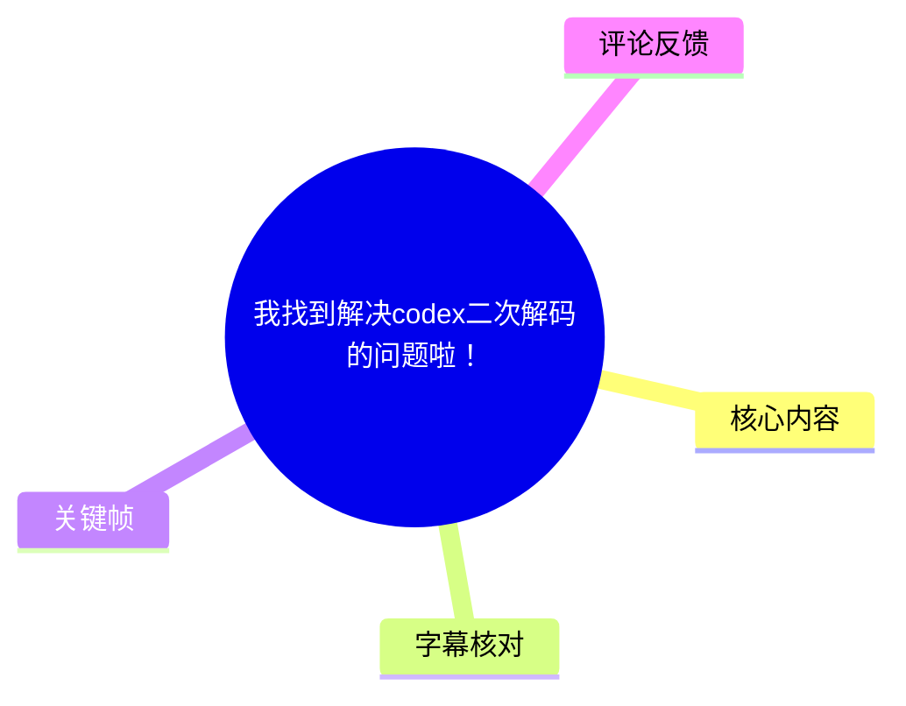
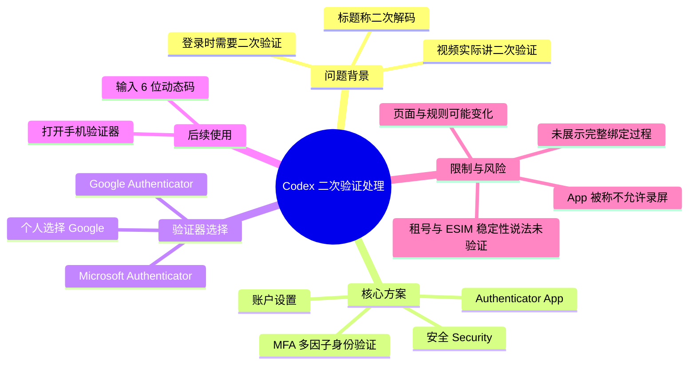
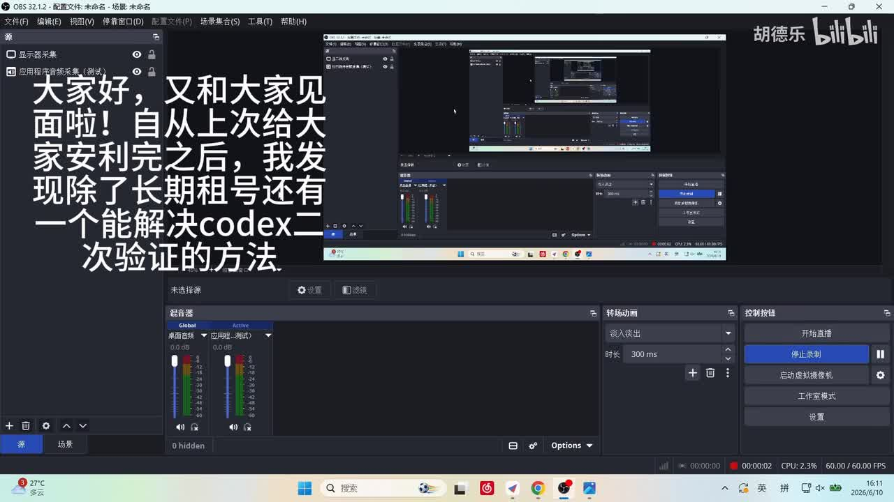
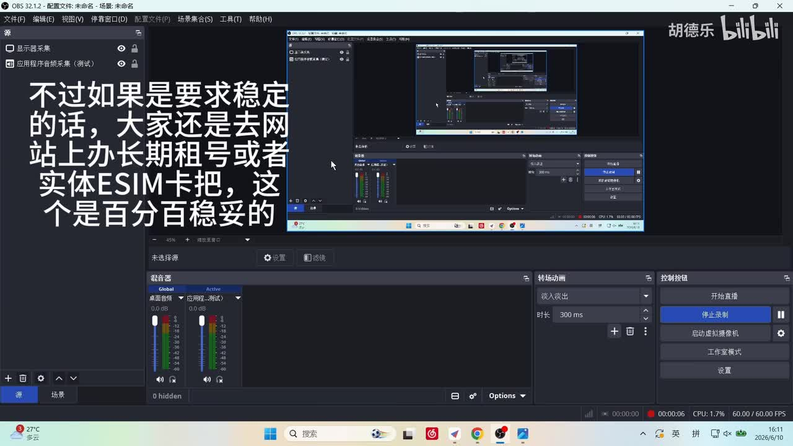
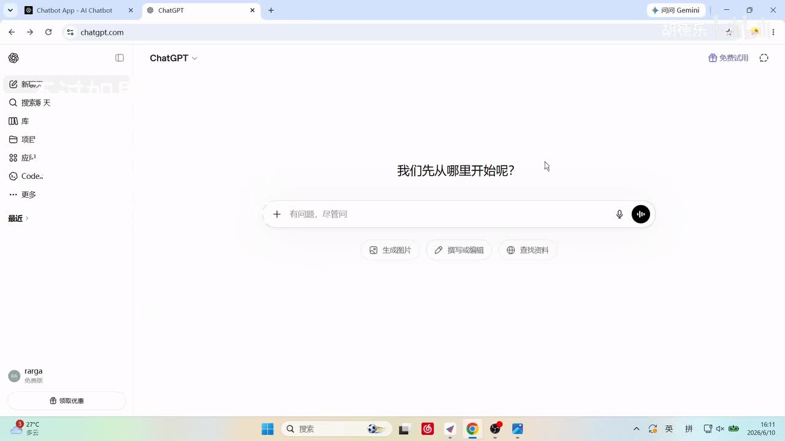
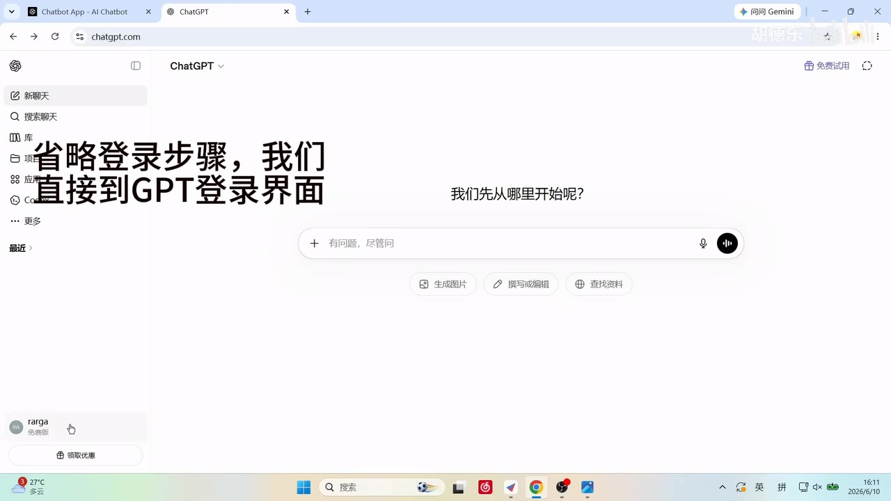

# 我找到解决codex二次解码的问题啦！

> 来源：[Bilibili 视频](https://www.bilibili.com/video/BV1JpEd66EUb)  
> UP 主：胡德乐｜发布时间：2026-06-10｜视频时长：1 分 52 秒  
> 标签：电脑、教程、codex、gpt

## 小结

视频讨论的实际主题是 **Codex / ChatGPT 登录时的二次验证（MFA）处理**；标题中的“二次解码”与字幕、口播所说的“二次验证”并不一致，本文以视频内可核实的“二次验证”为准。

UP 主给出的核心办法是：在 ChatGPT 的账户设置中进入“安全（Security）”，启用或绑定“身份验证器应用（Authenticator App）”形式的多因子身份验证。之后遇到二次验证时，在手机身份验证器中查看并填写 **6 位动态验证码** 即可完成验证。

视频列出两种可选身份验证器：**Google Authenticator** 与 **Microsoft Authenticator**。UP 主因认为 Google 登录更方便，选择前者，并称可在手机的 Google Play 商店下载；但没有展示具体下载、账户绑定、扫码或验证完成的全过程，因为其称该 App 不允许录屏。

UP 主同时提出，若将“稳定性”作为最高要求，仍建议“长期租号”或“实体 ESIM 卡”，并称其“百分百稳妥”。这属于 UP 主个人判断，视频没有给出测试数据、服务商信息、适用地区、账号归属或平台规则依据；尤其是租用账号可能涉及账号安全、服务条款与隐私风险，不应将该说法视为已验证结论。

本视频为短教程，重点是账号安全设置路径而非 Codex 功能本身。ChatGPT 的网页布局、MFA 可选项、应用商店可用性和登录风控均可能随地区、账号状态与产品更新发生变化；实际操作应以当下账户页面及官方安全说明为准。

## 思维导图





## 目录

- [问题、结论与适用范围](#问题结论与适用范围)
- [进入 ChatGPT 登录页面](#进入-chatgpt-登录页面)
- [账户设置与安全入口](#账户设置与安全入口)
- [绑定身份验证器应用（MFA）](#绑定身份验证器应用mfa)
- [验证器选择与日常验证](#验证器选择与日常验证)
- [操作步骤与关键参数](#操作步骤与关键参数)
- [限制、风险与时效性](#限制风险与时效性)
- [字幕比对](#字幕比对)
- [评论分析](#评论分析)
- [处理记录](#处理记录)

## [问题、结论与适用范围](https://www.bilibili.com/video/BV1JpEd66EUb?t=0)

视频开头说明，UP 主在此前推荐方案之外，找到了另一种“能解决 Codex 二次验证”的方式：将验证方式配置为手机上的身份验证器应用。这里的“解决”应理解为把登录验证流程转为可从验证器 App 获取动态码，而不是绕过、取消或破解二次验证。

UP 主在同一段中表示，若要求稳定，仍建议通过网站办理“长期租号”或使用“实体 ESIM 卡”，并称其“百分百稳妥”。这段内容没有说明网站、号码、账号类型、费用、地区、验证成功率或测试条件，因此只能记录为其个人经验性观点，不能据此推断其对所有账户或地区都有效。



> 图：关键帧显示录屏软件界面及视频大字字幕，直接呈现“除了长期租号，还有一个能解决 codex 二次验证的方法”的主题。它有助于澄清视频正文实际讨论的是“二次验证”，而非标题中的“二次解码”。



> 图：画面字幕显示 UP 主建议“长期租号或者实体 ESIM 卡”，并称“百分百稳妥”。该图可用于定位此结论的来源，同时提醒读者这是视频中的主张，不是素材所能独立验证的事实。

### 信息性质

| 类型 | 视频中可确认的内容 | 不应延伸推断的内容 |
| --- | --- | --- |
| 教程事实 | 可在 ChatGPT 的安全设置中选择 MFA / Authenticator App。 | 各账号、各地区必然看到完全相同的菜单。 |
| 操作参数 | 后续验证时填写 6 位动态数字。 | 验证码有效时长、重试次数或恢复机制。 |
| UP 主偏好 | UP 主选择 Google Authenticator，理由是其认为登录方便。 | Google Authenticator 对所有用户都优于 Microsoft Authenticator。 |
| UP 主判断 | 长期租号或实体 ESIM 卡被其称为稳定方案。 | 这些做法“百分百稳妥”、合规、安全或适合读者。 |

## [进入 ChatGPT 登录页面](https://www.bilibili.com/video/BV1JpEd66EUb?t=24)

在 [00:24](https://www.bilibili.com/video/BV1JpEd66EUb?t=24) 至 [00:28](https://www.bilibili.com/video/BV1JpEd66EUb?t=28)，UP 主明确省略登录步骤，直接展示 GPT / ChatGPT 的登录后页面。因此，视频默认读者已经能够成功进入对应账户，**不包含注册、密码登录、短信验证、邮箱验证或登录失败排查**。



> 图：关键帧展示浏览器中的 ChatGPT 页面，左侧有账户区域，主区域为“我们先从哪里开始呢？”的初始界面。这是后续从左下角账户头像进入设置的视觉前提，但画面本身未展示登录过程。

画面中可以辨认出 ChatGPT 网页侧边栏与左下角账户区域。由于视频未讲解不同平台的差异，以下路径仅适用于视频所示的网页端界面或相近版本：

1. 完成自己的 ChatGPT 账户登录。
2. 到达 ChatGPT 主界面。
3. 找到左下角显示账户头像或账户名称的位置。
4. 从该处进入设置。

## [账户设置与安全入口](https://www.bilibili.com/video/BV1JpEd66EUb?t=36)

在 [00:36](https://www.bilibili.com/video/BV1JpEd66EUb?t=36) 至 [00:40](https://www.bilibili.com/video/BV1JpEd66EUb?t=40)，UP 主说明先点击左下角账户头像，再选择“设置”。随后在 [00:49](https://www.bilibili.com/video/BV1JpEd66EUb?t=49) 至 [00:53](https://www.bilibili.com/video/BV1JpEd66EUb?t=53)，说明在设置界面选择“安全”。



> 图：关键帧保留 ChatGPT 网页端的左下角账户区域，并以大字字幕提示“省略登录步骤，我们直接到 GPT 登录界面”。它补足了字幕所述操作的起点，说明本教程针对已登录账户的设置流程。

### 视频所示路径

```text
ChatGPT 已登录页面
  → 左下角账户头像 / 账户区域
  → 设置
  → 安全（Security）
```

站内字幕和本次 ASR 都提供了这一段的对应时间，但 ASR 将“选择安全”误识别为“逐选安全”；结合站内字幕“我们选择安全”及教程上下文，本文采用“选择安全”。

## [绑定身份验证器应用（MFA）](https://www.bilibili.com/video/BV1JpEd66EUb?t=62)

在 [01:02](https://www.bilibili.com/video/BV1JpEd66EUb?t=62) 至 [01:18](https://www.bilibili.com/video/BV1JpEd66EUb?t=78)，UP 主表示安全页面中有“多因子身份验证（MFA）”选项，并选择其中的 **Authenticator App（身份验证器应用）**。

视频口播称其当前画面中的应用“已经绑定好了”，因此没有把新用户从零开始的每一个绑定页面完整展示出来。UP 主的建议是：读者自行操作时按页面步骤进行即可。素材没有提供二维码、密钥、确认码、恢复代码或绑定失败处理的展示，不能补写这些未出现的具体步骤。

### MFA 的视频内含义

- **MFA**：视频称为“多因子身份验证”。
- **Authenticator App**：视频选择的验证方式；中文可理解为“身份验证器应用”。
- **预期结果**：完成绑定后，登录触发二次验证时，用户可在手机 App 中取得动态验证码。
- **视频未覆盖项**：更换手机、丢失验证器、恢复代码保存、删除 MFA、多个验证器并存，以及异常登录申诉。

> 安全提醒：身份验证器生成的验证码属于登录验证信息。不要将动态码、绑定密钥、二维码截图或恢复代码发送给他人，也不要在不可信设备上完成绑定。

## [验证器选择与日常验证](https://www.bilibili.com/video/BV1JpEd66EUb?t=79)

在 [01:19](https://www.bilibili.com/video/BV1JpEd66EUb?t=79) 至 [01:51](https://www.bilibili.com/video/BV1JpEd66EUb?t=111)，UP 主列举了两个可选应用：

| 视频提及的选项 | 视频给出的信息 | 应避免的过度解读 |
| --- | --- | --- |
| Google Authenticator | UP 主选择该应用，理由是“谷歌的登录起来方便”；称可在 Google Play 商店下载。 | 不代表所有地区均可下载，也不代表它是唯一可用或官方唯一推荐方案。 |
| Microsoft Authenticator | UP 主列为另一个可选项。 | 视频没有比较其同步、恢复、跨设备或安全特性。 |

UP 主称，因 App 不允许录屏，所以仅放出应用图标，未展示应用操作过程。该限制意味着视频只给出流程方向，读者仍需依据实际 App 与账户页面的提示完成绑定。

绑定成功后，视频给出的日常操作是：

1. 当登录过程要求二次验证时，打开手机上的身份验证器应用。
2. 找到对应账户的动态验证码。
3. 在登录页面输入 **6 位动态数字**。
4. 完成验证后继续进入账户。

这里“6 位”是视频中唯一明确的验证码参数。视频没有说明动态码刷新周期、是否支持离线使用、是否能跨设备同步或能否同时保留其他验证方式。

## [操作步骤与关键参数](https://www.bilibili.com/video/BV1JpEd66EUb?t=24)

以下为根据视频顺序整理的最小可复现流程；未出现的页面细节均不作补充假设。

| 步骤 | 视频时间 | 操作 | 结果 / 注意事项 |
| --- | ---: | --- | --- |
| 1 | [00:24](https://www.bilibili.com/video/BV1JpEd66EUb?t=24) | 登录 ChatGPT。 | 视频省略了登录步骤；需自行具备可用账户与登录条件。 |
| 2 | [00:36](https://www.bilibili.com/video/BV1JpEd66EUb?t=36) | 点击左下角账户头像或账户区域。 | 视频所示为网页端 ChatGPT 界面。 |
| 3 | [00:38](https://www.bilibili.com/video/BV1JpEd66EUb?t=38) | 选择“设置”。 | 不同版本可能存在命名或位置变化。 |
| 4 | [00:49](https://www.bilibili.com/video/BV1JpEd66EUb?t=49) | 在设置中选择“安全”。 | 该名称由站内字幕确认。 |
| 5 | [01:02](https://www.bilibili.com/video/BV1JpEd66EUb?t=62) | 找到“多因子身份验证（MFA）”。 | 视频没有展示安全页全部选项。 |
| 6 | [01:07](https://www.bilibili.com/video/BV1JpEd66EUb?t=67) | 选择“Authenticator App / 身份验证器应用”。 | 按当时页面指引完成绑定；绑定细节未被录制。 |
| 7 | [01:19](https://www.bilibili.com/video/BV1JpEd66EUb?t=79) | 在 Google Authenticator 或 Microsoft Authenticator 中选择其一。 | UP 主个人使用 Google Authenticator。 |
| 8 | [01:41](https://www.bilibili.com/video/BV1JpEd66EUb?t=101) | 登录触发验证时，在手机 App 中获取验证码并填写。 | 视频明确的参数为 **6 位动态数字**。 |

## [限制、风险与时效性](https://www.bilibili.com/video/BV1JpEd66EUb?t=102)

### 视频覆盖边界

- 教程只展示了网页端设置入口与口头说明，没有展示从未绑定状态开始的完整操作画面。
- 视频未提供 Codex 具体报错、二次验证触发条件、网络环境、账号类型或成功验证记录。
- 视频没有说明 MFA 绑定后是否能减少验证频率；它描述的是验证触发后改用动态码完成验证。
- 视频未提供账户恢复方案。启用 MFA 前，应自行了解官方提供的恢复与备用验证机制。

### 账号与隐私风险

UP 主提及的“长期租号”与“实体 ESIM 卡”不属于本视频实际演示的设置步骤。租用账号可能带来账号所有权不清、会话泄露、支付信息风险、账号找回纠纷及违反服务规则等问题。实体 SIM / eSIM 的可用性还可能受运营商、地区、实名政策与平台风控影响。

因此，较稳妥的可迁移经验是：**优先在自己拥有并可恢复的账户上配置官方页面可用的 MFA 方式，并妥善保管恢复信息。** 这不是对视频外具体产品的认证或背书。

### 时效性

- 视频发布于 2026-06-10，素材抓取于 2026-07-15。
- ChatGPT 设置菜单、MFA 名称、可用身份验证器、Google Play 的区域可用性，以及 Codex 的登录策略均可能变化。
- “百分百稳妥”等绝对化表述没有视频内证据支持，应以当前官方页面、服务条款和实际账户状态为准。

## [字幕比对](https://www.bilibili.com/video/BV1JpEd66EUb?t=0)

本任务同时提供了 Bilibili 站内字幕和本次 ASR 结果，均已检查。ASR 诊断显示存在可用音轨：识别语言为中文，语言置信度约 **0.9966**，总时长约 **111.55 秒**，语音覆盖约 **67.06%**；`asr-result.json` 未标记 `noAudioStream=true`。语音间的大段空白与画面操作停顿相符，并非无音轨。

| 字幕来源 | 完整性 | 专有名词 | 时间轴 | 主要问题 |
| --- | --- | --- | --- | --- |
| Bilibili 站内字幕 | 覆盖开场、设置路径、MFA 与结尾操作，分段较细。 | “Codex”“MFA”“Google Authenticator”“Microsoft Authenticator”等整体更可靠。 | 可直接使用，粒度约 1—4 秒。 | 个别中文译写存在不规范，如“实体 ESM 卡”应保留原字幕表述但具体技术名未获画面证实。 |
| 本次 ASR（medium） | 覆盖 7 段语音，语义与站内字幕高度一致。 | 有明显误识别：如“安立”“租號”“ESCM 卡”“逐选安全”“身份印证器”“Authenticater”“Microsoft Authenticate”。 | 有时间戳，但单段较长，且 [01:20—01:44] 与 [01:44—01:51] 跨度较大。 | 断句不足、英文产品名拼写不稳定，不能单独作为术语依据。 |

### 最终采用策略

1. **时间定位优先采用站内 SRT**：其分段精细，且提供了可直接使用的真实起止时间。
2. **内容采用站内字幕为主、ASR 交叉核对**：两者对总体流程一致，因此确认视频确实涉及登录、设置、安全、MFA 和 6 位动态码。
3. **术语校正依据**：
   - “逐选安全”校正为“选择安全”，依据站内字幕与上下文。
   - “身份印证器”校正为“身份验证器”，依据站内字幕。
   - “Google Authenticater”“Microsoft Authenticate”统一写作视频中站内字幕给出的 **Google Authenticator**、**Microsoft Authenticator**。
   - 标题的“二次解码”不按内容解释；站内字幕与 ASR 均明确识别为“二次验证”。
4. **关键帧辅助**：关键帧确认视频为 ChatGPT 网页界面录屏，且开场大字字幕与“二次验证”主题一致；但关键帧未展示实际 MFA 绑定细节，故不补造扫码等过程。

## [评论分析](https://www.bilibili.com/video/BV1JpEd66EUb?t=0)

仅获取到热评前三条，均为 3 赞；评论数量较少，不能代表普遍用户反馈。

1. **胡德乐（UP 主）**：  
   “三联➕关🐷自动获取地址哦！！关注后似信才不会被吞。”  
   这是一条引导互动与私信沟通的置顶式补充倾向评论，暗示可能通过关注/私信获取某个“地址”，但没有公开说明地址所指内容，也没有提供可验证的服务信息。该评论不能作为“长期租号”“实体 ESIM 卡”可靠、合规或有效的证据。

2. **妲己男孩**：  
   “可以的，很有用……谢谢主包。”  
   该评论表达了正面体验和感谢，说明该观众认为教程具有实用性；但没有描述其账号环境、实际操作步骤或验证结果，属于主观反馈。

3. **妲己男孩**：  
   “打call”表情评论。  
   这是单纯支持性互动，没有提供新的技术信息、风险提示或可验证补充。

## [处理记录](https://www.bilibili.com/video/BV1JpEd66EUb?t=0)

- Worker ID：`worker-mrj0wjed-b0c290ad`
- 整理模型：`gpt-5.6-terra`
- 已检查素材：视频元数据、站内字幕 `p01-ai-zh.srt`、本次 ASR 时间轴字幕与 `asr-result.json` 诊断、可获取热评前三条、提供的关键帧。
- ASR 模型与运行信息：`medium`，中文识别，CUDA / `float16`；ASR 有时间戳，未标记 `noAudioStream=true`。
- 字幕选择：以站内 SRT 的细粒度真实时间轴为主，以本次 ASR 核对语义覆盖；针对“逐选安全”“身份印证器”等 ASR 错词以站内字幕及上下文校正。
- 关键帧选择依据：
  - `frames/frame-001.jpg`：呈现“Codex 二次验证”主题；
  - `frames/frame-002.jpg`：呈现 UP 主关于长期租号与实体 ESIM 卡的稳定性主张；
  - `frames/frame-003.jpg`：确认教程所处的 ChatGPT 网页端起始页面；
  - `frames/frame-004.jpg`：补充左下角账户区域这一操作起点。
- 缓存清理：提供的素材中未包含缓存清理日志或清理结果，无法确认是否执行了物理缓存清理；本文未虚构清理状态。
- 未解决问题：
  - 视频没有完整录制 MFA 从零绑定的页面步骤；
  - “实体 ESM 卡”是否为“eSIM 卡”的口误或字幕写法，素材无法独立确认，正文仅按视频语境记录并避免将其作为技术结论；
  - 视频未验证租号、实体 SIM / eSIM、不同身份验证器或不同地区账户的长期可用性。

## 评论分析

- 热评 1：三联➕关🐷自动获取地址哦！！[给心心]关注后似信才不会被吞。
- 热评 2：可以的，很有用[doge][doge]，谢谢主包
- 热评 3：[打call][打call][打call]

以上内容是观众反馈摘录，只用于补充理解视频反响，不作为正文事实依据。
