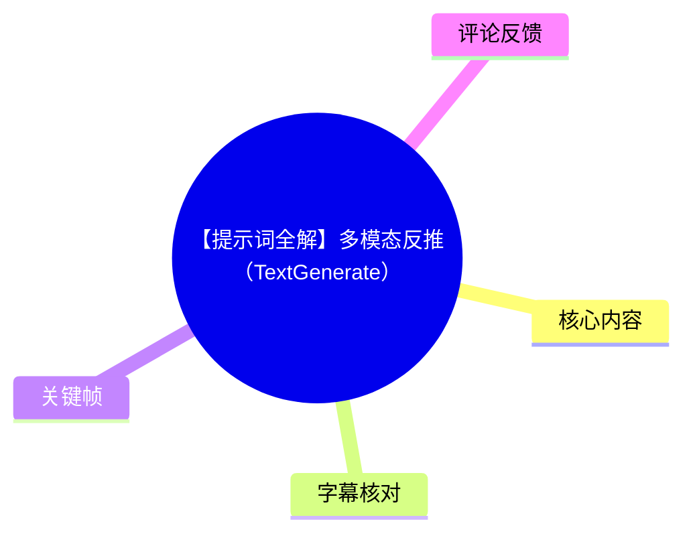
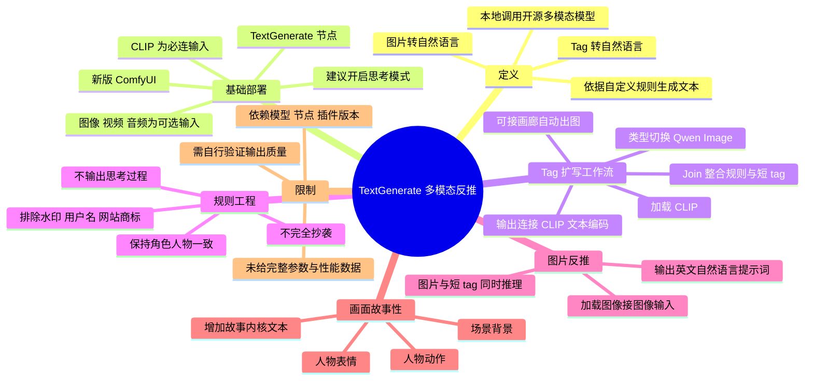
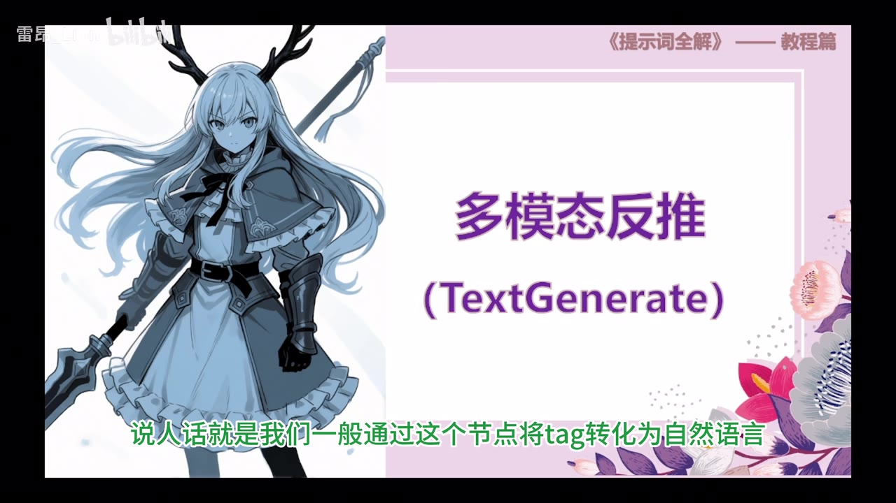
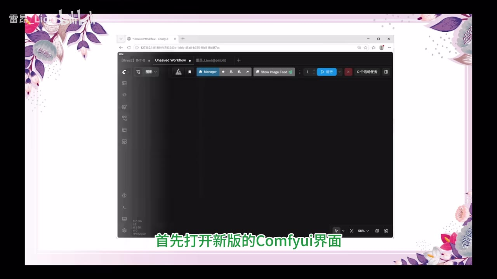
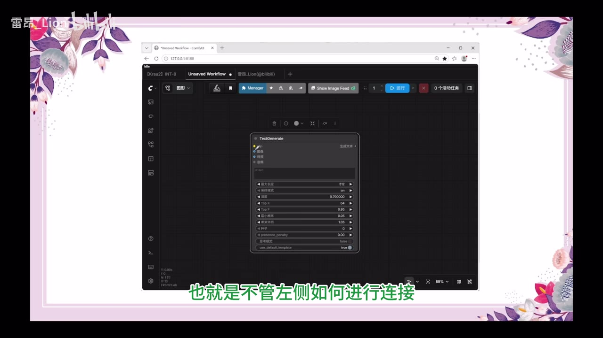
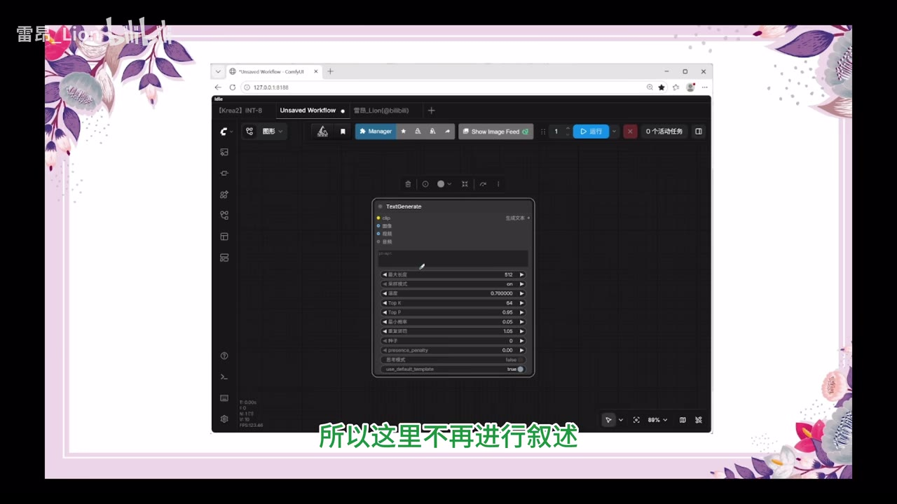

# 【提示词全解】多模态反推（TextGenerate）

> 来源：[Bilibili 视频](https://www.bilibili.com/video/BV1U23k6cEKD)<br>
> UP 主：雷昂_Lion｜视频时长：12 分 50 秒｜合集：AIcode  
> 视频定位：ComfyUI 中 `TextGenerate` 节点的多模态反推与提示词工作流搭建教程。

## 小结

视频讲解如何将 ComfyUI 的 `TextGenerate` 节点用作本地开源多模态模型的推理接口：它可以把短 `tag` 扩写为适合文生图模型使用的英文自然语言提示词，也可以根据输入图片反推出描述性提示词。作者将其概括为比 WD14 更灵活的“Pro Max”式节点，因为其输出可由用户自行编写的推理规则约束。

第一条主线是“短 tag → 英文自然语言 → 生图”。核心做法是：加载适配的 CLIP / 模型，配置为 `Qwen Image` 类型，将“推理规则”和“短 tag”通过文本整合节点合并后送入 `TextGenerate`，再将生成文本接入文生图工作流的 CLIP 文本编码端。若不需要手动修改结果，可直接连线实现自动化。

第二条主线是“图片 → 英文自然语言提示词 → 再生图”。在 `TextGenerate` 的图像输入端接入“加载图像”或 B 站画廊的图像输出，并将规则改为“将图片转化为用于 AI 生图的英文自然语言提示词”。作者特别建议明确限制“不要输出思考过程”，否则模型可能输出解释性废话而非可直接用于生图的纯提示词。

视频最有迁移价值的经验是：**推理规则不是固定模板，而是排错接口**。例如画廊标签中可能含有水印、用户名、网站商标；如果直接传给图像模型，可能被当作正向条件。解决方式不是在后端补救，而是把“不要有水印、作者名称和网站商标”写入规则。若“不要完全抄袭”导致 IP 角色身份丢失，则补充“角色人物保持一致”等规则。

面向需要搭建 ComfyUI 自动提示词扩写、图像反推、画廊整合工作流的用户，本视频提供了较完整的节点组织思路。前置条件包括：已具备基础 ComfyUI 操作能力、已完成视频所称的 Krea 2 基础工作流，并可使用相关节点或插件（如文本整合、KJ Nodes、B 站画廊）。

需要注意，视频中的模型、节点名称、UI 选项与插件行为均依赖当时的软件生态；`Anime`、`Krea 2`、`Qwen Image`、`INT8 的 3VL 4B` 等转写名称存在字幕识别歧义，应以实际安装版本和节点下拉选项为准。视频没有提供可复现实验的完整工作流文件、模型下载地址、显存占用、采样参数或定量质量对比，因此不能据此推导硬件门槛或效果保证。

## 思维导图





## 目录

- [背景、定义与适用范围](#背景定义与适用范围)
- [TextGenerate 节点部署与基础连接](#textgenerate-节点部署与基础连接)
- [短 Tag 扩写为自然语言工作流](#短-tag-扩写为自然语言工作流)
- [画廊自动化、工作流分组与规则迭代](#画廊自动化工作流分组与规则迭代)
- [图片反推与画廊图文整合](#图片反推与画廊图文整合)
- [通过故事内核增强画面叙事](#通过故事内核增强画面叙事)
- [参数、限制与时效性](#参数限制与时效性)
- [关键帧索引](#关键帧索引)
- [字幕比对](#字幕比对)
- [评论分析](#评论分析)
- [处理记录](#处理记录)

## 背景、定义与适用范围 [00:00:00](https://www.bilibili.com/video/BV1U23k6cEKD?t=0)

作者将“多模态反推”定义为：在本地调取开源大模型，并让模型根据用户提供的规则生成对应结果的节点应用。其在本视频中的主要用途有两类：

1. 将短 `tag` 转为英文自然语言提示词；
2. 将输入图片转为英文自然语言提示词。

生成后的自然语言被送往作者口中的“DT 系”文生图模型，例如字幕中写作 `Anima`、`Krea 2` 的模型或工作流。由于站内字幕对专有名词的音译不稳定，本篇保留视频中的写法，不将其延展为未经素材确认的产品或版本结论。



> 图：封面明确点出教程主题“多模态反推（TextGenerate）”，并以角色图作为图像反推/生图场景的视觉引子，适合用于理解视频的整体主题。

本视频不是软件发布新闻或模型评测，内容重点是工作流搭建与规则设计。学习前，作者默认观众已经接触过前序的 `Table`、WD14、Krea 2 基础工作流和 KJ Nodes 等内容；其中若缺少文本整合相关插件，作者建议回看此前的 KJ Nodes 教程。

## TextGenerate 节点部署与基础连接 [00:00:34](https://www.bilibili.com/video/BV1U23k6cEKD?t=34)

### 打开节点并识别接口 [00:00:50](https://www.bilibili.com/video/BV1U23k6cEKD?t=50)

操作从新版 ComfyUI 开始：双击画布调出节点选择栏，搜索视频演示的节点名称，并选择首个 `TextGenerate` 节点加入画布。



> 图：关键帧展示作者使用的 ComfyUI 画布界面，是理解“在画布空白处双击并添加节点”这一步的界面依据。画面未呈现完整插件清单，因此不能据此确认所有依赖的具体版本。

作者说明该节点左侧有一个实心输入点和三个空心输入点：

| 接口类型 | 视频中的说明 | 实际工作流含义 |
| --- | --- | --- |
| 实心输入 | `CLIP` 必须连接 | 无论是否接入其他模态，CLIP 是节点运行所需的必选连接。 |
| 空心输入 | 图像、视频、音频可选 | 可按任务选择接入；本视频重点演示文本和图像。 |
| 右侧输出 | 生成文本 | 可连接其他节点的文本框或展示文本，并进一步作为生图提示词。 |

作者提到节点内的最大长度、温度、重复惩罚等项目已在前序 `Table` 章节讲解，因此本视频未逐项解释其含义、推荐值或调整策略。

### 建议开启思考模式 [00:01:39](https://www.bilibili.com/video/BV1U23k6cEKD?t=99)

视频把“思考模式”视作一个重要选项，并建议勾选。作者的经验判断是：

- 未开启时，模型“很容易输出空值”；
- 这被作者形容为模型出现“偷懒”现象；
- 开启后，输出不完全一致，可降低生成图片和输入提示词完全不相干的风险；
- 后续图片反推流程中也应保持开启，作者称遗漏时可能导致整个模型不工作。

这是作者基于其工作流的经验性建议，而不是视频内通过对照实验得出的通用结论。不同节点版本、模型模板和运行参数下，思考模式是否可用、具体含义及其对输出稳定性的影响，均应以实际环境为准。



> 图：画面显示 `TextGenerate` 节点的多输入端与参数区域，有助于对应理解 CLIP 必连、其他模态可选、右侧输出文本的接口关系。

## 短 Tag 扩写为自然语言工作流 [00:02:02](https://www.bilibili.com/video/BV1U23k6cEKD?t=122)

### 1. 加载 CLIP 并切换类型 [00:02:20](https://www.bilibili.com/video/BV1U23k6cEKD?t=140)

从 `TextGenerate` 的 `CLIP` 输入端向外拖拽，在弹窗中选择“加载 CLIP”节点。作者的前提是：此前已经搭建好 Krea 2 基础工作流，因此可以直接在 CLIP 节点中选择字幕表述为“INT8 的 3VL 4B”的模型。

接着，作者要求将默认类型从 `SD` 改为字幕转写为 `Qwen Image` 的选项。此步骤属于视频演示环境中的配置条件；实际下拉选项是否存在、模型文件名称是否一致，取决于本地节点与模型安装情况。

### 2. 用文本整合节点组合规则与短 Tag [00:02:40](https://www.bilibili.com/video/BV1U23k6cEKD?t=160)

作者强调：不要直接把短 tag 填进 `TextGenerate` 节点内的文本框。正确做法是从文本框左上角向外拖拽，搜索 `join` 并选择第一项，以加入“文本整合”节点。

随后，从文本整合节点的两个输入端分别拖出，搜索 `STRING`，加入两个“整合文本”节点。作者称文本整合默认两个输入选项已经足够。

建议将两个文本输入重命名，以便识别职责：

| 文本输入 | 推荐命名 | 应填写内容 |
| --- | --- | --- |
| 上方文本 | 目的 / 推理规则 | 明确要求模型完成什么任务。 |
| 下方文本 | 短 tag | 填写生图所需的短 tag。 |

### 3. 编写任务并获得扩写结果 [00:03:42](https://www.bilibili.com/video/BV1U23k6cEKD?t=222)

此场景下，“目的”文本框的任务是：

> 将短 tag 扩写为英文自然语言文本。

运行后，展示文本应输出扩写后的英文自然语言。作者的人工使用方式是：复制这段文本，粘贴进正向条件，进行生图；其演示结论是，得到的图像与短 tag 所描述的内容“几乎一致”。

这一定义了 `TextGenerate` 在此工作流中的角色：它不是直接出图模型，而是处在“短 tag”和文生图模型之间的提示词改写/扩写层。

### 4. 将生成文本直接接入文生图 [00:04:12](https://www.bilibili.com/video/BV1U23k6cEKD?t=252)

如果不打算手工修改每次扩写的自然语言，作者建议将 `TextGenerate` 的“生成文本”输出端，直接连接到传统 Krea 2 工作流中 CLIP 文本编码文本框的左上角。

完成后，操作逻辑变为：

```text
短 Tag
  → 规则整合
  → TextGenerate 多模态推理
  → 英文自然语言提示词
  → CLIP 文本编码（正向条件）
  → Krea 2 / Anima 等文生图流程
  → 图像
```

这样每次只需要修改短 tag，模型会自动扩写并将结果送往文生图工作流。视频未展示反向提示词、采样器、步数、CFG、分辨率、种子或性能数据，因此这套流程仅描述提示词接入部分。

## 画廊自动化、工作流分组与规则迭代 [00:05:01](https://www.bilibili.com/video/BV1U23k6cEKD?t=301)

### 接入 B 站画廊自动供给 Tag [00:05:01](https://www.bilibili.com/video/BV1U23k6cEKD?t=301)

针对“不想自己反复写和修改 tag”的需求，作者进一步将文本框与 B 站画廊节点整合：

1. 从文本框左上角向外拖拽；
2. 放开后添加 B 站画廊节点；
3. 让画廊节点的文本输出直接进入 tag 输入框；
4. tag 与规则整合后进入多模态模型推理；
5. 推理结果继续进入文生图流程。

运行前有一个明确限制：在类别选项中，**“画师语言数据”一定不能勾选**。视频没有解释该选项的实现机制，只给出了不可勾选的操作结论。

这样可形成自动流：画廊提供文本，模型进行规则化扩写，文生图流程自动生成结果。

### 将混乱连线整理为四个功能组 [00:05:40](https://www.bilibili.com/video/BV1U23k6cEKD?t=340)

作者建议用分组方式组织工作流，使职责清晰：

| 功能组 | 输入 | 处理职责 | 输出 |
| --- | --- | --- | --- |
| Tag 获取组 | 画廊中选定的图片或条目 | 获得短 tag 并输入提示词分层 | 短 tag |
| 规则整合组 | 推理目的 + 短 tag | 拼接成一段可供模型理解的推理指令 | 推理文本 |
| 多模态推理组 | CLIP、推理文本，可选图像等 | 按规则将短 tag 转为自然语言 | 英文自然语言提示词 |
| Krea 2 文生图组 | 自然语言提示词 | 送入 CLIP 文本编码作为正向条件 | 生图结果 |

此分组法本身与具体模型无关，适合用于排查“输入来源—规则—推理—生成”四个环节中哪一步出现问题。

### 将问题写回规则：水印、用户名与商标 [00:06:14](https://www.bilibili.com/video/BV1U23k6cEKD?t=374)

作者指出，画廊或标签来源中的文本可能包含：

- 水印；
- 用户名；
- 作者名称；
- 网站商标。

若这些内容原封不动进入 Krea 2 或 Anima 等文生图模型，底模可能将其理解成用户希望生成含水印、用户名的图片。为此，应在规则整合组的“目的/推理规则”中加入排除要求：

```text
不要有水印、作者名称和网站商标。
```

作者的核心经验是：规则中的“目的”并非一成不变。遇到输出问题时，应：

1. 观察并描述问题；
2. 总结可能导致问题的输入或推理原因；
3. 将规避方式写入推理规则；
4. 再次执行工作流验证。

这是一种迭代式提示词工程方法。视频并未保证此规则可以完全消除所有文字、水印或商标样式伪影，实际结果仍受底模和生成条件影响。

## 图片反推与画廊图文整合 [00:07:26](https://www.bilibili.com/video/BV1U23k6cEKD?t=446)

### 基础图片反推 [00:07:50](https://www.bilibili.com/video/BV1U23k6cEKD?t=470)

作者将图片反推称为 `TextGenerate` 的第二个功能，并以“WD14 节点的 Pro Max 版本”作类比。基础配置步骤如下：

1. 回到基础 `TextGenerate` 节点；
2. 删除用于 tag 扩写的“tag 文本”和“文本整合”节点；
3. 只保留“推理规则”文本；
4. 从节点的图像输入端向外拖拽；
5. 添加“加载图像”节点并连接；
6. 修改规则，使其对应图片输入任务。

规则应从“将以下 tag 转化为自然语言”改为：

```text
将图片转化为用于 AI 生图的英文自然语言提示词。
不要输出思考过程。
```

其中第二句是视频特别强调的限制。作者认为若不写“不要输出思考过程”，模型可能输出自我介绍、过程说明、确认提问等聊天式文本；而此处目标是让节点成为只输出可用提示词的工具。

运行后，将获得的英文自然语言提示词粘贴到 Krea 2 工作流中生图。作者展示的结论是可生成“一张差不多的图片”，即追求与参考图相近，而非承诺严格复刻。

### 图像与文本同时输入：画廊整合流 [00:09:02](https://www.bilibili.com/video/BV1U23k6cEKD?t=542)

作者随后介绍“画廊整合流”。其逻辑是：`TextGenerate` 可以连接文本和图像；B 站画廊同样有文本与图像两个输出端。因此可以将画廊输出的短 tag 和图像一起交给多模态模型推理。

建议的规则包含以下四层约束：

```text
将图像和短 tag 提示词生成一段用于 AI 出图的英文自然语言提示词。
不要完全抄袭。
不要输出思考内容。
不要有水印、作者名和网页商标。
```

各约束的目标分别是：

| 规则 | 作者给出的目的 |
| --- | --- |
| 图像 + 短 tag → 英文自然语言 | 同时利用图像内容与标签信息。 |
| 不要完全抄袭 | 不要求一模一样复现，给模型一定自由度。 |
| 不输出思考内容 | 保持输出为干净的生图提示词。 |
| 不要有水印、作者名、网页商标 | 防止来源标签中的无关信息成为正向条件。 |

连接方式是：将 B 站画廊的**图像输出端**接到 `TextGenerate` 的**图像输入端**；文本则仍经规则整合后进入推理。作者提醒，为了整理画布可以暂时拖出节点，连接后再放回原来的分组位置。

### “不抄袭”与角色一致性的冲突处理 [00:10:38](https://www.bilibili.com/video/BV1U23k6cEKD?t=638)

视频提出一个规则冲突：如果输入图像带有角色名称，且原图是热门 IP 角色，规则中“不要完全抄袭”可能使模型输出一个原创角色，而不是保留原角色。

作者的应对方式是继续改规则，加入以下意思的要求：

```text
角色人物不要发生变化。
```

或：

```text
角色人物保持一致。
```

这说明“避免抄袭”与“维持角色身份”之间需要按任务目的权衡。视频仅展示了规则层面的调整，没有讨论角色名称、IP 使用、版权或平台合规边界；这些问题不应被视为已在视频中解决。

## 通过故事内核增强画面叙事 [00:11:02](https://www.bilibili.com/video/BV1U23k6cEKD?t=662)

作者认为常规反推后再生图可能有两个问题：

1. 人物动作较呆板；
2. 背景通常比较朴素。

解决思路是在工作流中增加一个新的文本框，命名为“故事内核”，让模型在参考图像和标签之外，获得对画面情节、动作、氛围和场景的额外描述。

### 故事内核的构成 [00:11:27](https://www.bilibili.com/video/BV1U23k6cEKD?t=687)

作者用示例说明，不必写得复杂；通常加入以下三项就足够：

| 元素 | 示例 |
| --- | --- |
| 人物表情 | 严肃的神情 |
| 人物动作 | 手持武器指向镜头 |
| 背景环境 | 背后丛林密布，远处小镇若隐若现 |

作者还提到可以加入更具叙事性的文字，如“阻挡一切来犯之敌”“主角不惜生命也要保护的地方”，但明确表示这部分带有个人写作偏好，观众不必照搬。

### 在规则中纳入故事内核 [00:12:15](https://www.bilibili.com/video/BV1U23k6cEKD?t=735)

在推理规则中增加“以及故事内核”或“用故事内核来进行参考整合生成图片”的要求，使模型将故事内核与原有图像、tag 一起纳入生成文本。

作者展示的效果判断是，结果图中同时体现出：

- 严肃神情；
- 丛林背景；
- 远处若隐若现的小镇。

据此，作者把该方法概括为“为画面添加故事性”：通过补足动作、表情和场景，让图像不只是描述单个人物，还能表达一个画面正在讲述的故事。

## 参数、限制与时效性 [00:12:39](https://www.bilibili.com/video/BV1U23k6cEKD?t=759)

### 视频明确出现的配置与规则

| 类别 | 内容 | 说明 |
| --- | --- | --- |
| 必连输入 | CLIP | `TextGenerate` 节点的实心输入，作者称必须连接。 |
| 可选输入 | 图像、视频、音频 | 节点空心输入，可按任务决定是否接入。 |
| CLIP 模型 | 字幕写作“INT8 的 3VL 4B” | 专名存在音译/识别误差，需以本地实际模型名称确认。 |
| 类型设置 | 从 `SD` 切换至 `Qwen Image` | 属于作者演示环境所需设置。 |
| 思考模式 | 建议打开 | 作者称可避免空输出，且图片反推时遗漏可能导致模型不工作。 |
| 画廊类别 | 不勾选“画师语言数据” | 视频给出的硬性操作提醒，但未解释内部机制。 |
| Tag 扩写规则 | 短 tag 扩写为英文自然语言 | 用于衔接文生图正向条件。 |
| 图片反推规则 | 图片转化为 AI 生图英文自然语言提示词 | 应配合“不要输出思考过程”。 |
| 清洗规则 | 不要有水印、作者名称和网站商标 | 用于防止无关标记进入正向条件。 |
| 角色规则 | 角色人物保持一致 | 当“不完全抄袭”导致角色身份漂移时使用。 |
| 叙事规则 | 参考故事内核整合生成 | 用于丰富动作与背景。 |

### 未提供或不能据此推断的信息

- 未提供完整的 `TextGenerate` 节点名称、仓库地址、安装命令、工作流 JSON 或插件版本；
- 未提供模型下载地址、模型许可证、显存占用、推理耗时、量化精度比较；
- 未提供最大长度、温度、Top K、Top P、重复惩罚等具体推荐数值，视频仅说这些已在前序内容讲过；
- 未提供不同规则、不同模型或不同提示词的系统性质量对照；
- 未讨论图像参考、IP 角色保持、反推使用中的版权与合规问题；
- 未验证视频中策略能否在所有 ComfyUI、节点版本和底模组合中稳定复现。

### 时效性说明

元数据记录该视频发布时间为 **2026-07-29**，素材获取时间为 **2026-08-04**。本笔记只描述该时间点素材中展示的界面与操作。ComfyUI、相关节点、模型名称、B 站画廊功能及其选项可能随版本更新而变化；部署时应以当前节点文档、实际下拉选项和报错信息为准。

## 关键帧索引

| 关键帧 | 对应内容 | 图片价值 |
| --- | --- | --- |
|  | 多模态反推（TextGenerate）主题页 | 确认视频主题、课程系列属性和图像反推场景。 |
|  | 新版 ComfyUI 界面 | 为“在画布中添加节点”的操作提供界面上下文。 |
|  | 节点输入、输出及参数面板 | 直观对应 CLIP、图像、视频、音频接口与文本输出。 |
|  | TextGenerate 配置区域 | 辅助定位视频所说的最大长度、温度、重复惩罚和思考模式等选项区域；具体数值仍应以当前环境读取为准。 |

## 字幕比对

| 字幕来源 | 完整性 | 专有名词 | 时间轴 | 主要问题 |
| --- | --- | --- | --- | --- |
| Bilibili 站内字幕 `p01-ai-zh.srt` | 完整，覆盖约 00:00:00–00:12:49 | 存在音译和错写，如“康反UI”“career to”“阿尼玛”“qin image”等 | 分段细，时间与视频时长基本一致 | 专有名词、节点名和英文大小写不稳定，但语义连贯、可用于章节定位。 |
| 本次 ASR（`large-v3-turbo`） | 诊断显示语音覆盖率 95.55%，覆盖约 00:00:33.800–00:12:48.600 | 误识别更明显，如“多么泰”“Confi UI”“Carea 2”“Corea 2”“Taple”等 | 虽有时间戳，但首段从 33.8 秒开始，且首个 2 秒分段塞入大量文本，明显不适合精确定位 | 时间分段异常、专名识别偏差较多，不能作为本笔记的主时间轴。 |

### 最终字幕选择与校正原则

本次任务**已检查 ASR 结果**。ASR 诊断中没有 `noAudioStream=true` 标记，且识别到中文语音，说明源视频具有音轨；不存在“无音轨而改用画面理解”的情形。

最终以 **Bilibili 站内 SRT 的时间轴**作为章节链接依据，原因是其从 00:00:00 开始、分段密度合理，并与总时长接近。ASR 作为交叉核验材料：其内容顺序与站内字幕大体一致，但首段时间偏移和超长文本分段异常，故不采用其时间轴。

基于站内字幕、ASR 互相印证以及关键帧画面，本文做出以下保守校正：

- “康反UI / Confi UI”统一记作 **ComfyUI**；
- “tag / 泰 / 太个”等统一记作 **tag**；
- “CLICLIP / Cl”等统一按上下文记作 **CLIP**；
- “多么泰 / 多摩Tag”等统一表述为**多模态**；
- “career to / Carea 2 / Corea 2”等保留为视频语境中的 **Krea 2** 写法，但不对其产品、版本或技术细节作额外断言；
- “阿尼玛 / Anima / Anime”在视频中存在不稳定转写，本文仅在引用视频时保留 `Anima` 写法；
- “Q1 Image / qin image”按视频语境记作 **Qwen Image**，但实际选项名须以本地界面为准；
- “INT8 的 3VL 4B”属于字幕识别不确定的模型名称，未擅自扩展为完整模型标识。

## 评论分析

以下仅处理可获取的热评前三条。评论是用户体验或观点，不构成对模型效果、硬件门槛或工作流稳定性的验证。

1. **SnowSalt落雪余盐（28 赞）**  
   评论称“4090 要到了，准备猛猛出图”，并表示 `anima` 需要等待配套生态完善，附带自己此前使用 XL 模型迭代 3000 步的实验性作品。  
   - 补充信息：反映该用户期待以高端显卡进行本地出图，也认为相关生态尚未完善。  
   - 可信度与限制：这是个人设备计划和主观看法；视频本身没有给出 4090、XL、3000 步或 Anima 生态成熟度的性能依据，不能外推为硬件要求。

2. **鉴定网络热门幼刀（23 赞）**  
   评论为“K2 还是太超模了”。  
   - 观点：表达对“K2”能力的高度认可。  
   - 可信度与限制：评论没有解释“K2”具体指代、测试条件、比较对象或量化指标；无法据此确认其与视频中 `Krea 2` 的关系，也不能当作技术结论。

3. **ink阿莫（9 赞）**  
   评论称教程“帮大忙了”，并表示配合 WD14 输出的提示词，反推精度可以进一步提升；评论中附有原图和反推生成图。  
   - 补充信息：与视频中把 `TextGenerate` 视作 WD14 更强扩展的思路相呼应，提出“WD14 标签 + 多模态反推”可能提升参考还原度的实践组合。  
   - 可信度与限制：这是单个用户的体验陈述。评论未给出 WD14 模型版本、提示词、采样参数、种子、参考图控制条件或评价标准，不能视为可重复的精度结论。

## 处理记录

- Worker ID：`worker-mrj0www4-e8d79408`
- 整理模型：`gpt-5.6-terra`
- ASR 模型：`large-v3-turbo`（`cuda`，`int8_float16`，识别语言 `zh`，语言概率 `0.998046875`）
- 使用素材与工具产物：
  - 视频元数据与关键帧目录：`frames/`
  - 站内字幕：`subtitles/p01-ai-zh.srt`
  - 本次 ASR：`asr/transcript.srt`、`asr/asr-result.json`
  - 评论数据：`comments/comments.json`
- 字幕选择：以站内 SRT 为主时间轴；已核查本次 ASR。ASR 有音频识别结果但时间分段存在首段偏移和文本拥挤问题，因此仅用于内容交叉核验，不用于章节定位。
- 关键帧选择依据：选择课程主题封面、ComfyUI 画布、`TextGenerate` 节点接口与参数面板对应的关键帧，用于支撑主题、节点部署和配置说明；未把关键帧中无法辨识的细小文字扩写为事实。
- 缓存清理：素材中未提供缓存清理执行日志；无法核验是否已清理，故不作已完成声明。
- 未解决问题：
  - 视频未提供完整工作流文件、节点仓库、插件版本和模型下载信息；
  - 多个模型与节点专有名词在站内字幕和 ASR 中均存在音译偏差；
  - 无法从现有素材确认 `TextGenerate` 的具体实现、完整参数推荐值及跨环境兼容性。
