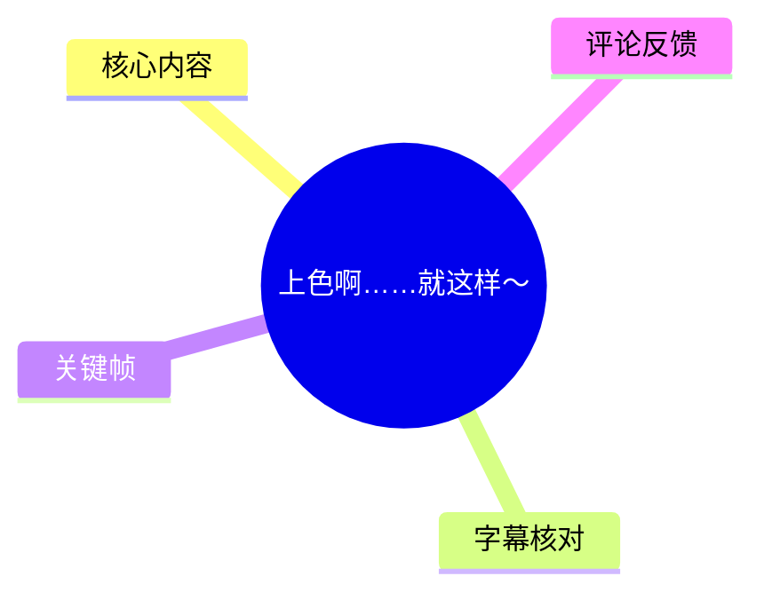
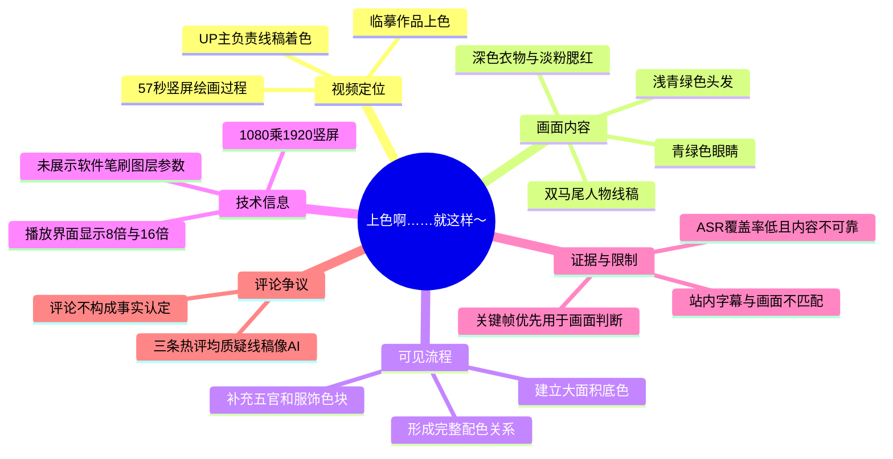
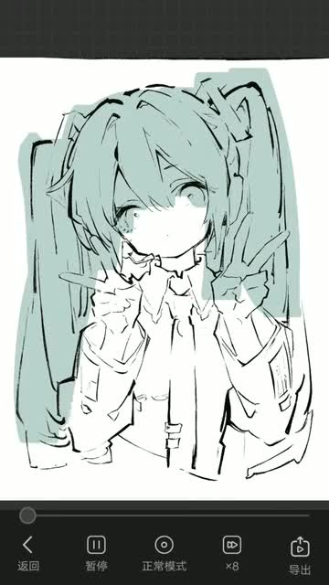
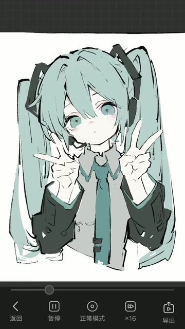
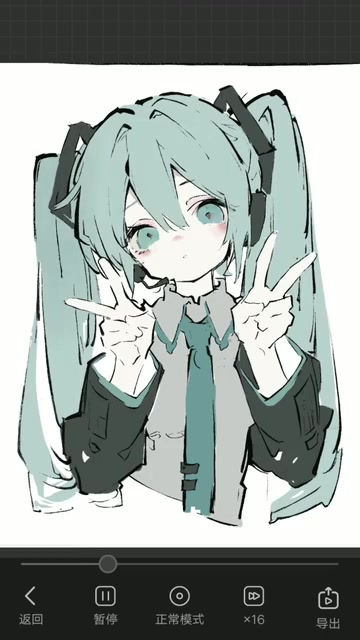

# 上色啊……就这样～

> 来源：[Bilibili 视频](https://www.bilibili.com/video/BV15V5r61EfL) 
> UP 主：子浪雾迷｜发布时间：2026-05-16｜视频时长：57 秒｜画面规格：1080 × 1920（竖屏）
>
> 视频简介称：这是“一幅临摹作品”，UP 主负责为线稿上色；线稿来源涉及其他平台主播。简介未提供原始线稿作者、授权状态、绘画软件或笔刷信息。

## 小结

这是一个约 57 秒的竖屏绘画过程短视频，核心内容是为一张双马尾、双手比 V 手势的二次元人物线稿补充颜色。画面展示的结果不是完整的细致厚涂，而是以浅青绿色头发、青绿色眼睛、深色外套和淡粉腮红为主的简洁配色稿。

从可见画面看，上色顺序大致呈现为：先建立头发等大面积浅青绿底色，再补足眼睛、领结/领口与衣物的深色区域，最后形成较完整的人物色彩关系。该过程可供初学者观察“先大色块、后局部强调”的简化上色思路，但视频没有展示图层面板、取色器、笔刷设置或逐笔操作，因此不能据此复现完全相同的技法。

视频底部出现剪辑/播放界面，显示“正常模式”“×8”“×16”“导出”等控件，说明成片以加速回放方式呈现绘制变化；其中“×8”“×16”是播放器界面可见的速度选项，**不能据此断言作者实际作画速度或软件名称**。

站内字幕与画面主题明显不一致：站内字幕是一段关于“享受当下”“人生如棋”的鸡汤式文案，且时间延伸至 01:02.760，超过视频实际约 57 秒的时长。此次 ASR 虽检测到音轨，但识别结果覆盖率仅约 26.37%，主要为无意义重复音节和零散词语，无法作为视频内容依据。因此，本文以视频元数据、UP 简介和关键帧画面为主，不将两份字幕中的文案视为本视频的讲解内容。

适合阅读者包括：想快速了解该配色结果的绘画爱好者、需要核对临摹作品信息边界的收藏者，以及希望辨析“绘画过程画面”与“不可靠字幕/音频转写”差异的内容整理人员。

## 思维导图

## 目录

- [视频背景与素材边界](#视频背景与素材边界-0000)
- [画面中的上色结果与流程](#画面中的上色结果与流程-0009)
  - [起始：线稿与头发底色](#起始线稿与头发底色-0000)
  - [中段：补充五官与服饰色块](#中段补充五官与服饰色块-0009)
  - [完成状态：统一人物配色](#完成状态统一人物配色-0034)
- [可迁移的上色观察与操作边界](#可迁移的上色观察与操作边界-0040)
- [参数、限制与时效性](#参数限制与时效性-0056)
- [字幕比对](#字幕比对-0000)
- [评论分析](#评论分析-0000)
- [处理记录](#处理记录-0000)

## 视频背景与素材边界 [00:00](https://www.bilibili.com/video/BV15V5r61EfL?t=0)

视频标签为“绘画”“绘画过程”“上色”，UP 主在简介中明确其角色是“负责上色线稿”，并称作品为临摹作品。由此能够确认的边界是：

1. 视频主要展示的是**在线稿基础上做颜色填充/调整**，不是从草稿起完整绘制人物。
2. 作品被 UP 主描述为临摹，线稿并非在简介中被明确标注为完全原创。
3. 简介提到“来自其他平台的主播”，但未给出来源链接、作者署名、授权文本或可追溯的平台账号；这些信息不能补全或推断。
4. 视频不构成绘画教程：没有口述教学、软件界面名称、图层结构、笔刷参数、调色数值、选区方式或导出设置。

元数据记录视频时长为 57 秒，分辨率为 1080 × 1920。站内字幕中存在超出该时长的片段，故应以视频元数据和实际音频时长（ASR 诊断为 56.540625 秒）作为时长判断的优先依据。

## 画面中的上色结果与流程 [00:09](https://www.bilibili.com/video/BV15V5r61EfL?t=9)

### 起始：线稿与头发底色 [00:00](https://www.bilibili.com/video/BV15V5r61EfL?t=0)

开头可见人物主体为黑色线稿：角色拥有较长的双马尾轮廓，双手置于脸侧并做 V 手势，服饰具有外套、领口和领带/飘带状结构。画面中头发区域已被铺入低饱和浅青绿色，脸部和多数衣物仍以白底和线条为主。

> 图：该帧保留了“线稿 + 局部底色”的对照，能够看出本视频的重点是在线稿上追加配色，而不是从零建立人物结构。它也是判断后续色彩覆盖范围的基准。

这一状态体现的可观察经验是：先确定占画面比例最大的头发主色，可以快速建立角色整体色调。由于视频未展示图层或具体操作工具，不能判断这一步使用的是油漆桶填充、选区填色、剪贴蒙版还是手动涂抹。

### 中段：补充五官与服饰色块 [00:09](https://www.bilibili.com/video/BV15V5r61EfL?t=9)

后续画面中，人物双眼被填入偏青绿色调，面部出现淡粉色腮红；领口/领结和袖子、外套等区域开始加入深灰绿色或近黑色块。综合色彩并未追求高饱和，而是让头发的浅青绿、眼睛的青绿、衣物的深色形成明暗层级。

> 图：该帧展示了角色识别度较高的局部——青绿色眼睛、粉色腮红和深色衣物。它说明上色并非只处理头发，而是通过五官与服装的色块补充强化了主体层次。

从结果反推，配色关系可概括为：

| 区域 | 画面可见颜色倾向 | 在画面中的作用 |
| --- | --- | --- |
| 头发与双马尾 | 低饱和浅青绿色 | 占据大面积，是整张图的主色 |
| 眼睛 | 较头发更醒目的青绿色 | 聚焦面部，增强角色视线中心 |
| 腮红 | 很浅的粉色 | 增添面部暖色与情绪感 |
| 外套、袖部及局部配件 | 深灰绿至近黑色 | 压低画面下半部，衬托浅色头发和脸部 |
| 衣物主体 | 白色/浅灰底 | 保留呼吸感，避免画面整体过暗 |

以上是基于可见成图做出的画面分析，不是视频中由作者口述的配色理论，也不包含可直接复制的 RGB、HSV 或色板参数。

### 完成状态：统一人物配色 [00:34](https://www.bilibili.com/video/BV15V5r61EfL?t=34)

完成画面中，头发、眼睛、面部和衣物的主要区域均已具有明确颜色。浅色头发围绕白皙脸部，深色袖口和外套形成外框，人物双手与 V 手势仍以相对浅的色面保留在线稿内部。整体保留明显线稿感，阴影和材质刻画较克制。

> 图：该帧可作为最终结果参考。它完整呈现了浅色头发、深色服饰、青绿色眼睛和淡粉腮红之间的关系，便于观察该作品的综合色调，而不是只看单个局部。

画面底部可见编辑/播放工具栏，包括“返回”“暂停”“正常模式”“×16”“导出”等文字与图标。该 UI 证明画面来自某个支持加速预览与导出的移动端编辑或播放环境，但没有任何可靠证据可以识别具体应用名称。视频可见的“×8”“×16”可理解为回放速度标识，而非绘画软件参数。

## 可迁移的上色观察与操作边界 [00:40](https://www.bilibili.com/video/BV15V5r61EfL?t=40)

结合关键帧，若仅提炼可迁移的观察顺序，可以采用以下低风险流程；它是对画面结果的整理，**不是视频明确演示的逐步教程**：

1. **保留线稿可读性**  
   视频成图中的黑色线条仍然清晰，颜色没有覆盖轮廓。实践时可将线稿置于较高图层，或在上色后检查眼睛、手指、衣物褶皱等结构线是否仍可辨认。

2. **先确定最大面积主色**  
   此图以浅青绿色头发承担主色。先完成头发等最大色块，有利于判断皮肤、服装和配件应选用的明度与饱和度。

3. **以深色服装建立明暗锚点**  
   成图中深色外套/袖部将视觉重心收拢到人物脸部。若所有区域都用浅色，人物会缺少边界与重量感；适量深色可以使脸部和发色更突出。

4. **以少量暖色修饰面部**  
   淡粉腮红是画面中有限的暖色，与青绿色主调形成轻微冷暖对比。该做法的重点不是大范围铺粉色，而是用小面积暖色避免肤色过于平淡。

5. **最后检查色彩层级而非无限增加细节**  
   该视频展示的结果线条感较强、阴影相对简化。对于同类简洁上色，优先确认“头发—脸—衣物”的主次关系，未必需要添加复杂材质、高光或环境光。

需要特别注意：视频没有展示任何实际的选色数值、笔刷尺寸、不透明度、混色模式、图层混合模式、画布尺寸、绘制耗时或导出码率。因此，上述步骤不能替代完整绘画教学，也不应被误认为作者公开的技术参数。

## 参数、限制与时效性 [00:56](https://www.bilibili.com/video/BV15V5r61EfL?t=56)

### 可确认参数

| 项目 | 可确认信息 |
| --- | --- |
| 视频时长 | 元数据为 57 秒；ASR 音频时长为 56.540625 秒 |
| 视频画幅 | 1080 × 1920，竖屏 |
| 视频类型 | 绘画过程/上色展示短视频 |
| 作品性质 | UP 简介称为临摹作品，UP 负责上色线稿 |
| 标签 | 绘画、绘画过程、上色 |
| 画面可见速度选项 | 出现“×8”“×16”，但仅能确认其为界面上的加速回放选项 |
| 数据抓取时点 | 2026-07-15；播放、点赞、收藏、评论等互动数据随时间变化 |

### 未展示或无法确认的技术信息

- 未知所用绘画软件、剪辑软件或移动端应用名称。
- 未知笔刷名称、笔刷大小、笔压设置、不透明度及纹理参数。
- 未知图层数量、图层命名、混合模式、蒙版/剪贴方式。
- 未知线稿原始来源、原作者身份、临摹许可和二次发布授权。
- 未知真实作画用时；加速播放不能换算为实际绘制时长。
- 未知是否使用了 AI 辅助生成、AI 参考、AI 修图或其他生成式工具。评论中的猜测不能作为结论。

### 时效性说明

本视频是绘画展示而非持续更新的新闻、软件发布或技术公告，其画面内容本身时效性较弱；但作品链接、互动数据、评论排序、可用字幕和视频可访问状态均可能变化。本文中播放量、点赞量等统计仅对应抓取元数据时的快照，不应作为当前实时数据。

## 字幕比对 [00:00](https://www.bilibili.com/video/BV15V5r61EfL?t=0)

| 字幕来源 | 完整性 | 专有名词/画面一致性 | 时间轴 | 主要问题 |
| --- | --- | --- | --- | --- |
| Bilibili 站内字幕 `p01-ai-zh.srt` | 文本段落较完整，共 40 段 | 与绘画上色画面及视频标题不一致；未出现绘画相关术语 | 有明确时间码，但最末到 01:02.760，超出视频约 57 秒 | 内容为“享受当下”“人生如棋”等励志文案，疑似与本片不匹配，不能用于解释画面 |
| 本次 ASR 字幕 | 很不完整：5 段，语音覆盖约 26.37% | 无法识别有效绘画术语；包含重复“大大大”等无意义转写 | 有时间戳，范围约 00:09.980—00:44.570 | 语言置信度仅 0.32177734375，识别结果碎片化，不能据其还原旁白或歌词 |

### 最终字幕使用策略

本次 ASR 已被实际检查。其诊断中**未标记** `noAudioStream=true`，因此不能说源视频没有音轨；相反，音频流存在，但 ASR 对其识别质量很低。ASR 在约 00:34 识别出“天氣”、在约 00:40—00:42 识别出“愛我自己星星”等零散文本，缺乏足够语义连贯性，也与视频绘画内容没有可验证关联。

站内字幕尽管时间轴完整，却在内容与时长上均存在明显异常：例如从 00:51.680 起出现“♪ 人生如棋 ♪”，并持续到 01:02.760，已经超过元数据与音频诊断所显示的实际视频长度。因此：

- **不采用站内字幕作为视频叙事或教学内容。**
- **不采用本次 ASR 的零散文本作为语音结论。**
- 正文对上色过程的判断主要基于 UP 简介、视频标题、标签和关键帧中的可见画面。
- 未通过字幕校正任何绘画软件名、角色名、作者名、颜色代码或绘画参数，因为素材中没有可靠证据。

## 评论分析 [00:00](https://www.bilibili.com/video/BV15V5r61EfL?t=0)

以下仅处理可获取的热评前三条。三条评论均围绕“线稿是否像 AI 生成”提出疑问，未提供可核验的图像溯源、制作文件或作者声明。

| 热评 | 点赞 | 观点概括 | 可提供的信息与可信度 |
| --- | ---: | --- | --- |
| 一只小小的Joy：“虽然但是线稿看着有点像AI。。” | 44 | 认为线稿视觉上有 AI 风格特征 | 这是基于观感的判断，未提供比对依据；可反映观众疑虑，不能证明线稿由 AI 生成 |
| 以叶hzk：“临摹ai？” | 34 | 质疑该临摹对象是否为 AI 作品 | 提出了作品来源性质问题，但没有附来源链接或证据；不能据此判定原图属性 |
| 纯安_chunan：“线稿ai” | 28 | 直接将线稿判为 AI | 表述最简短，未附论据；属于未验证的个人结论 |

评论区形成的争议焦点是：UP 自述“临摹作品”与观众对线稿视觉风格的 AI 联想之间存在张力。就现有素材而言，能够确认的只有 UP 主确实声明了临摹并负责上色；至于线稿是否由 AI 生成、是否参考 AI 图像、原始作者是谁，均缺少可验证材料，应保持未知状态。

## 处理记录 [00:00](https://www.bilibili.com/video/BV15V5r61EfL?t=0)

- Worker ID：`worker-mrj0wjed-b0c290ad`
- 模型：`gpt-5.6-terra`
- 调用工具与素材：视频元数据、站内字幕 `p01-ai-zh.srt`、本次 ASR 结果及 SRT、关键帧目录、热评前三条。
- 字幕选择：已检查站内字幕与本次 ASR；站内字幕与画面主题不符且超出实际视频时长，本次 ASR 识别率低、内容不可用。最终不以任一字幕作为绘画过程事实依据，改以标题、简介、标签与关键帧画面理解为主。
- 关键帧选择依据：选用 `frames/frame-001.jpg` 说明线稿与头发底色的起始状态，选用 `frames/frame-003.jpg` 说明五官和服装色块补充，选用 `frames/frame-004.jpg` 说明完成后的整体配色；这些帧能够形成“局部底色—主要色块—完成效果”的视觉对照。
- 关键帧时间依据说明：素材仅提供关键帧文件路径，未提供每张关键帧的独立提取时间戳；正文未将帧序号伪造为精确时间点。章节时间轴仅采用视频起点及 ASR 中真实存在的时间码作为链接锚点。
- 缓存清理：素材清单未提供缓存清理执行日志；无法确认是否已清理，不作已完成声明。
- 未解决问题：原始线稿来源、授权信息、软件与笔刷参数、真实作画时长、音频实际内容，以及线稿是否与 AI 生成有关，均无法由现有素材验证。

## 评论分析

- 热评 1：虽然但是线稿看着有点像AI。。
- 热评 2：临摹ai？
- 热评 3：线稿ai

以上内容是观众反馈摘录，只用于补充理解视频反响，不作为正文事实依据。
